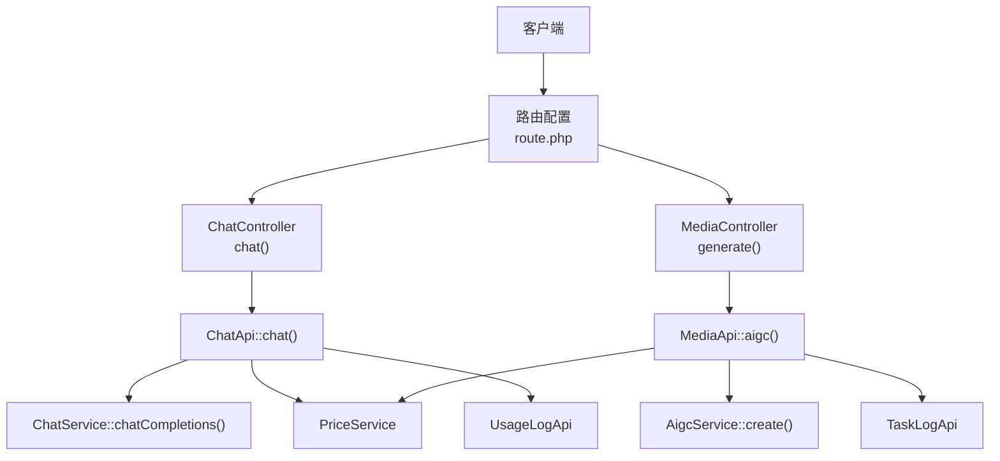
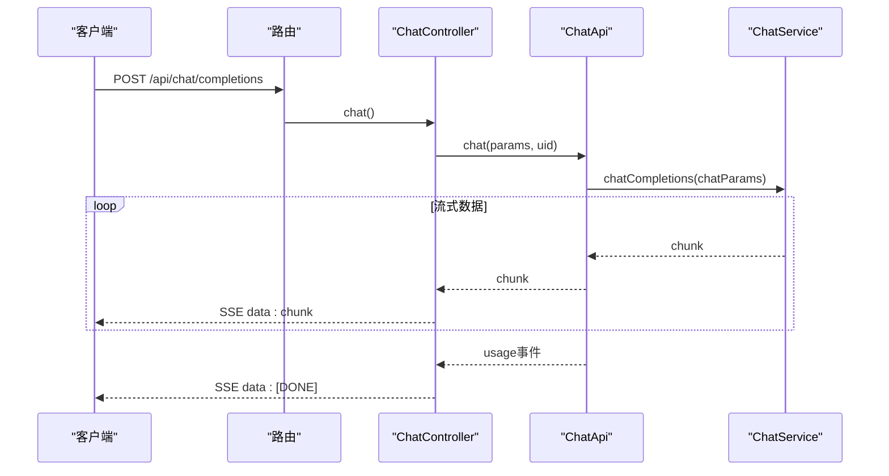
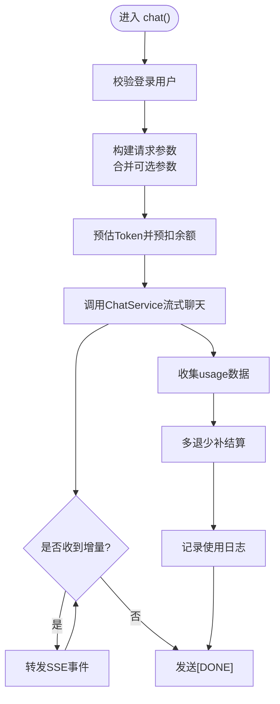
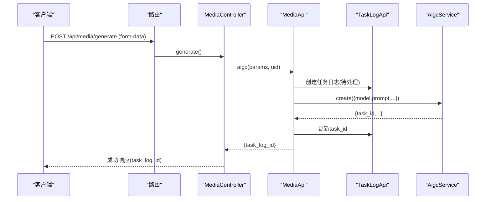
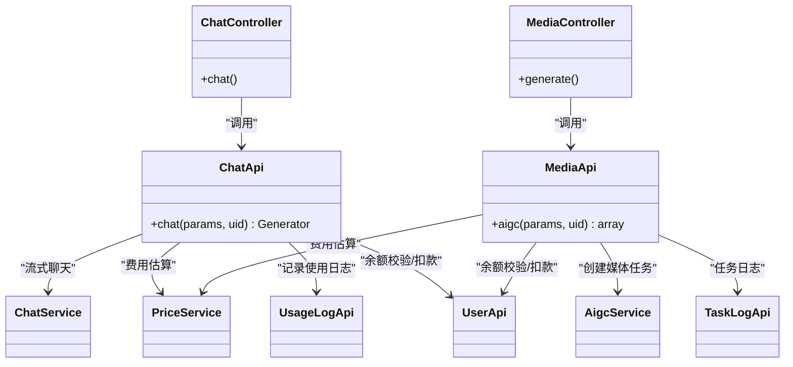

# AI模型接口

<cite>
**本文引用的文件**   
- [server/plugin/xbAiModelAgent/config/route.php](file://server/plugin/xbAiModelAgent/config/route.php)
- [server/plugin/xbAiModelAgent/app/api/controller/ChatController.php](file://server/plugin/xbAiModelAgent/app/api/controller/ChatController.php)
- [server/plugin/xbAiModelAgent/app/api/controller/MediaController.php](file://server/plugin/xbAiModelAgent/app/api/controller/MediaController.php)
- [server/plugin/xbAiModelAgent/api/ChatApi.php](file://server/plugin/xbAiModelAgent/api/ChatApi.php)
- [server/plugin/xbAiModelAgent/api/MediaApi.php](file://server/plugin/xbAiModelAgent/api/MediaApi.php)
</cite>

## 目录
1. [简介](#简介)
2. [项目结构](#项目结构)
3. [核心组件](#核心组件)
4. [架构总览](#架构总览)
5. [详细组件分析](#详细组件分析)
6. [依赖关系分析](#依赖关系分析)
7. [性能与并发建议](#性能与并发建议)
8. [错误处理与重试策略](#错误处理与重试策略)
9. [计费与统计](#计费与统计)
10. [常见问题排查](#常见问题排查)
11. [结论](#结论)

## 简介
本文件为AI模型代理模块的API接口文档，覆盖文本生成、图像生成、视频生成、音频生成等模态的调用方式。重点说明：
- 模型列表查询（通过模型ID选择）
- 任务提交（同步返回或异步任务）
- 进度跟踪（基于任务日志）
- 结果获取（SSE流式或任务轮询）
- 计费统计（预扣费、多退少补、使用记录）

同时给出参数规范、异步机制、错误处理与重试策略，以及性能优化建议。

## 项目结构
该模块采用“控制器-服务-外部服务”的分层设计：
- 路由定义：统一注册对外HTTP接口
- 控制器：接收请求、鉴权、透传参数、返回响应
- API层：业务编排、费用估算与预扣、任务创建与日志
- 服务层：对接第三方AIGC/聊天能力
- 枚举与常量：模态、状态、价格单位等

图表来源
- [server/plugin/xbAiModelAgent/config/route.php:1-13](file://server/plugin/xbAiModelAgent/config/route.php#L1-L13)
- [server/plugin/xbAiModelAgent/app/api/controller/ChatController.php:24-116](file://server/plugin/xbAiModelAgent/app/api/controller/ChatController.php#L24-L116)
- [server/plugin/xbAiModelAgent/app/api/controller/MediaController.php:89-99](file://server/plugin/xbAiModelAgent/app/api/controller/MediaController.php#L89-L99)
- [server/plugin/xbAiModelAgent/api/ChatApi.php:55-175](file://server/plugin/xbAiModelAgent/api/ChatApi.php#L55-L175)
- [server/plugin/xbAiModelAgent/api/MediaApi.php:46-152](file://server/plugin/xbAiModelAgent/api/MediaApi.php#L46-L152)

章节来源
- [server/plugin/xbAiModelAgent/config/route.php:1-13](file://server/plugin/xbAiModelAgent/config/route.php#L1-L13)

## 核心组件
- 文本聊天接口
  - 路径：POST /api/chat/completions
  - 特性：SSE流式返回，支持OpenAI风格参数透传，自动记录usage并结算
- 媒体生成接口
  - 路径：POST /api/media/generate
  - 特性：表单提交，支持图片/音频/视频；异步任务模式，返回task_log_id用于后续查询

章节来源
- [server/plugin/xbAiModelAgent/config/route.php:8-13](file://server/plugin/xbAiModelAgent/config/route.php#L8-L13)
- [server/plugin/xbAiModelAgent/app/api/controller/ChatController.php:26-45](file://server/plugin/xbAiModelAgent/app/api/controller/ChatController.php#L26-L45)
- [server/plugin/xbAiModelAgent/app/api/controller/MediaController.php:25-77](file://server/plugin/xbAiModelAgent/app/api/controller/MediaController.php#L25-L77)

## 架构总览
整体流程分为两类：
- 文本聊天：同步建立SSE长连接，逐块推送增量内容，结束后推送usage事件
- 媒体生成：同步创建任务并返回任务ID，后续通过任务日志查询进度与结果

图表来源
- [server/plugin/xbAiModelAgent/config/route.php:8-9](file://server/plugin/xbAiModelAgent/config/route.php#L8-L9)
- [server/plugin/xbAiModelAgent/app/api/controller/ChatController.php:87-114](file://server/plugin/xbAiModelAgent/app/api/controller/ChatController.php#L87-L114)
- [server/plugin/xbAiModelAgent/api/ChatApi.php:144-175](file://server/plugin/xbAiModelAgent/api/ChatApi.php#L144-L175)

## 详细组件分析

### 文本聊天接口（SSE）
- 端点：POST /api/chat/completions
- 认证：需登录用户（uid），未登录抛出未授权异常
- 请求体（JSON）
  - model: string，必填，模型ID
  - messages: array，必填，消息列表 [{role, content}]
  - temperature: float，可选，0~2
  - top_p: float，可选，0~1
  - n: int，可选，>=1
  - max_tokens: int，可选
  - max_completion_tokens: int，可选
  - stop: string|array，可选
  - presence_penalty: float，可选，-2~2
  - frequency_penalty: float，可选，-2~2
  - user: string，可选
  - tools: array，可选
  - tool_choice: string|object，可选
  - response_format: object，可选
  - seed: int，可选
  - reasoning_effort: string，可选，low/medium/high
- 响应
  - Content-Type: text/event-stream
  - 事件格式：data: JSON字符串，包含增量choices与最终usage事件
  - 结束标记：data: [DONE]
- 行为
  - 前置校验：模型存在性、余额校验（已登录用户）
  - 预扣费：按预估Token计算销售金额并预扣
  - 流式转发：逐块yield上游chunk，收集assistant内容与usage
  - 结算：流结束后根据实际usage进行多退少补，并写入使用日志

图表来源
- [server/plugin/xbAiModelAgent/app/api/controller/ChatController.php:46-114](file://server/plugin/xbAiModelAgent/app/api/controller/ChatController.php#L46-L114)
- [server/plugin/xbAiModelAgent/api/ChatApi.php:55-175](file://server/plugin/xbAiModelAgent/api/ChatApi.php#L55-L175)

章节来源
- [server/plugin/xbAiModelAgent/app/api/controller/ChatController.php:26-45](file://server/plugin/xbAiModelAgent/app/api/controller/ChatController.php#L26-L45)
- [server/plugin/xbAiModelAgent/api/ChatApi.php:55-175](file://server/plugin/xbAiModelAgent/api/ChatApi.php#L55-L175)

### 媒体生成接口（异步任务）
- 端点：POST /api/media/generate
- 认证：需登录用户（uid）
- 请求体（form-data）
  - model_id: string，必填，模型ID
  - prompt: string，必填，提示词
  - width: int，可选，默认1024
  - height: int，可选，默认1024
  - negative_prompt: string，可选
  - reference_image_urls: string[]，可选
  - duration: int/string，可选（音频/视频时长，秒）
- 响应
  - code/message/data
  - data.task_log_id: 任务日志ID，用于后续查询进度与结果
- 行为
  - 参数校验与模型解析
  - 费用估算与预扣（图片/视频/音频不同策略）
  - 创建任务日志（状态：待处理）
  - 调用AigcService创建外部任务，成功后回填task_id
  - 失败则更新任务日志为失败并退回预扣余额

图表来源
- [server/plugin/xbAiModelAgent/config/route.php:11-13](file://server/plugin/xbAiModelAgent/config/route.php#L11-L13)
- [server/plugin/xbAiModelAgent/app/api/controller/MediaController.php:89-99](file://server/plugin/xbAiModelAgent/app/api/controller/MediaController.php#L89-L99)
- [server/plugin/xbAiModelAgent/api/MediaApi.php:46-152](file://server/plugin/xbAiModelAgent/api/MediaApi.php#L46-L152)

章节来源
- [server/plugin/xbAiModelAgent/app/api/controller/MediaController.php:25-77](file://server/plugin/xbAiModelAgent/app/api/controller/MediaController.php#L25-L77)
- [server/plugin/xbAiModelAgent/api/MediaApi.php:46-152](file://server/plugin/xbAiModelAgent/api/MediaApi.php#L46-L152)

### 模型列表查询
- 当前路由未暴露独立的“模型列表”接口
- 前端可通过已知模型ID直接调用上述接口；如需动态获取模型清单，可在后端扩展模型查询接口并在路由中注册

章节来源
- [server/plugin/xbAiModelAgent/config/route.php:1-13](file://server/plugin/xbAiModelAgent/config/route.php#L1-L13)

## 依赖关系分析
- 控制器依赖API层完成业务编排
- API层依赖服务层与外部系统（ChatService/AigcService）
- 计费与统计依赖PriceService、UsageLogApi、TaskLogApi
- 用户资产依赖UserApi进行余额校验与扣款/退款

图表来源
- [server/plugin/xbAiModelAgent/app/api/controller/ChatController.php:24-116](file://server/plugin/xbAiModelAgent/app/api/controller/ChatController.php#L24-L116)
- [server/plugin/xbAiModelAgent/app/api/controller/MediaController.php:22-99](file://server/plugin/xbAiModelAgent/app/api/controller/MediaController.php#L22-L99)
- [server/plugin/xbAiModelAgent/api/ChatApi.php:55-175](file://server/plugin/xbAiModelAgent/api/ChatApi.php#L55-L175)
- [server/plugin/xbAiModelAgent/api/MediaApi.php:46-152](file://server/plugin/xbAiModelAgent/api/MediaApi.php#L46-L152)

章节来源
- [server/plugin/xbAiModelAgent/api/ChatApi.php:55-175](file://server/plugin/xbAiModelAgent/api/ChatApi.php#L55-L175)
- [server/plugin/xbAiModelAgent/api/MediaApi.php:46-152](file://server/plugin/xbAiModelAgent/api/MediaApi.php#L46-L152)

## 性能与并发建议
- 文本聊天
  - 使用SSE流式传输，避免大对象一次性返回
  - 合理设置max_tokens/max_completion_tokens控制输出长度
  - 对temperature/top_p进行调优以平衡质量与速度
- 媒体生成
  - 优先使用异步任务模式，降低请求超时风险
  - 选择合适的分辨率/时长档位，避免过大尺寸导致排队时间过长
  - 批量提交时控制并发度，避免对下游服务造成压力
- 通用
  - 客户端实现指数退避重试，针对网络抖动与限流场景
  - 对SSE连接增加心跳检测与断线重连逻辑

[本节为通用指导，不直接分析具体文件]

## 错误处理与重试策略
- 文本聊天
  - 未登录：抛出未授权异常
  - 模型不存在/参数错误：抛出运行时异常，SSE中返回error事件并以[DONE]结束
  - 余额不足：抛出运行时异常
  - 上游异常：捕获后在SSE中返回错误信息
- 媒体生成
  - 参数校验失败：抛出异常
  - 模型不存在：抛出异常
  - 任务创建失败：更新任务日志为失败，并尝试退回预扣余额
- 重试建议
  - 幂等键：建议在请求头携带唯一请求ID，便于服务端去重与追踪
  - 指数退避：初始间隔1s，最大间隔30s，最多重试3次
  - 仅对可重试错误（如网络错误、限流）执行重试，业务错误不应重试

章节来源
- [server/plugin/xbAiModelAgent/app/api/controller/ChatController.php:54-114](file://server/plugin/xbAiModelAgent/app/api/controller/ChatController.php#L54-L114)
- [server/plugin/xbAiModelAgent/api/ChatApi.php:55-175](file://server/plugin/xbAiModelAgent/api/ChatApi.php#L55-L175)
- [server/plugin/xbAiModelAgent/api/MediaApi.php:46-152](file://server/plugin/xbAiModelAgent/api/MediaApi.php#L46-L152)

## 计费与统计
- 文本聊天
  - 预扣费：基于messages与max_tokens估算输入/输出Token，计算销售金额并预扣
  - 结算：流结束后依据实际usage进行多退少补，差额±0.0001以内忽略
  - 日志：记录input/output/total tokens、成本与销售金额、消息摘要、状态与错误信息
- 媒体生成
  - 费用估算：按模态与参数（图片尺寸、视频时长/清晰度）计算成本与销售金额
  - 预扣与退款：创建任务前预扣，失败时退回；成功由后台结算
  - 日志：创建任务日志，记录参数、预估费用、状态与错误信息

章节来源
- [server/plugin/xbAiModelAgent/api/ChatApi.php:116-175](file://server/plugin/xbAiModelAgent/api/ChatApi.php#L116-L175)
- [server/plugin/xbAiModelAgent/api/MediaApi.php:65-152](file://server/plugin/xbAiModelAgent/api/MediaApi.php#L65-L152)

## 常见问题排查
- 未登录或token失效
  - 现象：返回未授权异常
  - 处理：检查登录态与鉴权中间件
- 模型ID无效
  - 现象：抛出“模型不存在”
  - 处理：确认模型ID是否在可用模型列表中
- 余额不足
  - 现象：抛出“余额不足，请先充值”
  - 处理：充值后再试
- 媒体任务创建失败
  - 现象：返回失败并可能触发退款
  - 处理：查看任务日志错误信息，必要时调整参数或重试
- SSE连接中断
  - 现象：客户端收不到后续事件
  - 处理：实现断线重连与心跳检测

章节来源
- [server/plugin/xbAiModelAgent/app/api/controller/ChatController.php:54-114](file://server/plugin/xbAiModelAgent/app/api/controller/ChatController.php#L54-L114)
- [server/plugin/xbAiModelAgent/api/MediaApi.php:140-152](file://server/plugin/xbAiModelAgent/api/MediaApi.php#L140-L152)

## 结论
本模块提供统一的AI模型网关接口，涵盖文本聊天与多媒体生成两大场景。文本聊天采用SSE流式传输，具备实时性与良好的用户体验；媒体生成采用异步任务模式，提升稳定性与可扩展性。计费体系支持预扣与多退少补，结合使用日志与任务日志，形成完整的可观测与审计闭环。建议在生产环境完善模型列表查询、任务进度查询与结果下载等配套接口，并强化客户端的重试与容错机制。