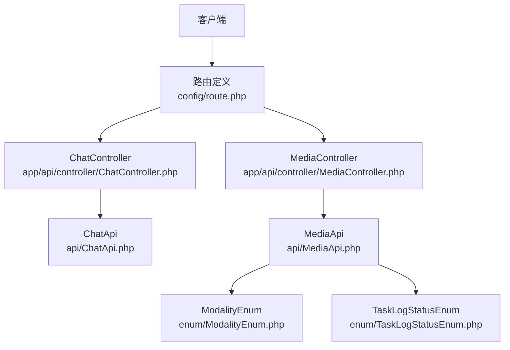
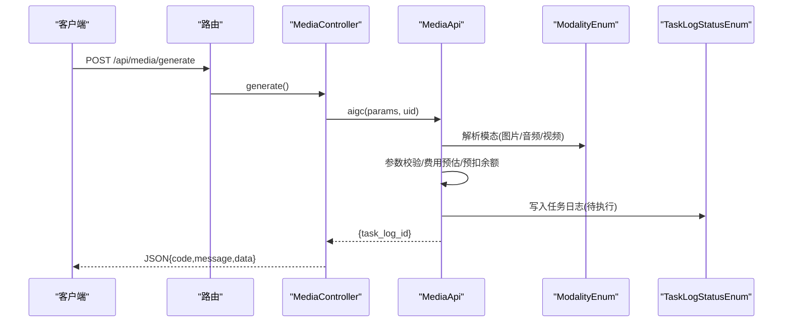
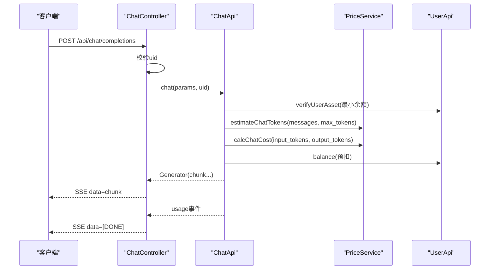
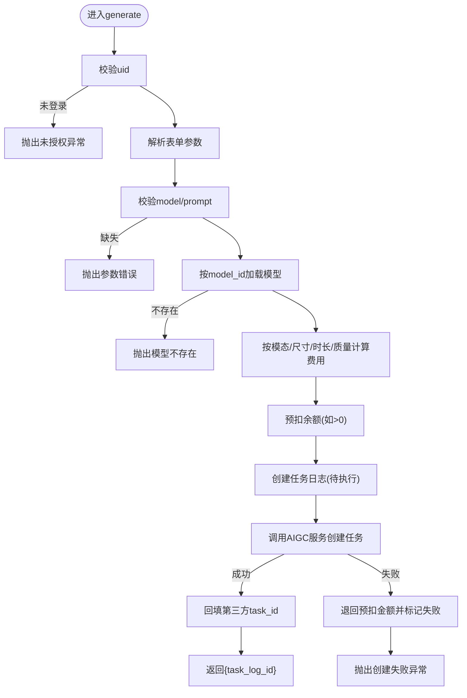
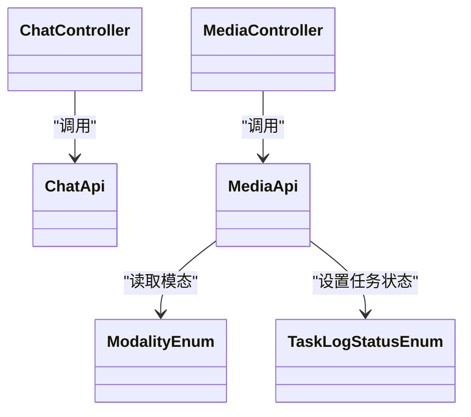

# 任务创建接口

<cite>
**本文引用的文件**   
- [route.php](file://server/plugin\xbAiModelAgent/config/route.php)
- [ChatController.php](file://server/plugin\xbAiModelAgent/app/api/controller/ChatController.php)
- [MediaController.php](file://server/plugin\xbAiModelAgent/app/api/controller/MediaController.php)
- [ChatApi.php](file://server/plugin\xbAiModelAgent/api/ChatApi.php)
- [MediaApi.php](file://server/plugin\xbAiModelAgent/api/MediaApi.php)
- [TaskLogStatusEnum.php](file://server/plugin\xbAiModelAgent/enum/TaskLogStatusEnum.php)
- [ModalityEnum.php](file://server/plugin\xbAiModelAgent/enum/ModalityEnum.php)
</cite>

## 目录
1. [简介](#简介)
2. [项目结构](#项目结构)
3. [核心组件](#核心组件)
4. [架构总览](#架构总览)
5. [详细组件分析](#详细组件分析)
6. [依赖关系分析](#依赖关系分析)
7. [性能与可靠性](#性能与可靠性)
8. [故障排查指南](#故障排查指南)
9. [结论](#结论)
10. [附录：请求示例与客户端实现要点](#附录请求示例与客户端实现要点)

## 简介
本文件为“AI模型任务创建”相关接口的权威文档，覆盖文本聊天（流式）与媒体生成（图片、音频、视频）两类任务的创建流程。重点说明：
- HTTP方法与URL模式
- 请求参数规范（必填/可选、类型、默认值、业务规则）
- 响应格式（含SSE事件与JSON返回）
- 任务状态、优先级与超时等配置说明
- 业务校验与错误处理机制
- 典型调用示例与客户端实现建议

## 项目结构
后端采用Webman路由+控制器+API层的分层组织方式，媒体与文本分别由不同控制器暴露统一入口或专用入口。

图表来源
- [route.php:1-13](file://server/plugin\xbAiModelAgent/config/route.php#L1-L13)
- [ChatController.php:1-116](file://server/plugin\xbAiModelAgent/app/api/controller/ChatController.php#L1-L116)
- [MediaController.php:1-100](file://server/plugin\xbAiModelAgent/app/api/controller/MediaController.php#L1-L100)
- [ChatApi.php:1-287](file://server/plugin\xbAiModelAgent/api/ChatApi.php#L1-L287)
- [MediaApi.php:1-203](file://server/plugin\xbAiModelAgent/api/MediaApi.php#L1-L203)
- [ModalityEnum.php:1-157](file://server/plugin\xbAiModelAgent/enum/ModalityEnum.php#L1-L157)
- [TaskLogStatusEnum.php:1-44](file://server/plugin\xbAiModelAgent/enum/TaskLogStatusEnum.php#L1-L44)

章节来源
- [route.php:1-13](file://server/plugin\xbAiModelAgent/config/route.php#L1-L13)

## 核心组件
- 路由层：集中声明HTTP端点与控制器映射
- 控制器层：接收请求、鉴权、透传参数、构造响应
- API层：业务编排（参数校验、费用预估与预扣、任务日志、第三方服务调用）
- 枚举层：模态类型、任务状态等常量定义

章节来源
- [ChatController.php:1-116](file://server/plugin\xbAiModelAgent/app/api/controller/ChatController.php#L1-L116)
- [MediaController.php:1-100](file://server/plugin\xbAiModelAgent/app/api/controller/MediaController.php#L1-L100)
- [ChatApi.php:1-287](file://server/plugin\xbAiModelAgent/api/ChatApi.php#L1-L287)
- [MediaApi.php:1-203](file://server/plugin\xbAiModelAgent/api/MediaApi.php#L1-L203)
- [ModalityEnum.php:1-157](file://server/plugin\xbAiModelAgent/enum/ModalityEnum.php#L1-L157)
- [TaskLogStatusEnum.php:1-44](file://server/plugin\xbAiModelAgent/enum/TaskLogStatusEnum.php#L1-L44)

## 架构总览
下图展示从客户端到控制器的端到端调用路径，以及媒体任务创建的关键分支逻辑。

图表来源
- [route.php:1-13](file://server/plugin\xbAiModelAgent/config/route.php#L1-L13)
- [MediaController.php:82-99](file://server/plugin\xbAiModelAgent/app/api/controller/MediaController.php#L82-L99)
- [MediaApi.php:46-152](file://server/plugin\xbAiModelAgent/api/MediaApi.php#L46-L152)
- [ModalityEnum.php:23-71](file://server/plugin\xbAiModelAgent/enum/ModalityEnum.php#L23-L71)
- [TaskLogStatusEnum.php:19-44](file://server/plugin\xbAiModelAgent/enum/TaskLogStatusEnum.php#L19-L44)

## 详细组件分析

### 文本聊天（流式）接口
- 方法：POST
- URL：/api/chat/completions
- 认证：需要登录用户（uid），未登录将抛出未授权异常
- 响应：SSE（text/event-stream），逐块推送OpenAI风格chunk；结束时发送[DONE]；异常时推送error事件后[DONE]
- 主要参数
  - 必填：model（字符串）、messages（数组，元素包含role/content）
  - 可选：temperature、top_p、n、max_tokens、max_completion_tokens、stop、presence_penalty、frequency_penalty、user、tools、tool_choice、response_format、seed、reasoning_effort
- 业务规则
  - 已登录用户需进行最低余额校验
  - 基于模型定价与消息估算Token进行预扣费，结束后多退少补并记录使用日志
- 错误处理
  - 参数缺失/非法：抛出运行时异常，SSE中返回error事件
  - 余额不足：抛出运行时异常，SSE中返回error事件
  - 上游服务异常：捕获后以error事件形式返回

图表来源
- [route.php:8-9](file://server/plugin\xbAiModelAgent/config/route.php#L8-L9)
- [ChatController.php:26-114](file://server/plugin\xbAiModelAgent/app/api/controller/ChatController.php#L26-L114)
- [ChatApi.php:55-175](file://server/plugin\xbAiModelAgent/api/ChatApi.php#L55-L175)

章节来源
- [route.php:8-9](file://server/plugin\xbAiModelAgent/config/route.php#L8-L9)
- [ChatController.php:26-114](file://server/plugin\xbAiModelAgent/app/api/controller/ChatController.php#L26-L114)
- [ChatApi.php:55-175](file://server/plugin\xbAiModelAgent/api/ChatApi.php#L55-L175)

### 媒体生成（图片/音频/视频）任务创建接口
- 方法：POST
- URL：/api/media/generate
- 认证：需要登录用户（uid），未登录将抛出未授权异常
- 请求体：formdata
- 通用字段
  - model_id（字符串，必填）：模型ID
  - prompt（字符串，必填）：提示词
  - width（整数，可选）：宽度
  - height（整数，可选）：高度
  - negative_prompt（字符串，可选）：反向提示词
  - reference_image_urls（字符串数组，可选）：参考图URL列表
  - duration/duration_seconds（整数/字符串，可选）：时长（秒），对音频/视频生效
  - quality（字符串，可选）：清晰度/质量键（用于视频计费策略选择）
- 返回
  - code（整数）：状态码
  - message（字符串）：提示信息
  - data（对象）：协议层返回的生成结果，至少包含task_log_id（整数）
- 业务规则
  - 根据model查询模型信息，不存在则报错
  - 根据模态与尺寸/时长/质量计算预估费用并对余额进行预扣
  - 创建任务日志（初始状态：待执行），成功后回填第三方任务ID
  - 若创建失败，回滚预扣金额并更新任务日志为失败
- 任务状态
  - 待执行、执行中、已完成、失败（见枚举）

图表来源
- [MediaController.php:82-99](file://server/plugin\xbAiModelAgent/app/api/controller/MediaController.php#L82-L99)
- [MediaApi.php:46-152](file://server/plugin\xbAiModelAgent/api/MediaApi.php#L46-L152)
- [TaskLogStatusEnum.php:19-44](file://server/plugin\xbAiModelAgent/enum/TaskLogStatusEnum.php#L19-L44)

章节来源
- [route.php:11-12](file://server/plugin\xbAiModelAgent/config/route.php#L11-L12)
- [MediaController.php:25-99](file://server/plugin\xbAiModelAgent/app/api/controller/MediaController.php#L25-L99)
- [MediaApi.php:46-152](file://server/plugin\xbAiModelAgent/api/MediaApi.php#L46-L152)
- [TaskLogStatusEnum.php:19-44](file://server/plugin\xbAiModelAgent/enum/TaskLogStatusEnum.php#L19-L44)

### 任务类型与模态
- 模态类型（数值编码）
  - 文本（聊天）：10
  - 图片：20
  - 音频：30
  - 视频：40
- 用途
  - 决定计费策略、参数映射（如duration映射为seconds）、默认值与下游服务类

章节来源
- [ModalityEnum.php:23-71](file://server/plugin\xbAiModelAgent/enum/ModalityEnum.php#L23-L71)

### 任务状态
- 待执行：10
- 执行中：20
- 已完成：30
- 失败：40

章节来源
- [TaskLogStatusEnum.php:19-44](file://server/plugin\xbAiModelAgent/enum/TaskLogStatusEnum.php#L19-L44)

## 依赖关系分析
- 控制器依赖API层完成业务编排
- API层依赖枚举确定模态与状态
- 媒体任务创建涉及用户资产服务与价格计算服务（在API层内调用）

图表来源
- [ChatController.php:1-116](file://server/plugin\xbAiModelAgent/app/api/controller/ChatController.php#L1-L116)
- [MediaController.php:1-100](file://server/plugin\xbAiModelAgent/app/api/controller/MediaController.php#L1-L100)
- [ChatApi.php:1-287](file://server/plugin\xbAiModelAgent/api/ChatApi.php#L1-L287)
- [MediaApi.php:1-203](file://server/plugin\xbAiModelAgent/api/MediaApi.php#L1-L203)
- [ModalityEnum.php:1-157](file://server/plugin\xbAiModelAgent/enum/ModalityEnum.php#L1-L157)
- [TaskLogStatusEnum.php:1-44](file://server/plugin\xbAiModelAgent/enum/TaskLogStatusEnum.php#L1-L44)

章节来源
- [ChatController.php:1-116](file://server/plugin\xbAiModelAgent/app/api/controller/ChatController.php#L1-L116)
- [MediaController.php:1-100](file://server/plugin\xbAiModelAgent/app/api/controller/MediaController.php#L1-L100)
- [ChatApi.php:1-287](file://server/plugin\xbAiModelAgent/api/ChatApi.php#L1-L287)
- [MediaApi.php:1-203](file://server/plugin\xbAiModelAgent/api/MediaApi.php#L1-L203)
- [ModalityEnum.php:1-157](file://server/plugin\xbAiModelAgent/enum/ModalityEnum.php#L1-L157)
- [TaskLogStatusEnum.php:1-44](file://server/plugin\xbAiModelAgent/enum/TaskLogStatusEnum.php#L1-L44)

## 性能与可靠性
- 文本聊天采用SSE流式传输，服务端逐块推送，降低首字节延迟
- 媒体任务为异步创建，立即返回任务ID，便于后续轮询或回调
- 预扣费与多退少补保证计费准确性，异常场景具备退款回滚逻辑
- 建议在客户端侧实现重试与幂等（例如携带client_request_id）

[本节为通用指导，不直接分析具体文件]

## 故障排查指南
- 未登录访问
  - 现象：抛出未授权异常
  - 定位：控制器uid校验处
- 参数缺失或非法
  - 现象：抛出参数错误
  - 定位：API层参数校验处
- 模型不存在
  - 现象：抛出模型不存在
  - 定位：API层按model_id加载模型处
- 余额不足
  - 现象：抛出余额不足
  - 定位：聊天接口余额前置校验处
- 任务创建失败
  - 现象：抛出创建失败异常，任务日志标记失败，预扣金额退回
  - 定位：媒体任务创建异常分支

章节来源
- [ChatController.php:48-56](file://server/plugin\xbAiModelAgent/app/api/controller/ChatController.php#L48-L56)
- [MediaController.php:91-95](file://server/plugin\xbAiModelAgent/app/api/controller/MediaController.php#L91-L95)
- [ChatApi.php:57-81](file://server/plugin\xbAiModelAgent/api/ChatApi.php#L57-L81)
- [MediaApi.php:49-63](file://server/plugin\xbAiModelAgent/api/MediaApi.php#L49-L63)
- [MediaApi.php:140-151](file://server/plugin\xbAiModelAgent/api/MediaApi.php#L140-L151)

## 结论
- 文本聊天提供标准SSE流式接口，兼容OpenAI风格事件
- 媒体任务通过统一入口创建，支持图片/音频/视频，自动完成费用预估、预扣与任务日志管理
- 通过枚举明确模态与状态，便于扩展与维护
- 建议在客户端做好网络容错、SSE解析与任务状态轮询

[本节为总结性内容，不直接分析具体文件]

## 附录：请求示例与客户端实现要点

### 文本聊天（SSE）
- 方法：POST
- URL：/api/chat/completions
- 请求头：Content-Type: application/json
- 请求体关键字段
  - model（字符串，必填）
  - messages（数组，必填）
  - temperature/top_p/n/max_tokens等（可选）
- 响应：SSE事件流
  - data: OpenAI风格的增量片段
  - data: {"type":"usage","usage":{...}}（可能）
  - data: [DONE]
- 客户端要点
  - 使用支持SSE的HTTP客户端
  - 逐块拼接assistant.content
  - 监听usage事件统计token用量
  - 遇到error事件终止并提示

章节来源
- [route.php:8-9](file://server/plugin\xbAiModelAgent/config/route.php#L8-L9)
- [ChatController.php:26-114](file://server/plugin\xbAiModelAgent/app/api/controller/ChatController.php#L26-L114)
- [ChatApi.php:55-175](file://server/plugin\xbAiModelAgent/api/ChatApi.php#L55-L175)

### 媒体生成（图片/音频/视频）
- 方法：POST
- URL：/api/media/generate
- 请求头：Content-Type: multipart/form-data
- 请求体关键字段
  - model_id（字符串，必填）
  - prompt（字符串，必填）
  - width/height（整数，可选）
  - duration/duration_seconds（整数/字符串，可选，音频/视频）
  - negative_prompt（字符串，可选）
  - reference_image_urls（字符串数组，可选）
  - quality（字符串，可选，视频计费策略）
- 响应：JSON
  - code（整数）
  - message（字符串）
  - data.task_log_id（整数）
- 客户端要点
  - 提交multipart表单
  - 保存task_log_id用于后续查询任务状态
  - 合理轮询间隔与最大重试次数

章节来源
- [route.php:11-12](file://server/plugin\xbAiModelAgent/config/route.php#L11-L12)
- [MediaController.php:25-99](file://server/plugin\xbAiModelAgent/app/api/controller/MediaController.php#L25-L99)
- [MediaApi.php:46-152](file://server/plugin\xbAiModelAgent/api/MediaApi.php#L46-L152)

### 任务类型、优先级与超时
- 任务类型：由model_id对应的模型元数据中的modality决定（文本/图片/音频/视频）
- 优先级：当前代码未暴露显式优先级参数
- 超时：当前代码未暴露显式超时参数；SSE连接由底层HTTP服务器管理

章节来源
- [ModalityEnum.php:23-71](file://server/plugin\xbAiModelAgent/enum/ModalityEnum.php#L23-L71)
- [ChatController.php:87-114](file://server/plugin\xbAiModelAgent/app/api/controller/ChatController.php#L87-L114)