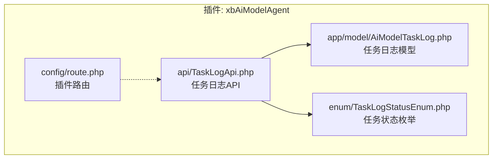
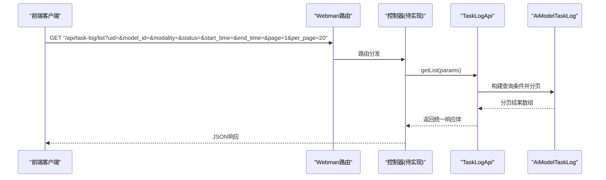
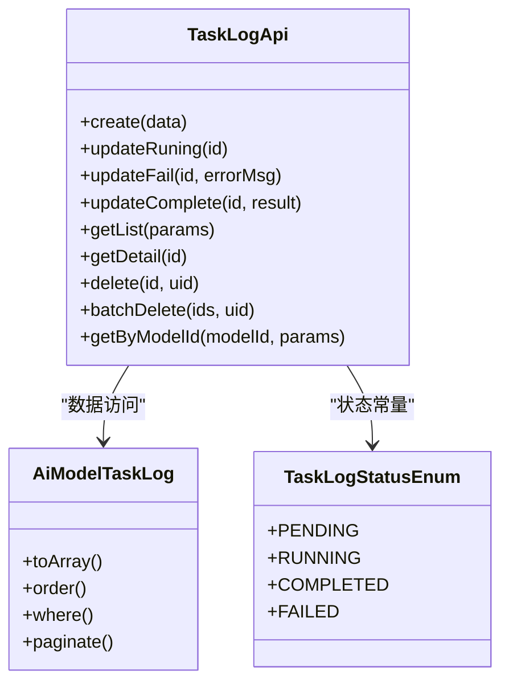

# 任务状态查询接口

<cite>
**本文引用的文件**   
- [TaskLogApi.php](file://server/plugin/xbAiModelAgent/api/TaskLogApi.php)
- [TaskLogStatusEnum.php](file://server/plugin/xbAiModelAgent/enum/TaskLogStatusEnum.php)
- [AiModelTaskLog.php](file://server/plugin/xbAiModelAgent/app/model/AiModelTaskLog.php)
- [route.php](file://server/plugin/xbAiModelAgent/config/route.php)
</cite>

## 目录
1. [简介](#简介)
2. [项目结构](#项目结构)
3. [核心组件](#核心组件)
4. [架构总览](#架构总览)
5. [详细组件分析](#详细组件分析)
6. [依赖分析](#依赖分析)
7. [性能考虑](#性能考虑)
8. [故障排查指南](#故障排查指南)
9. [结论](#结论)
10. [附录](#附录)

## 简介
本文件为“AI模型任务状态查询”相关接口的技术文档，聚焦于：
- 任务状态获取的HTTP方法与URL模式、查询参数
- 任务状态枚举值及其含义
- 批量查询、分页查询、条件筛选等高级查询能力
- 状态轮询最佳实践与WebSocket实时通知方案
- 具体调用示例与错误处理建议

说明：
- 当前仓库中已实现任务日志API类与状态枚举，但尚未在插件路由中暴露任务状态查询的HTTP端点。本文基于现有代码给出接口规范与扩展建议，便于后续快速落地。

## 项目结构
与本主题相关的后端代码位于插件 xbAiModelAgent 下，包含：
- API层：任务日志API（创建、更新、列表、详情、删除、批量删除）
- 枚举层：任务日志状态定义
- 模型层：任务日志数据模型（含字段转换与软删除）
- 路由层：插件路由注册（当前未包含任务状态查询路由）

图表来源
- [TaskLogApi.php:1-263](file://server/plugin/xbAiModelAgent/api/TaskLogApi.php#L1-L263)
- [AiModelTaskLog.php:1-211](file://server/plugin/xbAiModelAgent/app/model/AiModelTaskLog.php#L1-L211)
- [TaskLogStatusEnum.php:1-44](file://server/plugin/xbAiModelAgent/enum/TaskLogStatusEnum.php#L1-L44)
- [route.php:1-13](file://server/plugin/xbAiModelAgent/config/route.php#L1-L13)

章节来源
- [TaskLogApi.php:1-263](file://server/plugin/xbAiModelAgent/api/TaskLogApi.php#L1-L263)
- [TaskLogStatusEnum.php:1-44](file://server/plugin/xbAiModelAgent/enum/TaskLogStatusEnum.php#L1-L44)
- [AiModelTaskLog.php:1-211](file://server/plugin/xbAiModelAgent/app/model/AiModelTaskLog.php#L1-L211)
- [route.php:1-13](file://server/plugin/xbAiModelAgent/config/route.php#L1-L13)

## 核心组件
- 任务日志API（TaskLogApi）
  - 提供创建、更新（执行中/失败/完成）、列表（分页+筛选）、详情、删除、批量删除、按模型ID查询等方法
  - 列表方法支持用户ID、模型ID、模态类型、状态、时间范围等筛选
- 任务状态枚举（TaskLogStatusEnum）
  - 定义待执行、执行中、已完成、失败四种状态及对应数值
- 任务日志模型（AiModelTaskLog）
  - 提供JSON字段自动序列化/反序列化、金额字段规范化、状态文本获取器、分辨率组合获取器等

章节来源
- [TaskLogApi.php:46-263](file://server/plugin/xbAiModelAgent/api/TaskLogApi.php#L46-L263)
- [TaskLogStatusEnum.php:19-44](file://server/plugin/xbAiModelAgent/enum/TaskLogStatusEnum.php#L19-L44)
- [AiModelTaskLog.php:22-211](file://server/plugin/xbAiModelAgent/app/model/AiModelTaskLog.php#L22-L211)

## 架构总览
从前端到后端的典型调用链路如下：
- 前端发起HTTP请求（GET /api/task-log/list）
- Webman路由转发至控制器（待补充）
- 控制器调用 TaskLogApi::getList(params)
- 模型 AiModelTaskLog 进行条件构建与分页查询
- 返回分页结果（含数据列表与分页元信息）

图表来源
- [TaskLogApi.php:155-188](file://server/plugin/xbAiModelAgent/api/TaskLogApi.php#L155-L188)
- [AiModelTaskLog.php:1-211](file://server/plugin/xbAiModelAgent/app/model/AiModelTaskLog.php#L1-L211)

## 详细组件分析

### 接口定义：任务状态查询
- HTTP方法：GET
- URL模式：/api/task-log/list
- 认证方式：由系统鉴权中间件控制（例如JWT），需携带有效令牌
- 查询参数：
  - uid: 用户ID（可选）
  - model_id: 模型ID（可选）
  - modality: 模态类型（可选）
  - status: 任务状态（可选；见下方枚举）
  - start_time: 开始时间（可选；格式建议 YYYY-MM-DD HH:mm:ss）
  - end_time: 结束时间（可选；同上）
  - page: 页码（默认1）
  - per_page: 每页条数（默认20）
- 响应体（分页）：
  - data: 任务记录数组
  - total: 总数
  - current_page: 当前页
  - per_page: 每页条数
  - last_page: 最后一页
- 成功示例（示意）：
  - { "code": 0, "data": { "list": [...], "total": 120, "current_page": 1, "per_page": 20, "last_page": 6 } }

注意：
- 当前插件路由未注册该端点，需在路由文件中新增映射至控制器，再由控制器调用 TaskLogApi::getList()。

章节来源
- [TaskLogApi.php:155-188](file://server/plugin/xbAiModelAgent/api/TaskLogApi.php#L155-L188)
- [route.php:1-13](file://server/plugin/xbAiModelAgent/config/route.php#L1-L13)

### 接口定义：任务状态详情
- HTTP方法：GET
- URL模式：/api/task-log/detail?id={id}
- 响应体：单条任务记录（若不存在则返回空或错误）
- 适用场景：查看某次任务的完整上下文（参数、结果、耗时、错误信息等）

章节来源
- [TaskLogApi.php:246-250](file://server/plugin/xbAiModelAgent/api/TaskLogApi.php#L246-L250)

### 接口定义：按模型ID查询任务
- HTTP方法：GET
- URL模式：/api/task-log/by-model/{modelId}?status=&page=&per_page=...
- 行为：内部复用列表查询逻辑，仅固定 model_id 为路径参数
- 适用场景：针对某一模型的产出历史与状态追踪

章节来源
- [TaskLogApi.php:258-262](file://server/plugin/xbAiModelAgent/api/TaskLogApi.php#L258-L262)

### 接口定义：批量删除任务日志
- HTTP方法：POST
- URL模式：/api/task-log/batch-delete
- 请求体：{ "ids": [1,2,3], "uid": 用户ID }
- 行为：校验归属后批量删除，返回成功删除数量
- 错误：当传入空集合或无权限时抛出异常

章节来源
- [TaskLogApi.php:220-239](file://server/plugin/xbAiModelAgent/api/TaskLogApi.php#L220-L239)

### 接口定义：删除任务日志
- HTTP方法：DELETE
- URL模式：/api/task-log/delete?id={id}&uid={uid}
- 行为：校验归属后删除单条记录

章节来源
- [TaskLogApi.php:199-209](file://server/plugin/xbAiModelAgent/api/TaskLogApi.php#L199-L209)

### 任务状态枚举
- 待执行：value=10
- 执行中：value=20
- 已完成：value=30
- 失败：value=40

使用建议：
- 列表查询时通过 status 参数过滤
- 前端展示可使用枚举提供的 label 或自行映射

章节来源
- [TaskLogStatusEnum.php:19-44](file://server/plugin/xbAiModelAgent/enum/TaskLogStatusEnum.php#L19-L44)

### 数据模型要点
- 软删除：delete_at 标记删除时间
- JSON字段自动解析：params、result 字段读写时自动序列化/反序列化
- 金额字段规范化：cost_amount、sale_amount、pre_deduct_amount、upstream_actual_cost、refund_amount 统一转为浮点数
- 辅助属性：resolution 将 width/height 组合为字符串；status_text 根据状态值返回可读文本

章节来源
- [AiModelTaskLog.php:22-211](file://server/plugin/xbAiModelAgent/app/model/AiModelTaskLog.php#L22-L211)

### 状态轮询最佳实践
- 轮询策略
  - 初始间隔：1~3秒
  - 指数退避：最大间隔不超过30秒，避免频繁请求
  - 终止条件：状态为“已完成”或“失败”即停止
- 并发控制
  - 同一任务只允许一个轮询实例
  - 页面切换或组件卸载时取消轮询
- 用户体验
  - 首次拉取后立即进入轮询
  - 网络异常时重试并重设间隔
  - 长时间未完成时提示用户稍后再试

[本节为通用实践建议，不直接分析具体文件]

### WebSocket实时通知方案（建议）
- 连接建立
  - 前端在任务提交成功后建立WebSocket连接，附带任务ID与用户标识
- 服务端推送
  - 任务状态变更时，服务端向对应任务ID的订阅者推送最新状态
- 前端处理
  - 收到消息后更新UI，并在终态（已完成/失败）关闭连接
- 降级策略
  - 连接失败或断开时回退到轮询，直至恢复

[本节为概念性方案，不直接分析具体文件]

## 依赖分析
- 组件耦合
  - TaskLogApi 依赖 AiModelTaskLog 进行数据访问
  - TaskLogApi 使用 TaskLogStatusEnum 的状态值进行状态更新
- 外部依赖
  - ThinkORM 的分页与查询构造器
  - Webman 路由框架（用于HTTP入口）

图表来源
- [TaskLogApi.php:46-263](file://server/plugin/xbAiModelAgent/api/TaskLogApi.php#L46-L263)
- [AiModelTaskLog.php:1-211](file://server/plugin/xbAiModelAgent/app/model/AiModelTaskLog.php#L1-L211)
- [TaskLogStatusEnum.php:19-44](file://server/plugin/xbAiModelAgent/enum/TaskLogStatusEnum.php#L19-L44)

章节来源
- [TaskLogApi.php:46-263](file://server/plugin/xbAiModelAgent/api/TaskLogApi.php#L46-L263)
- [AiModelTaskLog.php:1-211](file://server/plugin/xbAiModelAgent/app/model/AiModelTaskLog.php#L1-L211)
- [TaskLogStatusEnum.php:19-44](file://server/plugin/xbAiModelAgent/enum/TaskLogStatusEnum.php#L19-L44)

## 性能考虑
- 索引建议
  - 对 uid、model_id、status、create_at 建立合适索引以优化筛选与排序
- 分页限制
  - 限制 per_page 最大值，防止大数据量一次性加载
- 缓存策略
  - 对热点模型的任务列表可引入短时缓存（如Redis），结合失效策略
- 查询优化
  - 避免不必要的字段返回，按需选择字段
  - 时间范围查询尽量精确，减少扫描范围

[本节为通用性能建议，不直接分析具体文件]

## 故障排查指南
- 常见异常
  - 任务日志不存在：更新/删除操作前需校验记录存在
  - 无权删除：删除时需校验 uid 归属
  - 批量删除失败：传入空集合或无任何匹配记录时会抛错
- 定位步骤
  - 检查路由是否已注册目标端点
  - 确认鉴权中间件是否正确放行
  - 核对查询参数是否符合预期（特别是时间与状态值）
  - 查看数据库索引与慢查询日志
- 日志与监控
  - 关键操作（创建、状态变更、删除）记录审计日志
  - 对高频查询接口设置告警阈值

章节来源
- [TaskLogApi.php:64-148](file://server/plugin/xbAiModelAgent/api/TaskLogApi.php#L64-L148)
- [TaskLogApi.php:199-239](file://server/plugin/xbAiModelAgent/api/TaskLogApi.php#L199-L239)

## 结论
- 任务状态查询的核心能力已在 TaskLogApi 与 AiModelTaskLog 中实现，包括分页、筛选与详情获取
- 当前插件路由未暴露任务状态查询端点，建议在 route.php 中新增路由并对接控制器
- 建议配合WebSocket实现实时状态推送，提升用户体验
- 遵循轮询最佳实践与性能优化建议，确保在高并发场景下的稳定性与效率

[本节为总结性内容，不直接分析具体文件]

## 附录

### 接口清单与参数速查
- GET /api/task-log/list
  - 参数：uid、model_id、modality、status、start_time、end_time、page、per_page
- GET /api/task-log/detail?id={id}
- GET /api/task-log/by-model/{modelId}?status=&page=&per_page=...
- POST /api/task-log/batch-delete
  - 请求体：ids[]、uid
- DELETE /api/task-log/delete?id={id}&uid={uid}

章节来源
- [TaskLogApi.php:155-263](file://server/plugin/xbAiModelAgent/api/TaskLogApi.php#L155-L263)

### 状态枚举对照表
- 待执行：10
- 执行中：20
- 已完成：30
- 失败：40

章节来源
- [TaskLogStatusEnum.php:19-44](file://server/plugin/xbAiModelAgent/enum/TaskLogStatusEnum.php#L19-L44)