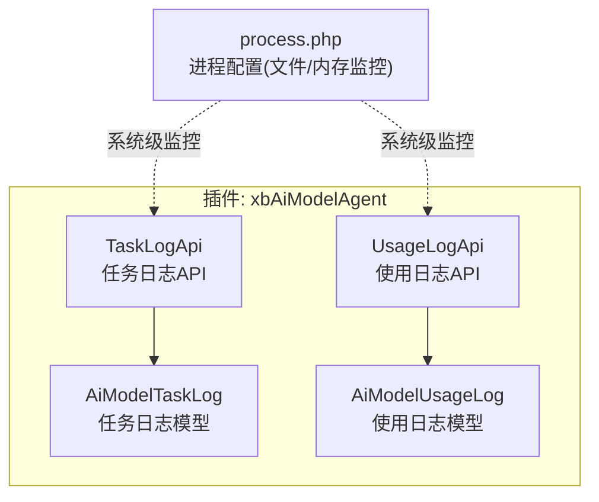
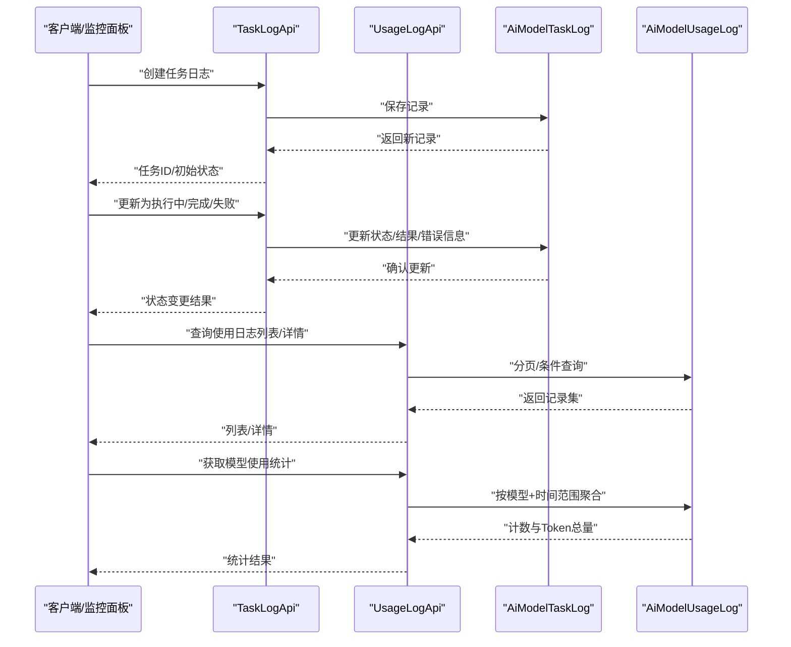
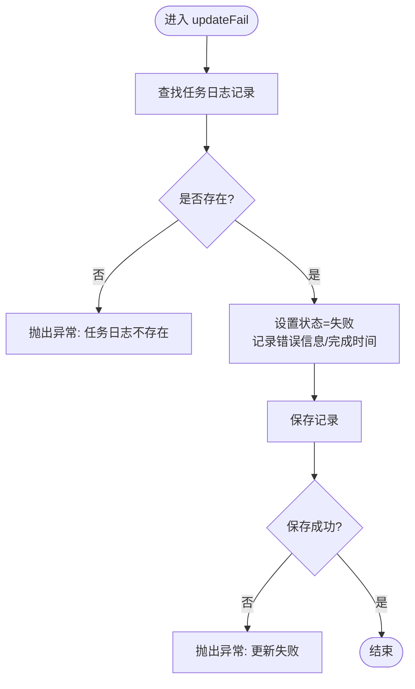
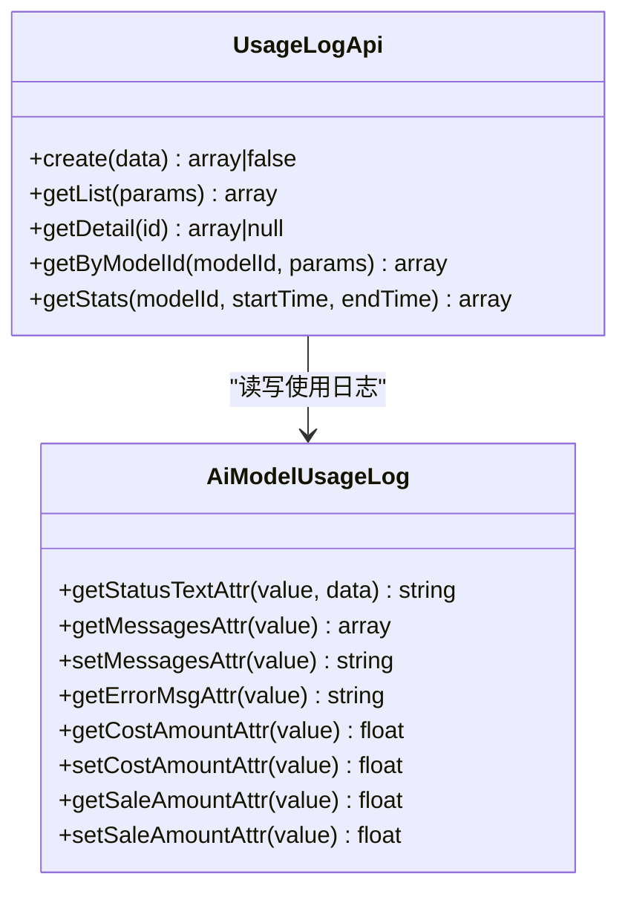
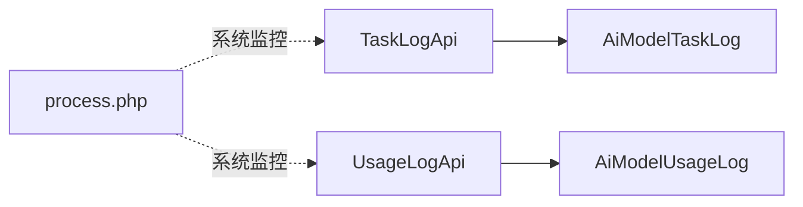

# 任务监控接口

<cite>
**本文引用的文件**   
- [TaskLogApi.php](file://server/plugin/xbAiModelAgent/api/TaskLogApi.php)
- [UsageLogApi.php](file://server/plugin/xbAiModelAgent/api/UsageLogApi.php)
- [AiModelTaskLog.php](file://server/plugin/xbAiModelAgent/app/model/AiModelTaskLog.php)
- [AiModelUsageLog.php](file://server/plugin/xbAiModelAgent/app/model/AiModelUsageLog.php)
- [process.php](file://server/config/process.php)
</cite>

## 目录
1. [简介](#简介)
2. [项目结构](#项目结构)
3. [核心组件](#核心组件)
4. [架构总览](#架构总览)
5. [详细组件分析](#详细组件分析)
6. [依赖关系分析](#依赖关系分析)
7. [性能与扩展性](#性能与扩展性)
8. [故障排查指南](#故障排查指南)
9. [结论](#结论)
10. [附录：API 参考](#附录api-参考)

## 简介
本文件面向“AI模型任务监控系统”的监控接口，聚焦以下能力：
- 任务进度跟踪：创建、更新状态（执行中/完成/失败）、查询列表与详情。
- 资源使用与用量统计：按模型维度聚合输入/输出 Token 与调用次数等指标。
- 实时监控数据获取方式与数据格式：基于分页列表与统计聚合接口返回标准 JSON。
- 告警规则配置、异常检测、日志聚合：结合枚举状态与错误字段进行阈值判定与异常识别。
- 监控面板集成方案与自定义指标扩展方法：通过新增字段与统计逻辑实现扩展。
- 存储策略与历史查询：基于数据库持久化，支持多条件筛选与时间范围查询。

## 项目结构
与监控相关的关键代码位于插件 xbAiModelAgent 下，包含 API 层与模型层：
- API 层
  - TaskLogApi：任务日志的增删改查与状态流转。
  - UsageLogApi：使用日志的增删改查与统计聚合。
- 模型层
  - AiModelTaskLog：任务日志实体，提供软删除、JSON 序列化/反序列化、金额类型转换等。
  - AiModelUsageLog：使用日志实体，提供消息记录、错误信息、金额类型转换等。
- 进程配置
  - process.php：定义开发期文件监听与内存监控等运行时监控能力（非业务监控接口）。

图表来源
- [TaskLogApi.php:1-263](file://server/plugin/xbAiModelAgent/api/TaskLogApi.php#L1-L263)
- [UsageLogApi.php:1-153](file://server/plugin/xbAiModelAgent/api/UsageLogApi.php#L1-L153)
- [AiModelTaskLog.php:1-211](file://server/plugin/xbAiModelAgent/app/model/AiModelTaskLog.php#L1-L211)
- [AiModelUsageLog.php:1-111](file://server/plugin/xbAiModelAgent/app/model/AiModelUsageLog.php#L1-L111)
- [process.php:1-43](file://server/config/process.php#L1-L43)

章节来源
- [TaskLogApi.php:1-263](file://server/plugin/xbAiModelAgent/api/TaskLogApi.php#L1-L263)
- [UsageLogApi.php:1-153](file://server/plugin/xbAiModelAgent/api/UsageLogApi.php#L1-L153)
- [AiModelTaskLog.php:1-211](file://server/plugin/xbAiModelAgent/app/model/AiModelTaskLog.php#L1-L211)
- [AiModelUsageLog.php:1-111](file://server/plugin/xbAiModelAgent/app/model/AiModelUsageLog.php#L1-L111)
- [process.php:1-43](file://server/config/process.php#L1-L43)

## 核心组件
- 任务日志 API（TaskLogApi）
  - 职责：创建任务日志、更新任务状态（执行中/完成/失败）、查询列表与详情、按模型ID查询、批量删除。
  - 关键能力：状态机式更新、错误信息记录、归属校验（uid）与批量操作。
- 使用日志 API（UsageLogApi）
  - 职责：记录每次模型调用的用量与结果、查询列表与详情、按模型ID查询、统计聚合。
  - 关键能力：成功态过滤、时间范围过滤、Token 总量与调用次数汇总。
- 模型层（AiModelTaskLog / AiModelUsageLog）
  - 职责：数据存取、JSON 字段自动序列化/反序列化、金额字段类型安全、状态文本映射。
  - 关键能力：软删除、附加属性（如分辨率组合）、错误信息默认值处理。

章节来源
- [TaskLogApi.php:1-263](file://server/plugin/xbAiModelAgent/api/TaskLogApi.php#L1-L263)
- [UsageLogApi.php:1-153](file://server/plugin/xbAiModelAgent/api/UsageLogApi.php#L1-L153)
- [AiModelTaskLog.php:1-211](file://server/plugin/xbAiModelAgent/app/model/AiModelTaskLog.php#L1-L211)
- [AiModelUsageLog.php:1-111](file://server/plugin/xbAiModelAgent/app/model/AiModelUsageLog.php#L1-L111)

## 架构总览
监控数据流从业务侧写入任务/使用日志，API 层提供查询与统计能力；系统级进程监控用于开发期热重载与内存监控，不直接参与业务监控数据。

图表来源
- [TaskLogApi.php:46-148](file://server/plugin/xbAiModelAgent/api/TaskLogApi.php#L46-L148)
- [UsageLogApi.php:45-153](file://server/plugin/xbAiModelAgent/api/UsageLogApi.php#L45-L153)
- [AiModelTaskLog.php:1-211](file://server/plugin/xbAiModelAgent/app/model/AiModelTaskLog.php#L1-L211)
- [AiModelUsageLog.php:1-111](file://server/plugin/xbAiModelAgent/app/model/AiModelUsageLog.php#L1-L111)

## 详细组件分析

### 任务日志 API（TaskLogApi）
- 主要方法
  - create(data)：创建任务日志记录。
  - updateRuning(id)：将任务置为“执行中”。
  - updateComplete(id, result)：将任务置为“已完成”，并记录结果。
  - updateFail(id, errorMsg)：将任务置为“失败”，并记录错误信息。
  - getList(params)：分页查询，支持 uid、model_id、modality、status、start_time、end_time 等筛选。
  - getDetail(id)：获取单条任务日志详情。
  - delete(id, uid) / batchDelete(ids, uid)：删除自身日志或批量删除，含归属校验。
  - updateAiTaskId(id, aiTaskId)：绑定上游 AI 任务 ID。
  - getByModelId(modelId, params)：按模型ID查询任务日志。
- 状态与错误
  - 状态来自 TaskLogStatusEnum（运行中/完成/失败等），错误信息在失败时记录。
- 数据格式
  - 列表返回分页结构（data、total、per_page、current_page、last_page 等）。
  - 详情返回完整记录，包含参数、结果、金额字段等。

图表来源
- [TaskLogApi.php:109-123](file://server/plugin/xbAiModelAgent/api/TaskLogApi.php#L109-L123)

章节来源
- [TaskLogApi.php:1-263](file://server/plugin/xbAiModelAgent/api/TaskLogApi.php#L1-L263)
- [AiModelTaskLog.php:1-211](file://server/plugin/xbAiModelAgent/app/model/AiModelTaskLog.php#L1-L211)

### 使用日志 API（UsageLogApi）
- 主要方法
  - create(data)：创建使用日志记录。
  - getList(params)：分页查询，支持 uid、model_id、status、start_time、end_time 等筛选。
  - getDetail(id)：获取单条使用日志详情。
  - getByModelId(modelId, params)：按模型ID查询使用日志。
  - getStats(modelId, startTime, endTime)：统计成功调用次数与 Token 总量（输入/输出/合计）。
- 统计口径
  - 仅统计 status=成功的记录。
  - 聚合字段包括 total_count、total_input_tokens、total_output_tokens、total_tokens。

图表来源
- [UsageLogApi.php:1-153](file://server/plugin/xbAiModelAgent/api/UsageLogApi.php#L1-L153)
- [AiModelUsageLog.php:1-111](file://server/plugin/xbAiModelAgent/app/model/AiModelUsageLog.php#L1-L111)

章节来源
- [UsageLogApi.php:1-153](file://server/plugin/xbAiModelAgent/api/UsageLogApi.php#L1-L153)
- [AiModelUsageLog.php:1-111](file://server/plugin/xbAiModelAgent/app/model/AiModelUsageLog.php#L1-L111)

### 模型层特性（AiModelTaskLog / AiModelUsageLog）
- 通用特性
  - JSON 字段自动序列化/反序列化：params、result、messages 等。
  - 金额字段类型安全：cost_amount、sale_amount、pre_deduct_amount、upstream_actual_cost、refund_amount 等统一为浮点。
  - 状态文本映射：status_text 由对应枚举提供可读文本。
- 任务日志特有
  - 软删除：delete_at 标记删除时间。
  - 附加属性 resolution：根据 width/height 生成“宽x高”字符串。

章节来源
- [AiModelTaskLog.php:1-211](file://server/plugin/xbAiModelAgent/app/model/AiModelTaskLog.php#L1-L211)
- [AiModelUsageLog.php:1-111](file://server/plugin/xbAiModelAgent/app/model/AiModelUsageLog.php#L1-L111)

## 依赖关系分析
- API 到模型的依赖
  - TaskLogApi 依赖 AiModelTaskLog 进行任务日志的 CRUD 与状态更新。
  - UsageLogApi 依赖 AiModelUsageLog 进行使用日志的 CRUD 与统计聚合。
- 系统级监控依赖
  - process.php 配置了文件监听与内存监控，属于系统运行期监控，不影响业务监控接口。

图表来源
- [TaskLogApi.php:1-263](file://server/plugin/xbAiModelAgent/api/TaskLogApi.php#L1-L263)
- [UsageLogApi.php:1-153](file://server/plugin/xbAiModelAgent/api/UsageLogApi.php#L1-L153)
- [AiModelTaskLog.php:1-211](file://server/plugin/xbAiModelAgent/app/model/AiModelTaskLog.php#L1-L211)
- [AiModelUsageLog.php:1-111](file://server/plugin/xbAiModelAgent/app/model/AiModelUsageLog.php#L1-L111)
- [process.php:1-43](file://server/config/process.php#L1-L43)

章节来源
- [TaskLogApi.php:1-263](file://server/plugin/xbAiModelAgent/api/TaskLogApi.php#L1-L263)
- [UsageLogApi.php:1-153](file://server/plugin/xbAiModelAgent/api/UsageLogApi.php#L1-L153)
- [AiModelTaskLog.php:1-211](file://server/plugin/xbAiModelAgent/app/model/AiModelTaskLog.php#L1-L211)
- [AiModelUsageLog.php:1-111](file://server/plugin/xbAiModelAgent/app/model/AiModelUsageLog.php#L1-L111)
- [process.php:1-43](file://server/config/process.php#L1-L43)

## 性能与扩展性
- 查询性能
  - 列表接口均支持分页与多维度筛选（用户、模型、模态、状态、时间范围），建议在数据库层对常用筛选字段建立索引以提升性能。
- 统计性能
  - getStats 仅对成功记录进行聚合，建议对 model_id、status、create_at 建立复合索引以优化时间范围聚合。
- 扩展性
  - 新增自定义指标：在 AiModelUsageLog 增加字段并在 UsageLogApi::getStats 中追加聚合逻辑。
  - 新增监控维度：在 AiModelTaskLog 增加字段并在 TaskLogApi::getList 中增加筛选条件。
  - 实时推送：可在现有 API 基础上引入 WebSocket/SSE 通道，将状态变更事件推送到前端监控面板。

[本节为通用指导，不涉及具体文件分析]

## 故障排查指南
- 常见异常
  - 任务日志不存在：当更新/删除操作找不到记录时会抛出异常。
  - 更新失败：保存状态或结果失败时抛出异常。
  - 批量删除失败：无匹配记录或全部删除失败时抛出异常。
- 定位步骤
  - 检查传入 id 与 uid 是否正确，确保归属校验通过。
  - 查看错误信息字段（errorMsg）与状态字段（status）判断失败原因。
  - 若涉及统计异常，核对时间范围与 status 过滤条件是否符合预期。

章节来源
- [TaskLogApi.php:64-148](file://server/plugin/xbAiModelAgent/api/TaskLogApi.php#L64-L148)
- [TaskLogApi.php:199-239](file://server/plugin/xbAiModelAgent/api/TaskLogApi.php#L199-L239)

## 结论
本监控体系围绕任务日志与使用日志两大核心，提供完整的生命周期追踪与用量统计能力。通过标准化的分页查询与统计聚合接口，可快速构建监控面板；借助模型层的类型安全与 JSON 序列化机制，便于扩展新的监控维度与指标。系统级进程监控为开发期提供热重载与内存监控保障。

[本节为总结性内容，不涉及具体文件分析]

## 附录：API 参考

### 任务日志接口（TaskLogApi）
- 创建任务日志
  - 方法：create(data)
  - 说明：新建一条任务日志记录，返回记录对象。
- 更新任务至执行中
  - 方法：updateRuning(id)
  - 说明：将任务状态设置为“执行中”。
- 更新任务至完成
  - 方法：updateComplete(id, result)
  - 说明：将任务状态设置为“已完成”，并记录结果。
- 更新任务至失败
  - 方法：updateFail(id, errorMsg)
  - 说明：将任务状态设置为“失败”，并记录错误信息。
- 获取任务日志列表
  - 方法：getList(params)
  - 参数：uid、model_id、modality、status、start_time、end_time、page、limit
  - 返回：分页结构（data、total、per_page、current_page、last_page）
- 获取任务日志详情
  - 方法：getDetail(id)
  - 返回：任务日志记录对象
- 删除任务日志
  - 方法：delete(id, uid)
  - 说明：仅允许删除自身日志，需通过归属校验。
- 批量删除任务日志
  - 方法：batchDelete(ids, uid)
  - 说明：批量删除自身日志，返回成功删除数量。
- 更新 AI 任务 ID
  - 方法：updateAiTaskId(id, aiTaskId)
  - 说明：绑定上游 AI 任务标识。
- 按模型ID查询任务日志
  - 方法：getByModelId(modelId, params)
  - 说明：复用列表查询逻辑，固定 model_id 条件。

章节来源
- [TaskLogApi.php:46-148](file://server/plugin/xbAiModelAgent/api/TaskLogApi.php#L46-L148)
- [TaskLogApi.php:155-263](file://server/plugin/xbAiModelAgent/api/TaskLogApi.php#L155-L263)

### 使用日志接口（UsageLogApi）
- 创建使用日志
  - 方法：create(data)
  - 说明：新建一条使用日志记录，返回记录对象。
- 获取使用日志列表
  - 方法：getList(params)
  - 参数：uid、model_id、status、start_time、end_time、page、limit
  - 返回：分页结构（data、total、per_page、current_page、last_page）
- 获取使用日志详情
  - 方法：getDetail(id)
  - 返回：使用日志记录对象
- 按模型ID查询使用日志
  - 方法：getByModelId(modelId, params)
  - 说明：复用列表查询逻辑，固定 model_id 条件。
- 获取模型使用统计
  - 方法：getStats(modelId, startTime, endTime)
  - 返回：{ total_count, total_input_tokens, total_output_tokens, total_tokens }

章节来源
- [UsageLogApi.php:45-153](file://server/plugin/xbAiModelAgent/api/UsageLogApi.php#L45-L153)

### 数据模型要点（AiModelTaskLog / AiModelUsageLog）
- 任务日志（AiModelTaskLog）
  - 软删除：delete_at 标记删除时间。
  - 附加属性：resolution（由 width/height 组合生成）。
  - JSON 字段：params、result 自动序列化/反序列化。
  - 金额字段：cost_amount、sale_amount、pre_deduct_amount、upstream_actual_cost、refund_amount 统一为浮点。
  - 状态文本：status_text 由枚举映射。
- 使用日志（AiModelUsageLog）
  - JSON 字段：messages 自动序列化/反序列化。
  - 错误信息：errorMsg 默认空字符串。
  - 金额字段：cost_amount、sale_amount 统一为浮点。
  - 状态文本：status_text 由枚举映射。

章节来源
- [AiModelTaskLog.php:1-211](file://server/plugin/xbAiModelAgent/app/model/AiModelTaskLog.php#L1-L211)
- [AiModelUsageLog.php:1-111](file://server/plugin/xbAiModelAgent/app/model/AiModelUsageLog.php#L1-L111)