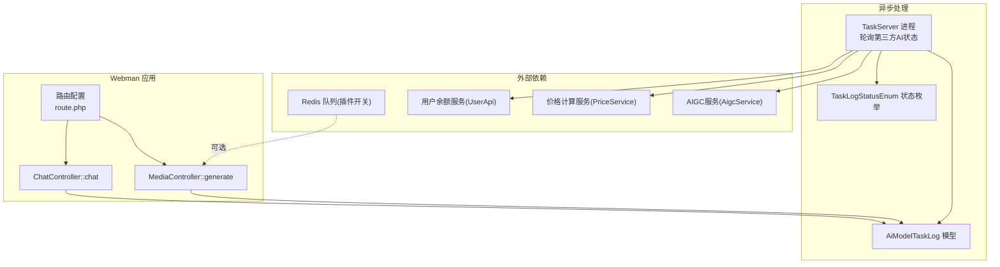
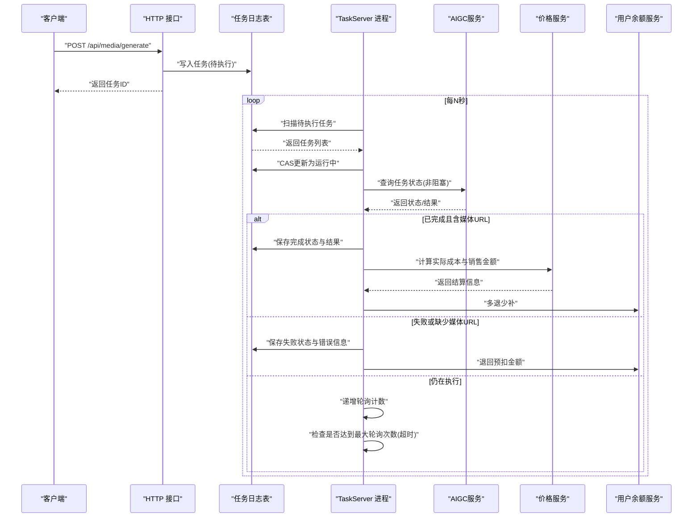
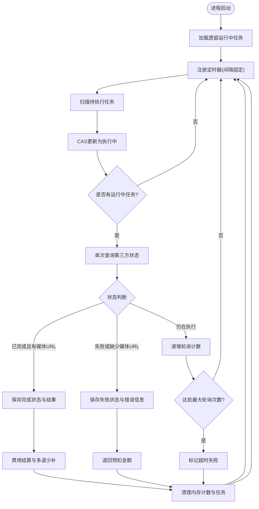
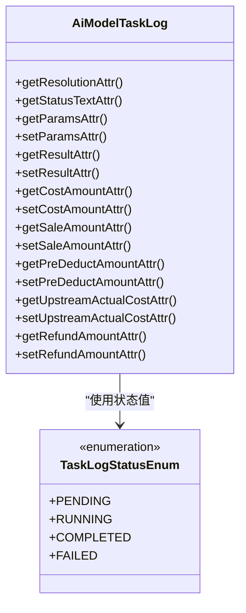
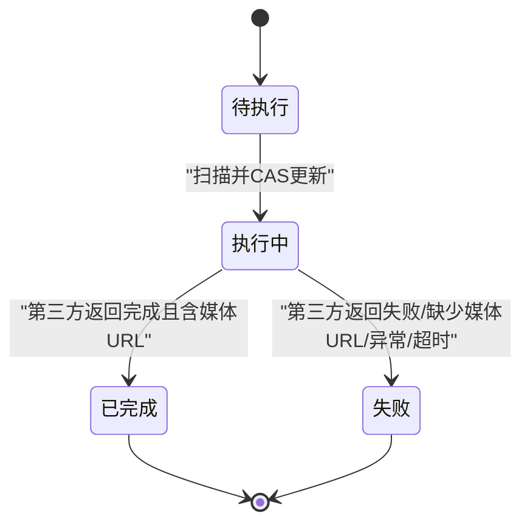
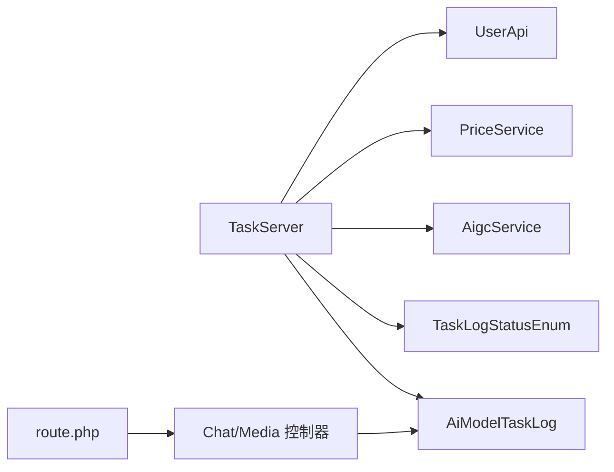

# 任务管理接口

<cite>
**本文引用的文件**   
- [server/plugin/xbAiModelAgent/config/route.php](file://server/plugin/xbAiModelAgent/config/route.php)
- [server/plugin/xbAiModelAgent/process/TaskServer.php](file://server/plugin/xbAiModelAgent/process/TaskServer.php)
- [server/plugin/xbAiModelAgent/app/model/AiModelTaskLog.php](file://server/plugin/xbAiModelAgent/app/model/AiModelTaskLog.php)
- [server/plugin/xbAiModelAgent/enum/TaskLogStatusEnum.php](file://server/plugin/xbAiModelAgent/enum/TaskLogStatusEnum.php)
- [server/config/plugin/webman/redis-queue/app.php](file://server/config/plugin/webman/redis-queue/app.php)
</cite>

## 目录
1. [简介](#简介)
2. [项目结构](#项目结构)
3. [核心组件](#核心组件)
4. [架构总览](#架构总览)
5. [详细组件分析](#详细组件分析)
6. [依赖分析](#依赖分析)
7. [性能考虑](#性能考虑)
8. [故障排查指南](#故障排查指南)
9. [结论](#结论)
10. [附录](#附录)

## 简介
本文件为AI模型任务管理系统的API与异步处理机制文档，聚焦以下能力：
- 任务提交、状态查询、进度跟踪、结果获取等核心接口
- 异步任务处理机制、任务队列管理、失败重试策略
- 任务优先级设置、超时控制、资源监控等企业级特性
- 最佳实践与故障排查指南

说明：
- 当前仓库中已暴露的对外HTTP路由包含文本聊天与媒体生成两类接口。
- 异步任务由独立进程轮询第三方AI服务状态，结合数据库持久化与内存计数实现超时与失败控制。
- 费用结算在任务完成或失败时进行多退少补或全额退款。

## 项目结构
围绕任务管理的核心代码位于插件 xbAiModelAgent 下，关键路径如下：
- 路由定义：server/plugin/xbAiModelAgent/config/route.php
- 异步任务检测进程：server/plugin/xbAiModelAgent/process/TaskServer.php
- 任务日志模型：server/plugin/xbAiModelAgent/app/model/AiModelTaskLog.php
- 任务状态枚举：server/plugin/xbAiModelAgent/enum/TaskLogStatusEnum.php
- Redis 队列插件开关（系统级）：server/config/plugin/webman/redis-queue/app.php

图表来源
- [server/plugin/xbAiModelAgent/config/route.php:1-13](file://server/plugin/xbAiModelAgent/config/route.php#L1-L13)
- [server/plugin/xbAiModelAgent/process/TaskServer.php:1-465](file://server/plugin/xbAiModelAgent/process/TaskServer.php#L1-L465)
- [server/plugin/xbAiModelAgent/app/model/AiModelTaskLog.php:1-211](file://server/plugin/xbAiModelAgent/app/model/AiModelTaskLog.php#L1-L211)
- [server/plugin/xbAiModelAgent/enum/TaskLogStatusEnum.php:1-44](file://server/plugin/xbAiModelAgent/enum/TaskLogStatusEnum.php#L1-L44)
- [server/config/plugin/webman/redis-queue/app.php:1-4](file://server/config/plugin/webman/redis-queue/app.php#L1-L4)

章节来源
- [server/plugin/xbAiModelAgent/config/route.php:1-13](file://server/plugin/xbAiModelAgent/config/route.php#L1-L13)

## 核心组件
- 路由层
  - 提供 /api/chat/completions 与 /api/media/generate 两个HTTP入口。
- 异步任务检测进程 TaskServer
  - 定时扫描待执行任务并标记为运行中；对运行中任务进行非阻塞单次查询，根据第三方返回状态更新完成/失败，并处理费用结算与退款。
- 任务日志模型 AiModelTaskLog
  - 负责任务参数、结果、金额字段等的序列化/反序列化与类型转换，以及状态文本与分辨率组合等附加属性。
- 状态枚举 TaskLogStatusEnum
  - 统一任务生命周期状态值与展示文案。

章节来源
- [server/plugin/xbAiModelAgent/config/route.php:1-13](file://server/plugin/xbAiModelAgent/config/route.php#L1-L13)
- [server/plugin/xbAiModelAgent/process/TaskServer.php:1-465](file://server/plugin/xbAiModelAgent/process/TaskServer.php#L1-L465)
- [server/plugin/xbAiModelAgent/app/model/AiModelTaskLog.php:1-211](file://server/plugin/xbAiModelAgent/app/model/AiModelTaskLog.php#L1-L211)
- [server/plugin/xbAiModelAgent/enum/TaskLogStatusEnum.php:1-44](file://server/plugin/xbAiModelAgent/enum/TaskLogStatusEnum.php#L1-L44)

## 架构总览
整体采用“HTTP 快速入队 + 独立进程轮询”的异步架构：
- HTTP 接口接收请求，创建任务记录并进入待执行状态。
- TaskServer 进程周期性扫描待执行任务，将其置为运行中，随后按批次对第三方AI服务发起非阻塞状态查询。
- 根据第三方返回的状态决定完成、失败或继续等待；失败时触发退款，完成时进行多退少补结算。
- 通过内存轮询计数与最大轮询次数实现超时控制。

图表来源
- [server/plugin/xbAiModelAgent/config/route.php:1-13](file://server/plugin/xbAiModelAgent/config/route.php#L1-L13)
- [server/plugin/xbAiModelAgent/process/TaskServer.php:1-465](file://server/plugin/xbAiModelAgent/process/TaskServer.php#L1-L465)
- [server/plugin/xbAiModelAgent/app/model/AiModelTaskLog.php:1-211](file://server/plugin/xbAiModelAgent/app/model/AiModelTaskLog.php#L1-L211)
- [server/plugin/xbAiModelAgent/enum/TaskLogStatusEnum.php:1-44](file://server/plugin/xbAiModelAgent/enum/TaskLogStatusEnum.php#L1-L44)

## 详细组件分析

### 接口清单与行为说明
- POST /api/chat/completions
  - 用途：文本聊天类任务入口（具体控制器逻辑未在当前仓库可见）。
  - 输入/输出：参见对应控制器实现。
- POST /api/media/generate
  - 用途：媒体生成类任务入口（具体控制器逻辑未在当前仓库可见）。
  - 输入/输出：参见对应控制器实现。
- 任务状态查询与进度跟踪
  - 通过读取任务日志表中的状态字段与结果字段进行查询与展示。
  - 状态枚举见下方“状态机”。

章节来源
- [server/plugin/xbAiModelAgent/config/route.php:1-13](file://server/plugin/xbAiModelAgent/config/route.php#L1-L13)

### 异步任务处理机制（TaskServer）
- 启动与定时器
  - 进程启动后加载遗留的运行中任务，注册定时器周期扫描。
- 待执行任务扫描
  - 批量查询待执行任务，使用条件更新将状态从“待执行”改为“执行中”，避免重复处理。
- 运行中任务轮询
  - 复用AIGC服务实例，每轮限制查询数量，调用第三方接口进行单次非阻塞状态查询。
- 结果处理
  - 成功：保存结果、媒体URL、完成时间，并进行费用结算与多退少补。
  - 失败：保存错误信息、完成时间，并退回预扣金额。
  - 仍在执行：递增内存轮询计数，超过最大轮询次数则判定超时并失败。
- 异常与容错
  - 保存失败时仅清理内存计数，保留任务以便下次重试；对第三方异常进行捕获并记录日志。

图表来源
- [server/plugin/xbAiModelAgent/process/TaskServer.php:1-465](file://server/plugin/xbAiModelAgent/process/TaskServer.php#L1-L465)

章节来源
- [server/plugin/xbAiModelAgent/process/TaskServer.php:1-465](file://server/plugin/xbAiModelAgent/process/TaskServer.php#L1-L465)

### 任务数据模型与状态机
- 模型 AiModelTaskLog
  - 支持软删除、JSON字段自动编解码、数值字段安全转换、附加属性（如分辨率组合、状态文本）。
- 状态枚举 TaskLogStatusEnum
  - 定义待执行、执行中、已完成、失败四类状态及其展示文案。

图表来源
- [server/plugin/xbAiModelAgent/app/model/AiModelTaskLog.php:1-211](file://server/plugin/xbAiModelAgent/app/model/AiModelTaskLog.php#L1-L211)
- [server/plugin/xbAiModelAgent/enum/TaskLogStatusEnum.php:1-44](file://server/plugin/xbAiModelAgent/enum/TaskLogStatusEnum.php#L1-L44)

章节来源
- [server/plugin/xbAiModelAgent/app/model/AiModelTaskLog.php:1-211](file://server/plugin/xbAiModelAgent/app/model/AiModelTaskLog.php#L1-L211)
- [server/plugin/xbAiModelAgent/enum/TaskLogStatusEnum.php:1-44](file://server/plugin/xbAiModelAgent/enum/TaskLogStatusEnum.php#L1-L44)

### 任务状态机

图表来源
- [server/plugin/xbAiModelAgent/enum/TaskLogStatusEnum.php:1-44](file://server/plugin/xbAiModelAgent/enum/TaskLogStatusEnum.php#L1-L44)
- [server/plugin/xbAiModelAgent/process/TaskServer.php:1-465](file://server/plugin/xbAiModelAgent/process/TaskServer.php#L1-L465)

## 依赖分析
- 内部依赖
  - TaskServer 依赖 AiModelTaskLog 模型读写任务状态与结果。
  - TaskServer 依赖 TaskLogStatusEnum 统一状态常量。
  - TaskServer 依赖 AigcService 查询第三方AI任务状态。
  - TaskServer 依赖 PriceService 计算上游实际成本与销售金额。
  - TaskServer 依赖 UserApi 执行余额的多退少补与失败退款。
- 外部依赖
  - Redis 队列插件开关存在，但当前任务流程主要基于数据库与内存计数，未直接体现队列消费器。

图表来源
- [server/plugin/xbAiModelAgent/process/TaskServer.php:1-465](file://server/plugin/xbAiModelAgent/process/TaskServer.php#L1-L465)
- [server/plugin/xbAiModelAgent/app/model/AiModelTaskLog.php:1-211](file://server/plugin/xbAiModelAgent/app/model/AiModelTaskLog.php#L1-L211)
- [server/plugin/xbAiModelAgent/enum/TaskLogStatusEnum.php:1-44](file://server/plugin/xbAiModelAgent/enum/TaskLogStatusEnum.php#L1-L44)
- [server/plugin/xbAiModelAgent/config/route.php:1-13](file://server/plugin/xbAiModelAgent/config/route.php#L1-L13)

章节来源
- [server/plugin/xbAiModelAgent/process/TaskServer.php:1-465](file://server/plugin/xbAiModelAgent/process/TaskServer.php#L1-L465)
- [server/plugin/xbAiModelAgent/app/model/AiModelTaskLog.php:1-211](file://server/plugin/xbAiModelAgent/app/model/AiModelTaskLog.php#L1-L211)
- [server/plugin/xbAiModelAgent/enum/TaskLogStatusEnum.php:1-44](file://server/plugin/xbAiModelAgent/enum/TaskLogStatusEnum.php#L1-L44)
- [server/plugin/xbAiModelAgent/config/route.php:1-13](file://server/plugin/xbAiModelAgent/config/route.php#L1-L13)

## 性能考虑
- 批处理与限流
  - 每次扫描待执行任务数量有限制；每轮查询运行中任务的数量有限制，避免对第三方API造成过大压力。
- 非阻塞单次查询
  - 每个任务每轮只做一次状态查询，降低延迟与并发开销。
- 内存轮询计数
  - 使用内存维护轮询次数，减少数据库访问；进程重启时重新加载运行中任务以恢复上下文。
- 费用结算优化
  - 仅在任务完成时进行结算，失败时仅退款，减少不必要的计算与IO。

[本节为通用性能建议，不直接分析具体文件]

## 故障排查指南
- 任务卡在“执行中”
  - 检查 TaskServer 进程是否正常运行、定时器是否注册。
  - 查看轮询计数是否持续增长，确认是否达到最大轮询次数导致超时。
- 任务频繁失败
  - 核对第三方AI服务返回的错误信息字段，确认错误提取逻辑是否覆盖到业务字段。
  - 关注网络异常与第三方限流导致的异常分支。
- 费用结算异常
  - 检查上游实际成本与销售金额计算是否正确，确认多退少补金额是否为正负方向正确。
  - 观察退款与补扣日志，定位用户余额服务调用是否成功。
- 数据库写入失败
  - 当保存完成或失败状态失败时，会抛出运行时异常；需检查数据库连接与事务一致性。
- 队列相关
  - 若后续引入队列消费器，请确认 Redis 队列插件开关与消费者进程是否正常启动。

章节来源
- [server/plugin/xbAiModelAgent/process/TaskServer.php:1-465](file://server/plugin/xbAiModelAgent/process/TaskServer.php#L1-L465)
- [server/config/plugin/webman/redis-queue/app.php:1-4](file://server/config/plugin/webman/redis-queue/app.php#L1-L4)

## 结论
本系统通过“HTTP 快速入队 + 独立进程轮询”的异步架构，实现了AI任务的稳定提交、状态跟踪与结果获取。借助状态枚举、模型字段转换与内存轮询计数，系统在可靠性与性能之间取得平衡。费用结算在多退少补与失败退款场景下保持一致性。后续可结合队列消费器与更细粒度的优先级调度进一步提升吞吐与可控性。

[本节为总结性内容，不直接分析具体文件]

## 附录

### 企业级特性建议与实践
- 任务优先级
  - 可在任务表中增加优先级字段，并在扫描待执行任务时按优先级排序，优先处理高优先级任务。
- 超时控制
  - 当前通过最大轮询次数实现超时；可按任务类型配置不同上限，并结合任务开始时间与结束时间做双重校验。
- 资源监控
  - 在 TaskServer 中增加指标上报（如轮询耗时、失败率、平均处理时长），便于观测与告警。
- 失败重试策略
  - 当前失败即终止；可引入指数退避与最大重试次数，针对临时性错误进行自动重试。
- 幂等与去重
  - 在提交任务前进行幂等键校验，避免重复提交导致重复计费与资源浪费。

[本节为概念性建议，不直接分析具体文件]