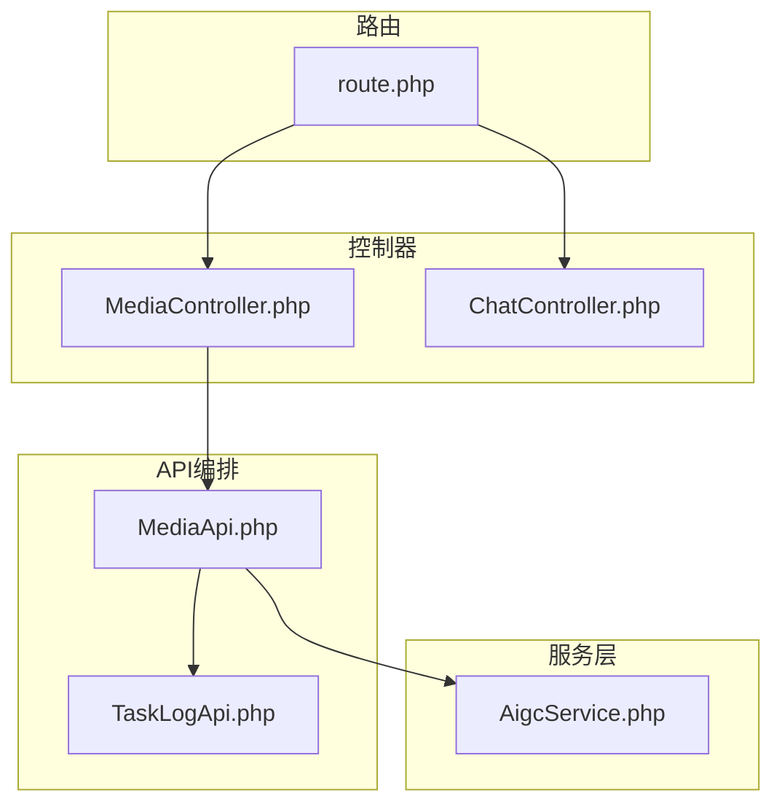
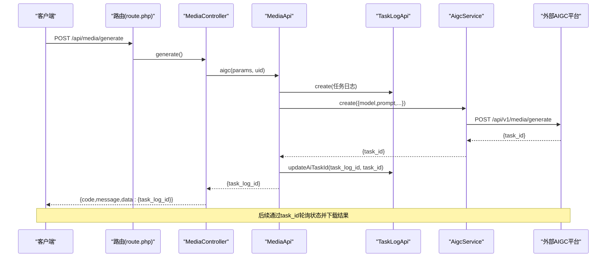
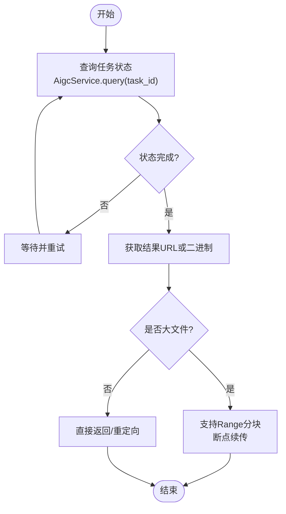
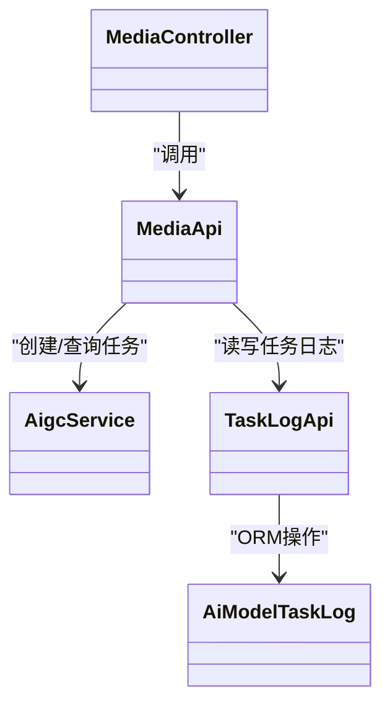

# 任务结果获取接口

<cite>
**本文引用的文件**
- [server/plugin/xbAiModelAgent/config/route.php](file://server/plugin/xbAiModelAgent/config/route.php)
- [server/plugin/xbAiModelAgent/app/api/controller/MediaController.php](file://server/plugin/xbAiModelAgent/app/api/controller/MediaController.php)
- [server/plugin/xbAiModelAgent/app/api/controller/ChatController.php](file://server/plugin/xbAiModelAgent/app/api/controller/ChatController.php)
- [server/plugin/xbAiModelAgent/api/MediaApi.php](file://server/plugin/xbAiModelAgent/api/MediaApi.php)
- [server/plugin/xbAiModelAgent/service/xbservice/AigcService.php](file://server/plugin/xbAiModelAgent/service/xbservice/AigcService.php)
- [server/plugin/xbAiModelAgent/api/TaskLogApi.php](file://server/plugin/xbAiModelAgent/api/TaskLogApi.php)
</cite>

## 目录
1. [简介](#简介)
2. [项目结构](#项目结构)
3. [核心组件](#核心组件)
4. [架构总览](#架构总览)
5. [详细组件分析](#详细组件分析)
6. [依赖关系分析](#依赖关系分析)
7. [性能与传输优化](#性能与传输优化)
8. [故障排查指南](#故障排查指南)
9. [结论](#结论)
10. [附录：下载示例与流式处理](#附录下载示例与流式处理)

## 简介
本接口文档聚焦于“AI模型任务结果获取”能力，覆盖以下要点：
- 任务创建与查询：通过媒体生成接口创建图片、音频、视频等异步任务，并返回任务标识。
- 结果获取方式：基于已创建的第三方任务ID进行状态轮询与结果下载（由服务层调用外部AIGC平台）。
- 文本聊天流式输出：提供SSE流式响应，便于前端实时渲染。
- 传输协议与HTTP方法：明确各接口的HTTP方法与URL模式。
- 媒体类型与返回格式：说明图片、视频、音频、文本的返回结构与字段约定。
- 大文件下载策略：分块下载、断点续传、CDN加速建议。
- 缓存与版本管理：结果缓存与版本化策略建议。
- 示例与实现参考：给出客户端下载与流式处理的示例路径与流程说明。

## 项目结构
与任务结果获取相关的后端代码主要位于插件模块中，包含路由定义、控制器、API编排与服务层调用。

图示来源
- [server/plugin/xbAiModelAgent/config/route.php:1-13](file://server/plugin/xbAiModelAgent/config/route.php#L1-L13)
- [server/plugin/xbAiModelAgent/app/api/controller/MediaController.php:1-100](file://server/plugin/xbAiModelAgent/app/api/controller/MediaController.php#L1-L100)
- [server/plugin/xbAiModelAgent/app/api/controller/ChatController.php:1-116](file://server/plugin/xbAiModelAgent/app/api/controller/ChatController.php#L1-L116)
- [server/plugin/xbAiModelAgent/api/MediaApi.php:1-203](file://server/plugin/xbAiModelAgent/api/MediaApi.php#L1-L203)
- [server/plugin/xbAiModelAgent/service/xbservice/AigcService.php:1-58](file://server/plugin/xbAiModelAgent/service/xbservice/AigcService.php#L1-L58)
- [server/plugin/xbAiModelAgent/api/TaskLogApi.php:1-263](file://server/plugin/xbAiModelAgent/api/TaskLogApi.php#L1-L263)

章节来源
- [server/plugin/xbAiModelAgent/config/route.php:1-13](file://server/plugin/xbAiModelAgent/config/route.php#L1-L13)
- [server/plugin/xbAiModelAgent/app/api/controller/MediaController.php:1-100](file://server/plugin/xbAiModelAgent/app/api/controller/MediaController.php#L1-L100)
- [server/plugin/xbAiModelAgent/app/api/controller/ChatController.php:1-116](file://server/plugin/xbAiModelAgent/app/api/controller/ChatController.php#L1-L116)
- [server/plugin/xbAiModelAgent/api/MediaApi.php:1-203](file://server/plugin/xbAiModelAgent/api/MediaApi.php#L1-L203)
- [server/plugin/xbAiModelAgent/service/xbservice/AigcService.php:1-58](file://server/plugin/xbAiModelAgent/service/xbservice/AigcService.php#L1-L58)
- [server/plugin/xbAiModelAgent/api/TaskLogApi.php:1-263](file://server/plugin/xbAiModelAgent/api/TaskLogApi.php#L1-L263)

## 核心组件
- 路由注册：将媒体生成与聊天接口映射到对应控制器方法。
- 媒体生成控制器：接收表单参数，校验登录态，委托给MediaApi创建任务。
- 聊天控制器：构建请求参数，设置SSE响应头，逐块推送事件。
- MediaApi：负责参数校验、费用估算与预扣、任务日志创建、调用AigcService创建第三方任务。
- AigcService：封装对外部AIGC平台的POST multipart与GET查询接口。
- TaskLogApi：维护任务日志记录，支持创建、更新状态、失败回滚等。

章节来源
- [server/plugin/xbAiModelAgent/config/route.php:1-13](file://server/plugin/xbAiModelAgent/config/route.php#L1-L13)
- [server/plugin/xbAiModelAgent/app/api/controller/MediaController.php:1-100](file://server/plugin/xbAiModelAgent/app/api/controller/MediaController.php#L1-L100)
- [server/plugin/xbAiModelAgent/app/api/controller/ChatController.php:1-116](file://server/plugin/xbAiModelAgent/app/api/controller/ChatController.php#L1-L116)
- [server/plugin/xbAiModelAgent/api/MediaApi.php:1-203](file://server/plugin/xbAiModelAgent/api/MediaApi.php#L1-L203)
- [server/plugin/xbAiModelAgent/service/xbservice/AigcService.php:1-58](file://server/plugin/xbAiModelAgent/service/xbservice/AigcService.php#L1-L58)
- [server/plugin/xbAiModelAgent/api/TaskLogApi.php:1-263](file://server/plugin/xbAiModelAgent/api/TaskLogApi.php#L1-L263)

## 架构总览
下图展示了从客户端发起媒体生成请求，到创建任务、查询状态、最终获取结果的端到端流程。

图示来源
- [server/plugin/xbAiModelAgent/config/route.php:1-13](file://server/plugin/xbAiModelAgent/config/route.php#L1-L13)
- [server/plugin/xbAiModelAgent/app/api/controller/MediaController.php:1-100](file://server/plugin/xbAiModelAgent/app/api/controller/MediaController.php#L1-L100)
- [server/plugin/xbAiModelAgent/api/MediaApi.php:1-203](file://server/plugin/xbAiModelAgent/api/MediaApi.php#L1-L203)
- [server/plugin/xbAiModelAgent/service/xbservice/AigcService.php:1-58](file://server/plugin/xbAiModelAgent/service/xbservice/AigcService.php#L1-L58)
- [server/plugin/xbAiModelAgent/api/TaskLogApi.php:1-263](file://server/plugin/xbAiModelAgent/api/TaskLogApi.php#L1-L263)

## 详细组件分析

### 媒体生成接口（创建任务）
- HTTP方法与URL
  - 方法：POST
  - URL：/api/media/generate
- 请求体（formdata）
  - model_id：string，必填，模型ID
  - prompt：string，必填，提示词
  - width：int，可选，宽度
  - height：int，可选，高度
  - duration：int/string，可选，时长（秒），对音频/视频生效
  - negative_prompt：string，可选，反向提示词
  - reference_image_urls：string[]，可选，参考图片URL列表
- 鉴权
  - 需要登录态（uid），未登录抛出未授权异常
- 响应
  - code：int，状态码
  - message：string，提示信息
  - data：array，包含任务信息，至少包含task_log_id
- 业务逻辑
  - 参数校验、模型存在性检查
  - 费用估算与余额预扣（若用户已登录且需计费）
  - 创建任务日志（初始状态为待执行）
  - 调用外部AIGC平台创建任务，获得task_id并回填日志
  - 失败时更新日志为失败并尝试退款

章节来源
- [server/plugin/xbAiModelAgent/config/route.php:1-13](file://server/plugin/xbAiModelAgent/config/route.php#L1-L13)
- [server/plugin/xbAiModelAgent/app/api/controller/MediaController.php:1-100](file://server/plugin/xbAiModelAgent/app/api/controller/MediaController.php#L1-L100)
- [server/plugin/xbAiModelAgent/api/MediaApi.php:1-203](file://server/plugin/xbAiModelAgent/api/MediaApi.php#L1-L203)
- [server/plugin/xbAiModelAgent/service/xbservice/AigcService.php:1-58](file://server/plugin/xbAiModelAgent/service/xbservice/AigcService.php#L1-L58)
- [server/plugin/xbAiModelAgent/api/TaskLogApi.php:1-263](file://server/plugin/xbAiModelAgent/api/TaskLogApi.php#L1-L263)

### 文本聊天接口（SSE流式）
- HTTP方法与URL
  - 方法：POST
  - URL：/api/chat/completions
- 请求体（JSON）
  - model：string，必填，模型ID
  - messages：array，必填，消息列表[{role,content}]
  - 其他可选参数：temperature、top_p、n、max_tokens、stop、presence_penalty、frequency_penalty、user、tools、tool_choice、response_format、seed、reasoning_effort等
- 响应
  - Content-Type：text/event-stream
  - Cache-Control：no-cache
  - X-Accel-Buffering：no
  - 数据块：Server-Sent Events，每个事件包含JSON对象；结束时发送[DONE]
- 业务逻辑
  - 参数校验与模型存在性检查
  - 可选的余额前置校验
  - 透传可选参数至下游服务
  - 逐块yield下游流式结果，并在最后yield usage统计事件
  - 错误时yield错误事件并结束

章节来源
- [server/plugin/xbAiModelAgent/config/route.php:1-13](file://server/plugin/xbAiModelAgent/config/route.php#L1-L13)
- [server/plugin/xbAiModelAgent/app/api/controller/ChatController.php:1-116](file://server/plugin/xbAiModelAgent/app/api/controller/ChatController.php#L1-L116)

### 任务状态查询与结果下载（概念流程）
- 状态查询
  - 通过AigcService.query(task_id)调用外部平台查询任务状态
  - 本地可通过TaskLogApi.getDetail(task_log_id)查看ai_task_id与状态
- 结果下载
  - 当外部平台返回可下载链接或二进制内容时，服务端应直接转发或重定向到CDN/存储地址
  - 对于大文件，建议使用Range请求支持分块与断点续传
  - 建议在网关层启用X-Accel-Redirect或直接代理静态资源以利用CDN

[此图为概念流程图，不直接映射具体源码文件]

## 依赖关系分析
- 控制器依赖API编排类，API编排类依赖服务层与数据库访问类。
- 关键依赖链：
  - MediaController -> MediaApi -> AigcService -> 外部AIGC平台
  - MediaController -> MediaApi -> TaskLogApi -> 数据库模型
  - ChatController -> ChatApi -> ChatService -> 外部LLM平台（SSE）

图示来源
- [server/plugin/xbAiModelAgent/app/api/controller/MediaController.php:1-100](file://server/plugin/xbAiModelAgent/app/api/controller/MediaController.php#L1-L100)
- [server/plugin/xbAiModelAgent/api/MediaApi.php:1-203](file://server/plugin/xbAiModelAgent/api/MediaApi.php#L1-L203)
- [server/plugin/xbAiModelAgent/service/xbservice/AigcService.php:1-58](file://server/plugin/xbAiModelAgent/service/xbservice/AigcService.php#L1-L58)
- [server/plugin/xbAiModelAgent/api/TaskLogApi.php:1-263](file://server/plugin/xbAiModelAgent/api/TaskLogApi.php#L1-L263)

章节来源
- [server/plugin/xbAiModelAgent/app/api/controller/MediaController.php:1-100](file://server/plugin/xbAiModelAgent/app/api/controller/MediaController.php#L1-L100)
- [server/plugin/xbAiModelAgent/api/MediaApi.php:1-203](file://server/plugin/xbAiModelAgent/api/MediaApi.php#L1-L203)
- [server/plugin/xbAiModelAgent/service/xbservice/AigcService.php:1-58](file://server/plugin/xbAiModelAgent/service/xbservice/AigcService.php#L1-L58)
- [server/plugin/xbAiModelAgent/api/TaskLogApi.php:1-263](file://server/plugin/xbAiModelAgent/api/TaskLogApi.php#L1-L263)

## 性能与传输优化
- 大文件分块下载
  - 使用HTTP Range请求，服务端按Range头返回指定字节范围
  - 设置Content-Range、Accept-Ranges、Content-Length等必要响应头
- 断点续传
  - 客户端保存上次下载的偏移量，下次请求携带Range头继续
  - 服务端校验文件完整性（如ETag/Last-Modified）避免重复传输
- CDN加速
  - 将结果文件托管至CDN，服务端返回CDN直链或配置X-Accel-Redirect
  - 合理设置Cache-Control与Expires，提升命中率
- 流式处理
  - 文本聊天采用SSE，关闭缓冲（X-Accel-Buffering: no），确保低延迟
  - 对媒体结果也可考虑流式写入，减少内存占用
- 缓存机制
  - 对高频小文件结果进行短期缓存（Redis/内存），设置TTL
  - 对任务状态查询增加短间隔重试与退避策略，降低外部平台压力
- 版本管理
  - 结果URL采用版本化命名（如v1/v2），便于灰度与回滚
  - 在TaskLog.result中记录版本号，便于审计与追溯

[本节为通用指导，不直接分析具体文件]

## 故障排查指南
- 未登录或权限不足
  - 现象：返回未授权异常
  - 排查：确认请求携带有效会话/令牌，uid解析成功
- 模型不存在或参数错误
  - 现象：抛出模型不存在或参数缺失异常
  - 排查：核对model_id是否存在，prompt是否为空
- 任务创建失败
  - 现象：外部平台返回错误，任务日志标记失败
  - 排查：查看TaskLog.error_msg，确认外部平台连通性与配额
- 余额不足或预扣失败
  - 现象：聊天或媒体生成前余额校验失败
  - 排查：检查用户资产与预扣逻辑，必要时调整阈值
- SSE连接中断
  - 现象：前端无法持续接收事件
  - 排查：确认服务器未缓冲响应，网络中间件未拦截text/event-stream

章节来源
- [server/plugin/xbAiModelAgent/app/api/controller/MediaController.php:1-100](file://server/plugin/xbAiModelAgent/app/api/controller/MediaController.php#L1-L100)
- [server/plugin/xbAiModelAgent/app/api/controller/ChatController.php:1-116](file://server/plugin/xbAiModelAgent/app/api/controller/ChatController.php#L1-L116)
- [server/plugin/xbAiModelAgent/api/MediaApi.php:1-203](file://server/plugin/xbAiModelAgent/api/MediaApi.php#L1-L203)
- [server/plugin/xbAiModelAgent/api/TaskLogApi.php:1-263](file://server/plugin/xbAiModelAgent/api/TaskLogApi.php#L1-L263)

## 结论
- 媒体生成接口提供统一的异步任务创建入口，结合任务日志与外部平台任务ID，形成完整的任务生命周期管理。
- 文本聊天接口通过SSE实现低延迟流式输出，适合实时对话场景。
- 针对大文件下载，建议采用Range分块与CDN加速，并结合缓存与版本化管理提升性能与可维护性。
- 建议在网关层统一处理认证、限流与缓存策略，保障系统稳定性与扩展性。

[本节为总结性内容，不直接分析具体文件]

## 附录：下载示例与流式处理
- 媒体结果下载示例（概念步骤）
  - 步骤1：调用媒体生成接口创建任务，获取task_log_id
  - 步骤2：根据task_log_id查询本地任务详情，得到ai_task_id
  - 步骤3：调用AigcService.query(ai_task_id)获取任务状态
  - 步骤4：状态完成后，获取结果URL或二进制数据
  - 步骤5：对大文件使用Range请求进行分块下载，支持断点续传
  - 步骤6：将结果URL重定向至CDN或开启X-Accel-Redirect以提升性能
- 文本聊天流式处理示例（概念步骤）
  - 步骤1：POST /api/chat/completions，设置Content-Type为application/json
  - 步骤2：服务端返回text/event-stream，客户端监听事件流
  - 步骤3：逐块拼接assistant回复内容，直到收到[DONE]
  - 步骤4：处理usage事件，用于统计Token用量与结算

[本节为概念性示例，不直接引用具体源码文件]