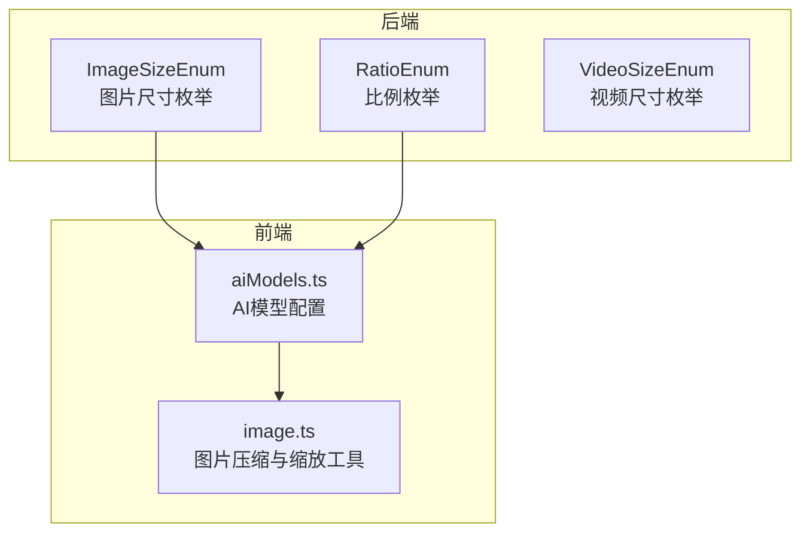
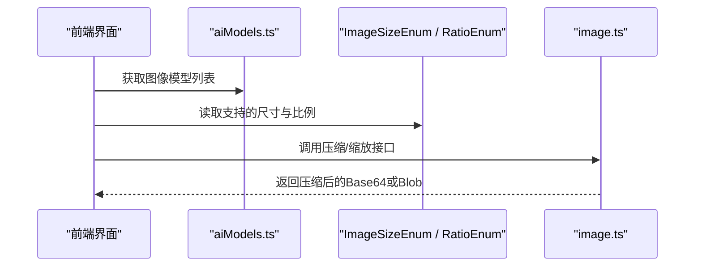
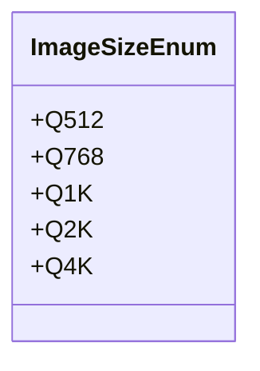
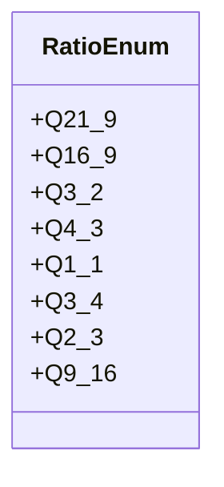
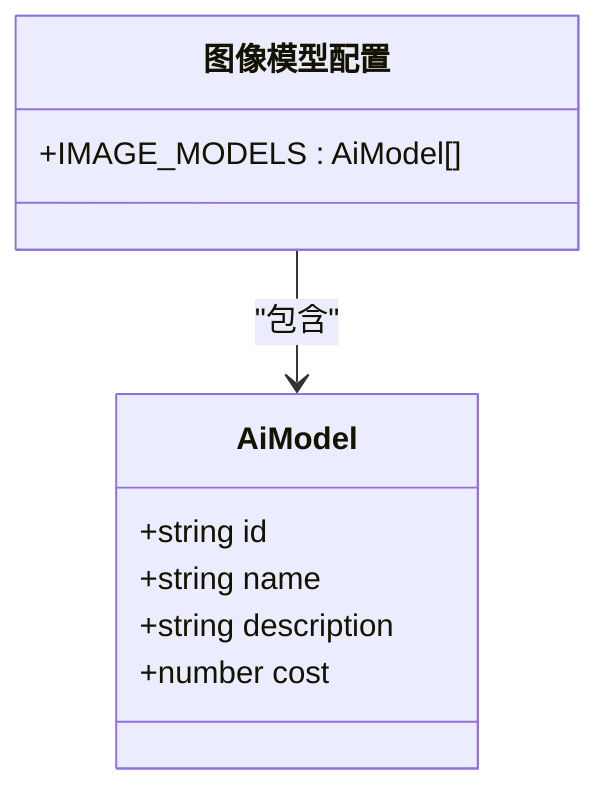
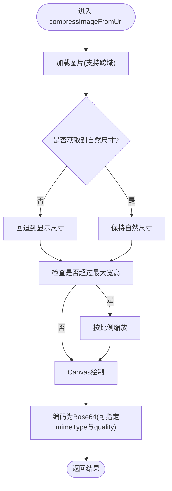
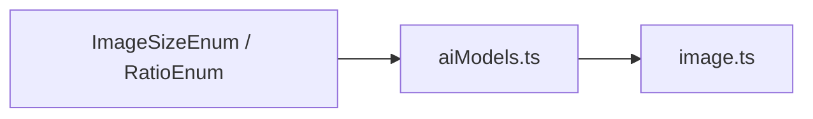

# 图像尺寸配置

<cite>
**本文引用的文件**   
- [ImageSizeEnum.php](file://server/plugin/xbAiModelAgent/enum/ImageSizeEnum.php)
- [RatioEnum.php](file://server/plugin/xbAiModelAgent/enum/RatioEnum.php)
- [VideoSizeEnum.php](file://server/plugin/xbAiModelAgent/enum/VideoSizeEnum.php)
- [aiModels.ts](file://frontend/src/config/aiModels.ts)
- [image.ts](file://frontend/src/utils/image.ts)
</cite>

## 目录
1. [简介](#简介)
2. [项目结构](#项目结构)
3. [核心组件](#核心组件)
4. [架构总览](#架构总览)
5. [详细组件分析](#详细组件分析)
6. [依赖分析](#依赖分析)
7. [性能考虑](#性能考虑)
8. [故障排查指南](#故障排查指南)
9. [结论](#结论)
10. [附录](#附录)

## 简介
本技术文档聚焦于“图像生成中的尺寸配置”，围绕系统内已实现的图片分辨率规格、宽高比选项、前端压缩与缩放策略，以及不同AI模型在尺寸方面的约束与推荐进行系统化说明。文档同时提供常见应用场景的尺寸建议（如社交媒体配图、高清壁纸、缩略图等），并给出尺寸调整算法与质量权衡的技术要点，帮助开发者与运营人员快速制定合理的尺寸策略。

## 项目结构
与图像尺寸相关的代码主要分布在以下位置：
- 后端枚举定义：统一维护图片分辨率与宽高比的常量集合，便于前后端一致使用
- 前端模型配置：集中管理各AI模型的元信息（名称、描述、成本等）
- 前端工具函数：提供基于Canvas的图片压缩与按比例缩放能力

图表来源
- [ImageSizeEnum.php:1-76](file://server/plugin/xbAiModelAgent/enum/ImageSizeEnum.php#L1-L76)
- [RatioEnum.php:1-117](file://server/plugin/xbAiModelAgent/enum/RatioEnum.php#L1-L117)
- [VideoSizeEnum.php:1-87](file://server/plugin/xbAiModelAgent/enum/VideoSizeEnum.php#L1-L87)
- [aiModels.ts:1-67](file://frontend/src/config/aiModels.ts#L1-L67)
- [image.ts:1-106](file://frontend/src/utils/image.ts#L1-L106)

章节来源
- [ImageSizeEnum.php:1-76](file://server/plugin/xbAiModelAgent/enum/ImageSizeEnum.php#L1-L76)
- [RatioEnum.php:1-117](file://server/plugin/xbAiModelAgent/enum/RatioEnum.php#L1-L117)
- [VideoSizeEnum.php:1-87](file://server/plugin/xbAiModelAgent/enum/VideoSizeEnum.php#L1-L87)
- [aiModels.ts:1-67](file://frontend/src/config/aiModels.ts#L1-L67)
- [image.ts:1-106](file://frontend/src/utils/image.ts#L1-L106)

## 核心组件
- 图片尺寸枚举：定义了常用正方形分辨率档位（512、768、1K、2K、4K），包含标签、值、样式与宽高字段，用于统一渲染与校验
- 比例枚举：定义了常用宽高比（21:9、16:9、3:2、4:3、1:1、3:4、2:3、9:16），包含比率字符串与宽高分量，便于计算目标尺寸
- AI模型配置：集中列出图像类AI模型（通义万象Pro、Stable Diffusion XL、MidJourney V6、DALL-E 3）及其元信息，作为选择模型时的数据源
- 图片压缩工具：提供从URL加载图片、按比例缩放、Canvas绘制与编码为base64的能力，支持jpeg/webp/png输出与跨域处理

章节来源
- [ImageSizeEnum.php:1-76](file://server/plugin/xbAiModelAgent/enum/ImageSizeEnum.php#L1-L76)
- [RatioEnum.php:1-117](file://server/plugin/xbAiModelAgent/enum/RatioEnum.php#L1-L117)
- [aiModels.ts:1-67](file://frontend/src/config/aiModels.ts#L1-L67)
- [image.ts:1-106](file://frontend/src/utils/image.ts#L1-L106)

## 架构总览
下图展示了“尺寸配置”在后端枚举与前端工具之间的协作关系：后端提供统一的尺寸与比例常量；前端根据所选模型与业务场景选择合适的尺寸与比例，并通过压缩工具完成最终输出。

图表来源
- [aiModels.ts:1-67](file://frontend/src/config/aiModels.ts#L1-L67)
- [ImageSizeEnum.php:1-76](file://server/plugin/xbAiModelAgent/enum/ImageSizeEnum.php#L1-L76)
- [RatioEnum.php:1-117](file://server/plugin/xbAiModelAgent/enum/RatioEnum.php#L1-L117)
- [image.ts:1-106](file://frontend/src/utils/image.ts#L1-L106)

## 详细组件分析

### 图片尺寸枚举（ImageSizeEnum）
- 作用：集中定义图片分辨率档位，提供label/value/style/width/height字段，便于前后端一致展示与校验
- 关键维度：
  - 分辨率档位：512、768、1K、2K、4K
  - 像素范围：最小边长512px，最大边长4096px（正方形）
  - 适用性：适合需要固定分辨率的批量生成与展示场景

图表来源
- [ImageSizeEnum.php:1-76](file://server/plugin/xbAiModelAgent/enum/ImageSizeEnum.php#L1-L76)

章节来源
- [ImageSizeEnum.php:1-76](file://server/plugin/xbAiModelAgent/enum/ImageSizeEnum.php#L1-L76)

### 比例枚举（RatioEnum）
- 作用：集中定义常用宽高比，提供ratio字符串与宽高分量，便于按基准边长计算目标尺寸
- 关键维度：
  - 横向宽屏：21:9、16:9
  - 摄影常用：3:2、4:3
  - 社交竖屏：9:16、3:4、2:3
  - 通用方形：1:1

图表来源
- [RatioEnum.php:1-117](file://server/plugin/xbAiModelAgent/enum/RatioEnum.php#L1-L117)

章节来源
- [RatioEnum.php:1-117](file://server/plugin/xbAiModelAgent/enum/RatioEnum.php#L1-L117)

### AI模型配置（aiModels.ts）
- 作用：集中管理图像类AI模型的元信息（id、name、description、cost等），作为前端选择模型的数据源
- 当前覆盖的图像模型：
  - 通义万象Pro
  - Stable Diffusion XL
  - MidJourney V6
  - DALL-E 3

图表来源
- [aiModels.ts:1-67](file://frontend/src/config/aiModels.ts#L1-L67)

章节来源
- [aiModels.ts:1-67](file://frontend/src/config/aiModels.ts#L1-L67)

### 图片压缩与缩放工具（image.ts）
- 作用：从服务端URL加载图片，按最大宽高限制进行等比缩放，使用Canvas绘制并编码为base64，支持jpeg/webp/png输出与跨域处理
- 关键参数：
  - maxWidth/maxHeight：超出时按比例缩放，默认1920
  - quality：压缩质量0-1，仅对jpeg/webp生效，默认0.8
  - mimeType：输出类型，默认image/jpeg
  - crossOrigin：跨域设置，默认anonymous
- 行为要点：
  - 若未获取到原始尺寸，回退到显示尺寸
  - 非png格式会填充白色背景避免透明区域变黑
  - 跨域污染时会抛出错误提示

图表来源
- [image.ts:1-106](file://frontend/src/utils/image.ts#L1-L106)

章节来源
- [image.ts:1-106](file://frontend/src/utils/image.ts#L1-L106)

## 依赖分析
- 后端枚举为前端提供一致的尺寸与比例常量，降低前后端约定不一致的风险
- 前端通过aiModels.ts选择具体模型，再结合ImageSizeEnum与RatioEnum确定目标尺寸
- image.ts负责最终的尺寸调整与压缩，确保输出满足带宽与存储要求

图表来源
- [ImageSizeEnum.php:1-76](file://server/plugin/xbAiModelAgent/enum/ImageSizeEnum.php#L1-L76)
- [RatioEnum.php:1-117](file://server/plugin/xbAiModelAgent/enum/RatioEnum.php#L1-L117)
- [aiModels.ts:1-67](file://frontend/src/config/aiModels.ts#L1-L67)
- [image.ts:1-106](file://frontend/src/utils/image.ts#L1-L106)

章节来源
- [ImageSizeEnum.php:1-76](file://server/plugin/xbAiModelAgent/enum/ImageSizeEnum.php#L1-L76)
- [RatioEnum.php:1-117](file://server/plugin/xbAiModelAgent/enum/RatioEnum.php#L1-L117)
- [aiModels.ts:1-67](file://frontend/src/config/aiModels.ts#L1-L67)
- [image.ts:1-106](file://frontend/src/utils/image.ts#L1-L106)

## 性能考虑
- 分辨率与文件大小
  - 分辨率越高，像素总量越大，文件体积与传输时间随之增加
  - 建议在满足清晰度需求的前提下优先选择更小的分辨率档位
- 压缩质量与格式
  - jpeg/webp可通过quality参数显著减小体积，png保留透明度但体积较大
  - 对于照片类内容，优先使用jpeg/webp；对于图标或需透明背景的场景，使用png
- 缩放策略
  - 采用等比缩放，避免拉伸变形
  - 将maxWidth/maxHeight设置为接近目标展示尺寸，减少不必要的冗余像素
- 跨域与兼容性
  - 跨域访问需正确配置响应头，否则Canvas会被污染导致无法导出
  - 在移动端或弱网环境下，适当降低quality与分辨率以提升首屏速度

[本节为通用性能指导，不直接分析具体文件]

## 故障排查指南
- Canvas跨域污染
  - 现象：导出失败并提示跨域相关错误
  - 排查：确认服务端允许跨域访问（CORS），并在前端传入正确的crossOrigin
- 图片加载失败
  - 现象：Promise被拒绝并返回加载失败的错误信息
  - 排查：检查URL可达性、网络状态与资源权限
- 透明背景变黑
  - 现象：导出jpeg/webp后透明区域出现黑色
  - 排查：非png格式会填充白色背景，如需透明请改用png

章节来源
- [image.ts:1-106](file://frontend/src/utils/image.ts#L1-L106)

## 结论
本项目通过后端枚举与前端工具的组合，实现了统一的图像尺寸与比例管理，并提供灵活的压缩与缩放能力。结合不同AI模型的元信息与业务场景，可以高效地制定合适的尺寸策略，在保证画质的同时优化性能与用户体验。

[本节为总结性内容，不直接分析具体文件]

## 附录

### 支持的图片分辨率规格（来自后端枚举）
- 512×512
- 768×768
- 1024×1024
- 2048×2048
- 4096×4096

章节来源
- [ImageSizeEnum.php:1-76](file://server/plugin/xbAiModelAgent/enum/ImageSizeEnum.php#L1-L76)

### 支持的宽高比选项（来自后端枚举）
- 21:9、16:9、3:2、4:3、1:1、3:4、2:3、9:16

章节来源
- [RatioEnum.php:1-117](file://server/plugin/xbAiModelAgent/enum/RatioEnum.php#L1-L117)

### 常见应用场景的尺寸配置示例
- 社交媒体配图
  - 横版封面：16:9，基准边长建议1024~1920
  - 竖版动态：9:16，基准边长建议768~1080
  - 方形头像/卡片：1:1，基准边长建议512~1024
- 高清壁纸
  - 横版大屏：16:9或21:9，基准边长建议2048~4096
  - 竖版手机壁纸：9:16，基准边长建议1080~2160
- 缩略图
  - 小尺寸网格：1:1或3:2，基准边长建议256~512
  - 列表预览：4:3或16:9，基准边长建议384~768

[本节为概念性示例，不直接分析具体文件]

### 尺寸调整算法与技术要点
- 等比缩放
  - 当原始宽度或高度超过最大限制时，按min(maxWidth/width, maxHeight/height)计算缩放比例，确保不越界且不变形
- 背景填充
  - 非png格式导出前填充白色背景，避免透明区域异常
- 跨域处理
  - 通过crossOrigin控制跨域访问，防止Canvas污染导致导出失败

章节来源
- [image.ts:1-106](file://frontend/src/utils/image.ts#L1-L106)

### 不同AI模型的尺寸限制与要求
- 当前前端模型配置中未显式记录每个模型的尺寸限制与推荐值
- 建议后续在各模型的元信息中补充最小值、最大值与推荐值字段，以便前端自动校验与提示

章节来源
- [aiModels.ts:1-67](file://frontend/src/config/aiModels.ts#L1-L67)