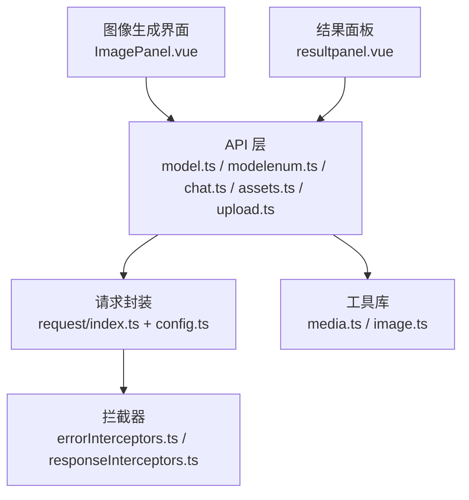
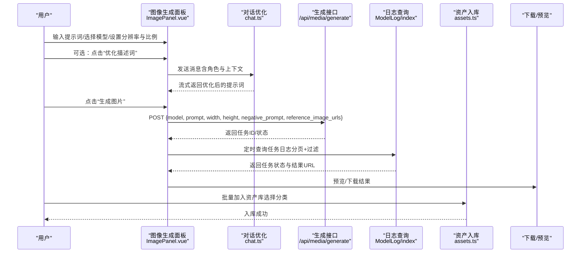
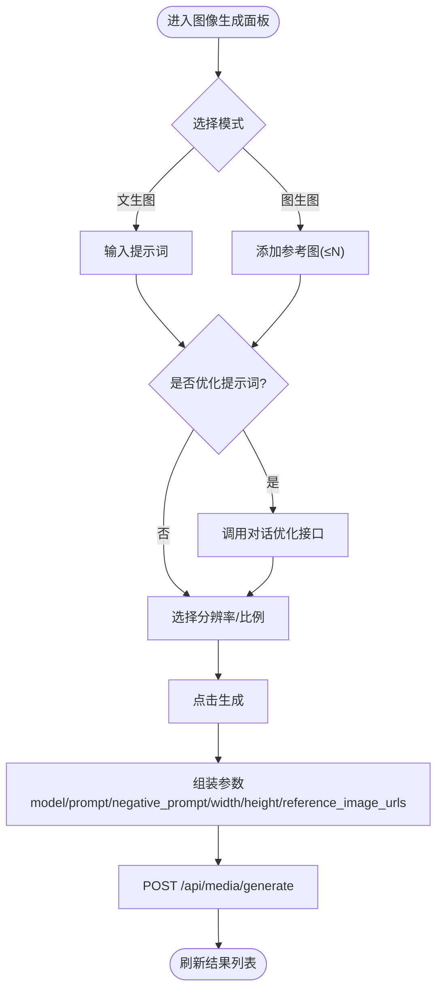
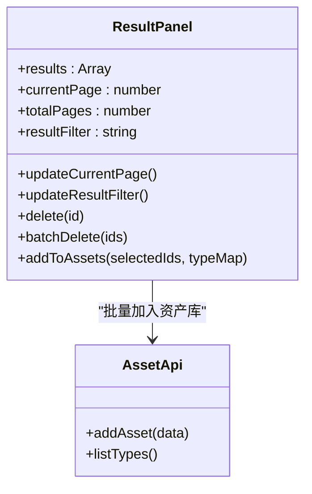
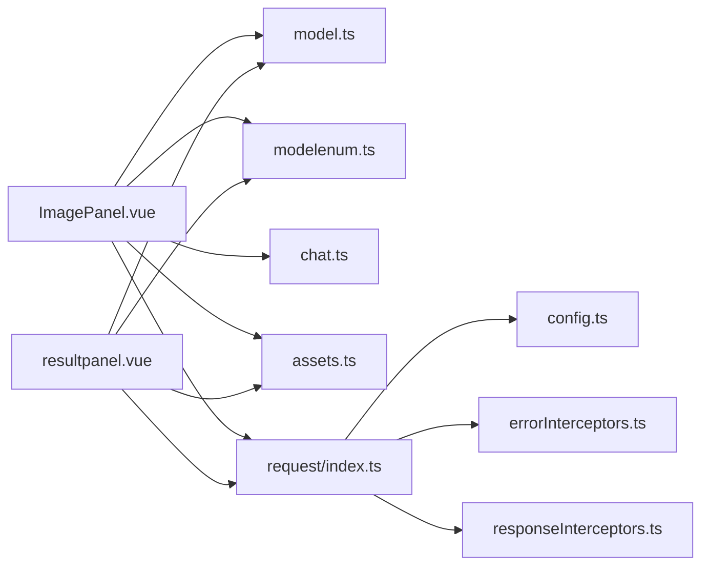

# 图像生成接口

<cite>
**本文引用的文件**   
- [ImagePanel.vue](file://frontend/src/views/AssetsGeneratePage/components/ImagePanel.vue)
- [index.ts（前端主入口）](file://frontend/src/main.ts)
- [media.ts（媒体工具）](file://frontend/src/utils/media.ts)
- [image.ts（图片压缩工具）](file://frontend/src/utils/image.ts)
- [index.ts（结果面板）](file://frontend/src/views/AssetsGeneratePage/components/resultpanel.vue)
- [model.ts（模型列表）](file://frontend/src/api/model.ts)
- [modelenum.ts（枚举配置）](file://frontend/src/api/modelenum.ts)
- [chat.ts（对话优化）](file://frontend/src/api/chat.ts)
- [assets.ts（资产入库）](file://frontend/src/api/assets.ts)
- [upload.ts（上传）](file://frontend/src/api/upload.ts)
- [request/index.ts（请求封装）](file://frontend/src/utils/request/index.ts)
- [config.ts（请求配置）](file://frontend/src/utils/request/config.ts)
- [errorInterceptors.ts（错误拦截器）](file://frontend/src/utils/request/errorInterceptors.ts)
- [responseInterceptors.ts（响应拦截器）](file://frontend/src/utils/request/responseInterceptors.ts)
- [types.ts（请求类型）](file://frontend/src/utils/request/types.ts)
</cite>

## 目录
1. [简介](#简介)
2. [项目结构](#项目结构)
3. [核心组件](#核心组件)
4. [架构总览](#架构总览)
5. [详细组件分析](#详细组件分析)
6. [依赖分析](#依赖分析)
7. [性能考虑](#性能考虑)
8. [故障排查指南](#故障排查指南)
9. [结论](#结论)
10. [附录](#附录)

## 简介
本文件面向“图像生成AI模型”的API使用与集成，覆盖文生图、图生图、风格迁移等能力。文档基于前端工程中的图像生成页面与相关API模块进行梳理，重点说明：
- 调用方式与参数规范（提示词、反向提示词、分辨率、比例、参考图等）
- 异步任务处理、进度跟踪与结果下载流程
- 不同模型的参数对比与使用建议
- 错误处理与常见问题定位

## 项目结构
本项目为前后端分离的前端应用，图像生成能力集中在“资产生成页”及其子组件中，并通过统一的请求封装与API模块完成与服务端的交互。

图表来源
- [ImagePanel.vue](file://frontend/src/views/AssetsGeneratePage/components/ImagePanel.vue)
- [index.ts（结果面板）](file://frontend/src/views/AssetsGeneratePage/components/resultpanel.vue)
- [model.ts（模型列表）](file://frontend/src/api/model.ts)
- [modelenum.ts（枚举配置）](file://frontend/src/api/modelenum.ts)
- [chat.ts（对话优化）](file://frontend/src/api/chat.ts)
- [assets.ts（资产入库）](file://frontend/src/api/assets.ts)
- [upload.ts（上传）](file://frontend/src/api/upload.ts)
- [media.ts（媒体工具）](file://frontend/src/utils/media.ts)
- [image.ts（图片压缩工具）](file://frontend/src/utils/image.ts)
- [request/index.ts（请求封装）](file://frontend/src/utils/request/index.ts)
- [config.ts（请求配置）](file://frontend/src/utils/request/config.ts)
- [errorInterceptors.ts（错误拦截器）](file://frontend/src/utils/request/errorInterceptors.ts)
- [responseInterceptors.ts（响应拦截器）](file://frontend/src/utils/request/responseInterceptors.ts)

章节来源
- [ImagePanel.vue](file://frontend/src/views/AssetsGeneratePage/components/ImagePanel.vue)
- [index.ts（结果面板）](file://frontend/src/views/AssetsGeneratePage/components/resultpanel.vue)
- [request/index.ts（请求封装）](file://frontend/src/utils/request/index.ts)
- [config.ts（请求配置）](file://frontend/src/utils/request/config.ts)

## 核心组件
- 图像生成面板（ImagePanel.vue）
  - 支持“文生图”和“图生图”两种模式
  - 提供提示词输入、反向提示词、分辨率与比例选择、参考图管理
  - 触发生成后，将参数组装并调用后端生成接口
- 结果面板（resultpanel.vue）
  - 展示历史生成记录，支持筛选、分页、预览、删除、批量加入资产库等操作
- 模型与枚举
  - 通过 model.ts 获取可用模型列表
  - 通过 modelenum.ts 获取分辨率、比例等枚举值
- 描述词优化（chat.ts）
  - 借助对话模型对提示词或反向提示词进行智能优化
- 资源入库与上传（assets.ts、upload.ts）
  - 将生成的图片加入“我的资产”，或上传本地素材到系统

章节来源
- [ImagePanel.vue](file://frontend/src/views/AssetsGeneratePage/components/ImagePanel.vue)
- [index.ts（结果面板）](file://frontend/src/views/AssetsGeneratePage/components/resultpanel.vue)
- [model.ts（模型列表）](file://frontend/src/api/model.ts)
- [modelenum.ts（枚举配置）](file://frontend/src/api/modelenum.ts)
- [chat.ts（对话优化）](file://frontend/src/api/chat.ts)
- [assets.ts（资产入库）](file://frontend/src/api/assets.ts)
- [upload.ts（上传）](file://frontend/src/api/upload.ts)

## 架构总览
下图展示了从用户操作到服务端返回结果的端到端流程，包括提示词优化、生成任务提交、轮询状态、结果预览与入库。

图表来源
- [ImagePanel.vue](file://frontend/src/views/AssetsGeneratePage/components/ImagePanel.vue)
- [index.ts（结果面板）](file://frontend/src/views/AssetsGeneratePage/components/resultpanel.vue)
- [chat.ts（对话优化）](file://frontend/src/api/chat.ts)
- [assets.ts（资产入库）](file://frontend/src/api/assets.ts)

## 详细组件分析

### 图像生成面板（ImagePanel.vue）
- 功能要点
  - 模式切换：文生图、图生图
  - 提示词输入与计数限制
  - 反向提示词（可选）
  - 分辨率与比例下拉选择（来自枚举）
  - 参考图管理（图生图模式下最多若干张）
  - 生成按钮与余额/价格显示
- 关键数据字段
  - subTab: 'text2img' | 'img2img'
  - selectedModel: 模型ID
  - prompt: 正向提示词
  - negPrompt: 反向提示词
  - resolution: 分辨率枚举值
  - aspect: 比例枚举值
  - referenceImages: 参考图数组（图生图）
- 交互流程
  - 点击“优化描述词”时，调用对话接口，流式追加文本至当前输入框
  - 点击“生成图片”时，根据所选分辨率枚举解析出width/height，并携带negative_prompt与reference_image_urls发起生成请求
  - 成功后清空输入，刷新结果列表

图表来源
- [ImagePanel.vue](file://frontend/src/views/AssetsGeneratePage/components/ImagePanel.vue)
- [chat.ts（对话优化）](file://frontend/src/api/chat.ts)

章节来源
- [ImagePanel.vue](file://frontend/src/views/AssetsGeneratePage/components/ImagePanel.vue)

### 结果面板（resultpanel.vue）
- 功能要点
  - 结果网格展示（缩略图/视频封面、提示词、模型名、状态、分辨率、费用）
  - 筛选（全部/图片/视频）、分页
  - 批量操作（全选/取消全选、加入资产库、批量删除）
  - 单条删除
  - 预览大图/音视频
- 状态映射
  - pending/running/success/failed 等状态由后端日志接口返回，前端统一映射为中文标签
- 加入资产库
  - 选中多条成功记录，按媒体类型分别选择目标分类，批量入库

图表来源
- [index.ts（结果面板）](file://frontend/src/views/AssetsGeneratePage/components/resultpanel.vue)
- [assets.ts（资产入库）](file://frontend/src/api/assets.ts)

章节来源
- [index.ts（结果面板）](file://frontend/src/views/AssetsGeneratePage/components/resultpanel.vue)
- [assets.ts（资产入库）](file://frontend/src/api/assets.ts)

### 模型与枚举（model.ts、modelenum.ts）
- 模型列表
  - 通过分组码获取图像类模型，用于下拉选择
- 枚举配置
  - 分辨率、比例、时长等枚举项，供UI渲染与参数校验

章节来源
- [model.ts（模型列表）](file://frontend/src/api/model.ts)
- [modelenum.ts（枚举配置）](file://frontend/src/api/modelenum.ts)

### 描述词优化（chat.ts）
- 作用
  - 将用户输入的提示词或反向提示词交由对话模型优化，提升生成质量
- 交互
  - 支持流式追加内容，避免一次性长文本阻塞
  - 失败回退：若结果为空或异常，恢复原输入并提示重试

章节来源
- [chat.ts（对话优化）](file://frontend/src/api/chat.ts)

### 资源入库与上传（assets.ts、upload.ts）
- 资源入库
  - 将已生成的图片/视频加入“我的资产”，需指定类型与名称
- 上传
  - 支持拖拽/多选上传，带进度条与错误提示

章节来源
- [assets.ts（资产入库）](file://frontend/src/api/assets.ts)
- [upload.ts（上传）](file://frontend/src/api/upload.ts)

## 依赖分析
- 组件耦合
  - ImagePanel.vue 依赖 model.ts、modelenum.ts、chat.ts、assets.ts 以及 request 封装
  - resultpanel.vue 依赖 assets.ts、model.ts、modelenum.ts 以及 request 封装
- 外部依赖
  - 媒体工具 media.ts 提供时间格式化、类型判断、视频首帧提取
  - 图片压缩 image.ts 在部分场景下对缩略图进行压缩以提升加载性能
- 请求链路
  - 统一通过 request/index.ts 发起，config.ts 提供基础配置，errorInterceptors.ts 与 responseInterceptors.ts 负责错误与响应处理

图表来源
- [ImagePanel.vue](file://frontend/src/views/AssetsGeneratePage/components/ImagePanel.vue)
- [index.ts（结果面板）](file://frontend/src/views/AssetsGeneratePage/components/resultpanel.vue)
- [model.ts（模型列表）](file://frontend/src/api/model.ts)
- [modelenum.ts（枚举配置）](file://frontend/src/api/modelenum.ts)
- [chat.ts（对话优化）](file://frontend/src/api/chat.ts)
- [assets.ts（资产入库）](file://frontend/src/api/assets.ts)
- [request/index.ts（请求封装）](file://frontend/src/utils/request/index.ts)
- [config.ts（请求配置）](file://frontend/src/utils/request/config.ts)
- [errorInterceptors.ts（错误拦截器）](file://frontend/src/utils/request/errorInterceptors.ts)
- [responseInterceptors.ts（响应拦截器）](file://frontend/src/utils/request/responseInterceptors.ts)

章节来源
- [request/index.ts（请求封装）](file://frontend/src/utils/request/index.ts)
- [config.ts（请求配置）](file://frontend/src/utils/request/config.ts)
- [errorInterceptors.ts（错误拦截器）](file://frontend/src/utils/request/errorInterceptors.ts)
- [responseInterceptors.ts（响应拦截器）](file://frontend/src/utils/request/responseInterceptors.ts)

## 性能考虑
- 图片压缩
  - 在需要大量缩略图的场景，优先使用 image.ts 提供的压缩能力，降低带宽与渲染压力
- 视频首帧
  - 使用 media.ts 的视频首帧提取，避免直接播放大体积视频
- 分页与懒加载
  - 结果列表采用分页加载；图片/视频按需加载，减少首屏开销
- 并发控制
  - 批量入库或批量删除时，建议使用 Promise.allSettled 保证整体稳定性

[本节为通用指导，不直接分析具体文件]

## 故障排查指南
- 网络与鉴权
  - 检查 request/index.ts 的基础配置与拦截器是否正确注入
  - 确认 token 与白名单配置
- 参数校验
  - 分辨率与比例必须来自枚举，确保 width/height 正确解析
  - 提示词长度限制与非法字符处理
- 生成失败
  - 查看日志接口返回的状态码与错误信息
  - 若为超时，适当延长轮询间隔或增加重试次数
- 入库失败
  - 确认选择的资产类型有效，且媒体URL可访问
  - 检查上传/入库接口的返回结构与业务错误码

章节来源
- [request/index.ts（请求封装）](file://frontend/src/utils/request/index.ts)
- [config.ts（请求配置）](file://frontend/src/utils/request/config.ts)
- [errorInterceptors.ts（错误拦截器）](file://frontend/src/utils/request/errorInterceptors.ts)
- [responseInterceptors.ts（响应拦截器）](file://frontend/src/utils/request/responseInterceptors.ts)

## 结论
本接口文档围绕前端图像生成能力进行了系统化梳理，明确了文生图、图生图的调用路径、参数规范与结果处理流程。结合模型与枚举配置、描述词优化、结果管理与资产入库，形成完整的“生成—管理—复用”闭环。建议在接入时严格遵循枚举约束与错误处理策略，并结合性能优化手段保障用户体验。

[本节为总结性内容，不直接分析具体文件]

## 附录

### 接口定义（基于前端实现）
- 生成图片
  - 方法：POST
  - 路径：/api/media/generate
  - 请求体
    - model: string（模型ID）
    - prompt: string（提示词）
    - negative_prompt?: string（反向提示词）
    - width?: number（由分辨率枚举解析）
    - height?: number（由分辨率枚举解析）
    - reference_image_urls?: string[]（图生图参考图URL数组）
  - 响应
    - 包含任务ID与状态，后续通过日志接口查询
- 查询任务日志
  - 方法：GET
  - 路径：/app/xbAiModelAgent/api/ModelLog/index
  - 查询参数
    - page: number
    - limit: number
    - modality?: string（如 image/video）
  - 响应
    - 列表包含 id、status、asset_url、thumbnail、prompt、resolution、sale_amount 等字段
- 加入资产库
  - 方法：POST
  - 路径：/app/xbAiModelAgent/api/Asset/add（示例路径，以实际为准）
  - 请求体
    - name: string
    - type: string（如 background/character/prop 等）
    - source: string（来源标识）
    - media_url: string
    - thumb?: string
    - tags?: string
- 上传素材
  - 方法：POST
  - 路径：/api/upload（示例路径，以实际为准）
  - 表单字段
    - file: File
    - type: string（资产类型）
    - tags?: string

章节来源
- [ImagePanel.vue](file://frontend/src/views/AssetsGeneratePage/components/ImagePanel.vue)
- [index.ts（结果面板）](file://frontend/src/views/AssetsGeneratePage/components/resultpanel.vue)
- [model.ts（模型列表）](file://frontend/src/api/model.ts)
- [modelenum.ts（枚举配置）](file://frontend/src/api/modelenum.ts)
- [assets.ts（资产入库）](file://frontend/src/api/assets.ts)
- [upload.ts（上传）](file://frontend/src/api/upload.ts)

### 参数与规格建议
- 分辨率与比例
  - 优先从枚举中选择，避免手动输入导致尺寸不合法
  - 常见推荐：横屏 16:9（如 1280×720），竖屏 9:16（如 720×1280）
- 提示词与反向提示词
  - 正向提示词尽量具体，包含主体、背景、风格、光影等要素
  - 反向提示词补充常见负面词（低质量、模糊、变形等）
- 参考图（图生图）
  - 数量控制在上限以内，保持主题一致性与清晰度
- 模型选择
  - 根据画面风格与复杂度选择合适模型，关注价格与耗时差异

[本节为通用指导，不直接分析具体文件]