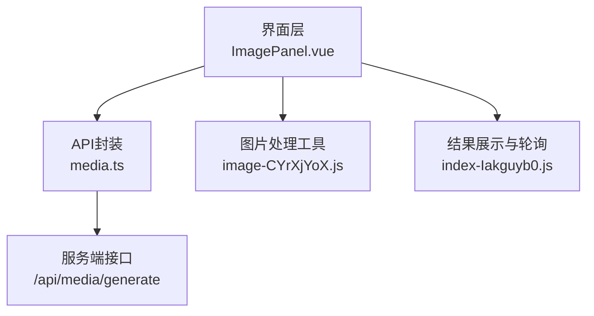
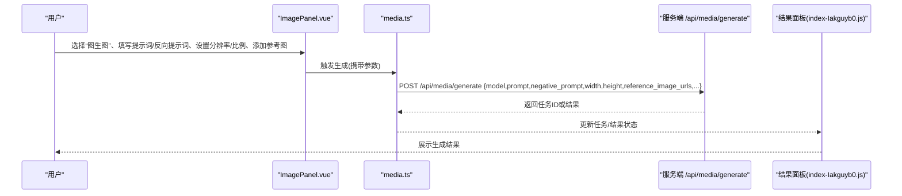
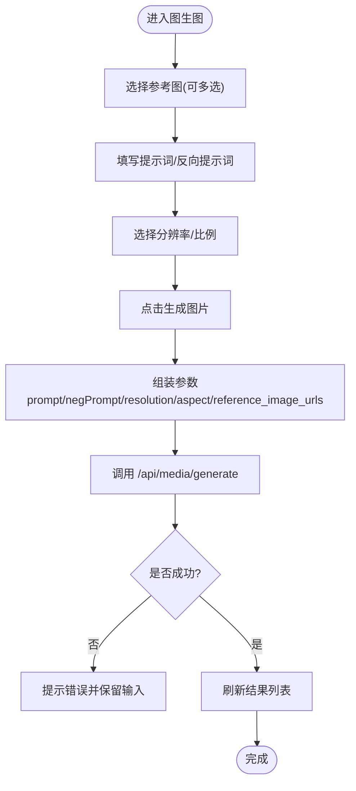
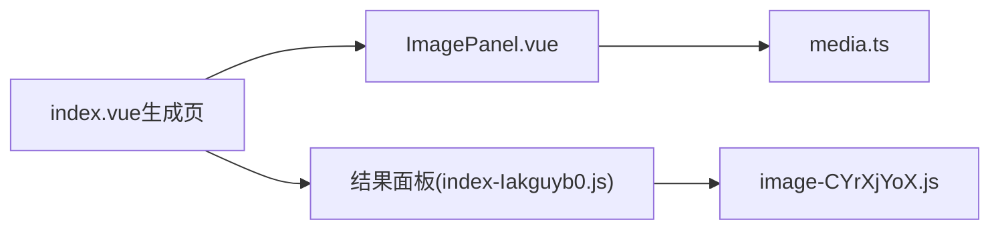

# 图生图接口

<cite>
**本文引用的文件**   
- [ImagePanel.vue](file://frontend/src/views/AssetsGeneratePage/components/ImagePanel.vue)
- [index.vue（生成页主入口）](file://frontend/src/views/AssetsGeneratePage/index.vue)
- [media.ts](file://frontend/src/api/media.ts)
- [image-CYrXjYoX.js（前端构建产物，含图片压缩逻辑）](file://frontend/dist/assets/image-CYrXjYoX.js)
- [index-Iakguyb0.js（前端构建产物，含调用 /api/media/generate 的聚合页面）](file://frontend/dist/assets/index-Iakguyb0.js)
</cite>

## 目录
1. [简介](#简介)
2. [项目结构](#项目结构)
3. [核心组件](#核心组件)
4. [架构总览](#架构总览)
5. [详细组件分析](#详细组件分析)
6. [依赖关系分析](#依赖关系分析)
7. [性能与规范](#性能与规范)
8. [故障排查指南](#故障排查指南)
9. [结论](#结论)
10. [附录：参数与示例](#附录参数与示例)

## 简介
本文件面向“图生图（Image-to-Image）”能力，提供基于参考图片进行图像编辑与风格迁移的API接口文档。内容涵盖：
- 参考图片上传与选择方式
- 请求参数说明（提示词、反向提示词、分辨率、比例、参考图等）
- 图片预处理要求（格式、尺寸、大小限制等）
- 调用流程与最佳实践
- 常见问题定位方法

注意：当前仓库未包含后端控制器实现代码，本文依据前端源码与构建产物中的实际调用路径与参数构造进行整理。

## 项目结构
与图生图相关的前端关键位置如下：
- 图生图面板与交互：ImagePanel.vue
- 生成页主入口（组合各面板与结果展示）：index.vue
- 媒体生成API封装：media.ts
- 图片压缩工具（构建产物中可见）：image-CYrXjYoX.js
- 聚合页面（构建产物中可见对 /api/media/generate 的调用）：index-Iakguyb0.js

图表来源
- [ImagePanel.vue:1-260](file://frontend/src/views/AssetsGeneratePage/components/ImagePanel.vue#L1-L260)
- [media.ts](file://frontend/src/api/media.ts)
- [image-CYrXjYoX.js:1-200](file://frontend/dist/assets/image-CYrXjYoX.js#L1-L200)
- [index-Iakguyb0.js:1-200](file://frontend/dist/assets/index-Iakguyb0.js#L1-L200)

章节来源
- [ImagePanel.vue:1-260](file://frontend/src/views/AssetsGeneratePage/components/ImagePanel.vue#L1-L260)
- [media.ts](file://frontend/src/api/media.ts)
- [index-Iakguyb0.js:1-200](file://frontend/dist/assets/index-Iakguyb0.js#L1-L200)

## 核心组件
- ImagePanel.vue：负责文生图/图生图子标签切换、提示词输入、反向提示词、分辨率与比例选择、参考图选择与预览、提交生成等。
- media.ts：封装媒体生成请求，统一调用 /api/media/generate。
- index.vue（生成页主入口）：组合 ImagePanel、VideoPanel、ResultPanel 等，并管理模型枚举、任务轮询等。
- image-CYrXjYoX.js（构建产物）：提供图片压缩与缩略图生成能力，用于优化上传体积与加载速度。
- index-Iakguyb0.js（构建产物）：聚合页面中对 /api/media/generate 的实际调用与结果列表渲染。

章节来源
- [ImagePanel.vue:1-260](file://frontend/src/views/AssetsGeneratePage/components/ImagePanel.vue#L1-L260)
- [media.ts](file://frontend/src/api/media.ts)
- [index.vue（生成页主入口）](file://frontend/src/views/AssetsGeneratePage/index.vue)
- [image-CYrXjYoX.js:1-200](file://frontend/dist/assets/image-CYrXjYoX.js#L1-L200)
- [index-Iakguyb0.js:1-200](file://frontend/dist/assets/index-Iakguyb0.js#L1-L200)

## 架构总览
图生图的端到端流程：
- 用户在 ImagePanel 中选择“图生图”，填写提示词、可选反向提示词，设置分辨率与比例，并添加参考图。
- 点击“生成图片”后，由 media.ts 将参数组装为请求体，POST 到 /api/media/generate。
- 服务端返回任务或结果；前端在结果面板中轮询任务状态并展示最终图片。

图表来源
- [ImagePanel.vue:1-260](file://frontend/src/views/AssetsGeneratePage/components/ImagePanel.vue#L1-L260)
- [media.ts](file://frontend/src/api/media.ts)
- [index-Iakguyb0.js:1-200](file://frontend/dist/assets/index-Iakguyb0.js#L1-L200)

## 详细组件分析

### 图生图面板（ImagePanel.vue）
- 功能要点
  - 支持“文生图/图生图”子标签切换。
  - 图生图模式下，提供“参考图”区域，可从资产库多选参考图，最多若干张（界面显示上限）。
  - 支持正向提示词与反向提示词输入，并提供“优化描述词”按钮（通过对话模型优化提示词）。
  - 支持分辨率与比例下拉选择，默认值来自枚举配置。
  - 点击“生成图片”后，将 prompt、negative_prompt、resolution、aspect、selectedModel、referenceImages 等信息提交。

- 关键交互与数据流
  - 参考图选择：从资产选择器弹窗中选择多张图片，形成 referenceImages 数组，每项包含 id、thumb/media_url 等字段。
  - 提交参数：根据所选分辨率枚举项解析 width/height，并将 referenceImages 映射为 URL 列表 reference_image_urls。
  - 错误处理：生成失败时弹出提示，保留原输入以便重试。

图表来源
- [ImagePanel.vue:1-260](file://frontend/src/views/AssetsGeneratePage/components/ImagePanel.vue#L1-L260)
- [index-Iakguyb0.js:1-200](file://frontend/dist/assets/index-Iakguyb0.js#L1-L200)

章节来源
- [ImagePanel.vue:1-260](file://frontend/src/views/AssetsGeneratePage/components/ImagePanel.vue#L1-L260)

### 媒体生成API封装（media.ts）
- 职责
  - 统一封装媒体生成请求，调用 /api/media/generate。
  - 接收 ImagePanel 传入的参数对象，转发至服务端。

- 典型入参（由前端构造）
  - model：选用的模型ID
  - prompt：正向提示词
  - negative_prompt：反向提示词（可选）
  - width/height：由分辨率枚举项解析得到
  - reference_image_urls：参考图URL数组（图生图模式）
  - duration_seconds：视频生成时使用（图生图不涉及）

章节来源
- [media.ts](file://frontend/src/api/media.ts)
- [index-Iakguyb0.js:1-200](file://frontend/dist/assets/index-Iakguyb0.js#L1-L200)

### 图片预处理与压缩（image-CYrXjYoX.js）
- 作用
  - 在部分场景对图片进行压缩与缩略图生成，以降低传输体积、提升加载体验。
  - 在结果列表中，对远端图片URL进行压缩以生成 thumbnail_compressed。

- 使用位置
  - 结果列表渲染时对图片URL进行压缩。
  - 上传/选择图片时可结合该工具进行本地压缩（具体由上层组件决定）。

章节来源
- [image-CYrXjYoX.js:1-200](file://frontend/dist/assets/image-CYrXjYoX.js#L1-L200)

## 依赖关系分析
- 组件耦合
  - ImagePanel.vue 依赖 media.ts 发起生成请求。
  - 生成页主入口 index.vue 组合 ImagePanel、VideoPanel、ResultPanel，并负责枚举获取与任务轮询。
- 外部依赖
  - 图片压缩工具 image-CYrXjYoX.js 被多处引用，用于优化图片资源。
  - 结果面板在构建产物中直接调用 /api/media/generate 与任务日志接口。

图表来源
- [ImagePanel.vue:1-260](file://frontend/src/views/AssetsGeneratePage/components/ImagePanel.vue#L1-L260)
- [index.vue（生成页主入口）](file://frontend/src/views/AssetsGeneratePage/index.vue)
- [index-Iakguyb0.js:1-200](file://frontend/dist/assets/index-Iakguyb0.js#L1-L200)
- [image-CYrXjYoX.js:1-200](file://frontend/dist/assets/image-CYrXjYoX.js#L1-L200)

章节来源
- [ImagePanel.vue:1-260](file://frontend/src/views/AssetsGeneratePage/components/ImagePanel.vue#L1-L260)
- [index.vue（生成页主入口）](file://frontend/src/views/AssetsGeneratePage/index.vue)
- [index-Iakguyb0.js:1-200](file://frontend/dist/assets/index-Iakguyb0.js#L1-L200)
- [image-CYrXjYoX.js:1-200](file://frontend/dist/assets/image-CYrXjYoX.js#L1-L200)

## 性能与规范
- 图片格式建议
  - 优先使用 PNG/JPG/SVG 等常见格式，避免超大体积源图。
- 尺寸与比例
  - 分辨率与比例通过下拉枚举选择，建议遵循常用比例（如 16:9、9:16、1:1），以获得更稳定的生成效果。
- 文件大小限制
  - 前端具备图片压缩能力，建议在上传前进行本地压缩，减少网络传输与服务器处理压力。
- 参考图数量
  - 界面显示参考图选择上限（例如最多若干张），请遵循界面提示，避免过多参考图导致生成不稳定。
- 权重控制与变形强度
  - 当前前端未暴露“权重控制”“变形强度”等高级参数控件；如需使用，请在服务端扩展对应参数并在前端补充UI。

[本节为通用指导，不直接分析具体文件]

## 故障排查指南
- 生成失败
  - 现象：点击“生成图片”后弹出错误提示。
  - 排查：检查提示词是否为空、模型是否已选择、参考图URL是否有效。
  - 参考：生成失败时的错误提示与输入保留逻辑。
- 参考图未生效
  - 现象：图生图模式下参考图未影响结果。
  - 排查：确认参考图已成功加入列表且URL可用；检查 reference_image_urls 是否正确传递。
- 图片加载缓慢
  - 现象：结果图片加载慢或模糊。
  - 排查：确认是否启用压缩缩略图；必要时调整分辨率与比例。

章节来源
- [index-Iakguyb0.js:1-200](file://frontend/dist/assets/index-Iakguyb0.js#L1-L200)
- [image-CYrXjYoX.js:1-200](file://frontend/dist/assets/image-CYrXjYoX.js#L1-L200)

## 结论
图生图能力在前端已完整落地：支持参考图选择、提示词与反向提示词输入、分辨率与比例设置，并通过 /api/media/generate 与服务端对接。当前版本未暴露权重控制与变形强度等高级参数，后续可在服务端与前端同步扩展。

[本节为总结性内容，不直接分析具体文件]

## 附录：参数与示例

### 接口定义
- 接口路径
  - POST /api/media/generate
- 请求头
  - Content-Type: application/json
- 请求体字段（图生图）
  - model：string，必填，模型ID
  - prompt：string，必填，正向提示词
  - negative_prompt：string，可选，反向提示词
  - width：number，可选，由分辨率枚举项解析
  - height：number，可选，由分辨率枚举项解析
  - reference_image_urls：string[]，可选，参考图URL数组（图生图模式）
  - 其他字段：按服务端约定扩展

- 响应体
  - 可能返回任务ID或结果对象，前端会轮询任务状态并展示最终图片。

章节来源
- [media.ts](file://frontend/src/api/media.ts)
- [index-Iakguyb0.js:1-200](file://frontend/dist/assets/index-Iakguyb0.js#L1-L200)

### 调用示例（概念性）
- 请求示例（JSON）
  - {
      "model": "xxx",
      "prompt": "古风少女，竹林背景，柔光",
      "negative_prompt": "低质量，模糊，多余肢体",
      "width": 1024,
      "height": 768,
      "reference_image_urls": ["https://.../ref1.jpg", "https://.../ref2.png"]
    }
- 响应示例（概念性）
  - {
      "id": "task_12345",
      "status": "success",
      "mediaUrl": "https://.../result.jpg",
      "thumbnail": "https://.../thumb.jpg"
    }

[本节为概念性示例，便于理解整体流程]

### 最佳实践
- 提示词编写
  - 明确主体、场景、风格、光影、构图等要素；可使用“优化描述词”辅助完善。
- 参考图选择
  - 选择与目标风格相近的参考图，数量适中，避免冲突信息。
- 分辨率与比例
  - 根据用途选择合适的比例与分辨率，兼顾清晰度与生成速度。
- 批量生成
  - 可先小批量试跑，稳定后再批量生成，降低失败成本。

[本节为通用指导，不直接分析具体文件]