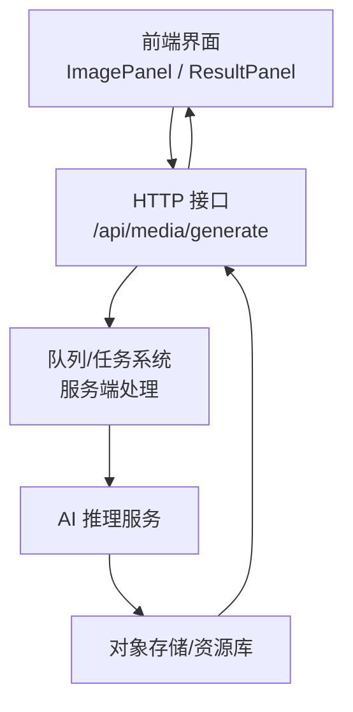
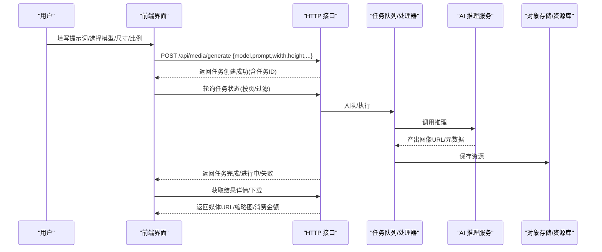
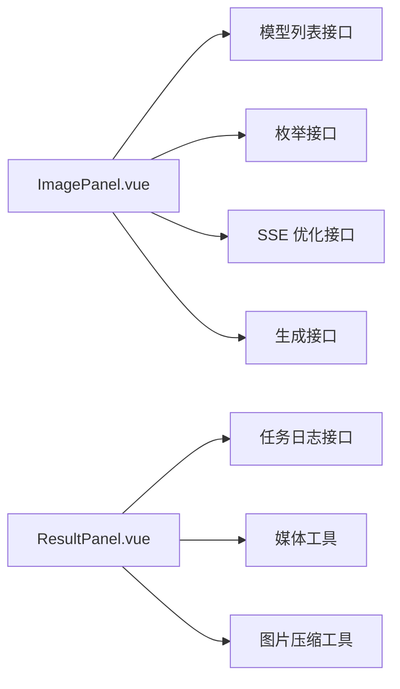

# 文生图接口

<cite>
**本文引用的文件**   
- [前端主入口（已编译）](file://frontend/dist/assets/index-Iakguyb0.js)
- [媒体工具（已编译）](file://frontend/dist/assets/media-BR4SIyed.js)
- [图片压缩工具（已编译）](file://frontend/dist/assets/image-CYrXjYoX.js)
- [模型枚举与日志接口（已编译）](file://frontend/dist/assets/index-Iakguyb0.js)
- [资产生成页面组件（源码）](file://frontend/src/views/AssetsGeneratePage/components/ImagePanel.vue)
- [结果面板组件（源码）](file://frontend/src/views/AssetsGeneratePage/components/ResultPanel.vue)
</cite>

## 目录
1. [简介](#简介)
2. [项目结构](#项目结构)
3. [核心组件](#核心组件)
4. [架构总览](#架构总览)
5. [详细接口说明](#详细接口说明)
6. [依赖关系分析](#依赖关系分析)
7. [性能与体验优化](#性能与体验优化)
8. [故障排查指南](#故障排查指南)
9. [结论](#结论)
10. [附录：调用示例与最佳实践](#附录调用示例与最佳实践)

## 简介
本文件面向“文生图（Text-to-Image）”能力，提供从提示词到图像产出的完整API文档。内容覆盖：
- 模型选择、提示词编写规范、图像尺寸配置、质量参数设置
- 请求参数格式、响应数据结构、错误处理机制
- 不同AI模型的参数对比和使用建议
- 异步任务处理、进度查询、结果下载等端到端流程

## 项目结构
本项目为前后端分离的Web应用，文生图功能由前端发起HTTP请求，后端通过插件化服务调度AI推理并返回任务状态与结果。前端负责：
- 模型列表与枚举加载
- 提示词输入与反向提示词编辑
- 分辨率与比例选择
- 参考图上传与预览
- 任务提交、轮询、结果展示与下载

[无图表来源；该图为概念性架构图]

## 核心组件
- 图像生成面板（ImagePanel）：负责提示词、反向提示词、模型选择、分辨率与比例、参考图选择与预览、触发生成。
- 结果面板（ResultPanel）：负责任务列表、分页、筛选、批量操作、详情查看、加入资产库、删除、下载。
- 媒体工具（media）：视频缩略图提取、时长格式化、类型判断。
- 图片压缩（image）：Canvas压缩、跨域处理、失败回退。

章节来源
- [前端主入口（已编译）](file://frontend/dist/assets/index-Iakguyb0.js)
- [媒体工具（已编译）](file://frontend/dist/assets/media-BR4SIyed.js)
- [图片压缩工具（已编译）](file://frontend/dist/assets/image-CYrXjYoX.js)
- [资产生成页面组件（源码）](file://frontend/src/views/AssetsGeneratePage/components/ImagePanel.vue)
- [结果面板组件（源码）](file://frontend/src/views/AssetsGeneratePage/components/ResultPanel.vue)

## 架构总览
下图展示了从用户点击“生成图片”到最终结果展示的时序。

图表来源
- [前端主入口（已编译）](file://frontend/dist/assets/index-Iakguyb0.js)

## 详细接口说明

### 通用约定
- 基础路径：/api
- 认证方式：根据平台统一鉴权中间件（如JWT），具体以平台集成为准
- 字符编码：UTF-8
- 返回格式：JSON

### 1) 提交文生图任务
- 方法：POST
- 路径：/api/media/generate
- 用途：提交文本提示词生成图像的任务

请求体字段（部分）
- model: string，必填，模型标识
- prompt: string，必填，正向提示词
- negative_prompt: string，可选，反向提示词
- width: number，可选，宽度像素
- height: number，可选，高度像素
- reference_image_urls: string[]，可选，参考图URL数组（用于图生图或风格参考）

响应体字段（部分）
- id: string，任务ID
- status: string，任务状态（pending/running/success/failed）
- media_url: string，成功后媒体地址
- thumbnail: string，缩略图地址
- resolution: string，输出分辨率（如 1024x1024）
- sale_amount: number，实际消费金额（可能为空）
- create_at: string，创建时间

错误码与消息
- 业务错误：返回包含 message 的错误对象，前端需弹窗提示
- 网络错误：超时、断网等，前端需重试或提示

章节来源
- [前端主入口（已编译）](file://frontend/dist/assets/index-Iakguyb0.js)

### 2) 查询任务日志（分页/过滤）
- 方法：GET
- 路径：/app/xbAiModelAgent/api/ModelLog/index
- 用途：分页查询任务日志，支持按模态类型过滤（image/video/audio）

查询参数（部分）
- page: number，当前页
- limit: number，每页条数
- modality: string，任务类型（image/video/audio）

响应体字段（部分）
- data: array，任务记录集合
- current_page: number，当前页
- last_page: number，总页数
- total: number，总数

每条记录关键字段
- id, type, prompt, status, create_at, asset_url, asset_url_compressed, width, height, result.size, sale_amount

章节来源
- [前端主入口（已编译）](file://frontend/dist/assets/index-Iakguyb0.js)

### 3) 删除单条任务记录
- 方法：DELETE
- 路径：/app/xbAiModelAgent/api/ModelLog/delete
- 查询参数：id

### 4) 批量删除任务记录
- 方法：DELETE
- 路径：/app/xbAiModelAgent/api/ModelLog/batchDelete
- 请求体：{ ids: number[] }

### 5) 获取模型列表
- 方法：GET
- 路径：/app/xbAiModelAgent/api/Model/index
- 查询参数：group_code（例如 image/video/text）

响应体字段（部分）
- id/name/model_id/icon/description/prices_format/sale_prices 等

章节来源
- [前端主入口（已编译）](file://frontend/dist/assets/index-Iakguyb0.js)

### 6) 获取枚举配置（分辨率/比例/时长等）
- 方法：GET
- 路径：/app/xbAiModelAgent/api/ModelEnum/index
- 用途：动态渲染分辨率、比例、时长等下拉选项

章节来源
- [前端主入口（已编译）](file://frontend/dist/assets/index-Iakguyb0.js)

### 7) 描述词优化（SSE流式）
- 方法：POST
- 路径：/app/xbAiModelAgent/api/Chat/chat
- 用途：基于对话模型对提示词/反向提示词进行优化，采用SSE增量返回
- 请求体（示例字段）：model_id, messages（system/user 角色+内容）
- 响应：SSE事件流，前端拼接后更新输入框

章节来源
- [前端主入口（已编译）](file://frontend/dist/assets/index-Iakguyb0.js)

### 8) 加入资产库（将生成结果入库）
- 方法：POST
- 路径：/api/media/generate（复用同一接口作为“加入资产库”的入口，具体以平台实现为准）
- 用途：将已成功生成的媒体加入资产库，附带名称、类型、标签等

章节来源
- [前端主入口（已编译）](file://frontend/dist/assets/index-Iakguyb0.js)

## 依赖关系分析
- ImagePanel 依赖：
  - 模型列表与枚举：用于渲染选择器与价格计算
  - SSE 优化接口：用于提示词/反向提示词优化
  - 生成接口：提交任务
- ResultPanel 依赖：
  - 任务日志接口：分页、过滤、删除、批量删除
  - 媒体工具：视频缩略图提取、时长格式化
  - 图片压缩：缩略图压缩与跨域处理

图表来源
- [资产生成页面组件（源码）](file://frontend/src/views/AssetsGeneratePage/components/ImagePanel.vue)
- [结果面板组件（源码）](file://frontend/src/views/AssetsGeneratePage/components/ResultPanel.vue)
- [前端主入口（已编译）](file://frontend/dist/assets/index-Iakguyb0.js)
- [媒体工具（已编译）](file://frontend/dist/assets/media-BR4SIyed.js)
- [图片压缩工具（已编译）](file://frontend/dist/assets/image-CYrXjYoX.js)

## 性能与体验优化
- 缩略图压缩：使用 Canvas 压缩，限制最大宽高与质量，失败时回退原图
- 跨域处理：图片/视频加载时启用 crossOrigin，避免污染 Canvas
- 视频缩略图：通过 video 元素截取帧生成缩略图，提升列表加载速度
- 分页与懒加载：任务日志分页加载，减少首屏压力
- 增量优化：SSE 流式优化提示词，边生成边显示，提升交互体验

章节来源
- [图片压缩工具（已编译）](file://frontend/dist/assets/image-CYrXjYoX.js)
- [媒体工具（已编译）](file://frontend/dist/assets/media-BR4SIyed.js)
- [前端主入口（已编译）](file://frontend/dist/assets/index-Iakguyb0.js)

## 故障排查指南
- 生成失败
  - 检查模型是否可用、提示词是否为空、分辨率是否在枚举范围内
  - 查看任务日志中 status 与 sale_amount，确认是否扣费成功
- 缩略图不显示
  - 检查跨域配置，确保资源允许跨域访问
  - 若 Canvas 被污染，回退到原图 URL
- 视频无法播放
  - 检查媒体URL有效性、浏览器兼容性
  - 使用媒体工具进行时长格式化与类型判断

章节来源
- [前端主入口（已编译）](file://frontend/dist/assets/index-Iakguyb0.js)
- [媒体工具（已编译）](file://frontend/dist/assets/media-BR4SIyed.js)
- [图片压缩工具（已编译）](file://frontend/dist/assets/image-CYrXjYoX.js)

## 结论
文生图接口通过统一的HTTP入口与任务日志体系，实现了从提示词到图像的端到端流程。结合SSE优化、缩略图压缩与分页加载，兼顾了性能与用户体验。建议在接入时严格遵循参数校验与错误处理规范，并结合枚举配置动态渲染UI，以获得更稳定的体验。

## 附录：调用示例与最佳实践

### 提示词编写规范
- 正向提示词：明确主体、场景、风格、光影、构图等细节，尽量具体且不超过长度限制
- 反向提示词：补充常见负面词（低质量、模糊、变形、多余肢体等），用逗号分隔
- 参考图：用于风格或构图参考，数量受上限约束

### 模型选择与参数对比
- 模型列表：通过模型列表接口获取，关注 icon、description、prices_format、sale_prices
- 分辨率与比例：通过枚举接口获取，注意不同模型支持的分辨率差异
- 价格策略：按分辨率或按张计费，前端根据枚举与模型定价计算预估费用

### 异步任务处理
- 提交任务后，轮询任务日志接口，按页/过滤条件刷新
- 当任务状态为 success/completed 时，展示媒体URL与缩略图
- 支持批量删除与加入资产库

### 结果下载
- 媒体URL可直接下载或嵌入播放器/图片容器
- 缩略图优先使用压缩后的版本，失败则回退原图

章节来源
- [前端主入口（已编译）](file://frontend/dist/assets/index-Iakguyb0.js)
- [媒体工具（已编译）](file://frontend/dist/assets/media-BR4SIyed.js)
- [图片压缩工具（已编译）](file://frontend/dist/assets/image-CYrXjYoX.js)
- [资产生成页面组件（源码）](file://frontend/src/views/AssetsGeneratePage/components/ImagePanel.vue)
- [结果面板组件（源码）](file://frontend/src/views/AssetsGeneratePage/components/ResultPanel.vue)