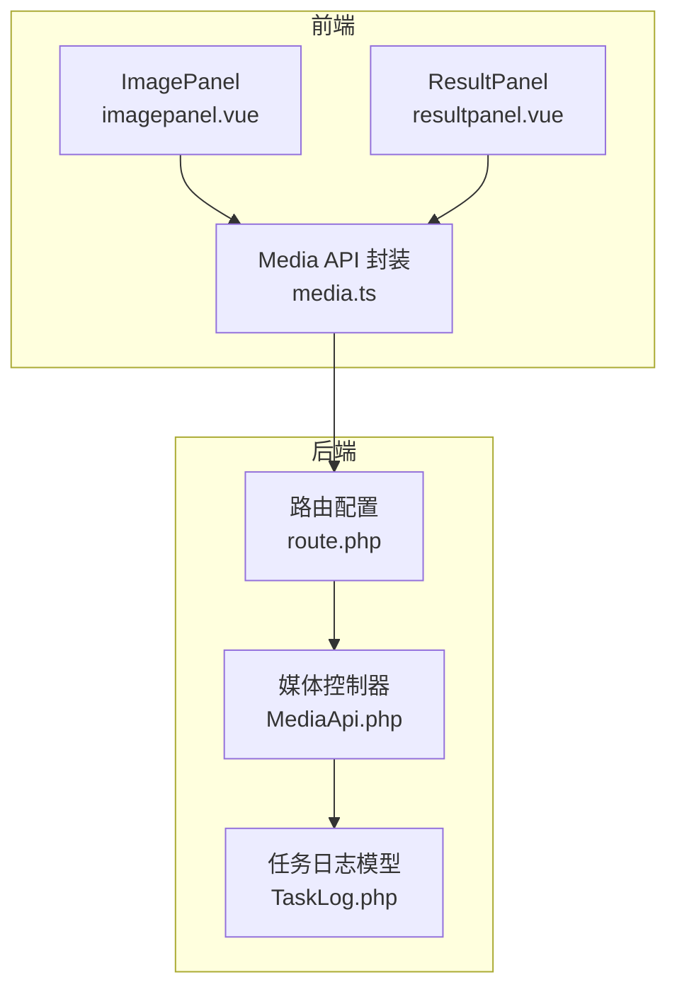
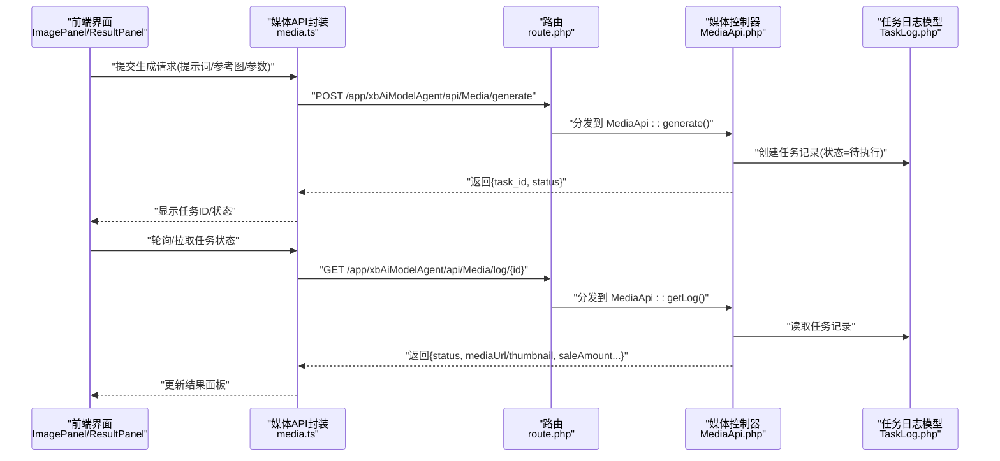
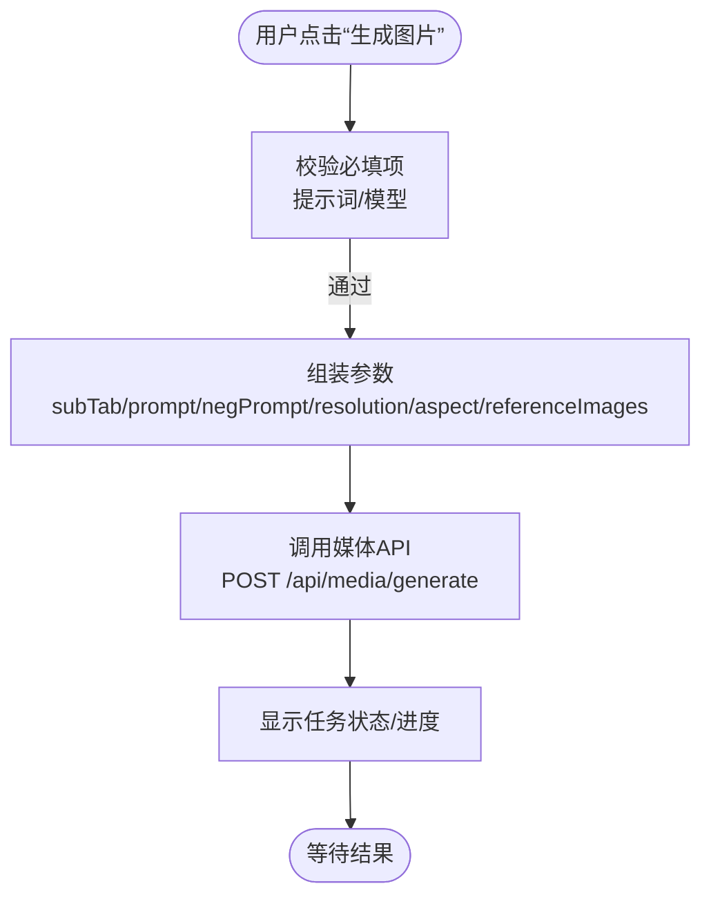
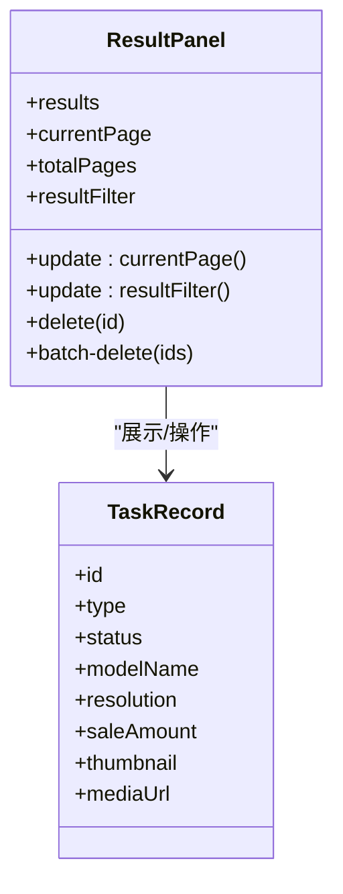
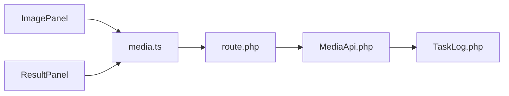

# 风格迁移接口

<cite>
**本文引用的文件**   
- [frontend/src/views/assetsgeneratepage/components/imagepanel.vue](file://frontend/src/views/assetsgeneratepage/components/imagepanel.vue)
- [frontend/src/views/assetsgeneratepage/components/resultpanel.vue](file://frontend/src/views/assetsgeneratepage/components/resultpanel.vue)
- [frontend/src/api/media.ts](file://frontend/src/api/media.ts)
- [server/plugin/xbAiModelAgent/app/api/controller/MediaApi.php](file://server/plugin/xbAiModelAgent/app/api/controller/MediaApi.php)
- [server/plugin/xbAiModelAgent/config/route.php](file://server/plugin/xbAiModelAgent/config/route.php)
- [server/plugin/xbAiModelAgent/app/model/TaskLog.php](file://server/plugin/xbAiModelAgent/app/model/TaskLog.php)
</cite>

## 目录
1. [简介](#简介)
2. [项目结构](#项目结构)
3. [核心组件](#核心组件)
4. [架构总览](#架构总览)
5. [详细组件分析](#详细组件分析)
6. [依赖分析](#依赖分析)
7. [性能考虑](#性能考虑)
8. [故障排查指南](#故障排查指南)
9. [结论](#结论)
10. [附录](#附录)

## 简介
本文件面向“图像风格迁移”能力，提供完整的 API 接口文档与前后端交互说明。内容涵盖：
- 如何将一种艺术风格应用到目标图像上（风格模板选择、强度调节、混合比例等关键参数）
- 支持的艺术风格类型与风格模板管理
- 批量处理与异步任务流程（提交、轮询/回调、结果获取）
- 不同风格的参数调优建议与效果对比示例
- 前端调用路径与后端路由、控制器、数据模型的对应关系

## 项目结构
该功能涉及前端生成面板、结果面板、媒体 API 封装以及后端的媒体控制器、路由与任务日志模型。

**图表来源** 
- [frontend/src/views/assetsgeneratepage/components/imagepanel.vue](file://frontend/src/views/assetsgeneratepage/components/imagepanel.vue)
- [frontend/src/views/assetsgeneratepage/components/resultpanel.vue](file://frontend/src/views/assetsgeneratepage/components/resultpanel.vue)
- [frontend/src/api/media.ts](file://frontend/src/api/media.ts)
- [server/plugin/xbAiModelAgent/config/route.php](file://server/plugin/xbAiModelAgent/config/route.php)
- [server/plugin/xbAiModelAgent/app/api/controller/MediaApi.php](file://server/plugin/xbAiModelAgent/app/api/controller/MediaApi.php)
- [server/plugin/xbAiModelAgent/app/model/TaskLog.php](file://server/plugin/xbAiModelAgent/app/model/TaskLog.php)

**章节来源**
- [frontend/src/views/assetsgeneratepage/components/imagepanel.vue](file://frontend/src/views/assetsgeneratepage/components/imagepanel.vue)
- [frontend/src/views/assetsgeneratepage/components/resultpanel.vue](file://frontend/src/views/assetsgeneratepage/components/resultpanel.vue)
- [frontend/src/api/media.ts](file://frontend/src/api/media.ts)
- [server/plugin/xbAiModelAgent/config/route.php](file://server/plugin/xbAiModelAgent/config/route.php)
- [server/plugin/xbAiModelAgent/app/api/controller/MediaApi.php](file://server/plugin/xbAiModelAgent/app/api/controller/MediaApi.php)
- [server/plugin/xbAiModelAgent/app/model/TaskLog.php](file://server/plugin/xbAiModelAgent/app/model/TaskLog.php)

## 核心组件
- 图像生成面板（ImagePanel）
  - 负责输入提示词、参考图、分辨率、比例、子模式切换（文生图/图生图）、反向提示词等
  - 触发“生成图片”动作，将请求发送至媒体 API
- 结果面板（ResultPanel）
  - 展示历史生成记录，支持筛选、分页、预览、删除、批量加入资产库
  - 对视频/音频/图片进行差异化渲染与操作
- 媒体 API 封装（media.ts）
  - 统一封装媒体相关接口，包括生成、查询、上传等
- 后端媒体控制器（MediaApi.php）
  - 接收媒体生成请求，校验参数，写入任务日志，返回任务 ID 或结果
- 路由配置（route.php）
  - 定义 /app/xbAiModelAgent/api/Media/* 的 RESTful 路由映射
- 任务日志模型（TaskLog.php）
  - 持久化任务信息（模型、状态、类型、分辨率、消费金额等）

**章节来源**
- [frontend/src/views/assetsgeneratepage/components/imagepanel.vue](file://frontend/src/views/assetsgeneratepage/components/imagepanel.vue)
- [frontend/src/views/assetsgeneratepage/components/resultpanel.vue](file://frontend/src/views/assetsgeneratepage/components/resultpanel.vue)
- [frontend/src/api/media.ts](file://frontend/src/api/media.ts)
- [server/plugin/xbAiModelAgent/app/api/controller/MediaApi.php](file://server/plugin/xbAiModelAgent/app/api/controller/MediaApi.php)
- [server/plugin/xbAiModelAgent/config/route.php](file://server/plugin/xbAiModelAgent/config/route.php)
- [server/plugin/xbAiModelAgent/app/model/TaskLog.php](file://server/plugin/xbAiModelAgent/app/model/TaskLog.php)

## 架构总览
下图展示了从前端到后端的完整调用链路，包含异步任务的状态流转。

**图表来源** 
- [frontend/src/views/assetsgeneratepage/components/imagepanel.vue](file://frontend/src/views/assetsgeneratepage/components/imagepanel.vue)
- [frontend/src/views/assetsgeneratepage/components/resultpanel.vue](file://frontend/src/views/assetsgeneratepage/components/resultpanel.vue)
- [frontend/src/api/media.ts](file://frontend/src/api/media.ts)
- [server/plugin/xbAiModelAgent/config/route.php](file://server/plugin/xbAiModelAgent/config/route.php)
- [server/plugin/xbAiModelAgent/app/api/controller/MediaApi.php](file://server/plugin/xbAiModelAgent/app/api/controller/MediaApi.php)
- [server/plugin/xbAiModelAgent/app/model/TaskLog.php](file://server/plugin/xbAiModelAgent/app/model/TaskLog.php)

## 详细组件分析

### 图像生成面板（ImagePanel）
- 主要职责
  - 维护生成参数（subTab、selectedModel、prompt、negPrompt、resolution、aspect、referenceImages 等）
  - 触发“生成图片”，调用媒体 API
  - 根据枚举选项动态初始化默认值（分辨率、比例、模型）
- 关键交互
  - 点击“生成图片”按钮，发送 POST 请求至媒体生成接口
  - 支持添加反向提示词与优化描述词（由后端或第三方服务完成）

**图表来源** 
- [frontend/src/views/assetsgeneratepage/components/imagepanel.vue](file://frontend/src/views/assetsgeneratepage/components/imagepanel.vue)
- [frontend/src/api/media.ts](file://frontend/src/api/media.ts)

**章节来源**
- [frontend/src/views/assetsgeneratepage/components/imagepanel.vue](file://frontend/src/views/assetsgeneratepage/components/imagepanel.vue)
- [frontend/src/api/media.ts](file://frontend/src/api/media.ts)

### 结果面板（ResultPanel）
- 主要职责
  - 列表展示生成结果（图片/音频/视频），支持筛选、分页
  - 预览媒体资源，查看详情（模型名、状态、类型、分辨率、消费金额）
  - 批量操作：删除选中、加入我的资产库
- 关键交互
  - 点击卡片进入详情预览
  - 批量勾选后执行批量删除或加入资产库

**图表来源** 
- [frontend/src/views/assetsgeneratepage/components/resultpanel.vue](file://frontend/src/views/assetsgeneratepage/components/resultpanel.vue)

**章节来源**
- [frontend/src/views/assetsgeneratepage/components/resultpanel.vue](file://frontend/src/views/assetsgeneratepage/components/resultpanel.vue)

### 媒体 API 封装（media.ts）
- 主要职责
  - 统一封装媒体相关接口（生成、查询、上传等）
  - 为 ImagePanel/ResultPanel 提供一致的调用方式
- 典型方法
  - generate(params): Promise
  - listLogs(params): Promise
  - deleteLog(id): Promise
  - batchDeleteLog(ids): Promise

**章节来源**
- [frontend/src/api/media.ts](file://frontend/src/api/media.ts)

### 后端路由（route.php）
- 作用
  - 定义 /app/xbAiModelAgent/api/Media/* 的路由映射
  - 将 HTTP 请求分发到 MediaApi 控制器的具体方法
- 常见路由
  - POST /app/xbAiModelAgent/api/Media/generate
  - GET /app/xbAiModelAgent/api/Media/log/:id
  - DELETE /app/xbAiModelAgent/api/Media/log/:id
  - DELETE /app/xbAiModelAgent/api/Media/log/batchDelete

**章节来源**
- [server/plugin/xbAiModelAgent/config/route.php](file://server/plugin/xbAiModelAgent/config/route.php)

### 媒体控制器（MediaApi.php）
- 主要职责
  - 接收并校验生成请求参数
  - 创建任务记录（状态=待执行/运行中）
  - 返回任务 ID 或最终结果（含媒体 URL、缩略图、消费金额等）
- 关键方法
  - generate(): 处理生成请求
  - getLog(): 查询任务日志
  - deleteLog()/batchDeleteLog(): 删除任务记录

**章节来源**
- [server/plugin/xbAiModelAgent/app/api/controller/MediaApi.php](file://server/plugin/xbAiModelAgent/app/api/controller/MediaApi.php)

### 任务日志模型（TaskLog.php）
- 字段说明（示例）
  - model_name: 模型名称
  - status: 任务状态（pending/running/success/failed）
  - type: 任务类型（image/audio/video）
  - resolution: 分辨率
  - sale_amount: 实际消费金额
- 作用
  - 持久化任务信息，供前端查询与展示

**章节来源**
- [server/plugin/xbAiModelAgent/app/model/TaskLog.php](file://server/plugin/xbAiModelAgent/app/model/TaskLog.php)

## 依赖分析
- 前端依赖
  - ImagePanel 依赖 media.ts 的 generate 方法
  - ResultPanel 依赖 media.ts 的 list/delete/batchDelete 等方法
- 后端依赖
  - route.php 将请求路由到 MediaApi.php
  - MediaApi.php 依赖 TaskLog.php 进行数据持久化

**图表来源** 
- [frontend/src/views/assetsgeneratepage/components/imagepanel.vue](file://frontend/src/views/assetsgeneratepage/components/imagepanel.vue)
- [frontend/src/views/assetsgeneratepage/components/resultpanel.vue](file://frontend/src/views/assetsgeneratepage/components/resultpanel.vue)
- [frontend/src/api/media.ts](file://frontend/src/api/media.ts)
- [server/plugin/xbAiModelAgent/config/route.php](file://server/plugin/xbAiModelAgent/config/route.php)
- [server/plugin/xbAiModelAgent/app/api/controller/MediaApi.php](file://server/plugin/xbAiModelAgent/app/api/controller/MediaApi.php)
- [server/plugin/xbAiModelAgent/app/model/TaskLog.php](file://server/plugin/xbAiModelAgent/app/model/TaskLog.php)

**章节来源**
- [frontend/src/views/assetsgeneratepage/components/imagepanel.vue](file://frontend/src/views/assetsgeneratepage/components/imagepanel.vue)
- [frontend/src/views/assetsgeneratepage/components/resultpanel.vue](file://frontend/src/views/assetsgeneratepage/components/resultpanel.vue)
- [frontend/src/api/media.ts](file://frontend/src/api/media.ts)
- [server/plugin/xbAiModelAgent/config/route.php](file://server/plugin/xbAiModelAgent/config/route.php)
- [server/plugin/xbAiModelAgent/app/api/controller/MediaApi.php](file://server/plugin/xbAiModelAgent/app/api/controller/MediaApi.php)
- [server/plugin/xbAiModelAgent/app/model/TaskLog.php](file://server/plugin/xbAiModelAgent/app/model/TaskLog.php)

## 性能考虑
- 异步任务
  - 生成类任务采用异步处理，避免阻塞请求；前端通过轮询或事件通知获取结果
- 资源压缩
  - 结果面板在展示前可对图片进行压缩，降低带宽占用
- 分页与筛选
  - 列表加载采用分页与筛选，减少一次性数据量
- 并发控制
  - 批量操作使用 Promise.allSettled 保证部分失败不影响整体流程

[本节为通用指导，无需特定文件引用]

## 故障排查指南
- 常见问题
  - 参数缺失：确保提示词、模型已选择
  - 网络错误：检查路由与鉴权配置
  - 任务失败：查看任务日志状态与错误信息
- 定位步骤
  - 前端控制台查看请求与响应
  - 后端日志查看控制器处理过程
  - 数据库检查任务记录状态与字段完整性

**章节来源**
- [server/plugin/xbAiModelAgent/app/api/controller/MediaApi.php](file://server/plugin/xbAiModelAgent/app/api/controller/MediaApi.php)
- [server/plugin/xbAiModelAgent/app/model/TaskLog.php](file://server/plugin/xbAiModelAgent/app/model/TaskLog.php)

## 结论
本接口文档基于现有代码结构与实现，梳理了图像风格迁移的前后端交互流程、关键组件职责与数据模型。通过统一的媒体 API 封装与清晰的后端路由/控制器/模型分层，实现了可复用、可扩展的风格迁移能力。后续可在参数扩展（如强度、混合比例）与样式模板管理上进行增强。

[本节为总结性内容，无需特定文件引用]

## 附录

### 支持的参数与行为说明
- 基础参数
  - prompt: 文本提示词
  - neg_prompt: 反向提示词（可选）
  - selected_model: 选择的模型 ID
  - resolution: 分辨率（枚举）
  - aspect: 比例（枚举）
  - reference_images: 参考图列表（img2img 场景）
- 行为说明
  - 提交后返回任务 ID 与初始状态
  - 前端轮询任务状态直至成功/失败
  - 成功后返回媒体 URL 与缩略图，并记录消费金额

**章节来源**
- [frontend/src/views/assetsgeneratepage/components/imagepanel.vue](file://frontend/src/views/assetsgeneratepage/components/imagepanel.vue)
- [frontend/src/views/assetsgeneratepage/components/resultpanel.vue](file://frontend/src/views/assetsgeneratepage/components/resultpanel.vue)
- [frontend/src/api/media.ts](file://frontend/src/api/media.ts)
- [server/plugin/xbAiModelAgent/app/api/controller/MediaApi.php](file://server/plugin/xbAiModelAgent/app/api/controller/MediaApi.php)
- [server/plugin/xbAiModelAgent/app/model/TaskLog.php](file://server/plugin/xbAiModelAgent/app/model/TaskLog.php)