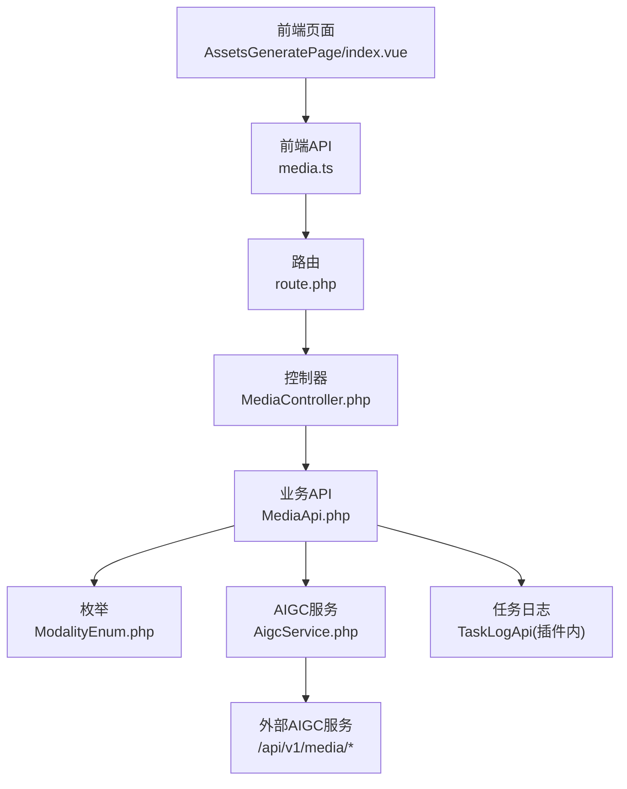
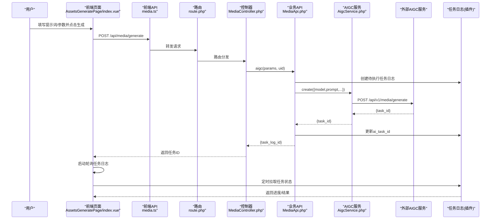
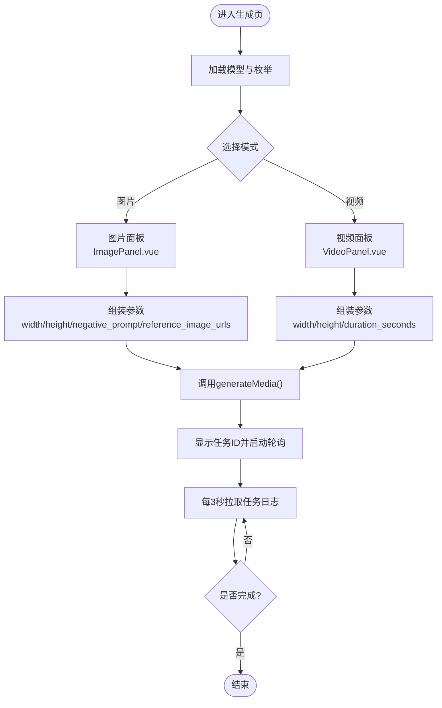
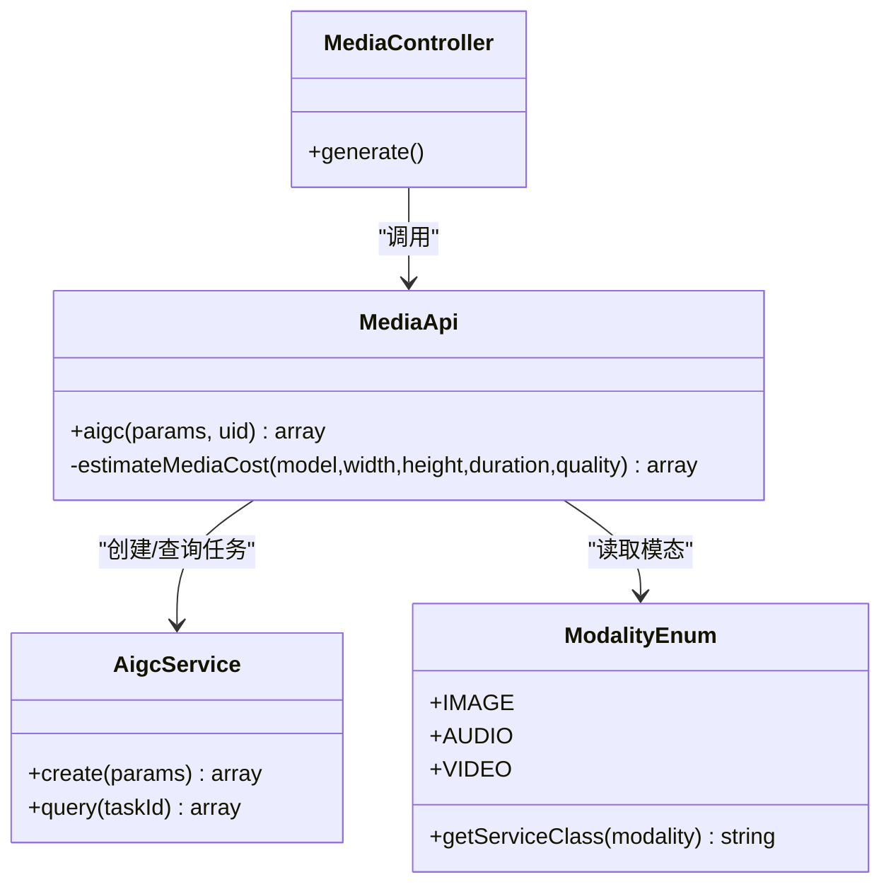
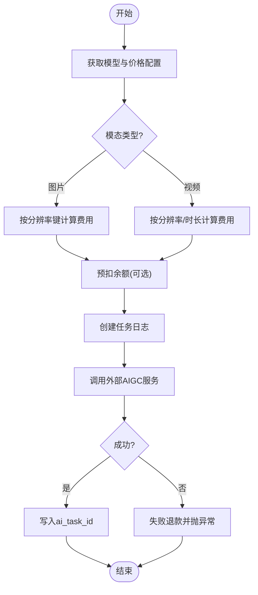
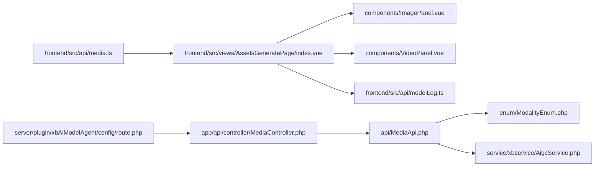

# 媒体生成API

<cite>
**本文引用的文件**   
- [frontend/src/api/media.ts](file://frontend/src/api/media.ts)
- [server/plugin/xbAiModelAgent/config/route.php](file://server/plugin/xbAiModelAgent/config/route.php)
- [server/plugin/xbAiModelAgent/app/api/controller/MediaController.php](file://server/plugin/xbAiModelAgent/app/api/controller/MediaController.php)
- [server/plugin/xbAiModelAgent/api/MediaApi.php](file://server/plugin/xbAiModelAgent/api/MediaApi.php)
- [server/plugin/xbAiModelAgent/service/xbservice/AigcService.php](file://server/plugin/xbAiModelAgent/service/xbservice/AigcService.php)
- [server/plugin/xbAiModelAgent/enum/ModalityEnum.php](file://server/plugin/xbAiModelAgent/enum/ModalityEnum.php)
- [frontend/src/views/AssetsGeneratePage/index.vue](file://frontend/src/views/AssetsGeneratePage/index.vue)
- [frontend/src/views/AssetsGeneratePage/components/ImagePanel.vue](file://frontend/src/views/AssetsGeneratePage/components/ImagePanel.vue)
- [frontend/src/views/AssetsGeneratePage/components/VideoPanel.vue](file://frontend/src/views/AssetsGeneratePage/components/VideoPanel.vue)
- [frontend/src/utils/media.ts](file://frontend/src/utils/media.ts)
- [frontend/src/api/modelLog.ts](file://frontend/src/api/modelLog.ts)
</cite>

## 目录
1. [简介](#简介)
2. [项目结构](#项目结构)
3. [核心组件](#核心组件)
4. [架构总览](#架构总览)
5. [详细组件分析](#详细组件分析)
6. [依赖关系分析](#依赖关系分析)
7. [性能考虑](#性能考虑)
8. [故障排查指南](#故障排查指南)
9. [结论](#结论)
10. [附录](#附录)

## 简介
本文件面向“媒体生成API”的前后端实现，覆盖图片、音频、视频的异步生成流程。前端提供参数配置与结果展示，后端负责鉴权、计费预扣、任务创建与状态查询，并通过AIGC服务调用第三方媒体生成能力。文档以渐进式方式呈现系统架构、关键数据流、处理逻辑与最佳实践，帮助开发者快速理解并集成。

## 项目结构
围绕媒体生成的前后端关键路径如下：
- 前端
  - API层：封装媒体生成与任务查询接口
  - 页面层：图片/视频生成面板、结果列表与轮询刷新
  - 工具层：时间格式化、音视频类型判断、首帧截图等
- 后端
  - 路由：统一POST /api/media/generate入口
  - 控制器：校验登录、透传参数
  - 业务API：参数校验、模型获取、费用预估与余额预扣、任务日志创建、外部任务投递
  - 服务层：对外部AIGC服务的HTTP封装（创建任务、查询状态）
  - 枚举：模态类型定义（文本/图片/音频/视频）

图表来源
- [server/plugin/xbAiModelAgent/config/route.php:1-13](file://server/plugin/xbAiModelAgent/config/route.php#L1-L13)
- [server/plugin/xbAiModelAgent/app/api/controller/MediaController.php:89-98](file://server/plugin/xbAiModelAgent/app/api/controller/MediaController.php#L89-L98)
- [server/plugin/xbAiModelAgent/api/MediaApi.php:46-152](file://server/plugin/xbAiModelAgent/api/MediaApi.php#L46-L152)
- [server/plugin/xbAiModelAgent/service/xbservice/AigcService.php:33-56](file://server/plugin/xbAiModelAgent/service/xbservice/AigcService.php#L33-L56)
- [server/plugin/xbAiModelAgent/enum/ModalityEnum.php:23-71](file://server/plugin/xbAiModelAgent/enum/ModalityEnum.php#L23-L71)
- [frontend/src/views/AssetsGeneratePage/index.vue:412-474](file://frontend/src/views/AssetsGeneratePage/index.vue#L412-L474)
- [frontend/src/api/media.ts:46-56](file://frontend/src/api/media.ts#L46-L56)

章节来源
- [server/plugin/xbAiModelAgent/config/route.php:1-13](file://server/plugin/xbAiModelAgent/config/route.php#L1-L13)
- [server/plugin/xbAiModelAgent/app/api/controller/MediaController.php:89-98](file://server/plugin/xbAiModelAgent/app/api/controller/MediaController.php#L89-L98)
- [server/plugin/xbAiModelAgent/api/MediaApi.php:46-152](file://server/plugin/xbAiModelAgent/api/MediaApi.php#L46-L152)
- [server/plugin/xbAiModelAgent/service/xbservice/AigcService.php:33-56](file://server/plugin/xbAiModelAgent/service/xbservice/AigcService.php#L33-L56)
- [server/plugin/xbAiModelAgent/enum/ModalityEnum.php:23-71](file://server/plugin/xbAiModelAgent/enum/ModalityEnum.php#L23-L71)
- [frontend/src/views/AssetsGeneratePage/index.vue:412-474](file://frontend/src/views/AssetsGeneratePage/index.vue#L412-L474)
- [frontend/src/api/media.ts:46-56](file://frontend/src/api/media.ts#L46-L56)

## 核心组件
- 前端媒体API
  - 统一封装POST /api/media/generate与GET /api/media/query
  - 定义图片/音频/视频三类参数结构体
- 路由与控制器
  - 路由注册POST /api/media/generate
  - 控制器校验用户登录，透传请求体至业务API
- 业务API（MediaApi）
  - 参数校验（model、prompt必填）
  - 模型解析与价格预估（按分辨率/时长/清晰度）
  - 余额预扣与失败退款
  - 创建任务日志并投递到AIGC服务
- AIGC服务（AigcService）
  - 创建任务：multipart表单调用外部/api/v1/media/generate
  - 查询状态：GET /api/v1/media/status?task_id=...
- 枚举（ModalityEnum）
  - 定义文本/图片/音频/视频模态值及对应服务类映射

章节来源
- [frontend/src/api/media.ts:1-57](file://frontend/src/api/media.ts#L1-L57)
- [server/plugin/xbAiModelAgent/config/route.php:1-13](file://server/plugin/xbAiModelAgent/config/route.php#L1-L13)
- [server/plugin/xbAiModelAgent/app/api/controller/MediaController.php:89-98](file://server/plugin/xbAiModelAgent/app/api/controller/MediaController.php#L89-L98)
- [server/plugin/xbAiModelAgent/api/MediaApi.php:46-201](file://server/plugin/xbAiModelAgent/api/MediaApi.php#L46-L201)
- [server/plugin/xbAiModelAgent/service/xbservice/AigcService.php:33-56](file://server/plugin/xbAiModelAgent/service/xbservice/AigcService.php#L33-L56)
- [server/plugin/xbAiModelAgent/enum/ModalityEnum.php:23-71](file://server/plugin/xbAiModelAgent/enum/ModalityEnum.php#L23-L71)

## 架构总览
媒体生成端到端时序如下：

图表来源
- [server/plugin/xbAiModelAgent/config/route.php:1-13](file://server/plugin/xbAiModelAgent/config/route.php#L1-L13)
- [server/plugin/xbAiModelAgent/app/api/controller/MediaController.php:89-98](file://server/plugin/xbAiModelAgent/app/api/controller/MediaController.php#L89-L98)
- [server/plugin/xbAiModelAgent/api/MediaApi.php:110-151](file://server/plugin/xbAiModelAgent/api/MediaApi.php#L110-L151)
- [server/plugin/xbAiModelAgent/service/xbservice/AigcService.php:33-56](file://server/plugin/xbAiModelAgent/service/xbservice/AigcService.php#L33-L56)
- [frontend/src/views/AssetsGeneratePage/index.vue:365-409](file://frontend/src/views/AssetsGeneratePage/index.vue#L365-L409)

## 详细组件分析

### 前端媒体API与页面交互
- 前端API
  - generateMedia：POST /api/media/generate，支持图片/音频/视频参数
  - queryMediaTask：GET /api/media/query?task_id=...
- 页面交互
  - AssetsGeneratePage/index.vue：主Tab切换（图片/视频），加载模型与枚举，触发生成，轮询任务日志
  - ImagePanel.vue：图片子Tab（文生图/图生图）、参考图选择、反向提示词、分辨率/比例、价格计算
  - VideoPanel.vue：视频子Tab（文生视频/参考生视频/图生视频）、分辨率/比例/时长、价格计算
  - utils/media.ts：时间格式化、音视频类型判断、视频首帧截图

图表来源
- [frontend/src/api/media.ts:46-56](file://frontend/src/api/media.ts#L46-L56)
- [frontend/src/views/AssetsGeneratePage/index.vue:412-474](file://frontend/src/views/AssetsGeneratePage/index.vue#L412-L474)
- [frontend/src/views/AssetsGeneratePage/components/ImagePanel.vue:1-331](file://frontend/src/views/AssetsGeneratePage/components/ImagePanel.vue#L1-L331)
- [frontend/src/views/AssetsGeneratePage/components/VideoPanel.vue:1-266](file://frontend/src/views/AssetsGeneratePage/components/VideoPanel.vue#L1-L266)
- [frontend/src/utils/media.ts:1-55](file://frontend/src/utils/media.ts#L1-L55)

章节来源
- [frontend/src/api/media.ts:1-57](file://frontend/src/api/media.ts#L1-L57)
- [frontend/src/views/AssetsGeneratePage/index.vue:1-599](file://frontend/src/views/AssetsGeneratePage/index.vue#L1-L599)
- [frontend/src/views/AssetsGeneratePage/components/ImagePanel.vue:1-331](file://frontend/src/views/AssetsGeneratePage/components/ImagePanel.vue#L1-L331)
- [frontend/src/views/AssetsGeneratePage/components/VideoPanel.vue:1-266](file://frontend/src/views/AssetsGeneratePage/components/VideoPanel.vue#L1-L266)
- [frontend/src/utils/media.ts:1-55](file://frontend/src/utils/media.ts#L1-L55)

### 后端媒体生成流程
- 路由与控制器
  - route.php：注册POST /api/media/generate
  - MediaController.generate：校验登录，透传post数据给MediaApi
- 业务API（MediaApi.aigc）
  - 参数校验：model/prompt必填
  - 模型解析：通过ModelApi获取模型信息
  - 费用预估：根据模态与尺寸/时长/质量键计算cost/sale金额
  - 余额预扣：若saleAmount>0则预扣；失败时回滚
  - 任务日志：创建待执行记录，包含modality/宽高/提示词/参数/费用
  - 外部任务：调用AigcService.create，成功后写入ai_task_id
- AIGC服务（AigcService）
  - create：multipart表单POST /api/v1/media/generate
  - query：GET /api/v1/media/status?task_id=...
- 枚举（ModalityEnum）
  - 定义模态值：10文本、20图片、30音频、40视频，并提供服务类映射

图表来源
- [server/plugin/xbAiModelAgent/app/api/controller/MediaController.php:89-98](file://server/plugin/xbAiModelAgent/app/api/controller/MediaController.php#L89-L98)
- [server/plugin/xbAiModelAgent/api/MediaApi.php:46-201](file://server/plugin/xbAiModelAgent/api/MediaApi.php#L46-L201)
- [server/plugin/xbAiModelAgent/service/xbservice/AigcService.php:33-56](file://server/plugin/xbAiModelAgent/service/xbservice/AigcService.php#L33-L56)
- [server/plugin/xbAiModelAgent/enum/ModalityEnum.php:23-71](file://server/plugin/xbAiModelAgent/enum/ModalityEnum.php#L23-L71)

章节来源
- [server/plugin/xbAiModelAgent/config/route.php:1-13](file://server/plugin/xbAiModelAgent/config/route.php#L1-L13)
- [server/plugin/xbAiModelAgent/app/api/controller/MediaController.php:89-98](file://server/plugin/xbAiModelAgent/app/api/controller/MediaController.php#L89-L98)
- [server/plugin/xbAiModelAgent/api/MediaApi.php:46-201](file://server/plugin/xbAiModelAgent/api/MediaApi.php#L46-L201)
- [server/plugin/xbAiModelAgent/service/xbservice/AigcService.php:33-56](file://server/plugin/xbAiModelAgent/service/xbservice/AigcService.php#L33-L56)
- [server/plugin/xbAiModelAgent/enum/ModalityEnum.php:23-71](file://server/plugin/xbAiModelAgent/enum/ModalityEnum.php#L23-L71)

### 费用预估与余额处理
- 图片：按分辨率键（如“1920x1080”）匹配resolution_prices或per_image
- 视频：优先resolution_prices，其次duration_price或first_duration_price+subsequent_duration_price
- 余额：预扣成功后在任务失败时自动退款

图表来源
- [server/plugin/xbAiModelAgent/api/MediaApi.php:163-201](file://server/plugin/xbAiModelAgent/api/MediaApi.php#L163-L201)
- [server/plugin/xbAiModelAgent/api/MediaApi.php:71-151](file://server/plugin/xbAiModelAgent/api/MediaApi.php#L71-L151)

章节来源
- [server/plugin/xbAiModelAgent/api/MediaApi.php:163-201](file://server/plugin/xbAiModelAgent/api/MediaApi.php#L163-L201)
- [server/plugin/xbAiModelAgent/api/MediaApi.php:71-151](file://server/plugin/xbAiModelAgent/api/MediaApi.php#L71-L151)

### 任务日志与结果展示
- 前端分页与筛选
  - 支持按模态过滤（图片/音频/视频）
  - 将后端status映射为前端状态（pending/running/success/failed）
- 图片缩略图优化
  - 对图片类型的asset_url进行压缩，生成base64缩略图用于列表展示
- 轮询策略
  - 存在pending/running任务时每3秒刷新一次

章节来源
- [frontend/src/api/modelLog.ts:1-171](file://frontend/src/api/modelLog.ts#L1-L171)
- [frontend/src/views/AssetsGeneratePage/index.vue:255-409](file://frontend/src/views/AssetsGeneratePage/index.vue#L255-L409)

## 依赖关系分析
- 前端依赖
  - media.ts依赖request封装
  - 页面依赖model/modelLog/modelEnum等API
- 后端依赖
  - MediaController依赖路由与XbController基类
  - MediaApi依赖ModelApi、TaskLogApi、UserApi、PriceService、AigcService
  - AigcService继承BaseService，使用HTTP方法postMultipart/get
  - ModalityEnum提供模态与服务类映射

图表来源
- [frontend/src/api/media.ts:1-57](file://frontend/src/api/media.ts#L1-L57)
- [frontend/src/views/AssetsGeneratePage/index.vue:1-599](file://frontend/src/views/AssetsGeneratePage/index.vue#L1-L599)
- [frontend/src/views/AssetsGeneratePage/components/ImagePanel.vue:1-331](file://frontend/src/views/AssetsGeneratePage/components/ImagePanel.vue#L1-L331)
- [frontend/src/views/AssetsGeneratePage/components/VideoPanel.vue:1-266](file://frontend/src/views/AssetsGeneratePage/components/VideoPanel.vue#L1-L266)
- [frontend/src/api/modelLog.ts:1-171](file://frontend/src/api/modelLog.ts#L1-L171)
- [server/plugin/xbAiModelAgent/config/route.php:1-13](file://server/plugin/xbAiModelAgent/config/route.php#L1-L13)
- [server/plugin/xbAiModelAgent/app/api/controller/MediaController.php:89-98](file://server/plugin/xbAiModelAgent/app/api/controller/MediaController.php#L89-L98)
- [server/plugin/xbAiModelAgent/api/MediaApi.php:46-201](file://server/plugin/xbAiModelAgent/api/MediaApi.php#L46-L201)
- [server/plugin/xbAiModelAgent/enum/ModalityEnum.php:23-71](file://server/plugin/xbAiModelAgent/enum/ModalityEnum.php#L23-L71)
- [server/plugin/xbAiModelAgent/service/xbservice/AigcService.php:33-56](file://server/plugin/xbAiModelAgent/service/xbservice/AigcService.php#L33-L56)

## 性能考虑
- 前端
  - 列表图片压缩：仅对图片类型进行压缩，避免大体积传输；失败回退原URL
  - 轮询节流：仅在存在pending/running任务时轮询，减少无效请求
  - 首帧截图：按需生成，避免不必要的Canvas操作
- 后端
  - 费用预估前置：在创建任务前完成余额预扣，失败可快速回滚
  - 外部调用超时与重试：建议结合队列与重试机制提升稳定性（当前通过AigcService直接HTTP调用）

[本节为通用指导，不直接分析具体文件]

## 故障排查指南
- 常见错误
  - 未登录：控制器会抛出未授权异常
  - 参数缺失：model或prompt为空将抛出参数错误
  - 模型不存在：无法找到模型配置
  - 外部任务创建失败：抛出异常并尝试退款
- 定位步骤
  - 检查路由是否正确注册
  - 确认控制器已正确提取uid与post数据
  - 查看任务日志的error_msg字段
  - 核对AigcService的外部接口可达性与响应格式

章节来源
- [server/plugin/xbAiModelAgent/app/api/controller/MediaController.php:89-98](file://server/plugin/xbAiModelAgent/app/api/controller/MediaController.php#L89-L98)
- [server/plugin/xbAiModelAgent/api/MediaApi.php:46-151](file://server/plugin/xbAiModelAgent/api/MediaApi.php#L46-L151)

## 结论
该媒体生成API采用清晰的分层设计：前端负责参数收集与结果展示，后端完成鉴权、计费、任务编排与外部服务调用。通过枚举与价格策略解耦不同模态的计费规则，配合任务日志与轮询机制，形成稳定的异步生成体验。建议在后续迭代中引入队列与重试机制，进一步提升可靠性与可扩展性。

[本节为总结，不直接分析具体文件]

## 附录
- 主要接口
  - POST /api/media/generate：创建媒体生成任务
  - GET /api/media/query：查询媒体任务状态（前端已封装）
- 前端类型
  - ImageParams/AudioParams/VideoParams：分别定义图片/音频/视频生成参数
- 工具函数
  - formatTime/isAudioAsset/isVideoAsset/getVideoFirstFrame：辅助展示与预览

章节来源
- [frontend/src/api/media.ts:1-57](file://frontend/src/api/media.ts#L1-L57)
- [frontend/src/utils/media.ts:1-55](file://frontend/src/utils/media.ts#L1-L55)