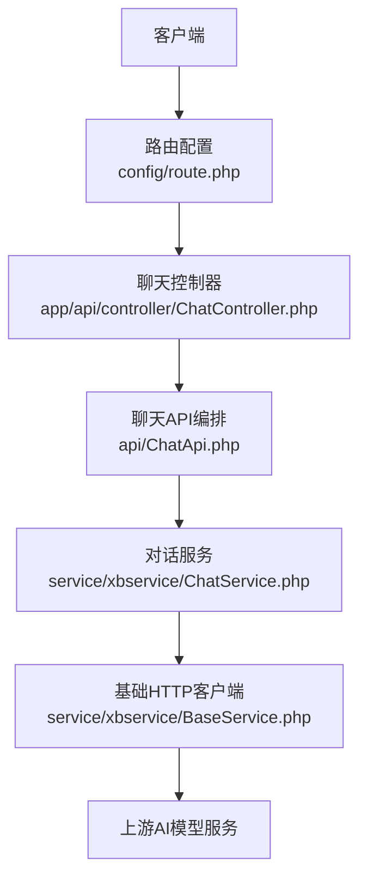
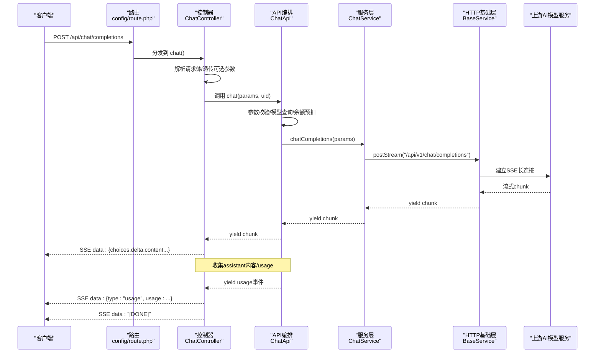
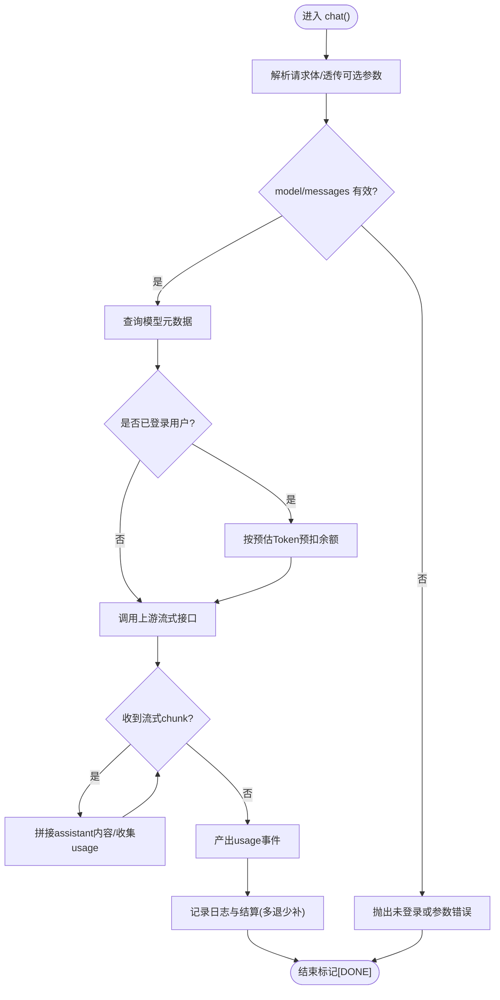
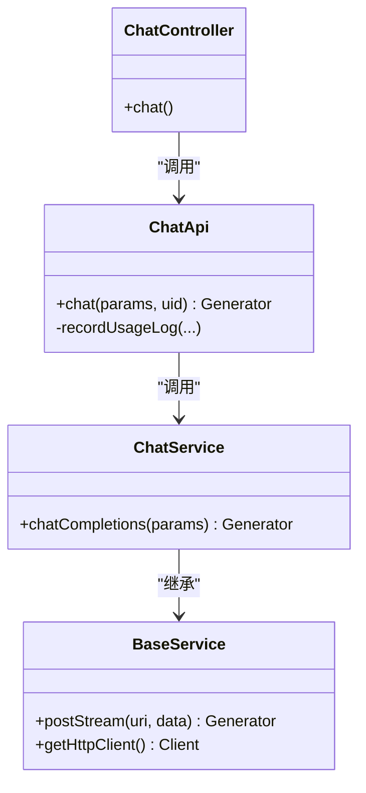

# 单轮问答接口

<cite>
**本文引用的文件**   
- [ChatController.php](file://server/plugin/xbAiModelAgent/app/api/controller/ChatController.php)
- [ChatApi.php](file://server/plugin/xbAiModelAgent/api/ChatApi.php)
- [ChatService.php](file://server/plugin/xbAiModelAgent/service/xbservice/ChatService.php)
- [BaseService.php](file://server/plugin/xbAiModelAgent/service/xbservice/BaseService.php)
- [route.php](file://server/plugin/xbAiModelAgent/config/route.php)
</cite>

## 目录
1. [简介](#简介)
2. [项目结构](#项目结构)
3. [核心组件](#核心组件)
4. [架构总览](#架构总览)
5. [详细组件分析](#详细组件分析)
6. [依赖关系分析](#依赖关系分析)
7. [性能与稳定性](#性能与稳定性)
8. [故障排查指南](#故障排查指南)
9. [结论](#结论)
10. [附录：参数与提示词工程建议](#附录参数与提示词工程建议)

## 简介
本接口面向“单轮问答”场景，提供简洁的文本对话能力。客户端发送一次请求（包含问题），服务端以流式方式返回答案片段，并在完成后输出用量统计事件。该接口支持丰富的生成控制参数，如 max_tokens、temperature、top_p、stop、presence_penalty、frequency_penalty、seed、reasoning_effort 等，便于在不同业务场景中调优回答长度、创造性与稳定性。

## 项目结构
后端采用插件化架构，单轮问答相关代码位于 xbAiModelAgent 插件中，主要涉及路由、控制器、API编排与服务层调用。

图示来源
- [route.php:8-12](file://server/plugin/xbAiModelAgent/config/route.php#L8-L12)
- [ChatController.php:46-114](file://server/plugin/xbAiModelAgent/app/api/controller/ChatController.php#L46-L114)
- [ChatApi.php:55-175](file://server/plugin/xbAiModelAgent/api/ChatApi.php#L55-L175)
- [ChatService.php:66-70](file://server/plugin/xbAiModelAgent/service/xbservice/ChatService.php#L66-L70)
- [BaseService.php:229-282](file://server/plugin/xbAiModelAgent/service/xbservice/BaseService.php#L229-L282)

章节来源
- [route.php:8-12](file://server/plugin/xbAiModelAgent/config/route.php#L8-L12)
- [ChatController.php:46-114](file://server/plugin/xbAiModelAgent/app/api/controller/ChatController.php#L46-L114)
- [ChatApi.php:55-175](file://server/plugin/xbAiModelAgent/api/ChatApi.php#L55-L175)
- [ChatService.php:66-70](file://server/plugin/xbAiModelAgent/service/xbservice/ChatService.php#L66-L70)
- [BaseService.php:229-282](file://server/plugin/xbAiModelAgent/service/xbservice/BaseService.php#L229-L282)

## 核心组件
- 路由层：将 POST /api/chat/completions 映射到聊天控制器方法。
- 控制器层：解析请求体、透传可选参数、设置SSE响应头并逐块转发流式数据。
- API编排层：校验必填参数、获取模型信息、预扣费估算、组装下游请求、聚合assistant内容与usage、记录使用日志与结算。
- 服务层：封装对上游模型的chatCompletions流式调用。
- 基础HTTP层：统一鉴权、超时、异常处理与SSE流式读取。

章节来源
- [route.php:8-12](file://server/plugin/xbAiModelAgent/config/route.php#L8-L12)
- [ChatController.php:46-114](file://server/plugin/xbAiModelAgent/app/api/controller/ChatController.php#L46-L114)
- [ChatApi.php:55-175](file://server/plugin/xbAiModelAgent/api/ChatApi.php#L55-L175)
- [ChatService.php:66-70](file://server/plugin/xbAiModelAgent/service/xbservice/ChatService.php#L66-L70)
- [BaseService.php:229-282](file://server/plugin/xbAiModelAgent/service/xbservice/BaseService.php#L229-L282)

## 架构总览
下图展示了从客户端到上游模型的完整调用链，以及SSE流式传输与用量统计事件的处理流程。

图示来源
- [route.php:8-12](file://server/plugin/xbAiModelAgent/config/route.php#L8-L12)
- [ChatController.php:87-114](file://server/plugin/xbAiModelAgent/app/api/controller/ChatController.php#L87-L114)
- [ChatApi.php:144-175](file://server/plugin/xbAiModelAgent/api/ChatApi.php#L144-L175)
- [ChatService.php:66-70](file://server/plugin/xbAiModelAgent/service/xbservice/ChatService.php#L66-L70)
- [BaseService.php:229-282](file://server/plugin/xbAiModelAgent/service/xbservice/BaseService.php#L229-L282)

## 详细组件分析

### 接口定义与协议
- 接口路径：POST /api/chat/completions
- 认证要求：需登录用户（uid）
- 响应协议：Server-Sent Events（SSE）
  - 正常流：多次 data: JSON对象（OpenAI兼容格式）
  - 用量事件：data: {"type":"usage","usage":{...}}
  - 结束标记：data: [DONE]
- 错误流：data: {"error":{"message":"..."}}，随后 data: [DONE]

章节来源
- [route.php:8-12](file://server/plugin/xbAiModelAgent/config/route.php#L8-L12)
- [ChatController.php:87-114](file://server/plugin/xbAiModelAgent/app/api/controller/ChatController.php#L87-L114)

### 请求参数
必填字段
- model：string，模型ID
- messages：array，消息列表，元素为 {role, content}

可选字段（透传到上游）
- temperature：float，采样温度，范围 0~2
- top_p：float，核采样参数，范围 0~1
- n：int，生成数量，>=1
- max_tokens：int，最大生成Token数
- max_completion_tokens：int，最大补全Token数
- stop：string|array，停止序列
- presence_penalty：float，存在惩罚，范围 -2~2
- frequency_penalty：float，频率惩罚，范围 -2~2
- user：string，用户标识
- tools：array，工具列表
- tool_choice：string|object，工具选择策略
- response_format：object，响应格式
- seed：int，随机种子
- reasoning_effort：string，推理强度 low/medium/high

说明
- 控制器会透传上述可选参数至API编排层，再由API层构建下游请求并强制开启流式选项。

章节来源
- [ChatController.php:58-85](file://server/plugin/xbAiModelAgent/app/api/controller/ChatController.php#L58-L85)
- [ChatApi.php:93-114](file://server/plugin/xbAiModelAgent/api/ChatApi.php#L93-L114)

### 响应格式
- 流式片段：OpenAI兼容的增量片段，包含 choices[0].delta.content 等字段
- 用量事件：{"type":"usage","usage":{"input_tokens":...,"output_tokens":...,"total_tokens":...}}
- 结束标记："[DONE]"
- 错误事件：{"error":{"message":"..."}}

章节来源
- [ChatController.php:95-114](file://server/plugin/xbAiModelAgent/app/api/controller/ChatController.php#L95-L114)
- [ChatApi.php:144-175](file://server/plugin/xbAiModelAgent/api/ChatApi.php#L144-L175)

### 关键流程与逻辑
- 参数校验：model 与 messages 必填；messages 非空且为数组
- 模型查询：根据 model 获取模型元数据
- 余额校验与预扣：已登录用户进行余额前置校验，并按预估Token量预扣费用
- 流式调用：通过 ChatService.chatCompletions 发起上游流式请求
- 结果聚合：在流过程中拼接 assistant 回复内容，捕获 usage 数据
- 用量事件：流结束后产出 usage 事件
- 日志与结算：记录使用日志，执行多退少补结算

图示来源
- [ChatController.php:46-114](file://server/plugin/xbAiModelAgent/app/api/controller/ChatController.php#L46-L114)
- [ChatApi.php:55-175](file://server/plugin/xbAiModelAgent/api/ChatApi.php#L55-L175)

章节来源
- [ChatController.php:46-114](file://server/plugin/xbAiModelAgent/app/api/controller/ChatController.php#L46-L114)
- [ChatApi.php:55-175](file://server/plugin/xbAiModelAgent/api/ChatApi.php#L55-L175)

## 依赖关系分析
- 控制器依赖路由配置与API编排类
- API编排依赖模型查询、价格估算、用户资产校验、使用日志写入
- 服务层依赖基础HTTP客户端进行流式请求
- 基础HTTP客户端负责鉴权、超时、异常与SSE解析

图示来源
- [ChatController.php:46-114](file://server/plugin/xbAiModelAgent/app/api/controller/ChatController.php#L46-L114)
- [ChatApi.php:55-175](file://server/plugin/xbAiModelAgent/api/ChatApi.php#L55-L175)
- [ChatService.php:66-70](file://server/plugin/xbAiModelAgent/service/xbservice/ChatService.php#L66-L70)
- [BaseService.php:229-282](file://server/plugin/xbAiModelAgent/service/xbservice/BaseService.php#L229-L282)

章节来源
- [ChatController.php:46-114](file://server/plugin/xbAiModelAgent/app/api/controller/ChatController.php#L46-L114)
- [ChatApi.php:55-175](file://server/plugin/xbAiModelAgent/api/ChatApi.php#L55-L175)
- [ChatService.php:66-70](file://server/plugin/xbAiModelAgent/service/xbservice/ChatService.php#L66-L70)
- [BaseService.php:229-282](file://server/plugin/xbAiModelAgent/service/xbservice/BaseService.php#L229-L282)

## 性能与稳定性
- 流式传输：基于SSE，降低首字节延迟，提升用户体验
- 超时设置：底层HTTP客户端默认超时较长，适合长文本生成
- 资源占用：流式处理避免一次性加载大响应体，内存友好
- 并发与缓冲：SSE响应头禁用代理缓冲，确保实时推送
- 错误恢复：网络或服务端异常均会被捕获并转换为错误事件，保证前端可感知

章节来源
- [ChatController.php:87-114](file://server/plugin/xbAiModelAgent/app/api/controller/ChatController.php#L87-L114)
- [BaseService.php:91-104](file://server/plugin/xbAiModelAgent/service/xbservice/BaseService.php#L91-L104)
- [BaseService.php:229-282](file://server/plugin/xbAiModelAgent/service/xbservice/BaseService.php#L229-L282)

## 故障排查指南
常见问题与定位要点
- 未登录或鉴权失败：检查请求是否携带有效的用户会话/令牌
- 参数缺失：确认 model 与 messages 必填项是否正确传递
- 模型不存在：核对 model 值是否在系统内注册
- 余额不足：已登录用户需确保账户余额充足
- 上游异常：查看基础HTTP层的日志输出，定位上游返回的错误码与消息
- 流中断：检查网络与代理是否允许SSE长连接，确认服务器未提前关闭连接

章节来源
- [ChatController.php:54-56](file://server/plugin/xbAiModelAgent/app/api/controller/ChatController.php#L54-L56)
- [ChatApi.php:61-81](file://server/plugin/xbAiModelAgent/api/ChatApi.php#L61-L81)
- [BaseService.php:259-282](file://server/plugin/xbAiModelAgent/service/xbservice/BaseService.php#L259-L282)

## 结论
本单轮问答接口以SSE流式形式提供低延迟、高吞吐的文本生成能力，内置参数透传、用量统计与结算机制，满足多种业务场景下的问答需求。通过合理配置生成参数与提示词，可在不同场景下平衡回答的准确性、创造性与成本。

## 附录：参数与提示词工程建议

### 参数调优建议
- max_tokens / max_completion_tokens
  - 作用：限制回答长度，避免过长输出导致成本上升或体验下降
  - 建议：根据任务复杂度设定上限，短问答建议较小值，复杂推理可适当提高
- temperature
  - 作用：控制创造性与多样性
  - 建议：创意写作/头脑风暴取较高值；事实性问答取较低值以提升稳定性
- top_p
  - 作用：核采样，过滤低概率token
  - 建议：与 temperature 配合微调，通常 0.8~0.95 较均衡
- stop
  - 作用：自定义停止序列，用于结构化输出或截断
  - 建议：在需要固定格式的问答中设置明确的终止符
- presence_penalty / frequency_penalty
  - 作用：抑制重复与鼓励新话题
  - 建议：减少重复时适当提高；避免过度惩罚导致语义不连贯
- seed
  - 作用：固定随机种子，提升结果可复现性
  - 建议：调试与回归测试时使用固定 seed
- reasoning_effort
  - 作用：调整推理强度
  - 建议：复杂推理任务可提高强度；简单问答可降低以节省成本

### 提示词工程最佳实践
- 明确角色与目标：在 system 或首条消息中定义助手角色与任务边界
- 结构化输入：使用清晰的指令与示例，帮助模型理解期望输出格式
- 约束输出：利用 stop 或 response_format 限定输出结构，便于后续解析
- 分步推理：对于复杂问题，引导模型逐步思考，提高准确性
- 安全与合规：在提示词中加入必要的安全与合规约束，避免不当输出
- 迭代优化：结合 usage 数据与业务反馈持续调整提示词与参数