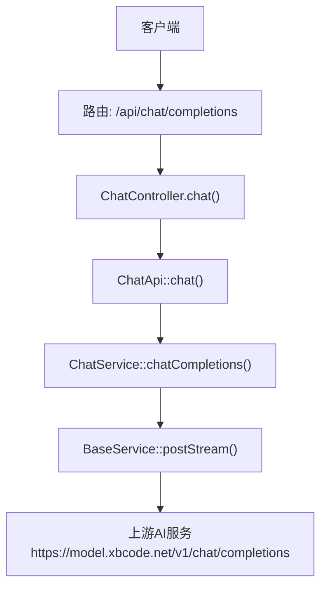
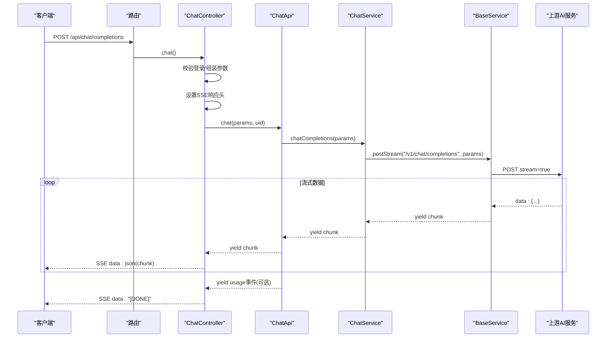
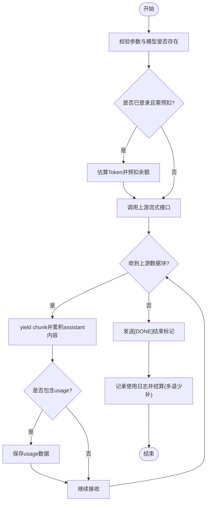
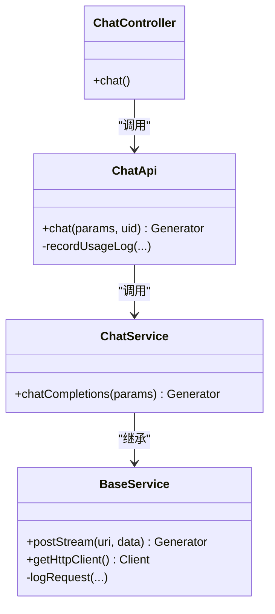

# 对话接口

<cite>
**本文引用的文件**   
- [ChatController.php](file://server/plugin/xbAiModelAgent/app/api/controller/ChatController.php)
- [route.php](file://server/plugin/xbAiModelAgent/config/route.php)
- [ChatApi.php](file://server/plugin/xbAiModelAgent/api/ChatApi.php)
- [ChatService.php](file://server/plugin/xbAiModelAgent/service/xbservice/ChatService.php)
- [BaseService.php](file://server/plugin/xbAiModelAgent/service/xbservice/BaseService.php)
</cite>

## 目录
1. [简介](#简介)
2. [项目结构](#项目结构)
3. [核心组件](#核心组件)
4. [架构总览](#架构总览)
5. [详细组件分析](#详细组件分析)
6. [依赖关系分析](#依赖关系分析)
7. [性能与流式处理](#性能与流式处理)
8. [错误处理与排障](#错误处理与排障)
9. [结论](#结论)
10. [附录：调用示例与最佳实践](#附录调用示例与最佳实践)

## 简介
本文件为“对话式AI模型”的API接口文档，聚焦于文本聊天接口的完整调用方式。该接口采用SSE（Server-Sent Events）流式响应，支持多轮对话上下文、OpenAI兼容的消息格式与参数，并在服务端完成预扣费、用量统计与结算。

## 项目结构
后端基于Webman框架，插件化组织代码。对话接口位于插件“xbAiModelAgent”中，路由定义在插件配置文件中，控制器负责解析请求并返回SSE流；业务编排在API层，服务层负责上游AI服务的HTTP调用与流式解析。

图表来源
- [route.php:8-12](file://server/plugin/xbAiModelAgent/config/route.php#L8-L12)
- [ChatController.php:46-114](file://server/plugin/xbAiModelAgent/app/api/controller/ChatController.php#L46-L114)
- [ChatApi.php:55-175](file://server/plugin/xbAiModelAgent/api/ChatApi.php#L55-L175)
- [ChatService.php:66-70](file://server/plugin/xbAiModelAgent/service/xbservice/ChatService.php#L66-L70)
- [BaseService.php:229-282](file://server/plugin/xbAiModelAgent/service/xbservice/BaseService.php#L229-L282)

章节来源
- [route.php:8-12](file://server/plugin/xbAiModelAgent/config/route.php#L8-L12)
- [ChatController.php:46-114](file://server/plugin/xbAiModelAgent/app/api/controller/ChatController.php#L46-L114)

## 核心组件
- 路由层：将POST /api/chat/completions映射到控制器方法。
- 控制器层：校验登录、组装参数、发送SSE响应头、逐块转发流数据。
- API层：参数校验、模型查询、余额预扣、流式聚合、使用日志记录与结算。
- 服务层：封装上游AI服务的HTTP调用，提供流式读取与SSE事件解析。
- 基础服务：统一的Guzzle HTTP客户端、异常转换、请求日志记录。

章节来源
- [ChatController.php:46-114](file://server/plugin/xbAiModelAgent/app/api/controller/ChatController.php#L46-L114)
- [ChatApi.php:55-175](file://server/plugin/xbAiModelAgent/api/ChatApi.php#L55-L175)
- [ChatService.php:66-70](file://server/plugin/xbAiModelAgent/service/xbservice/ChatService.php#L66-L70)
- [BaseService.php:229-282](file://server/plugin/xbAiModelAgent/service/xbservice/BaseService.php#L229-L282)

## 架构总览
下图展示了从客户端发起请求到上游AI服务返回流式数据的端到端流程，以及服务端对SSE事件的转发与结束标记的处理。

图表来源
- [ChatController.php:87-114](file://server/plugin/xbAiModelAgent/app/api/controller/ChatController.php#L87-L114)
- [ChatApi.php:144-175](file://server/plugin/xbAiModelAgent/api/ChatApi.php#L144-L175)
- [ChatService.php:66-70](file://server/plugin/xbAiModelAgent/service/xbservice/ChatService.php#L66-L70)
- [BaseService.php:229-282](file://server/plugin/xbAiModelAgent/service/xbservice/BaseService.php#L229-L282)

## 详细组件分析

### 接口定义与路由
- 路径与方法：POST /api/chat/completions
- 认证要求：需要已登录用户（uid），未登录将抛出未授权异常。
- 响应类型：text/event-stream（SSE）
- 结束标记：[DONE]

章节来源
- [route.php:8-12](file://server/plugin/xbAiModelAgent/config/route.php#L8-L12)
- [ChatController.php:46-114](file://server/plugin/xbAiModelAgent/app/api/controller/ChatController.php#L46-L114)

### 请求参数规范
- 必填字段
  - model: string，模型ID（第三方模型标识）
  - messages: array，消息列表，元素为对象，包含role与content等字段
- 可选字段（透传到上游）
  - temperature: float，采样温度 0~2
  - top_p: float，核采样参数 0~1
  - n: int，生成数量 >=1
  - max_tokens: int，最大生成Token数
  - max_completion_tokens: int，最大补全Token数
  - stop: string|array，停止序列
  - presence_penalty: float，存在惩罚 -2~2
  - frequency_penalty: float，频率惩罚 -2~2
  - user: string，用户标识
  - tools: array，工具列表
  - tool_choice: string|object，工具选择策略
  - response_format: object，响应格式
  - seed: int，随机种子
  - reasoning_effort: string，推理强度 low/medium/high

说明
- 服务端会强制开启上游流式模式，并可选择是否包含usage数据。
- 若messages为空或格式不正确，将返回错误。

章节来源
- [ChatController.php:58-85](file://server/plugin/xbAiModelAgent/app/api/controller/ChatController.php#L58-L85)
- [ChatApi.php:55-114](file://server/plugin/xbAiModelAgent/api/ChatApi.php#L55-L114)
- [ChatService.php:40-70](file://server/plugin/xbAiModelAgent/service/xbservice/ChatService.php#L40-L70)

### 消息格式规范（多轮对话上下文）
- 每条消息为对象，至少包含：
  - role: string，取值包括 system、user、assistant 等
  - content: string，消息内容
- 可选字段（根据上游能力）
  - name: string，消息作者名
  - tool_calls: array，工具调用信息
  - tool_call_id: string，工具调用ID
  - reasoning_content: string，推理过程内容
- 多轮对话通过messages数组按时间顺序维护上下文，最新一轮追加至末尾。

章节来源
- [ChatService.php:40-70](file://server/plugin/xbAiModelAgent/service/xbservice/ChatService.php#L40-L70)

### 响应格式与SSE流式输出
- 响应头
  - Content-Type: text/event-stream
  - Cache-Control: no-cache
  - X-Accel-Buffering: no
- 数据块
  - 每个SSE事件data字段为一个JSON字符串，表示一个chunk
  - 典型字段
    - choices[0].delta.content: string，增量内容片段
    - usage: object，token用量（可能出现在最后一个chunk或单独事件）
- 结束标记
  - 当流结束时，服务端发送data: "[DONE]"

章节来源
- [ChatController.php:87-114](file://server/plugin/xbAiModelAgent/app/api/controller/ChatController.php#L87-L114)
- [ChatApi.php:144-175](file://server/plugin/xbAiModelAgent/api/ChatApi.php#L144-L175)
- [BaseService.php:229-282](file://server/plugin/xbAiModelAgent/service/xbservice/BaseService.php#L229-L282)

### 流式数据处理流程（服务端）

图表来源
- [ChatApi.php:55-175](file://server/plugin/xbAiModelAgent/api/ChatApi.php#L55-L175)
- [BaseService.php:229-282](file://server/plugin/xbAiModelAgent/service/xbservice/BaseService.php#L229-L282)

### 类与依赖关系

图表来源
- [ChatController.php:46-114](file://server/plugin/xbAiModelAgent/app/api/controller/ChatController.php#L46-L114)
- [ChatApi.php:55-175](file://server/plugin/xbAiModelAgent/api/ChatApi.php#L55-L175)
- [ChatService.php:66-70](file://server/plugin/xbAiModelAgent/service/xbservice/ChatService.php#L66-L70)
- [BaseService.php:229-282](file://server/plugin/xbAiModelAgent/service/xbservice/BaseService.php#L229-L282)

## 依赖关系分析
- 控制器依赖API层进行业务编排与计费逻辑。
- API层依赖服务层进行上游HTTP调用与流式解析。
- 服务层依赖基础服务提供的HTTP客户端、异常处理与日志记录。
- 外部依赖
  - GuzzleHttp用于HTTP请求
  - Workerman的SSE协议支持用于流式响应

章节来源
- [ChatController.php:46-114](file://server/plugin/xbAiModelAgent/app/api/controller/ChatController.php#L46-L114)
- [ChatApi.php:55-175](file://server/plugin/xbAiModelAgent/api/ChatApi.php#L55-L175)
- [ChatService.php:66-70](file://server/plugin/xbAiModelAgent/service/xbservice/ChatService.php#L66-L70)
- [BaseService.php:91-104](file://server/plugin/xbAiModelAgent/service/xbservice/BaseService.php#L91-L104)

## 性能与流式处理
- 流式传输
  - 服务端以Generator逐块产出数据，避免大响应体内存占用。
  - 上游请求启用stream=true，边读边写，降低延迟。
- 缓冲与缓存
  - 关闭代理缓冲（X-Accel-Buffering: no）与浏览器缓存（Cache-Control: no-cache）。
- 超时与重试
  - 上游HTTP客户端默认超时较长，适合长时流式任务。
- 资源建议
  - 合理设置max_tokens/max_completion_tokens控制输出长度。
  - 使用top_p与temperature平衡质量与速度。

章节来源
- [ChatController.php:87-114](file://server/plugin/xbAiModelAgent/app/api/controller/ChatController.php#L87-L114)
- [BaseService.php:229-282](file://server/plugin/xbAiModelAgent/service/xbservice/BaseService.php#L229-L282)

## 错误处理与排障
- 常见错误
  - 未登录：抛出未授权异常。
  - 参数缺失：model或messages为空时报错。
  - 模型不存在：模型ID无效时报错。
  - 余额不足：预扣失败时报错。
  - 上游异常：网络或服务端错误转换为运行时异常。
- 错误传播
  - 控制器捕获异常后，仍会以SSE形式发送error事件并结束流。
- 排查建议
  - 查看服务端日志目录中的每日日志文件，定位上游请求详情与错误码。
  - 检查上游返回的SSE格式是否正确，确认data行与[DONE]标记。

章节来源
- [ChatController.php:95-114](file://server/plugin/xbAiModelAgent/app/api/controller/ChatController.php#L95-L114)
- [ChatApi.php:55-81](file://server/plugin/xbAiModelAgent/api/ChatApi.php#L55-L81)
- [BaseService.php:259-282](file://server/plugin/xbAiModelAgent/service/xbservice/BaseService.php#L259-L282)

## 结论
该接口以OpenAI兼容的消息与参数规范为基础，结合SSE流式响应实现低延迟的对话体验。服务端在流式过程中完成上下文维护、用量统计与费用结算，并提供完善的错误处理与日志追踪，便于集成与排障。

## 附录：调用示例与最佳实践

- 基本请求示例（JSON Body）
  - 路径：POST /api/chat/completions
  - 头部：Content-Type: application/json；Authorization: Bearer <token>
  - 请求体示例（字段说明见上文）：
    - model: "your_model_id"
    - messages: [
        {"role": "system", "content": "你是一个助手"},
        {"role": "user", "content": "你好"}
      ]
    - temperature: 0.7
    - max_tokens: 512

- 客户端SSE处理要点
  - 设置请求头Accept: text/event-stream（部分客户端可自动识别）
  - 监听data事件，解析JSON获取choices[0].delta.content增量
  - 遇到[DONE]事件表示流结束
  - 如收到包含usage的事件，可用于展示用量统计

- 多轮对话上下文管理
  - 将历史消息按顺序放入messages数组，新消息追加至末尾
  - 如需重置上下文，仅传入当前轮次消息即可

- 错误处理建议
  - 捕获SSE error事件并提示用户
  - 在网络异常时实现指数退避重试
  - 记录关键错误信息与服务端日志ID以便排查

章节来源
- [ChatController.php:46-114](file://server/plugin/xbAiModelAgent/app/api/controller/ChatController.php#L46-L114)
- [ChatApi.php:144-175](file://server/plugin/xbAiModelAgent/api/ChatApi.php#L144-L175)
- [BaseService.php:229-282](file://server/plugin/xbAiModelAgent/service/xbservice/BaseService.php#L229-L282)