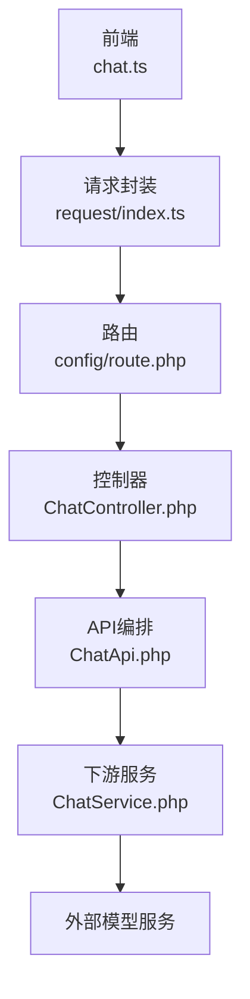
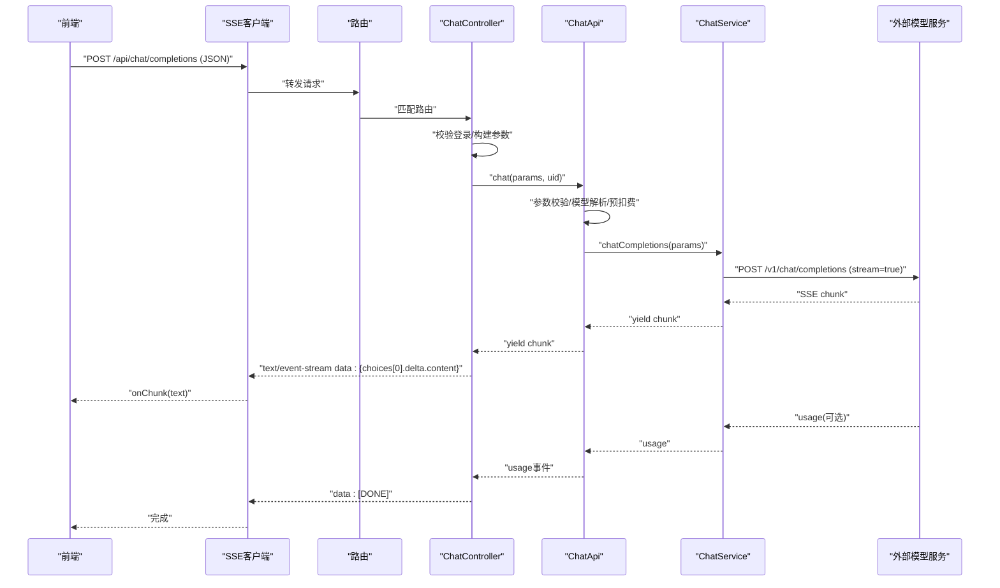
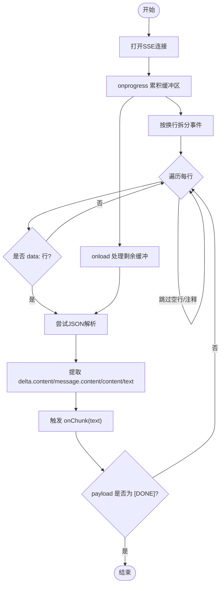
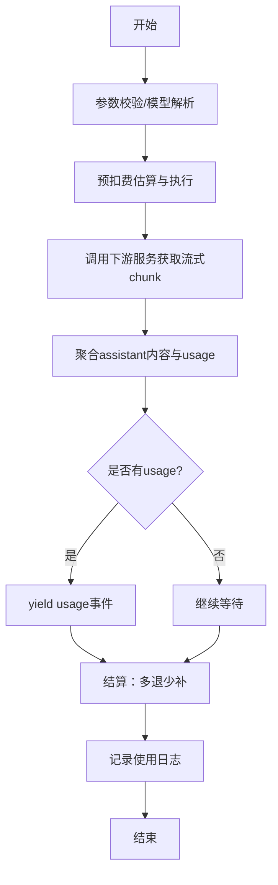
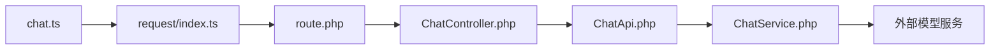

# 文本生成接口

<cite>
**本文引用的文件**   
- [ChatController.php](file://server/plugin/xbAiModelAgent/app/api/controller/ChatController.php)
- [route.php](file://server/plugin/xbAiModelAgent/config/route.php)
- [ChatApi.php](file://server/plugin/xbAiModelAgent/api/ChatApi.php)
- [ChatService.php](file://server/plugin/xbAiModelAgent/service/xbservice/ChatService.php)
- [chat.ts](file://frontend/src/api/chat.ts)
- [index.ts](file://frontend/src/utils/request/index.ts)
</cite>

## 目录
1. [简介](#简介)
2. [项目结构](#项目结构)
3. [核心组件](#核心组件)
4. [架构总览](#架构总览)
5. [详细组件分析](#详细组件分析)
6. [依赖分析](#依赖分析)
7. [性能与调优](#性能与调优)
8. [故障排查指南](#故障排查指南)
9. [结论](#结论)
10. [附录：调用示例与最佳实践](#附录调用示例与最佳实践)

## 简介
本文件面向“文本生成AI模型”的API接入，聚焦以下能力：
- 对话式文本生成（单轮问答、多轮对话）
- 流式输出（SSE）处理
- 提示词工程规范与上下文管理建议
- 不同模型的参数配置与调优选项（温度、Top-P、最大生成长度等）
- 完整的调用示例与最佳实践

后端采用Webman框架，提供OpenAI兼容风格的聊天补全接口；前端通过SSE实现逐字渲染。

## 项目结构
与文本生成接口相关的核心路径如下：
- 路由定义：server/plugin/xbAiModelAgent/config/route.php
- 控制器层：server/plugin/xbAiModelAgent/app/api/controller/ChatController.php
- API编排与计费/日志：server/plugin/xbAiModelAgent/api/ChatApi.php
- 下游服务适配：server/plugin/xbAiModelAgent/service/xbservice/ChatService.php
- 前端请求封装：frontend/src/utils/request/index.ts
- 前端聊天API：frontend/src/api/chat.ts

图表来源
- [route.php:1-13](file://server/plugin/xbAiModelAgent/config/route.php#L1-L13)
- [ChatController.php:1-116](file://server/plugin/xbAiModelAgent/app/api/controller/ChatController.php#L1-L116)
- [ChatApi.php:1-287](file://server/plugin/xbAiModelAgent/api/ChatApi.php#L1-L287)
- [ChatService.php:1-95](file://server/plugin/xbAiModelAgent/service/xbservice/ChatService.php#L1-L95)
- [chat.ts:1-60](file://frontend/src/api/chat.ts#L1-L60)
- [index.ts:123-227](file://frontend/src/utils/request/index.ts#L123-L227)

章节来源
- [route.php:1-13](file://server/plugin/xbAiModelAgent/config/route.php#L1-L13)
- [ChatController.php:1-116](file://server/plugin/xbAiModelAgent/app/api/controller/ChatController.php#L1-L116)
- [ChatApi.php:1-287](file://server/plugin/xbAiModelAgent/api/ChatApi.php#L1-L287)
- [ChatService.php:1-95](file://server/plugin/xbAiModelAgent/service/xbservice/ChatService.php#L1-L95)
- [chat.ts:1-60](file://frontend/src/api/chat.ts#L1-L60)
- [index.ts:123-227](file://frontend/src/utils/request/index.ts#L123-L227)

## 核心组件
- 路由与控制器
  - POST /api/chat/completions 暴露流式聊天能力
  - 校验登录态，设置SSE响应头，转发参数并逐块推送
- API编排
  - 参数校验、模型解析、预扣费估算、流式聚合assistant内容、usage统计、结算与使用日志记录
- 下游服务
  - 以OpenAI风格POST /v1/chat/completions发起流式请求
- 前端
  - SSE客户端封装，自动附加Token，按行解析data事件，提取delta.content并回调

章节来源
- [ChatController.php:26-114](file://server/plugin/xbAiModelAgent/app/api/controller/ChatController.php#L26-L114)
- [ChatApi.php:55-175](file://server/plugin/xbAiModelAgent/api/ChatApi.php#L55-L175)
- [ChatService.php:66-70](file://server/plugin/xbAiModelAgent/service/xbservice/ChatService.php#L66-L70)
- [chat.ts:47-59](file://frontend/src/api/chat.ts#L47-L59)
- [index.ts:132-227](file://frontend/src/utils/request/index.ts#L132-L227)

## 架构总览
下图展示了从前端到后端的完整调用链路，包括SSE流式传输与错误处理。

图表来源
- [ChatController.php:87-114](file://server/plugin/xbAiModelAgent/app/api/controller/ChatController.php#L87-L114)
- [ChatApi.php:144-175](file://server/plugin/xbAiModelAgent/api/ChatApi.php#L144-L175)
- [ChatService.php:66-70](file://server/plugin/xbAiModelAgent/service/xbservice/ChatService.php#L66-L70)
- [index.ts:159-213](file://frontend/src/utils/request/index.ts#L159-L213)

## 详细组件分析

### 接口定义与参数说明
- 接口地址
  - POST /api/chat/completions
- 鉴权
  - 需要登录态（Authorization: Bearer <token>），非白名单接口必须携带Token
- 请求体字段（部分关键字段）
  - model: string，必填，模型ID
  - messages: array，必填，消息列表 [{role, content}]
  - temperature: float，可选，采样温度 0~2
  - top_p: float，可选，核采样参数 0~1
  - n: int，可选，生成数量 >=1
  - max_tokens: int，可选，最大生成Token数
  - max_completion_tokens: int，可选，最大补全Token数
  - stop: string|array，可选，停止序列
  - presence_penalty: float，可选，存在惩罚 -2~2
  - frequency_penalty: float，可选，频率惩罚 -2~2
  - user: string，可选，用户标识
  - tools: array，可选，工具列表
  - tool_choice: string|object，可选，工具选择策略
  - response_format: object，可选，响应格式
  - seed: int，可选，随机种子
  - reasoning_effort: string，可选，推理强度 low/medium/high
- 响应
  - Content-Type: text/event-stream
  - 数据块为SSE事件，data字段包含OpenAI风格的增量片段
  - 结束标记为 data: [DONE]
  - 可能包含 usage 事件用于统计输入/输出/总Token

章节来源
- [route.php:8-10](file://server/plugin/xbAiModelAgent/config/route.php#L8-L10)
- [ChatController.php:26-45](file://server/plugin/xbAiModelAgent/app/api/controller/ChatController.php#L26-L45)
- [ChatController.php:87-101](file://server/plugin/xbAiModelAgent/app/api/controller/ChatController.php#L87-L101)
- [ChatApi.php:55-114](file://server/plugin/xbAiModelAgent/api/ChatApi.php#L55-L114)
- [ChatApi.php:163-166](file://server/plugin/xbAiModelAgent/api/ChatApi.php#L163-L166)
- [index.ts:146-188](file://frontend/src/utils/request/index.ts#L146-L188)

### 流式输出处理（SSE）
- 服务端
  - 设置响应头：Content-Type=text/event-stream、Cache-Control=no-cache、X-Accel-Buffering=no
  - 逐块发送ServerSentEvents，最后发送[data: [DONE]]
- 客户端
  - 使用XMLHttpRequest接收SSE，按换行拆分事件
  - 解析data字段，优先提取 choices[0].delta.content，其次兼容 message.content/content/text
  - 遇到 [DONE] 表示结束

图表来源
- [ChatController.php:87-111](file://server/plugin/xbAiModelAgent/app/api/controller/ChatController.php#L87-L111)
- [index.ts:159-213](file://frontend/src/utils/request/index.ts#L159-L213)

章节来源
- [ChatController.php:87-111](file://server/plugin/xbAiModelAgent/app/api/controller/ChatController.php#L87-L111)
- [index.ts:159-213](file://frontend/src/utils/request/index.ts#L159-L213)

### 上下文管理与多轮对话
- 消息结构
  - messages 数组承载历史对话，每条包含 role 与 content
  - 常见角色：system、user、assistant
- 上下文建议
  - 将系统指令置于第一条 system 消息
  - 控制messages长度，避免超出模型上下文窗口
  - 对长对话进行摘要或滑动窗口裁剪
  - 使用stop或max_tokens限制单次输出长度，便于分步交互

章节来源
- [ChatApi.php:55-66](file://server/plugin/xbAiModelAgent/api/ChatApi.php#L55-L66)
- [ChatService.php:40-70](file://server/plugin/xbAiModelAgent/service/xbservice/ChatService.php#L40-L70)

### 提示词工程规范
- 明确目标与约束：在system中给出角色、任务边界、输出格式要求
- 结构化输入：用分隔符区分指令、背景、输入数据
- 逐步引导：复杂任务拆分为子步骤，配合stop或分段生成
- 可复现实验：固定seed、temperature、top_p以获得稳定结果
- 安全与合规：过滤敏感信息，避免注入攻击

[本节为通用指导，不直接分析具体文件]

### 模型参数与调优
- 温度 temperature：控制创造性，范围通常 0~2，值越大越发散
- Top-P top_p：核采样阈值，范围 0~1，结合temperature调节多样性
- 最大长度 max_tokens/max_completion_tokens：限制输出上限，防止过长
- 停止序列 stop：自定义终止条件，便于结构化输出
- 惩罚项 presence_penalty/frequency_penalty：抑制重复与过度频繁词汇
- 随机种子 seed：提升可复现性
- 推理强度 reasoning_effort：low/medium/high，影响推理质量与耗时

章节来源
- [ChatController.php:26-45](file://server/plugin/xbAiModelAgent/app/api/controller/ChatController.php#L26-L45)
- [ChatApi.php:93-114](file://server/plugin/xbAiModelAgent/api/ChatApi.php#L93-L114)
- [ChatService.php:40-70](file://server/plugin/xbAiModelAgent/service/xbservice/ChatService.php#L40-L70)

### 计费与用量统计
- 预扣费：根据messages估算Token并预扣余额
- 实际结算：依据usage中的input/output/total tokens计算成本与销售金额
- 多退少补：失败全额退款，成功差额调整
- 使用日志：记录消息、用量、费用、状态与错误信息

图表来源
- [ChatApi.php:116-175](file://server/plugin/xbAiModelAgent/api/ChatApi.php#L116-L175)
- [ChatApi.php:191-285](file://server/plugin/xbAiModelAgent/api/ChatApi.php#L191-L285)

章节来源
- [ChatApi.php:116-175](file://server/plugin/xbAiModelAgent/api/ChatApi.php#L116-L175)
- [ChatApi.php:191-285](file://server/plugin/xbAiModelAgent/api/ChatApi.php#L191-L285)

## 依赖分析
- 路由到控制器：POST /api/chat/completions -> ChatController.chat
- 控制器到API：ChatController.chat -> ChatApi.chat
- API到服务：ChatApi.chat -> ChatService.chatCompletions
- 服务到外部：ChatService.postStream('/api/v1/chat/completions', ...)
- 前端到后端：chat.ts -> request.ssePost(...)

图表来源
- [route.php:8-10](file://server/plugin/xbAiModelAgent/config/route.php#L8-L10)
- [ChatController.php:46-114](file://server/plugin/xbAiModelAgent/app/api/controller/ChatController.php#L46-L114)
- [ChatApi.php:55-175](file://server/plugin/xbAiModelAgent/api/ChatApi.php#L55-L175)
- [ChatService.php:66-70](file://server/plugin/xbAiModelAgent/service/xbservice/ChatService.php#L66-L70)
- [chat.ts:47-59](file://frontend/src/api/chat.ts#L47-L59)
- [index.ts:132-227](file://frontend/src/utils/request/index.ts#L132-L227)

章节来源
- [route.php:8-10](file://server/plugin/xbAiModelAgent/config/route.php#L8-L10)
- [ChatController.php:46-114](file://server/plugin/xbAiModelAgent/app/api/controller/ChatController.php#L46-L114)
- [ChatApi.php:55-175](file://server/plugin/xbAiModelAgent/api/ChatApi.php#L55-L175)
- [ChatService.php:66-70](file://server/plugin/xbAiModelAgent/service/xbservice/ChatService.php#L66-L70)
- [chat.ts:47-59](file://frontend/src/api/chat.ts#L47-L59)
- [index.ts:132-227](file://frontend/src/utils/request/index.ts#L132-L227)

## 性能与调优
- 流式渲染
  - 前端按chunk增量拼接，降低首屏延迟
  - 合理设置max_tokens与stop，避免超长输出阻塞
- 并发与取消
  - 支持AbortSignal中断SSE请求，提升交互体验
- 网络与缓存
  - 服务端禁用代理缓冲，确保实时推送
- 资源与成本
  - 预扣费+多退少补机制保障公平计费
  - 通过temperature/top_p/seed平衡质量与稳定性

章节来源
- [ChatController.php:87-101](file://server/plugin/xbAiModelAgent/app/api/controller/ChatController.php#L87-L101)
- [index.ts:218-223](file://frontend/src/utils/request/index.ts#L218-L223)
- [ChatApi.php:116-175](file://server/plugin/xbAiModelAgent/api/ChatApi.php#L116-L175)

## 故障排查指南
- 未登录或Token过期
  - 现象：SSE请求被拒绝
  - 处理：检查Authorization头与登录态
- 参数缺失或非法
  - 现象：抛出运行时异常
  - 处理：确认model与messages必填，数值范围正确
- 模型不存在
  - 现象：返回模型不存在错误
  - 处理：核对model_id是否在可用模型列表中
- 余额不足
  - 现象：预扣费校验失败
  - 处理：充值后再试
- 流式解析异常
  - 现象：前端无法解析data或卡顿
  - 处理：检查服务端SSE格式与[Done]结尾，确认断线重连逻辑

章节来源
- [ChatController.php:54-56](file://server/plugin/xbAiModelAgent/app/api/controller/ChatController.php#L54-L56)
- [ChatApi.php:61-81](file://server/plugin/xbAiModelAgent/api/ChatApi.php#L61-L81)
- [ChatApi.php:167-171](file://server/plugin/xbAiModelAgent/api/ChatApi.php#L167-L171)
- [index.ts:142-144](file://frontend/src/utils/request/index.ts#L142-L144)

## 结论
该文本生成接口基于OpenAI兼容风格，提供稳定的流式聊天能力，具备完善的鉴权、计费与日志记录。前端SSE客户端实现了增量渲染与中断控制，适合构建对话式应用。通过合理的提示词工程与参数调优，可在质量、速度与成本之间取得良好平衡。

## 附录：调用示例与最佳实践

### 基本调用（单轮问答）
- 方法：POST
- 路径：/api/chat/completions
- 头部：
  - Authorization: Bearer <token>
  - Content-Type: application/json
- 请求体要点：
  - model: 指定模型ID
  - messages: 包含一条或多条消息
  - 可选：temperature、top_p、max_tokens、stop等
- 响应：
  - 流式SSE，逐块返回增量内容
  - 结束时返回 [DONE]

章节来源
- [route.php:8-10](file://server/plugin/xbAiModelAgent/config/route.php#L8-L10)
- [ChatController.php:26-45](file://server/plugin/xbAiModelAgent/app/api/controller/ChatController.php#L26-L45)
- [index.ts:146-188](file://frontend/src/utils/request/index.ts#L146-L188)

### 多轮对话
- 维护messages数组，追加user与assistant消息
- 将system指令放在第一条
- 控制上下文长度，必要时进行摘要或截断

章节来源
- [ChatApi.php:55-66](file://server/plugin/xbAiModelAgent/api/ChatApi.php#L55-L66)
- [ChatService.php:40-70](file://server/plugin/xbAiModelAgent/service/xbservice/ChatService.php#L40-L70)

### 流式输出处理（前端）
- 使用request.ssePost发起请求
- 监听onChunk回调，增量拼接文本
- 收到[DONE]后结束渲染

章节来源
- [chat.ts:47-59](file://frontend/src/api/chat.ts#L47-L59)
- [index.ts:159-213](file://frontend/src/utils/request/index.ts#L159-L213)

### 参数调优建议
- 创意写作：temperature偏高（如0.7~1.2），top_p适中（0.8~0.95）
- 事实问答：temperature偏低（如0.1~0.3），top_p较低（0.7~0.9）
- 严格格式：使用stop或response_format约束输出
- 可复现实验：固定seed

章节来源
- [ChatController.php:26-45](file://server/plugin/xbAiModelAgent/app/api/controller/ChatController.php#L26-L45)
- [ChatApi.php:93-114](file://server/plugin/xbAiModelAgent/api/ChatApi.php#L93-L114)