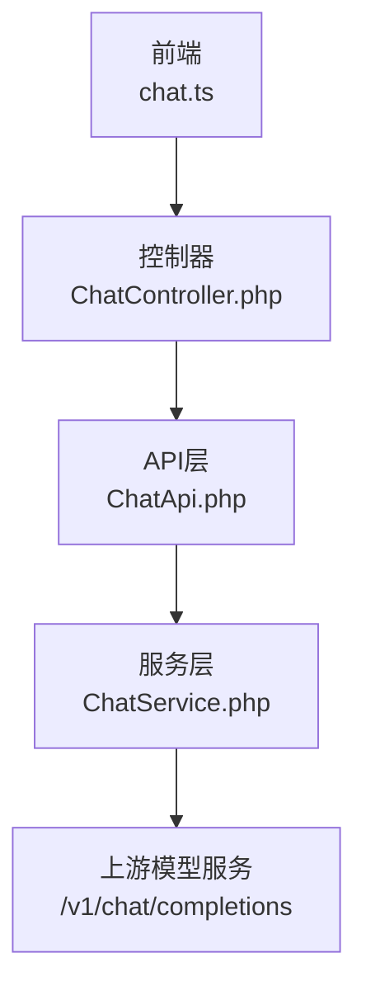
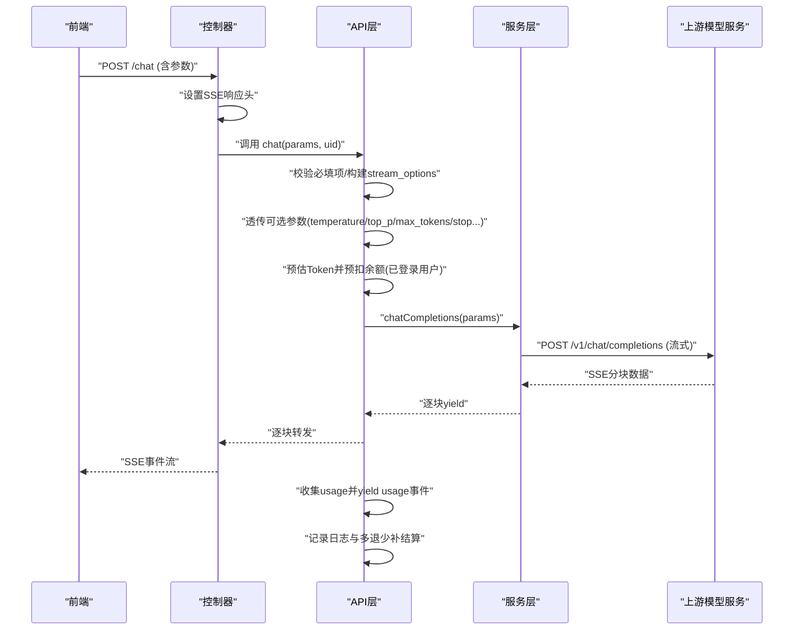
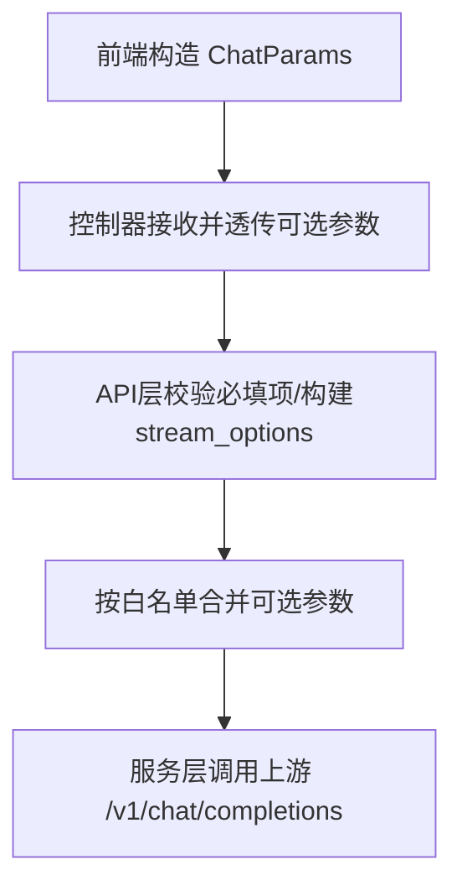
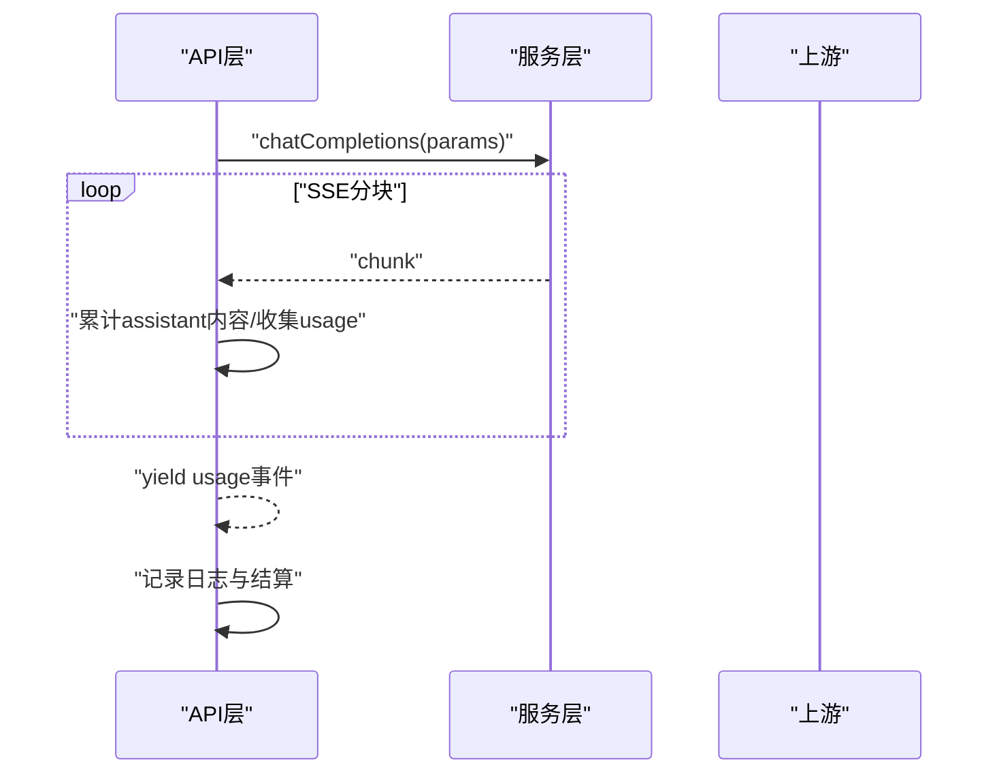
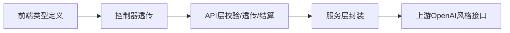

# 模型参数配置

<cite>
**本文引用的文件**   
- [frontend/src/api/chat.ts](file://frontend/src/api/chat.ts)
- [server/plugin/xbAiModelAgent/api/ChatApi.php](file://server/plugin/xbAiModelAgent/api/ChatApi.php)
- [server/plugin/xbAiModelAgent/app/api/controller/ChatController.php](file://server/plugin/xbAiModelAgent/app/api/controller/ChatController.php)
- [server/plugin/xbAiModelAgent/service/xbservice/ChatService.php](file://server/plugin/xbAiModelAgent/service/xbservice/ChatService.php)
</cite>

## 目录
1. [简介](#简介)
2. [项目结构](#项目结构)
3. [核心组件](#核心组件)
4. [架构总览](#架构总览)
5. [详细组件分析](#详细组件分析)
6. [依赖关系分析](#依赖关系分析)
7. [性能与成本考量](#性能与成本考量)
8. [故障排查指南](#故障排查指南)
9. [结论](#结论)
10. [附录：参数参考与场景建议](#附录参数参考与场景建议)

## 简介
本文件面向AI模型参数配置，聚焦文本对话（聊天）接口中可调参数的作用机制、取值范围、对生成质量的影响，以及在不同使用场景下的推荐组合。文档同时说明各参数在前端类型定义、控制器透传、API层校验与服务层调用中的流转路径，帮助开发者在保障稳定性的前提下获得更优的生成效果与成本表现。

## 项目结构
围绕“模型参数”的关键代码主要分布在以下位置：
- 前端请求参数类型定义：位于前端API模块，明确temperature、top_p、max_tokens、stop等字段及其含义
- 控制器层：负责接收HTTP请求、透传可选参数并建立SSE流式响应
- API层：进行必要校验、预扣费估算、参数透传、流式结果收集与用量统计
- 服务层：封装上游OpenAI风格接口的调用，承载具体参数到上游协议的映射

图示来源
- [frontend/src/api/chat.ts:12-45](file://frontend/src/api/chat.ts#L12-L45)
- [server/plugin/xbAiModelAgent/app/api/controller/ChatController.php:26-85](file://server/plugin/xbAiModelAgent/app/api/controller/ChatController.php#L26-L85)
- [server/plugin/xbAiModelAgent/api/ChatApi.php:55-114](file://server/plugin/xbAiModelAgent/api/ChatApi.php#L55-L114)
- [server/plugin/xbAiModelAgent/service/xbservice/ChatService.php:41-72](file://server/plugin/xbAiModelAgent/service/xbservice/ChatService.php#L41-L72)

章节来源
- [frontend/src/api/chat.ts:12-45](file://frontend/src/api/chat.ts#L12-L45)
- [server/plugin/xbAiModelAgent/app/api/controller/ChatController.php:26-85](file://server/plugin/xbAiModelAgent/app/api/controller/ChatController.php#L26-L85)
- [server/plugin/xbAiModelAgent/api/ChatApi.php:55-114](file://server/plugin/xbAiModelAgent/api/ChatApi.php#L55-L114)
- [server/plugin/xbAiModelAgent/service/xbservice/ChatService.php:41-72](file://server/plugin/xbAiModelAgent/service/xbservice/ChatService.php#L41-L72)

## 核心组件
- 前端参数类型定义：集中声明了temperature、top_p、n、max_tokens、max_completion_tokens、stop、presence_penalty、frequency_penalty、user、tools、tool_choice、response_format、seed、reasoning_effort等字段，作为客户端构造请求的依据
- 控制器透传：将上述可选参数原样转发至API层，并设置SSE响应头以支持流式输出
- API层处理：对必填项进行校验；构建包含stream_options的请求体；按白名单透传可选参数；基于预估Token数进行预扣费；在流结束后汇总usage并记录日志
- 服务层调用：统一封装上游OpenAI风格的/chat/completions接口，保持参数语义一致

章节来源
- [frontend/src/api/chat.ts:12-45](file://frontend/src/api/chat.ts#L12-L45)
- [server/plugin/xbAiModelAgent/app/api/controller/ChatController.php:26-85](file://server/plugin/xbAiModelAgent/app/api/controller/ChatController.php#L26-L85)
- [server/plugin/xbAiModelAgent/api/ChatApi.php:55-114](file://server/plugin/xbAiModelAgent/api/ChatApi.php#L55-L114)
- [server/plugin/xbAiModelAgent/service/xbservice/ChatService.php:41-72](file://server/plugin/xbAiModelAgent/service/xbservice/ChatService.php#L41-L72)

## 架构总览
下图展示了从前端发起聊天请求到上游模型服务的完整流程，包括参数透传、流式返回、用量统计与结算。

图示来源
- [server/plugin/xbAiModelAgent/app/api/controller/ChatController.php:87-111](file://server/plugin/xbAiModelAgent/app/api/controller/ChatController.php#L87-L111)
- [server/plugin/xbAiModelAgent/api/ChatApi.php:55-175](file://server/plugin/xbAiModelAgent/api/ChatApi.php#L55-L175)
- [server/plugin/xbAiModelAgent/service/xbservice/ChatService.php:41-72](file://server/plugin/xbAiModelAgent/service/xbservice/ChatService.php#L41-L72)

## 详细组件分析

### 参数透传与校验链路
- 前端类型定义确保客户端正确传递参数
- 控制器通过白名单透传可选参数，避免注入非法字段
- API层再次校验必填项，并将可选参数加入最终请求体
- 服务层将参数直接映射到上游OpenAI风格接口

图示来源
- [frontend/src/api/chat.ts:12-45](file://frontend/src/api/chat.ts#L12-L45)
- [server/plugin/xbAiModelAgent/app/api/controller/ChatController.php:64-85](file://server/plugin/xbAiModelAgent/app/api/controller/ChatController.php#L64-L85)
- [server/plugin/xbAiModelAgent/api/ChatApi.php:93-114](file://server/plugin/xbAiModelAgent/api/ChatApi.php#L93-L114)
- [server/plugin/xbAiModelAgent/service/xbservice/ChatService.php:41-72](file://server/plugin/xbAiModelAgent/service/xbservice/ChatService.php#L41-L72)

章节来源
- [frontend/src/api/chat.ts:12-45](file://frontend/src/api/chat.ts#L12-L45)
- [server/plugin/xbAiModelAgent/app/api/controller/ChatController.php:64-85](file://server/plugin/xbAiModelAgent/app/api/controller/ChatController.php#L64-L85)
- [server/plugin/xbAiModelAgent/api/ChatApi.php:93-114](file://server/plugin/xbAiModelAgent/api/ChatApi.php#L93-L114)
- [server/plugin/xbAiModelAgent/service/xbservice/ChatService.php:41-72](file://server/plugin/xbAiModelAgent/service/xbservice/ChatService.php#L41-L72)

### 关键参数详解与作用机制
- temperature（采样温度）
  - 作用：控制输出的随机性与创造性。值越高，输出越多样；值越低，输出越确定
  - 取值范围：0~2（默认通常为1）
  - 影响：高temperature提升多样性但可能降低一致性；低temperature提高稳定性但可能单调
  - 适用：创意写作、头脑风暴适合较高值；事实问答、代码生成适合较低值
  - 参考实现位置：[服务端注释与透传:33-35](file://server/plugin/xbAiModelAgent/api/ChatApi.php#L33-L35), [服务层文档:47-48](file://server/plugin/xbAiModelAgent/service/xbservice/ChatService.php#L47-L48)

- top_p（核采样）
  - 作用：累积概率阈值，限制候选词集合大小，平衡多样性与连贯性
  - 取值范围：0~1（默认通常为1）
  - 影响：较小top_p使输出更聚焦；较大top_p增加多样性
  - 适用：与temperature配合调参，通常二者只调整其一以避免冲突
  - 参考实现位置：[服务端注释与透传:34-35](file://server/plugin/xbAiModelAgent/api/ChatApi.php#L34-L35), [服务层文档:48-49](file://server/plugin/xbAiModelAgent/service/xbservice/ChatService.php#L48-L49)

- max_tokens / max_completion_tokens（生成长度限制）
  - 作用：限制单次生成的最大Token数，防止过长输出
  - 取值范围：正整数（未设限时由上游决定）
  - 影响：过小可能导致截断；过大增加延迟与成本
  - 注意：系统会优先读取max_tokens或max_completion_tokens用于预估费用
  - 参考实现位置：[参数透传:98-100](file://server/plugin/xbAiModelAgent/api/ChatApi.php#L98-L100), [费用预估读取:120-122](file://server/plugin/xbAiModelAgent/api/ChatApi.php#L120-L122)

- stop（停止序列）
  - 作用：当生成内容命中指定字符串时提前结束
  - 类型：字符串或数组（服务端注释支持string|array）
  - 影响：合理设置可精准控制段落边界或结构化输出结尾
  - 参考实现位置：[参数透传:99-100](file://server/plugin/xbAiModelAgent/api/ChatApi.php#L99-L100), [服务层文档:52-53](file://server/plugin/xbAiModelAgent/service/xbservice/ChatService.php#L52-L53)

- n（生成数量）
  - 作用：一次请求生成多条候选
  - 影响：增大n会增加成本与延迟，适合A/B对比或多样性探索
  - 参考实现位置：[参数透传:96-97](file://server/plugin/xbAiModelAgent/api/ChatApi.php#L96-L97), [服务层文档:49-50](file://server/plugin/xbAiModelAgent/service/xbservice/ChatService.php#L49-L50)

- presence_penalty / frequency_penalty（存在惩罚/频率惩罚）
  - 作用：抑制重复与鼓励新信息出现
  - 取值范围：-2~2（默认通常为0）
  - 影响：正值减少重复、鼓励新颖；负值鼓励重复
  - 参考实现位置：[参数透传:101-102](file://server/plugin/xbAiModelAgent/api/ChatApi.php#L101-L102), [服务层文档:55-56](file://server/plugin/xbAiModelAgent/service/xbservice/ChatService.php#L55-L56)

- user（用户标识）
  - 作用：下游计费或审计追踪
  - 参考实现位置：[参数透传:103-104](file://server/plugin/xbAiModelAgent/api/ChatApi.php#L103-L104)

- tools / tool_choice（工具列表/选择策略）
  - 作用：启用函数调用或外部工具能力，控制是否强制使用工具
  - 参考实现位置：[参数透传:104-106](file://server/plugin/xbAiModelAgent/api/ChatApi.php#L104-L106), [服务层文档:59-61](file://server/plugin/xbAiModelAgent/service/xbservice/ChatService.php#L59-L61)

- response_format（响应格式）
  - 作用：约束输出为JSON等结构化格式
  - 参考实现位置：[参数透传:106-107](file://server/plugin/xbAiModelAgent/api/ChatApi.php#L106-L107), [服务层文档:61-62](file://server/plugin/xbAiModelAgent/service/xbservice/ChatService.php#L61-L62)

- seed（随机种子）
  - 作用：固定随机性以提升可复现性
  - 参考实现位置：[参数透传:107-108](file://server/plugin/xbAiModelAgent/api/ChatApi.php#L107-L108)

- reasoning_effort（推理强度）
  - 作用：控制模型推理深度（low/medium/high），影响质量与耗时
  - 参考实现位置：[参数透传:108-109](file://server/plugin/xbAiModelAgent/api/ChatApi.php#L108-L109), [服务层文档:63-64](file://server/plugin/xbAiModelAgent/service/xbservice/ChatService.php#L63-L64)

章节来源
- [server/plugin/xbAiModelAgent/api/ChatApi.php:33-47](file://server/plugin/xbAiModelAgent/api/ChatApi.php#L33-L47)
- [server/plugin/xbAiModelAgent/api/ChatApi.php:93-114](file://server/plugin/xbAiModelAgent/api/ChatApi.php#L93-L114)
- [server/plugin/xbAiModelAgent/service/xbservice/ChatService.php:41-72](file://server/plugin/xbAiModelAgent/service/xbservice/ChatService.php#L41-L72)

### 流式处理与用量统计
- 控制器设置SSE响应头，逐块转发上游chunk
- API层在流过程中累计assistant回复内容，并在最后一个chunk中收集usage
- 流结束后yield usage事件，随后记录日志并进行多退少补结算

图示来源
- [server/plugin/xbAiModelAgent/app/api/controller/ChatController.php:87-111](file://server/plugin/xbAiModelAgent/app/api/controller/ChatController.php#L87-L111)
- [server/plugin/xbAiModelAgent/api/ChatApi.php:144-175](file://server/plugin/xbAiModelAgent/api/ChatApi.php#L144-L175)

章节来源
- [server/plugin/xbAiModelAgent/app/api/controller/ChatController.php:87-111](file://server/plugin/xbAiModelAgent/app/api/controller/ChatController.php#L87-L111)
- [server/plugin/xbAiModelAgent/api/ChatApi.php:144-175](file://server/plugin/xbAiModelAgent/api/ChatApi.php#L144-L175)

## 依赖关系分析
- 前端类型定义是参数契约的基础，保证前后端字段一致
- 控制器仅做透传与SSE头设置，不改变参数语义
- API层承担校验、费用预估与日志结算职责
- 服务层对上屏蔽差异，统一采用OpenAI风格接口

图示来源
- [frontend/src/api/chat.ts:12-45](file://frontend/src/api/chat.ts#L12-L45)
- [server/plugin/xbAiModelAgent/app/api/controller/ChatController.php:64-85](file://server/plugin/xbAiModelAgent/app/api/controller/ChatController.php#L64-L85)
- [server/plugin/xbAiModelAgent/api/ChatApi.php:93-114](file://server/plugin/xbAiModelAgent/api/ChatApi.php#L93-L114)
- [server/plugin/xbAiModelAgent/service/xbservice/ChatService.php:41-72](file://server/plugin/xbAiModelAgent/service/xbservice/ChatService.php#L41-L72)

章节来源
- [frontend/src/api/chat.ts:12-45](file://frontend/src/api/chat.ts#L12-L45)
- [server/plugin/xbAiModelAgent/app/api/controller/ChatController.php:64-85](file://server/plugin/xbAiModelAgent/app/api/controller/ChatController.php#L64-L85)
- [server/plugin/xbAiModelAgent/api/ChatApi.php:93-114](file://server/plugin/xbAiModelAgent/api/ChatApi.php#L93-L114)
- [server/plugin/xbAiModelAgent/service/xbservice/ChatService.php:41-72](file://server/plugin/xbAiModelAgent/service/xbservice/ChatService.php#L41-L72)

## 性能与成本考量
- 合理设置max_tokens/max_completion_tokens可降低无效输出带来的延迟与成本
- temperature与top_p共同影响多样性与稳定性，建议优先固定一个再微调另一个
- presence_penalty/frequency_penalty有助于减少重复，但过高会导致语句不自然
- 开启reasoning_effort为high可提升复杂任务质量，但会显著增加耗时与成本
- 使用stop序列可有效控制输出边界，避免过度生成
- 系统会在已登录用户场景下基于预估Token进行预扣费，并在完成后多退少补，建议结合业务需求合理设置长度上限

章节来源
- [server/plugin/xbAiModelAgent/api/ChatApi.php:116-133](file://server/plugin/xbAiModelAgent/api/ChatApi.php#L116-L133)
- [server/plugin/xbAiModelAgent/api/ChatApi.php:163-175](file://server/plugin/xbAiModelAgent/api/ChatApi.php#L163-L175)

## 故障排查指南
- 常见错误：模型ID为空、消息列表为空、模型不存在、余额不足等
- 现象定位：SSE流中会返回error事件，且最终会yield usage事件或[DONE]标记
- 处理建议：检查必填参数；确认模型可用；关注usage事件中的token统计；核对预扣与结算逻辑

章节来源
- [server/plugin/xbAiModelAgent/api/ChatApi.php:57-81](file://server/plugin/xbAiModelAgent/api/ChatApi.php#L57-L81)
- [server/plugin/xbAiModelAgent/api/ChatApi.php:167-175](file://server/plugin/xbAiModelAgent/api/ChatApi.php#L167-L175)
- [server/plugin/xbAiModelAgent/app/api/controller/ChatController.php:102-111](file://server/plugin/xbAiModelAgent/app/api/controller/ChatController.php#L102-L111)

## 结论
本系统对聊天参数实现了端到端的透明透传与严格校验，既保证了与上游OpenAI风格接口的一致性，又提供了费用预估与结算、SSE流式输出等工程化能力。在实际使用中，建议根据任务类型与质量要求，优先确定max_tokens与stop，再调节temperature与top_p以获得最佳性价比。

## 附录：参数参考与场景建议

### 参数参考表
- temperature
  - 类型：浮点数
  - 范围：0~2（默认通常为1）
  - 作用：控制随机性与创造性
  - 参考：[服务端注释:33-35](file://server/plugin/xbAiModelAgent/api/ChatApi.php#L33-L35), [服务层文档:47-48](file://server/plugin/xbAiModelAgent/service/xbservice/ChatService.php#L47-L48)

- top_p
  - 类型：浮点数
  - 范围：0~1（默认通常为1）
  - 作用：核采样阈值，控制候选集大小
  - 参考：[服务端注释:34-35](file://server/plugin/xbAiModelAgent/api/ChatApi.php#L34-L35), [服务层文档:48-49](file://server/plugin/xbAiModelAgent/service/xbservice/ChatService.php#L48-L49)

- max_tokens / max_completion_tokens
  - 类型：整数
  - 作用：限制最大生成Token数
  - 参考：[透传与费用预估:98-100](file://server/plugin/xbAiModelAgent/api/ChatApi.php#L98-L100), [费用预估读取:120-122](file://server/plugin/xbAiModelAgent/api/ChatApi.php#L120-L122)

- stop
  - 类型：字符串或数组
  - 作用：命中即停止
  - 参考：[透传:99-100](file://server/plugin/xbAiModelAgent/api/ChatApi.php#L99-L100), [服务层文档:52-53](file://server/plugin/xbAiModelAgent/service/xbservice/ChatService.php#L52-L53)

- n
  - 类型：整数
  - 作用：生成候选数量
  - 参考：[透传:96-97](file://server/plugin/xbAiModelAgent/api/ChatApi.php#L96-L97), [服务层文档:49-50](file://server/plugin/xbAiModelAgent/service/xbservice/ChatService.php#L49-L50)

- presence_penalty / frequency_penalty
  - 类型：浮点数
  - 范围：-2~2（默认通常为0）
  - 作用：抑制重复/鼓励新颖
  - 参考：[透传:101-102](file://server/plugin/xbAiModelAgent/api/ChatApi.php#L101-L102), [服务层文档:55-56](file://server/plugin/xbAiModelAgent/service/xbservice/ChatService.php#L55-L56)

- user
  - 类型：字符串
  - 作用：用户标识
  - 参考：[透传:103-104](file://server/plugin/xbAiModelAgent/api/ChatApi.php#L103-L104)

- tools / tool_choice
  - 类型：数组/字符串或对象
  - 作用：工具调用与选择策略
  - 参考：[透传:104-106](file://server/plugin/xbAiModelAgent/api/ChatApi.php#L104-L106), [服务层文档:59-61](file://server/plugin/xbAiModelAgent/service/xbservice/ChatService.php#L59-L61)

- response_format
  - 类型：对象
  - 作用：约束输出格式（如JSON）
  - 参考：[透传:106-107](file://server/plugin/xbAiModelAgent/api/ChatApi.php#L106-L107), [服务层文档:61-62](file://server/plugin/xbAiModelAgent/service/xbservice/ChatService.php#L61-L62)

- seed
  - 类型：整数
  - 作用：固定随机性
  - 参考：[透传:107-108](file://server/plugin/xbAiModelAgent/api/ChatApi.php#L107-L108)

- reasoning_effort
  - 类型：枚举 low/medium/high
  - 作用：控制推理深度
  - 参考：[透传:108-109](file://server/plugin/xbAiModelAgent/api/ChatApi.php#L108-L109), [服务层文档:63-64](file://server/plugin/xbAiModelAgent/service/xbservice/ChatService.php#L63-L64)

### 场景化参数建议
- 创意写作/头脑风暴
  - temperature：中高（例如0.7~1.2）
  - top_p：中高（例如0.8~0.95）
  - max_tokens：根据期望篇幅设定
  - stop：可设置段落分隔符或章节结尾
  - 参考：[参数透传:93-114](file://server/plugin/xbAiModelAgent/api/ChatApi.php#L93-L114)

- 事实问答/知识检索
  - temperature：低（例如0.1~0.4）
  - top_p：低（例如0.7~0.9）
  - max_tokens：适中，避免冗长
  - stop：可设置答案结束标志
  - 参考：[参数透传:93-114](file://server/plugin/xbAiModelAgent/api/ChatApi.php#L93-L114)

- 代码生成/结构化输出
  - temperature：低（例如0.1~0.3）
  - top_p：低（例如0.7~0.9）
  - response_format：JSON模式
  - stop：代码块闭合标记
  - 参考：[透传与格式约束:106-107](file://server/plugin/xbAiModelAgent/api/ChatApi.php#L106-L107), [服务层文档:61-62](file://server/plugin/xbAiModelAgent/service/xbservice/ChatService.php#L61-L62)

- 长文续写/故事创作
  - temperature：中等（例如0.6~0.9）
  - top_p：中等（例如0.8~0.9）
  - max_tokens：较大
  - stop：章节或段落结束标记
  - 参考：[透传:93-114](file://server/plugin/xbAiModelAgent/api/ChatApi.php#L93-L114)

- 高确定性任务（如指令遵循）
  - temperature：接近0
  - top_p：较低
  - stop：精确控制结束
  - 参考：[透传:93-114](file://server/plugin/xbAiModelAgent/api/ChatApi.php#L93-L114)

### 兼容性说明
- 本系统采用OpenAI风格接口，参数命名与行为与上游保持一致
- 部分上游可能不支持全部参数（如reasoning_effort、modalities、audio等），若上游拒绝将返回错误，建议在客户端侧做兼容降级
- 对于max_tokens与max_completion_tokens，系统会优先读取前者，其次后者，用于费用预估与上限控制
- 参考：[服务层文档:41-72](file://server/plugin/xbAiModelAgent/service/xbservice/ChatService.php#L41-L72), [费用预估读取:120-122](file://server/plugin/xbAiModelAgent/api/ChatApi.php#L120-L122)