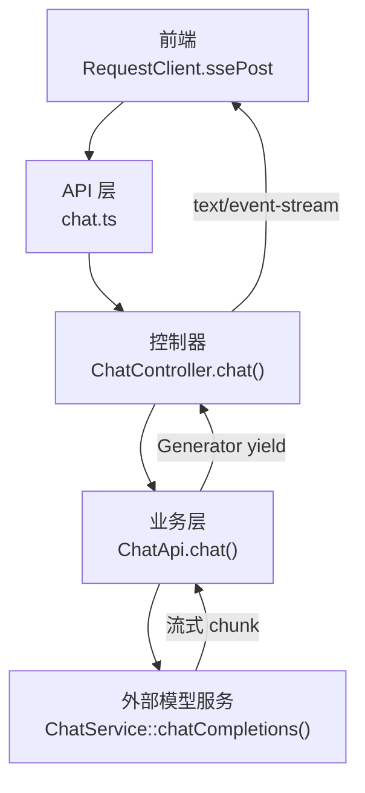
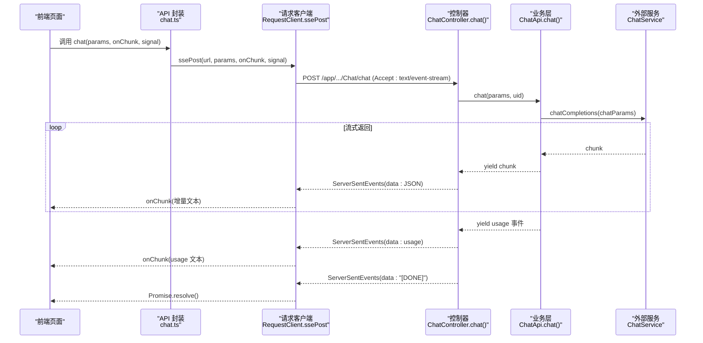
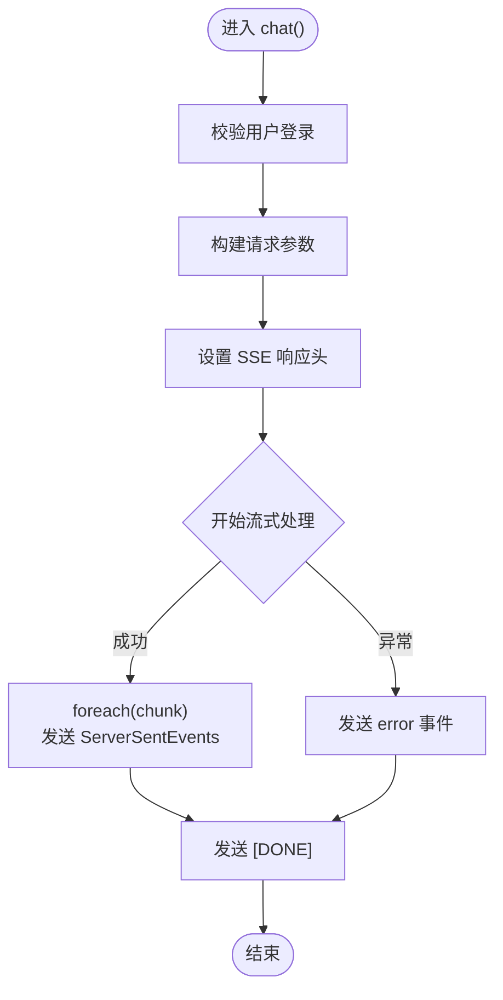
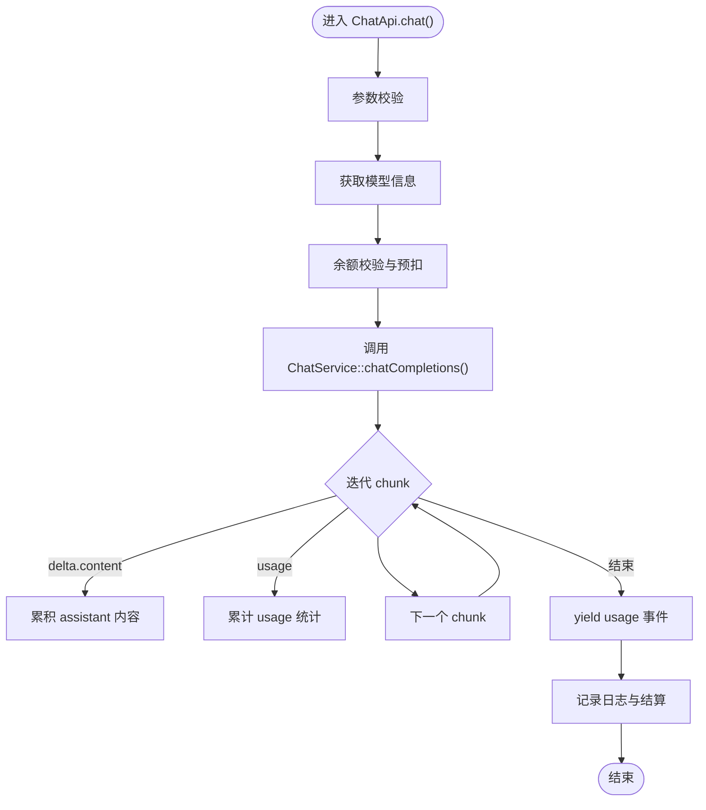
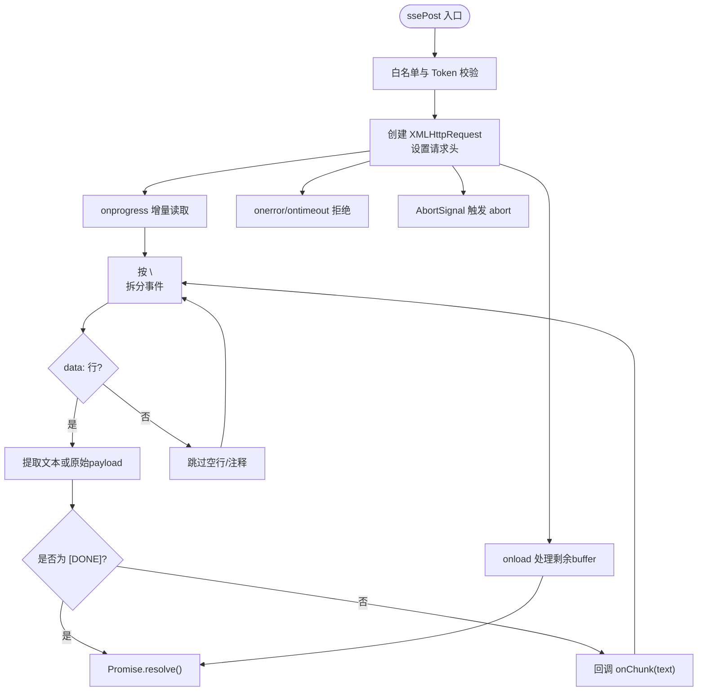
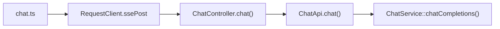

# 流式响应处理

<cite>
**本文引用的文件**
- [ChatController.php](file://server/plugin/xbAiModelAgent/app/api/controller/ChatController.php)
- [ChatApi.php](file://server/plugin/xbAiModelAgent/api/ChatApi.php)
- [index.ts](file://frontend/src/utils/request/index.ts)
- [chat.ts](file://frontend/src/api/chat.ts)
</cite>

## 目录
1. [简介](#简介)
2. [项目结构](#项目结构)
3. [核心组件](#核心组件)
4. [架构总览](#架构总览)
5. [详细组件分析](#详细组件分析)
6. [依赖关系分析](#依赖关系分析)
7. [性能考量](#性能考量)
8. [故障排查指南](#故障排查指南)
9. [结论](#结论)
10. [附录](#附录)

## 简介
本技术文档围绕 Server-Sent Events（SSE）的端到端实现，系统阐述后端如何建立长连接、分块推送数据、错误处理与结束标记；前端如何解析事件流、实时渲染增量文本、展示进度与异常恢复。同时提供基于现有代码库的 JavaScript 客户端调用示例路径与性能优化建议，帮助读者快速落地并稳定运行。

## 项目结构
本项目采用前后端分离：
- 后端使用 PHP + Workerman，控制器设置 SSE 响应头并通过 ServerSentEvents 逐块发送数据。
- 前端通过自定义 RequestClient 封装 XMLHttpRequest 以支持 SSE 流式 POST，统一在 API 层暴露 chat 方法供页面调用。

图表来源
- [ChatController.php:46-114](file://server/plugin/xbAiModelAgent/app/api/controller/ChatController.php#L46-L114)
- [ChatApi.php:55-175](file://server/plugin/xbAiModelAgent/api/ChatApi.php#L55-L175)
- [index.ts:132-227](file://frontend/src/utils/request/index.ts#L132-L227)
- [chat.ts:53-59](file://frontend/src/api/chat.ts#L53-L59)

章节来源
- [ChatController.php:46-114](file://server/plugin/xbAiModelAgent/app/api/controller/ChatController.php#L46-L114)
- [ChatApi.php:55-175](file://server/plugin/xbAiModelAgent/api/ChatApi.php#L55-L175)
- [index.ts:132-227](file://frontend/src/utils/request/index.ts#L132-L227)
- [chat.ts:53-59](file://frontend/src/api/chat.ts#L53-L59)

## 核心组件
- 后端控制器 ChatController.chat()
  - 校验用户身份，组装请求参数，设置 SSE 响应头，循环消费 Generator 产生的 chunk，并以 ServerSentEvents 格式推送；结束时发送 [DONE] 标记；异常时推送 error 事件后再发 [DONE]。
- 业务层 ChatApi.chat()
  - 参数校验、余额预扣、透传可选参数、调用 ChatService 获取流式结果，聚合 assistant 内容与 usage，并在结束后 yield usage 事件；异常时 yield error 事件。
- 前端 RequestClient.ssePost()
  - 使用 XMLHttpRequest 发起 POST，设置 Accept: text/event-stream，按行解析 data: 事件，提取增量文本或原始 payload，遇到 [DONE] 结束；支持 AbortSignal 取消；onload 处理缓冲区剩余数据。
- API 封装 chat.ts
  - 对外暴露 chat(params, onChunk, signal)，内部调用 request.ssePost 完成流式请求。

章节来源
- [ChatController.php:46-114](file://server/plugin/xbAiModelAgent/app/api/controller/ChatController.php#L46-L114)
- [ChatApi.php:55-175](file://server/plugin/xbAiModelAgent/api/ChatApi.php#L55-L175)
- [index.ts:132-227](file://frontend/src/utils/request/index.ts#L132-L227)
- [chat.ts:53-59](file://frontend/src/api/chat.ts#L53-L59)

## 架构总览
下图展示了从前端到后端的完整 SSE 调用链路与关键职责边界。

图表来源
- [chat.ts:53-59](file://frontend/src/api/chat.ts#L53-L59)
- [index.ts:132-227](file://frontend/src/utils/request/index.ts#L132-L227)
- [ChatController.php:46-114](file://server/plugin/xbAiModelAgent/app/api/controller/ChatController.php#L46-L114)
- [ChatApi.php:55-175](file://server/plugin/xbAiModelAgent/api/ChatApi.php#L55-L175)

## 详细组件分析

### 后端控制器：ChatController.chat()
- 功能要点
  - 设置响应头 Content-Type: text/event-stream、Cache-Control: no-cache、X-Accel-Buffering: no，确保代理不缓冲。
  - 遍历 ChatApi.chat() 的 Generator，逐块发送 ServerSentEvents，包含 data: JSON。
  - 正常结束发送 data: [DONE]；异常时先发送 error 事件再发送 [DONE]。
- 关键流程
  - 参数透传：将 temperature、top_p、max_tokens 等可选参数透传给下游。
  - 错误处理：捕获 Throwable，构造标准 error 对象并推送。

图表来源
- [ChatController.php:46-114](file://server/plugin/xbAiModelAgent/app/api/controller/ChatController.php#L46-L114)

章节来源
- [ChatController.php:46-114](file://server/plugin/xbAiModelAgent/app/api/controller/ChatController.php#L46-L114)

### 业务层：ChatApi.chat()
- 功能要点
  - 参数校验：model 与 messages 必填。
  - 余额前置校验与预扣费：根据模型价格估算 token 并预扣，后续多退少补。
  - 透传可选参数至下游服务。
  - 流式消费：收集 assistant 回复内容、usage 统计，结束后 yield usage 事件。
  - 异常处理：yield error 事件，不影响主流程继续结算。
- 计费与日志
  - 记录 usage 日志，计算成本与销售金额，执行退款/补扣逻辑。

图表来源
- [ChatApi.php:55-175](file://server/plugin/xbAiModelAgent/api/ChatApi.php#L55-L175)

章节来源
- [ChatApi.php:55-175](file://server/plugin/xbAiModelAgent/api/ChatApi.php#L55-L175)

### 前端客户端：RequestClient.ssePost()
- 功能要点
  - 使用 XMLHttpRequest 发起 POST，设置 Accept: text/event-stream。
  - 维护 buffer 与 lastIndex，按换行拆分事件，解析 data: 行。
  - 智能提取增量文本：优先解析 choices[0].delta.content 等字段，回退为原始 payload。
  - 遇到 [DONE] 立即 resolve；onload 处理缓冲区剩余数据。
  - 支持 AbortSignal 取消请求，抛出明确错误。
- 典型用法
  - 在 onChunk 中追加渲染到视图，或使用虚拟滚动/增量 DOM 更新避免重排。

图表来源
- [index.ts:132-227](file://frontend/src/utils/request/index.ts#L132-L227)

章节来源
- [index.ts:132-227](file://frontend/src/utils/request/index.ts#L132-L227)

### API 封装：chat.ts
- 对外暴露 chat(params, onChunk, signal)，内部委托 request.ssePost 完成流式请求。
- 类型定义清晰，便于 TypeScript 静态检查与 IDE 提示。

章节来源
- [chat.ts:1-60](file://frontend/src/api/chat.ts#L1-L60)

## 依赖关系分析
- 模块耦合
  - 控制器依赖业务层 ChatApi，业务层依赖外部 ChatService。
  - 前端 API 层仅依赖 RequestClient，保持低耦合。
- 外部依赖
  - 后端使用 Workerman 的 Response 与 ServerSentEvents 协议类。
  - 前端使用原生 XMLHttpRequest，避免跨域问题并与 Axios 共享网络层。

图表来源
- [chat.ts:53-59](file://frontend/src/api/chat.ts#L53-L59)
- [index.ts:132-227](file://frontend/src/utils/request/index.ts#L132-L227)
- [ChatController.php:46-114](file://server/plugin/xbAiModelAgent/app/api/controller/ChatController.php#L46-L114)
- [ChatApi.php:55-175](file://server/plugin/xbAiModelAgent/api/ChatApi.php#L55-L175)

章节来源
- [chat.ts:53-59](file://frontend/src/api/chat.ts#L53-L59)
- [index.ts:132-227](file://frontend/src/utils/request/index.ts#L132-L227)
- [ChatController.php:46-114](file://server/plugin/xbAiModelAgent/app/api/controller/ChatController.php#L46-L114)
- [ChatApi.php:55-175](file://server/plugin/xbAiModelAgent/api/ChatApi.php#L55-L175)

## 性能考量
- 服务端
  - 关闭代理缓冲：设置 X-Accel-Buffering: no，避免 Nginx 等中间件缓存导致延迟。
  - 小粒度推送：尽量按最小语义单元（如单词或短片段）推送，降低首字延迟。
  - 合理使用 usage 事件：仅在末尾或间隔较大时推送，减少前端解析开销。
- 前端
  - 增量渲染：在 onChunk 中直接追加文本节点或使用虚拟列表，避免整段重绘。
  - 防抖/节流：对高频 onChunk 进行合并，例如每 50ms 批量更新一次 DOM。
  - 内存管理：限制历史消息长度，及时释放不再使用的字符串引用。
  - 取消与重试：结合 AbortSignal 支持中断；在网络抖动时实现指数退避重连。

## 故障排查指南
- 常见问题
  - 未设置 Accept: text/event-stream：前端需显式设置该请求头，否则可能无法正确识别流式响应。
  - 代理缓冲：若经 Nginx/CDN，需确保禁用缓冲（X-Accel-Buffering: no）。
  - 认证失败：非白名单接口需要携带 Authorization 头，未登录会直接拒绝。
  - 数据解析异常：当后端返回非 OpenAI 格式时，前端已做回退处理，仍会输出原始 payload。
- 定位步骤
  - 检查浏览器 Network 面板，确认响应头 Content-Type 为 text/event-stream。
  - 观察事件流是否包含 data: 行与最终的 [DONE]。
  - 查看控制台错误信息，区分网络错误、超时与中止。
- 恢复策略
  - 前端捕获异常后，可提示用户重试或自动指数退避重连。
  - 对于长时间任务，可在 UI 上显示“生成中”状态并提供取消按钮。

章节来源
- [index.ts:132-227](file://frontend/src/utils/request/index.ts#L132-L227)
- [ChatController.php:46-114](file://server/plugin/xbAiModelAgent/app/api/controller/ChatController.php#L46-L114)

## 结论
本项目实现了完整的 SSE 流式响应链路：后端通过 Workerman 的 ServerSentEvents 协议逐块推送，前端通过 XMLHttpRequest 解析事件流并实时渲染。整体设计清晰、职责分明，具备较好的可扩展性与容错能力。建议在大规模场景下进一步优化渲染与内存管理，并结合业务需求完善重连与降级策略。

## 附录
- 前端调用示例（路径）
  - 在页面中引入 chat.ts 的 chat 函数，传入参数与 onChunk 回调即可实现流式输出。
  - 参考路径：[chat.ts:53-59](file://frontend/src/api/chat.ts#L53-L59)
- 关键实现位置
  - 控制器 SSE 推送：[ChatController.php:46-114](file://server/plugin/xbAiModelAgent/app/api/controller/ChatController.php#L46-L114)
  - 业务层流式处理与计费：[ChatApi.php:55-175](file://server/plugin/xbAiModelAgent/api/ChatApi.php#L55-L175)
  - 前端 SSE 客户端：[index.ts:132-227](file://frontend/src/utils/request/index.ts#L132-L227)