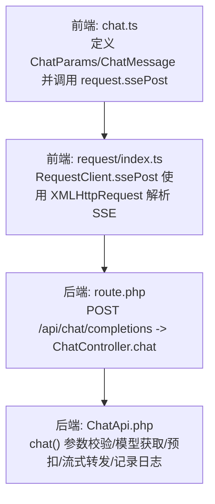
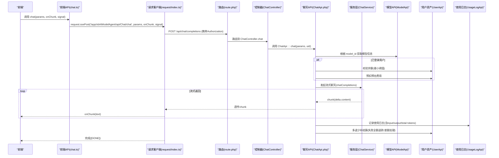
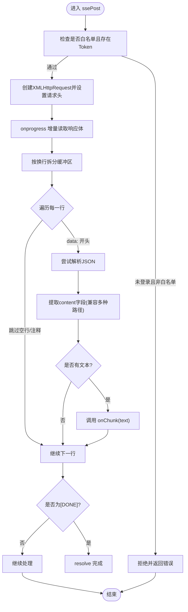
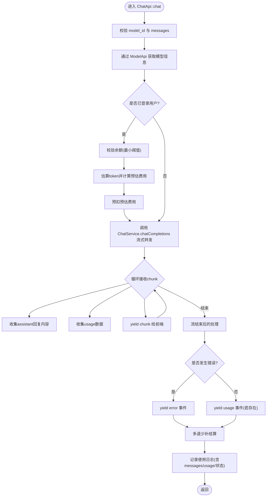
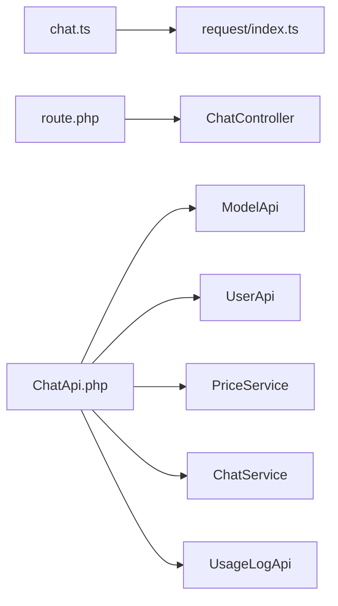

# 聊天接口

<cite>
**本文引用的文件**   
- [frontend/src/api/chat.ts](file://frontend/src/api/chat.ts)
- [frontend/src/utils/request/index.ts](file://frontend/src/utils/request/index.ts)
- [server/plugin/xbAiModelAgent/config/route.php](file://server/plugin/xbAiModelAgent/config/route.php)
- [server/plugin/xbAiModelAgent/api/ChatApi.php](file://server/plugin/xbAiModelAgent/api/ChatApi.php)
</cite>

## 目录
1. [简介](#简介)
2. [项目结构](#项目结构)
3. [核心组件](#核心组件)
4. [架构总览](#架构总览)
5. [详细组件分析](#详细组件分析)
6. [依赖分析](#依赖分析)
7. [性能考虑](#性能考虑)
8. [故障排查指南](#故障排查指南)
9. [结论](#结论)

## 简介
本文件面向“聊天接口”的前后端实现，聚焦于文本聊天的流式（SSE）调用链路：前端发起 SSE POST 请求，服务端路由到插件控制器，再由 API 层进行参数校验、模型获取、余额预扣、流式转发与用量结算，最终将增量内容逐块推送给前端。文档同时给出关键数据结构、时序图、流程图以及常见问题定位方法。

## 项目结构
围绕聊天接口的关键代码分布如下：
- 前端
  - 聊天 API 封装：定义消息与参数类型，并提供 ssePost 的便捷调用入口
  - 通用请求客户端：封装 Axios 实例、拦截器与 SSE 流式解析逻辑
- 后端（Webman + 插件）
  - 插件路由：注册 /api/chat/completions 为聊天接口
  - 聊天 API：负责参数校验、模型查询、余额预扣、流式转发、用量统计与多退少补结算

图示来源
- [frontend/src/api/chat.ts:1-60](file://frontend/src/api/chat.ts#L1-L60)
- [frontend/src/utils/request/index.ts:123-227](file://frontend/src/utils/request/index.ts#L123-L227)
- [server/plugin/xbAiModelAgent/config/route.php:1-13](file://server/plugin/xbAiModelAgent/config/route.php#L1-L13)
- [server/plugin/xbAiModelAgent/api/ChatApi.php:55-175](file://server/plugin/xbAiModelAgent/api/ChatApi.php#L55-L175)

章节来源
- [frontend/src/api/chat.ts:1-60](file://frontend/src/api/chat.ts#L1-L60)
- [frontend/src/utils/request/index.ts:123-227](file://frontend/src/utils/request/index.ts#L123-L227)
- [server/plugin/xbAiModelAgent/config/route.php:1-13](file://server/plugin/xbAiModelAgent/config/route.php#L1-L13)
- [server/plugin/xbAiModelAgent/api/ChatApi.php:55-175](file://server/plugin/xbAiModelAgent/api/ChatApi.php#L55-L175)

## 核心组件
- 前端聊天 API 封装
  - 定义对话消息与聊天参数类型，提供 chat(params, onChunk, signal?) 便捷方法，内部通过 request.ssePost 发起 SSE 请求
- 前端请求客户端
  - RequestClient 统一封装 GET/POST/PUT/DELETE/上传/SSE
  - ssePost 基于 XMLHttpRequest 实现 text/event-stream 解析，支持 AbortSignal 取消、白名单鉴权、自动附加 Authorization
- 后端路由
  - 在插件配置中注册 POST /api/chat/completions 指向 ChatController.chat
- 后端聊天 API
  - ChatApi::chat 完成参数校验、模型查找、余额预扣、透传可选参数、流式转发、usage 聚合与错误事件回推，并在结束后执行多退少补结算与使用日志记录

章节来源
- [frontend/src/api/chat.ts:1-60](file://frontend/src/api/chat.ts#L1-L60)
- [frontend/src/utils/request/index.ts:32-237](file://frontend/src/utils/request/index.ts#L32-L237)
- [server/plugin/xbAiModelAgent/config/route.php:1-13](file://server/plugin/xbAiModelAgent/config/route.php#L1-L13)
- [server/plugin/xbAiModelAgent/api/ChatApi.php:55-175](file://server/plugin/xbAiModelAgent/api/ChatApi.php#L55-L175)

## 架构总览
下图展示了从前端到后端的完整调用链路与数据流向，包括鉴权、预扣费、流式传输与结算。

图示来源
- [frontend/src/api/chat.ts:47-59](file://frontend/src/api/chat.ts#L47-L59)
- [frontend/src/utils/request/index.ts:132-227](file://frontend/src/utils/request/index.ts#L132-L227)
- [server/plugin/xbAiModelAgent/config/route.php:8-10](file://server/plugin/xbAiModelAgent/config/route.php#L8-L10)
- [server/plugin/xbAiModelAgent/api/ChatApi.php:55-175](file://server/plugin/xbAiModelAgent/api/ChatApi.php#L55-L175)

## 详细组件分析

### 前端聊天 API（chat.ts）
- 职责
  - 定义 ChatMessage 与 ChatParams 类型，约束 role/content 与模型参数
  - 暴露 chat(params, onChunk, signal?) 方法，内部委托 request.ssePost 发起 SSE 请求
- 关键点
  - 参数透传：temperature、top_p、n、max_tokens、stop、penalty、tools、tool_choice、response_format、seed、reasoning_effort 等
  - 回调驱动：onChunk 接收增量文本片段，便于即时渲染
  - 可取消：支持 AbortSignal 中断长连接

章节来源
- [frontend/src/api/chat.ts:1-60](file://frontend/src/api/chat.ts#L1-L60)

### 前端请求客户端（request/index.ts）
- 职责
  - 统一封装 HTTP 方法与拦截器
  - 提供 ssePost 实现 text/event-stream 的逐行解析与 JSON 提取
- 关键点
  - 鉴权：非白名单接口必须携带 Authorization Bearer Token
  - 解析策略：按换行拆分，过滤空行与注释行，识别 data: 前缀，兼容多种字段路径以提取 content
  - 终止条件：遇到 [DONE] 或 onload 结束，resolve 完成
  - 错误处理：网络错误、超时、中止均 reject 并附带明确信息

图示来源
- [frontend/src/utils/request/index.ts:132-227](file://frontend/src/utils/request/index.ts#L132-L227)

章节来源
- [frontend/src/utils/request/index.ts:32-237](file://frontend/src/utils/request/index.ts#L32-L237)

### 后端路由（route.php）
- 职责
  - 在插件命名空间下注册 RESTful 路由
- 关键点
  - POST /api/chat/completions 映射到 ChatController.chat
  - 媒体相关接口也在此处集中注册

章节来源
- [server/plugin/xbAiModelAgent/config/route.php:1-13](file://server/plugin/xbAiModelAgent/config/route.php#L1-L13)

### 后端聊天 API（ChatApi.php）
- 职责
  - 处理聊天请求：参数校验、模型获取、余额预扣、流式转发、usage 聚合、错误事件回推、多退少补结算与使用日志记录
- 关键流程
  - 参数校验：model_id 与 messages 必填
  - 模型获取：通过 ModelApi 查询模型配置
  - 余额校验与预扣：已登录用户先校验最低余额，再基于估算 token 计算预估费用并预扣
  - 流式转发：调用 ChatService.chatCompletions，逐块 yield；收集 assistant 内容与 usage
  - 错误处理：捕获异常并以 error 事件形式回推
  - 结算与日志：根据实际 usage 计算成本与销售金额，执行多退少补，写入 UsageLog

图示来源
- [server/plugin/xbAiModelAgent/api/ChatApi.php:55-175](file://server/plugin/xbAiModelAgent/api/ChatApi.php#L55-L175)
- [server/plugin/xbAiModelAgent/api/ChatApi.php:191-285](file://server/plugin/xbAiModelAgent/api/ChatApi.php#L191-L285)

章节来源
- [server/plugin/xbAiModelAgent/api/ChatApi.php:55-175](file://server/plugin/xbAiModelAgent/api/ChatApi.php#L55-L175)
- [server/plugin/xbAiModelAgent/api/ChatApi.php:191-285](file://server/plugin/xbAiModelAgent/api/ChatApi.php#L191-L285)

## 依赖分析
- 前端依赖
  - chat.ts 依赖 request/index.ts 提供的 ssePost
  - request/index.ts 依赖 axios 与浏览器原生 XMLHttpRequest
- 后端依赖
  - route.php 依赖 Webman Route 与 ChatController
  - ChatApi.php 依赖 ModelApi、UserApi、PriceService、ChatService、UsageLogApi 等

图示来源
- [frontend/src/api/chat.ts:1-60](file://frontend/src/api/chat.ts#L1-L60)
- [frontend/src/utils/request/index.ts:1-237](file://frontend/src/utils/request/index.ts#L1-L237)
- [server/plugin/xbAiModelAgent/config/route.php:1-13](file://server/plugin/xbAiModelAgent/config/route.php#L1-L13)
- [server/plugin/xbAiModelAgent/api/ChatApi.php:55-175](file://server/plugin/xbAiModelAgent/api/ChatApi.php#L55-L175)

章节来源
- [frontend/src/api/chat.ts:1-60](file://frontend/src/api/chat.ts#L1-L60)
- [frontend/src/utils/request/index.ts:1-237](file://frontend/src/utils/request/index.ts#L1-L237)
- [server/plugin/xbAiModelAgent/config/route.php:1-13](file://server/plugin/xbAiModelAgent/config/route.php#L1-L13)
- [server/plugin/xbAiModelAgent/api/ChatApi.php:55-175](file://server/plugin/xbAiModelAgent/api/ChatApi.php#L55-L175)

## 性能考虑
- 流式传输
  - 前端采用逐行解析与增量回调，避免等待完整响应，提升首字时延
  - 后端使用 Generator 逐块 yield，降低内存占用与延迟
- 预扣与结算
  - 基于估算 token 预扣费用，减少后续结算复杂度；最终按实际 usage 多退少补
- 网络与并发
  - 建议合理设置前端超时与重试策略；对大模型长文本生成场景，注意前端渲染节流与防抖
- 资源与缓存
  - 模型配置与价格策略应缓存以减少重复查询开销（由上层服务保证）

[本节为通用指导，不直接分析具体文件]

## 故障排查指南
- 前端侧
  - 未登录或非白名单接口：会直接拒绝并提示重新登录
  - SSE 解析失败：检查后端返回格式是否符合 data: JSON 行，确认 content 字段路径兼容性
  - 请求被取消：AbortSignal 触发后会立即 reject，需在前端处理取消态 UI
- 后端侧
  - 参数缺失：model_id 或 messages 为空将抛出运行时异常
  - 模型不存在：根据 model_id 查不到模型将报错
  - 余额不足：预扣前校验失败将抛出余额不足异常
  - 流式异常：捕获异常后以 error 事件回推，并记录错误信息
  - 结算失败：多退少补过程中出现异常会被合并进错误信息，但不影响主流程结束

章节来源
- [frontend/src/utils/request/index.ts:132-227](file://frontend/src/utils/request/index.ts#L132-L227)
- [server/plugin/xbAiModelAgent/api/ChatApi.php:55-175](file://server/plugin/xbAiModelAgent/api/ChatApi.php#L55-L175)
- [server/plugin/xbAiModelAgent/api/ChatApi.php:191-285](file://server/plugin/xbAiModelAgent/api/ChatApi.php#L191-L285)

## 结论
该聊天接口实现了前后端协同的流式文本对话能力：前端通过统一的请求客户端解析 SSE 增量内容，后端在插件体系内完成参数校验、模型选择、余额预扣、流式转发与用量结算。整体设计清晰、可扩展性强，适合在多模型、多租户与计费场景下持续演进。