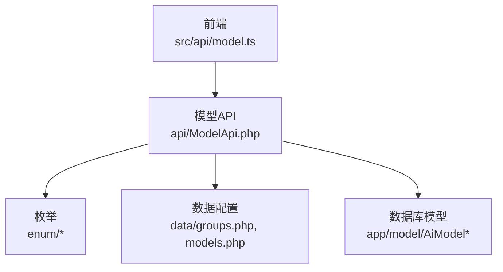
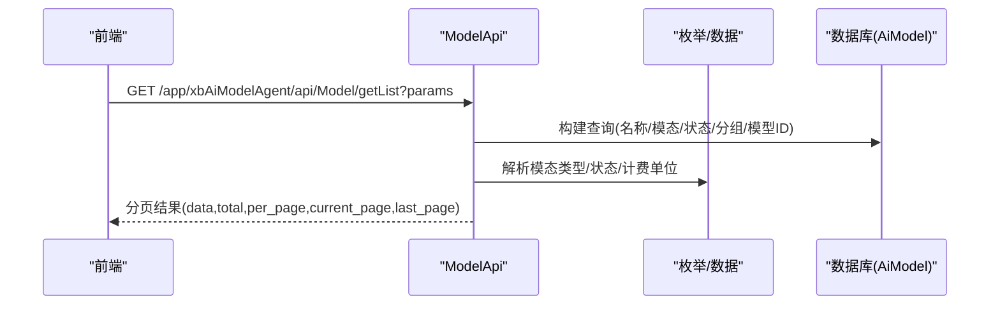
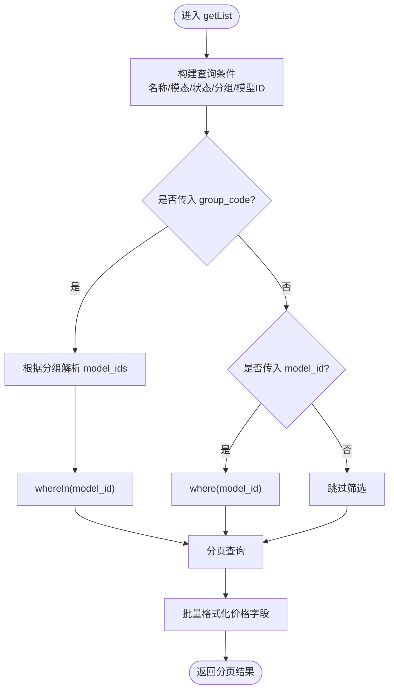
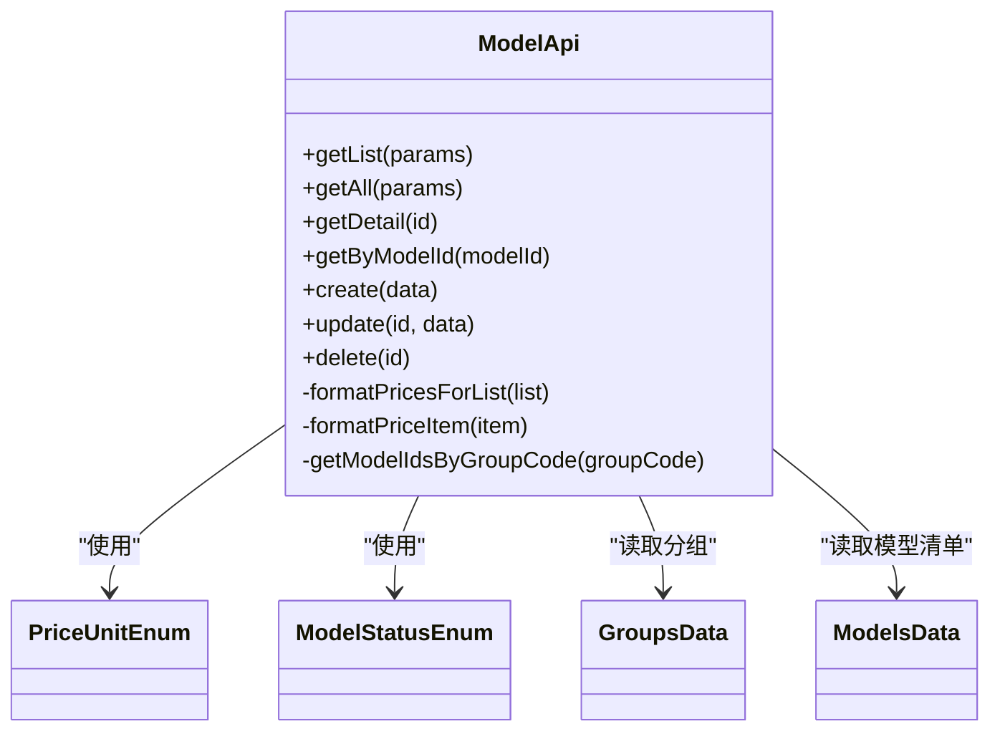

# 模型管理接口

<cite>
**本文引用的文件**   
- [ModelApi.php](file://server/plugin\xbAiModelAgent\api\ModelApi.php)
- [route.php](file://server/plugin\xbAiModelAgent\config\route.php)
- [ModelStatusEnum.php](file://server/plugin\xbAiModelAgent\enum\ModelStatusEnum.php)
- [PriceUnitEnum.php](file://server/plugin\xbAiModelAgent\enum\PriceUnitEnum.php)
- [groups.php](file://server/plugin\xbAiModelAgent\data\groups.php)
- [models.php](file://server/plugin\xbAiModelAgent\data\models.php)
- [model.ts](file://frontend\src\api\model.ts)
- [modelEnum.ts](file://frontend\src\api\modelEnum.ts)
</cite>

## 目录
1. [简介](#简介)
2. [项目结构](#项目结构)
3. [核心组件](#核心组件)
4. [架构总览](#架构总览)
5. [详细组件分析](#详细组件分析)
6. [依赖关系分析](#依赖关系分析)
7. [性能与扩展性](#性能与扩展性)
8. [故障排查指南](#故障排查指南)
9. [结论](#结论)
10. [附录：接口定义与示例](#附录接口定义与示例)

## 简介
本文件为“AI模型管理”功能的API接口文档，聚焦于模型列表查询、分页获取、筛选过滤等基础管理能力。文档同时说明模型信息结构、价格配置体系、状态管理等核心概念，并给出分组、标签系统、排序规则的配置方法，以及完整的请求/响应示例与错误处理说明。

## 项目结构
- 后端服务位于 server 插件 xbAiModelAgent 下，提供模型管理的 API 能力，包括列表、分页、详情、创建、更新、删除等。
- 前端通过 src/api/model.ts 调用后端接口，封装了“全部模型列表”和“分页模型列表”两个常用方法。
- 枚举与数据字典由 enum 与 data 目录维护，包含模型状态、计费单位、分组映射与模型清单等。

图表来源
- [ModelApi.php:49-108](file://server/plugin\xbAiModelAgent\api\ModelApi.php#L49-L108)
- [route.php:1-13](file://server/plugin\xbAiModelAgent\config\route.php#L1-L13)
- [model.ts:96-105](file://frontend\src\api\model.ts#L96-L105)

章节来源
- [ModelApi.php:49-108](file://server/plugin\xbAiModelAgent\api\ModelApi.php#L49-L108)
- [model.ts:96-105](file://frontend\src\api\model.ts#L96-L105)

## 核心组件
- 模型列表与分页：支持按名称、模态类型、状态、分组编码、第三方模型ID进行筛选，返回分页结果并附带格式化后的价格字段。
- 全部模型列表：仅返回启用状态的模型，支持按分组或第三方模型ID筛选。
- 模型详情：支持按主键ID或第三方模型ID获取详情，并返回格式化后的价格信息。
- 模型增删改：提供创建、更新、删除接口，并在关键生命周期触发事件。

章节来源
- [ModelApi.php:49-108](file://server/plugin\xbAiModelAgent\api\ModelApi.php#L49-L108)
- [ModelApi.php:166-181](file://server/plugin\xbAiModelAgent\api\ModelApi.php#L166-L181)
- [ModelApi.php:207-272](file://server/plugin\xbAiModelAgent\api\ModelApi.php#L207-L272)

## 架构总览
下图展示了从前端到后端的调用链路，以及后端对枚举与数据配置的依赖关系。

图表来源
- [ModelApi.php:49-83](file://server/plugin\xbAiModelAgent\api\ModelApi.php#L49-L83)
- [route.php:1-13](file://server/plugin\xbAiModelAgent\config\route.php#L1-L13)

## 详细组件分析

### 接口一：获取模型分页列表
- 功能：分页获取模型列表，支持多条件筛选，返回统一的分页结构与格式化后的价格字段。
- 路由：GET /app/xbAiModelAgent/api/Model/getList
- 请求参数（Query）
  - name: string | 可选，模糊匹配模型名称
  - modality: string | 可选，模态类型编码
  - status: string | 可选，状态编码
  - group_code: string | 可选，分组编码（如 text/image/video/watermark）
  - model_id: string | 可选，第三方模型标识
  - page: number | 可选，当前页码
  - limit: number | 可选，每页数量
- 响应体
  - total: number
  - per_page: number
  - current_page: number
  - last_page: number
  - data: ModelItem[]
- 模型项字段（节选）
  - id: number
  - name: string
  - model_id: string
  - modality: string
  - modality_type: string（由模态枚举推导）
  - status: string
  - icon: string
  - tags: string
  - sort: number
  - description: string
  - cost_prices: array（上游原始价格配置）
  - sale_prices: array（销售价配置，成本价×全局倍率）
  - price_rate: number（全局价格倍率）
  - prices_format: string（格式化后的价格文本）
  - create_at: string
  - update_at: string
  - badge?: string
  - badge_type?: string

图表来源
- [ModelApi.php:49-83](file://server/plugin\xbAiModelAgent\api\ModelApi.php#L49-L83)
- [ModelApi.php:116-124](file://server/plugin\xbAiModelAgent\api\ModelApi.php#L116-L124)
- [ModelApi.php:132-140](file://server/plugin\xbAiModelAgent\api\ModelApi.php#L132-L140)

章节来源
- [ModelApi.php:49-83](file://server/plugin\xbAiModelAgent\api\ModelApi.php#L49-L83)
- [ModelApi.php:116-124](file://server/plugin\xbAiModelAgent\api\ModelApi.php#L116-L124)
- [ModelApi.php:132-140](file://server/plugin\xbAiModelAgent\api\ModelApi.php#L132-L140)

### 接口二：获取全部模型列表
- 功能：仅返回启用状态的模型，适合下拉选择等场景。
- 路由：GET /app/xbAiModelAgent/api/Model/index
- 请求参数（Query）
  - group_code: string | 可选
  - model_id: string | 可选
- 响应体：ModelItem[]

章节来源
- [ModelApi.php:90-108](file://server/plugin\xbAiModelAgent\api\ModelApi.php#L90-L108)
- [model.ts:96-98](file://frontend\src\api\model.ts#L96-L98)

### 接口三：获取模型详情
- 功能：根据主键ID或第三方模型ID获取单个模型的详细信息，并返回格式化后的价格字段。
- 路由：GET /app/xbAiModelAgent/api/Model/detail?id={id} 或 GET /app/xbAiModelAgent/api/Model/by-model-id?model_id={model_id}
- 响应体：ModelItem

章节来源
- [ModelApi.php:166-181](file://server/plugin\xbAiModelAgent\api\ModelApi.php#L166-L181)

### 接口四：创建模型
- 功能：新增一个模型，在创建前后触发事件。
- 路由：POST /app/xbAiModelAgent/api/Model/create
- 请求体：参考 ModelItem 字段（不含只读字段）
- 响应体：ModelItem

章节来源
- [ModelApi.php:207-221](file://server/plugin\xbAiModelAgent\api\ModelApi.php#L207-L221)

### 接口五：更新模型
- 功能：更新指定ID的模型，在更新前后触发事件。
- 路由：POST /app/xbAiModelAgent/api/Model/update
- 请求体：{ id: number, ...fields }
- 响应体：ModelItem

章节来源
- [ModelApi.php:229-247](file://server/plugin\xbAiModelAgent\api\ModelApi.php#L229-L247)

### 接口六：删除模型
- 功能：删除指定ID的模型，在删除前后触发事件。
- 路由：POST /app/xbAiModelAgent/api/Model/delete
- 请求体：{ id: number }
- 响应体：boolean

章节来源
- [ModelApi.php:254-272](file://server/plugin\xbAiModelAgent\api\ModelApi.php#L254-L272)

### 模型信息结构
- 基本信息：name、model_id、modality、status、icon、tags、sort、description、create_at、update_at
- 价格相关：cost_prices（上游原始）、sale_prices（销售价）、price_rate（全局倍率）、prices_format（格式化文本）
- 展示增强：badge、badge_type
- 模态类型：modality_type 由模态枚举推导得到

章节来源
- [ModelApi.php:188-200](file://server/plugin\xbAiModelAgent\api\ModelApi.php#L188-L200)
- [model.ts:39-76](file://frontend\src\api\model.ts#L39-L76)

### 价格配置体系
- 计费单位枚举（部分）
  - Token（10）
  - 每张（20）
  - 尺寸（30）
  - 每秒视频（40）
  - 按视频尺寸（50）
  - 规格（60）
  - 区间（70）
- 价格计算
  - cost_prices：上游原始价格配置
  - sale_prices：基于全局倍率计算的销售价
  - prices_format：将 sale_prices 格式化为可读文本
- 价格数据结构
  - 支持按 Token、按张、按尺寸、按时长、按规格、按区间等多种计费方式
  - 可配置最小/最大价格范围、图片限制、视频质量等

章节来源
- [PriceUnitEnum.php:19-60](file://server/plugin\xbAiModelAgent\enum\PriceUnitEnum.php#L19-L60)
- [ModelApi.php:188-200](file://server/plugin\xbAiModelAgent\api\ModelApi.php#L188-L200)
- [models.php:1-800](file://server/plugin\xbAiModelAgent\data\models.php#L1-L800)

### 状态管理
- 状态枚举
  - 下架（10）
  - 正常（20）
- 列表与全部接口默认仅返回启用状态（20）的模型

章节来源
- [ModelStatusEnum.php:19-38](file://server/plugin\xbAiModelAgent\enum\ModelStatusEnum.php#L19-L38)
- [ModelApi.php:90-108](file://server/plugin\xbAiModelAgent\api\ModelApi.php#L90-L108)

### 模型分组与标签
- 分组配置
  - 分组编码：text、image、video、watermark
  - 每个分组包含一组 model_ids
- 标签系统
  - 模型项中的 tags 字段用于标注（如“高质量”），便于前端展示与筛选
- 排序规则
  - sort 字段控制排序顺序，越小越靠前；列表默认按 sort asc、id desc 排序

章节来源
- [groups.php:1-83](file://server/plugin\xbAiModelAgent\data\groups.php#L1-L83)
- [models.php:1-800](file://server/plugin\xbAiModelAgent\data\models.php#L1-L800)
- [ModelApi.php:51-51](file://server/plugin\xbAiModelAgent\api\ModelApi.php#L51-L51)

### 枚举接口（可选）
- 功能：获取模型相关枚举（如模态、图像尺寸、视频尺寸、比例等）
- 路由：GET /app/xbAiModelAgent/api/ModelEnum/index
- 请求参数：name（可选，指定枚举名称）
- 响应体：Record<string, ModelEnumItem[]>

章节来源
- [modelEnum.ts:40-42](file://frontend\src\api\modelEnum.ts#L40-L42)

## 依赖关系分析
- 控制器层：ModelApi 负责业务逻辑与数据组装
- 枚举层：ModelStatusEnum、PriceUnitEnum 提供状态与计费单位定义
- 数据层：groups.php 与 models.php 提供分组与模型清单
- 前端层：model.ts 封装了两个常用接口调用

图表来源
- [ModelApi.php:49-272](file://server/plugin\xbAiModelAgent\api\ModelApi.php#L49-L272)
- [PriceUnitEnum.php:19-60](file://server/plugin\xbAiModelAgent\enum\PriceUnitEnum.php#L19-L60)
- [ModelStatusEnum.php:19-38](file://server/plugin\xbAiModelAgent\enum\ModelStatusEnum.php#L19-L38)
- [groups.php:1-83](file://server/plugin\xbAiModelAgent\data\groups.php#L1-L83)
- [models.php:1-800](file://server/plugin\xbAiModelAgent\data\models.php#L1-L800)

章节来源
- [ModelApi.php:49-272](file://server/plugin\xbAiModelAgent\api\ModelApi.php#L49-L272)

## 性能与扩展性
- 分页查询：getList 使用分页器，避免一次性加载大量数据
- 筛选优化：group_code 会先解析出 model_ids 再 inWhere，减少无效扫描
- 价格格式化：批量 formatPricesForList 提升渲染效率
- 扩展点：创建/更新/删除均触发事件，可在监听器中实现缓存刷新、审计日志等

[本节为通用指导，不直接分析具体文件]

## 故障排查指南
- 常见错误
  - 参数缺失或类型错误：检查 query 参数是否符合要求
  - 分组不存在：group_code 对应的分组为空时，列表返回空数据
  - 模型未启用：全部列表接口仅返回启用状态（20）的模型
- 定位建议
  - 确认路由是否正确注册
  - 检查分组与模型清单配置是否完整
  - 查看价格配置是否合法（单位、范围等）

章节来源
- [ModelApi.php:68-78](file://server/plugin\xbAiModelAgent\api\ModelApi.php#L68-L78)
- [ModelApi.php:90-108](file://server/plugin\xbAiModelAgent\api\ModelApi.php#L90-L108)
- [route.php:1-13](file://server/plugin\xbAiModelAgent\config\route.php#L1-L13)

## 结论
模型管理接口提供了完善的列表、分页、筛选、详情与增删改能力，配合枚举与数据配置实现了灵活的价格体系与分组管理。前端通过简洁的封装即可快速集成，满足常见的模型管理与展示需求。

[本节为总结，不直接分析具体文件]

## 附录：接口定义与示例

### 接口一：获取模型分页列表
- 方法：GET
- 路径：/app/xbAiModelAgent/api/Model/getList
- 请求示例
  - ?name=万象&modality=20&status=20&group_code=image&page=1&limit=10
- 响应示例
  - {
      "total": 120,
      "per_page": 10,
      "current_page": 1,
      "last_page": 12,
      "data": [
        {
          "id": 1,
          "name": "万象-Wan2.7-Image",
          "model_id": "wan2.7-image",
          "modality": "20",
          "modality_type": "image",
          "status": "20",
          "icon": "Bailian",
          "tags": "",
          "sort": 0,
          "description": "万相标准版...",
          "cost_prices": [...],
          "sale_prices": [...],
          "price_rate": 1.0,
          "prices_format": "...",
          "create_at": "2024-01-01 00:00:00",
          "update_at": "2024-01-01 00:00:00",
          "badge": "",
          "badge_type": ""
        }
      ]
    }

章节来源
- [ModelApi.php:49-83](file://server/plugin\xbAiModelAgent\api\ModelApi.php#L49-L83)
- [model.ts:103-105](file://frontend\src\api\model.ts#L103-L105)

### 接口二：获取全部模型列表
- 方法：GET
- 路径：/app/xbAiModelAgent/api/Model/index
- 请求示例
  - ?group_code=text
- 响应示例
  - [
      {
        "id": 1,
        "name": "gpt-5.5",
        "model_id": "gpt-5.5",
        "modality": "10",
        "modality_type": "text",
        "status": "20",
        "icon": "OpenAI",
        "tags": "",
        "sort": 0,
        "description": "...",
        "cost_prices": [...],
        "sale_prices": [...],
        "price_rate": 1.0,
        "prices_format": "...",
        "create_at": "...",
        "update_at": "...",
        "badge": "",
        "badge_type": ""
      }
    ]

章节来源
- [ModelApi.php:90-108](file://server/plugin\xbAiModelAgent\api\ModelApi.php#L90-L108)
- [model.ts:96-98](file://frontend\src\api\model.ts#L96-L98)

### 接口三：获取模型详情
- 方法：GET
- 路径：/app/xbAiModelAgent/api/Model/detail?id={id} 或 /app/xbAiModelAgent/api/Model/by-model-id?model_id={model_id}
- 响应示例：同 ModelItem

章节来源
- [ModelApi.php:166-181](file://server/plugin\xbAiModelAgent\api\ModelApi.php#L166-L181)

### 接口四：创建模型
- 方法：POST
- 路径：/app/xbAiModelAgent/api/Model/create
- 请求示例
  - {
      "name": "新模型",
      "model_id": "new-model",
      "modality": "20",
      "status": "20",
      "icon": "Custom",
      "tags": "测试",
      "sort": 0,
      "description": "描述",
      "prices": [...]
    }
- 响应示例：ModelItem

章节来源
- [ModelApi.php:207-221](file://server/plugin\xbAiModelAgent\api\ModelApi.php#L207-L221)

### 接口五：更新模型
- 方法：POST
- 路径：/app/xbAiModelAgent/api/Model/update
- 请求示例
  - { "id": 1, "name": "更新名称", "status": "10" }
- 响应示例：ModelItem

章节来源
- [ModelApi.php:229-247](file://server/plugin\xbAiModelAgent\api\ModelApi.php#L229-L247)

### 接口六：删除模型
- 方法：POST
- 路径：/app/xbAiModelAgent/api/Model/delete
- 请求示例
  - { "id": 1 }
- 响应示例：true/false

章节来源
- [ModelApi.php:254-272](file://server/plugin\xbAiModelAgent\api\ModelApi.php#L254-L272)