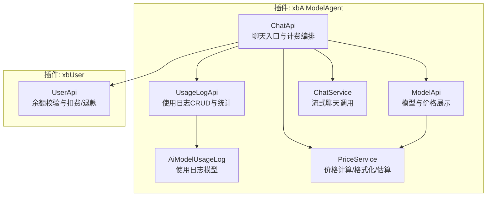
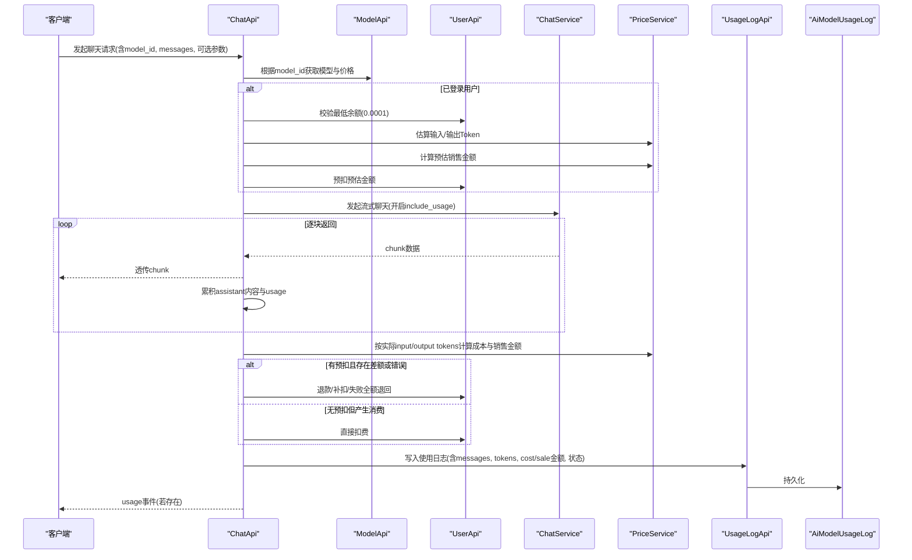
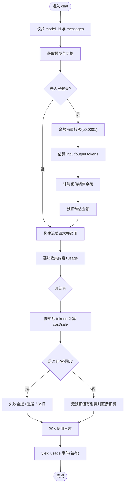
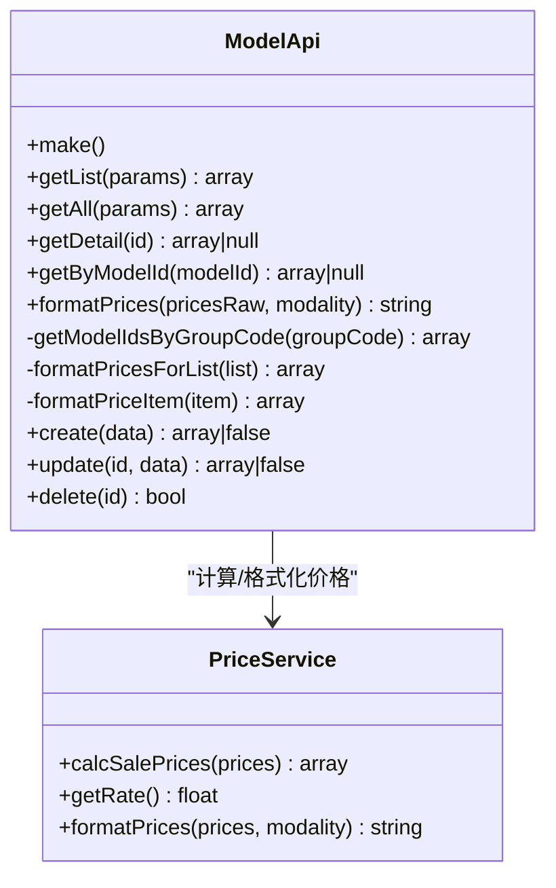
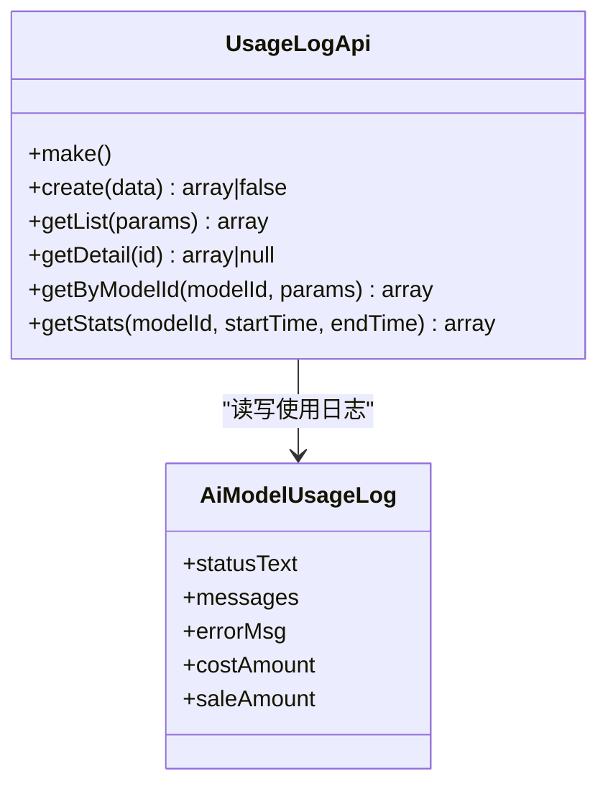
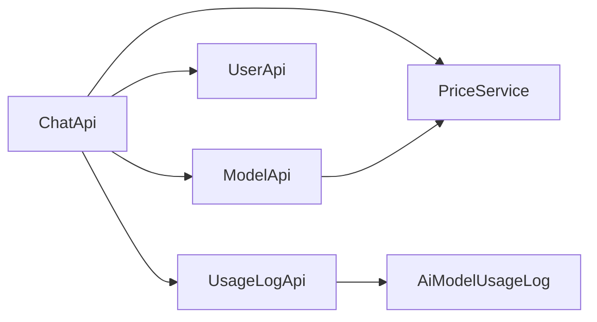

# 用量计费接口

<cite>
**本文引用的文件**   
- [UsageLogApi.php](file://server/plugin/xbAiModelAgent/api/UsageLogApi.php)
- [ModelApi.php](file://server/plugin/xbAiModelAgent/api/ModelApi.php)
- [ChatApi.php](file://server/plugin/xbAiModelAgent/api/ChatApi.php)
- [AiModelUsageLog.php](file://server/plugin/xbAiModelAgent/app/model/AiModelUsageLog.php)
- [PriceService.php](file://server/plugin/xbAiModelAgent/service/xbservice/PriceService.php)
- [UserApi.php](file://server/plugin/xbUser/api/UserApi.php)
</cite>

## 目录
1. [简介](#简介)
2. [项目结构](#项目结构)
3. [核心组件](#核心组件)
4. [架构总览](#架构总览)
5. [详细组件分析](#详细组件分析)
6. [依赖关系分析](#依赖关系分析)
7. [性能与成本优化建议](#性能与成本优化建议)
8. [故障排查指南](#故障排查指南)
9. [结论](#结论)
10. [附录：API 定义与计费规则](#附录api-定义与计费规则)

## 简介
本文件面向“AI模型用量统计与计费系统”的开发者与运营人员，系统化梳理并文档化以下能力：
- 用量查询、费用计算、账单生成（基于使用日志聚合）、余额管理（预扣与多退少补）
- 不同模态类型的计费规则、价格倍率设置、折扣优惠等计费逻辑
- 实时计费（流式聊天场景）、批量结算（按时间范围汇总）、对账报表（按模型/用户维度统计）
- 成本优化建议与计费异常处理方法

说明：
- 当前仓库已实现文本聊天（chat）场景的实时计费与用量记录；其他模态（如图像、视频）的计费扩展点已在模型与价格服务层预留。
- 所有接口与流程均以源码为依据进行描述，未出现的功能在本文件中不虚构。

## 项目结构
围绕“用量计费”的核心代码位于 server/plugin/xbAiModelAgent 插件下，关键文件如下：
- API 层：UsageLogApi、ModelApi、ChatApi
- 模型层：AiModelUsageLog
- 服务层：PriceService（价格计算与格式化）、ChatService（流式聊天调用）
- 用户资产：UserApi（余额校验与变动）

图表来源
- [ChatApi.php:1-287](file://server/plugin/xbAiModelAgent/api/ChatApi.php#L1-L287)
- [ModelApi.php:1-274](file://server/plugin/xbAiModelAgent/api/ModelApi.php#L1-L274)
- [UsageLogApi.php:1-153](file://server/plugin/xbAiModelAgent/api/UsageLogApi.php#L1-L153)
- [AiModelUsageLog.php:1-111](file://server/plugin/xbAiModelAgent/app/model/AiModelUsageLog.php#L1-L111)
- [PriceService.php](file://server/plugin/xbAiModelAgent/service/xbservice/PriceService.php)
- [UserApi.php](file://server/plugin/xbUser/api/UserApi.php)

章节来源
- [ChatApi.php:1-287](file://server/plugin/xbAiModelAgent/api/ChatApi.php#L1-L287)
- [ModelApi.php:1-274](file://server/plugin/xbAiModelAgent/api/ModelApi.php#L1-L274)
- [UsageLogApi.php:1-153](file://server/plugin/xbAiModelAgent/api/UsageLogApi.php#L1-L153)
- [AiModelUsageLog.php:1-111](file://server/plugin/xbAiModelAgent/app/model/AiModelUsageLog.php#L1-L111)

## 核心组件
- ChatApi：提供聊天流式接口，负责参数校验、模型获取、余额预扣、流式调用、usage 收集、多退少补结算与使用日志落库。
- ModelApi：提供模型列表/详情、分组筛选、价格字段格式化（成本价、销售价、倍率、展示文本）。
- UsageLogApi：提供使用日志的创建、分页查询、按条件筛选、按模型ID查询、以及成功记录的聚合统计。
- AiModelUsageLog：使用日志模型，包含状态、消息、金额等字段的存取器与格式化。
- PriceService：价格计算与格式化、Token 估算、倍率与折扣处理（具体算法在类内实现）。
- UserApi：用户资产操作，包括余额校验与增减（充值/扣费/退款）。

章节来源
- [ChatApi.php:1-287](file://server/plugin/xbAiModelAgent/api/ChatApi.php#L1-L287)
- [ModelApi.php:1-274](file://server/plugin/xbAiModelAgent/api/ModelApi.php#L1-L274)
- [UsageLogApi.php:1-153](file://server/plugin/xbAiModelAgent/api/UsageLogApi.php#L1-L153)
- [AiModelUsageLog.php:1-111](file://server/plugin/xbAiModelAgent/app/model/AiModelUsageLog.php#L1-L111)
- [PriceService.php](file://server/plugin/xbAiModelAgent/service/xbservice/PriceService.php)
- [UserApi.php](file://server/plugin/xbUser/api/UserApi.php)

## 架构总览
聊天计费主流程（实时计费 + 多退少补）：

图表来源
- [ChatApi.php:55-287](file://server/plugin/xbAiModelAgent/api/ChatApi.php#L55-L287)
- [ModelApi.php:177-200](file://server/plugin/xbAiModelAgent/api/ModelApi.php#L177-L200)
- [PriceService.php](file://server/plugin/xbAiModelAgent/service/xbservice/PriceService.php)
- [UserApi.php](file://server/plugin/xbUser/api/UserApi.php)
- [UsageLogApi.php:45-98](file://server/plugin/xbAiModelAgent/api/UsageLogApi.php#L45-L98)
- [AiModelUsageLog.php:1-111](file://server/plugin/xbAiModelAgent/app/model/AiModelUsageLog.php#L1-L111)

## 详细组件分析

### 聊天计费接口（ChatApi）
- 职责
  - 参数校验与模型解析
  - 已登录用户的余额前置校验与预扣
  - 流式调用外部模型服务，收集 assistant 内容与 usage
  - 基于实际 usage 计算成本与销售金额，执行多退少补
  - 记录使用日志（含对话消息、tokens、金额、状态）
- 关键行为
  - 预扣策略：基于 max_tokens 或 max_completion_tokens 估算 Token，再按价格计算预估销售金额进行预扣
  - 多退少补：失败时全额退回预扣；实际小于预扣则退差；实际大于预扣则补扣；误差在 ±0.0001 以内忽略
  - 兼容旧逻辑：若无预扣但产生消费，则直接扣费
  - 日志落库：无论成功或失败均记录，失败时标记状态并附带错误信息

图表来源
- [ChatApi.php:55-287](file://server/plugin/xbAiModelAgent/api/ChatApi.php#L55-L287)

章节来源
- [ChatApi.php:55-287](file://server/plugin/xbAiModelAgent/api/ChatApi.php#L55-L287)

### 模型与价格接口（ModelApi）
- 职责
  - 模型列表/详情查询，支持名称搜索、模态类型筛选、状态筛选、分组/第三方模型ID筛选
  - 为每条模型追加 cost_prices、sale_prices、price_rate、prices_format 等字段
  - 提供价格格式化方法，供前端展示
- 关键行为
  - formatPricesForList：批量格式化价格字段，并补充 modality_type
  - formatPriceItem：单条模型的价格字段填充（成本价、销售价、倍率、展示文本）
  - getAll/getList：仅返回启用状态的模型（getAll），getList 支持分页

图表来源
- [ModelApi.php:49-200](file://server/plugin/xbAiModelAgent/api/ModelApi.php#L49-L200)
- [PriceService.php](file://server/plugin/xbAiModelAgent/service/xbservice/PriceService.php)

章节来源
- [ModelApi.php:49-200](file://server/plugin/xbAiModelAgent/api/ModelApi.php#L49-L200)

### 使用日志与统计接口（UsageLogApi）
- 职责
  - 创建使用日志记录
  - 分页查询与多维筛选（用户ID、模型ID、状态、时间范围）
  - 按模型ID查询
  - 获取模型使用统计（仅统计成功记录）
- 关键行为
  - getStats：聚合 total_count、total_input_tokens、total_output_tokens、total_tokens

图表来源
- [UsageLogApi.php:45-153](file://server/plugin/xbAiModelAgent/api/UsageLogApi.php#L45-L153)
- [AiModelUsageLog.php:1-111](file://server/plugin/xbAiModelAgent/app/model/AiModelUsageLog.php#L1-L111)

章节来源
- [UsageLogApi.php:45-153](file://server/plugin/xbAiModelAgent/api/UsageLogApi.php#L45-L153)
- [AiModelUsageLog.php:1-111](file://server/plugin/xbAiModelAgent/app/model/AiModelUsageLog.php#L1-L111)

### 价格服务（PriceService）
- 职责
  - 计算销售价与成本价
  - 获取价格倍率
  - 将价格对象格式化为可读文本
  - 估算聊天 input/output tokens
- 说明
  - 该服务被 ChatApi 与 ModelApi 共同使用，是计费与展示的核心

章节来源
- [PriceService.php](file://server/plugin/xbAiModelAgent/service/xbservice/PriceService.php)

### 用户资产（UserApi）
- 职责
  - 余额校验（最小阈值）
  - 余额变更（充值/扣费/退款）
- 说明
  - 在聊天计费中用于预扣、多退少补与直接扣费

章节来源
- [UserApi.php](file://server/plugin/xbUser/api/UserApi.php)

## 依赖关系分析
- ChatApi 强依赖 ModelApi（获取模型与价格）、PriceService（估算与计费）、UserApi（余额操作）、UsageLogApi（日志落库）
- ModelApi 依赖 PriceService 进行价格计算与格式化
- UsageLogApi 依赖 AiModelUsageLog 模型进行数据持久化
- 整体耦合度适中，职责清晰，便于扩展其他模态的计费逻辑

图表来源
- [ChatApi.php:1-287](file://server/plugin/xbAiModelAgent/api/ChatApi.php#L1-L287)
- [ModelApi.php:1-274](file://server/plugin/xbAiModelAgent/api/ModelApi.php#L1-L274)
- [UsageLogApi.php:1-153](file://server/plugin/xbAiModelAgent/api/UsageLogApi.php#L1-L153)
- [AiModelUsageLog.php:1-111](file://server/plugin/xbAiModelAgent/app/model/AiModelUsageLog.php#L1-L111)
- [PriceService.php](file://server/plugin/xbAiModelAgent/service/xbservice/PriceService.php)
- [UserApi.php](file://server/plugin/xbUser/api/UserApi.php)

## 性能与成本优化建议
- 合理设置 max_tokens/max_completion_tokens：避免过度预扣导致频繁退款，提升用户体验
- 控制流式 chunk 数量：减少网络往返与内存占用
- 批量结算与对账：
  - 使用 UsageLogApi.getStats 按模型/时间范围聚合成功记录，快速得到 token 总量与次数
  - 结合业务侧定时任务，按日/周/月生成账单与报表
- 缓存模型价格：ModelApi 返回的价格字段可缓存，降低重复计算
- 限流与熔断：对上游模型服务调用增加超时与重试策略，避免雪崩

[本节为通用指导，无需源码引用]

## 故障排查指南
- 常见错误
  - 模型不存在：检查 model_id 是否正确，确认模型处于启用状态
  - 余额不足：确认用户余额 ≥ 0.0001，或调整预扣策略
  - 预扣/退款失败：检查 UserApi 余额操作返回值与日志
  - 日志记录失败：不影响主流程，但会影响对账，需关注 UsageLogApi 写入结果
- 定位步骤
  - 查看 ChatApi 的 usage 事件与 error 事件
  - 通过 UsageLogApi.getList 按 uid/model_id/status/time 筛选，核对 cost_amount/sale_amount 与 status
  - 使用 UsageLogApi.getStats 验证聚合结果是否与财务预期一致

章节来源
- [ChatApi.php:167-287](file://server/plugin/xbAiModelAgent/api/ChatApi.php#L167-L287)
- [UsageLogApi.php:59-153](file://server/plugin/xbAiModelAgent/api/UsageLogApi.php#L59-L153)

## 结论
- 当前系统已实现文本聊天的实时计费与多退少补，具备完善的用量记录与基础统计能力
- 价格体系由 PriceService 统一管理，ModelApi 负责对外展示，UsageLogApi 提供审计与对账支撑
- 建议在后续版本中扩展其他模态（图像/视频）的计费与统计，并完善批量结算与对账报表能力

[本节为总结性内容，无需源码引用]

## 附录：API 定义与计费规则

### 聊天计费接口（ChatApi.chat）
- 功能：流式聊天，自动记录用量并结算
- 入参
  - model: string（必需）第三方模型标识
  - messages: array（必需）消息列表 [{role, content}]
  - temperature/top_p/n/max_tokens/max_completion_tokens/stop/presence_penalty/frequency_penalty/user/tools/tool_choice/response_format/seed/reasoning_effort: 可选
  - uid: int（默认0）用户ID
- 出参
  - Generator 流式返回 OpenAI 格式的 chunk
  - 流结束后可能 yield usage 事件：{type:"usage", usage:{input_tokens,output_tokens,total_tokens}}
- 计费逻辑
  - 预扣：基于 max_tokens 或 max_completion_tokens 估算 tokens，计算预估销售金额并预扣
  - 多退少补：失败全退；实际小于预扣退差；实际大于预扣补扣；±0.0001 以内忽略
  - 兼容旧逻辑：无预扣但有消费则直接扣费
- 参考路径
  - [ChatApi.php:55-287](file://server/plugin/xbAiModelAgent/api/ChatApi.php#L55-L287)

### 模型与价格接口（ModelApi）
- 功能：模型列表/详情、分组筛选、价格格式化
- 主要方法
  - getList(params): 分页列表，支持 name/modality/status/group_code/model_id/page/limit
  - getAll(params): 仅启用状态，支持 group_code/model_id
  - getDetail(id)/getByModelId(modelId): 详情
  - formatPrices(pricesRaw, modality): 价格文本格式化
- 返回增强字段
  - cost_prices、sale_prices、price_rate、prices_format、modality_type
- 参考路径
  - [ModelApi.php:49-200](file://server/plugin/xbAiModelAgent/api/ModelApi.php#L49-L200)

### 使用日志与统计接口（UsageLogApi）
- 功能：使用日志 CRUD 与统计
- 主要方法
  - create(data): 创建日志
  - getList(params): 分页查询，支持 uid/model_id/status/start_time/end_time
  - getDetail(id): 详情
  - getByModelId(modelId, params): 按模型ID查询
  - getStats(modelId, startTime, endTime): 聚合统计（仅成功记录）
- 统计字段
  - total_count、total_input_tokens、total_output_tokens、total_tokens
- 参考路径
  - [UsageLogApi.php:45-153](file://server/plugin/xbAiModelAgent/api/UsageLogApi.php#L45-L153)

### 价格服务（PriceService）
- 功能：价格计算与格式化、Token 估算
- 关键方法
  - calcSalePrices(prices): 计算销售价
  - getRate(): 获取价格倍率
  - formatPrices(prices, modality): 格式化展示文本
  - estimateChatTokens(messages, maxTokens): 估算 input/output tokens
  - calcChatCost(prices, inputTokens, outputTokens): 计算 cost/sale 金额
- 参考路径
  - [PriceService.php](file://server/plugin/xbAiModelAgent/service/xbservice/PriceService.php)

### 用户资产（UserApi）
- 功能：余额校验与变动
- 关键方法
  - verifyUserAsset(uid, assetType, amount): 校验余额
  - balance(uid, type, amount, remark): 余额变动（充值/扣费/退款）
- 参考路径
  - [UserApi.php](file://server/plugin/xbUser/api/UserApi.php)

### 计费规则与模态类型
- 模态类型
  - 文本聊天：ModalityEnum.CHAT
  - 其他模态（图像/视频）：可在模型 prices 中配置对应键值，并在 PriceService 中扩展计算逻辑
- 价格倍率与折扣
  - price_rate：全局倍率，由 PriceService::getRate 提供
  - sale_prices：基于 cost_prices 与 price_rate 计算
  - 折扣优惠：可在 PriceService 中扩展折扣策略（例如会员等级、活动券等）
- 参考路径
  - [ModelApi.php:188-200](file://server/plugin/xbAiModelAgent/api/ModelApi.php#L188-L200)
  - [PriceService.php](file://server/plugin/xbAiModelAgent/service/xbservice/PriceService.php)