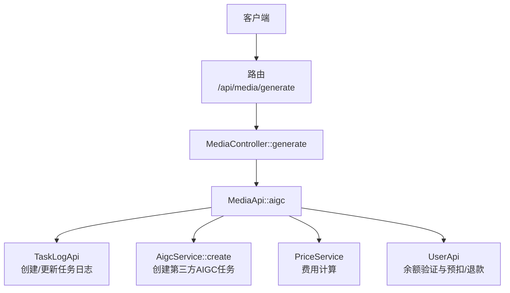
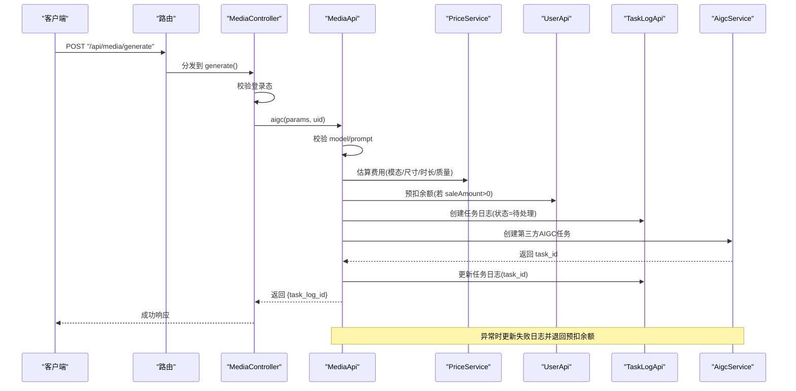
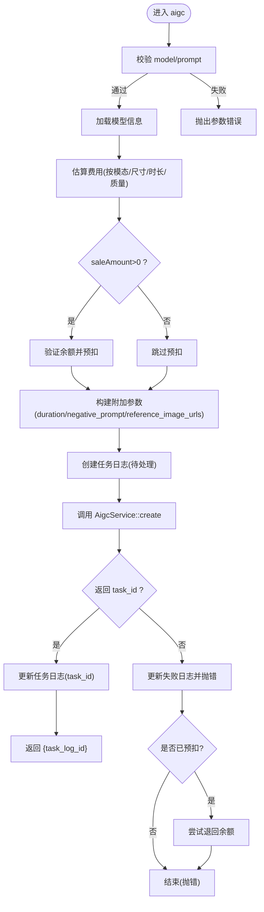
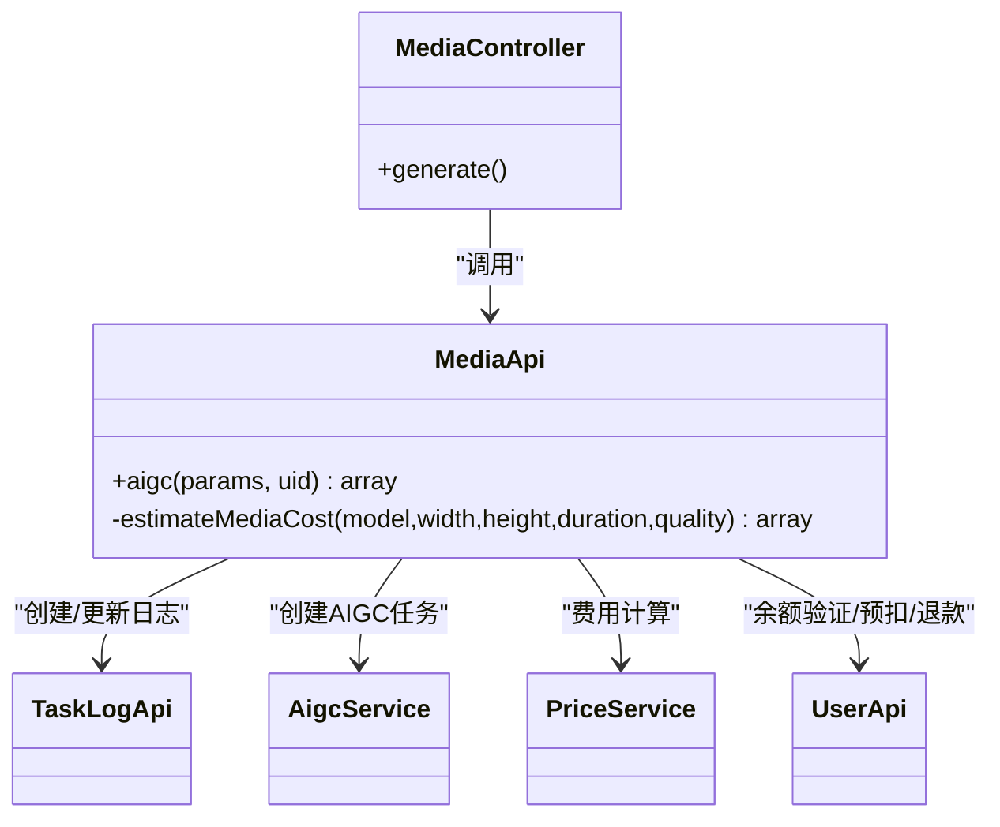

# 视频生成接口

<cite>
**本文引用的文件**
- [server/plugin/xbAiModelAgent/config/route.php](file://server/plugin/xbAiModelAgent/config/route.php)
- [server/plugin/xbAiModelAgent/app/api/controller/MediaController.php](file://server/plugin/xbAiModelAgent/app/api/controller/MediaController.php)
- [server/plugin/xbAiModelAgent/api/MediaApi.php](file://server/plugin/xbAiModelAgent/api/MediaApi.php)
- [server/plugin/xbAiModelAgent/enum/VideoDurationEnum.php](file://server/plugin/xbAiModelAgent/enum/VideoDurationEnum.php)
- [server/plugin/xbAiModelAgent/enum/VideoSizeEnum.php](file://server/plugin/xbAiModelAgent/enum/VideoSizeEnum.php)
- [server/plugin/xbAiModelAgent/data/groups.php](file://server/plugin/xbAiModelAgent/data/groups.php)
</cite>

## 目录
1. [简介](#简介)
2. [项目结构](#项目结构)
3. [核心组件](#核心组件)
4. [架构总览](#架构总览)
5. [详细组件分析](#详细组件分析)
6. [依赖分析](#依赖分析)
7. [性能与成本优化建议](#性能与成本优化建议)
8. [故障排查指南](#故障排查指南)
9. [结论](#结论)

## 简介
本文件面向“视频生成AI模型”的API调用方，提供统一的视频生成接口说明。系统通过统一入口创建媒体任务（文本生视频、图像生视频、参考图生视频等），由后台服务异步执行并返回任务ID，客户端可基于任务ID进行后续查询与结果获取。文档同时覆盖参数规范（时长、分辨率）、计费预估与预扣流程、以及长视频分片与队列管理的实现思路与最佳实践。

## 项目结构
后端采用插件化架构，视频生成相关能力集中在 xbAiModelAgent 插件中：
- 路由定义：将 /api/media/generate 映射到 MediaController::generate
- 控制器：MediaController 负责鉴权与参数透传
- API层：MediaApi 负责参数校验、费用预估与预扣、任务日志创建、第三方AIGC任务创建
- 枚举与数据：VideoDurationEnum、VideoSizeEnum 提供时长与分辨率选项；groups.php 维护视频模型分组与可用模型ID列表

图示来源
- [server/plugin/xbAiModelAgent/config/route.php:1-13](file://server/plugin/xbAiModelAgent/config/route.php#L1-L13)
- [server/plugin/xbAiModelAgent/app/api/controller/MediaController.php:89-98](file://server/plugin/xbAiModelAgent/app/api/controller/MediaController.php#L89-L98)
- [server/plugin/xbAiModelAgent/api/MediaApi.php:46-152](file://server/plugin/xbAiModelAgent/api/MediaApi.php#L46-L152)

章节来源
- [server/plugin/xbAiModelAgent/config/route.php:1-13](file://server/plugin/xbAiModelAgent/config/route.php#L1-L13)
- [server/plugin/xbAiModelAgent/app/api/controller/MediaController.php:89-98](file://server/plugin/xbAiModelAgent/app/api/controller/MediaController.php#L89-L98)
- [server/plugin/xbAiModelAgent/api/MediaApi.php:46-152](file://server/plugin/xbAiModelAgent/api/MediaApi.php#L46-L152)

## 核心组件
- 路由与控制器
  - 路由：POST /api/media/generate
  - 控制器：接收表单参数，校验登录态，委托给 MediaApi
- API层
  - 参数校验：model、prompt 必填
  - 费用预估与预扣：根据模态、尺寸、时长、质量键计算费用并预扣用户余额
  - 任务日志：记录请求上下文、费用、状态
  - 第三方任务：调用 AigcService 创建外部任务，回填 task_id
- 枚举与配置
  - VideoDurationEnum：支持 1~15 秒可选
  - VideoSizeEnum：480P/540P/720P/1080P/2K/4K 对应宽高
  - groups.php：视频组包含多种模型ID，用于前端展示与选择

章节来源
- [server/plugin/xbAiModelAgent/config/route.php:1-13](file://server/plugin/xbAiModelAgent/config/route.php#L1-L13)
- [server/plugin/xbAiModelAgent/app/api/controller/MediaController.php:25-78](file://server/plugin/xbAiModelAgent/app/api/controller/MediaController.php#L25-L78)
- [server/plugin/xbAiModelAgent/api/MediaApi.php:46-152](file://server/plugin/xbAiModelAgent/api/MediaApi.php#L46-L152)
- [server/plugin/xbAiModelAgent/enum/VideoDurationEnum.php:19-110](file://server/plugin/xbAiModelAgent/enum/VideoDurationEnum.php#L19-L110)
- [server/plugin/xbAiModelAgent/enum/VideoSizeEnum.php:19-86](file://server/plugin/xbAiModelAgent/enum/VideoSizeEnum.php#L19-L86)
- [server/plugin/xbAiModelAgent/data/groups.php:30-72](file://server/plugin/xbAiModelAgent/data/groups.php#L30-L72)

## 架构总览
下图展示了从HTTP请求到任务落库与第三方任务创建的完整链路，以及失败时的回滚逻辑。

图示来源
- [server/plugin/xbAiModelAgent/config/route.php:1-13](file://server/plugin/xbAiModelAgent/config/route.php#L1-L13)
- [server/plugin/xbAiModelAgent/app/api/controller/MediaController.php:89-98](file://server/plugin/xbAiModelAgent/app/api/controller/MediaController.php#L89-L98)
- [server/plugin/xbAiModelAgent/api/MediaApi.php:46-152](file://server/plugin/xbAiModelAgent/api/MediaApi.php#L46-L152)

## 详细组件分析

### 接口定义：POST /api/media/generate
- 用途：创建媒体生成任务（图片/音频/视频）
- 认证：需要已登录用户（uid）
- 请求体类型：formdata
- 通用参数
  - model_id：字符串，必填，示例值见控制器注解
  - prompt：字符串，必填
  - width：整数，可选，默认值见控制器注解
  - height：整数，可选，默认值见控制器注解
  - negative_prompt：字符串，可选
  - duration：字符串，可选，单位秒；视频/音频生效
  - reference_image_urls：字符串数组，可选，多个URL以逗号分隔传入
- 响应字段
  - code：整型，状态码
  - message：字符串，提示信息
  - data：对象，包含 task_log_id 等

注意：控制器中对 video/image/audio 分别做了注解说明，但实际统一由 generate 方法处理。

章节来源
- [server/plugin/xbAiModelAgent/app/api/controller/MediaController.php:25-78](file://server/plugin/xbAiModelAgent/app/api/controller/MediaController.php#L25-L78)
- [server/plugin/xbAiModelAgent/app/api/controller/MediaController.php:89-98](file://server/plugin/xbAiModelAgent/app/api/controller/MediaController.php#L89-L98)

### 业务处理：MediaApi::aigc
- 参数校验
  - model、prompt 必填
- 费用预估与预扣
  - 根据 modality、width、height、duration、quality 计算 cost_amount 与 sale_amount
  - 当 sale_amount > 0 时，先验证余额再预扣
- 附加参数构建
  - 对视频/音频模态，补充 duration（秒）
  - 支持 negative_prompt、reference_image_urls
- 任务日志
  - 创建任务记录，状态为“待处理”，写入 cost/sale/pre_deduct 等字段
- 第三方任务
  - 调用 AigcService::create 创建外部任务，成功后回填 task_id
- 异常处理
  - 创建失败时更新任务日志为失败，并尝试退回已预扣余额

图示来源
- [server/plugin/xbAiModelAgent/api/MediaApi.php:46-152](file://server/plugin/xbAiModelAgent/api/MediaApi.php#L46-L152)

章节来源
- [server/plugin/xbAiModelAgent/api/MediaApi.php:46-152](file://server/plugin/xbAiModelAgent/api/MediaApi.php#L46-L152)

### 视频规格与参数
- 时长（秒）
  - 支持 1~15 秒，具体选项见 VideoDurationEnum
- 分辨率
  - 480P/540P/720P/1080P/2K/4K，对应宽高见 VideoSizeEnum
- 帧率
  - 当前代码未暴露帧率参数；如需支持，可在扩展参数中新增 frame_rate 并在下游服务中传递
- 输入模式
  - 文本生视频：仅 prompt + 时长/分辨率
  - 图像生视频：prompt + reference_image_urls + 时长/分辨率
  - 首尾帧生视频：参考模型分组中的 start-end2video 系列模型ID

章节来源
- [server/plugin/xbAiModelAgent/enum/VideoDurationEnum.php:19-110](file://server/plugin/xbAiModelAgent/enum/VideoDurationEnum.php#L19-L110)
- [server/plugin/xbAiModelAgent/enum/VideoSizeEnum.php:19-86](file://server/plugin/xbAiModelAgent/enum/VideoSizeEnum.php#L19-L86)
- [server/plugin/xbAiModelAgent/data/groups.php:30-72](file://server/plugin/xbAiModelAgent/data/groups.php#L30-L72)

### 计费与成本
- 计费策略
  - 视频：优先使用 resolution_prices（按清晰度），其次 duration_price（按时长），再次 first_duration_price（首段时长）
  - 价格计算委托 PriceService
- 预扣与退款
  - 成功创建任务则预扣；创建失败则尝试退回预扣金额

章节来源
- [server/plugin/xbAiModelAgent/api/MediaApi.php:163-201](file://server/plugin/xbAiModelAgent/api/MediaApi.php#L163-L201)

## 依赖分析
- 直接依赖
  - 路由 -> MediaController -> MediaApi
  - MediaApi -> TaskLogApi、AigcService、PriceService、UserApi
- 间接依赖
  - 数据库（任务日志持久化）
  - 第三方AIGC服务（视频生成）
  - 用户资产服务（余额）

图示来源
- [server/plugin/xbAiModelAgent/app/api/controller/MediaController.php:89-98](file://server/plugin/xbAiModelAgent/app/api/controller/MediaController.php#L89-L98)
- [server/plugin/xbAiModelAgent/api/MediaApi.php:46-152](file://server/plugin/xbAiModelAgent/api/MediaApi.php#L46-L152)

章节来源
- [server/plugin/xbAiModelAgent/app/api/controller/MediaController.php:89-98](file://server/plugin/xbAiModelAgent/app/api/controller/MediaController.php#L89-L98)
- [server/plugin/xbAiModelAgent/api/MediaApi.php:46-152](file://server/plugin/xbAiModelAgent/api/MediaApi.php#L46-L152)

## 性能与成本优化建议
- 长视频分片生成
  - 将目标时长拆分为多段（如每段≤15秒），并行或串行提交多次任务，最终在下游或服务端进行拼接
  - 建议在任务日志中增加 parent_task_id 与 segment_index，便于追踪与合并
- 任务队列管理
  - 使用消息队列承载高并发任务，结合消费者池控制并发度
  - 引入优先级队列区分“快通道”和“标准通道”，保障关键业务SLA
- 大文件传输优化
  - 上传阶段采用分片上传与断点续传，服务端校验分片完整性后再触发生成
  - 对参考图/首尾帧等大附件启用CDN与压缩，减少带宽与延迟
- 缓存与幂等
  - 对相同提示词+参数的请求做短期去重，避免重复计费与重复生成
  - 任务重试需具备幂等性，防止重复创建第三方任务
- 成本控制
  - 合理设置最大时长与分辨率上限，结合用户等级动态调整
  - 对高频低价值场景限制并发与配额，引导使用更经济的模型或时长档位

[本节为通用建议，不直接分析具体文件]

## 故障排查指南
- 常见错误
  - 未登录：控制器会拒绝无uid的请求
  - 参数缺失：model/prompt为空将抛出参数错误
  - 模型不存在：根据 model_id 无法找到模型
  - 第三方任务创建失败：会更新任务日志为失败，并尝试退回预扣余额
- 定位步骤
  - 检查任务日志状态与错误信息
  - 核对模型ID是否在视频组内
  - 确认时长与分辨率是否符合枚举范围
  - 查看余额变动流水，确认预扣与退款是否成对出现

章节来源
- [server/plugin/xbAiModelAgent/app/api/controller/MediaController.php:89-98](file://server/plugin/xbAiModelAgent/app/api/controller/MediaController.php#L89-L98)
- [server/plugin/xbAiModelAgent/api/MediaApi.php:46-152](file://server/plugin/xbAiModelAgent/api/MediaApi.php#L46-L152)

## 结论
本接口通过统一入口完成视频生成的任务创建、费用预估与预扣、任务日志记录与第三方任务下发。结合枚举与分组配置，可灵活支持文本生视频、图像生视频等多种模式。针对长视频与大文件场景，建议采用分片与队列机制提升吞吐与稳定性，并通过配额与定价策略控制成本。