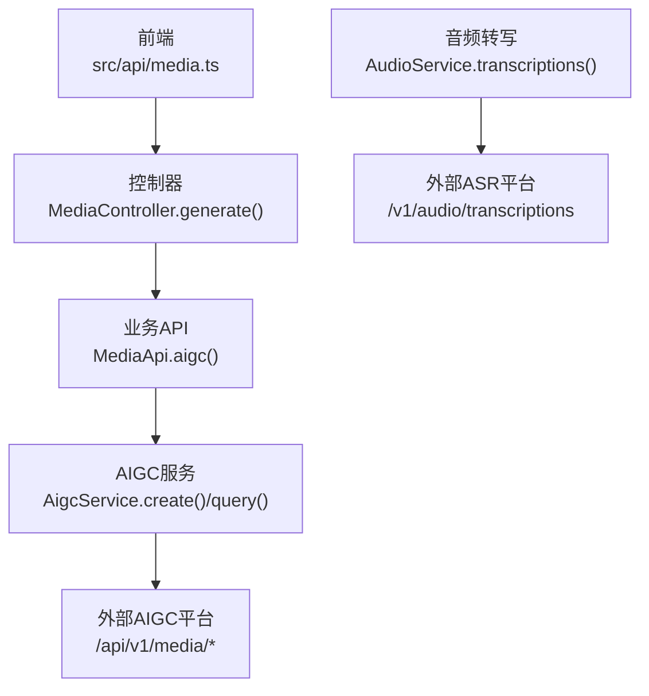
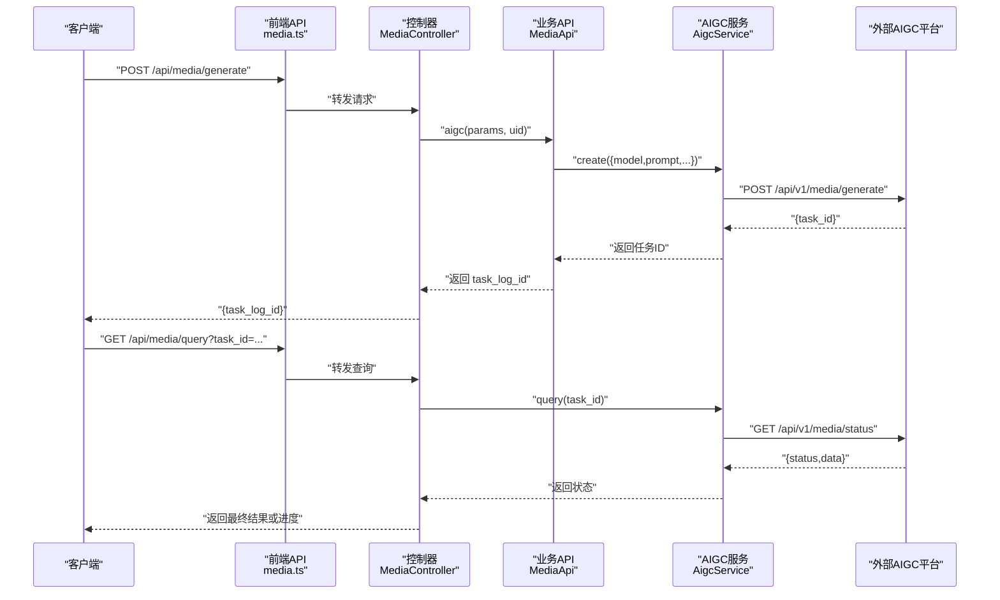
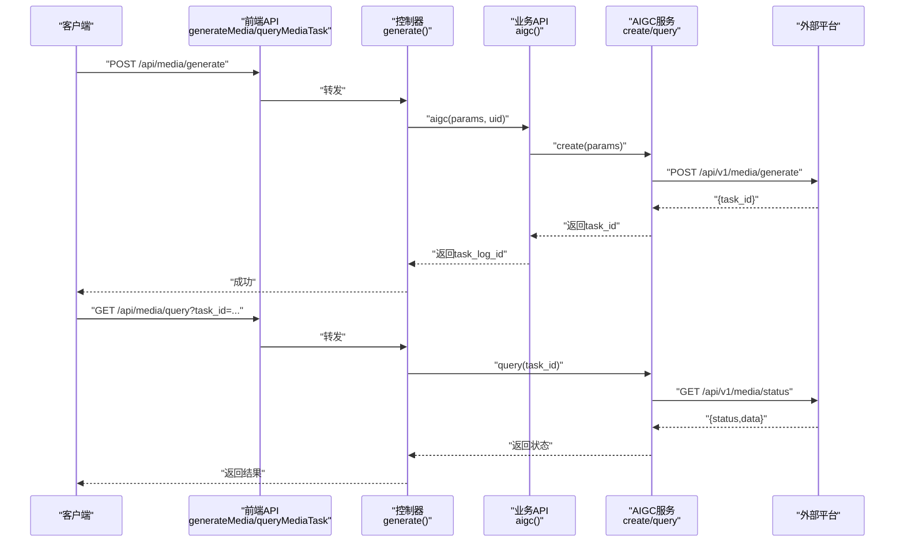
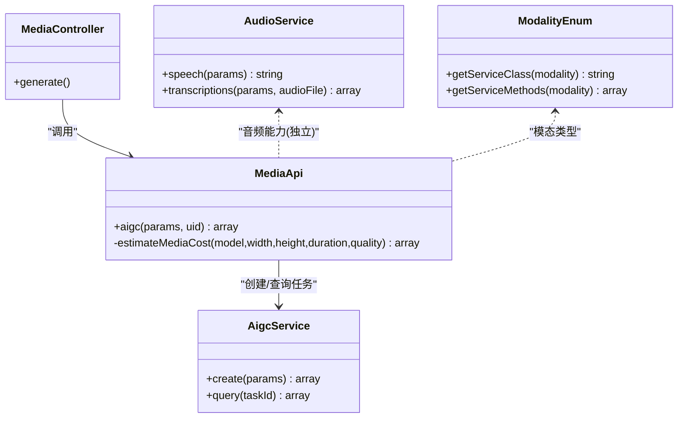

# 音频生成接口

<cite>
**本文引用的文件**   
- [MediaController.php](file://server/plugin/xbAiModelAgent/app/api/controller/MediaController.php)
- [MediaApi.php](file://server/plugin/xbAiModelAgent/api/MediaApi.php)
- [AigcService.php](file://server/plugin/xbAiModelAgent/service/xbservice/AigcService.php)
- [AudioService.php](file://server/plugin/xbAiModelAgent/service/xbcode/AudioService.php)
- [ModalityEnum.php](file://server/plugin/xbAiModelAgent/enum/ModalityEnum.php)
- [media.ts](file://frontend/src/api/media.ts)
- [upload.ts](file://frontend/src/api/upload.ts)
</cite>

## 目录
1. [简介](#简介)
2. [项目结构](#项目结构)
3. [核心组件](#核心组件)
4. [架构总览](#架构总览)
5. [详细组件分析](#详细组件分析)
6. [依赖关系分析](#依赖关系分析)
7. [性能与配置建议](#性能与配置建议)
8. [故障排查指南](#故障排查指南)
9. [结论](#结论)
10. [附录：参数与格式规范](#附录参数与格式规范)

## 简介
本文件为面向音频生成AI模型的API接口文档，覆盖以下能力：
- 文生语音（TTS）：通过统一媒体任务接口创建音频生成任务，并支持查询任务状态。
- 音乐生成与音效合成：以“模型ID + 提示词”的方式接入不同音频模态的第三方模型，由系统统一计费、排队与结果回写。
- 音频上传与转写：提供音频转文本（ASR）能力，支持多语言与多种响应格式。
- 音频格式、采样率与音质：说明各接口的输出格式、可选质量等级及推荐设置。
- 最佳实践：给出不同场景下的参数组合与优化建议。

## 项目结构
后端采用插件化架构，媒体生成相关代码位于 xbAiModelAgent 插件中；前端通过统一的请求封装调用 /api/media/generate 与 /api/media/query。

图示来源
- [MediaController.php:89-98](file://server/plugin/xbAiModelAgent/app/api/controller/MediaController.php#L89-L98)
- [MediaApi.php:46-152](file://server/plugin/xbAiModelAgent/api/MediaApi.php#L46-L152)
- [AigcService.php:33-56](file://server/plugin/xbAiModelAgent/service/xbservice/AigcService.php#L33-L56)
- [AudioService.php:50-82](file://server/plugin/xbAiModelAgent/service/xbcode/AudioService.php#L50-L82)

章节来源
- [MediaController.php:1-100](file://server/plugin/xbAiModelAgent/app/api/controller/MediaController.php#L1-L100)
- [media.ts:1-57](file://frontend/src/api/media.ts#L1-L57)

## 核心组件
- 媒体控制器 MediaController：对外暴露 /api/media/generate 与 /api/media/query 两个端点，负责鉴权、参数透传与统一返回。
- 媒体API MediaApi：校验参数、解析价格、预扣余额、创建任务日志、投递到AIGC服务，并在失败时退款。
- AIGC服务 AigcService：将请求转为 multipart/form-data 提交至外部AIGC平台，并提供任务状态查询。
- 音频服务 AudioService：提供 TTS 与 ASR 两种能力，分别对接 /v1/audio/speech 与 /v1/audio/transcriptions。
- 模态枚举 ModalityEnum：定义文本/图片/音频/视频等模态类型，用于扩展不同模态的服务方法。

章节来源
- [MediaController.php:89-98](file://server/plugin/xbAiModelAgent/app/api/controller/MediaController.php#L89-L98)
- [MediaApi.php:46-152](file://server/plugin/xbAiModelAgent/api/MediaApi.php#L46-L152)
- [AigcService.php:33-56](file://server/plugin/xbAiModelAgent/service/xbservice/AigcService.php#L33-L56)
- [AudioService.php:22-82](file://server/plugin/xbAiModelAgent/service/xbcode/AudioService.php#L22-L82)
- [ModalityEnum.php:23-71](file://server/plugin/xbAiModelAgent/enum/ModalityEnum.php#L23-L71)

## 架构总览
下图展示从前端发起音频生成到外部平台、再到结果查询的完整链路。

图示来源
- [MediaController.php:89-98](file://server/plugin/xbAiModelAgent/app/api/controller/MediaController.php#L89-L98)
- [MediaApi.php:46-152](file://server/plugin/xbAiModelAgent/api/MediaApi.php#L46-L152)
- [AigcService.php:33-56](file://server/plugin/xbAiModelAgent/service/xbservice/AigcService.php#L33-L56)
- [media.ts:46-56](file://frontend/src/api/media.ts#L46-L56)

## 详细组件分析

### 统一媒体任务接口（音频生成）
- 端点
  - POST /api/media/generate：创建媒体生成任务（含音频）。
  - GET /api/media/query：根据 task_id 查询任务状态与结果。
- 认证
  - 需要登录态（uid），未登录将返回未授权错误。
- 请求参数（表单）
  - model：字符串，必需。第三方模型标识。
  - prompt：字符串，必需。提示词。
  - width：整数，可选。宽度（对音频通常不生效）。
  - height：整数，可选。高度（对音频通常不生效）。
  - duration：整数/字符串，可选。时长（秒），音频/视频模型生效；默认值在内部处理。
  - negative_prompt：字符串，可选。反向提示词。
  - reference_image_urls：字符串数组，可选。参考图URL列表（对音频一般不使用）。
- 响应数据
  - code：整型，状态码。
  - message：字符串，提示信息。
  - data：对象，包含 task_log_id 等任务信息。
- 费用与余额
  - 若开启计费，将根据模型定价策略进行预估与预扣；任务失败会退回已预扣金额。
- 前端调用
  - 使用 media.ts 中的 generateMedia 与 queryMediaTask 函数封装请求。

章节来源
- [MediaController.php:25-98](file://server/plugin/xbAiModelAgent/app/api/controller/MediaController.php#L25-L98)
- [MediaApi.php:46-152](file://server/plugin/xbAiModelAgent/api/MediaApi.php#L46-L152)
- [media.ts:46-56](file://frontend/src/api/media.ts#L46-L56)

#### 序列图：音频生成任务创建与查询

图示来源
- [MediaController.php:89-98](file://server/plugin/xbAiModelAgent/app/api/controller/MediaController.php#L89-L98)
- [MediaApi.php:46-152](file://server/plugin/xbAiModelAgent/api/MediaApi.php#L46-L152)
- [AigcService.php:33-56](file://server/plugin/xbAiModelAgent/service/xbservice/AigcService.php#L33-L56)
- [media.ts:46-56](file://frontend/src/api/media.ts#L46-L56)

### 文本转语音（TTS）
- 端点
  - POST /v1/audio/speech
- 输入参数
  - model：字符串，必需。模型名称（如 tts-1）。
  - input：字符串，必需。待转换文本（长度限制见实现注释）。
  - voice：字符串，必需。语音风格（alloy/echo/fable/onyx/nova/shimmer）。
  - response_format：字符串，可选。mp3/opus/aac/flac/wav/pcm，默认 mp3。
  - speed：浮点数，可选。语速范围 0.25~4，默认 1。
- 输出
  - 直接返回音频二进制内容。
- 适用场景
  - 对话式语音播报、有声书、角色配音等。

章节来源
- [AudioService.php:22-35](file://server/plugin/xbAiModelAgent/service/xbcode/AudioService.php#L22-L35)

### 音频转文本（ASR）
- 端点
  - POST /v1/audio/transcriptions（multipart/form-data）
- 输入参数
  - model：字符串，必需。模型名称（如 whisper-1）。
  - language：字符串，可选。ISO-639-1 语言代码。
  - prompt：字符串，可选。提示词。
  - response_format：字符串，可选。json/text/srt/verbose_json/vtt，默认 json。
  - temperature：浮点数，可选。采样温度。
  - timestamp_granularities：数组，可选。word/segment。
  - file：音频文件（必填）。
- 输出
  - 返回文本或结构化转录结果（取决于 response_format）。
- 适用场景
  - 会议记录、字幕生成、语音检索等。

章节来源
- [AudioService.php:38-82](file://server/plugin/xbAiModelAgent/service/xbcode/AudioService.php#L38-L82)

### 音频上传与下载
- 上传
  - 端点：/app/xbUpload/api/Upload/upload
  - 字段名：file
  - 返回：{ url }
- 下载
  - 通过返回的 URL 直接访问文件资源。
- 前端封装
  - upload.ts 提供带进度与取消能力的上传方法。

章节来源
- [upload.ts:15-23](file://frontend/src/api/upload.ts#L15-L23)

## 依赖关系分析
- 控制器层仅做鉴权与转发，核心逻辑集中在业务API与服务层。
- 业务API负责参数校验、费用计算与任务日志管理。
- AIGC服务负责与外部平台交互（生成与状态查询）。
- 音频服务独立于统一媒体任务流程，直接对接外部ASR/TTS平台。

图示来源
- [MediaController.php:89-98](file://server/plugin/xbAiModelAgent/app/api/controller/MediaController.php#L89-L98)
- [MediaApi.php:46-152](file://server/plugin/xbAiModelAgent/api/MediaApi.php#L46-L152)
- [AigcService.php:33-56](file://server/plugin/xbAiModelAgent/service/xbservice/AigcService.php#L33-L56)
- [AudioService.php:22-82](file://server/plugin/xbAiModelAgent/service/xbcode/AudioService.php#L22-L82)
- [ModalityEnum.php:77-129](file://server/plugin/xbAiModelAgent/enum/ModalityEnum.php#L77-L129)

## 性能与配置建议
- 并发与队列
  - 音频生成属于耗时任务，建议通过异步队列消费，避免阻塞HTTP线程。
- 超时与重试
  - 对长耗时任务设置合理的超时时间；对网络异常进行指数退避重试。
- 缓存与去重
  - 相同提示词与参数的请求可考虑短期缓存，减少重复生成。
- 存储与CDN
  - 生成的音频文件建议落盘后走CDN分发，降低源站压力。
- 计费与风控
  - 预扣余额+失败退款机制已在业务API中实现，确保资金安全。
- 前端体验
  - 使用轮询或长连接方式查询任务状态，结合进度条提升用户体验。

[本节为通用建议，无需源码引用]

## 故障排查指南
- 未登录
  - 现象：返回未授权错误。
  - 原因：缺少有效用户会话。
  - 处理：检查登录态与Token传递。
- 参数缺失
  - 现象：提示“模型ID参数错误”或“请填写提示词参数”。
  - 原因：必填参数为空。
  - 处理：补齐 model 与 prompt。
- 模型不存在
  - 现象：提示“模型不存在”。
  - 原因：model 未在系统中注册或不可用。
  - 处理：核对模型ID与可用列表。
- 任务创建失败
  - 现象：抛出“AIGC任务创建失败”异常。
  - 原因：外部平台返回错误或内部异常。
  - 处理：查看日志与外部平台返回的错误消息；必要时触发退款。
- 费用与退款
  - 现象：预扣成功但任务失败。
  - 行为：系统自动尝试退款；若退款失败仅记录日志。
  - 处理：关注退款日志与账户余额变动。

章节来源
- [MediaController.php:89-98](file://server/plugin/xbAiModelAgent/app/api/controller/MediaController.php#L89-L98)
- [MediaApi.php:46-152](file://server/plugin/xbAiModelAgent/api/MediaApi.php#L46-L152)

## 结论
本项目提供了统一的音频生成入口与独立的TTS/ASR能力，配合完善的计费、任务日志与状态查询机制，能够满足文生语音、音乐生成与音效合成的多样化需求。通过合理配置参数与遵循最佳实践，可在保证音质的同时获得良好的性能与成本效益。

[本节为总结性内容，无需源码引用]

## 附录：参数与格式规范

### 音频生成（统一任务）
- 端点
  - POST /api/media/generate
  - GET /api/media/query
- 关键参数
  - model：字符串，必需。
  - prompt：字符串，必需。
  - duration：整数/字符串，可选。单位秒，音频/视频模型生效。
  - negative_prompt：字符串，可选。
  - reference_image_urls：字符串数组，可选。
- 输出格式
  - 由具体模型决定，常见为 mp3/wav/flac 等。
- 推荐配置
  - 短语音（≤10s）：duration=5~10，response_format=mp3。
  - 长语音（>10s）：按分钟分段生成，拼接播放。
  - 高保真：选择 flac/wav，注意体积与带宽。

章节来源
- [MediaController.php:25-98](file://server/plugin/xbAiModelAgent/app/api/controller/MediaController.php#L25-L98)
- [MediaApi.php:46-152](file://server/plugin/xbAiModelAgent/api/MediaApi.php#L46-L152)
- [AigcService.php:33-56](file://server/plugin/xbAiModelAgent/service/xbservice/AigcService.php#L33-L56)
- [media.ts:46-56](file://frontend/src/api/media.ts#L46-L56)

### TTS（文本转语音）
- 端点：POST /v1/audio/speech
- 关键参数
  - model、input、voice、response_format、speed
- 输出格式
  - mp3/opus/aac/flac/wav/pcm
- 推荐配置
  - 实时播报：mp3，speed=1.0~1.2。
  - 后期制作：flac/wav，保留更高动态范围。

章节来源
- [AudioService.php:22-35](file://server/plugin/xbAiModelAgent/service/xbcode/AudioService.php#L22-L35)

### ASR（音频转文本）
- 端点：POST /v1/audio/transcriptions
- 关键参数
  - model、language、prompt、response_format、temperature、timestamp_granularities、file
- 输出格式
  - json/text/srt/verbose_json/vtt
- 推荐配置
  - 字幕生成：response_format=srt 或 vtt。
  - 精确转写：response_format=verbose_json，开启 word/segment 时间戳。

章节来源
- [AudioService.php:38-82](file://server/plugin/xbAiModelAgent/service/xbcode/AudioService.php#L38-L82)

### 上传与下载
- 上传端点：/app/xbUpload/api/Upload/upload
- 字段名：file
- 返回：{ url }
- 下载：直接使用返回的 URL 访问。

章节来源
- [upload.ts:15-23](file://frontend/src/api/upload.ts#L15-L23)