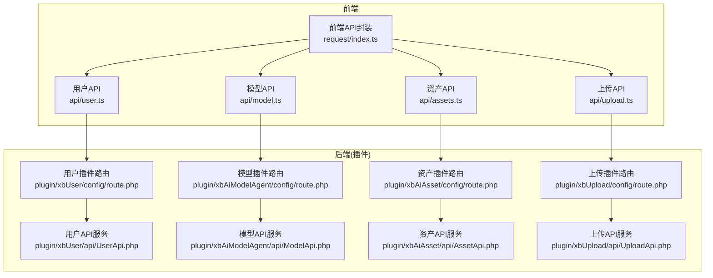
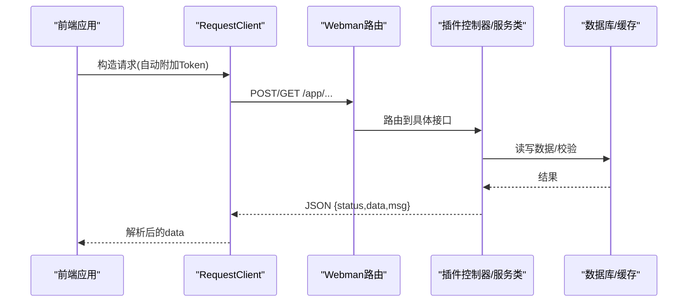
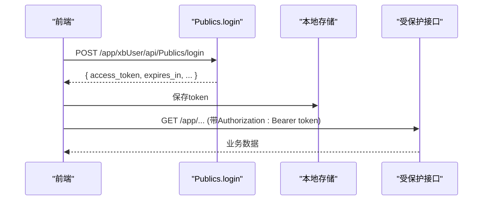
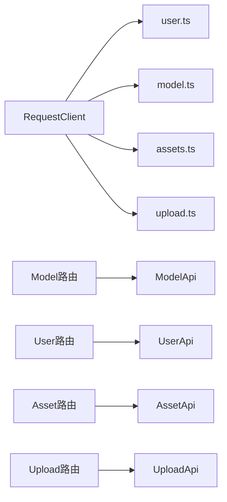

# API接口文档

<cite>
**本文引用的文件**   
- [frontend/src/api/user.ts](file://frontend/src/api/user.ts)
- [frontend/src/api/model.ts](file://frontend/src/api/model.ts)
- [frontend/src/api/assets.ts](file://frontend/src/api/assets.ts)
- [frontend/src/api/upload.ts](file://frontend/src/api/upload.ts)
- [frontend/src/utils/request/index.ts](file://frontend/src/utils/request/index.ts)
- [server/plugin/xbUser/api/UserApi.php](file://server/plugin/xbUser/api/UserApi.php)
- [server/plugin/xbAiModelAgent/api/ModelApi.php](file://server/plugin/xbAiModelAgent/api/ModelApi.php)
- [server/plugin/xbAiAsset/api/AssetApi.php](file://server/plugin/xbAiAsset/api/AssetApi.php)
- [server/plugin/xbUpload/api/UploadApi.php](file://server/plugin/xbUpload/api/UploadApi.php)
- [server/plugin/xbAiModelAgent/config/route.php](file://server/plugin/xbAiModelAgent/config/route.php)
</cite>

## 目录
1. [简介](#简介)
2. [项目结构](#项目结构)
3. [核心组件](#核心组件)
4. [架构总览](#架构总览)
5. [详细接口说明](#详细接口说明)
6. [依赖关系分析](#依赖关系分析)
7. [性能与可用性建议](#性能与可用性建议)
8. [故障排查指南](#故障排查指南)
9. [结论](#结论)

## 简介
本文件为积木云AI创作平台的RESTful API接口规范，覆盖用户认证、AI模型调用、资产管理、文件上传等核心能力。文档基于前端API客户端与服务端插件控制器/服务类实现进行整理，提供HTTP方法、URL模式、请求参数、响应格式、错误码定义及最佳实践指导，帮助开发者快速集成与排障。

## 项目结构
本项目采用前后端分离与插件化后端架构：
- 前端通过统一的HTTP客户端封装发起请求，自动附加鉴权Token并统一处理响应。
- 后端以Webman框架为基础，按功能拆分为多个插件（如用户、模型代理、素材、上传），每个插件内包含路由、控制器、API服务类与数据模型。

图表来源
- [frontend/src/utils/request/index.ts:1-237](file://frontend/src/utils/request/index.ts#L1-L237)
- [frontend/src/api/user.ts:1-226](file://frontend/src/api/user.ts#L1-L226)
- [frontend/src/api/model.ts:1-106](file://frontend/src/api/model.ts#L1-L106)
- [frontend/src/api/assets.ts:1-135](file://frontend/src/api/assets.ts#L1-L135)
- [frontend/src/api/upload.ts:1-24](file://frontend/src/api/upload.ts#L1-L24)
- [server/plugin/xbUser/api/UserApi.php:1-445](file://server/plugin/xbUser/api/UserApi.php#L1-L445)
- [server/plugin/xbAiModelAgent/api/ModelApi.php:1-274](file://server/plugin/xbAiModelAgent/api/ModelApi.php#L1-L274)
- [server/plugin/xbAiAsset/api/AssetApi.php:1-192](file://server/plugin/xbAiAsset/api/AssetApi.php#L1-L192)
- [server/plugin/xbUpload/api/UploadApi.php:1-409](file://server/plugin/xbUpload/api/UploadApi.php#L1-L409)
- [server/plugin/xbAiModelAgent/config/route.php:1-13](file://server/plugin/xbAiModelAgent/config/route.php#L1-L13)

章节来源
- [frontend/src/utils/request/index.ts:1-237](file://frontend/src/utils/request/index.ts#L1-L237)
- [server/plugin/xbAiModelAgent/config/route.php:1-13](file://server/plugin/xbAiModelAgent/config/route.php#L1-L13)

## 核心组件
- 统一HTTP客户端：负责基础配置、拦截器、Token注入、SSE流式请求与上传进度回调。
- 用户模块：注册、登录、资料管理、密码修改、验证码获取、退出登录等。
- AI模型模块：模型列表查询、分页、价格格式化、详情获取等。
- 资产模块：素材的增删改查、标签同步等。
- 上传模块：文件上传、去重、路径组织、记录保存等。

章节来源
- [frontend/src/utils/request/index.ts:1-237](file://frontend/src/utils/request/index.ts#L1-L237)
- [frontend/src/api/user.ts:1-226](file://frontend/src/api/user.ts#L1-L226)
- [frontend/src/api/model.ts:1-106](file://frontend/src/api/model.ts#L1-L106)
- [frontend/src/api/assets.ts:1-135](file://frontend/src/api/assets.ts#L1-L135)
- [frontend/src/api/upload.ts:1-24](file://frontend/src/api/upload.ts#L1-L24)
- [server/plugin/xbUser/api/UserApi.php:1-445](file://server/plugin/xbUser/api/UserApi.php#L1-L445)
- [server/plugin/xbAiModelAgent/api/ModelApi.php:1-274](file://server/plugin/xbAiModelAgent/api/ModelApi.php#L1-L274)
- [server/plugin/xbAiAsset/api/AssetApi.php:1-192](file://server/plugin/xbAiAsset/api/AssetApi.php#L1-L192)
- [server/plugin/xbUpload/api/UploadApi.php:1-409](file://server/plugin/xbUpload/api/UploadApi.php#L1-L409)

## 架构总览
整体交互流程如下：
- 前端通过RequestClient发起请求，自动在请求头中携带Authorization: Bearer <token>。
- 服务端路由将请求分发到对应插件控制器或服务类。
- 业务逻辑由插件内的API服务类实现，必要时访问数据库或缓存。
- 返回统一JSON结构，前端统一解析data字段。

图表来源
- [frontend/src/utils/request/index.ts:1-237](file://frontend/src/utils/request/index.ts#L1-L237)
- [server/plugin/xbAiModelAgent/config/route.php:1-13](file://server/plugin/xbAiModelAgent/config/route.php#L1-L13)

## 详细接口说明

### 通用约定
- 基础路径：/app/{插件名}/api/{模块}/{动作}
- 认证方式：Authorization: Bearer <access_token>
- 响应结构：{ status: number, data: any, msg: string }
- 分页结构：{ total, per_page, current_page, last_page, data: [] }
- 时间字段：create_at/update_at 使用字符串时间戳
- 状态码：业务异常抛出异常信息，由全局异常处理器转换为统一响应；网络/鉴权错误由拦截器处理

章节来源
- [frontend/src/utils/request/index.ts:1-237](file://frontend/src/utils/request/index.ts#L1-L237)

### 用户认证与账户
- 注册
  - 方法：POST
  - URL：/app/xbUser/api/Publics/register
  - 请求体：username, password, nickname, icode?, captcha_key?, captcha_code?, code?
  - 响应：成功返回用户信息
  - 备注：当开启图形验证码时，需传captcha_key/captcha_code；邮箱/短信注册可传code

- 登录
  - 方法：POST
  - URL：/app/xbUser/api/Publics/login
  - 请求体：username, password, captcha_key?, captcha_code?
  - 响应：{ token_type, expires_in, access_token, refresh_token }
  - 后续请求需在Header中携带Authorization: Bearer <access_token>

- 获取用户信息
  - 方法：GET
  - URL：/app/xbUser/api/User/info
  - 响应：用户基本信息（不含敏感字段）

- 修改个人资料（单字段）
  - 方法：PUT
  - URL：/app/xbUser/api/User/profile
  - 请求体：field, value
  - 限制：仅允许修改指定字段（如昵称、头像）

- 修改资料（昵称/头像）
  - 方法：PUT
  - URL：/app/xbUser/api/User/editProfile
  - 请求体：nickname, avatar

- 修改登录密码
  - 方法：PUT
  - URL：/app/xbUser/api/User/password
  - 请求体：origin_password, password

- 找回密码（重置密码）
  - 方法：PUT
  - URL：/app/xbUser/api/Publics/findPassword
  - 请求体：username, code, password, captcha_key?, captcha_code?

- 获取图像验证码
  - 方法：GET
  - URL：/app/xbUser/api/Publics/captcha
  - 响应：{ captcha_key, captcha_image(base64) }

- 手机验证码登录
  - 方法：POST
  - URL：/app/xbUser/api/Publics/mobileLogin
  - 请求体：mobile, code, captcha_key?, captcha_code?

- 邮箱验证码登录
  - 方法：POST
  - URL：/app/xbUser/api/Publics/emailLogin
  - 请求体：email, code, captcha_key?, captcha_code?

- 退出登录
  - 方法：DELETE
  - URL：/app/xbUser/api/Publics/logout
  - 请求体：client(web|mobile)

章节来源
- [frontend/src/api/user.ts:1-226](file://frontend/src/api/user.ts#L1-L226)
- [server/plugin/xbUser/api/UserApi.php:1-445](file://server/plugin/xbUser/api/UserApi.php#L1-L445)

### AI模型
- 获取全部模型列表
  - 方法：GET
  - URL：/app/xbAiModelAgent/api/Model/index
  - 查询参数：group_code?, model_id?
  - 响应：ModelItem[]，包含cost_prices/sale_prices/price_rate/prices_format等

- 获取模型分页列表
  - 方法：GET
  - URL：/app/xbAiModelAgent/api/Model/getList
  - 查询参数：page?, limit?, group_code?, model_id?
  - 响应：分页结构，data为ModelItem[]

- 文本聊天（OpenAI兼容）
  - 方法：POST
  - URL：/app/xbAiModelAgent/api/chat/completions
  - 请求体：参考OpenAI Chat Completions格式
  - 响应：支持SSE流式输出，逐块推送choices.delta.content

- 媒体生成
  - 方法：POST
  - URL：/app/xbAiModelAgent/api/media/generate
  - 请求体：根据具体模态（图片/视频/音频）传入相应参数
  - 响应：任务ID或结果地址（视实现而定）

章节来源
- [frontend/src/api/model.ts:1-106](file://frontend/src/api/model.ts#L1-L106)
- [server/plugin/xbAiModelAgent/api/ModelApi.php:1-274](file://server/plugin/xbAiModelAgent/api/ModelApi.php#L1-L274)
- [server/plugin/xbAiModelAgent/config/route.php:1-13](file://server/plugin/xbAiModelAgent/config/route.php#L1-L13)
- [frontend/src/utils/request/index.ts:123-227](file://frontend/src/utils/request/index.ts#L123-L227)

### 资产管理
- 获取资产列表
  - 方法：GET
  - URL：/app/xbAiAsset/api/Asset/list
  - 查询参数：type?, source?, name?, page?, limit?
  - 响应：分页结构，data为AssetItem[]

- 获取资产详情
  - 方法：GET
  - URL：/app/xbAiAsset/api/Asset/detail
  - 查询参数：id
  - 响应：AssetItem

- 创建资产
  - 方法：POST
  - URL：/app/xbAiAsset/api/Asset/create
  - 请求体：name, type, source, media_url, thumb?, duration?, tags?
  - 响应：AssetItem

- 更新资产
  - 方法：PUT
  - URL：/app/xbAiAsset/api/Asset/update
  - 请求体：id, 可选字段(name/type/source/thumb/media_url/duration/tags)
  - 响应：AssetItem

- 删除资产
  - 方法：DELETE
  - URL：/app/xbAiAsset/api/Asset/delete
  - 查询参数：id
  - 响应：空数据

章节来源
- [frontend/src/api/assets.ts:1-135](file://frontend/src/api/assets.ts#L1-L135)
- [server/plugin/xbAiAsset/api/AssetApi.php:1-192](file://server/plugin/xbAiAsset/api/AssetApi.php#L1-L192)

### 文件上传
- 文件上传
  - 方法：POST
  - URL：/app/xbUpload/api/Upload/upload
  - Content-Type：multipart/form-data
  - 表单字段：file(必填), fieldName默认file
  - 响应：{ url }
  - 特性：支持上传进度回调、取消控制、MD5去重、按扩展名分类存储、可选记录入库

章节来源
- [frontend/src/api/upload.ts:1-24](file://frontend/src/api/upload.ts#L1-L24)
- [frontend/src/utils/request/index.ts:82-121](file://frontend/src/utils/request/index.ts#L82-L121)
- [server/plugin/xbUpload/api/UploadApi.php:114-201](file://server/plugin/xbUpload/api/UploadApi.php#L114-L201)

### 认证与鉴权流程

图表来源
- [frontend/src/api/user.ts:157-162](file://frontend/src/api/user.ts#L157-L162)
- [frontend/src/utils/request/index.ts:46-58](file://frontend/src/utils/request/index.ts#L46-L58)

## 依赖关系分析
- 前端依赖
  - RequestClient统一封装了请求、响应、错误、上传与SSE能力。
  - 各业务API模块仅暴露简洁函数，内部复用RequestClient。
- 后端依赖
  - 路由层将/app前缀下的请求映射至插件控制器/服务类。
  - 服务类负责业务逻辑、数据持久化与事件发布。

图表来源
- [frontend/src/utils/request/index.ts:1-237](file://frontend/src/utils/request/index.ts#L1-L237)
- [frontend/src/api/user.ts:1-226](file://frontend/src/api/user.ts#L1-L226)
- [frontend/src/api/model.ts:1-106](file://frontend/src/api/model.ts#L1-L106)
- [frontend/src/api/assets.ts:1-135](file://frontend/src/api/assets.ts#L1-L135)
- [frontend/src/api/upload.ts:1-24](file://frontend/src/api/upload.ts#L1-L24)
- [server/plugin/xbAiModelAgent/config/route.php:1-13](file://server/plugin/xbAiModelAgent/config/route.php#L1-L13)
- [server/plugin/xbUser/api/UserApi.php:1-445](file://server/plugin/xbUser/api/UserApi.php#L1-L445)
- [server/plugin/xbAiModelAgent/api/ModelApi.php:1-274](file://server/plugin/xbAiModelAgent/api/ModelApi.php#L1-L274)
- [server/plugin/xbAiAsset/api/AssetApi.php:1-192](file://server/plugin/xbAiAsset/api/AssetApi.php#L1-L192)
- [server/plugin/xbUpload/api/UploadApi.php:1-409](file://server/plugin/xbUpload/api/UploadApi.php#L1-L409)

## 性能与可用性建议
- 合理使用分页与筛选参数，避免一次性拉取大量数据。
- 对大文件上传启用断点续传与并发分片（可在前端扩展）。
- SSE流式接口应设置合理的超时与重试策略，并在UI上展示增量内容。
- 利用上传MD5去重减少重复存储与带宽消耗。
- 对热点数据（如模型列表）在前端做短期缓存，降低服务端压力。

[本节为通用建议，不直接分析具体文件]

## 故障排查指南
- 鉴权失败
  - 检查是否已正确保存并携带Authorization: Bearer token。
  - 确认token未过期，必要时刷新或重新登录。
- 上传失败
  - 检查Content-Type是否为multipart/form-data且字段名为file。
  - 查看服务端异常信息（如“上传文件不存在”、“MD5为空”等）。
- 模型列表为空
  - 检查group_code或model_id筛选条件是否正确。
  - 确认模型状态为启用。
- SSE无响应
  - 检查服务端是否返回text/event-stream。
  - 确认请求头Accept与Authorization是否正确。

章节来源
- [frontend/src/utils/request/index.ts:46-58](file://frontend/src/utils/request/index.ts#L46-L58)
- [server/plugin/xbUpload/api/UploadApi.php:137-171](file://server/plugin/xbUpload/api/UploadApi.php#L137-L171)
- [server/plugin/xbAiModelAgent/api/ModelApi.php:49-108](file://server/plugin/xbAiModelAgent/api/ModelApi.php#L49-L108)
- [frontend/src/utils/request/index.ts:132-227](file://frontend/src/utils/request/index.ts#L132-L227)

## 结论
本文档基于仓库中的前端API封装与后端插件实现，系统梳理了用户认证、AI模型调用、资产管理与文件上传等核心接口的规范与交互流程。遵循本文档的约定与最佳实践，可有效提升集成效率与系统稳定性。