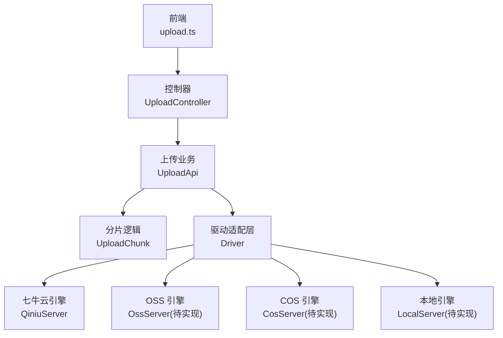
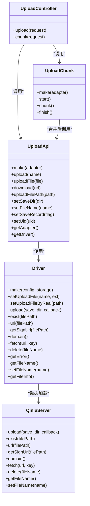
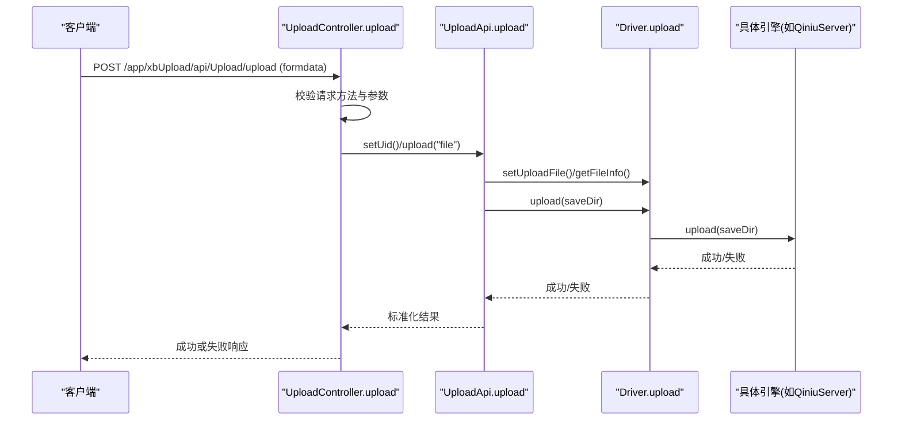
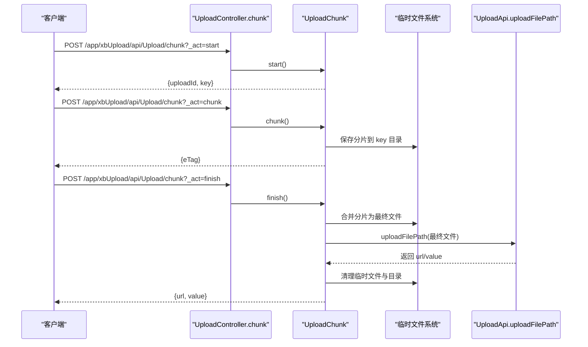
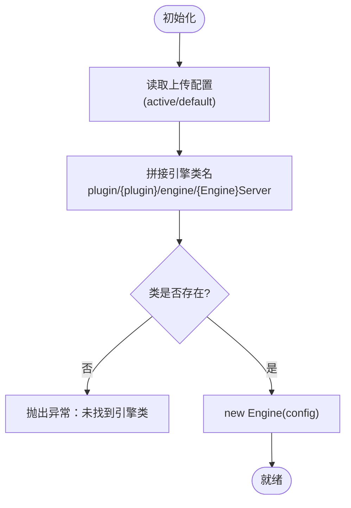
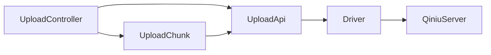

# 文件上传接口

<cite>
**本文引用的文件**
- [UploadController.php](file://server/plugin\xbUpload\app\api\controller\UploadController.php)
- [UploadApi.php](file://server/plugin\xbUpload\api\UploadApi.php)
- [UploadChunk.php](file://server/plugin\xbUpload\api\UploadChunk.php)
- [Driver.php](file://server/plugin\xbUpload\service\Driver.php)
- [QiniuServer.php](file://server/plugin\xbUploadQiniu\engine\QiniuServer.php)
- [upload.ts](file://frontend\src\api\upload.ts)
</cite>

## 目录
1. [简介](#简介)
2. [项目结构](#项目结构)
3. [核心组件](#核心组件)
4. [架构总览](#架构总览)
5. [详细组件分析](#详细组件分析)
6. [依赖关系分析](#依赖关系分析)
7. [性能与优化](#性能与优化)
8. [故障排查指南](#故障排查指南)
9. [结论](#结论)
10. [附录：API 定义与示例](#附录api-定义与示例)

## 简介
本文件为“文件上传服务”的接口文档，覆盖以下能力：
- 单文件上传
- 分片上传（含断点续传）
- 批量上传（基于前端并发控制）
- 文件预览与缩略图生成（概念性说明）
- 多存储引擎支持（本地、OSS、COS、七牛云）
- 文件大小限制、格式校验、安全校验
- 上传进度回调、错误处理、重试机制、存储配置

后端采用 Webman + ThinkPHP 插件化架构，通过统一驱动抽象对接不同对象存储。前端提供上传 API 封装，支持进度回调与中断。

## 项目结构
围绕上传能力的核心代码分布如下：
- 控制器层：接收请求并调用业务类
- 业务层：统一上传流程、去重、落库、路径策略
- 分片上传：会话级临时目录管理、分片合并、最终走统一上传
- 存储驱动：按配置动态加载具体引擎实现（如七牛云）
- 前端：上传 API 封装，支持进度回调

图示来源
- [UploadController.php:24-71](file://server/plugin\xbUpload\app\api\controller\UploadController.php#L24-L71)
- [UploadApi.php:121-201](file://server/plugin\xbUpload\api\UploadApi.php#L121-L201)
- [UploadChunk.php:95-201](file://server/plugin\xbUpload\api\UploadChunk.php#L95-L201)
- [Driver.php:215-234](file://server/plugin\xbUpload\service\Driver.php#L215-L234)
- [QiniuServer.php:34-68](file://server/plugin\xbUploadQiniu\engine\QiniuServer.php#L34-L68)
- [upload.ts:15-23](file://frontend\src\api\upload.ts#L15-L23)

章节来源
- [UploadController.php:24-71](file://server/plugin\xbUpload\app\api\controller\UploadController.php#L24-L71)
- [UploadApi.php:121-201](file://server/plugin\xbUpload\api\UploadApi.php#L121-L201)
- [UploadChunk.php:95-201](file://server/plugin\xbUpload\api\UploadChunk.php#L95-L201)
- [Driver.php:215-234](file://server/plugin\xbUpload\service\Driver.php#L215-L234)
- [QiniuServer.php:34-68](file://server/plugin\xbUploadQiniu\engine\QiniuServer.php#L34-L68)
- [upload.ts:15-23](file://frontend\src\api\upload.ts#L15-L23)

## 核心组件
- 控制器 UploadController
  - 暴露两个接口：单文件上传、分片上传（start/chunk/finish）
- 上传业务 UploadApi
  - 负责文件校验、MD5 去重、路径策略、落库、返回标准化结果
- 分片上传 UploadChunk
  - 管理 uploadId、分片保存、合并、最终调用统一上传
- 驱动 Driver
  - 根据配置动态选择具体存储引擎（local/oss/cos/qiniu），对外暴露统一方法
- 引擎实现 QiniuServer
  - 七牛云 SDK 集成，提供上传、存在性检查、URL、签名 URL、抓取、删除等
- 前端 upload.ts
  - 封装上传请求，支持 onProgress、abortController

章节来源
- [UploadController.php:24-71](file://server/plugin\xbUpload\app\api\controller\UploadController.php#L24-L71)
- [UploadApi.php:121-201](file://server/plugin\xbUpload\api\UploadApi.php#L121-L201)
- [UploadChunk.php:95-201](file://server/plugin\xbUpload\api\UploadChunk.php#L95-L201)
- [Driver.php:215-234](file://server/plugin\xbUpload\service\Driver.php#L215-L234)
- [QiniuServer.php:34-68](file://server/plugin\xbUploadQiniu\engine\QiniuServer.php#L34-L68)
- [upload.ts:15-23](file://frontend\src\api\upload.ts#L15-L23)

## 架构总览
整体采用“控制器 -> 业务 -> 驱动 -> 引擎”的分层设计，便于扩展新存储引擎并保持接口稳定。

图示来源
- [UploadController.php:24-71](file://server/plugin\xbUpload\app\api\controller\UploadController.php#L24-L71)
- [UploadApi.php:121-201](file://server/plugin\xbUpload\api\UploadApi.php#L121-L201)
- [UploadChunk.php:95-201](file://server/plugin\xbUpload\api\UploadChunk.php#L95-L201)
- [Driver.php:215-234](file://server/plugin\xbUpload\service\Driver.php#L215-L234)
- [QiniuServer.php:34-68](file://server/plugin\xbUploadQiniu\engine\QiniuServer.php#L34-L68)

## 详细组件分析

### 单文件上传接口
- 接口路径与方法
  - POST /app/xbUpload/api/Upload/upload
- 请求参数（表单）
  - file: 必填，上传文件
  - name: 可选，键名，默认 file
  - cid: 可选，分类ID（控制器接收但未在业务中直接使用）
- 响应数据
  - 包含 url、value、link、uri、md5、size、format、adapter、uid 等字段
- 行为说明
  - 校验请求方法
  - 读取用户ID（来自请求上下文）
  - 调用 UploadApi::upload 完成上传
  - 失败返回统一错误结构

图示来源
- [UploadController.php:34-49](file://server/plugin\xbUpload\app\api\controller\UploadController.php#L34-L49)
- [UploadApi.php:121-201](file://server/plugin\xbUpload\api\UploadApi.php#L121-L201)
- [Driver.php:96-99](file://server/plugin\xbUpload\service\Driver.php#L96-L99)
- [QiniuServer.php:34-68](file://server/plugin\xbUploadQiniu\engine\QiniuServer.php#L34-L68)

章节来源
- [UploadController.php:34-49](file://server/plugin\xbUpload\app\api\controller\UploadController.php#L34-L49)
- [UploadApi.php:121-201](file://server/plugin\xbUpload\api\UploadApi.php#L121-L201)

### 分片上传接口（含断点续传）
- 接口路径与方法
  - POST /app/xbUpload/api/Upload/chunk
- 请求参数
  - _act: 操作类型，取值 start | chunk | finish
  - 其他参数随 _act 变化
- 操作流程
  - start：生成 uploadId 与 key（临时目录），供后续分片使用
  - chunk：上传单个分片，服务端保存至临时目录，返回 eTag
  - finish：按 partList 顺序合并分片，生成最终文件，再调用统一上传流程，清理临时文件
- 断点续传
  - 基于 uploadId 与 key 定位临时目录；重复上传同一分片时，若已存在则跳过写入
  - 建议前端记录已上传分片列表，失败后仅重传缺失分片

图示来源
- [UploadController.php:57-70](file://server/plugin\xbUpload\app\api\controller\UploadController.php#L57-L70)
- [UploadChunk.php:95-201](file://server/plugin\xbUpload\api\UploadChunk.php#L95-L201)
- [UploadApi.php:245-263](file://server/plugin\xbUpload\api\UploadApi.php#L245-L263)

章节来源
- [UploadController.php:57-70](file://server/plugin\xbUpload\app\api\controller\UploadController.php#L57-L70)
- [UploadChunk.php:95-201](file://server/plugin\xbUpload\api\UploadChunk.php#L95-L201)

### 批量上传
- 方案
  - 前端对多个文件并行发起单文件上传或分片上传
  - 结合 AbortController 支持取消
  - 可设置并发上限与重试次数
- 注意
  - 服务端未提供专用批量接口，通过多次调用单文件或分片接口实现
  - 建议在前端做队列与限流，避免瞬时压力过大

章节来源
- [upload.ts:15-23](file://frontend\src\api\upload.ts#L15-L23)

### 文件预览与缩略图生成
- 现状
  - 当前仓库未提供专门的预览与缩略图生成接口
- 建议
  - 图片：可在 CDN 或网关层进行尺寸裁剪与格式转换
  - 视频：可异步任务生成封面帧，返回封面 URL
  - 音频：可生成波形或时长元信息

[本节为概念性说明，不直接分析具体文件]

### 多存储引擎支持
- 引擎选择
  - 通过配置 active/default 指定当前使用的引擎
  - Driver 根据配置动态加载对应引擎类
- 已实现
  - 七牛云：QiniuServer（上传、存在性检查、URL、签名 URL、抓取、删除）
- 待实现
  - 本地、阿里云 OSS、腾讯云 COS 引擎类需补充实现

图示来源
- [Driver.php:215-234](file://server/plugin\xbUpload\service\Driver.php#L215-L234)
- [QiniuServer.php:34-68](file://server/plugin\xbUploadQiniu\engine\QiniuServer.php#L34-L68)

章节来源
- [Driver.php:215-234](file://server/plugin\xbUpload\service\Driver.php#L215-L234)
- [QiniuServer.php:34-68](file://server/plugin\xbUploadQiniu\engine\QiniuServer.php#L34-L68)

### 文件大小限制、格式验证与安全校验
- 大小限制
  - 当前代码未显式限制大小，建议在 Nginx/Webman 层与业务层共同控制
- 格式校验
  - 通过扩展名映射目录（attachment/{type}/Ymd），但未见严格白名单拦截
- 安全校验
  - 未实现内容扫描、病毒检测、MIME 强校验
  - 建议增加：MIME 校验、后缀白名单、内容头检测、恶意文件名过滤

章节来源
- [UploadApi.php:350-373](file://server/plugin\xbUpload\api\UploadApi.php#L350-L373)

### 上传进度回调、错误处理与重试
- 进度回调
  - 前端 upload.ts 支持 onProgress 与 abortController
- 错误处理
  - 控制器与业务层抛出异常并返回统一失败结构
- 重试机制
  - 服务端未内置重试，建议在前端实现指数退避重试

章节来源
- [upload.ts:15-23](file://frontend\src\api\upload.ts#L15-L23)
- [UploadController.php:34-49](file://server/plugin\xbUpload\app\api\controller\UploadController.php#L34-L49)
- [UploadApi.php:121-201](file://server/plugin\xbUpload\api\UploadApi.php#L121-L201)

## 依赖关系分析
- 控制器依赖业务类与分片类
- 业务类依赖驱动层
- 驱动层依赖具体引擎实现
- 前端依赖后端上传接口

图示来源
- [UploadController.php:24-71](file://server/plugin\xbUpload\app\api\controller\UploadController.php#L24-L71)
- [UploadApi.php:121-201](file://server/plugin\xbUpload\api\UploadApi.php#L121-L201)
- [UploadChunk.php:95-201](file://server/plugin\xbUpload\api\UploadChunk.php#L95-L201)
- [Driver.php:215-234](file://server/plugin\xbUpload\service\Driver.php#L215-L234)
- [QiniuServer.php:34-68](file://server/plugin\xbUploadQiniu\engine\QiniuServer.php#L34-L68)

章节来源
- [UploadController.php:24-71](file://server/plugin\xbUpload\app\api\controller\UploadController.php#L24-L71)
- [UploadApi.php:121-201](file://server/plugin\xbUpload\api\UploadApi.php#L121-L201)
- [UploadChunk.php:95-201](file://server/plugin\xbUpload\api\UploadChunk.php#L95-L201)
- [Driver.php:215-234](file://server/plugin\xbUpload\service\Driver.php#L215-L234)
- [QiniuServer.php:34-68](file://server/plugin\xbUploadQiniu\engine\QiniuServer.php#L34-L68)

## 性能与优化
- 分片上传
  - 合理设置分片大小（建议 5~10MB），提升大文件稳定性与并发度
  - 合并阶段尽量顺序写盘，减少随机 IO
- 去重与缓存
  - 利用 MD5 去重减少重复存储与网络开销
- 存储层
  - 优先使用对象存储的直传与 CDN 加速
  - 开启压缩与按需转码（图片/视频）
- 前端
  - 并发控制、断点续传、失败重试、进度反馈
- 系统
  - 调整 PHP 上传限制、Web 服务器超时、临时目录磁盘空间

[本节为通用指导，不直接分析具体文件]

## 故障排查指南
- 常见错误
  - 请求方法错误：确保使用 POST
  - 缺少操作参数：_act 必须为 start/chunk/finish
  - 操作方法不存在：检查 _act 值
  - 上传文件不存在：确认表单字段名与文件存在
  - 未找到存储引擎配置/类：检查配置与插件安装
- 定位步骤
  - 查看控制器抛出的异常信息
  - 检查 Driver 动态加载的引擎类是否存在
  - 核对临时目录权限与空间
  - 针对七牛云，检查 access_key/secret_key/bucket/domain 配置

章节来源
- [UploadController.php:34-49](file://server/plugin\xbUpload\app\api\controller\UploadController.php#L34-L49)
- [UploadController.php:57-70](file://server/plugin\xbUpload\app\api\controller\UploadController.php#L57-L70)
- [Driver.php:215-234](file://server/plugin\xbUpload\service\Driver.php#L215-L234)

## 结论
该上传服务以分层与插件化为核心，提供了单文件与分片上传的基础能力，并通过驱动抽象支持多存储引擎。当前已实现七牛云引擎，其余引擎需补充。建议在安全校验、格式白名单、大小限制、预览与缩略图等方面进一步完善，以提升健壮性与用户体验。

[本节为总结，不直接分析具体文件]

## 附录：API 定义与示例

### 单文件上传
- 接口
  - POST /app/xbUpload/api/Upload/upload
- 请求体（multipart/form-data）
  - file: File（必填）
  - name: string（可选，默认 file）
  - cid: string（可选）
- 响应
  - 成功：包含 url、value、link、uri、md5、size、format、adapter、uid 等
  - 失败：统一错误结构

章节来源
- [UploadController.php:34-49](file://server/plugin\xbUpload\app\api\controller\UploadController.php#L34-L49)
- [UploadApi.php:325-341](file://server/plugin\xbUpload\api\UploadApi.php#L325-L341)

### 分片上传
- 接口
  - POST /app/xbUpload/api/Upload/chunk
- 参数
  - _act: start | chunk | finish
  - 其他参数随 _act 变化
- 流程
  - start：返回 uploadId、key
  - chunk：上传分片，返回 eTag
  - finish：合并分片，返回 url、value

章节来源
- [UploadController.php:57-70](file://server/plugin\xbUpload\app\api\controller\UploadController.php#L57-L70)
- [UploadChunk.php:95-201](file://server/plugin\xbUpload\api\UploadChunk.php#L95-L201)

### 前端上传封装
- 函数
  - upload(file, options)
- 选项
  - onProgress：进度回调
  - abortController：中断上传
- 目标接口
  - /app/xbUpload/api/Upload/upload

章节来源
- [upload.ts:15-23](file://frontend\src\api\upload.ts#L15-L23)