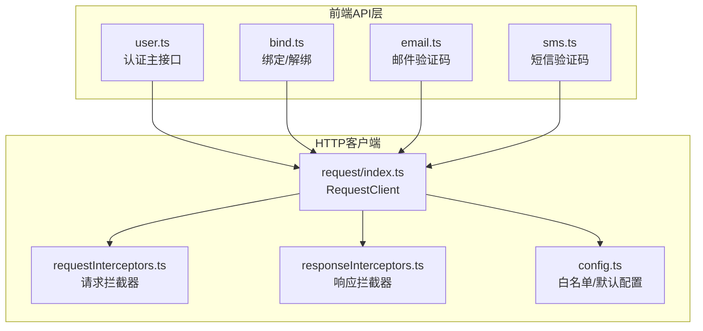
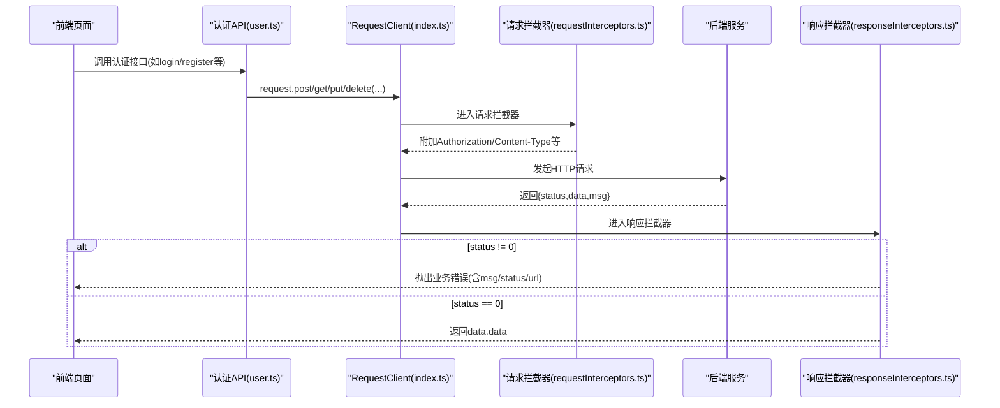
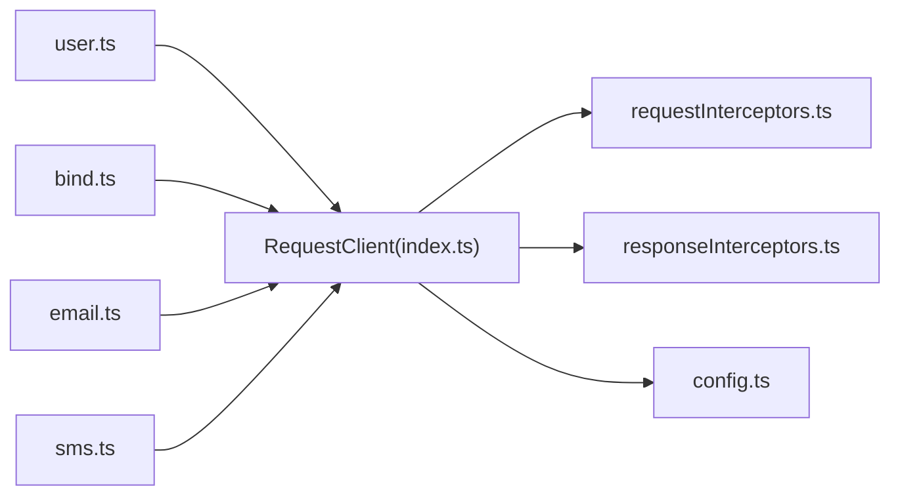

# 用户认证接口

<cite>
**本文引用的文件**   
- [frontend/src/api/user.ts](file://frontend/src/api/user.ts)
- [frontend/src/api/bind.ts](file://frontend/src/api/bind.ts)
- [frontend/src/api/email.ts](file://frontend/src/api/email.ts)
- [frontend/src/api/sms.ts](file://frontend/src/api/sms.ts)
- [frontend/src/utils/request/index.ts](file://frontend/src/utils/request/index.ts)
- [frontend/src/utils/request/config.ts](file://frontend/src/utils/request/config.ts)
- [frontend/src/utils/request/requestInterceptors.ts](file://frontend/src/utils/request/requestInterceptors.ts)
- [frontend/src/utils/request/responseInterceptors.ts](file://frontend/src/utils/request/responseInterceptors.ts)
</cite>

## 目录
1. [简介](#简介)
2. [项目结构](#项目结构)
3. [核心组件](#核心组件)
4. [架构总览](#架构总览)
5. [详细接口说明](#详细接口说明)
6. [依赖分析](#依赖分析)
7. [性能与安全建议](#性能与安全建议)
8. [故障排查指南](#故障排查指南)
9. [结论](#结论)

## 简介
本文件为用户认证模块的API接口文档，覆盖以下能力：
- 账号注册、登录（用户名/密码）、登出
- 手机验证码登录、邮箱验证码登录
- 重置密码（找回密码）
- 图像验证码获取
- 绑定/解绑手机号与邮箱
- 发送短信验证码（无需登录/需登录）
- 发送邮件验证码（无需登录/需登录）
- JWT令牌获取与刷新机制说明（基于前端拦截器与响应处理）
- 统一错误码与异常处理流程
- 调用示例与安全最佳实践

## 项目结构
认证相关的前端API定义集中在若干文件中，并通过统一的HTTP客户端进行封装。请求拦截器负责自动附加Token、设置必要请求头；响应拦截器负责统一业务错误处理与事件广播。

图表来源
- [frontend/src/api/user.ts:1-226](file://frontend/src/api/user.ts#L1-L226)
- [frontend/src/api/bind.ts:1-58](file://frontend/src/api/bind.ts#L1-L58)
- [frontend/src/api/email.ts:1-24](file://frontend/src/api/email.ts#L1-L24)
- [frontend/src/api/sms.ts:1-24](file://frontend/src/api/sms.ts#L1-L24)
- [frontend/src/utils/request/index.ts:1-237](file://frontend/src/utils/request/index.ts#L1-L237)
- [frontend/src/utils/request/requestInterceptors.ts:1-47](file://frontend/src/utils/request/requestInterceptors.ts#L1-L47)
- [frontend/src/utils/request/responseInterceptors.ts:1-24](file://frontend/src/utils/request/responseInterceptors.ts#L1-L24)
- [frontend/src/utils/request/config.ts:1-39](file://frontend/src/utils/request/config.ts#L1-L39)

章节来源
- [frontend/src/api/user.ts:1-226](file://frontend/src/api/user.ts#L1-L226)
- [frontend/src/api/bind.ts:1-58](file://frontend/src/api/bind.ts#L1-L58)
- [frontend/src/api/email.ts:1-24](file://frontend/src/api/email.ts#L1-L24)
- [frontend/src/api/sms.ts:1-24](file://frontend/src/api/sms.ts#L1-L24)
- [frontend/src/utils/request/index.ts:1-237](file://frontend/src/utils/request/index.ts#L1-L237)
- [frontend/src/utils/request/requestInterceptors.ts:1-47](file://frontend/src/utils/request/requestInterceptors.ts#L1-L47)
- [frontend/src/utils/request/responseInterceptors.ts:1-24](file://frontend/src/utils/request/responseInterceptors.ts#L1-L24)
- [frontend/src/utils/request/config.ts:1-39](file://frontend/src/utils/request/config.ts#L1-L39)

## 核心组件
- RequestClient：封装Axios实例，提供get/post/put/delete/upload/ssePost等方法，并统一返回data.data。
- 请求拦截器：为每个非白名单请求自动附加Authorization: Bearer <token>，并设置必要的请求头。
- 响应拦截器：当后端返回status不为0时，触发业务错误事件并拒绝Promise。
- 白名单机制：通过配置文件动态加载白名单URL，支持精确匹配与通配符匹配。

章节来源
- [frontend/src/utils/request/index.ts:32-80](file://frontend/src/utils/request/index.ts#L32-L80)
- [frontend/src/utils/request/requestInterceptors.ts:12-39](file://frontend/src/utils/request/requestInterceptors.ts#L12-L39)
- [frontend/src/utils/request/responseInterceptors.ts:10-23](file://frontend/src/utils/request/responseInterceptors.ts#L10-L23)
- [frontend/src/utils/request/config.ts:12-38](file://frontend/src/utils/request/config.ts#L12-L38)

## 架构总览
下图展示了认证相关接口的调用链路：前端API调用RequestClient，请求经拦截器附加Token后发送至后端；后端返回统一格式{status,data,msg}，由响应拦截器处理业务错误并向上抛出。

图表来源
- [frontend/src/api/user.ts:150-226](file://frontend/src/api/user.ts#L150-L226)
- [frontend/src/utils/request/index.ts:46-80](file://frontend/src/utils/request/index.ts#L46-L80)
- [frontend/src/utils/request/requestInterceptors.ts:12-39](file://frontend/src/utils/request/requestInterceptors.ts#L12-L39)
- [frontend/src/utils/request/responseInterceptors.ts:10-23](file://frontend/src/utils/request/responseInterceptors.ts#L10-L23)

## 详细接口说明

### 通用约定
- 基础路径：所有接口均以 /app/xbUser/api 或 /app/xbEmail/api 或 /app/xbSms/api 开头，具体见各接口。
- 请求头：
  - 非白名单接口必须携带 Authorization: Bearer <access_token>。
  - Content-Type 通常为 application/json（FormData上传除外）。
- 响应体：统一结构 { status, data, msg }。当 status 为 0 表示成功，否则为业务错误。
- 错误处理：响应拦截器会在 status != 0 时抛出错误，并附带 message、status、url、response 等信息。

章节来源
- [frontend/src/utils/request/responseInterceptors.ts:10-23](file://frontend/src/utils/request/responseInterceptors.ts#L10-L23)
- [frontend/src/utils/request/requestInterceptors.ts:12-39](file://frontend/src/utils/request/requestInterceptors.ts#L12-L39)

### 1) 用户注册
- 接口地址：POST /app/xbUser/api/Publics/register
- 请求参数
  - username: string，必填
  - password: string，必填
  - nickname: string，必填
  - icode?: string，可选
  - captcha_key?: string，开启图形验证码时必填
  - captcha_code?: string，开启图形验证码时必填
  - code?: string，邮箱或短信验证码（字母+数字注册时可不传）
- 响应数据
  - 成功：返回业务数据(data)，具体字段以服务端为准
  - 失败：{ status: 非0, msg: 错误信息 }
- 调用示例
  - 参考实现路径：[register:150-155](file://frontend/src/api/user.ts#L150-L155)

章节来源
- [frontend/src/api/user.ts:44-60](file://frontend/src/api/user.ts#L44-L60)
- [frontend/src/api/user.ts:150-155](file://frontend/src/api/user.ts#L150-L155)

### 2) 用户登录（用户名/密码）
- 接口地址：POST /app/xbUser/api/Publics/login
- 请求参数
  - username: string，必填
  - password: string，必填
  - captcha_key?: string，开启图形验证码时必填
  - captcha_code?: string，开启图形验证码时必填
- 响应数据
  - token_type: string
  - expires_in: number（秒）
  - access_token: string
  - refresh_token: string
- 调用示例
  - 参考实现路径：[login:157-162](file://frontend/src/api/user.ts#L157-L162)

章节来源
- [frontend/src/api/user.ts:62-72](file://frontend/src/api/user.ts#L62-L72)
- [frontend/src/api/user.ts:157-162](file://frontend/src/api/user.ts#L157-L162)

### 3) 退出登录
- 接口地址：DELETE /app/xbUser/api/Publics/logout
- 请求参数
  - client: 'web' | 'mobile'
- 响应数据
  - 成功：返回业务数据(data)
- 调用示例
  - 参考实现路径：[logout:220-225](file://frontend/src/api/user.ts#L220-L225)

章节来源
- [frontend/src/api/user.ts:136-140](file://frontend/src/api/user.ts#L136-L140)
- [frontend/src/api/user.ts:220-225](file://frontend/src/api/user.ts#L220-L225)

### 4) 获取用户信息
- 接口地址：GET /app/xbUser/api/User/info
- 响应数据
  - id, create_at, username, nickname, mobile, email, avatar, login_ip, login_time, balance, freeze_balance, integral 等
- 调用示例
  - 参考实现路径：[getUserInfo:164-169](file://frontend/src/api/user.ts#L164-L169)

章节来源
- [frontend/src/api/user.ts:15-42](file://frontend/src/api/user.ts#L15-L42)
- [frontend/src/api/user.ts:164-169](file://frontend/src/api/user.ts#L164-L169)

### 5) 修改个人资料（单字段）
- 接口地址：PUT /app/xbUser/api/User/profile
- 请求参数
  - field: string，要修改的字段名
  - value: string，新值
- 调用示例
  - 参考实现路径：[editProfileField:171-176](file://frontend/src/api/user.ts#L171-L176)

章节来源
- [frontend/src/api/user.ts:74-80](file://frontend/src/api/user.ts#L74-L80)
- [frontend/src/api/user.ts:171-176](file://frontend/src/api/user.ts#L171-L176)

### 6) 修改资料（昵称/头像）
- 接口地址：PUT /app/xbUser/api/User/editProfile
- 请求参数
  - nickname: string
  - avatar: string
- 调用示例
  - 参考实现路径：[editProfile:178-183](file://frontend/src/api/user.ts#L178-L183)

章节来源
- [frontend/src/api/user.ts:82-88](file://frontend/src/api/user.ts#L82-L88)
- [frontend/src/api/user.ts:178-183](file://frontend/src/api/user.ts#L178-L183)

### 7) 修改登录密码
- 接口地址：PUT /app/xbUser/api/User/password
- 请求参数
  - origin_password: string
  - password: string
- 调用示例
  - 参考实现路径：[changePassword:185-190](file://frontend/src/api/user.ts#L185-L190)

章节来源
- [frontend/src/api/user.ts:90-96](file://frontend/src/api/user.ts#L90-L96)
- [frontend/src/api/user.ts:185-190](file://frontend/src/api/user.ts#L185-L190)

### 8) 找回密码（重置密码）
- 接口地址：PUT /app/xbUser/api/Publics/findPassword
- 请求参数
  - username: string（手机号或邮箱）
  - code: string（验证码）
  - password: string（新密码）
  - captcha_key?: string，开启图形验证码时必填
  - captcha_code?: string，开启图形验证码时必填
- 调用示例
  - 参考实现路径：[resetPassword:192-197](file://frontend/src/api/user.ts#L192-L197)

章节来源
- [frontend/src/api/user.ts:98-110](file://frontend/src/api/user.ts#L98-L110)
- [frontend/src/api/user.ts:192-197](file://frontend/src/api/user.ts#L192-L197)

### 9) 获取图像验证码
- 接口地址：GET /app/xbUser/api/Publics/captcha
- 响应数据
  - captcha_key: string
  - captcha_image: string（base64图片）
- 调用示例
  - 参考实现路径：[getCaptcha:199-204](file://frontend/src/api/user.ts#L199-L204)

章节来源
- [frontend/src/api/user.ts:142-148](file://frontend/src/api/user.ts#L142-L148)
- [frontend/src/api/user.ts:199-204](file://frontend/src/api/user.ts#L199-L204)

### 10) 手机验证码登录
- 接口地址：POST /app/xbUser/api/Publics/mobileLogin
- 请求参数
  - mobile: string
  - code: string
  - captcha_key?: string，开启图形验证码时必填
  - captcha_code?: string，开启图形验证码时必填
- 响应数据
  - 同登录接口，返回 access_token、refresh_token 等
- 调用示例
  - 参考实现路径：[mobileLogin:206-211](file://frontend/src/api/user.ts#L206-L211)

章节来源
- [frontend/src/api/user.ts:112-122](file://frontend/src/api/user.ts#L112-L122)
- [frontend/src/api/user.ts:206-211](file://frontend/src/api/user.ts#L206-L211)

### 11) 邮箱验证码登录
- 接口地址：POST /app/xbUser/api/Publics/emailLogin
- 请求参数
  - email: string
  - code: string
  - captcha_key?: string，开启图形验证码时必填
  - captcha_code?: string，开启图形验证码时必填
- 响应数据
  - 同登录接口，返回 access_token、refresh_token 等
- 调用示例
  - 参考实现路径：[emailLogin:213-218](file://frontend/src/api/user.ts#L213-L218)

章节来源
- [frontend/src/api/user.ts:124-134](file://frontend/src/api/user.ts#L124-L134)
- [frontend/src/api/user.ts:213-218](file://frontend/src/api/user.ts#L213-L218)

### 12) 绑定手机号
- 接口地址：PUT /app/xbUser/api/Bind/bindMobile
- 请求参数
  - mobile: string
  - code: string
- 调用示例
  - 参考实现路径：[bindMobile:31-36](file://frontend/src/api/bind.ts#L31-L36)

章节来源
- [frontend/src/api/bind.ts:3-9](file://frontend/src/api/bind.ts#L3-L9)
- [frontend/src/api/bind.ts:31-36](file://frontend/src/api/bind.ts#L31-L36)

### 13) 解绑手机号
- 接口地址：DELETE /app/xbUser/api/Bind/unlockBindMobile
- 请求参数
  - code: string
- 调用示例
  - 参考实现路径：[unlockBindMobile:38-43](file://frontend/src/api/bind.ts#L38-L43)

章节来源
- [frontend/src/api/bind.ts:11-15](file://frontend/src/api/bind.ts#L11-L15)
- [frontend/src/api/bind.ts:38-43](file://frontend/src/api/bind.ts#L38-L43)

### 14) 绑定邮箱
- 接口地址：PUT /app/xbUser/api/Bind/bindMail
- 请求参数
  - email: string
  - code: string
- 调用示例
  - 参考实现路径：[bindMail:45-50](file://frontend/src/api/bind.ts#L45-L50)

章节来源
- [frontend/src/api/bind.ts:17-23](file://frontend/src/api/bind.ts#L17-L23)
- [frontend/src/api/bind.ts:45-50](file://frontend/src/api/bind.ts#L45-L50)

### 15) 解绑邮箱
- 接口地址：DELETE /app/xbUser/api/Bind/unlockMail
- 请求参数
  - code: string
- 调用示例
  - 参考实现路径：[unlockMail:52-57](file://frontend/src/api/bind.ts#L52-L57)

章节来源
- [frontend/src/api/bind.ts:25-29](file://frontend/src/api/bind.ts#L25-L29)
- [frontend/src/api/bind.ts:52-57](file://frontend/src/api/bind.ts#L52-L57)

### 16) 发送短信验证码（无需登录）
- 接口地址：GET /app/xbSms/api/Sms/send
- 查询参数
  - name: string（场景模板标识）
  - mobile: string
- 调用示例
  - 参考实现路径：[sendSms](file://frontend/src/api/sms.ts:11-L16)

章节来源
- [frontend/src/api/sms.ts:3-9](file://frontend/src/api/sms.ts#L3-L9)
- [frontend/src/api/sms.ts:11-16](file://frontend/src/api/sms.ts#L11-L16)

### 17) 发送短信验证码（需登录）
- 接口地址：GET /app/xbSms/api/Sms/sendAuth
- 查询参数
  - name: string（场景模板标识）
  - mobile: string
- 调用示例
  - 参考实现路径：[sendAuthSms](file://frontend/src/api/sms.ts:18-L23)

章节来源
- [frontend/src/api/sms.ts:18-23](file://frontend/src/api/sms.ts#L18-L23)

### 18) 发送邮件验证码（无需登录）
- 接口地址：POST /app/xbEmail/api/Mail/send
- 请求参数
  - name: string（场景模板标识）
  - email: string
- 调用示例
  - 参考实现路径：[sendEmailCode](file://frontend/src/api/email.ts:11-L16)

章节来源
- [frontend/src/api/email.ts:3-9](file://frontend/src/api/email.ts#L3-L9)
- [frontend/src/api/email.ts:11-16](file://frontend/src/api/email.ts#L11-L16)

### 19) 发送邮件验证码（需登录）
- 接口地址：POST /app/xbEmail/api/Mail/sendAuth
- 请求参数
  - name: string（场景模板标识）
  - email: string
- 调用示例
  - 参考实现路径：[sendAuthEmailCode](file://frontend/src/api/email.ts:18-L23)

章节来源
- [frontend/src/api/email.ts:18-23](file://frontend/src/api/email.ts#L18-L23)

### 20) JWT令牌获取与刷新机制
- 令牌获取
  - 登录成功后，从响应中获取 access_token 与 refresh_token，并在本地存储（例如 localStorage）。
  - 后续请求由请求拦截器自动在 Authorization 头附加 Bearer <access_token>。
- 令牌刷新
  - 当前仓库未提供显式的“刷新令牌”接口定义。若后端支持刷新，请新增对应接口并在前端增加刷新逻辑（例如在响应拦截器捕获401时调用刷新接口，更新本地Token并重试原请求）。
- 安全要点
  - 仅对非白名单接口附加Token。
  - Token过期时，前端应引导用户重新登录。

章节来源
- [frontend/src/api/user.ts:157-162](file://frontend/src/api/user.ts#L157-L162)
- [frontend/src/utils/request/requestInterceptors.ts:23-37](file://frontend/src/utils/request/requestInterceptors.ts#L23-L37)
- [frontend/src/utils/request/index.ts:36-43](file://frontend/src/utils/request/index.ts#L36-L43)

## 依赖分析
- 前端API层依赖RequestClient提供的HTTP方法。
- RequestClient依赖请求拦截器与响应拦截器完成鉴权与错误处理。
- 白名单配置控制哪些接口可免登录访问。

图表来源
- [frontend/src/api/user.ts:1-226](file://frontend/src/api/user.ts#L1-L226)
- [frontend/src/api/bind.ts:1-58](file://frontend/src/api/bind.ts#L1-L58)
- [frontend/src/api/email.ts:1-24](file://frontend/src/api/email.ts#L1-L24)
- [frontend/src/api/sms.ts:1-24](file://frontend/src/api/sms.ts#L1-L24)
- [frontend/src/utils/request/index.ts:1-237](file://frontend/src/utils/request/index.ts#L1-L237)
- [frontend/src/utils/request/requestInterceptors.ts:1-47](file://frontend/src/utils/request/requestInterceptors.ts#L1-L47)
- [frontend/src/utils/request/responseInterceptors.ts:1-24](file://frontend/src/utils/request/responseInterceptors.ts#L1-L24)
- [frontend/src/utils/request/config.ts:1-39](file://frontend/src/utils/request/config.ts#L1-L39)

## 性能与安全建议
- 性能
  - 合理设置超时时间，避免长连接阻塞。
  - 对频繁调用的验证码接口实施前端防抖与后端限流。
  - 使用缓存减少重复请求（如用户信息）。
- 安全
  - 严格校验输入，防止注入与越权。
  - 对所有敏感操作启用二次验证（如绑定/解绑需要验证码）。
  - 使用HTTPS传输，妥善管理Token生命周期。
  - 对图形验证码与短信/邮箱验证码进行频率限制与风控策略。

## 故障排查指南
- 常见错误
  - 业务错误：响应拦截器会抛出包含 message、status、url、response 的错误对象，便于定位问题。
  - 未登录：非白名单接口无Token将被拦截器拒绝，提示“登录已过期，请重新登录”。
- 排查步骤
  - 检查请求是否被正确附加Authorization头。
  - 确认接口是否在白名单内。
  - 查看响应拦截器抛出的错误详情，结合后端日志定位。

章节来源
- [frontend/src/utils/request/responseInterceptors.ts:10-23](file://frontend/src/utils/request/responseInterceptors.ts#L10-L23)
- [frontend/src/utils/request/requestInterceptors.ts:23-37](file://frontend/src/utils/request/requestInterceptors.ts#L23-L37)

## 结论
本文档基于前端代码梳理了用户认证相关的完整接口规范，包括注册、登录、登出、密码重置、验证码、绑定/解绑以及短信/邮件验证码发送等。同时说明了JWT令牌的获取与附加机制，并提供了错误处理与排障建议。对于第三方登录集成，当前仓库未提供相关接口定义，可按相同模式在后端新增接口并在前端补充调用。