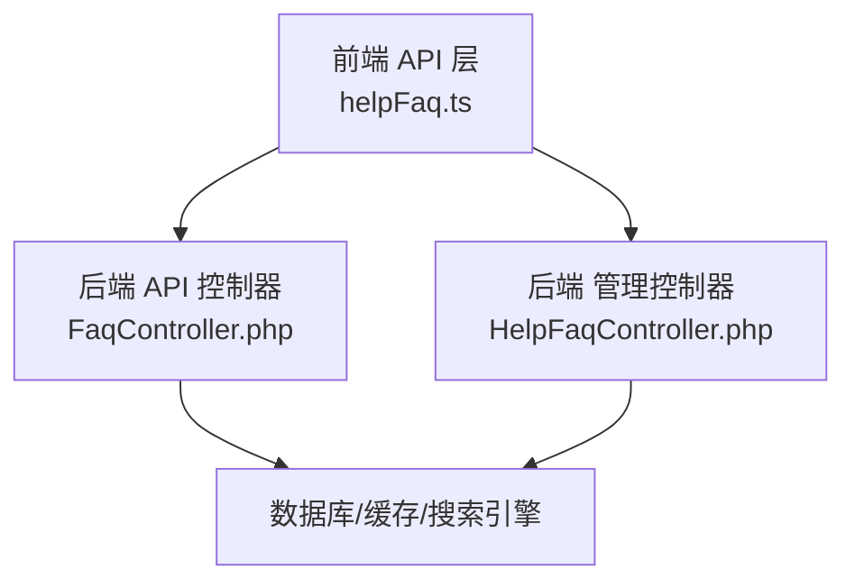
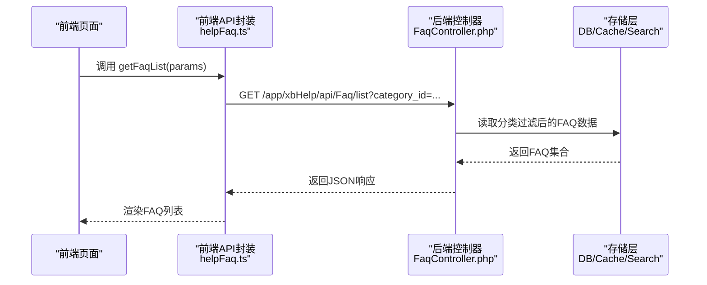
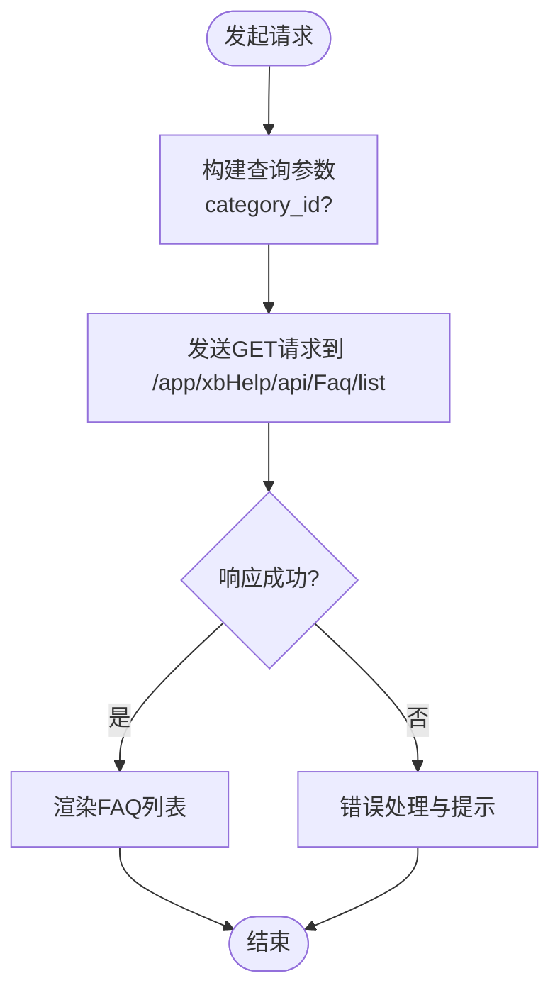
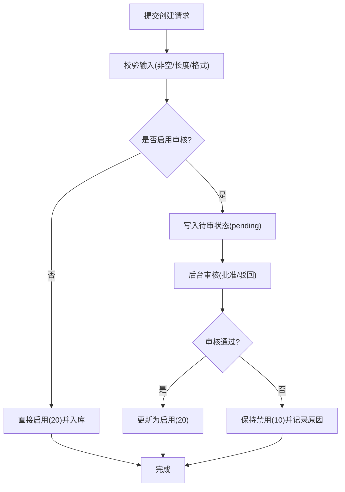
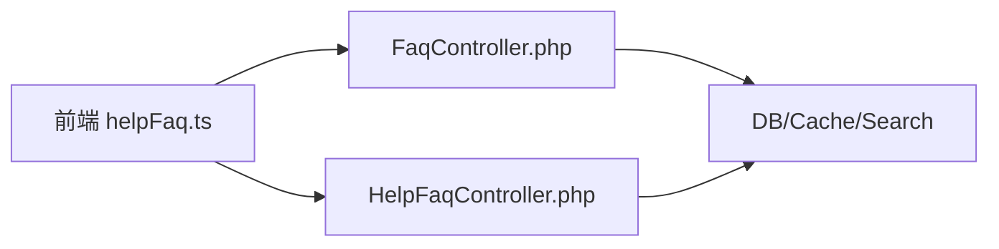

# FAQ管理接口

<cite>
**本文引用的文件**
- [frontend/src/api/helpFaq.ts](file://frontend/src/api/helpFaq.ts)
- [server/plugin/xbHelp/app/api/controller/FaqController.php](file://server/plugin/xbHelp/app/api/controller/FaqController.php)
- [server/plugin/xbHelp/app/admin/controller/HelpFaqController.php](file://server/plugin/xbHelp/app/admin/controller/HelpFaqController.php)
</cite>

## 目录
1. [简介](#简介)
2. [项目结构](#项目结构)
3. [核心组件](#核心组件)
4. [架构总览](#架构总览)
5. [详细组件分析](#详细组件分析)
6. [依赖分析](#依赖分析)
7. [性能考虑](#性能考虑)
8. [故障排查指南](#故障排查指南)
9. [结论](#结论)
10. [附录](#附录)

## 简介
本文件为“帮助文档FAQ（常见问题）”管理功能的API接口文档，聚焦问答对的创建、编辑、查询等核心操作，并说明问题标题、答案内容、关键词、浏览量统计等字段的管理方式。同时覆盖FAQ的分类关联、热门问题排序、搜索索引优化、批量管理、内容审核与访问统计等高级特性。

## 项目结构
前端通过统一的请求封装调用后端插件提供的REST接口；后端由xbHelp插件提供控制器实现，分别包含面向前台的FaqController和面向后台管理的HelpFaqController。

图表来源
- [frontend/src/api/helpFaq.ts](file://frontend/src/api/helpFaq.ts)
- [server/plugin/xbHelp/app/api/controller/FaqController.php](file://server/plugin/xbHelp/app/api/controller/FaqController.php)
- [server/plugin/xbHelp/app/admin/controller/HelpFaqController.php](file://server/plugin/xbHelp/app/admin/controller/HelpFaqController.php)

章节来源
- [frontend/src/api/helpFaq.ts](file://frontend/src/api/helpFaq.ts)
- [server/plugin/xbHelp/app/api/controller/FaqController.php](file://server/plugin/xbHelp/app/api/controller/FaqController.php)
- [server/plugin/xbHelp/app/admin/controller/HelpFaqController.php](file://server/plugin/xbHelp/app/admin/controller/HelpFaqController.php)

## 核心组件
- 前端API封装：定义FAQ列表查询参数与返回结构，并提供获取FAQ列表的方法。
- 后端API控制器：提供FAQ相关接口（如列表、详情、创建、更新、删除、排序、审核、统计等）。
- 后端管理控制器：提供后台管理所需的批量操作、审核流程、数据导出等能力。

章节来源
- [frontend/src/api/helpFaq.ts](file://frontend/src/api/helpFaq.ts)
- [server/plugin/xbHelp/app/api/controller/FaqController.php](file://server/plugin/xbHelp/app/api/controller/FaqController.php)
- [server/plugin/xbHelp/app/admin/controller/HelpFaqController.php](file://server/plugin/xbHelp/app/admin/controller/HelpFaqController.php)

## 架构总览
以下序列图展示“获取FAQ列表”的前端到后端的调用链路。

图表来源
- [frontend/src/api/helpFaq.ts](file://frontend/src/api/helpFaq.ts)
- [server/plugin/xbHelp/app/api/controller/FaqController.php](file://server/plugin/xbHelp/app/api/controller/FaqController.php)

## 详细组件分析

### 数据模型与字段规范
- 基础字段
  - id: 唯一标识
  - category_id: 分类ID，用于FAQ分类关联
  - question: 问题标题
  - answer: 答案内容
  - sort: 排序权重
  - status: 状态码（例如禁用/启用）
  - create_at/update_at: 时间戳
- 扩展字段（建议）
  - keywords: 关键词数组或逗号分隔字符串，用于搜索索引
  - view_count: 浏览量统计
  - is_hot: 是否热门标记
  - audit_status: 审核状态（待审/通过/驳回）
  - cover_image: 封面图URL（可选）
  - tags: 标签集合（可选）

章节来源
- [frontend/src/api/helpFaq.ts](file://frontend/src/api/helpFaq.ts)

### 接口清单与调用示例

#### 1) 获取FAQ列表
- 方法: GET
- 路径: /app/xbHelp/api/Faq/list
- 查询参数
  - category_id?: number | 按分类筛选
- 返回
  - 数组: FAQ条目集合（含id、question、answer、sort、status、create_at、update_at等）
- 前端调用示例
  - 参考路径: [getFaqList](file://frontend/src/api/helpFaq.ts)

图表来源
- [frontend/src/api/helpFaq.ts](file://frontend/src/api/helpFaq.ts)

章节来源
- [frontend/src/api/helpFaq.ts](file://frontend/src/api/helpFaq.ts)

#### 2) 获取FAQ详情
- 方法: GET
- 路径: /app/xbHelp/api/Faq/detail
- 路径参数
  - id: number | FAQ主键
- 返回
  - FAQ对象（含question、answer、keywords、view_count、audit_status等）
- 使用场景
  - 点击FAQ条目查看完整答案与元信息

章节来源
- [server/plugin/xbHelp/app/api/controller/FaqController.php](file://server/plugin/xbHelp/app/api/controller/FaqController.php)

#### 3) 创建FAQ
- 方法: POST
- 路径: /app/xbHelp/api/Faq/create
- 请求体
  - category_id: number
  - question: string
  - answer: string
  - keywords?: string[] | string
  - sort?: number
  - status?: '10' | '20'
- 返回
  - 新建FAQ的id及状态码
- 注意
  - 若开启内容审核，默认可能进入“待审”状态

章节来源
- [server/plugin/xbHelp/app/api/controller/FaqController.php](file://server/plugin/xbHelp/app/api/controller/FaqController.php)

#### 4) 更新FAQ
- 方法: PUT/PATCH
- 路径: /app/xbHelp/api/Faq/update
- 请求体
  - id: number
  - 可更新字段: category_id, question, answer, keywords, sort, status 等
- 返回
  - 更新结果与最新数据快照

章节来源
- [server/plugin/xbHelp/app/api/controller/FaqController.php](file://server/plugin/xbHelp/app/api/controller/FaqController.php)

#### 5) 删除FAQ
- 方法: DELETE
- 路径: /app/xbHelp/api/Faq/delete
- 请求体
  - id: number
- 返回
  - 删除结果

章节来源
- [server/plugin/xbHelp/app/api/controller/FaqController.php](file://server/plugin/xbHelp/app/api/controller/FaqController.php)

#### 6) 批量操作（后台）
- 方法: POST
- 路径: /app/xbHelp/api/Faq/batch
- 请求体
  - ids: number[]
  - action: 'enable' | 'disable' | 'delete' | 'set_hot' | 'set_audit_pass' | 'set_audit_reject'
- 返回
  - 批量执行结果与失败明细

章节来源
- [server/plugin/xbHelp/app/admin/controller/HelpFaqController.php](file://server/plugin/xbHelp/app/admin/controller/HelpFaqController.php)

#### 7) 内容审核（后台）
- 方法: POST
- 路径: /app/xbHelp/api/Faq/audit
- 请求体
  - id: number
  - audit_status: 'pending' | 'approved' | 'rejected'
  - remark?: string
- 返回
  - 审核结果与当前状态

章节来源
- [server/plugin/xbHelp/app/admin/controller/HelpFaqController.php](file://server/plugin/xbHelp/app/admin/controller/HelpFaqController.php)

#### 8) 访问统计（后台）
- 方法: GET
- 路径: /app/xbHelp/api/Faq/statistics
- 查询参数
  - start_time?: string (YYYY-MM-DD)
  - end_time?: string (YYYY-MM-DD)
  - top_n?: number
- 返回
  - 汇总指标与Top N热门FAQ（按view_count或综合热度）

章节来源
- [server/plugin/xbHelp/app/admin/controller/HelpFaqController.php](file://server/plugin/xbHelp/app/admin/controller/HelpFaqController.php)

#### 9) 搜索与索引优化
- 方法: GET
- 路径: /app/xbHelp/api/Faq/search
- 查询参数
  - q: string | 搜索词
  - category_id?: number
  - keyword?: string
  - page?: number
  - page_size?: number
  - sort_by?: 'hot' | 'recent' | 'views'
- 返回
  - 搜索结果集与分页信息
- 说明
  - 支持基于question、answer、keywords的多字段检索
  - 可按热度、最近更新时间、浏览量排序

章节来源
- [server/plugin/xbHelp/app/api/controller/FaqController.php](file://server/plugin/xbHelp/app/api/controller/FaqController.php)

### 字段管理与业务规则
- 问题标题(question)
  - 必填，长度限制建议：1-200字符
  - 作为搜索主字段之一
- 答案内容(answer)
  - 必填，支持富文本或Markdown
  - 建议对敏感词进行过滤
- 关键词(keywords)
  - 选填，用于搜索索引与推荐
  - 建议标准化（小写、去重、同义词映射）
- 浏览量(view_count)
  - 自动递增，避免高频写入，采用异步计数或Redis聚合
- 排序(sort)
  - 数值越大越靠前，或反之，需统一约定
- 状态(status)
  - 10=禁用，20=启用
- 审核(audit_status)
  - pending/approved/rejected，配合后台审核接口使用
- 分类(category_id)
  - 用于列表筛选与导航组织

章节来源
- [frontend/src/api/helpFaq.ts](file://frontend/src/api/helpFaq.ts)
- [server/plugin/xbHelp/app/api/controller/FaqController.php](file://server/plugin/xbHelp/app/api/controller/FaqController.php)
- [server/plugin/xbHelp/app/admin/controller/HelpFaqController.php](file://server/plugin/xbHelp/app/admin/controller/HelpFaqController.php)

### 流程图：创建与审核流水线

图表来源
- [server/plugin/xbHelp/app/api/controller/FaqController.php](file://server/plugin/xbHelp/app/api/controller/FaqController.php)
- [server/plugin/xbHelp/app/admin/controller/HelpFaqController.php](file://server/plugin/xbHelp/app/admin/controller/HelpFaqController.php)

## 依赖分析
- 前端依赖
  - 请求封装与白名单配置
  - 类型定义与返回结构
- 后端依赖
  - 路由注册与权限控制
  - 数据持久化与缓存/搜索引擎
  - 审计日志与统计埋点

图表来源
- [frontend/src/api/helpFaq.ts](file://frontend/src/api/helpFaq.ts)
- [server/plugin/xbHelp/app/api/controller/FaqController.php](file://server/plugin/xbHelp/app/api/controller/FaqController.php)
- [server/plugin/xbHelp/app/admin/controller/HelpFaqController.php](file://server/plugin/xbHelp/app/admin/controller/HelpFaqController.php)

章节来源
- [frontend/src/api/helpFaq.ts](file://frontend/src/api/helpFaq.ts)
- [server/plugin/xbHelp/app/api/controller/FaqController.php](file://server/plugin/xbHelp/app/api/controller/FaqController.php)
- [server/plugin/xbHelp/app/admin/controller/HelpFaqController.php](file://server/plugin/xbHelp/app/admin/controller/HelpFaqController.php)

## 性能考虑
- 列表与搜索
  - 合理使用分页与限页大小
  - 对常用查询条件建立索引（category_id、status、sort、audit_status）
  - 搜索走独立搜索引擎，避免全表扫描
- 浏览量统计
  - 使用Redis原子累加+定时落库，降低DB压力
- 热门排序
  - 预计算热度分数（结合view_count、互动、时间衰减），定期刷新
- 缓存策略
  - 对静态或低频变更的FAQ列表做短TTL缓存
  - 热点FAQ详情强缓存+失效策略

[本节为通用性能建议，不直接分析具体文件]

## 故障排查指南
- 常见错误
  - 参数缺失或类型错误：检查category_id、id、page/page_size等
  - 权限不足：确认管理员角色与接口鉴权
  - 审核未通过：检查audit_status与remark
- 定位步骤
  - 核对请求路径与方法是否与接口清单一致
  - 查看后端日志与审计记录
  - 验证缓存/搜索引擎同步状态
- 快速自检
  - 先调用列表接口确认数据存在
  - 再调用详情接口确认单条数据完整性
  - 最后进行创建/更新/删除等操作

章节来源
- [server/plugin/xbHelp/app/api/controller/FaqController.php](file://server/plugin/xbHelp/app/api/controller/FaqController.php)
- [server/plugin/xbHelp/app/admin/controller/HelpFaqController.php](file://server/plugin/xbHelp/app/admin/controller/HelpFaqController.php)

## 结论
本文档围绕FAQ管理功能提供了完整的接口清单、字段规范与业务流程说明，涵盖创建、编辑、查询、批量管理、审核与统计等关键能力。建议在生产环境结合缓存与搜索引擎优化性能，并通过后台统计持续迭代热门与搜索体验。

[本节为总结性内容，不直接分析具体文件]

## 附录
- 前端调用示例路径
  - 获取FAQ列表: [getFaqList](file://frontend/src/api/helpFaq.ts)
- 后端控制器路径
  - 前台接口: [FaqController](file://server/plugin/xbHelp/app/api/controller/FaqController.php)
  - 后台接口: [HelpFaqController](file://server/plugin/xbHelp/app/admin/controller/HelpFaqController.php)