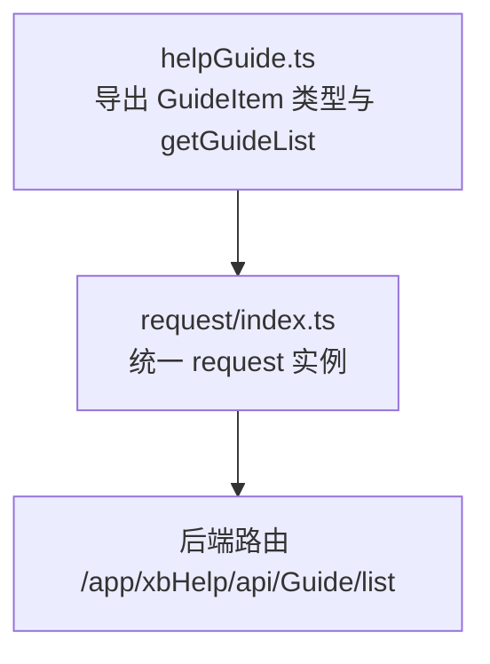
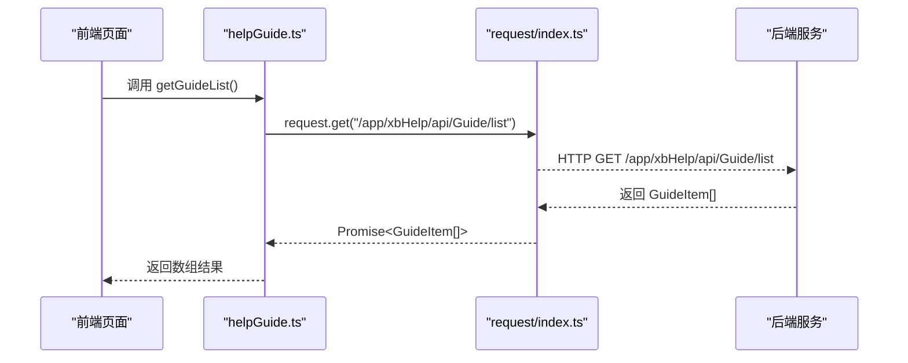
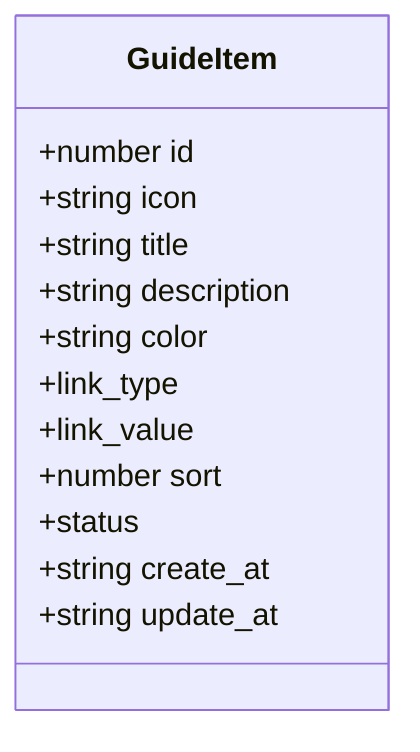
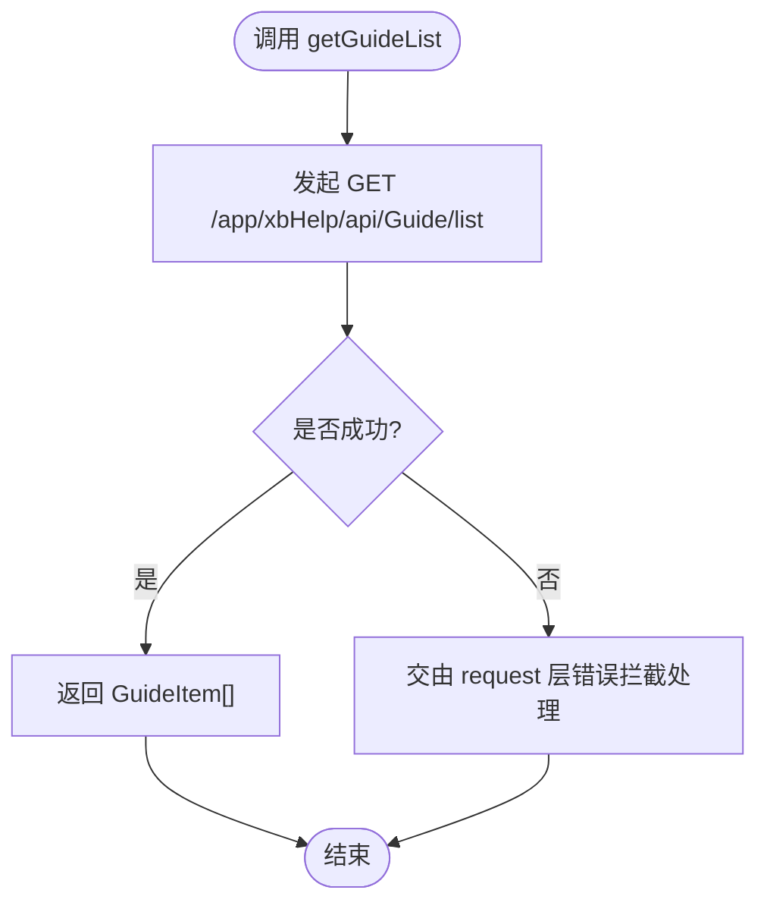

# 使用指南接口

<cite>
**本文引用的文件**   
- [frontend/src/api/helpGuide.ts](file://frontend/src/api/helpGuide.ts)
- [frontend/src/utils/request/index.ts](file://frontend/src/utils/request/index.ts)
</cite>

## 目录
1. [简介](#简介)
2. [项目结构](#项目结构)
3. [核心组件](#核心组件)
4. [架构总览](#架构总览)
5. [详细组件分析](#详细组件分析)
6. [依赖分析](#依赖分析)
7. [性能考虑](#性能考虑)
8. [故障排查指南](#故障排查指南)
9. [结论](#结论)
10. [附录](#附录)

## 简介
本文件为“使用指南”模块的API接口文档，聚焦于前端已实现的快速入门（Guide）能力：获取指南项列表、数据结构定义与请求封装。当前仓库中仅暴露了“获取快速入门列表”的接口；教程步骤编排、图文教程制作、视频嵌入、发布流程、版本更新、用户反馈收集等管理功能在现有代码中未找到对应实现，本文不虚构其接口细节。

## 项目结构
与“使用指南”相关的前端代码位于以下路径：
- API 定义与调用：frontend/src/api/helpGuide.ts
- HTTP 请求封装：frontend/src/utils/request/index.ts

图表来源
- [frontend/src/api/helpGuide.ts:1-35](file://frontend/src/api/helpGuide.ts#L1-L35)
- [frontend/src/utils/request/index.ts](file://frontend/src/utils/request/index.ts)

章节来源
- [frontend/src/api/helpGuide.ts:1-35](file://frontend/src/api/helpGuide.ts#L1-L35)
- [frontend/src/utils/request/index.ts](file://frontend/src/utils/request/index.ts)

## 核心组件
- 数据模型：GuideItem，描述快速入门项的字段与取值范围。
- 接口方法：getGuideList，用于获取快速入门列表。

章节来源
- [frontend/src/api/helpGuide.ts:4-27](file://frontend/src/api/helpGuide.ts#L4-L27)
- [frontend/src/api/helpGuide.ts:29-35](file://frontend/src/api/helpGuide.ts#L29-L35)

## 架构总览
下图展示了从页面到后端的调用链路：前端通过 helpGuide.ts 中的 getGuideList 发起请求，内部委托给 request 实例，最终访问后端 /app/xbHelp/api/Guide/list。

图表来源
- [frontend/src/api/helpGuide.ts:29-35](file://frontend/src/api/helpGuide.ts#L29-L35)
- [frontend/src/utils/request/index.ts](file://frontend/src/utils/request/index.ts)

## 详细组件分析

### 数据模型：GuideItem
- 用途：描述一个快速入门项的元信息与展示配置。
- 关键字段说明
  - id: number，唯一标识
  - icon: string，图标名称
  - title: string，标题
  - description: string，描述
  - color: string，图标颜色
  - link_type: '10' | '20'，链接类型：10=内部文章，20=外部链接
  - link_value: string | number，链接值：内部文章ID或外部链接URL
  - sort: number，排序权重
  - status: '10' | '20'，状态：10=禁用，20=启用
  - create_at: string，创建时间
  - update_at: string，更新时间

图表来源
- [frontend/src/api/helpGuide.ts:4-27](file://frontend/src/api/helpGuide.ts#L4-L27)

章节来源
- [frontend/src/api/helpGuide.ts:4-27](file://frontend/src/api/helpGuide.ts#L4-L27)

### 接口方法：getGuideList
- 功能：获取快速入门列表
- 请求方式：GET
- 请求路径：/app/xbHelp/api/Guide/list
- 请求参数：无
- 响应体：GuideItem[]
- 错误处理：由 request 层统一拦截并抛出（具体策略见请求封装文件）

图表来源
- [frontend/src/api/helpGuide.ts:29-35](file://frontend/src/api/helpGuide.ts#L29-L35)
- [frontend/src/utils/request/index.ts](file://frontend/src/utils/request/index.ts)

章节来源
- [frontend/src/api/helpGuide.ts:29-35](file://frontend/src/api/helpGuide.ts#L29-L35)
- [frontend/src/utils/request/index.ts](file://frontend/src/utils/request/index.ts)

## 依赖分析
- helpGuide.ts 依赖 request 实例进行网络请求。
- request 实例负责基础 URL、拦截器、错误处理等通用逻辑。
- 当前 Guide 模块仅依赖上述两个文件，耦合度低、职责清晰。

图表来源
- [frontend/src/api/helpGuide.ts:1-35](file://frontend/src/api/helpGuide.ts#L1-L35)
- [frontend/src/utils/request/index.ts](file://frontend/src/utils/request/index.ts)

章节来源
- [frontend/src/api/helpGuide.ts:1-35](file://frontend/src/api/helpGuide.ts#L1-L35)
- [frontend/src/utils/request/index.ts](file://frontend/src/utils/request/index.ts)

## 性能考虑
- 列表接口为轻量查询，建议在前端做必要的缓存（如按业务维度缓存最近一次结果），减少重复请求。
- 若后续扩展分页或筛选，应结合服务端分页与前端虚拟滚动优化渲染性能。
- 图片资源（icon/color）建议配合CDN与懒加载策略。

## 故障排查指南
- 网络异常：检查 request 层的错误拦截与重试策略，确认后端地址与鉴权是否正确。
- 数据为空：确认后端是否返回空数组而非 null；前端需对空数组做友好提示。
- 字段缺失：对比 GuideItem 字段定义，确保后端响应包含必要字段。
- 权限问题：若需要登录态，检查 token 注入与白名单配置。

章节来源
- [frontend/src/utils/request/index.ts](file://frontend/src/utils/request/index.ts)

## 结论
当前“使用指南”模块在前端实现了快速入门列表的读取能力，数据结构明确、调用链路简洁。教程步骤编排、图文教程制作、视频嵌入、发布流程、版本更新、用户反馈收集等功能尚未在当前仓库中发现对应实现，建议在后续迭代中逐步完善，并在新增接口时遵循统一的 request 封装规范与类型定义约定。

## 附录
- 如需扩展更多指南管理能力（如创建、编辑、删除、排序、状态切换、版本管理等），可参考现有 GuideItem 字段风格，在后端补充相应控制器与路由，并在前端新增对应的 API 方法与类型定义。
- 多媒体支持（图片、视频）可在内容模型中增加媒体字段，并结合上传与播放组件进行集成。