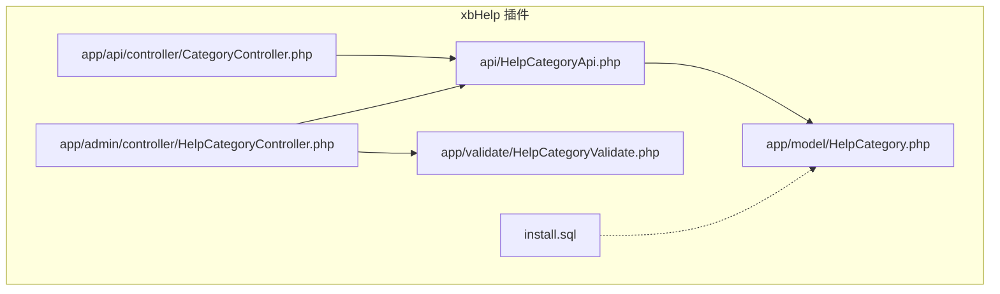
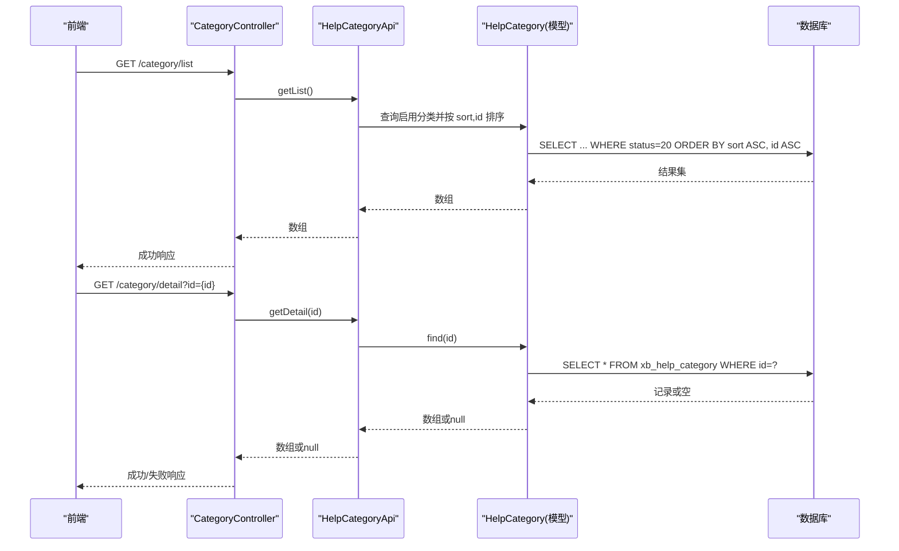
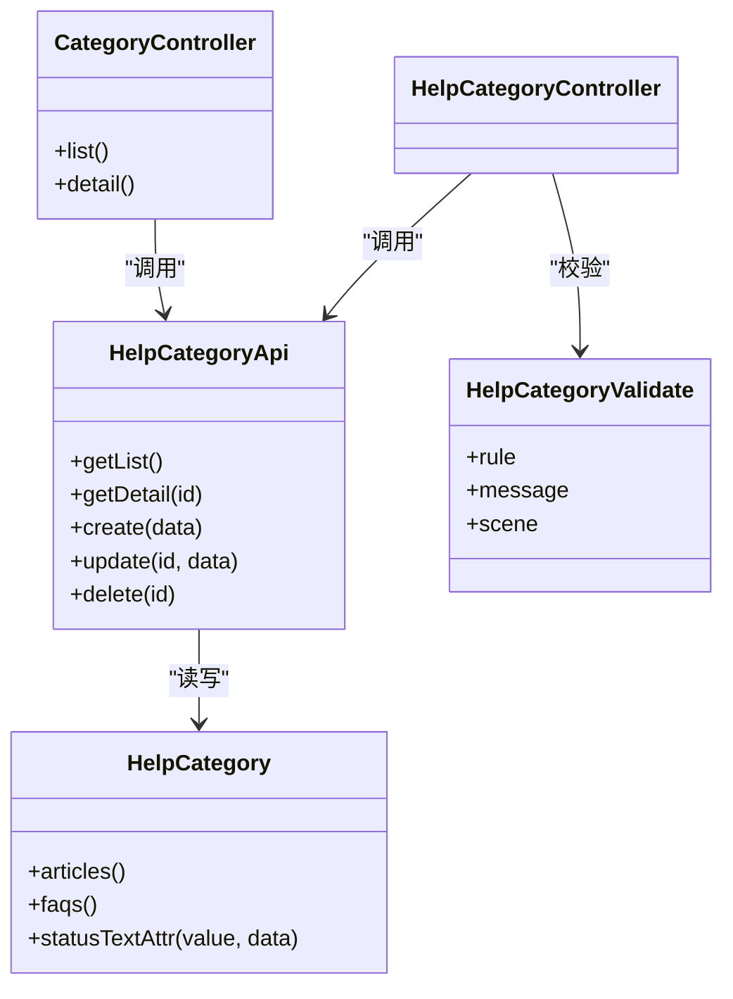

# 分类管理接口

<cite>
**本文引用的文件**   
- [HelpCategoryApi.php](file://server/plugin/xbHelp/api/HelpCategoryApi.php)
- [CategoryController.php](file://server/plugin/xbHelp/app/api/controller/CategoryController.php)
- [HelpCategoryController.php](file://server/plugin/xbHelp/app/admin/controller/HelpCategoryController.php)
- [HelpCategoryValidate.php](file://server/plugin/xbHelp/app/validate/HelpCategoryValidate.php)
- [HelpCategory.php](file://server/plugin/xbHelp/app/model/HelpCategory.php)
- [install.sql](file://server/plugin/xbHelp/install.sql)
</cite>

## 目录
1. [简介](#简介)
2. [项目结构](#项目结构)
3. [核心组件](#核心组件)
4. [架构总览](#架构总览)
5. [详细组件分析](#详细组件分析)
6. [依赖关系分析](#依赖关系分析)
7. [性能与扩展性](#性能与扩展性)
8. [故障排查指南](#故障排查指南)
9. [结论](#结论)
10. [附录：数据模型与字段说明](#附录数据模型与字段说明)

## 简介
本文件面向“帮助文档分类管理”的API接口，覆盖以下能力：
- 分类列表与详情查询（对外公开）
- 分类新增、修改、删除（后台管理）
- 排序权重设置（sort）
- 状态控制（启用/禁用）
- 事件钩子（创建、更新、删除前后事件）
- 表单校验规则（名称、图标、描述、排序、状态）

注意：当前仓库未实现树形层级、父子级联、路径生成、批量导入导出、拖拽排序、权限继承等高级特性。如需这些能力，可在现有基础上进行扩展，并在本文“扩展建议”部分参考实现思路。

## 项目结构
围绕“帮助分类”的核心代码分布在 xbHelp 插件中，包含 API 层、控制器、模型、验证器与数据库脚本。

图表来源
- [HelpCategoryApi.php:1-133](file://server/plugin/xbHelp/api/HelpCategoryApi.php#L1-L133)
- [CategoryController.php:1-54](file://server/plugin/xbHelp/app/api/controller/CategoryController.php#L1-L54)
- [HelpCategoryController.php:1-173](file://server/plugin/xbHelp/app/admin/controller/HelpCategoryController.php#L1-L173)
- [HelpCategory.php:1-50](file://server/plugin/xbHelp/app/model/HelpCategory.php#L1-L50)
- [HelpCategoryValidate.php:1-39](file://server/plugin/xbHelp/app/validate/HelpCategoryValidate.php#L1-L39)
- [install.sql:1-106](file://server/plugin/xbHelp/install.sql#L1-L106)

章节来源
- [HelpCategoryApi.php:1-133](file://server/plugin/xbHelp/api/HelpCategoryApi.php#L1-L133)
- [CategoryController.php:1-54](file://server/plugin/xbHelp/app/api/controller/CategoryController.php#L1-L54)
- [HelpCategoryController.php:1-173](file://server/plugin/xbHelp/app/admin/controller/HelpCategoryController.php#L1-L173)
- [HelpCategory.php:1-50](file://server/plugin/xbHelp/app/model/HelpCategory.php#L1-L50)
- [HelpCategoryValidate.php:1-39](file://server/plugin/xbHelp/app/validate/HelpCategoryValidate.php#L1-L39)
- [install.sql:1-106](file://server/plugin/xbHelp/install.sql#L1-L106)

## 核心组件
- 对外API控制器：提供无需登录的分类列表与详情接口
- 管理类API：封装分类的CRUD与事件分发
- 后台控制器：提供后台管理页面所需的增删改查与快速编辑
- 模型：定义关联关系与状态文本获取器
- 验证器：统一参数校验规则与场景
- 数据库脚本：定义分类表结构与索引

章节来源
- [CategoryController.php:1-54](file://server/plugin/xbHelp/app/api/controller/CategoryController.php#L1-L54)
- [HelpCategoryApi.php:1-133](file://server/plugin/xbHelp/api/HelpCategoryApi.php#L1-L133)
- [HelpCategoryController.php:1-173](file://server/plugin/xbHelp/app/admin/controller/HelpCategoryController.php#L1-L173)
- [HelpCategory.php:1-50](file://server/plugin/xbHelp/app/model/HelpCategory.php#L1-L50)
- [HelpCategoryValidate.php:1-39](file://server/plugin/xbHelp/app/validate/HelpCategoryValidate.php#L1-L39)
- [install.sql:1-106](file://server/plugin/xbHelp/install.sql#L1-L106)

## 架构总览
请求从前端进入，经路由到控制器，再由控制器调用业务API，最终落库并触发事件。

图表来源
- [CategoryController.php:32-52](file://server/plugin/xbHelp/app/api/controller/CategoryController.php#L32-L52)
- [HelpCategoryApi.php:45-62](file://server/plugin/xbHelp/api/HelpCategoryApi.php#L45-L62)
- [HelpCategory.php:1-50](file://server/plugin/xbHelp/app/model/HelpCategory.php#L1-L50)
- [install.sql:1-11](file://server/plugin/xbHelp/install.sql#L1-L11)

## 详细组件分析

### 对外接口：分类列表与详情
- 接口列表
  - 分类列表：GET /category/list
    - 返回：已启用的分类集合，按 sort 升序、id 升序排列
  - 分类详情：GET /category/detail?id={int}
    - 返回：指定ID的分类信息；不存在时返回错误提示

- 行为说明
  - 列表接口无需登录
  - 详情接口无需登录，但需传入有效的 id 参数

- 关键流程
  - 控制器接收请求后调用 HelpCategoryApi 对应方法
  - API 层通过模型查询并返回数组

章节来源
- [CategoryController.php:27-52](file://server/plugin/xbHelp/app/api/controller/CategoryController.php#L27-L52)
- [HelpCategoryApi.php:45-62](file://server/plugin/xbHelp/api/HelpCategoryApi.php#L45-L62)

### 后台管理：分类增删改查与快速编辑
- 功能点
  - 列表页：支持筛选（名称、状态）、分页、列展示（序号、图标、名称、排序、状态、创建时间）
  - 添加：弹窗表单提交，调用 API 创建
  - 修改：弹窗表单回显并提交，调用 API 更新
  - 删除：确认后调用 API 删除
  - 快速编辑：行内直接修改字段并保存

- 关键流程
  - 后台控制器负责渲染表单与处理请求
  - 所有写操作均委托给 HelpCategoryApi 完成，确保事件与事务一致性

章节来源
- [HelpCategoryController.php:33-173](file://server/plugin/xbHelp/app/admin/controller/HelpCategoryController.php#L33-L173)
- [HelpCategoryApi.php:69-131](file://server/plugin/xbHelp/api/HelpCategoryApi.php#L69-L131)

### 业务API：分类CRUD与事件
- 能力清单
  - 获取列表：仅返回启用状态的分类
  - 获取详情：按ID查找
  - 创建：保存前/后触发事件
  - 更新：保存前/后触发事件
  - 删除：删除前/后触发事件

- 事件枚举
  - 使用 HelpEventEnum 中的分类事件常量进行分发（创建、更新、删除的前后事件）

章节来源
- [HelpCategoryApi.php:45-131](file://server/plugin/xbHelp/api/HelpCategoryApi.php#L45-L131)

### 模型与关联
- 模型职责
  - 定义与文章、FAQ的一对多关联
  - 提供状态文本获取器，便于展示

- 关联关系
  - 分类 -> 文章：hasMany
  - 分类 -> FAQ：hasMany

章节来源
- [HelpCategory.php:25-48](file://server/plugin/xbHelp/app/model/HelpCategory.php#L25-L48)

### 表单校验规则
- 字段与规则
  - title：必填，最大长度限制
  - icon：可选，最大长度限制
  - description：可选，最大长度限制
  - sort：数字，范围限制
  - status：必填，限定取值

- 场景
  - add/edit 两个场景共用相同字段集合

章节来源
- [HelpCategoryValidate.php:21-37](file://server/plugin/xbHelp/app/validate/HelpCategoryValidate.php#L21-L37)

### 数据库设计
- 分类表字段
  - id：主键自增
  - title：分类名称
  - icon：图标标识
  - sort：排序权重（越小越靠前）
  - status：状态（10=禁用，20=启用）
  - create_at/update_at：时间戳

- 索引
  - 主键索引

章节来源
- [install.sql:1-11](file://server/plugin/xbHelp/install.sql#L1-L11)

## 依赖关系分析
- 控制器依赖API层，API层依赖模型
- 后台控制器同时依赖验证器
- 模型依赖基础模型与枚举类（用于状态文本）

图表来源
- [CategoryController.php:1-54](file://server/plugin/xbHelp/app/api/controller/CategoryController.php#L1-L54)
- [HelpCategoryApi.php:1-133](file://server/plugin/xbHelp/api/HelpCategoryApi.php#L1-L133)
- [HelpCategory.php:1-50](file://server/plugin/xbHelp/app/model/HelpCategory.php#L1-L50)
- [HelpCategoryValidate.php:1-39](file://server/plugin/xbHelp/app/validate/HelpCategoryValidate.php#L1-L39)

章节来源
- [CategoryController.php:1-54](file://server/plugin/xbHelp/app/api/controller/CategoryController.php#L1-L54)
- [HelpCategoryApi.php:1-133](file://server/plugin/xbHelp/api/HelpCategoryApi.php#L1-L133)
- [HelpCategory.php:1-50](file://server/plugin/xbHelp/app/model/HelpCategory.php#L1-L50)
- [HelpCategoryValidate.php:1-39](file://server/plugin/xbHelp/app/validate/HelpCategoryValidate.php#L1-L39)

## 性能与扩展性
- 查询优化
  - 列表查询已按 sort、id 排序，建议在数据库层面为 (status, sort, id) 建立复合索引以提升过滤与排序性能
- 缓存策略
  - 对“启用分类列表”可考虑加入短期缓存，降低频繁查询压力
- 事件扩展
  - 利用现有事件钩子，在外部监听分类变更，同步缓存或构建树形结构

[本节为通用建议，不直接分析具体文件]

## 故障排查指南
- 常见问题
  - 参数缺失：详情接口未传 id 将返回参数错误
  - 数据不存在：详情接口找不到记录将返回“分类不存在”
  - 保存失败：后台新增/修改返回“保存失败”，请检查校验规则与数据库写入
  - 删除失败：后台删除返回“删除失败”，可能因外键约束或数据不存在

- 定位建议
  - 查看控制器返回值与提示信息
  - 核对验证器规则是否满足
  - 检查数据库是否存在对应记录及状态值是否符合预期

章节来源
- [CategoryController.php:45-52](file://server/plugin/xbHelp/app/api/controller/CategoryController.php#L45-L52)
- [HelpCategoryController.php:127-153](file://server/plugin/xbHelp/app/admin/controller/HelpCategoryController.php#L127-L153)
- [HelpCategoryValidate.php:21-37](file://server/plugin/xbHelp/app/validate/HelpCategoryValidate.php#L21-L37)

## 结论
当前实现提供了帮助分类的基础管理能力：列表、详情、增删改、排序与状态控制，并通过事件机制预留了扩展点。若需要树形层级、父子级联、路径生成、批量导入导出、拖拽排序、权限继承等功能，可在现有模型与API层基础上进行增强。

[本节为总结性内容，不直接分析具体文件]

## 附录：数据模型与字段说明

### 数据表：xb_help_category
- 字段说明
  - id：主键，自增
  - title：分类名称（必填）
  - icon：图标标识（可选）
  - sort：排序权重（数值型，越小越靠前）
  - status：状态（10=禁用，20=启用）
  - create_at：创建时间
  - update_at：更新时间

- 索引
  - 主键索引

章节来源
- [install.sql:1-11](file://server/plugin/xbHelp/install.sql#L1-L11)

### 接口定义汇总

- 分类列表
  - 方法：GET
  - 路径：/category/list
  - 鉴权：无需登录
  - 请求参数：无
  - 响应：分类数组（按 sort 升序、id 升序）

- 分类详情
  - 方法：GET
  - 路径：/category/detail
  - 鉴权：无需登录
  - 请求参数：id（整数，必填）
  - 响应：分类对象；不存在时返回错误提示

- 后台新增分类
  - 方法：POST
  - 路径：/admin/help-category/add
  - 鉴权：管理员
  - 请求体：title、icon、description、sort、status
  - 响应：成功/失败消息

- 后台修改分类
  - 方法：PUT
  - 路径：/admin/help-category/edit
  - 鉴权：管理员
  - 请求体：同新增
  - 响应：成功/失败消息

- 后台删除分类
  - 方法：GET
  - 路径：/admin/help-category/del
  - 鉴权：管理员
  - 请求参数：id
  - 响应：成功/失败消息

- 后台快速编辑
  - 方法：POST
  - 路径：/admin/help-category/rowEdit
  - 鉴权：管理员
  - 请求体：id 与待修改字段
  - 响应：成功/失败消息

章节来源
- [CategoryController.php:32-52](file://server/plugin/xbHelp/app/api/controller/CategoryController.php#L32-L52)
- [HelpCategoryController.php:76-153](file://server/plugin/xbHelp/app/admin/controller/HelpCategoryController.php#L76-L153)

### 扩展建议（非现有实现）
- 树形层级与父子级联
  - 在分类表中增加 parent_id 字段，并提供递归构建树的方法
  - 在创建/移动节点时维护路径或深度字段，便于快速检索
- 批量导入导出
  - 提供 CSV/Excel 导入接口，解析后批量插入或更新
  - 导出接口按树形结构输出，包含父级路径
- 拖拽排序
  - 提供批量更新 sort 的接口，支持整棵树或子树的顺序调整
- 权限继承
  - 基于父级权限计算子级权限，或在访问时动态合并权限集合

[本节为概念性建议，不直接分析具体文件]