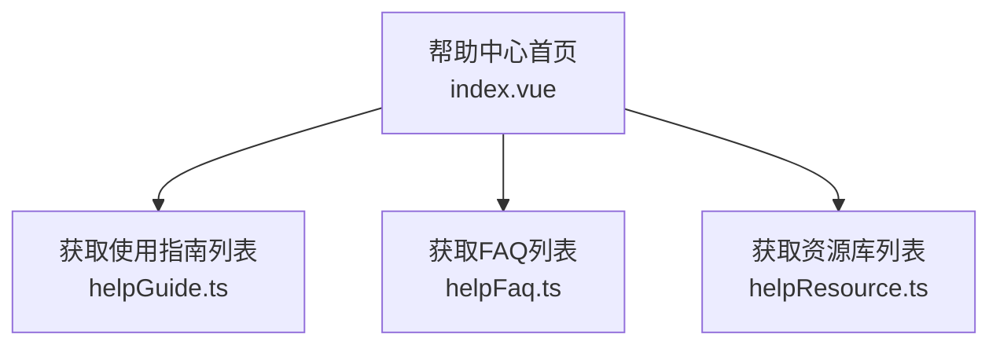
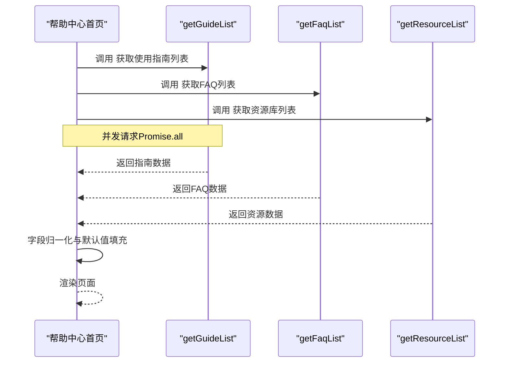
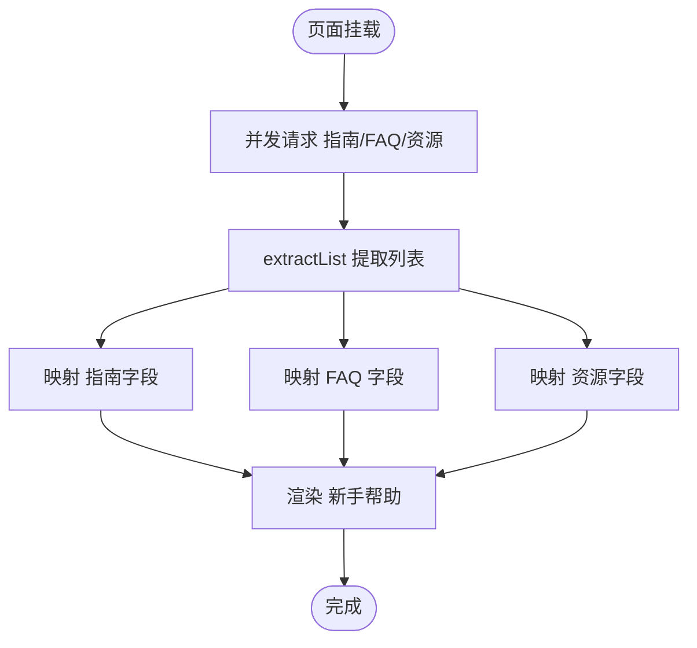
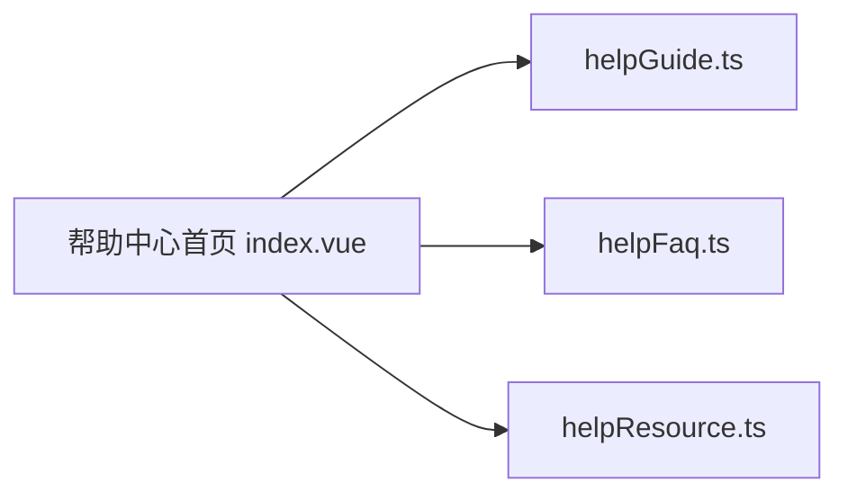

# 帮助文档接口

<cite>
**本文引用的文件**   
- [frontend/src/views/HelpCenterPage/index.vue](file://frontend/src/views/HelpCenterPage/index.vue)
- [frontend/src/api/helpGuide.ts](file://frontend/src/api/helpGuide.ts)
- [frontend/src/api/helpFaq.ts](file://frontend/src/api/helpFaq.ts)
- [frontend/src/api/helpResource.ts](file://frontend/src/api/helpResource.ts)
</cite>

## 目录
1. [简介](#简介)
2. [项目结构](#项目结构)
3. [核心组件](#核心组件)
4. [架构总览](#架构总览)
5. [详细组件分析](#详细组件分析)
6. [依赖分析](#依赖分析)
7. [性能考虑](#性能考虑)
8. [故障排查指南](#故障排查指南)
9. [结论](#结论)
10. [附录](#附录) 

## 简介
本文件为“帮助文档系统”的API接口文档，聚焦于前端已实现的帮助中心数据获取能力，覆盖以下范围：
- 使用指南（快速入门）列表
- FAQ 列表
- 资源库列表
- 页面聚合加载流程与错误处理

说明：
- 当前仓库中仅包含前端展示层对帮助中心的调用实现，未提供后端控制器、模型或路由定义。因此本文档基于前端源码进行接口契约归纳与调用示例说明。
- 若需扩展文章管理、分类管理、内容审核、版本控制、SEO优化等高级特性，可在现有前端调用基础上在后端新增对应接口并保持一致的请求/响应约定。

## 项目结构
与帮助文档相关的前端代码主要位于 views 与 api 两个目录：
- 视图层：帮助中心首页聚合展示
- API 层：分别封装了“使用指南”、“FAQ”、“资源库”的数据请求方法

图表来源
- [frontend/src/views/HelpCenterPage/index.vue:1-99](file://frontend/src/views/HelpCenterPage/index.vue#L1-L99)
- [frontend/src/api/helpGuide.ts](file://frontend/src/api/helpGuide.ts)
- [frontend/src/api/helpFaq.ts](file://frontend/src/api/helpFaq.ts)
- [frontend/src/api/helpResource.ts](file://frontend/src/api/helpResource.ts)

章节来源
- [frontend/src/views/HelpCenterPage/index.vue:1-99](file://frontend/src/views/HelpCenterPage/index.vue#L1-L99)

## 核心组件
- 帮助中心首页
  - 职责：并行拉取“使用指南”、“FAQ”、“资源库”三类数据，并进行字段归一化后渲染。
  - 关键行为：
    - 使用 Promise.all 并发请求三个接口
    - 对返回数据结构做兼容处理（支持数组或对象包裹 list/data）
    - 将不同来源字段映射到统一展示字段（如 title/desc/link_type/link_value 等）
- API 模块
  - helpGuide.ts：导出 getGuideList 用于获取使用指南列表
  - helpFaq.ts：导出 getFaqList 用于获取FAQ列表
  - helpResource.ts：导出 getResourceList 用于获取资源库列表

章节来源
- [frontend/src/views/HelpCenterPage/index.vue:1-99](file://frontend/src/views/HelpCenterPage/index.vue#L1-L99)
- [frontend/src/api/helpGuide.ts](file://frontend/src/api/helpGuide.ts)
- [frontend/src/api/helpFaq.ts](file://frontend/src/api/helpFaq.ts)
- [frontend/src/api/helpResource.ts](file://frontend/src/api/helpResource.ts)

## 架构总览
帮助中心首页通过三个独立的API模块获取数据，并在页面挂载时一次性并发加载，随后在UI中进行结构化展示。

图表来源
- [frontend/src/views/HelpCenterPage/index.vue:1-99](file://frontend/src/views/HelpCenterPage/index.vue#L1-L99)
- [frontend/src/api/helpGuide.ts](file://frontend/src/api/helpGuide.ts)
- [frontend/src/api/helpFaq.ts](file://frontend/src/api/helpFaq.ts)
- [frontend/src/api/helpResource.ts](file://frontend/src/api/helpResource.ts)

## 详细组件分析

### 帮助中心首页（聚合与渲染）
- 功能要点
  - 并发拉取三类数据
  - 兼容多种返回结构（数组或对象包裹）
  - 字段映射与默认值兜底
  - 错误捕获与日志输出
- 数据流
  - 入口：页面 onMounted 生命周期触发加载
  - 处理：extractList 函数统一提取列表
  - 映射：将后端字段映射为前端展示字段
  - 渲染：将标准化后的数据绑定至子组件

图表来源
- [frontend/src/views/HelpCenterPage/index.vue:1-99](file://frontend/src/views/HelpCenterPage/index.vue#L1-L99)

章节来源
- [frontend/src/views/HelpCenterPage/index.vue:1-99](file://frontend/src/views/HelpCenterPage/index.vue#L1-L99)

### 使用指南接口（getGuideList）
- 接口名称：getGuideList
- 用途：获取“使用指南/快速入门”列表
- 典型返回结构（兼容两种形式）
  - 直接数组：[{...}, {...}]
  - 对象包裹：{ list: [...] } 或 { data: [...] }
- 字段映射（前端期望）
  - icon：图标标识
  - title：标题
  - desc/description/content：描述
  - color：颜色样式
  - link_type：链接类型
  - link_value：链接值
- 调用示例（概念性）
  - 发起请求后，将返回数据传入 extractList 提取列表，再逐项映射为前端字段

章节来源
- [frontend/src/views/HelpCenterPage/index.vue:1-99](file://frontend/src/views/HelpCenterPage/index.vue#L1-L99)
- [frontend/src/api/helpGuide.ts](file://frontend/src/api/helpGuide.ts)

### FAQ接口（getFaqList）
- 接口名称：getFaqList
- 用途：获取常见问题列表
- 典型返回结构（兼容两种形式）
  - 直接数组：[{...}, {...}]
  - 对象包裹：{ list: [...] } 或 { data: [...] }
- 字段映射（前端期望）
  - question/title：问题
  - answer/content：答案
- 调用示例（概念性）
  - 将返回列表映射为 { question, answer } 结构供FAQ组件渲染

章节来源
- [frontend/src/views/HelpCenterPage/index.vue:1-99](file://frontend/src/views/HelpCenterPage/index.vue#L1-L99)
- [frontend/src/api/helpFaq.ts](file://frontend/src/api/helpFaq.ts)

### 资源库接口（getResourceList）
- 接口名称：getResourceList
- 用途：获取外部资源（文档、视频、社区等）列表
- 典型返回结构（兼容两种形式）
  - 直接数组：[{...}, {...}]
  - 对象包裹：{ list: [...] } 或 { data: [...] }
- 字段映射（前端期望）
  - icon：图标标识
  - title：标题
  - desc/description：描述
  - link_url：外链地址
- 调用示例（概念性）
  - 将返回列表映射为 { icon, title, desc, link_url } 结构供侧边栏渲染

章节来源
- [frontend/src/views/HelpCenterPage/index.vue:1-99](file://frontend/src/views/HelpCenterPage/index.vue#L1-L99)
- [frontend/src/api/helpResource.ts](file://frontend/src/api/helpResource.ts)

## 依赖分析
- 耦合关系
  - 帮助中心首页强依赖三个API模块的方法名与返回结构
  - 通过 extractList 降低对后端返回结构的耦合度，提升兼容性
- 潜在风险
  - 若后端返回结构变更且未遵循 list/data 包裹约定，可能导致解析失败
  - 字段命名不一致会导致展示异常（可通过默认值缓解）

图表来源
- [frontend/src/views/HelpCenterPage/index.vue:1-99](file://frontend/src/views/HelpCenterPage/index.vue#L1-L99)
- [frontend/src/api/helpGuide.ts](file://frontend/src/api/helpGuide.ts)
- [frontend/src/api/helpFaq.ts](file://frontend/src/api/helpFaq.ts)
- [frontend/src/api/helpResource.ts](file://frontend/src/api/helpResource.ts)

章节来源
- [frontend/src/views/HelpCenterPage/index.vue:1-99](file://frontend/src/views/HelpCenterPage/index.vue#L1-L99)

## 性能考虑
- 并发请求：使用 Promise.all 同时拉取三类数据，减少首屏等待时间
- 容错与降级：对缺失字段提供默认值，避免渲染中断
- 可扩展建议：
  - 引入缓存策略（本地存储或内存缓存）以减少重复请求
  - 分页与懒加载：当数据量增长时，按需加载与虚拟滚动可显著改善体验
  - 骨架屏与占位图：在网络延迟场景下提升感知性能

## 故障排查指南
- 常见问题
  - 页面空白或无数据：检查网络请求是否成功、返回结构是否符合预期
  - 字段显示为空：确认后端返回字段是否与前端映射一致
  - 并发失败导致整体失败：Promise.all 任一失败会短路，建议在业务层增加容错分支
- 定位步骤
  - 打开浏览器开发者工具，查看 Network 面板中三个接口的状态码与响应体
  - 在控制台查看错误日志（页面已对异常进行 console.error 输出）
  - 临时打印 extractList 的输入输出，验证数据提取逻辑

章节来源
- [frontend/src/views/HelpCenterPage/index.vue:1-99](file://frontend/src/views/HelpCenterPage/index.vue#L1-L99)

## 结论
当前帮助中心实现了“使用指南”、“FAQ”、“资源库”三类数据的聚合展示，具备并发加载与字段兼容能力。后续如需完善文章管理、分类管理、内容审核、版本控制、SEO优化等高级特性，可在后端新增相应接口并保持与前端一致的请求/响应约定，逐步扩展管理能力与用户体验。

## 附录
- 术语说明
  - 使用指南：面向新用户的快速上手指引
  - FAQ：常见问题解答
  - 资源库：外部参考资源集合
- 扩展建议（非当前实现）
  - 文章与分类CRUD：新增文章与分类的增删改查接口
  - 搜索索引：提供全文检索接口，支持关键词过滤
  - 版本控制：记录内容版本，支持回滚与对比
  - 权限管理：基于角色控制编辑/发布/审核权限
  - 富文本与多媒体：支持富文本编辑器与图片/视频上传
  - SEO优化：提供元信息配置与站点地图生成
  - 发布流程与审核：草稿-待审-已发布的状态机与审批流
  - 统计分析：访问量、停留时长、热门内容排行