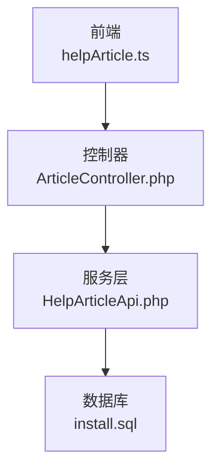
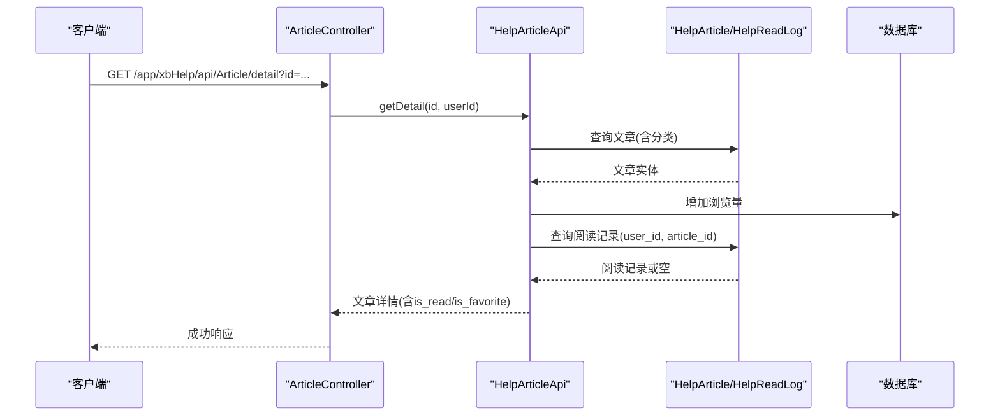
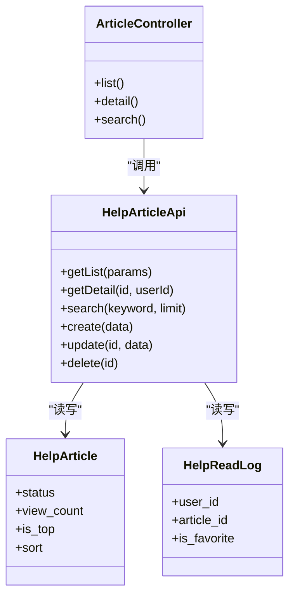

# 文章管理接口

<cite>
**本文引用的文件**   
- [frontend/src/api/helpArticle.ts](file://frontend/src/api/helpArticle.ts)
- [server/plugin/xbHelp/app/api/controller/ArticleController.php](file://server/plugin/xbHelp/app/api/controller/ArticleController.php)
- [server/plugin/xbHelp/api/HelpArticleApi.php](file://server/plugin/xbHelp/api/HelpArticleApi.php)
- [server/plugin/xbHelp/install.sql](file://server/plugin/xbHelp/install.sql)
</cite>

## 目录
1. [简介](#简介)
2. [项目结构](#项目结构)
3. [核心组件](#核心组件)
4. [架构总览](#架构总览)
5. [详细组件分析](#详细组件分析)
6. [依赖关系分析](#依赖关系分析)
7. [性能与扩展性](#性能与扩展性)
8. [故障排查指南](#故障排查指南)
9. [结论](#结论)
10. [附录：字段与状态说明](#附录字段与状态说明)

## 简介
本文档面向帮助文档文章管理功能，提供完整的 API 接口说明。内容覆盖前台公开的文章查询、搜索、分类关联、阅读记录与收藏等能力；同时给出后台管理端文章的增删改查（CRUD）流程、富文本内容处理、发布状态管理与排序置顶等特性。文档还包含错误处理机制、权限控制要点以及可扩展点（事件钩子），便于二次开发与集成。

## 项目结构
本功能由前端调用层、后端控制器与服务层组成，数据持久化通过数据库表完成。关键文件如下：
- 前端 API 封装：定义请求参数类型与接口路径
- 后端控制器：接收请求、校验参数、返回统一响应
- 服务层：业务逻辑、分页、搜索、计数、事件触发
- 数据库脚本：文章、分类、阅读记录等表结构

图表来源
- [frontend/src/api/helpArticle.ts](file://frontend/src/api/helpArticle.ts)
- [server/plugin/xbHelp/app/api/controller/ArticleController.php](file://server/plugin/xbHelp/app/api/controller/ArticleController.php)
- [server/plugin/xbHelp/api/HelpArticleApi.php](file://server/plugin/xbHelp/api/HelpArticleApi.php)
- [server/plugin/xbHelp/install.sql](file://server/plugin/xbHelp/install.sql)

章节来源
- [frontend/src/api/helpArticle.ts](file://frontend/src/api/helpArticle.ts)
- [server/plugin/xbHelp/app/api/controller/ArticleController.php](file://server/plugin/xbHelp/app/api/controller/ArticleController.php)
- [server/plugin/xbHelp/api/HelpArticleApi.php](file://server/plugin/xbHelp/api/HelpArticleApi.php)
- [server/plugin/xbHelp/install.sql](file://server/plugin/xbHelp/install.sql)

## 核心组件
- 前端 API 封装
  - 提供文章列表、详情、搜索、分类列表/详情、已读标记、收藏切换、收藏列表等调用方法
  - 使用统一的请求工具发起 HTTP 请求并返回 Promise
- 后端控制器
  - 暴露 /app/xbHelp/api/Article/* 系列接口
  - 声明无需登录的方法集合，实现参数获取与基础校验
- 服务层
  - 实现文章列表（支持按分类、关键词过滤）、详情（含浏览量自增、阅读/收藏状态填充）、搜索（标题/摘要/内容模糊匹配）、创建/更新/删除（含事件钩子）
- 数据模型与表
  - 文章表、分类表、阅读记录表等，定义字段、索引与约束

章节来源
- [frontend/src/api/helpArticle.ts](file://frontend/src/api/helpArticle.ts)
- [server/plugin/xbHelp/app/api/controller/ArticleController.php](file://server/plugin/xbHelp/app/api/controller/ArticleController.php)
- [server/plugin/xbHelp/api/HelpArticleApi.php](file://server/plugin/xbHelp/api/HelpArticleApi.php)
- [server/plugin/xbHelp/install.sql](file://server/plugin/xbHelp/install.sql)

## 架构总览
以下时序图展示“获取文章详情”的端到端调用链路，包括未登录与已登录两种场景下的阅读/收藏状态填充。

图表来源
- [server/plugin/xbHelp/app/api/controller/ArticleController.php](file://server/plugin/xbHelp/app/api/controller/ArticleController.php)
- [server/plugin/xbHelp/api/HelpArticleApi.php](file://server/plugin/xbHelp/api/HelpArticleApi.php)
- [server/plugin/xbHelp/install.sql](file://server/plugin/xbHelp/install.sql)

## 详细组件分析

### 前台文章接口（公开访问）
- 接口前缀：/app/xbHelp/api/Article
- 认证要求：list/detail/search 无需登录；其他接口（如 ReadLog）需登录

1) 文章列表
- 方法：GET
- 路径：/app/xbHelp/api/Article/list
- 查询参数
  - category_id: int，可选，按分类筛选
  - keyword: string，可选，按标题/摘要模糊匹配
  - page: int，默认 1
  - limit: int，默认 20
- 返回：分页后的文章数组（含分类信息）
- 行为说明：仅返回启用状态的文章；支持置顶优先、排序、ID倒序

2) 文章详情
- 方法：GET
- 路径：/app/xbHelp/api/Article/detail
- 查询参数
  - id: int，必填
- 返回：文章详情对象（含分类、是否已读、是否收藏）
- 行为说明：自动增加浏览量；若用户已登录则填充 is_read 与 is_favorite

3) 搜索文章
- 方法：GET
- 路径：/app/xbHelp/api/Article/search
- 查询参数
  - keyword: string，必填
  - limit: int，默认 10
- 返回：文章摘要列表（id、标题、摘要、封面、浏览量、是否置顶、创建时间）
- 行为说明：在标题、摘要、内容中进行模糊匹配

4) 分类相关
- 分类列表：GET /app/xbHelp/api/Category/list
- 分类详情：GET /app/xbHelp/api/Category/detail?id=...

5) 阅读与收藏（需登录）
- 标记已读：POST /app/xbHelp/api/ReadLog/markRead {article_id}
- 切换收藏：POST /app/xbHelp/api/ReadLog/toggleFavorite {article_id}
- 收藏列表：GET /app/xbHelp/api/ReadLog/favorites

章节来源
- [frontend/src/api/helpArticle.ts](file://frontend/src/api/helpArticle.ts)
- [server/plugin/xbHelp/app/api/controller/ArticleController.php](file://server/plugin/xbHelp/app/api/controller/ArticleController.php)
- [server/plugin/xbHelp/api/HelpArticleApi.php](file://server/plugin/xbHelp/api/HelpArticleApi.php)

### 后台文章管理（管理员）
- 入口控制器：HelpArticleController（后台管理界面）
- 主要能力
  - 列表：支持按标题、分类、状态筛选；显示序号、标题、所属分类、是否置顶、浏览量、状态、排序、创建时间；支持快速编辑行内操作
  - 新增：表单提交，包含标题、分类、摘要、是否置顶、状态、封面图、文章内容（富文本）
  - 修改：表单回显与保存
  - 删除：软/硬删除（依据模型实现）
  - 快速编辑：行内字段直接保存
- 表单字段
  - 标题、分类、摘要、是否置顶、状态、封面图、文章内容（富文本编辑器）
- 验证与事件
  - 使用验证器进行输入校验
  - 服务层在创建/更新/删除前后触发事件钩子，便于扩展（如缓存刷新、索引重建）

章节来源
- [server/plugin/xbHelp/app/admin/controller/HelpArticleController.php](file://server/plugin/xbHelp/app/admin/controller/HelpArticleController.php)
- [server/plugin/xbHelp/api/HelpArticleApi.php](file://server/plugin/xbHelp/api/HelpArticleApi.php)

### 数据模型与字段说明
- 文章表（核心字段）
  - id: 主键
  - category_id: 分类ID
  - title: 标题
  - summary: 摘要
  - content: 富文本内容
  - cover: 封面图URL
  - sort: 排序
  - view_count: 浏览次数
  - is_top: 是否置顶（10=否，20=是）
  - status: 状态（10=禁用，20=启用）
  - create_at/update_at: 时间戳
- 分类表
  - id/title/icon/sort/status/create_at/update_at
- 阅读记录表
  - user_id/article_id/is_favorite/create_at/update_at（唯一键：user_id+article_id）

章节来源
- [server/plugin/xbHelp/install.sql](file://server/plugin/xbHelp/install.sql)

### 富文本内容与SEO优化建议
- 富文本内容
  - 后台表单使用富文本编辑器，字段为 content（长文本）
  - 建议在渲染时做 XSS 过滤与图片资源安全校验
- SEO 优化
  - 利用 title、summary、cover 生成页面元信息
  - 可结合路由 slug、canonical 链接、结构化数据增强检索体验

[本节为通用实践建议，不直接分析具体代码文件]

### 版本控制与草稿策略
- 当前实现未内置文章版本表与草稿态
- 建议方案
  - 引入版本表：记录每次变更的快照（content、summary、cover 等）
  - 草稿态：新增 status 枚举值（如 30=草稿），前台仅展示启用态，后台支持草稿/发布切换
  - 合并发布：将草稿合并到主版本，保留历史版本用于回滚

[本节为概念性设计建议，不直接分析具体代码文件]

### 权限控制
- 前台接口
  - list/detail/search 无需登录
  - ReadLog 相关接口需要登录（基于中间件/鉴权）
- 后台管理
  - 通过后台权限体系控制菜单与操作权限（控制器中未体现具体鉴权逻辑）

章节来源
- [server/plugin/xbHelp/app/api/controller/ArticleController.php](file://server/plugin/xbHelp/app/api/controller/ArticleController.php)

### 批量操作与内容审核
- 批量操作
  - 当前未提供批量接口；可在后台列表页扩展批量选择与批量更新状态/置顶等
- 内容审核
  - 可通过事件钩子在创建/更新后接入审核流程（如异步任务、人工审核队列）

[本节为扩展建议，不直接分析具体代码文件]

## 依赖关系分析
- 前端依赖
  - 使用统一请求工具发起 HTTP 请求，集中管理拦截与错误处理
- 控制器依赖
  - 依赖服务层 HelpArticleApi 完成业务逻辑
  - 使用框架提供的成功/失败响应封装
- 服务层依赖
  - 依赖模型类进行数据读写
  - 使用事件系统触发生命周期钩子
- 数据库依赖
  - 文章、分类、阅读记录三张核心表

图表来源
- [server/plugin/xbHelp/app/api/controller/ArticleController.php](file://server/plugin/xbHelp/app/api/controller/ArticleController.php)
- [server/plugin/xbHelp/api/HelpArticleApi.php](file://server/plugin/xbHelp/api/HelpArticleApi.php)
- [server/plugin/xbHelp/install.sql](file://server/plugin/xbHelp/install.sql)

章节来源
- [server/plugin/xbHelp/app/api/controller/ArticleController.php](file://server/plugin/xbHelp/app/api/controller/ArticleController.php)
- [server/plugin/xbHelp/api/HelpArticleApi.php](file://server/plugin/xbHelp/api/HelpArticleApi.php)
- [server/plugin/xbHelp/install.sql](file://server/plugin/xbHelp/install.sql)

## 性能与扩展性
- 查询优化
  - 列表与搜索均对常用字段建立索引（category_id、status），提升过滤与排序效率
  - 详情页浏览量采用增量更新，避免全量写入
- 分页与限流
  - 列表默认分页，搜索限制返回数量，防止大结果集
- 扩展点
  - 服务层在创建/更新/删除前后触发事件，可用于缓存失效、搜索引擎同步、审计日志等

章节来源
- [server/plugin/xbHelp/api/HelpArticleApi.php](file://server/plugin/xbHelp/api/HelpArticleApi.php)
- [server/plugin/xbHelp/install.sql](file://server/plugin/xbHelp/install.sql)

## 故障排查指南
- 常见错误
  - 参数缺失：如 detail 缺少 id，search 缺少 keyword，会返回参数错误提示
  - 数据不存在：查询不到文章时返回相应失败消息
  - 保存失败：后台新增/修改时，若保存失败返回失败提示
- 定位建议
  - 检查请求参数是否符合接口定义
  - 查看控制器返回的统一响应体，确认错误码与消息
  - 关注服务层事件钩子是否抛出异常导致事务回滚

章节来源
- [server/plugin/xbHelp/app/api/controller/ArticleController.php](file://server/plugin/xbHelp/app/api/controller/ArticleController.php)
- [server/plugin/xbHelp/api/HelpArticleApi.php](file://server/plugin/xbHelp/api/HelpArticleApi.php)

## 结论
该文章管理模块提供了完整的前台公开查询与后台管理能力，涵盖分类关联、搜索、阅读记录与收藏、富文本内容、发布状态与排序置顶等核心特性。通过服务层的事件钩子，系统具备良好的扩展性，可轻松对接审核、缓存、搜索索引等外部能力。建议后续引入版本控制与草稿态，以完善内容生产与发布工作流。

## 附录：字段与状态说明
- 文章状态
  - 10=禁用，20=启用
- 是否置顶
  - 10=否，20=是
- 阅读记录收藏状态
  - 10=否，20=是
- 分类状态
  - 10=禁用，20=启用

章节来源
- [server/plugin/xbHelp/install.sql](file://server/plugin/xbHelp/install.sql)