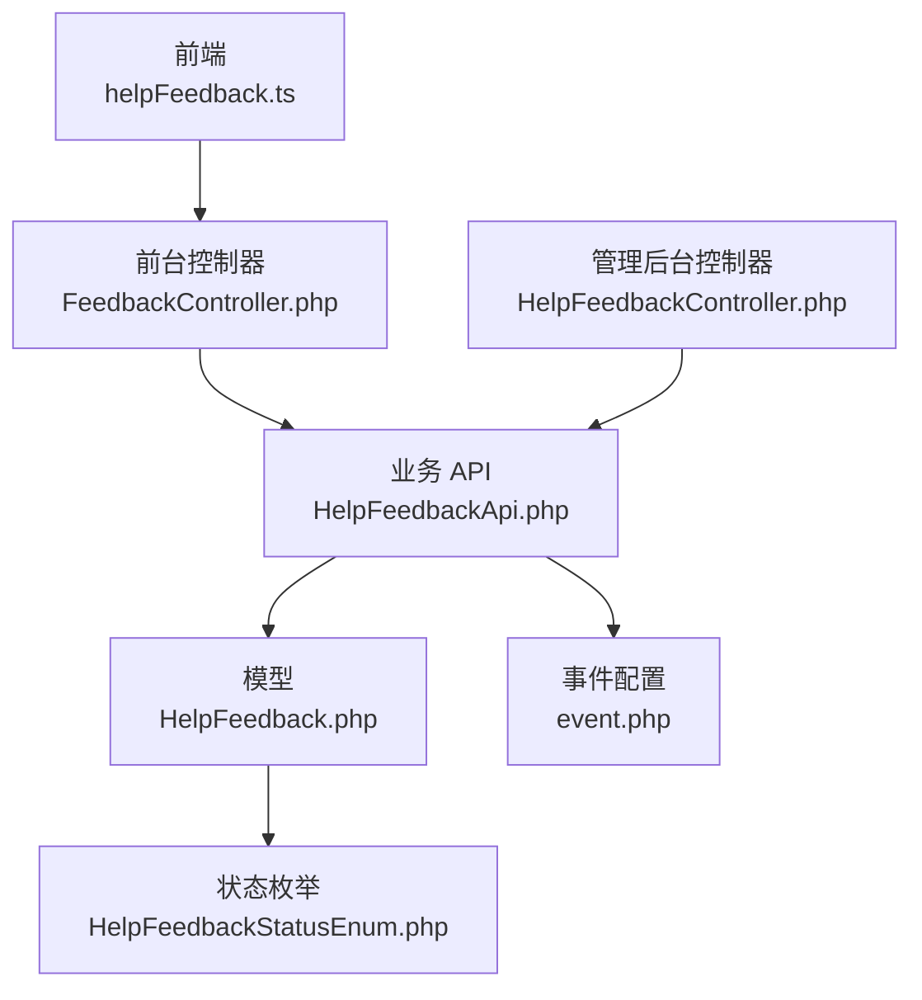
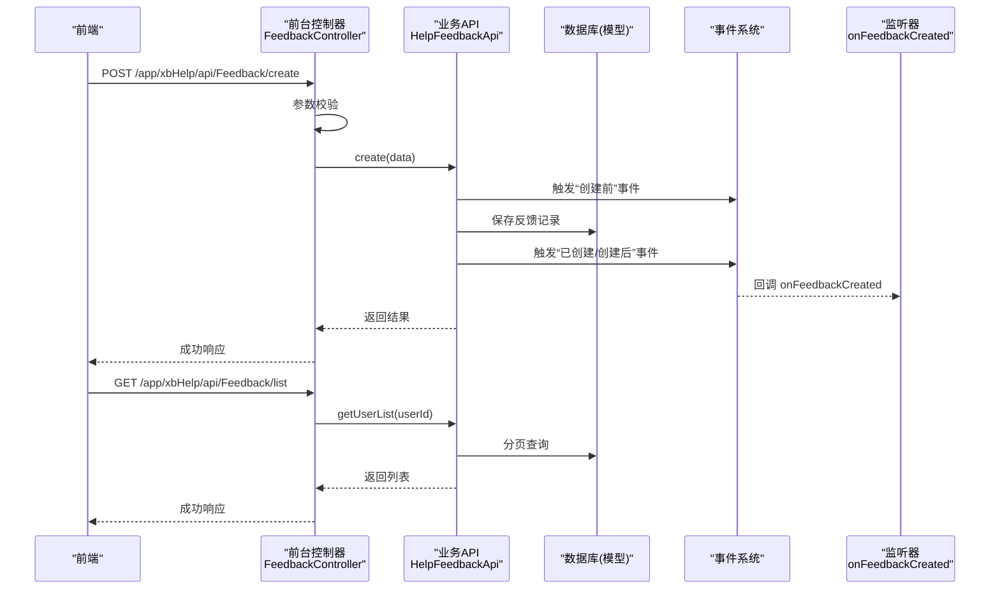
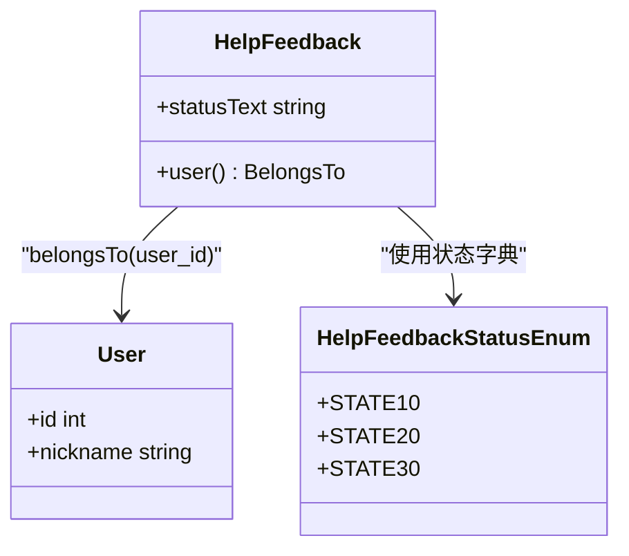
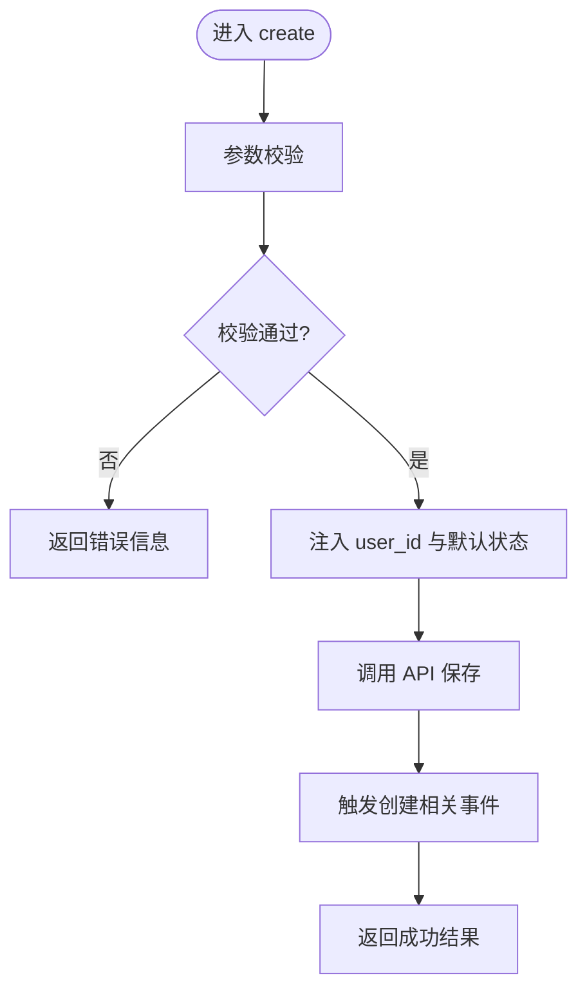
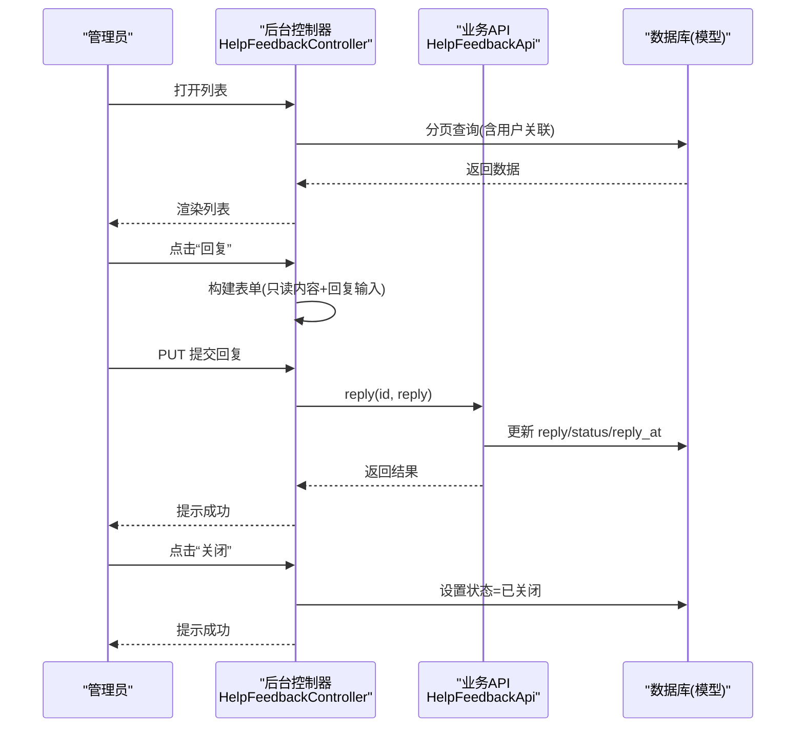
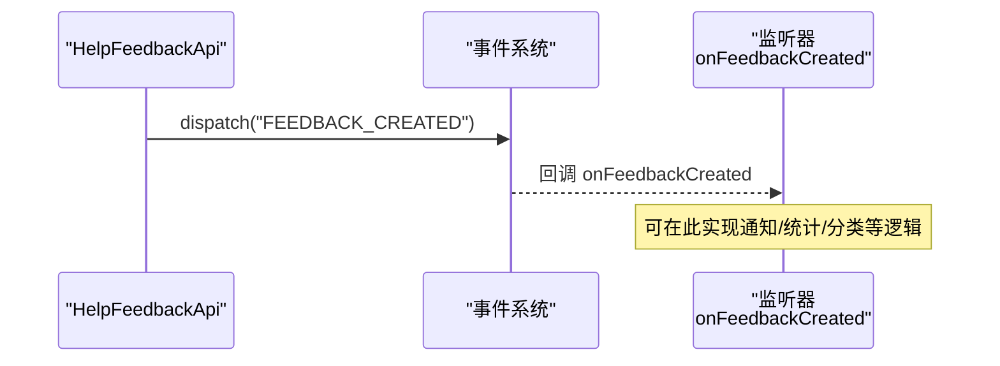
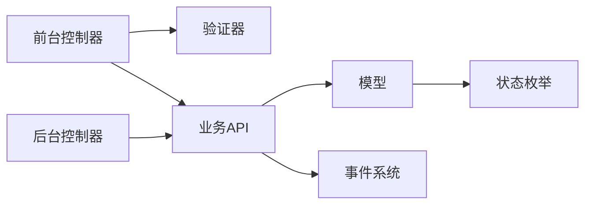

# 用户反馈接口

<cite>
**本文引用的文件**   
- [frontend/src/api/helpFeedback.ts](file://frontend/src/api/helpFeedback.ts)
- [server/plugin/xbHelp/app/api/controller/FeedbackController.php](file://server/plugin/xbHelp/app/api/controller/FeedbackController.php)
- [server/plugin/xbHelp/api/HelpFeedbackApi.php](file://server/plugin/xbHelp/api/HelpFeedbackApi.php)
- [server/plugin/xbHelp/app/model/HelpFeedback.php](file://server/plugin/xbHelp/app/model/HelpFeedback.php)
- [server/plugin/xbHelp/app/admin/controller/HelpFeedbackController.php](file://server/plugin/xbHelp/app/admin/controller/HelpFeedbackController.php)
- [server/plugin/xbHelp/app/validate/HelpFeedbackValidate.php](file://server/plugin/xbHelp/app/validate/HelpFeedbackValidate.php)
- [server/plugin/xbHelp/enum/HelpFeedbackStatusEnum.php](file://server/plugin/xbHelp/enum/HelpFeedbackStatusEnum.php)
- [server/plugin/xbHelp/config/event.php](file://server/plugin/xbHelp/config/event.php)
</cite>

## 目录
1. [简介](#简介)
2. [项目结构](#项目结构)
3. [核心组件](#核心组件)
4. [架构总览](#架构总览)
5. [详细组件分析](#详细组件分析)
6. [依赖关系分析](#依赖关系分析)
7. [性能与扩展性](#性能与扩展性)
8. [故障排查指南](#故障排查指南)
9. [结论](#结论)
10. [附录：API 定义与调用示例](#附录api-定义与调用示例)

## 简介
本文件面向帮助文档用户，系统化梳理“用户反馈”功能的后端 API、前端调用方式以及管理后台处理流程。内容覆盖：
- 反馈提交、查看、回复、关闭等核心流程
- 反馈状态与文本映射
- 数据校验规则
- 事件机制（创建后监听）
- 附件上传、截图标注、回复通知等交互特性的集成建议
- 统计分析、质量评估、自动分类等智能处理的接入点与示例思路

## 项目结构
围绕“用户反馈”的前后端关键文件如下：
- 前端 API 封装：提供提交与列表查询的便捷方法
- 前台控制器：接收请求、参数校验、调用业务 API
- 业务 API：统一业务编排、事件分发、持久化
- 模型与枚举：数据模型、关联关系、状态字典
- 管理后台控制器：列表展示、回复弹窗、关闭操作
- 验证器：字段校验规则
- 事件配置：注册反馈创建后的监听器

图表来源
- [frontend/src/api/helpFeedback.ts:1-16](file://frontend/src/api/helpFeedback.ts#L1-L16)
- [server/plugin/xbHelp/app/api/controller/FeedbackController.php:1-50](file://server/plugin/xbHelp/app/api/controller/FeedbackController.php#L1-L50)
- [server/plugin/xbHelp/api/HelpFeedbackApi.php:1-106](file://server/plugin/xbHelp/api/HelpFeedbackApi.php#L1-L106)
- [server/plugin/xbHelp/app/model/HelpFeedback.php:1-41](file://server/plugin/xbHelp/app/model/HelpFeedback.php#L1-L41)
- [server/plugin/xbHelp/app/admin/controller/HelpFeedbackController.php:1-97](file://server/plugin/xbHelp/app/admin/controller/HelpFeedbackController.php#L1-L97)
- [server/plugin/xbHelp/enum/HelpFeedbackStatusEnum.php:1-42](file://server/plugin/xbHelp/enum/HelpFeedbackStatusEnum.php#L1-L42)
- [server/plugin/xbHelp/config/event.php:1-10](file://server/plugin/xbHelp/config/event.php#L1-L10)

章节来源
- [frontend/src/api/helpFeedback.ts:1-16](file://frontend/src/api/helpFeedback.ts#L1-L16)
- [server/plugin/xbHelp/app/api/controller/FeedbackController.php:1-50](file://server/plugin/xbHelp/app/api/controller/FeedbackController.php#L1-L50)
- [server/plugin/xbHelp/api/HelpFeedbackApi.php:1-106](file://server/plugin/xbHelp/api/HelpFeedbackApi.php#L1-L106)
- [server/plugin/xbHelp/app/model/HelpFeedback.php:1-41](file://server/plugin/xbHelp/app/model/HelpFeedback.php#L1-L41)
- [server/plugin/xbHelp/app/admin/controller/HelpFeedbackController.php:1-97](file://server/plugin/xbHelp/app/admin/controller/HelpFeedbackController.php#L1-L97)
- [server/plugin/xbHelp/enum/HelpFeedbackStatusEnum.php:1-42](file://server/plugin/xbHelp/enum/HelpFeedbackStatusEnum.php#L1-L42)
- [server/plugin/xbHelp/config/event.php:1-10](file://server/plugin/xbHelp/config/event.php#L1-L10)

## 核心组件
- 前台控制器 FeedbackController
  - 负责接收表单提交与列表查询，执行参数校验并调用 HelpFeedbackApi
- 业务 API HelpFeedbackApi
  - 统一编排：保存反馈、管理员回复、获取用户反馈列表
  - 在关键节点触发事件（创建前、创建后、更新前后）
- 模型 HelpFeedback
  - 定义与用户的 belongsTo 关联
  - 提供 statusText 访问器以返回可读状态文本
- 验证器 HelpFeedbackValidate
  - 规定 content 必填且最大长度限制，contact 可选且有长度上限
- 状态枚举 HelpFeedbackStatusEnum
  - 定义待处理、已处理、已关闭三种状态及对应标签样式
- 管理后台控制器 HelpFeedbackController
  - 提供列表、回复弹窗、关闭操作；支持按状态和时间范围筛选
- 事件配置 event.php
  - 将“反馈已创建”事件绑定到监听器，便于后续扩展（如通知、统计、自动分类）

章节来源
- [server/plugin/xbHelp/app/api/controller/FeedbackController.php:1-50](file://server/plugin/xbHelp/app/api/controller/FeedbackController.php#L1-L50)
- [server/plugin/xbHelp/api/HelpFeedbackApi.php:1-106](file://server/plugin/xbHelp/api/HelpFeedbackApi.php#L1-L106)
- [server/plugin/xbHelp/app/model/HelpFeedback.php:1-41](file://server/plugin/xbHelp/app/model/HelpFeedback.php#L1-L41)
- [server/plugin/xbHelp/app/validate/HelpFeedbackValidate.php:1-33](file://server/plugin/xbHelp/app/validate/HelpFeedbackValidate.php#L1-L33)
- [server/plugin/xbHelp/enum/HelpFeedbackStatusEnum.php:1-42](file://server/plugin/xbHelp/enum/HelpFeedbackStatusEnum.php#L1-L42)
- [server/plugin/xbHelp/app/admin/controller/HelpFeedbackController.php:1-97](file://server/plugin/xbHelp/app/admin/controller/HelpFeedbackController.php#L1-L97)
- [server/plugin/xbHelp/config/event.php:1-10](file://server/plugin/xbHelp/config/event.php#L1-L10)

## 架构总览
下图展示了从前端到后端的核心调用链与数据流向。

图表来源
- [server/plugin/xbHelp/app/api/controller/FeedbackController.php:24-48](file://server/plugin/xbHelp/app/api/controller/FeedbackController.php#L24-L48)
- [server/plugin/xbHelp/api/HelpFeedbackApi.php:46-104](file://server/plugin/xbHelp/api/HelpFeedbackApi.php#L46-L104)
- [server/plugin/xbHelp/config/event.php:5-9](file://server/plugin/xbHelp/config/event.php#L5-L9)

## 详细组件分析

### 对象模型与关系

图表来源
- [server/plugin/xbHelp/app/model/HelpFeedback.php:25-39](file://server/plugin/xbHelp/app/model/HelpFeedback.php#L25-L39)
- [server/plugin/xbHelp/enum/HelpFeedbackStatusEnum.php:21-40](file://server/plugin/xbHelp/enum/HelpFeedbackStatusEnum.php#L21-L40)

章节来源
- [server/plugin/xbHelp/app/model/HelpFeedback.php:1-41](file://server/plugin/xbHelp/app/model/HelpFeedback.php#L1-L41)
- [server/plugin/xbHelp/enum/HelpFeedbackStatusEnum.php:1-42](file://server/plugin/xbHelp/enum/HelpFeedbackStatusEnum.php#L1-L42)

### 前台提交与列表接口
- 提交反馈
  - 路径与方法：POST /app/xbHelp/api/Feedback/create
  - 请求体类型：formdata
  - 必填字段：content（最大长度限制）
  - 可选字段：contact（最大长度限制）
  - 鉴权：自动注入 user_id（基于当前登录用户）
  - 初始状态：设置为“待处理”
  - 返回：成功时返回新建的反馈数据
- 获取我的反馈列表
  - 路径与方法：GET /app/xbHelp/api/Feedback/list
  - 鉴权：基于当前登录用户
  - 返回：分页数据（包含状态文本等）

图表来源
- [server/plugin/xbHelp/app/api/controller/FeedbackController.php:29-38](file://server/plugin/xbHelp/app/api/controller/FeedbackController.php#L29-L38)
- [server/plugin/xbHelp/api/HelpFeedbackApi.php:46-59](file://server/plugin/xbHelp/api/HelpFeedbackApi.php#L46-L59)
- [server/plugin/xbHelp/app/validate/HelpFeedbackValidate.php:21-31](file://server/plugin/xbHelp/app/validate/HelpFeedbackValidate.php#L21-L31)

章节来源
- [server/plugin/xbHelp/app/api/controller/FeedbackController.php:24-48](file://server/plugin/xbHelp/app/api/controller/FeedbackController.php#L24-L48)
- [server/plugin/xbHelp/api/HelpFeedbackApi.php:46-59](file://server/plugin/xbHelp/api/HelpFeedbackApi.php#L46-L59)
- [server/plugin/xbHelp/app/validate/HelpFeedbackValidate.php:1-33](file://server/plugin/xbHelp/app/validate/HelpFeedbackValidate.php#L1-L33)

### 管理后台：列表、回复与关闭
- 列表页
  - 支持按状态、提交时间范围筛选
  - 显示序号、用户昵称、反馈内容、联系方式、状态、回复内容、提交时间
  - 右侧操作：回复（弹窗）、关闭（确认）
- 回复
  - 打开弹窗展示原反馈内容与回复输入框
  - 提交后调用业务 API 更新 reply、status 为“已处理”，并记录 reply_at
- 关闭
  - 直接将状态置为“已关闭”

图表来源
- [server/plugin/xbHelp/app/admin/controller/HelpFeedbackController.php:28-95](file://server/plugin/xbHelp/app/admin/controller/HelpFeedbackController.php#L28-L95)
- [server/plugin/xbHelp/api/HelpFeedbackApi.php:67-90](file://server/plugin/xbHelp/api/HelpFeedbackApi.php#L67-L90)

章节来源
- [server/plugin/xbHelp/app/admin/controller/HelpFeedbackController.php:1-97](file://server/plugin/xbHelp/app/admin/controller/HelpFeedbackController.php#L1-L97)
- [server/plugin/xbHelp/api/HelpFeedbackApi.php:67-90](file://server/plugin/xbHelp/api/HelpFeedbackApi.php#L67-L90)

### 事件与扩展点
- 事件注册
  - 在事件配置中，将“反馈已创建”事件绑定到监听器 onFeedbackCreated
- 事件触发点
  - 创建流程中会触发“创建前/已创建/创建后”事件
  - 回复流程中会触发“更新前/已更新/更新后”事件
- 典型用途
  - 发送站内信或邮件通知
  - 写入审计日志
  - 触发自动分类、质量评分、统计指标更新

图表来源
- [server/plugin/xbHelp/config/event.php:5-9](file://server/plugin/xbHelp/config/event.php#L5-L9)
- [server/plugin/xbHelp/api/HelpFeedbackApi.php:48-56](file://server/plugin/xbHelp/api/HelpFeedbackApi.php#L48-L56)

章节来源
- [server/plugin/xbHelp/config/event.php:1-10](file://server/plugin/xbHelp/config/event.php#L1-L10)
- [server/plugin/xbHelp/api/HelpFeedbackApi.php:46-90](file://server/plugin/xbHelp/api/HelpFeedbackApi.php#L46-L90)

## 依赖关系分析
- 控制器依赖
  - 前台控制器依赖验证器与业务 API
  - 后台控制器依赖业务 API 与模型
- 业务 API 依赖
  - 模型用于持久化与查询
  - 事件系统用于解耦扩展逻辑
- 模型依赖
  - 与用户模型建立 belongsTo 关联
  - 使用状态枚举生成可读文本

图表来源
- [server/plugin/xbHelp/app/api/controller/FeedbackController.php:29-48](file://server/plugin/xbHelp/app/api/controller/FeedbackController.php#L29-L48)
- [server/plugin/xbHelp/app/admin/controller/HelpFeedbackController.php:28-95](file://server/plugin/xbHelp/app/admin/controller/HelpFeedbackController.php#L28-L95)
- [server/plugin/xbHelp/api/HelpFeedbackApi.php:46-104](file://server/plugin/xbHelp/api/HelpFeedbackApi.php#L46-L104)
- [server/plugin/xbHelp/app/model/HelpFeedback.php:25-39](file://server/plugin/xbHelp/app/model/HelpFeedback.php#L25-L39)
- [server/plugin/xbHelp/enum/HelpFeedbackStatusEnum.php:21-40](file://server/plugin/xbHelp/enum/HelpFeedbackStatusEnum.php#L21-L40)

章节来源
- [server/plugin/xbHelp/app/api/controller/FeedbackController.php:1-50](file://server/plugin/xbHelp/app/api/controller/FeedbackController.php#L1-L50)
- [server/plugin/xbHelp/app/admin/controller/HelpFeedbackController.php:1-97](file://server/plugin/xbHelp/app/admin/controller/HelpFeedbackController.php#L1-L97)
- [server/plugin/xbHelp/api/HelpFeedbackApi.php:1-106](file://server/plugin/xbHelp/api/HelpFeedbackApi.php#L1-L106)
- [server/plugin/xbHelp/app/model/HelpFeedback.php:1-41](file://server/plugin/xbHelp/app/model/HelpFeedback.php#L1-L41)
- [server/plugin/xbHelp/enum/HelpFeedbackStatusEnum.php:1-42](file://server/plugin/xbHelp/enum/HelpFeedbackStatusEnum.php#L1-L42)

## 性能与扩展性
- 分页查询
  - 列表接口采用分页，避免一次性加载大量数据
- 事件驱动
  - 通过事件将耗时任务（如通知、统计、AI 分类）异步化，降低主流程延迟
- 可扩展点
  - 在监听器中实现自动分类、质量评分、工单流转等
  - 结合队列服务进行批量处理与重试

[本节为通用指导，不直接分析具体文件]

## 故障排查指南
- 提交失败
  - 检查 content 是否为空或超长
  - 检查 contact 是否超长
  - 确认当前用户已登录（user_id 注入）
- 列表为空
  - 确认当前用户是否存在历史反馈
  - 检查分页参数与排序是否正确
- 回复失败
  - 确认反馈记录存在
  - 确认回复内容非空
  - 检查权限与路由是否正确
- 事件未触发
  - 检查事件配置是否注册
  - 检查监听器类名与方法签名是否正确

章节来源
- [server/plugin/xbHelp/app/validate/HelpFeedbackValidate.php:21-31](file://server/plugin/xbHelp/app/validate/HelpFeedbackValidate.php#L21-L31)
- [server/plugin/xbHelp/app/api/controller/FeedbackController.php:29-48](file://server/plugin/xbHelp/app/api/controller/FeedbackController.php#L29-L48)
- [server/plugin/xbHelp/app/admin/controller/HelpFeedbackController.php:55-95](file://server/plugin/xbHelp/app/admin/controller/HelpFeedbackController.php#L55-L95)
- [server/plugin/xbHelp/config/event.php:5-9](file://server/plugin/xbHelp/config/event.php#L5-L9)

## 结论
该模块提供了完整的用户反馈生命周期管理能力：前端提交、后台处理、状态跟踪与事件扩展。通过清晰的职责划分与事件机制，系统具备良好的可维护性与扩展性，便于后续接入通知、统计、智能分类等能力。

[本节为总结性内容，不直接分析具体文件]

## 附录：API 定义与调用示例

### 接口清单
- 提交反馈
  - 方法与路径：POST /app/xbHelp/api/Feedback/create
  - 请求体：formdata
  - 字段说明：
    - content：必填，最大长度限制
    - contact：可选，最大长度限制
  - 鉴权：需要登录
  - 返回：成功时返回新建反馈数据
- 获取我的反馈列表
  - 方法与路径：GET /app/xbHelp/api/Feedback/list
  - 鉴权：需要登录
  - 返回：分页数据（包含状态文本等）

章节来源
- [server/plugin/xbHelp/app/api/controller/FeedbackController.php:24-48](file://server/plugin/xbHelp/app/api/controller/FeedbackController.php#L24-L48)
- [frontend/src/api/helpFeedback.ts:6-15](file://frontend/src/api/helpFeedback.ts#L6-L15)

### 前端调用示例（路径引用）
- 提交反馈
  - 参考路径：[createFeedback:6-8](file://frontend/src/api/helpFeedback.ts#L6-L8)
- 获取列表
  - 参考路径：[getFeedbackList:13-15](file://frontend/src/api/helpFeedback.ts#L13-L15)

章节来源
- [frontend/src/api/helpFeedback.ts:1-16](file://frontend/src/api/helpFeedback.ts#L1-L16)

### 状态与文本映射
- 状态值与含义
  - 10：待处理
  - 20：已处理
  - 30：已关闭
- 文本获取
  - 模型提供 statusText 访问器，返回对应可读文本

章节来源
- [server/plugin/xbHelp/enum/HelpFeedbackStatusEnum.php:21-40](file://server/plugin/xbHelp/enum/HelpFeedbackStatusEnum.php#L21-L40)
- [server/plugin/xbHelp/app/model/HelpFeedback.php:36-39](file://server/plugin/xbHelp/app/model/HelpFeedback.php#L36-L39)

### 附件上传、截图标注、回复通知（集成建议）
- 附件上传
  - 建议在提交反馈前，先调用统一的上传接口获取文件 URL，再将 URL 作为附件字段传入 feedback 数据
  - 可在模型中增加 attachments 字段存储 JSON 数组，或在独立表中维护附件与反馈的关联
- 截图标注
  - 前端完成标注后，将标注结果（如坐标、高亮区域）与截图一并上传，并将元数据存入反馈数据
- 回复通知
  - 在监听器 onFeedbackCreated 中实现站内信/邮件通知
  - 在回复流程中触发“更新后”事件，向用户推送“已处理”通知

[本节为概念性建议，不直接分析具体文件]

### 统计分析、质量评估、自动分类（接入示例思路）
- 统计分析
  - 在“已创建”事件中累计当日新增反馈数、按状态分布计数
- 质量评估
  - 在监听器中根据内容长度、关键词、重复度等计算质量分，并写入扩展表
- 自动分类
  - 在监听器中调用分类模型或服务，将分类结果写入反馈记录或标签表

[本节为概念性建议，不直接分析具体文件]