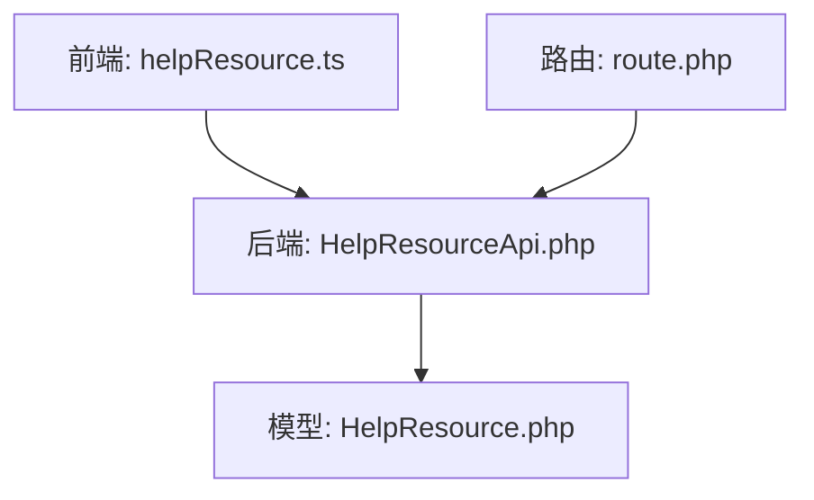
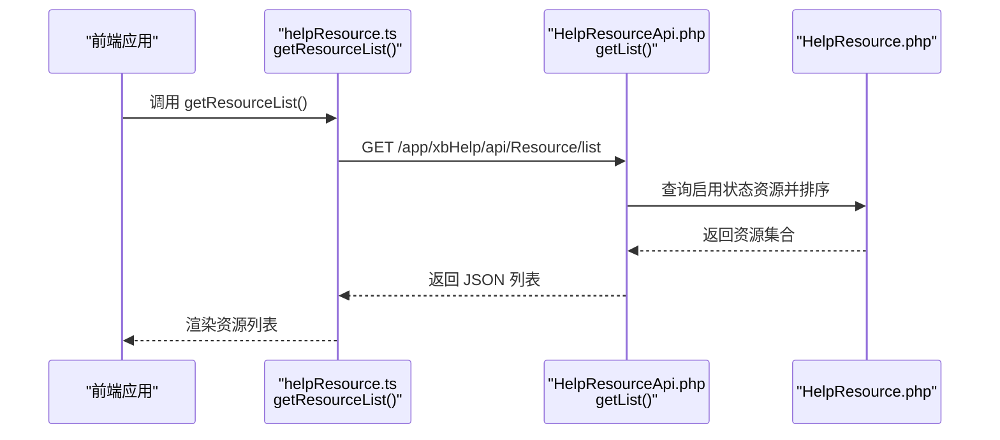
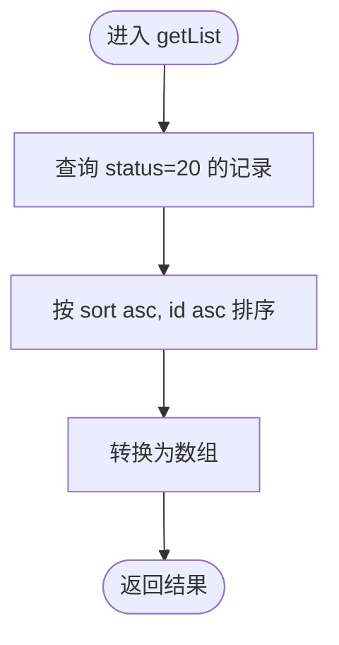
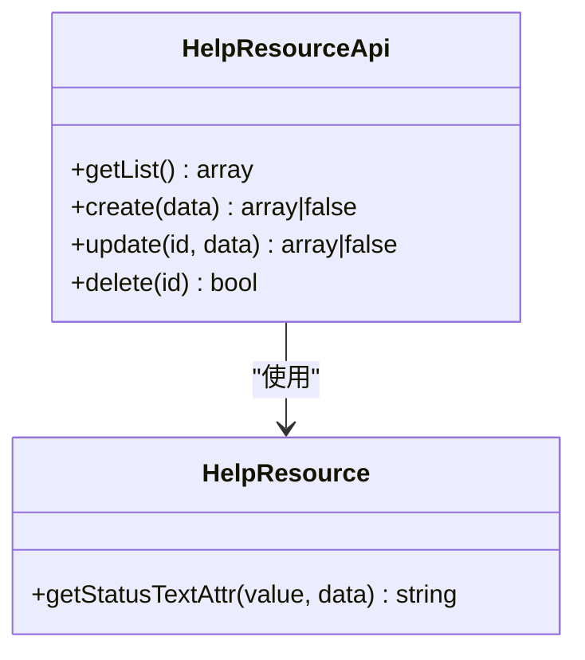

# 资源库接口

<cite>
**本文引用的文件**   
- [frontend/src/api/helpResource.ts](file://frontend/src/api/helpResource.ts)
- [server/plugin/xbHelp/api/HelpResourceApi.php](file://server/plugin/xbHelp/api/HelpResourceApi.php)
- [server/plugin/xbHelp/app/model/HelpResource.php](file://server/plugin/xbHelp/app/model/HelpResource.php)
- [server/plugin/xbHelp/config/route.php](file://server/plugin/xbHelp/config/route.php)
</cite>

## 目录
1. [简介](#简介)
2. [项目结构](#项目结构)
3. [核心组件](#核心组件)
4. [架构总览](#架构总览)
5. [详细组件分析](#详细组件分析)
6. [依赖分析](#依赖分析)
7. [性能考虑](#性能考虑)
8. [故障排查指南](#故障排查指南)
9. [结论](#结论)
10. [附录](#附录)

## 简介
本文件为“帮助文档资源库”的API接口文档，聚焦于资源列表获取、创建、更新与删除等核心能力。当前仓库中已实现前端调用封装与后端控制器/模型的基本逻辑，但尚未暴露完整的上传、下载、预览、分类管理、标签系统、权限控制、版本管理与统计分析等高级特性。本文在现有代码基础上进行说明，并对缺失能力给出扩展建议与最佳实践。

## 项目结构
围绕“帮助资源”的前后端关键文件如下：
- 前端 API 封装：定义请求路径与返回类型
- 后端 API 控制器：提供资源 CRUD 方法
- 数据模型：定义资源实体及状态文本转换
- 路由配置：预留路由注册位置（当前为空）

图表来源
- [frontend/src/api/helpResource.ts:1-30](file://frontend/src/api/helpResource.ts#L1-L30)
- [server/plugin/xbHelp/api/HelpResourceApi.php:1-97](file://server/plugin/xbHelp/api/HelpResourceApi.php#L1-L97)
- [server/plugin/xbHelp/app/model/HelpResource.php:1-32](file://server/plugin/xbHelp/app/model/HelpResource.php#L1-L32)
- [server/plugin/xbHelp/config/route.php:1-4](file://server/plugin/xbHelp/config/route.php#L1-L4)

章节来源
- [frontend/src/api/helpResource.ts:1-30](file://frontend/src/api/helpResource.ts#L1-L30)
- [server/plugin/xbHelp/api/HelpResourceApi.php:1-97](file://server/plugin/xbHelp/api/HelpResourceApi.php#L1-L97)
- [server/plugin/xbHelp/app/model/HelpResource.php:1-32](file://server/plugin/xbHelp/app/model/HelpResource.php#L1-L32)
- [server/plugin/xbHelp/config/route.php:1-4](file://server/plugin/xbHelp/config/route.php#L1-L4)

## 核心组件
- 前端资源列表接口封装
  - 方法名：getResourceList
  - 请求路径：/app/xbHelp/api/Resource/list
  - 返回类型：资源列表数组，包含 id、icon、title、description、link_url、sort、status、create_at、update_at 等字段
- 后端资源控制器
  - getList：仅返回启用状态的资源列表，按 sort 升序、id 升序排列
  - create：新增资源
  - update：更新指定资源
  - delete：删除指定资源
- 数据模型
  - HelpResource：继承基础模型，提供 statusText 字段的文本映射

章节来源
- [frontend/src/api/helpResource.ts:24-30](file://frontend/src/api/helpResource.ts#L24-L30)
- [server/plugin/xbHelp/api/HelpResourceApi.php:43-95](file://server/plugin/xbHelp/api/HelpResourceApi.php#L43-L95)
- [server/plugin/xbHelp/app/model/HelpResource.php:19-31](file://server/plugin/xbHelp/app/model/HelpResource.php#L19-L31)

## 架构总览
以下序列图展示前端调用“获取资源列表”的端到端流程。

图表来源
- [frontend/src/api/helpResource.ts:24-30](file://frontend/src/api/helpResource.ts#L24-L30)
- [server/plugin/xbHelp/api/HelpResourceApi.php:43-49](file://server/plugin/xbHelp/api/HelpResourceApi.php#L43-L49)
- [server/plugin/xbHelp/app/model/HelpResource.php:19-31](file://server/plugin/xbHelp/app/model/HelpResource.php#L19-L31)

## 详细组件分析

### 资源列表接口（GET）
- 功能：获取启用的帮助资源列表
- 请求路径：/app/xbHelp/api/Resource/list
- 请求方式：GET
- 响应体：资源数组，字段包括 id、icon、title、description、link_url、sort、status、create_at、update_at
- 排序规则：先按 sort 升序，再按 id 升序
- 过滤条件：仅返回 status=20（启用）的资源

图表来源
- [server/plugin/xbHelp/api/HelpResourceApi.php:43-49](file://server/plugin/xbHelp/api/HelpResourceApi.php#L43-L49)

章节来源
- [frontend/src/api/helpResource.ts:24-30](file://frontend/src/api/helpResource.ts#L24-L30)
- [server/plugin/xbHelp/api/HelpResourceApi.php:43-49](file://server/plugin/xbHelp/api/HelpResourceApi.php#L43-L49)

### 资源创建接口（POST）
- 功能：新增一条帮助资源记录
- 请求路径：待路由注册（示例：/app/xbHelp/api/Resource/create）
- 请求方式：POST
- 请求体字段：参考模型字段（如 title、description、link_url、icon、sort、status 等）
- 成功响应：返回新资源的完整信息
- 失败情形：保存失败时返回 false

章节来源
- [server/plugin/xbHelp/api/HelpResourceApi.php:56-63](file://server/plugin/xbHelp/api/HelpResourceApi.php#L56-L63)

### 资源更新接口（PUT/PATCH）
- 功能：更新指定 ID 的资源信息
- 请求路径：待路由注册（示例：/app/xbHelp/api/Resource/update/{id}）
- 请求方式：PUT 或 PATCH
- 请求体字段：需要更新的字段
- 成功响应：返回更新后的资源信息
- 失败情形：资源不存在或保存失败时返回 false

章节来源
- [server/plugin/xbHelp/api/HelpResourceApi.php:71-81](file://server/plugin/xbHelp/api/HelpResourceApi.php#L71-L81)

### 资源删除接口（DELETE）
- 功能：删除指定 ID 的资源
- 请求路径：待路由注册（示例：/app/xbHelp/api/Resource/delete/{id}）
- 请求方式：DELETE
- 成功响应：true/false
- 失败情形：资源不存在时返回 false

章节来源
- [server/plugin/xbHelp/api/HelpResourceApi.php:88-95](file://server/plugin/xbHelp/api/HelpResourceApi.php#L88-L95)

### 数据模型与状态文本
- 模型类：HelpResource
- 状态文本：通过访问器将 status 数值映射为可读文本（例如启用/禁用）
- 用途：便于在列表或详情中直接显示状态文本

章节来源
- [server/plugin/xbHelp/app/model/HelpResource.php:19-31](file://server/plugin/xbHelp/app/model/HelpResource.php#L19-L31)

## 依赖分析
- 前端依赖
  - request 工具用于发起 HTTP 请求
  - 明确定义了 ResourceListResult 的数据结构
- 后端依赖
  - 控制器依赖模型进行数据读写
  - 模型继承基础模型，具备通用 ORM 能力
- 路由
  - 当前路由配置文件为空，需补充路由以暴露接口

图表来源
- [server/plugin/xbHelp/api/HelpResourceApi.php:19-95](file://server/plugin/xbHelp/api/HelpResourceApi.php#L19-L95)
- [server/plugin/xbHelp/app/model/HelpResource.php:19-31](file://server/plugin/xbHelp/app/model/HelpResource.php#L19-L31)

章节来源
- [frontend/src/api/helpResource.ts:1-30](file://frontend/src/api/helpResource.ts#L1-L30)
- [server/plugin/xbHelp/api/HelpResourceApi.php:19-95](file://server/plugin/xbHelp/api/HelpResourceApi.php#L19-L95)
- [server/plugin/xbHelp/app/model/HelpResource.php:19-31](file://server/plugin/xbHelp/app/model/HelpResource.php#L19-L31)
- [server/plugin/xbHelp/config/route.php:1-4](file://server/plugin/xbHelp/config/route.php#L1-L4)

## 性能考虑
- 列表查询已按 sort 和 id 排序，建议在数据库层对 (status, sort, id) 建立复合索引以提升查询效率
- 若后续引入分页，应结合 limit/offset 或游标分页减少全表扫描
- 对于大体积资源（图片、视频），建议采用对象存储与 CDN 加速，并在列表接口中仅返回缩略图 URL

[本节为通用性能建议，不直接分析具体文件]

## 故障排查指南
- 列表接口无数据
  - 检查数据库中是否存在 status=20 的记录
  - 确认排序字段 sort 是否合理
- 创建/更新/删除失败
  - 检查传入字段是否符合模型约束
  - 查看返回的布尔值或错误信息定位问题
- 路由未生效
  - 确认已在路由配置文件中注册对应路径与方法

章节来源
- [server/plugin/xbHelp/api/HelpResourceApi.php:43-95](file://server/plugin/xbHelp/api/HelpResourceApi.php#L43-L95)
- [server/plugin/xbHelp/config/route.php:1-4](file://server/plugin/xbHelp/config/route.php#L1-L4)

## 结论
当前仓库已实现帮助资源的基础 CRUD 能力与前端调用封装，但尚未暴露上传、下载、预览、分类、标签、权限、版本与统计等高级特性。建议优先完善路由注册与统一响应格式，随后逐步扩展上述能力，以满足更丰富的资源库场景需求。

[本节为总结性内容，不直接分析具体文件]

## 附录

### 接口清单与调用示例（基于现有实现）
- 获取资源列表
  - 方法：GET
  - 路径：/app/xbHelp/api/Resource/list
  - 返回：资源数组（含 id、icon、title、description、link_url、sort、status、create_at、update_at）
  - 前端调用示例路径：getResourceList
- 创建资源
  - 方法：POST
  - 路径：待注册（示例：/app/xbHelp/api/Resource/create）
  - 请求体：参考模型字段
  - 返回：新资源信息或 false
- 更新资源
  - 方法：PUT/PATCH
  - 路径：待注册（示例：/app/xbHelp/api/Resource/update/{id}）
  - 请求体：需要更新的字段
  - 返回：更新后资源信息或 false
- 删除资源
  - 方法：DELETE
  - 路径：待注册（示例：/app/xbHelp/api/Resource/delete/{id}）
  - 返回：true/false

章节来源
- [frontend/src/api/helpResource.ts:24-30](file://frontend/src/api/helpResource.ts#L24-L30)
- [server/plugin/xbHelp/api/HelpResourceApi.php:56-95](file://server/plugin/xbHelp/api/HelpResourceApi.php#L56-L95)

### 缺失能力与扩展建议
- 资源上传/下载/预览
  - 建议接入统一的上传插件（如 xbUpload 系列），并提供分片上传、断点续传、转码与缩略图生成
  - 下载接口支持直链与鉴权链接；预览接口根据媒体类型返回 HTML 预览或流式传输
- 分类管理与标签系统
  - 设计分类与标签表，建立多对多关系；在列表与详情中支持按分类与标签筛选
- 权限控制
  - 基于用户角色与资源可见范围（公开/私有/组织内）进行鉴权；敏感操作增加二次确认与审计日志
- 版本管理
  - 为资源增加版本号与变更历史；支持回滚到指定版本
- 统计分析
  - 记录资源的访问次数、下载次数、收藏数等指标；提供后台统计面板

[本节为概念性扩展建议，不直接分析具体文件]