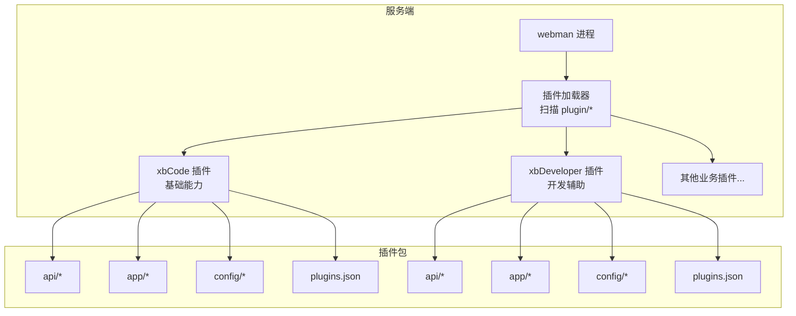
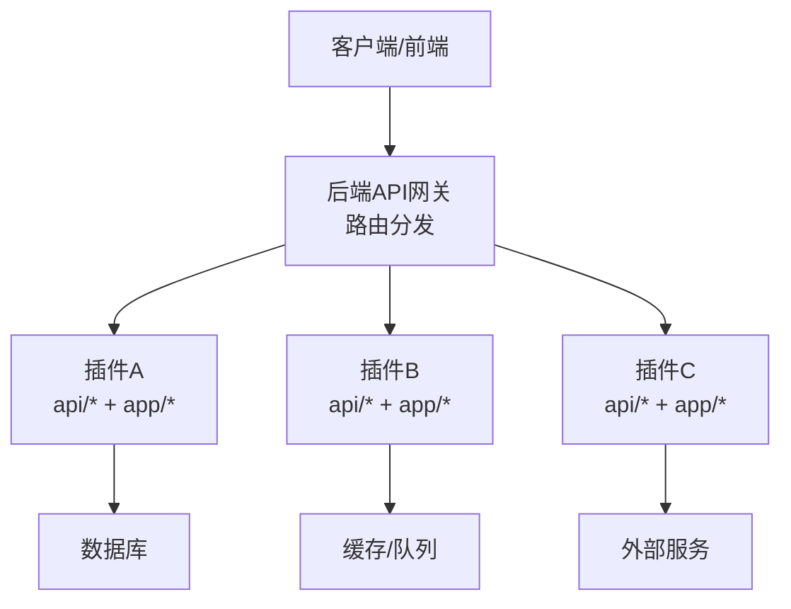
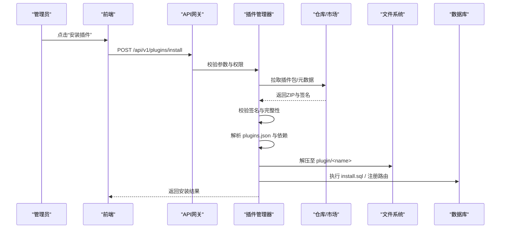
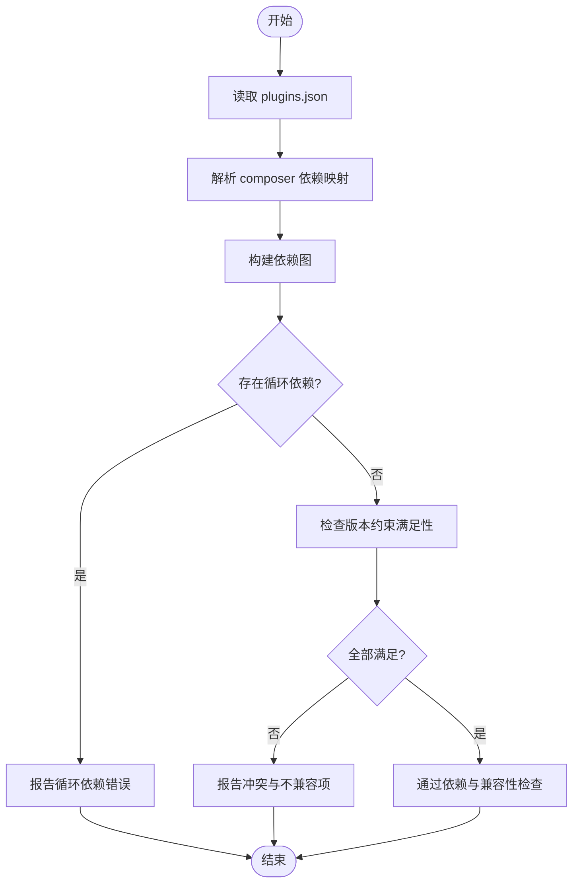
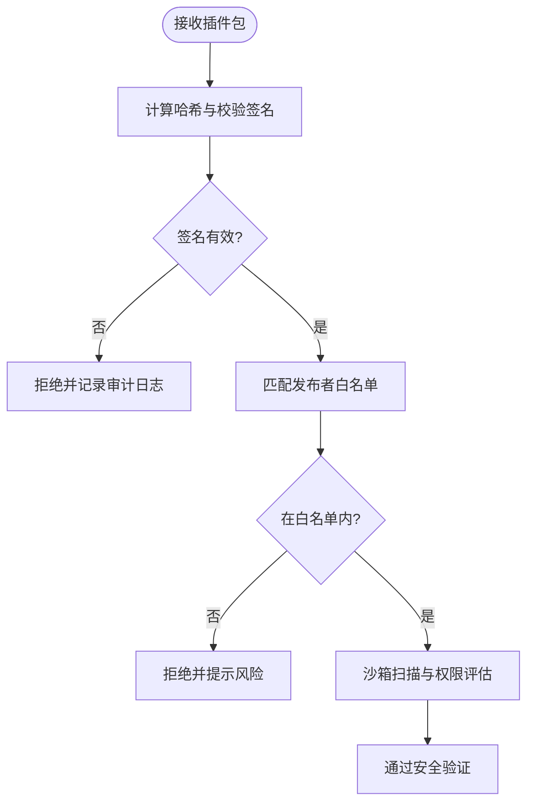
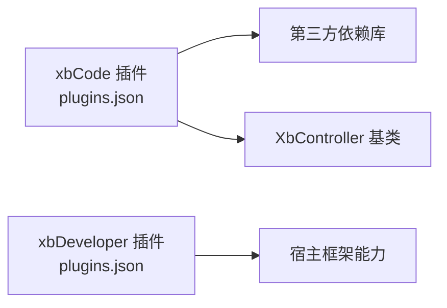

# 插件管理接口

<cite>
**本文引用的文件**
- [plugins.json](file://server/plugin\xbCode\plugins.json)
- [plugins.json](file://server/plugin\xbDeveloper\plugins.json)
- [XbController.php](file://server/plugin\xbCode\XbController.php)
</cite>

## 目录
1. [简介](#简介)
2. [项目结构](#项目结构)
3. [核心组件](#核心组件)
4. [架构总览](#架构总览)
5. [详细组件分析](#详细组件分析)
6. [依赖分析](#依赖分析)
7. [性能考虑](#性能考虑)
8. [故障排查指南](#故障排查指南)
9. [结论](#结论)
10. [附录](#附录)

## 简介
本文件为“插件管理系统”的API接口文档，聚焦于插件的全生命周期管理（安装、卸载、导入/导出、创建与管理）、依赖解析与版本兼容性检查、安全校验等核心机制，并给出插件市场集成、自动更新、备份恢复等企业级特性的设计建议。同时提供开发者规范、调试工具与性能监控的使用指南及API调用示例说明。

需要特别说明：当前仓库中未发现统一的“插件管理API控制器”或集中式路由定义；因此本文在“架构总览”和“详细组件分析”部分以概念性图示为主，并在“依赖分析”中基于已发现的插件清单文件进行实际映射。

## 项目结构
从仓库可见，后端采用Webman框架，插件位于 server/plugin 目录下，每个插件包含独立的 api、app、config、enum、public、setting 等目录，并通过 plugins.json 描述元数据与依赖。核心基础能力由 xbCode 插件提供，xbDeveloper 插件提供开发辅助能力。

[此图为概念性结构示意，不直接对应具体源码文件]

## 核心组件
- 插件清单与元数据
  - 每个插件根目录包含 plugins.json，用于声明标题、名称、版本、作者、描述、composer 依赖以及嵌套插件列表等。
- 控制器基类
  - xbCode 插件提供 XbController 作为控制器基类，封装了获取控制器名、方法名、路由路径等通用能力，便于各插件统一风格地暴露API。

章节来源
- [plugins.json:1-34](file://server/plugin\xbCode\plugins.json#L1-L34)
- [plugins.json:1-9](file://server/plugin\xbDeveloper\plugins.json#L1-L9)
- [XbController.php:22-110](file://server/plugin\xbCode\XbController.php#L22-L110)

## 架构总览
下图展示了插件系统的高层交互：前端通过HTTP访问后端API，后端根据路由分发到具体插件的控制器；插件通过自身 config/route.php 注册路由，使用 XbController 提供的通用能力处理请求；插件间通过事件、队列、数据库与缓存协作。

[此图为概念性架构示意，不直接对应具体源码文件]

## 详细组件分析

### 插件清单与元数据（plugins.json）
- 作用
  - 描述插件基本信息（标题、名称、版本、作者、描述）。
  - 声明 composer 依赖，供依赖解析与安装流程使用。
  - 可声明子插件集合（plugins 字段），支持组合式插件包。
- 关键字段
  - title: 插件显示标题
  - name: 插件唯一标识
  - version: 语义化版本号
  - author: 作者信息
  - desc: 插件描述
  - composer: 依赖映射表（键为类名，值为包名与版本约束）
  - plugins: 子插件列表（可选）
- 典型用途
  - 安装时读取并校验元数据
  - 依赖解析阶段解析 composer 字段
  - 版本兼容性与升级策略依据 version 字段
  - 导出/打包时序列化该文件

章节来源
- [plugins.json:1-34](file://server/plugin\xbCode\plugins.json#L1-L34)
- [plugins.json:1-9](file://server/plugin\xbDeveloper\plugins.json#L1-L9)

### 控制器基类（XbController）
- 职责
  - 提供控制器与方法名的标准化提取（下划线命名）。
  - 提供完整路由路径（模块/控制器/方法）的构造。
  - 通过 trait 注入 JSON、视图、配置、字段等常用能力。
- 关键方法
  - getController(): 获取控制器名（下划线）
  - getAction(): 获取方法名（下划线）
  - getRoutePath(): 拼接控制器与方法的路径
  - getRouteFullPath(): 拼接模块/控制器/方法的完整路径
- 使用建议
  - 所有插件API控制器继承该基类，保证路由与日志记录的一致性。
  - 结合中间件实现鉴权、限流、审计等横切关注点。

章节来源
- [XbController.php:22-110](file://server/plugin\xbCode\XbController.php#L22-L110)

### 插件全生命周期API设计（概念）
以下为插件管理的标准API族，供实现参考。注意：当前仓库未提供统一控制器，以下接口为设计建议，需在各插件或平台侧自行实现路由与控制器。

- 安装
  - POST /api/v1/plugins/install
    - 入参：插件包ZIP或远程URL、目标环境、是否强制覆盖
    - 行为：校验签名与完整性 -> 解压 -> 解析 plugins.json -> 依赖解析与冲突检测 -> 执行安装脚本（install.sql、bootstrap）-> 注册路由与菜单 -> 返回安装结果
- 卸载
  - DELETE /api/v1/plugins/{id}
    - 行为：停止插件进程/队列 -> 清理路由与菜单 -> 执行卸载脚本（uninstall.sql）-> 删除文件与缓存
- 启用/禁用
  - PUT /api/v1/plugins/{id}/enable
  - PUT /api/v1/plugins/{id}/disable
    - 行为：切换状态、热重载路由、触发启停事件
- 导入/导出
  - POST /api/v1/plugins/import
    - 入参：本地ZIP或远程URL
    - 行为：校验 -> 预检 -> 生成预览 -> 确认导入
  - GET /api/v1/plugins/{id}/export
    - 行为：打包插件（含 assets、config、data 等）并返回下载链接
- 创建/初始化
  - POST /api/v1/plugins/create
    - 入参：模板类型、名称、基础功能开关
    - 行为：基于模板生成骨架代码与默认配置
- 更新
  - PUT /api/v1/plugins/{id}/update
    - 行为：拉取新版本 -> 差异对比 -> 依赖变更检测 -> 灰度/回滚策略 -> 应用更新
- 依赖与兼容性
  - GET /api/v1/plugins/{id}/dependencies
    - 行为：解析 composer 依赖、版本约束、冲突报告
  - GET /api/v1/plugins/check-compatibility
    - 入参：目标插件版本、运行环境
    - 行为：返回兼容性矩阵与建议
- 安全验证
  - POST /api/v1/plugins/verify
    - 入参：插件包、签名证书
    - 行为：校验签名、白名单、沙箱扫描、权限最小化检查
- 市场集成
  - GET /api/v1/marketplace/search
  - GET /api/v1/marketplace/detail
  - POST /api/v1/marketplace/order
    - 行为：搜索、详情、购买授权、授权校验
- 自动更新
  - GET /api/v1/plugins/{id}/updates
    - 行为：检查可用更新、发布说明、变更日志
  - POST /api/v1/plugins/{id}/auto-update
    - 行为：后台静默更新、失败回滚、通知
- 备份与恢复
  - POST /api/v1/plugins/{id}/backup
  - POST /api/v1/plugins/{id}/restore
    - 行为：导出配置与数据快照、恢复到指定版本

[此图为概念性流程示意，不直接对应具体源码文件]

### 依赖解析与版本兼容性（概念）
- 依赖解析
  - 读取 plugins.json.composer 映射表，将类名映射到第三方包与版本约束。
  - 构建依赖图，检测循环依赖与缺失依赖。
  - 对版本约束进行满足性判断（如 ~x.y、^x.y 等）。
- 兼容性检查
  - 对比插件声明的最小/最大PHP版本、扩展要求、运行时依赖。
  - 输出兼容性报告与修复建议。

[此图为概念性算法示意，不直接对应具体源码文件]

### 安全验证（概念）
- 签名校验：使用公钥校验插件包的数字签名，确保来源可信与内容未被篡改。
- 白名单与黑名单：维护可信任发布者与已知恶意插件清单。
- 沙箱与权限：限制插件的文件系统、网络、进程与反射访问范围。
- 动态加载隔离：按需加载、最小权限原则、资源配额与超时控制。

[此图为概念性安全流程示意，不直接对应具体源码文件]

## 依赖分析
- 实际依赖关系
  - xbCode 插件通过其 plugins.json 声明了大量第三方库依赖，涵盖事件、Redis、日志、JWT、验证码、环境变量、工作流、进程、多会话、ThinkORM、队列、Guzzle、部署器等。
  - xbDeveloper 插件的 plugins.json 为空依赖，表明其为纯工具型插件，主要依赖宿主框架能力。
- 耦合与内聚
  - 插件之间应通过事件总线、消息队列与数据库进行松耦合通信，避免直接跨插件引用。
  - 控制器基类 XbController 提供了统一的控制器能力，有助于降低重复代码与提升一致性。

图表来源
- [plugins.json:1-34](file://server/plugin\xbCode\plugins.json#L1-L34)
- [plugins.json:1-9](file://server/plugin\xbDeveloper\plugins.json#L1-L9)
- [XbController.php:22-110](file://server/plugin\xbCode\XbController.php#L22-L110)

章节来源
- [plugins.json:1-34](file://server/plugin\xbCode\plugins.json#L1-L34)
- [plugins.json:1-9](file://server/plugin\xbDeveloper\plugins.json#L1-L9)
- [XbController.php:22-110](file://server/plugin\xbCode\XbController.php#L22-L110)

## 性能考虑
- 懒加载与按需启动：仅启用必要插件，减少内存占用与启动时间。
- 路由与配置缓存：将路由树与配置合并后缓存，避免每次请求重复解析。
- 依赖解析优化：增量解析与结果缓存，避免频繁IO与重复计算。
- 异步任务：将安装、更新、备份等耗时操作放入队列，避免阻塞主线程。
- 资源隔离：为插件设置CPU/内存上限与超时，防止单插件影响整体稳定性。

## 故障排查指南
- 常见问题
  - 插件无法安装：检查签名校验失败、依赖缺失、版本不兼容、磁盘空间不足。
  - 路由未生效：确认插件路由注册成功、中间件链正确、缓存未刷新。
  - 运行时异常：查看插件日志、数据库迁移日志、队列消费日志。
- 定位步骤
  - 查看插件目录结构与 plugins.json 是否正确。
  - 使用 xbDeveloper 提供的调试命令或日志工具定位问题。
  - 逐步禁用可疑插件，缩小问题范围。
- 恢复策略
  - 使用备份快照快速回滚到稳定版本。
  - 启用只读模式，暂停新插件安装与更新。

## 结论
本文基于仓库现有材料梳理了插件系统的核心要素：插件清单与元数据、控制器基类与通用能力、以及插件全生命周期的API设计与企业级特性建议。由于当前仓库未提供统一的插件管理API控制器，建议在平台侧实现上述接口，并结合事件、队列与缓存机制保障高可用与可扩展性。

## 附录
- 开发者规范
  - 每个插件必须包含 plugins.json，并保持语义化版本。
  - 控制器继承 XbController，遵循统一的命名与响应格式。
  - 使用事件与队列进行跨插件通信，避免直接耦合。
- 调试工具
  - 使用 xbDeveloper 插件提供的命令与页面进行创建、安装与调试。
  - 开启详细日志，记录关键操作与异常堆栈。
- 性能监控
  - 采集插件级别的QPS、延迟、错误率与资源使用指标。
  - 建立告警规则，针对异常波动及时干预。