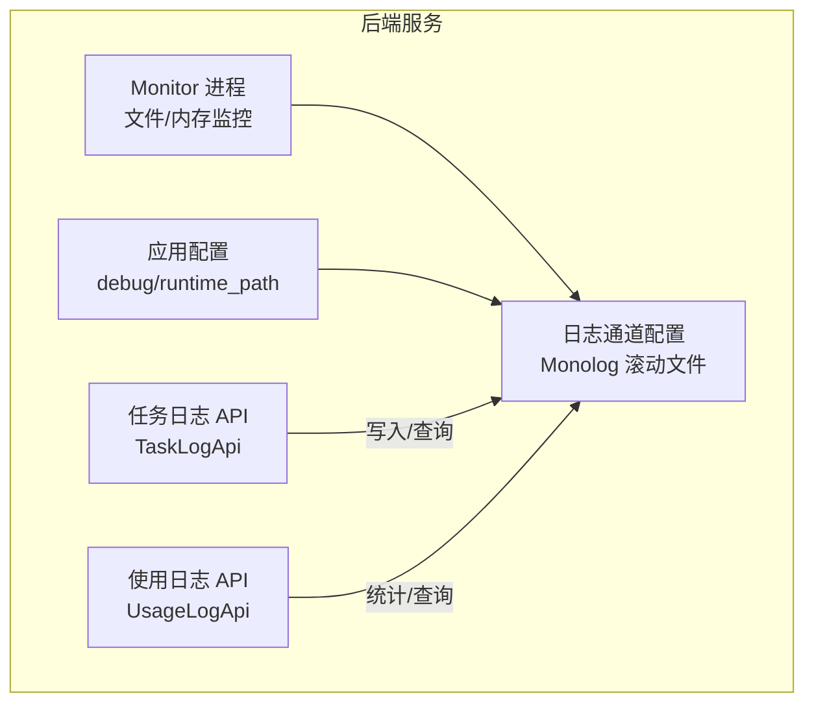
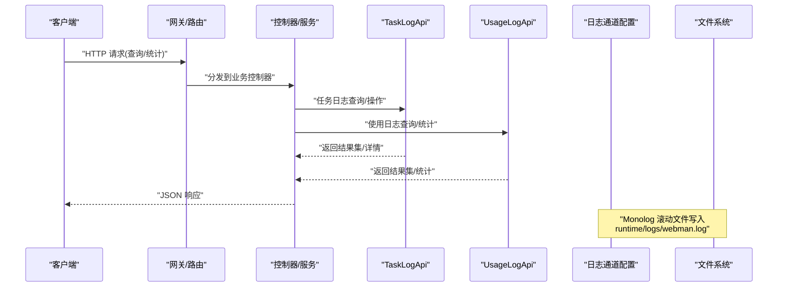
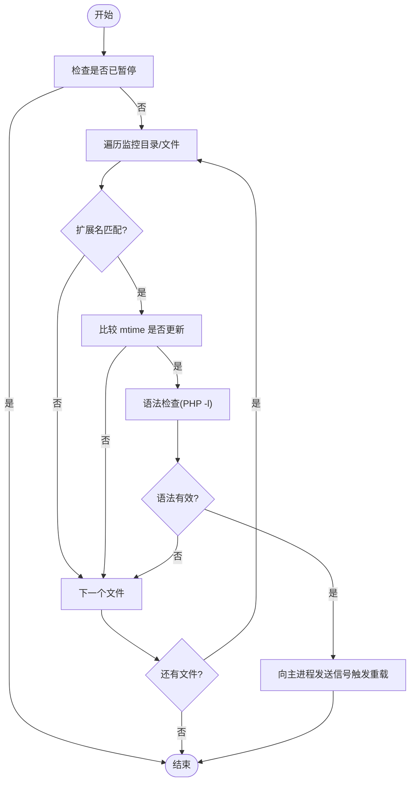
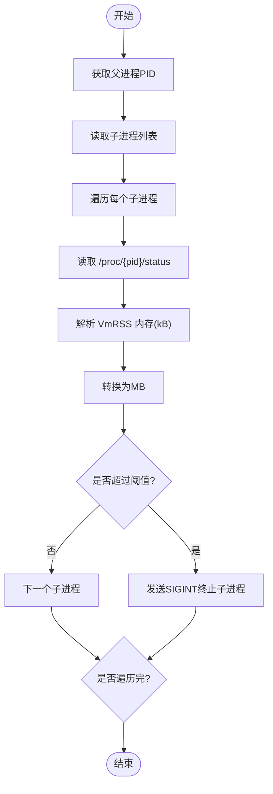

# 日志监控接口

<cite>
**本文引用的文件**   
- [server/app/process/Monitor.php](file://server/app/process/Monitor.php)
- [server/config/log.php](file://server/config/log.php)
- [server/config/app.php](file://server/config/app.php)
- [server/plugin/xbAiModelAgent/api/TaskLogApi.php](file://server/plugin/xbAiModelAgent/api/TaskLogApi.php)
- [server/plugin/xbAiModelAgent/api/UsageLogApi.php](file://server/plugin/xbAiModelAgent/api/UsageLogApi.php)
</cite>

## 目录
1. [简介](#简介)
2. [项目结构](#项目结构)
3. [核心组件](#核心组件)
4. [架构总览](#架构总览)
5. [详细组件分析](#详细组件分析)
6. [依赖关系分析](#依赖关系分析)
7. [性能与容量规划](#性能与容量规划)
8. [故障排查指南](#故障排查指南)
9. [结论](#结论)
10. [附录：API 参考](#附录api-参考)

## 简介
本文件为“系统日志监控模块”的运维相关 API 文档，聚焦以下能力：
- 应用日志查询（基于任务日志、使用日志）
- 性能监控（内存监控、进程健康）
- 调试信息获取（调试开关、运行时路径）
- 高级功能（日志分析、告警配置、实时监控）

说明：
- 当前仓库未提供独立的 HTTP 路由层暴露这些 API；本文以插件内提供的 API 类作为调用入口进行说明。实际使用时需结合路由或网关将请求转发至对应控制器或服务。
- 日志存储采用 Monolog 滚动文件处理器，默认输出到运行时目录下的 webman.log。

## 项目结构
与日志监控相关的核心位置：
- 运行时监控进程：server/app/process/Monitor.php
- 日志通道配置：server/config/log.php
- 应用基础配置（含调试开关、运行时路径等）：server/config/app.php
- 任务日志 API：server/plugin/xbAiModelAgent/api/TaskLogApi.php
- 使用日志 API：server/plugin/xbAiModelAgent/api/UsageLogApi.php



图表来源
- [server/app/process/Monitor.php:115-126](file://server/app/process/Monitor.php#L115-L126)
- [server/config/log.php:16-31](file://server/config/log.php#L16-L31)
- [server/config/app.php:4-12](file://server/config/app.php#L4-L12)
- [server/plugin/xbAiModelAgent/api/TaskLogApi.php:155-188](file://server/plugin/xbAiModelAgent/api/TaskLogApi.php#L155-L188)
- [server/plugin/xbAiModelAgent/api/UsageLogApi.php:59-87](file://server/plugin/xbAiModelAgent/api/UsageLogApi.php#L59-L87)

章节来源
- [server/app/process/Monitor.php:1-306](file://server/app/process/Monitor.php#L1-L306)
- [server/config/log.php:1-33](file://server/config/log.php#L1-L33)
- [server/config/app.php:1-13](file://server/config/app.php#L1-L13)
- [server/plugin/xbAiModelAgent/api/TaskLogApi.php:1-263](file://server/plugin/xbAiModelAgent/api/TaskLogApi.php#L1-L263)
- [server/plugin/xbAiModelAgent/api/UsageLogApi.php:1-153](file://server/plugin/xbAiModelAgent/api/UsageLogApi.php#L1-L153)

## 核心组件
- Monitor 进程
  - 文件变更监控：周期性扫描指定目录，检测扩展名匹配文件的修改时间，触发主进程重载。
  - 内存监控：按周期读取子进程状态，超过阈值则发送信号重启。
  - 暂停/恢复：通过锁文件控制是否执行监控逻辑。
- 日志通道
  - 使用 Monolog RotatingFileHandler，默认输出到 runtime/logs/webman.log，保留最近 7 个文件，级别为 DEBUG。
- 任务日志 API
  - 支持创建、更新状态、分页查询、删除、批量删除、详情、按模型 ID 查询等。
- 使用日志 API
  - 支持创建、分页查询、详情、按模型 ID 查询、统计汇总（成功记录）。

章节来源
- [server/app/process/Monitor.php:50-88](file://server/app/process/Monitor.php#L50-L88)
- [server/app/process/Monitor.php:115-126](file://server/app/process/Monitor.php#L115-L126)
- [server/app/process/Monitor.php:132-187](file://server/app/process/Monitor.php#L132-L187)
- [server/app/process/Monitor.php:232-262](file://server/app/process/Monitor.php#L232-L262)
- [server/config/log.php:16-31](file://server/config/log.php#L16-L31)
- [server/plugin/xbAiModelAgent/api/TaskLogApi.php:46-53](file://server/plugin/xbAiModelAgent/api/TaskLogApi.php#L46-L53)
- [server/plugin/xbAiModelAgent/api/TaskLogApi.php:155-188](file://server/plugin/xbAiModelAgent/api/TaskLogApi.php#L155-L188)
- [server/plugin/xbAiModelAgent/api/UsageLogApi.php:45-52](file://server/plugin/xbAiModelAgent/api/UsageLogApi.php#L45-L52)
- [server/plugin/xbAiModelAgent/api/UsageLogApi.php:59-87](file://server/plugin/xbAiModelAgent/api/UsageLogApi.php#L59-L87)

## 架构总览
下图展示从外部调用到内部处理的关键链路：外部请求进入后，由路由/网关分发至控制器或服务，再调用 TaskLogApi/UsageLogApi 完成日志读写与统计；同时 Monitor 进程在后台独立运行，负责文件与内存监控。



图表来源
- [server/plugin/xbAiModelAgent/api/TaskLogApi.php:155-188](file://server/plugin/xbAiModelAgent/api/TaskLogApi.php#L155-L188)
- [server/plugin/xbAiModelAgent/api/UsageLogApi.php:59-87](file://server/plugin/xbAiModelAgent/api/UsageLogApi.php#L59-L87)
- [server/config/log.php:16-31](file://server/config/log.php#L16-L31)

## 详细组件分析

### 组件一：Monitor 进程（文件与内存监控）
职责
- 文件变更监控：定时扫描目录，检测目标扩展名的文件 mtime 变化，校验语法后向主进程发送信号触发重载。
- 内存监控：定时读取子进程状态，若超过阈值则发送信号终止子进程，由管理器重启。
- 暂停/恢复：通过锁文件控制是否执行监控逻辑。

关键流程（文件变更）


图表来源
- [server/app/process/Monitor.php:132-187](file://server/app/process/Monitor.php#L132-L187)

关键流程（内存监控）


图表来源
- [server/app/process/Monitor.php:232-262](file://server/app/process/Monitor.php#L232-L262)

章节来源
- [server/app/process/Monitor.php:50-88](file://server/app/process/Monitor.php#L50-L88)
- [server/app/process/Monitor.php:115-126](file://server/app/process/Monitor.php#L115-L126)
- [server/app/process/Monitor.php:132-187](file://server/app/process/Monitor.php#L132-L187)
- [server/app/process/Monitor.php:232-262](file://server/app/process/Monitor.php#L232-L262)

### 组件二：日志通道配置（Monolog 滚动文件）
要点
- 处理器：RotatingFileHandler，保留最近 7 个文件。
- 输出路径：runtime/logs/webman.log。
- 日志级别：DEBUG。
- 格式化器：LineFormatter，时间格式 Y-m-d H:i:s。

章节来源
- [server/config/log.php:16-31](file://server/config/log.php#L16-L31)

### 组件三：任务日志 API（TaskLogApi）
能力概览
- 创建任务日志记录
- 更新任务状态（执行中、失败、已完成）
- 分页查询（支持用户ID、模型ID、模态类型、状态、时间范围）
- 删除与批量删除（带归属校验）
- 详情查询
- 按模型ID查询

查询参数说明（getList）
- uid：用户ID筛选
- model_id：模型ID筛选
- modality：模态类型筛选
- status：状态筛选
- start_time：起始时间
- end_time：结束时间

章节来源
- [server/plugin/xbAiModelAgent/api/TaskLogApi.php:46-53](file://server/plugin/xbAiModelAgent/api/TaskLogApi.php#L46-L53)
- [server/plugin/xbAiModelAgent/api/TaskLogApi.php:86-98](file://server/plugin/xbAiModelAgent/api/TaskLogApi.php#L86-L98)
- [server/plugin/xbAiModelAgent/api/TaskLogApi.php:109-123](file://server/plugin/xbAiModelAgent/api/TaskLogApi.php#L109-L123)
- [server/plugin/xbAiModelAgent/api/TaskLogApi.php:134-148](file://server/plugin/xbAiModelAgent/api/TaskLogApi.php#L134-L148)
- [server/plugin/xbAiModelAgent/api/TaskLogApi.php:155-188](file://server/plugin/xbAiModelAgent/api/TaskLogApi.php#L155-L188)
- [server/plugin/xbAiModelAgent/api/TaskLogApi.php:199-209](file://server/plugin/xbAiModelAgent/api/TaskLogApi.php#L199-L209)
- [server/plugin/xbAiModelAgent/api/TaskLogApi.php:220-239](file://server/plugin/xbAiModelAgent/api/TaskLogApi.php#L220-L239)
- [server/plugin/xbAiModelAgent/api/TaskLogApi.php:246-250](file://server/plugin/xbAiModelAgent/api/TaskLogApi.php#L246-L250)
- [server/plugin/xbAiModelAgent/api/TaskLogApi.php:258-262](file://server/plugin/xbAiModelAgent/api/TaskLogApi.php#L258-L262)

### 组件四：使用日志 API（UsageLogApi）
能力概览
- 创建使用日志记录
- 分页查询（支持用户ID、模型ID、状态、时间范围）
- 详情查询
- 按模型ID查询
- 统计汇总（仅统计成功记录）

查询参数说明（getList）
- uid：用户ID筛选
- model_id：模型ID筛选
- status：状态筛选
- start_time：起始时间
- end_time：结束时间

统计字段说明（getStats）
- total_count：成功记录总数
- total_input_tokens：输入 token 总量
- total_output_tokens：输出 token 总量
- total_tokens：总 token 量

章节来源
- [server/plugin/xbAiModelAgent/api/UsageLogApi.php:45-52](file://server/plugin/xbAiModelAgent/api/UsageLogApi.php#L45-L52)
- [server/plugin/xbAiModelAgent/api/UsageLogApi.php:59-87](file://server/plugin/xbAiModelAgent/api/UsageLogApi.php#L59-L87)
- [server/plugin/xbAiModelAgent/api/UsageLogApi.php:94-98](file://server/plugin/xbAiModelAgent/api/UsageLogApi.php#L94-L98)
- [server/plugin/xbAiModelAgent/api/UsageLogApi.php:106-110](file://server/plugin/xbAiModelAgent/api/UsageLogApi.php#L106-L110)
- [server/plugin/xbAiModelAgent/api/UsageLogApi.php:119-152](file://server/plugin/xbAiModelAgent/api/UsageLogApi.php#L119-L152)

## 依赖关系分析
- Monitor 进程依赖 Workerman Timer 与 POSIX 函数，用于定时任务与进程信号。
- 日志通道依赖 Monolog 库，使用 RotatingFileHandler 实现滚动日志。
- TaskLogApi/UsageLogApi 依赖各自的数据模型（AiModelTaskLog/AiModelUsageLog），并通过 ORM 进行查询与聚合。

```mermaid
classDiagram
class Monitor {
+pause() void
+resume() void
+isPaused() bool
+checkFilesChange(monitorDir) bool
+checkAllFilesChange() bool
+checkMemory(memoryLimit) void
}
class TaskLogApi {
+create(data) array|false
+updateRuning(id) void
+updateFail(id, errorMsg) void
+updateComplete(id, result) void
+getList(params) array
+delete(id, uid) bool
+batchDelete(ids, uid) int
+getDetail(id) array|null
+getByModelId(modelId, params) array
}
class UsageLogApi {
+create(data) array|false
+getList(params) array
+getDetail(id) array|null
+getByModelId(modelId, params) array
+getStats(modelId, startTime, endTime) array
}
Monitor --> "定时任务" : "Timer : : add"
TaskLogApi --> "数据模型" : "AiModelTaskLog"
UsageLogApi --> "数据模型" : "AiModelUsageLog"
```

图表来源
- [server/app/process/Monitor.php:115-126](file://server/app/process/Monitor.php#L115-L126)
- [server/plugin/xbAiModelAgent/api/TaskLogApi.php:155-188](file://server/plugin/xbAiModelAgent/api/TaskLogApi.php#L155-L188)
- [server/plugin/xbAiModelAgent/api/UsageLogApi.php:59-87](file://server/plugin/xbAiModelAgent/api/UsageLogApi.php#L59-L87)

章节来源
- [server/app/process/Monitor.php:115-126](file://server/app/process/Monitor.php#L115-L126)
- [server/plugin/xbAiModelAgent/api/TaskLogApi.php:155-188](file://server/plugin/xbAiModelAgent/api/TaskLogApi.php#L155-L188)
- [server/plugin/xbAiModelAgent/api/UsageLogApi.php:59-87](file://server/plugin/xbAiModelAgent/api/UsageLogApi.php#L59-L87)

## 性能与容量规划
- 文件监控
  - 当监控目录下文件数量过大时，会输出警告提示，建议缩小监控范围或排除无关目录。
- 内存监控
  - 阈值计算考虑 PHP memory_limit 的 80% 安全系数，避免误杀。
- 日志滚动
  - 默认保留 7 个文件，可根据磁盘空间调整 maxFiles。
- 查询优化
  - 分页查询建议使用必要过滤条件（uid、model_id、status、时间范围），减少全表扫描。
  - 统计接口仅对成功记录聚合，避免无效数据干扰。

章节来源
- [server/app/process/Monitor.php:182-186](file://server/app/process/Monitor.php#L182-L186)
- [server/app/process/Monitor.php:269-303](file://server/app/process/Monitor.php#L269-L303)
- [server/config/log.php:16-31](file://server/config/log.php#L16-L31)
- [server/plugin/xbAiModelAgent/api/TaskLogApi.php:155-188](file://server/plugin/xbAiModelAgent/api/TaskLogApi.php#L155-L188)
- [server/plugin/xbAiModelAgent/api/UsageLogApi.php:119-152](file://server/plugin/xbAiModelAgent/api/UsageLogApi.php#L119-L152)

## 故障排查指南
- 无法触发文件重载
  - 检查 exec 是否被 disable_functions 禁用；确认主进程 PID 可访问；确保只自动加载的文件支持重载。
- 监控过于缓慢
  - 监控目录文件过多会导致扫描变慢，建议缩小监控范围。
- 日志未生成或无权限
  - 检查运行时目录与日志文件路径是否存在且可写；确认 Monolog 配置正确。
- 调试模式
  - 通过 debug 开关控制调试行为；确认运行时路径配置正确。

章节来源
- [server/app/process/Monitor.php:111-126](file://server/app/process/Monitor.php#L111-L126)
- [server/app/process/Monitor.php:182-186](file://server/app/process/Monitor.php#L182-L186)
- [server/config/log.php:16-31](file://server/config/log.php#L16-L31)
- [server/config/app.php:4-12](file://server/config/app.php#L4-L12)

## 结论
本模块提供了面向运维的日志与监控能力：
- 通过 Monitor 进程实现文件与内存监控，保障服务稳定与热重载。
- 通过 Monolog 滚动文件实现结构化日志持久化。
- 通过 TaskLogApi/UsageLogApi 提供任务与使用日志的增删改查与统计分析。
建议在网关或路由层封装统一接口，并配合前端可视化面板实现实时查看与告警联动。

## 附录：API 参考

### 任务日志接口（TaskLogApi）
- 创建任务日志
  - 方法：create(array $data)
  - 返回：数组或 false
- 更新任务状态
  - updateRuning(int $id)
  - updateFail(int $id, string $errorMsg)
  - updateComplete(int $id, string $result)
- 查询列表（分页）
  - getList(array $params = [])
  - 参数：uid、model_id、modality、status、start_time、end_time
- 删除与批量删除
  - delete(int $id, int $uid)
  - batchDelete(array $ids, int $uid)
- 详情与按模型查询
  - getDetail(int $id)
  - getByModelId(string $modelId, array $params = [])

章节来源
- [server/plugin/xbAiModelAgent/api/TaskLogApi.php:46-53](file://server/plugin/xbAiModelAgent/api/TaskLogApi.php#L46-L53)
- [server/plugin/xbAiModelAgent/api/TaskLogApi.php:86-98](file://server/plugin/xbAiModelAgent/api/TaskLogApi.php#L86-L98)
- [server/plugin/xbAiModelAgent/api/TaskLogApi.php:109-123](file://server/plugin/xbAiModelAgent/api/TaskLogApi.php#L109-L123)
- [server/plugin/xbAiModelAgent/api/TaskLogApi.php:134-148](file://server/plugin/xbAiModelAgent/api/TaskLogApi.php#L134-L148)
- [server/plugin/xbAiModelAgent/api/TaskLogApi.php:155-188](file://server/plugin/xbAiModelAgent/api/TaskLogApi.php#L155-L188)
- [server/plugin/xbAiModelAgent/api/TaskLogApi.php:199-209](file://server/plugin/xbAiModelAgent/api/TaskLogApi.php#L199-L209)
- [server/plugin/xbAiModelAgent/api/TaskLogApi.php:220-239](file://server/plugin/xbAiModelAgent/api/TaskLogApi.php#L220-L239)
- [server/plugin/xbAiModelAgent/api/TaskLogApi.php:246-250](file://server/plugin/xbAiModelAgent/api/TaskLogApi.php#L246-L250)
- [server/plugin/xbAiModelAgent/api/TaskLogApi.php:258-262](file://server/plugin/xbAiModelAgent/api/TaskLogApi.php#L258-L262)

### 使用日志接口（UsageLogApi）
- 创建使用日志
  - 方法：create(array $data)
  - 返回：数组或 false
- 查询列表（分页）
  - getList(array $params = [])
  - 参数：uid、model_id、status、start_time、end_time
- 详情与按模型查询
  - getDetail(int $id)
  - getByModelId(string $modelId, array $params = [])
- 统计汇总
  - getStats(string $modelId = '', string $startTime = '', string $endTime = '')
  - 返回：total_count、total_input_tokens、total_output_tokens、total_tokens

章节来源
- [server/plugin/xbAiModelAgent/api/UsageLogApi.php:45-52](file://server/plugin/xbAiModelAgent/api/UsageLogApi.php#L45-L52)
- [server/plugin/xbAiModelAgent/api/UsageLogApi.php:59-87](file://server/plugin/xbAiModelAgent/api/UsageLogApi.php#L59-L87)
- [server/plugin/xbAiModelAgent/api/UsageLogApi.php:94-98](file://server/plugin/xbAiModelAgent/api/UsageLogApi.php#L94-L98)
- [server/plugin/xbAiModelAgent/api/UsageLogApi.php:106-110](file://server/plugin/xbAiModelAgent/api/UsageLogApi.php#L106-L110)
- [server/plugin/xbAiModelAgent/api/UsageLogApi.php:119-152](file://server/plugin/xbAiModelAgent/api/UsageLogApi.php#L119-L152)