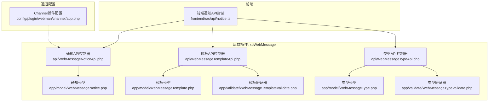
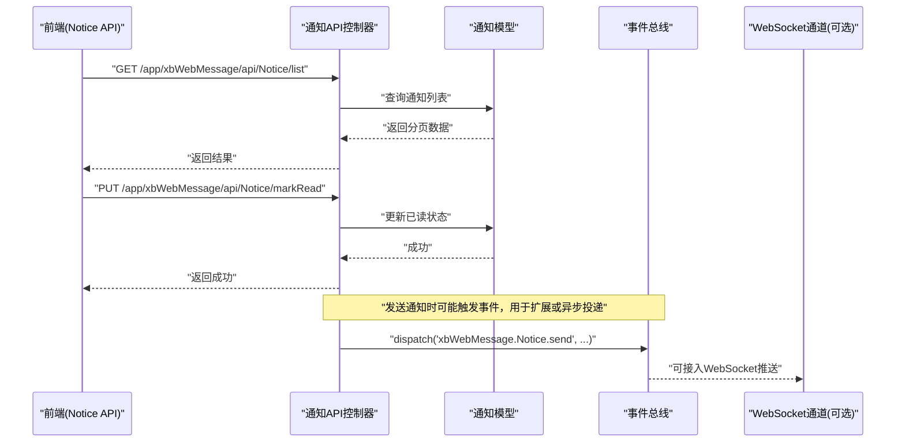
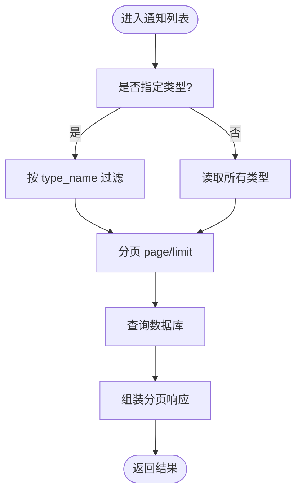
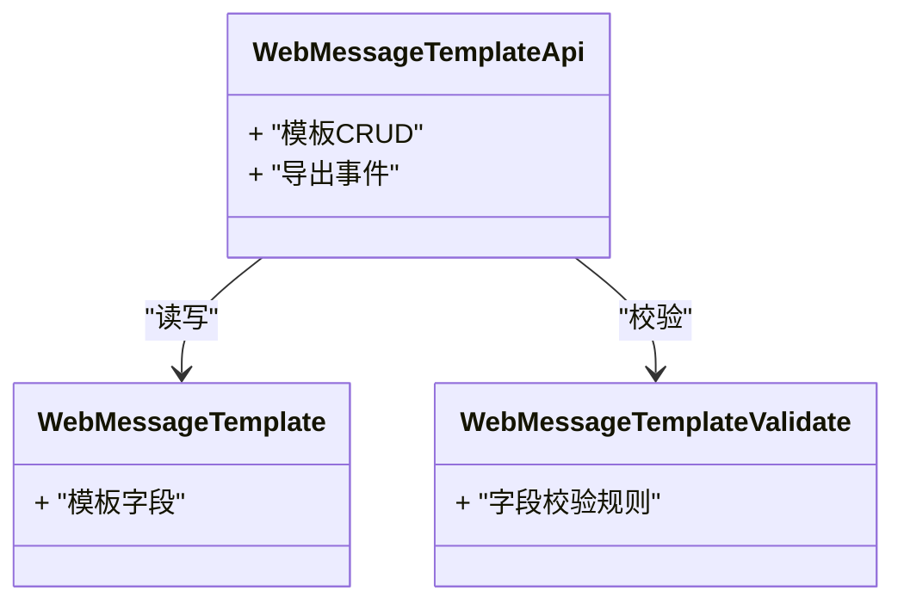
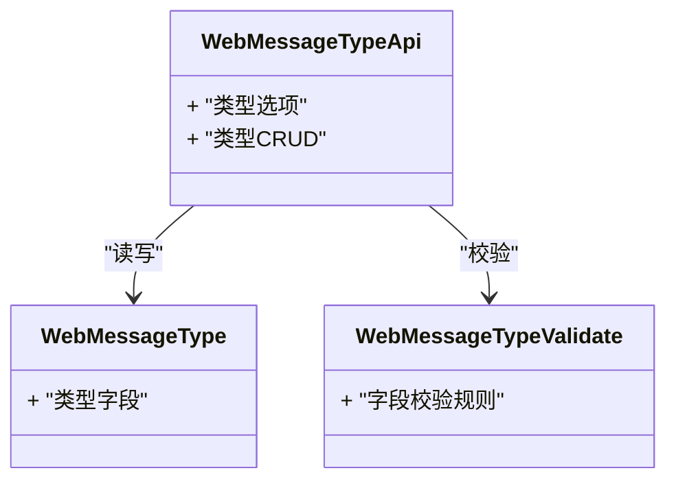
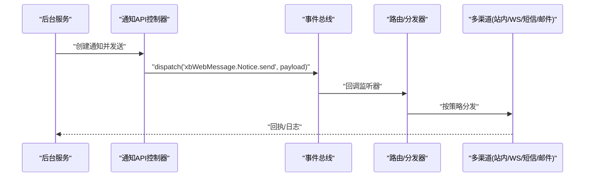
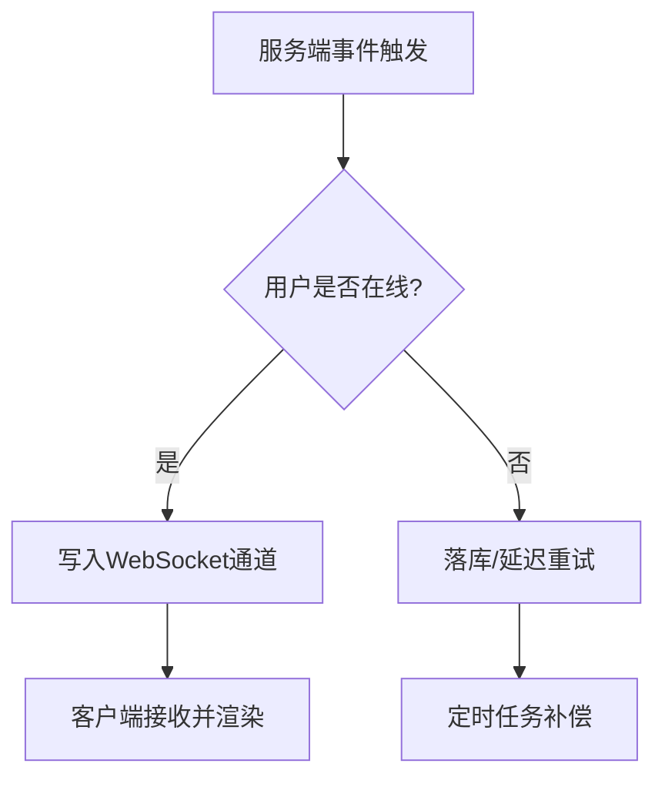
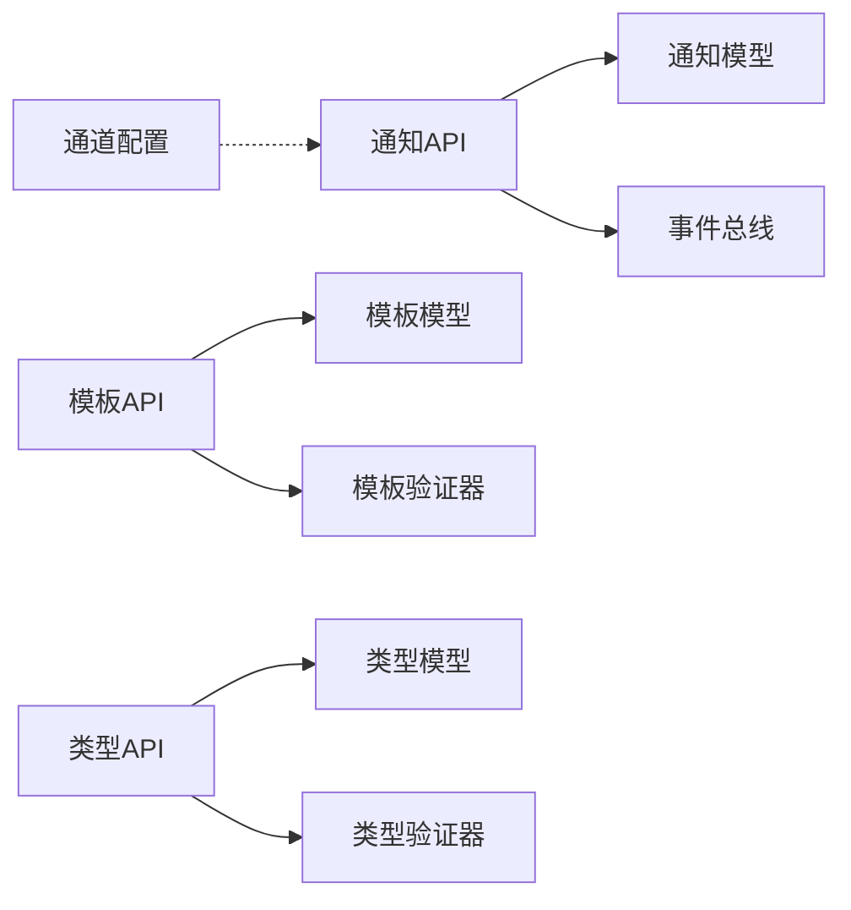

# 消息通知接口

<cite>
**本文引用的文件**
- [frontend/src/api/notice.ts](file://frontend/src/api/notice.ts)
- [server/plugin/xbWebMessage/api/WebMessageNoticeApi.php](file://server/plugin/xbWebMessage/api/WebMessageNoticeApi.php)
- [server/plugin/xbWebMessage/api/WebMessageTemplateApi.php](file://server/plugin/xbWebMessage/api/WebMessageTemplateApi.php)
- [server/plugin/xbWebMessage/api/WebMessageTypeApi.php](file://server/plugin/xbWebMessage/api/WebMessageTypeApi.php)
- [server/plugin/xbWebMessage/app/model/WebMessageNotice.php](file://server/plugin/xbWebMessage/app/model/WebMessageNotice.php)
- [server/plugin/xbWebMessage/app/model/WebMessageTemplate.php](file://server/plugin/xbWebMessage/app/model/WebMessageTemplate.php)
- [server/plugin/xbWebMessage/app/model/WebMessageType.php](file://server/plugin/xbWebMessage/app/model/WebMessageType.php)
- [server/plugin/xbWebMessage/app/validate/WebMessageTemplateValidate.php](file://server/plugin/xbWebMessage/app/validate/WebMessageTemplateValidate.php)
- [server/plugin/xbWebMessage/app/validate/WebMessageTypeValidate.php](file://server/plugin/xbWebMessage/app/validate/WebMessageTypeValidate.php)
- [server/config/plugin/webman/channel/app.php](file://server/config/plugin/webman/channel/app.php)
</cite>

## 目录
1. [简介](#简介)
2. [项目结构](#项目结构)
3. [核心组件](#核心组件)
4. [架构总览](#架构总览)
5. [详细组件分析](#详细组件分析)
6. [依赖分析](#依赖分析)
7. [性能考虑](#性能考虑)
8. [故障排查指南](#故障排查指南)
9. [结论](#结论)
10. [附录](#附录)

## 简介
本文件为“系统消息通知模块”的API接口文档，覆盖以下能力：
- 消息通知发送与查询（列表、未读数、已读标记）
- 模板管理（增删改查、校验、导出事件）
- 类型定义（枚举选项、校验）
- 推送机制与路由（基于插件化控制器与模型）
- 实时通知（WebSocket通道配置入口）
- 批量推送与消息路由（通过事件扩展点实现）
- WebSocket连接管理、消息格式规范、错误重试机制等实现建议

说明：前端调用路径以 /app/xbWebMessage 为前缀；后端由 xbWebMessage 插件提供 API 控制器与数据模型。

## 项目结构
该模块位于 server/plugin/xbWebMessage 下，包含 API 控制器、模型、验证器以及安装脚本等。前端在 frontend/src/api/notice.ts 中封装了对外请求。

图表来源
- [frontend/src/api/notice.ts](file://frontend/src/api/notice.ts)
- [server/plugin/xbWebMessage/api/WebMessageNoticeApi.php](file://server/plugin/xbWebMessage/api/WebMessageNoticeApi.php)
- [server/plugin/xbWebMessage/api/WebMessageTemplateApi.php](file://server/plugin/xbWebMessage/api/WebMessageTemplateApi.php)
- [server/plugin/xbWebMessage/api/WebMessageTypeApi.php](file://server/plugin/xbWebMessage/api/WebMessageTypeApi.php)
- [server/plugin/xbWebMessage/app/model/WebMessageNotice.php](file://server/plugin/xbWebMessage/app/model/WebMessageNotice.php)
- [server/plugin/xbWebMessage/app/model/WebMessageTemplate.php](file://server/plugin/xbWebMessage/app/model/WebMessageTemplate.php)
- [server/plugin/xbWebMessage/app/model/WebMessageType.php](file://server/plugin/xbWebMessage/app/model/WebMessageType.php)
- [server/plugin/xbWebMessage/app/validate/WebMessageTemplateValidate.php](file://server/plugin/xbWebMessage/app/validate/WebMessageTemplateValidate.php)
- [server/plugin/xbWebMessage/app/validate/WebMessageTypeValidate.php](file://server/plugin/xbWebMessage/app/validate/WebMessageTypeValidate.php)
- [server/config/plugin/webman/channel/app.php](file://server/config/plugin/webman/channel/app.php)

章节来源
- [frontend/src/api/notice.ts](file://frontend/src/api/notice.ts)
- [server/plugin/xbWebMessage/api/WebMessageNoticeApi.php](file://server/plugin/xbWebMessage/api/WebMessageNoticeApi.php)
- [server/plugin/xbWebMessage/api/WebMessageTemplateApi.php](file://server/plugin/xbWebMessage/api/WebMessageTemplateApi.php)
- [server/plugin/xbWebMessage/api/WebMessageTypeApi.php](file://server/plugin/xbWebMessage/api/WebMessageTypeApi.php)
- [server/plugin/xbWebMessage/app/model/WebMessageNotice.php](file://server/plugin/xbWebMessage/app/model/WebMessageNotice.php)
- [server/plugin/xbWebMessage/app/model/WebMessageTemplate.php](file://server/plugin/xbWebMessage/app/model/WebMessageTemplate.php)
- [server/plugin/xbWebMessage/app/model/WebMessageType.php](file://server/plugin/xbWebMessage/app/model/WebMessageType.php)
- [server/plugin/xbWebMessage/app/validate/WebMessageTemplateValidate.php](file://server/plugin/xbWebMessage/app/validate/WebMessageTemplateValidate.php)
- [server/plugin/xbWebMessage/app/validate/WebMessageTypeValidate.php](file://server/plugin/xbWebMessage/app/validate/WebMessageTypeValidate.php)
- [server/config/plugin/webman/channel/app.php](file://server/config/plugin/webman/channel/app.php)

## 核心组件
- 通知API控制器：提供用户侧的通知查询、未读数统计、已读标记等能力。
- 模板API控制器：提供模板的CRUD、校验与导出事件。
- 类型API控制器：提供类型选项与校验。
- 数据模型：通知、模板、类型三类实体。
- 验证器：模板与类型的输入校验。
- 通道配置：WebSocket通道插件开关。

章节来源
- [server/plugin/xbWebMessage/api/WebMessageNoticeApi.php](file://server/plugin/xbWebMessage/api/WebMessageNoticeApi.php)
- [server/plugin/xbWebMessage/api/WebMessageTemplateApi.php](file://server/plugin/xbWebMessage/api/WebMessageTemplateApi.php)
- [server/plugin/xbWebMessage/api/WebMessageTypeApi.php](file://server/plugin/xbWebMessage/api/WebMessageTypeApi.php)
- [server/plugin/xbWebMessage/app/model/WebMessageNotice.php](file://server/plugin/xbWebMessage/app/model/WebMessageNotice.php)
- [server/plugin/xbWebMessage/app/model/WebMessageTemplate.php](file://server/plugin/xbWebMessage/app/model/WebMessageTemplate.php)
- [server/plugin/xbWebMessage/app/model/WebMessageType.php](file://server/plugin/xbWebMessage/app/model/WebMessageType.php)
- [server/plugin/xbWebMessage/app/validate/WebMessageTemplateValidate.php](file://server/plugin/xbWebMessage/app/validate/WebMessageTemplateValidate.php)
- [server/plugin/xbWebMessage/app/validate/WebMessageTypeValidate.php](file://server/plugin/xbWebMessage/app/validate/WebMessageTypeValidate.php)

## 架构总览
从前端到后端的调用链路如下：
- 前端通过 notice.ts 发起HTTP请求至 /app/xbWebMessage/api/*
- 后端由对应控制器处理业务逻辑，读写模型数据
- 部分操作触发事件（如模板导出、通知发送），便于扩展与异步处理
- WebSocket通道由 channel 插件配置启用，用于实时推送

图表来源
- [frontend/src/api/notice.ts](file://frontend/src/api/notice.ts)
- [server/plugin/xbWebMessage/api/WebMessageNoticeApi.php](file://server/plugin/xbWebMessage/api/WebMessageNoticeApi.php)
- [server/plugin/xbWebMessage/app/model/WebMessageNotice.php](file://server/plugin/xbWebMessage/app/model/WebMessageNotice.php)

## 详细组件分析

### 通知接口（用户侧）
- 获取通知类型选项
  - 方法：GET
  - 路径：/app/xbWebMessage/api/Types/options
  - 说明：返回类型展示项，供前端渲染筛选与标签
- 获取用户通知列表
  - 方法：GET
  - 路径：/app/xbWebMessage/api/Notice/list
  - 参数：type_name、page、limit
  - 响应：分页对象，含 total、per_page、current_page、last_page、data、has_more
- 标记单条通知为已读
  - 方法：PUT
  - 路径：/app/xbWebMessage/api/Notice/markRead
  - 参数：notice_id
- 一键全部已读
  - 方法：PUT
  - 路径：/app/xbWebMessage/api/Notice/markAllRead
- 获取未读数量
  - 方法：GET
  - 路径：/app/xbWebMessage/api/Notice/unreadCount
  - 响应：count

图表来源
- [frontend/src/api/notice.ts](file://frontend/src/api/notice.ts)
- [server/plugin/xbWebMessage/api/WebMessageNoticeApi.php](file://server/plugin/xbWebMessage/api/WebMessageNoticeApi.php)
- [server/plugin/xbWebMessage/app/model/WebMessageNotice.php](file://server/plugin/xbWebMessage/app/model/WebMessageNotice.php)

章节来源
- [frontend/src/api/notice.ts](file://frontend/src/api/notice.ts)
- [server/plugin/xbWebMessage/api/WebMessageNoticeApi.php](file://server/plugin/xbWebMessage/api/WebMessageNoticeApi.php)
- [server/plugin/xbWebMessage/app/model/WebMessageNotice.php](file://server/plugin/xbWebMessage/app/model/WebMessageNotice.php)

### 模板管理接口（管理员侧）
- 模板列表/详情/新增/编辑/删除
  - 控制器：WebMessageTemplateApi
  - 模型：WebMessageTemplate
  - 验证器：WebMessageTemplateValidate
- 模板导出
  - 行为：触发事件 'xbWebMessage.WebMessageTemplate.export'
  - 用途：支持外部系统拉取或归档模板

图表来源
- [server/plugin/xbWebMessage/api/WebMessageTemplateApi.php](file://server/plugin/xbWebMessage/api/WebMessageTemplateApi.php)
- [server/plugin/xbWebMessage/app/model/WebMessageTemplate.php](file://server/plugin/xbWebMessage/app/model/WebMessageTemplate.php)
- [server/plugin/xbWebMessage/app/validate/WebMessageTemplateValidate.php](file://server/plugin/xbWebMessage/app/validate/WebMessageTemplateValidate.php)

章节来源
- [server/plugin/xbWebMessage/api/WebMessageTemplateApi.php](file://server/plugin/xbWebMessage/api/WebMessageTemplateApi.php)
- [server/plugin/xbWebMessage/app/model/WebMessageTemplate.php](file://server/plugin/xbWebMessage/app/model/WebMessageTemplate.php)
- [server/plugin/xbWebMessage/app/validate/WebMessageTemplateValidate.php](file://server/plugin/xbWebMessage/app/validate/WebMessageTemplateValidate.php)

### 类型定义接口（管理员侧）
- 类型选项
  - 控制器：WebMessageTypeApi
  - 模型：WebMessageType
  - 验证器：WebMessageTypeValidate
- 用途：统一维护通知类型、颜色、标识等元信息

图表来源
- [server/plugin/xbWebMessage/api/WebMessageTypeApi.php](file://server/plugin/xbWebMessage/api/WebMessageTypeApi.php)
- [server/plugin/xbWebMessage/app/model/WebMessageType.php](file://server/plugin/xbWebMessage/app/model/WebMessageType.php)
- [server/plugin/xbWebMessage/app/validate/WebMessageTypeValidate.php](file://server/plugin/xbWebMessage/app/validate/WebMessageTypeValidate.php)

章节来源
- [server/plugin/xbWebMessage/api/WebMessageTypeApi.php](file://server/plugin/xbWebMessage/api/WebMessageTypeApi.php)
- [server/plugin/xbWebMessage/app/model/WebMessageType.php](file://server/plugin/xbWebMessage/app/model/WebMessageType.php)
- [server/plugin/xbWebMessage/app/validate/WebMessageTypeValidate.php](file://server/plugin/xbWebMessage/app/validate/WebMessageTypeValidate.php)

### 消息发送与路由（高级特性）
- 发送通知
  - 控制器：WebMessageNoticeApi
  - 事件：'xbWebMessage.Notice.send'
  - 说明：可在事件监听中实现批量分发、渠道选择（站内、WebSocket、短信、邮件等）
- 批量推送
  - 建议在事件监听中根据目标用户集合进行批处理，结合队列或分片策略
- 消息路由
  - 依据类型、用户偏好、设备在线状态进行路由决策

图表来源
- [server/plugin/xbWebMessage/api/WebMessageNoticeApi.php](file://server/plugin/xbWebMessage/api/WebMessageNoticeApi.php)

章节来源
- [server/plugin/xbWebMessage/api/WebMessageNoticeApi.php](file://server/plugin/xbWebMessage/api/WebMessageNoticeApi.php)

### 实时通知（WebSocket）
- 通道插件配置
  - 路径：config/plugin/webman/channel/app.php
  - 关键配置：enable 开关
- 使用建议
  - 在事件监听中向在线用户推送消息
  - 前端建立WebSocket连接，订阅用户频道
  - 心跳保活与断线重连

图表来源
- [server/config/plugin/webman/channel/app.php](file://server/config/plugin/webman/channel/app.php)
- [server/plugin/xbWebMessage/api/WebMessageNoticeApi.php](file://server/plugin/xbWebMessage/api/WebMessageNoticeApi.php)

章节来源
- [server/config/plugin/webman/channel/app.php](file://server/config/plugin/webman/channel/app.php)
- [server/plugin/xbWebMessage/api/WebMessageNoticeApi.php](file://server/plugin/xbWebMessage/api/WebMessageNoticeApi.php)

## 依赖分析
- 控制器对模型的强依赖：各API控制器直接读写对应模型
- 验证器解耦：通过验证器集中管理字段规则
- 事件驱动：模板导出与通知发送均通过事件扩展，降低耦合度
- 通道插件：WebSocket通道作为可选能力，通过配置开关控制

图表来源
- [server/plugin/xbWebMessage/api/WebMessageNoticeApi.php](file://server/plugin/xbWebMessage/api/WebMessageNoticeApi.php)
- [server/plugin/xbWebMessage/api/WebMessageTemplateApi.php](file://server/plugin/xbWebMessage/api/WebMessageTemplateApi.php)
- [server/plugin/xbWebMessage/api/WebMessageTypeApi.php](file://server/plugin/xbWebMessage/api/WebMessageTypeApi.php)
- [server/plugin/xbWebMessage/app/model/WebMessageNotice.php](file://server/plugin/xbWebMessage/app/model/WebMessageNotice.php)
- [server/plugin/xbWebMessage/app/model/WebMessageTemplate.php](file://server/plugin/xbWebMessage/app/model/WebMessageTemplate.php)
- [server/plugin/xbWebMessage/app/model/WebMessageType.php](file://server/plugin/xbWebMessage/app/model/WebMessageType.php)
- [server/plugin/xbWebMessage/app/validate/WebMessageTemplateValidate.php](file://server/plugin/xbWebMessage/app/validate/WebMessageTemplateValidate.php)
- [server/plugin/xbWebMessage/app/validate/WebMessageTypeValidate.php](file://server/plugin/xbWebMessage/app/validate/WebMessageTypeValidate.php)
- [server/config/plugin/webman/channel/app.php](file://server/config/plugin/webman/channel/app.php)

章节来源
- [server/plugin/xbWebMessage/api/WebMessageNoticeApi.php](file://server/plugin/xbWebMessage/api/WebMessageNoticeApi.php)
- [server/plugin/xbWebMessage/api/WebMessageTemplateApi.php](file://server/plugin/xbWebMessage/api/WebMessageTemplateApi.php)
- [server/plugin/xbWebMessage/api/WebMessageTypeApi.php](file://server/plugin/xbWebMessage/api/WebMessageTypeApi.php)
- [server/plugin/xbWebMessage/app/model/WebMessageNotice.php](file://server/plugin/xbWebMessage/app/model/WebMessageNotice.php)
- [server/plugin/xbWebMessage/app/model/WebMessageTemplate.php](file://server/plugin/xbWebMessage/app/model/WebMessageTemplate.php)
- [server/plugin/xbWebMessage/app/model/WebMessageType.php](file://server/plugin/xbWebMessage/app/model/WebMessageType.php)
- [server/plugin/xbWebMessage/app/validate/WebMessageTemplateValidate.php](file://server/plugin/xbWebMessage/app/validate/WebMessageTemplateValidate.php)
- [server/plugin/xbWebMessage/app/validate/WebMessageTypeValidate.php](file://server/plugin/xbWebMessage/app/validate/WebMessageTypeValidate.php)
- [server/config/plugin/webman/channel/app.php](file://server/config/plugin/webman/channel/app.php)

## 性能考虑
- 列表分页：确保 page/limit 合理，避免大页查询
- 索引优化：针对 type_name、is_read、create_at 等高频查询字段建立索引
- 缓存策略：未读数与类型选项可短期缓存，减少热点查询压力
- 异步处理：通知发送走事件监听与队列，避免阻塞主流程
- 批量推送：分批次写入与推送，控制单次事务大小

## 故障排查指南
- 列表为空
  - 检查 type_name 过滤条件是否正确
  - 确认当前用户上下文与权限
- 未读数异常
  - 核对已读标记接口是否被正确调用
  - 检查计数缓存一致性
- 模板导出无输出
  - 确认事件监听器是否注册
  - 查看导出事件回调是否抛出异常
- WebSocket不推送
  - 检查通道插件 enable 配置
  - 确认用户频道绑定与心跳保活
  - 查看事件监听器是否将消息写入通道

章节来源
- [server/plugin/xbWebMessage/api/WebMessageNoticeApi.php](file://server/plugin/xbWebMessage/api/WebMessageNoticeApi.php)
- [server/plugin/xbWebMessage/api/WebMessageTemplateApi.php](file://server/plugin/xbWebMessage/api/WebMessageTemplateApi.php)
- [server/config/plugin/webman/channel/app.php](file://server/config/plugin/webman/channel/app.php)

## 结论
本模块通过清晰的控制器-模型-验证器分层与事件驱动机制，实现了通知的查询、模板管理与类型定义，同时预留了批量推送、消息路由与WebSocket实时推送的扩展点。建议在生产环境完善索引、缓存与异步队列，以提升稳定性与吞吐。

## 附录

### 接口清单与调用示例（路径参考）
- 获取通知类型选项
  - GET /app/xbWebMessage/api/Types/options
  - 前端调用参考：[getNoticeTypeOptions](file://frontend/src/api/notice.ts)
- 获取用户通知列表
  - GET /app/xbWebMessage/api/Notice/list?type_name=&page=1&limit=20
  - 前端调用参考：[getNoticeList](file://frontend/src/api/notice.ts)
- 标记单条通知为已读
  - PUT /app/xbWebMessage/api/Notice/markRead { notice_id }
  - 前端调用参考：[markNoticeRead](file://frontend/src/api/notice.ts)
- 一键全部已读
  - PUT /app/xbWebMessage/api/Notice/markAllRead
  - 前端调用参考：[markAllNoticeRead](file://frontend/src/api/notice.ts)
- 获取未读数量
  - GET /app/xbWebMessage/api/Notice/unreadCount
  - 前端调用参考：[getUnreadCount](file://frontend/src/api/notice.ts)

章节来源
- [frontend/src/api/notice.ts](file://frontend/src/api/notice.ts)