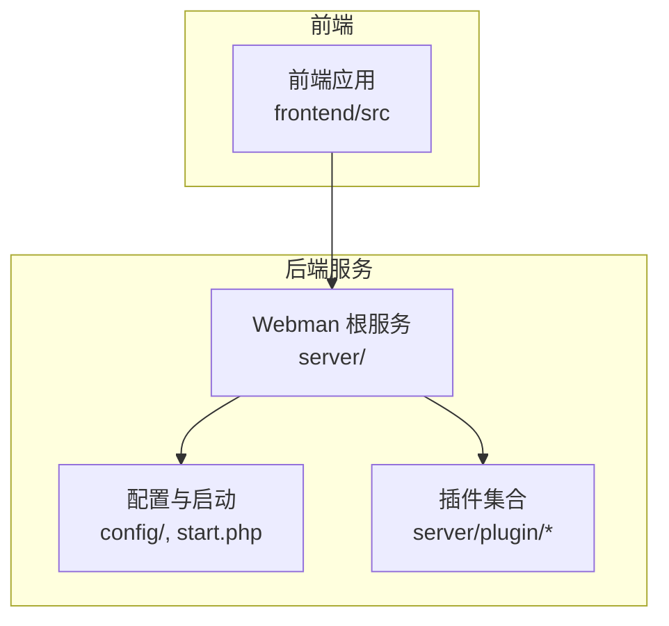
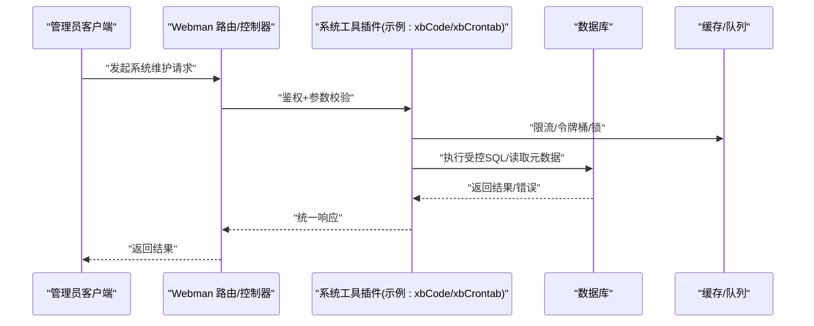
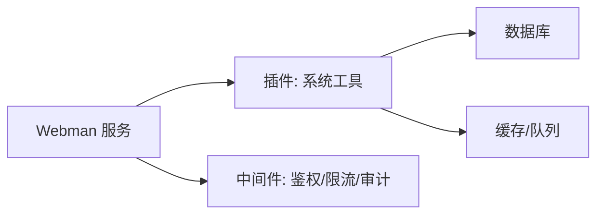

# 系统工具接口

<cite>
**本文引用的文件**   
- [server/README.md](file://server/README.md)
</cite>

## 目录
1. [简介](#简介)
2. [项目结构](#项目结构)
3. [核心组件](#核心组件)
4. [架构总览](#架构总览)
5. [详细组件分析](#详细组件分析)
6. [依赖分析](#依赖分析)
7. [性能考虑](#性能考虑)
8. [故障排查指南](#故障排查指南)
9. [结论](#结论)
10. [附录](#附录)

## 简介
本文件面向“系统工具模块”的API接口文档，聚焦于数据库管理、包管理器、定时任务、表结构查看等系统维护能力，并补充代码生成、数据迁移、系统诊断等高级功能。由于当前仓库未提供具体的后端控制器与路由实现，本文以框架级说明为主，给出通用接口设计建议、安全限制、事务管理与执行环境隔离的最佳实践，并提供调用示例模板，便于在已有或后续实现的插件中落地。

## 项目结构
本项目采用 Webman + 插件化架构，核心服务位于 server 目录，业务与系统工具多以插件形式组织（如 xbCode、xbCrontab、xbDeveloper 等）。前端位于 frontend 目录，通过 API 与后端交互。

图表来源
- [server/README.md:1-148](file://server/README.md#L1-L148)

章节来源
- [server/README.md:1-148](file://server/README.md#L1-L148)

## 核心组件
本节概述系统工具相关的高层能力与职责划分，便于理解后续接口设计与安全策略。

- 数据库管理
  - 连接与查询：提供只读查询、元数据读取（表/字段/索引）、受控写入（需审批/白名单）
  - 事务管理：支持显式事务边界、回滚策略、超时控制
  - SQL 执行环境隔离：沙箱模式、命令白名单、资源限制
- 包管理器
  - 安装/卸载/升级：校验签名、依赖解析、回滚机制
  - 版本与发布：制品库对接、变更日志、灰度发布
- 定时任务
  - 任务定义：Cron 表达式、并发控制、失败重试
  - 运行监控：执行历史、日志、告警
- 表结构查看
  - 元数据导出：DDL、字段注释、关系图
  - 变更审计：变更记录、差异对比
- 代码生成
  - 模板驱动：基于模型/表结构生成 CRUD、API、前端页面
  - 可插拔：自定义模板与规则
- 数据迁移
  - 版本化脚本：up/down、幂等性、依赖顺序
  - 回滚与补偿：失败自动回滚、人工干预入口
- 系统诊断
  - 健康检查：DB/Redis/队列状态
  - 指标采集：QPS、延迟、错误率、资源使用

章节来源
- [server/README.md:1-148](file://server/README.md#L1-L148)

## 架构总览
下图展示系统工具模块与前后端、插件体系的关系，以及典型请求链路。

图表来源
- [server/README.md:1-148](file://server/README.md#L1-L148)

## 详细组件分析

### 数据库管理接口
- 目标
  - 提供安全的数据库访问能力，满足运维与开发调试需求，同时保障生产安全。
- 关键约束
  - 权限最小化：仅允许指定账号/角色访问；按库/表/操作维度授权
  - 命令白名单：仅允许 SELECT、SHOW、DESCRIBE、EXPLAIN 等只读命令；写操作需二次确认与审计
  - 资源限制：最大行数、超时时间、内存上限、禁止危险函数
  - 执行隔离：独立连接池、独立用户、只读副本优先
  - 审计与留痕：记录完整SQL、执行者、耗时、影响行数
- 事务管理
  - 显式开启/提交/回滚；嵌套事务由上层协调
  - 长事务保护：超时自动回滚；死锁检测与重试
- 典型接口（概念）
  - 执行SQL：POST /api/system/db/exec
  - 查询元数据：GET /api/system/db/metadata/{table}
  - 事务控制：POST /api/system/db/transaction/start|commit|rollback
  - 慢查询/执行计划：GET /api/system/db/explain
- 调用示例（模板）
  - 请求体包含：sql、params、timeout、max_rows、is_readonly
  - 响应体包含：status、data、error、trace_id、cost_ms

章节来源
- [server/README.md:1-148](file://server/README.md#L1-L148)

### 包管理器接口
- 目标
  - 对插件/依赖进行安装、卸载、升级、回滚，确保一致性与可追溯。
- 关键约束
  - 完整性校验：签名/哈希校验
  - 依赖解析：冲突检测、版本兼容
  - 原子更新：先装后启、失败回滚
  - 灰度发布：按实例/权重逐步放量
- 典型接口（概念）
  - 安装：POST /api/system/package/install
  - 卸载：POST /api/system/package/uninstall
  - 升级：POST /api/system/package/upgrade
  - 列表/详情：GET /api/system/package/list|info
- 调用示例（模板）
  - 请求体包含：package_name、version、checksum、dry_run
  - 响应体包含：status、plan、errors、rollback_info

章节来源
- [server/README.md:1-148](file://server/README.md#L1-L148)

### 定时任务接口
- 目标
  - 提供任务的创建、调度、执行、监控与排障能力。
- 关键约束
  - 并发控制：单实例串行/全局互斥
  - 失败重试：指数退避、最大重试次数
  - 资源配额：CPU/内存/IO 限制
  - 可观测性：执行日志、指标上报、告警
- 典型接口（概念）
  - 创建任务：POST /api/system/cron/task
  - 立即执行：POST /api/system/cron/task/{id}/run
  - 暂停/恢复：PUT /api/system/cron/task/{id}/pause|resume
  - 执行历史：GET /api/system/cron/task/{id}/logs
- 调用示例（模板）
  - 请求体包含：name、cron、command、retry、timeout、labels
  - 响应体包含：task_id、next_run_at、status

章节来源
- [server/README.md:1-148](file://server/README.md#L1-L148)

### 表结构查看接口
- 目标
  - 快速了解表结构、字段类型、索引、外键关系，辅助开发与排障。
- 关键约束
  - 只读访问：仅读取信息_schema/INFORMATION_SCHEMA
  - 脱敏策略：隐藏敏感字段注释/默认值
  - 分页与过滤：按库/表/关键字检索
- 典型接口（概念）
  - 列出表：GET /api/system/schema/tables
  - 表详情：GET /api/system/schema/table/{name}
  - 导出DDL：GET /api/system/schema/export?format=ddl
- 调用示例（模板）
  - 查询参数：database、table、include_comments、limit
  - 响应体包含：columns、indexes、foreign_keys、ddl

章节来源
- [server/README.md:1-148](file://server/README.md#L1-L148)

### 代码生成接口
- 目标
  - 基于模型/表结构自动生成后端CRUD、API、前端页面与表单。
- 关键约束
  - 模板可控：支持自定义模板与变量
  - 增量生成：覆盖策略、冲突提示
  - 质量门禁：语法检查、静态扫描
- 典型接口（概念）
  - 预览生成：POST /api/system/codegen/preview
  - 生成并保存：POST /api/system/codegen/generate
  - 模板管理：GET/POST /api/system/codegen/templates
- 调用示例（模板）
  - 请求体包含：model、targets、template、options
  - 响应体包含：files、diff、warnings

章节来源
- [server/README.md:1-148](file://server/README.md#L1-L148)

### 数据迁移接口
- 目标
  - 以版本化脚本管理数据库结构与初始数据变更，支持回滚。
- 关键约束
  - 幂等性：重复执行不产生副作用
  - 顺序与依赖：按版本号与依赖拓扑执行
  - 事务包裹：失败整体回滚
- 典型接口（概念）
  - 列出迁移：GET /api/system/migration/list
  - 执行迁移：POST /api/system/migration/run
  - 回滚迁移：POST /api/system/migration/rollback
- 调用示例（模板）
  - 请求体包含：target_version、dry_run、force
  - 响应体包含：applied、skipped、rolled_back、errors

章节来源
- [server/README.md:1-148](file://server/README.md#L1-L148)

### 系统诊断接口
- 目标
  - 提供系统健康检查、指标采集与问题定位能力。
- 关键约束
  - 低开销：避免在生产高峰采集重指标
  - 安全访问：仅限管理员或特定角色
  - 输出规范：结构化JSON，便于自动化处理
- 典型接口（概念）
  - 健康检查：GET /api/system/health
  - 指标快照：GET /api/system/metrics
  - 日志检索：GET /api/system/logs
- 调用示例（模板）
  - 查询参数：scope、since、level、limit
  - 响应体包含：status、components、metrics、samples

章节来源
- [server/README.md:1-148](file://server/README.md#L1-L148)

## 依赖分析
- 外部依赖
  - Webman 作为高性能 HTTP 服务器
  - PHP 运行时与扩展（MySQL/Redis/队列等）
  - 可选：消息队列、对象存储、缓存
- 内部依赖
  - 插件体系：各系统工具以插件形式接入
  - 配置中心：统一加载数据库、缓存、队列等配置
  - 中间件：鉴权、限流、审计、错误处理

图表来源
- [server/README.md:1-148](file://server/README.md#L1-L148)

章节来源
- [server/README.md:1-148](file://server/README.md#L1-L148)

## 性能考虑
- 数据库
  - 只读优先：尽量走只读副本；批量查询分页拉取
  - 连接池：合理设置最大连接数与空闲回收
  - 慢查询治理：定期分析 EXPLAIN，优化索引
- 缓存与队列
  - 热点数据缓存；队列消费并行度与背压控制
- 限流与熔断
  - 接口级限流；下游异常快速失败与降级
- 可观测性
  - 埋点关键路径；指标与日志关联追踪ID

[本节为通用指导，无需源码引用]

## 故障排查指南
- 常见问题
  - 权限不足：检查RBAC与数据权限
  - SQL 被拦截：核对命令白名单与资源限制
  - 任务失败：查看执行日志与重试策略
  - 包安装失败：检查签名校验与依赖冲突
- 定位步骤
  - 从响应 trace_id 入手，串联网关、控制器、插件、DB/缓存日志
  - 使用诊断接口获取健康与指标快照
  - 对关键路径开启调试日志，注意脱敏

章节来源
- [server/README.md:1-148](file://server/README.md#L1-L148)

## 结论
本文围绕系统工具模块的数据库管理、包管理、定时任务、表结构查看、代码生成、数据迁移与系统诊断等能力，给出了接口设计建议、安全与事务策略、执行隔离与性能优化要点。建议在现有插件体系中逐步落地上述接口，并通过鉴权、审计与可观测性保障生产安全与稳定性。

[本节为总结性内容，无需源码引用]

## 附录
- 最佳实践清单
  - 所有系统维护接口必须鉴权与审计
  - 写操作强制二次确认与审批流
  - 严格白名单与资源限制
  - 全链路追踪ID贯穿请求
  - 变更可回滚、可观测、可验证
- 安全注意事项
  - 最小权限原则
  - 输入校验与输出脱敏
  - 防注入与防越权
  - 密钥与凭据集中管理
- 性能优化建议
  - 读写分离与只读副本
  - 缓存热点数据
  - 异步化与批量化
  - 合理分页与索引优化

[本节为通用指导，无需源码引用]