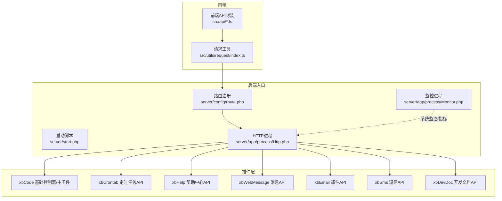
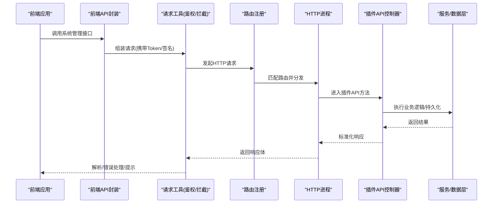
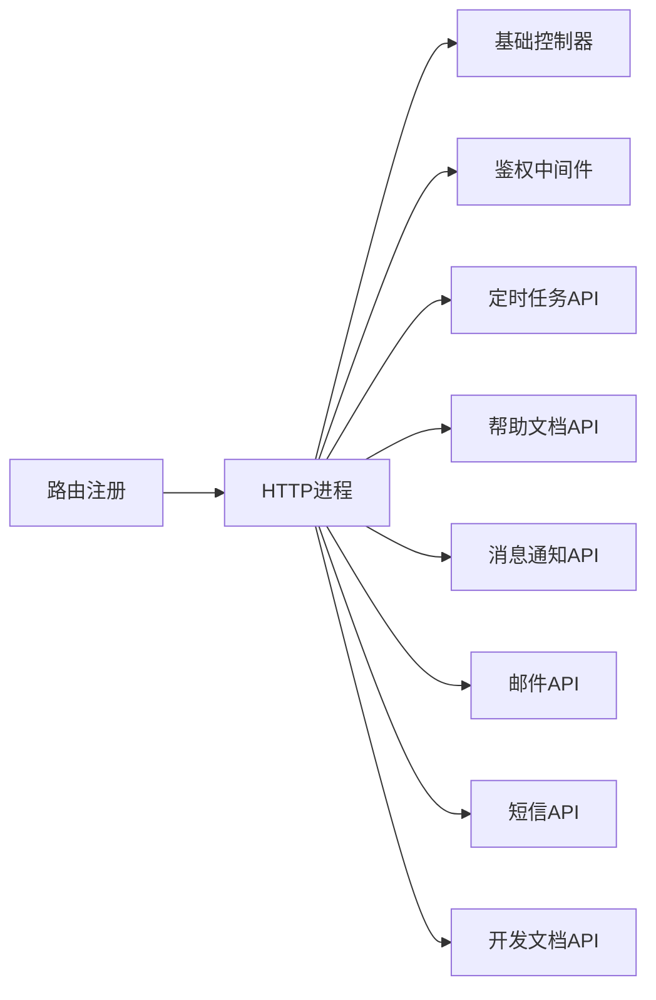

# 系统管理接口

<cite>
**本文引用的文件**   
- [server/config/route.php](file://server/config/route.php)
- [server/start.php](file://server/start.php)
- [server/app/process/Http.php](file://server/app/process/Http.php)
- [server/app/process/Monitor.php](file://server/app/process/Monitor.php)
- [server/plugin/xbCode/XbController.php](file://server/plugin/xbCode/XbController.php)
- [server/plugin/xbCode/config/middleware.php](file://server/plugin/xbCode/config/middleware.php)
- [server/plugin/xbCrontab/api/CrontabApi.php](file://server/plugin/xbCrontab/api/CrontabApi.php)
- [server/plugin/xbHelp/api/HelpArticleApi.php](file://server/plugin/xbHelp/api/HelpArticleApi.php)
- [server/plugin/xbWebMessage/api/WebMessageApi.php](file://server/plugin/xbWebMessage/api/WebMessageApi.php)
- [server/plugin/xbEmail/api/EmailApi.php](file://server/plugin/xbEmail/api/EmailApi.php)
- [server/plugin/xbSms/api/SmsApi.php](file://server/plugin/xbSms/api/SmsApi.php)
- [server/plugin/xbDevDoc/api/DevDocApi.php](file://server/plugin/xbDevDoc/api/DevDocApi.php)
- [frontend/src/api/config.ts](file://frontend/src/api/config.ts)
- [frontend/src/api/modelLog.ts](file://frontend/src/api/modelLog.ts)
- [frontend/src/api/notice.ts](file://frontend/src/api/notice.ts)
- [frontend/src/api/helpArticle.ts](file://frontend/src/api/helpArticle.ts)
- [frontend/src/utils/request/index.ts](file://frontend/src/utils/request/index.ts)
</cite>

## 目录
1. [简介](#简介)
2. [项目结构](#项目结构)
3. [核心组件](#核心组件)
4. [架构总览](#架构总览)
5. [详细组件分析](#详细组件分析)
6. [依赖分析](#依赖分析)
7. [性能考虑](#性能考虑)
8. [故障排查指南](#故障排查指南)
9. [结论](#结论)
10. [附录](#附录)

## 简介
本文件为“系统管理模块”的完整API接口文档，覆盖系统配置、日志监控、消息通知、帮助文档、定时任务等系统级管理能力。内容包含管理员权限控制、系统状态监控、告警通知、文档管理等后台管理功能；并详细说明系统健康检查、性能指标收集、日志查询与分析等运维相关接口，提供面向系统管理与维护的调用示例与最佳实践。

## 项目结构
后端采用 webman 框架，插件化组织业务域（如 xbCode、xbCrontab、xbHelp、xbWebMessage、xbEmail、xbSms、xbDevDoc 等），路由集中注册于 server/config/route.php，进程模型在 app/process 中定义（HTTP 主进程与 Monitor 监控进程）。前端通过 src/api 下的各模块发起请求，统一由 request 工具处理鉴权与错误拦截。

图表来源
- [server/start.php](file://server/start.php)
- [server/config/route.php](file://server/config/route.php)
- [server/app/process/Http.php](file://server/app/process/Http.php)
- [server/app/process/Monitor.php](file://server/app/process/Monitor.php)
- [server/plugin/xbCode/XbController.php](file://server/plugin/xbCode/XbController.php)
- [server/plugin/xbCode/config/middleware.php](file://server/plugin/xbCode/config/middleware.php)
- [server/plugin/xbCrontab/api/CrontabApi.php](file://server/plugin/xbCrontab/api/CrontabApi.php)
- [server/plugin/xbHelp/api/HelpArticleApi.php](file://server/plugin/xbHelp/api/HelpArticleApi.php)
- [server/plugin/xbWebMessage/api/WebMessageApi.php](file://server/plugin/xbWebMessage/api/WebMessageApi.php)
- [server/plugin/xbEmail/api/EmailApi.php](file://server/plugin/xbEmail/api/EmailApi.php)
- [server/plugin/xbSms/api/SmsApi.php](file://server/plugin/xbSms/api/SmsApi.php)
- [server/plugin/xbDevDoc/api/DevDocApi.php](file://server/plugin/xbDevDoc/api/DevDocApi.php)
- [frontend/src/api/config.ts](file://frontend/src/api/config.ts)
- [frontend/src/api/modelLog.ts](file://frontend/src/api/modelLog.ts)
- [frontend/src/api/notice.ts](file://frontend/src/api/notice.ts)
- [frontend/src/api/helpArticle.ts](file://frontend/src/api/helpArticle.ts)
- [frontend/src/utils/request/index.ts](file://frontend/src/utils/request/index.ts)

章节来源
- [server/start.php](file://server/start.php)
- [server/config/route.php](file://server/config/route.php)
- [server/app/process/Http.php](file://server/app/process/Http.php)
- [server/app/process/Monitor.php](file://server/app/process/Monitor.php)
- [server/plugin/xbCode/XbController.php](file://server/plugin/xbCode/XbController.php)
- [server/plugin/xbCode/config/middleware.php](file://server/plugin/xbCode/config/middleware.php)
- [frontend/src/utils/request/index.ts](file://frontend/src/utils/request/index.ts)

## 核心组件
- 路由与进程
  - 路由集中注册：所有系统管理接口均通过路由文件进行声明式绑定。
  - HTTP 进程：负责接收外部请求、分发到对应控制器/插件API。
  - 监控进程：用于系统运行态监控与指标采集，可配合健康检查接口使用。
- 基础控制器与中间件
  - 基础控制器：提供统一的响应格式、参数校验、分页、异常处理等能力。
  - 中间件：实现管理员鉴权、访问日志、限流、跨域等横切关注点。
- 插件API
  - 定时任务：任务列表、启停、执行、日志查看。
  - 帮助文档：文章、分类、FAQ、资源等CRUD与检索。
  - 消息通知：站内信、广播、定向推送。
  - 邮件/短信：发送、模板、通道配置、发送记录。
  - 开发文档：文档站点管理、版本发布。
- 前端API封装
  - 按模块拆分：config、modelLog、notice、helpArticle 等。
  - 统一请求工具：注入鉴权头、错误拦截、重试策略。

章节来源
- [server/config/route.php](file://server/config/route.php)
- [server/app/process/Http.php](file://server/app/process/Http.php)
- [server/app/process/Monitor.php](file://server/app/process/Monitor.php)
- [server/plugin/xbCode/XbController.php](file://server/plugin/xbCode/XbController.php)
- [server/plugin/xbCode/config/middleware.php](file://server/plugin/xbCode/config/middleware.php)
- [frontend/src/api/config.ts](file://frontend/src/api/config.ts)
- [frontend/src/api/modelLog.ts](file://frontend/src/api/modelLog.ts)
- [frontend/src/api/notice.ts](file://frontend/src/api/notice.ts)
- [frontend/src/api/helpArticle.ts](file://frontend/src/api/helpArticle.ts)
- [frontend/src/utils/request/index.ts](file://frontend/src/utils/request/index.ts)

## 架构总览
下图展示从前端到后端的端到端调用链路，以及系统管理相关插件的职责边界。

图表来源
- [server/config/route.php](file://server/config/route.php)
- [server/app/process/Http.php](file://server/app/process/Http.php)
- [server/plugin/xbCode/XbController.php](file://server/plugin/xbCode/XbController.php)
- [frontend/src/utils/request/index.ts](file://frontend/src/utils/request/index.ts)

## 详细组件分析

### 系统配置接口
- 能力范围
  - 获取/更新全局系统配置项（站点信息、安全策略、第三方服务开关等）
  - 批量保存配置、回滚至默认值
  - 配置变更审计日志
- 典型流程
  - 管理员登录 -> 读取配置 -> 修改并提交 -> 写入缓存/数据库 -> 触发配置热更新事件
- 调用示例（路径参考）
  - 获取配置：GET /api/system/config
  - 更新配置：PUT /api/system/config
  - 批量保存：POST /api/system/config/batch
  - 回滚默认：POST /api/system/config/reset
- 权限要求
  - 需要管理员角色或特定配置管理权限
- 注意事项
  - 敏感字段需脱敏返回
  - 大对象配置建议分块提交
  - 变更后建议刷新本地缓存

章节来源
- [server/config/route.php](file://server/config/route.php)
- [server/plugin/xbCode/XbController.php](file://server/plugin/xbCode/XbController.php)
- [server/plugin/xbCode/config/middleware.php](file://server/plugin/xbCode/config/middleware.php)
- [frontend/src/api/config.ts](file://frontend/src/api/config.ts)

### 日志监控接口
- 能力范围
  - 系统运行日志查询（按时间、级别、模块、关键字）
  - 模型任务日志（创建、执行、失败原因、耗时）
  - 性能指标与健康检查（CPU/内存/队列长度/连接池）
- 典型流程
  - 前端轮询/拉取 -> 后端聚合多源日志 -> 过滤分页 -> 返回结构化结果
- 调用示例（路径参考）
  - 系统日志查询：GET /api/system/logs
  - 模型任务日志：GET /api/model/logs
  - 健康检查：GET /api/system/health
  - 性能指标：GET /api/system/metrics
- 权限要求
  - 仅管理员或运维角色可访问
- 注意事项
  - 日志量大时建议增加时间窗口与索引字段
  - 健康检查应轻量且幂等
  - 指标采集避免阻塞主线程

章节来源
- [server/app/process/Monitor.php](file://server/app/process/Monitor.php)
- [server/plugin/xbCode/XbController.php](file://server/plugin/xbCode/XbController.php)
- [frontend/src/api/modelLog.ts](file://frontend/src/api/modelLog.ts)

### 消息通知接口
- 能力范围
  - 站内信/广播/定向推送
  - 通知模板管理、已读回执、批量发送
- 典型流程
  - 管理员创建通知 -> 选择目标用户/标签 -> 异步投递 -> 客户端实时/轮询获取
- 调用示例（路径参考）
  - 发送通知：POST /api/notice/send
  - 通知列表：GET /api/notice/list
  - 标记已读：PUT /api/notice/read
- 权限要求
  - 管理员或具备通知发送权限的角色
- 注意事项
  - 高并发场景建议使用队列异步发送
  - 支持去重与防抖策略

章节来源
- [server/plugin/xbWebMessage/api/WebMessageApi.php](file://server/plugin/xbWebMessage/api/WebMessageApi.php)
- [frontend/src/api/notice.ts](file://frontend/src/api/notice.ts)

### 帮助文档接口
- 能力范围
  - 文章/分类/FAQ/资源管理
  - 搜索与全文检索、版本发布
- 典型流程
  - 编辑内容 -> 预览 -> 发布 -> 同步至搜索索引
- 调用示例（路径参考）
  - 文章列表：GET /api/help/articles
  - 创建/更新：POST/PUT /api/help/articles
  - 删除：DELETE /api/help/articles/{id}
  - 搜索：GET /api/help/search
- 权限要求
  - 管理员或内容运营角色
- 注意事项
  - 富文本内容需做XSS过滤
  - 发布前建议走审核流程

章节来源
- [server/plugin/xbHelp/api/HelpArticleApi.php](file://server/plugin/xbHelp/api/HelpArticleApi.php)
- [frontend/src/api/helpArticle.ts](file://frontend/src/api/helpArticle.ts)

### 定时任务接口
- 能力范围
  - 任务CRUD、调度表达式配置、立即执行、历史执行记录
- 典型流程
  - 新增任务 -> 设置调度规则 -> 启动 -> 执行器拉取并执行 -> 记录结果
- 调用示例（路径参考）
  - 任务列表：GET /api/crontab/tasks
  - 创建/更新：POST/PUT /api/crontab/tasks
  - 立即执行：POST /api/crontab/tasks/{id}/run
  - 执行日志：GET /api/crontab/tasks/{id}/logs
- 权限要求
  - 管理员或运维角色
- 注意事项
  - 幂等性设计，重复执行需去重
  - 失败重试与告警机制

章节来源
- [server/plugin/xbCrontab/api/CrontabApi.php](file://server/plugin/xbCrontab/api/CrontabApi.php)

### 邮件/短信接口
- 能力范围
  - 发送单条/批量邮件/短信
  - 模板管理、通道配置、发送记录
- 典型流程
  - 构建模板 -> 选择通道 -> 异步发送 -> 回调记录
- 调用示例（路径参考）
  - 发送邮件：POST /api/email/send
  - 发送短信：POST /api/sms/send
  - 发送记录：GET /api/email/records / GET /api/sms/records
- 权限要求
  - 管理员或具备通信发送权限的角色
- 注意事项
  - 频率限制与配额控制
  - 敏感号码/邮箱脱敏

章节来源
- [server/plugin/xbEmail/api/EmailApi.php](file://server/plugin/xbEmail/api/EmailApi.php)
- [server/plugin/xbSms/api/SmsApi.php](file://server/plugin/xbSms/api/SmsApi.php)

### 开发文档接口
- 能力范围
  - 文档站点管理、版本发布、在线预览
- 典型流程
  - 上传/编辑文档 -> 生成静态站点 -> 发布上线
- 调用示例（路径参考）
  - 文档列表：GET /api/devdoc/docs
  - 发布：POST /api/devdoc/publish
- 权限要求
  - 管理员或文档管理员
- 注意事项
  - 发布过程异步化，避免阻塞

章节来源
- [server/plugin/xbDevDoc/api/DevDocApi.php](file://server/plugin/xbDevDoc/api/DevDocApi.php)

### 管理员权限控制
- 能力范围
  - 基于角色的访问控制（RBAC）、菜单与接口级权限
  - 会话/令牌管理、操作审计
- 关键机制
  - 中间件校验：验证管理员身份与权限
  - 基础控制器：统一鉴权上下文注入
- 调用示例（路径参考）
  - 鉴权中间件：在路由或控制器上挂载
  - 获取当前管理员信息：GET /api/admin/profile
- 注意事项
  - 最小权限原则
  - 敏感操作二次确认与审计

章节来源
- [server/plugin/xbCode/XbController.php](file://server/plugin/xbCode/XbController.php)
- [server/plugin/xbCode/config/middleware.php](file://server/plugin/xbCode/config/middleware.php)

## 依赖分析
- 组件耦合
  - 路由层对插件API解耦，便于独立升级与扩展
  - 基础控制器与中间件提供通用能力，降低重复代码
- 外部依赖
  - 队列/缓存/存储引擎（由插件配置决定）
  - 第三方邮件/短信服务商SDK
- 潜在风险
  - 路由冲突需严格命名空间隔离
  - 中间件顺序影响鉴权与日志准确性

图表来源
- [server/config/route.php](file://server/config/route.php)
- [server/app/process/Http.php](file://server/app/process/Http.php)
- [server/plugin/xbCode/XbController.php](file://server/plugin/xbCode/XbController.php)
- [server/plugin/xbCode/config/middleware.php](file://server/plugin/xbCode/config/middleware.php)
- [server/plugin/xbCrontab/api/CrontabApi.php](file://server/plugin/xbCrontab/api/CrontabApi.php)
- [server/plugin/xbHelp/api/HelpArticleApi.php](file://server/plugin/xbHelp/api/HelpArticleApi.php)
- [server/plugin/xbWebMessage/api/WebMessageApi.php](file://server/plugin/xbWebMessage/api/WebMessageApi.php)
- [server/plugin/xbEmail/api/EmailApi.php](file://server/plugin/xbEmail/api/EmailApi.php)
- [server/plugin/xbSms/api/SmsApi.php](file://server/plugin/xbSms/api/SmsApi.php)
- [server/plugin/xbDevDoc/api/DevDocApi.php](file://server/plugin/xbDevDoc/api/DevDocApi.php)

## 性能考虑
- 健康检查与指标采集应保持轻量，避免IO密集操作
- 日志查询增加时间窗口与索引字段，减少全表扫描
- 通知与邮件/短信发送走队列异步处理，提升吞吐
- 配置变更采用缓存预热与灰度生效策略
- 前端轮询间隔合理设置，避免频繁请求

## 故障排查指南
- 常见问题
  - 鉴权失败：检查Token是否过期、权限是否授予
  - 路由未命中：核对路由注册与URL路径
  - 日志缺失：确认日志级别与输出目标
  - 任务失败：查看执行日志与重试次数
- 定位步骤
  - 通过健康检查确认服务可用
  - 使用日志查询接口过滤错误堆栈
  - 结合监控指标观察CPU/内存/队列积压情况
  - 复现问题并开启调试模式（生产谨慎）

章节来源
- [server/app/process/Monitor.php](file://server/app/process/Monitor.php)
- [server/plugin/xbCode/XbController.php](file://server/plugin/xbCode/XbController.php)

## 结论
系统管理模块以插件化架构为核心，围绕配置、日志、通知、文档、定时任务等能力形成完整的后台管理体系。通过统一的基础控制器与中间件保障一致性与安全性，借助监控进程与健康检查接口支撑运维稳定性。建议在生产环境强化权限控制、异步化与可观测性建设，持续提升系统的可维护性与可扩展性。

## 附录
- 前端API模块参考
  - 系统配置：[frontend/src/api/config.ts](file://frontend/src/api/config.ts)
  - 模型日志：[frontend/src/api/modelLog.ts](file://frontend/src/api/modelLog.ts)
  - 通知：[frontend/src/api/notice.ts](file://frontend/src/api/notice.ts)
  - 帮助文档：[frontend/src/api/helpArticle.ts](file://frontend/src/api/helpArticle.ts)
- 请求工具与拦截器
  - 统一请求封装：[frontend/src/utils/request/index.ts](file://frontend/src/utils/request/index.ts)