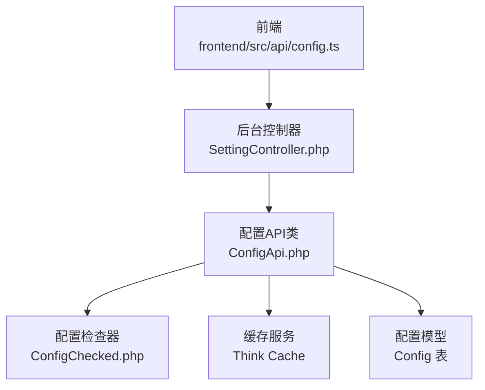
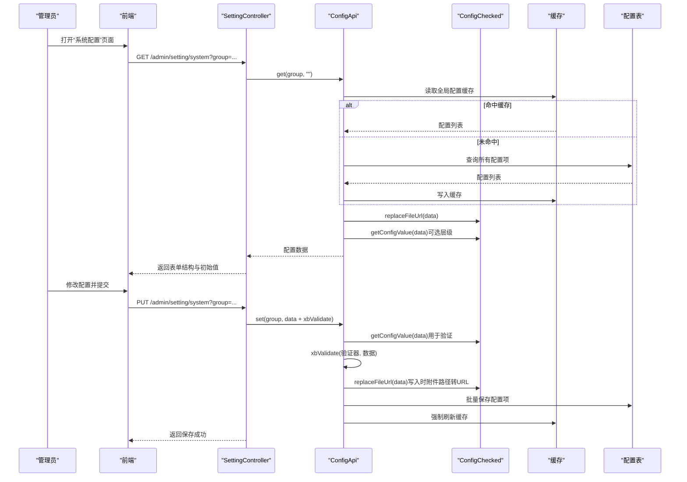
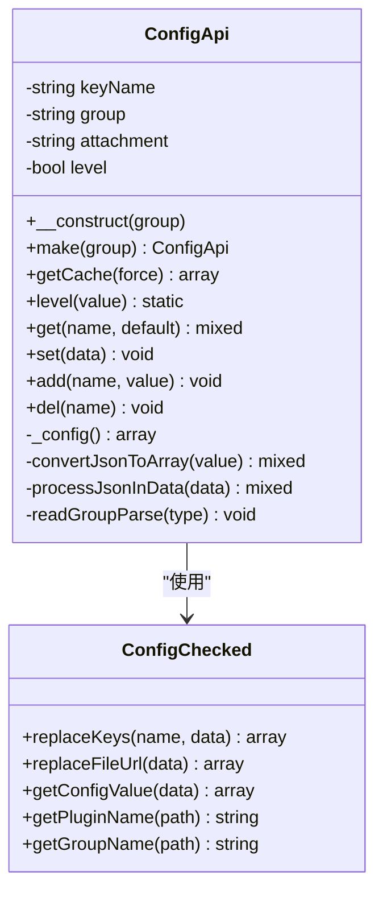
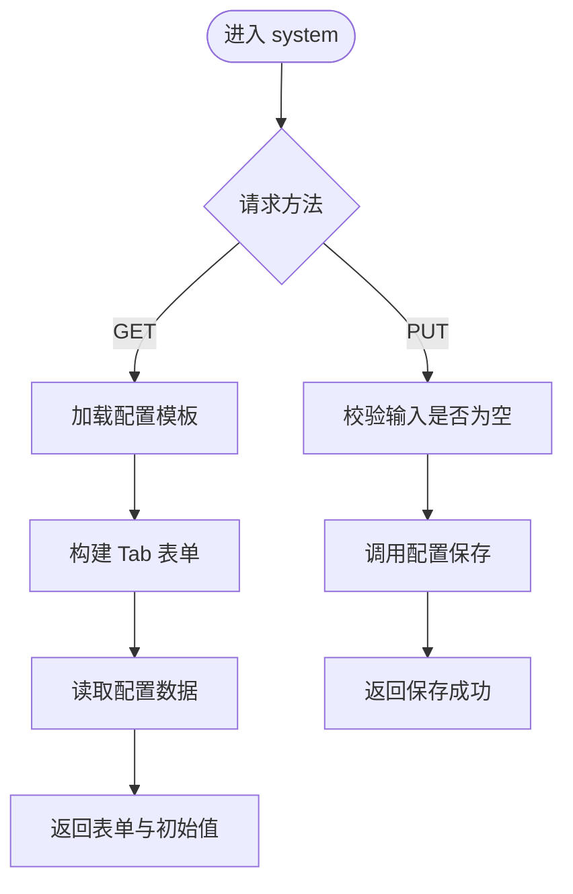
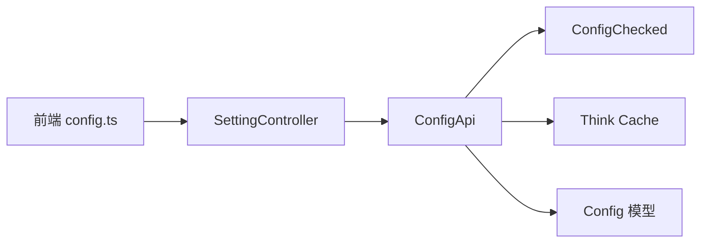

# 配置管理接口

<cite>
**本文引用的文件**   
- [ConfigApi.php](file://server/plugin\xbCode\api\ConfigApi.php)
- [ConfigChecked.php](file://server/plugin\xbCode\api\ConfigChecked.php)
- [SettingController.php](file://server/plugin\xbCode\app\admin\controller\SettingController.php)
- [config.ts](file://frontend\src\api\config.ts)
</cite>

## 目录
1. [简介](#简介)
2. [项目结构](#项目结构)
3. [核心组件](#核心组件)
4. [架构总览](#架构总览)
5. [详细组件分析](#详细组件分析)
6. [依赖关系分析](#依赖关系分析)
7. [性能与缓存特性](#性能与缓存特性)
8. [错误处理与排障](#错误处理与排障)
9. [结论](#结论)
10. [附录：接口规范与示例](#附录接口规范与示例)

## 简介
本文件为系统配置管理模块的API接口文档，覆盖配置的增删改查、验证机制、视图渲染、权限与安全策略、热重载、版本管理与批量操作等高级能力。文档面向管理员对系统配置的完整管理能力，提供清晰的请求/响应约定、数据结构定义、校验规则与错误处理方案。

## 项目结构
后端采用插件化架构，配置管理核心位于 xbCode 插件中；前端通过统一 API 客户端调用站点配置接口。关键路径如下：
- 后端配置读写API类：server/plugin/xbCode/api/ConfigApi.php
- 配置数据处理与校验辅助：server/plugin/xbCode/api/ConfigChecked.php
- 后台配置页面控制器（表单渲染与保存）：server/plugin/xbCode/app/admin/controller/SettingController.php
- 前端站点配置类型与获取接口：frontend/src/api/config.ts

图表来源
- [SettingController.php:32-53](file://server/plugin\xbCode\app\admin\controller\SettingController.php#L32-L53)
- [ConfigApi.php:86-99](file://server/plugin\xbCode\api\ConfigApi.php#L86-L99)
- [ConfigChecked.php:51-82](file://server/plugin\xbCode\api\ConfigChecked.php#L51-L82)
- [config.ts:197-199](file://frontend\src\api\config.ts#L197-L199)

章节来源
- [SettingController.php:32-53](file://server/plugin\xbCode\app\admin\controller\SettingController.php#L32-L53)
- [ConfigApi.php:86-99](file://server/plugin\xbCode\api\ConfigApi.php#L86-L99)
- [ConfigChecked.php:51-82](file://server/plugin\xbCode\api\ConfigChecked.php#L51-L82)
- [config.ts:197-199](file://frontend\src\api\config.ts#L197-L199)

## 核心组件
- ConfigApi：提供配置的读取、写入、追加、删除与缓存刷新能力，支持层级键名、前缀匹配、批量保存、附件URL替换与JSON自动解析。
- ConfigChecked：提供配置数据的键名替换、文件URL替换、层级数据组装、分组名称提取等工具方法。
- SettingController：后台配置页面的入口，负责根据模板动态生成表单、接收PUT保存请求并返回渲染结果。
- 前端 config.ts：定义站点配置的数据结构类型，并提供获取站点配置的接口函数。

章节来源
- [ConfigApi.php:22-78](file://server/plugin\xbCode\api\ConfigApi.php#L22-L78)
- [ConfigChecked.php:21-82](file://server/plugin\xbCode\api\ConfigChecked.php#L21-L82)
- [SettingController.php:32-78](file://server/plugin\xbCode\app\admin\controller\SettingController.php#L32-L78)
- [config.ts:174-199](file://frontend\src\api\config.ts#L174-L199)

## 架构总览
配置管理的整体流程包括：
- 读取：从缓存或数据库加载配置，按分组与键名解析，支持层级与前缀匹配，自动将附件相对路径转换为绝对URL，并将JSON字符串解析为数组。
- 写入：支持批量保存，可选验证器进行字段校验，自动转换附件路径为绝对URL，持久化后刷新缓存。
- 视图：后台控制器扫描各插件的配置模板，动态构建Tab表单，GET返回表单结构与初始值，PUT提交保存。

图表来源
- [SettingController.php:32-53](file://server/plugin\xbCode\app\admin\controller\SettingController.php#L32-L53)
- [ConfigApi.php:206-275](file://server/plugin\xbCode\api\ConfigApi.php#L206-L275)
- [ConfigApi.php:285-341](file://server/plugin\xbCode\api\ConfigApi.php#L285-L341)
- [ConfigChecked.php:51-82](file://server/plugin\xbCode\api\ConfigChecked.php#L51-L82)

## 详细组件分析

### 配置API（ConfigApi）
- 构造与实例化
  - make(group)：以分组名创建实例，后续所有操作基于该分组。
- 缓存机制
  - getCache(force)：优先读缓存，未命中则全量拉取配置并写入缓存；支持多租户隔离（saas_appid）。
- 读取配置
  - get(name, default)：支持精确匹配、逗号分隔的多键批量读取、层级键名（如 a.b.c）、前缀匹配（如 qcloud.*），并在读取时自动将附件相对路径替换为绝对URL，同时将JSON字符串解析为数组。
- 保存配置
  - set(data)：支持批量保存；若包含 xbValidate 字段，先执行验证再持久化；自动将附件相对路径转为绝对URL；保存后强制刷新缓存。
- 追加配置
  - add(name, value)：在指定分组下新增配置项，若已存在则抛出异常。
- 删除配置
  - del(name)：按分组与名称删除配置项，并刷新缓存。

图表来源
- [ConfigApi.php:22-78](file://server/plugin\xbCode\api\ConfigApi.php#L22-L78)
- [ConfigApi.php:86-99](file://server/plugin\xbCode\api\ConfigApi.php#L86-L99)
- [ConfigApi.php:206-275](file://server/plugin\xbCode\api\ConfigApi.php#L206-L275)
- [ConfigApi.php:285-341](file://server/plugin\xbCode\api\ConfigApi.php#L285-L341)
- [ConfigChecked.php:31-82](file://server/plugin\xbCode\api\ConfigChecked.php#L31-L82)

章节来源
- [ConfigApi.php:22-78](file://server/plugin\xbCode\api\ConfigApi.php#L22-L78)
- [ConfigApi.php:86-99](file://server/plugin\xbCode\api\ConfigApi.php#L86-L99)
- [ConfigApi.php:206-275](file://server/plugin\xbCode\api\ConfigApi.php#L206-L275)
- [ConfigApi.php:285-341](file://server/plugin\xbCode\api\ConfigApi.php#L285-L341)
- [ConfigChecked.php:31-82](file://server/plugin\xbCode\api\ConfigChecked.php#L31-L82)

### 配置检查器（ConfigChecked）
- replaceFileUrl(data)：遍历配置值，将包含附件相对路径的值替换为绝对URL。
- getConfigValue(data)：将形如 a.b.c 的扁平键名转换为嵌套数组结构，便于层级读取与验证。
- getGroupName(path)：从带分隔符的路径中提取最终分组名。
- getPluginName(path)：从带分隔符的路径中提取插件名。

章节来源
- [ConfigChecked.php:51-82](file://server/plugin\xbCode\api\ConfigChecked.php#L51-L82)
- [ConfigChecked.php:132-143](file://server/plugin\xbCode\api\ConfigChecked.php#L132-L143)

### 后台配置控制器（SettingController）
- system()
  - GET：根据 group 参数（默认由 plugin/action 推导）读取配置，结合模板构建 Tab 表单并返回。
  - PUT：接收表单数据，调用配置保存逻辑并返回成功消息。
- 模板加载
  - 扫描各插件的 setting/tabs/*.php 模板文件，合并并按 sort 排序，动态注入到表单渲染器。

图表来源
- [SettingController.php:32-53](file://server/plugin\xbCode\app\admin\controller\SettingController.php#L32-L53)
- [SettingController.php:86-115](file://server/plugin\xbCode\app\admin\controller\SettingController.php#L86-L115)

章节来源
- [SettingController.php:32-53](file://server/plugin\xbCode\app\admin\controller\SettingController.php#L32-L53)
- [SettingController.php:86-115](file://server/plugin\xbCode\app\admin\controller\SettingController.php#L86-L115)

### 前端站点配置（config.ts）
- 数据类型定义
  - SiteConfig：聚合 system、webIcp、sms、email、user、login_list、assets、community 等配置域。
  - SystemConfigType、WebIcpType、UserConfigType、SmsConfigType、EmailConfigType 等子类型，明确字段含义与枚举值。
- 接口函数
  - getSiteConfig()：调用 /app/xbMovieApp/api/Config/index 获取站点配置。

章节来源
- [config.ts:174-199](file://frontend\src\api\config.ts#L174-L199)

## 依赖关系分析
- 控制器依赖配置API与模板渲染器。
- 配置API依赖配置检查器、缓存服务与配置模型。
- 前端依赖统一的HTTP客户端与站点配置接口。

图表来源
- [SettingController.php:32-53](file://server/plugin\xbCode\app\admin\controller\SettingController.php#L32-L53)
- [ConfigApi.php:86-99](file://server/plugin\xbCode\api\ConfigApi.php#L86-L99)
- [ConfigChecked.php:51-82](file://server/plugin\xbCode\api\ConfigChecked.php#L51-L82)
- [config.ts:197-199](file://frontend\src\api\config.ts#L197-L199)

章节来源
- [SettingController.php:32-53](file://server/plugin\xbCode\app\admin\controller\SettingController.php#L32-L53)
- [ConfigApi.php:86-99](file://server/plugin\xbCode\api\ConfigApi.php#L86-L99)
- [ConfigChecked.php:51-82](file://server/plugin\xbCode\api\ConfigChecked.php#L51-L82)
- [config.ts:197-199](file://frontend\src\api\config.ts#L197-L199)

## 性能与缓存特性
- 全局缓存：配置全量加载后写入缓存，减少频繁数据库访问。
- 多租户隔离：当请求携带 saas_appid 时，缓存键附加应用标识，避免跨租户污染。
- 热重载：每次保存后强制刷新缓存，确保新配置即时生效。
- 层级与前缀读取：通过 getConfigValue 与前缀匹配提升读取效率与灵活性。
- JSON自动解析：读取时将JSON字符串解析为数组，降低上层处理成本。

章节来源
- [ConfigApi.php:86-99](file://server/plugin\xbCode\api\ConfigApi.php#L86-L99)
- [ConfigApi.php:206-275](file://server/plugin\xbCode\api\ConfigApi.php#L206-L275)
- [ConfigApi.php:285-341](file://server/plugin\xbCode\api\ConfigApi.php#L285-L341)

## 错误处理与排障
- 分组缺失：读取或追加配置时若未设置分组，抛出异常提示“获取配置项分组名称失败”或“追加配置项分组名称失败”。
- 重复添加：使用 add 新增已存在的配置项会抛出异常，提示使用 set 更新。
- 保存失败：配置持久化失败时抛出异常“配置保存失败”。
- 输入为空：后台控制器在PUT保存时若未收到数据，返回“配置数据参数错误”。
- 验证失败：当传入 xbValidate 且验证不通过时，由验证器抛出相应错误信息。

建议排查步骤：
- 确认 group 参数是否正确传递。
- 检查 xbValidate 配置是否合法，必要时移除以定位问题。
- 查看缓存是否被正确刷新，必要时手动触发 getCache(true)。
- 核对附件路径是否包含约定的相对路径前缀，以便自动替换为绝对URL。

章节来源
- [ConfigApi.php:206-211](file://server/plugin\xbCode\api\ConfigApi.php#L206-L211)
- [ConfigApi.php:352-379](file://server/plugin\xbCode\api\ConfigApi.php#L352-L379)
- [ConfigApi.php:336-338](file://server/plugin\xbCode\api\ConfigApi.php#L336-L338)
- [SettingController.php:39-46](file://server/plugin\xbCode\app\admin\controller\SettingController.php#L39-L46)

## 结论
配置管理模块通过统一的API类与后台控制器，实现了高内聚、低耦合的配置读写与渲染能力。借助缓存、层级解析、前缀匹配与验证器，既保证了性能与易用性，也提供了良好的扩展性与安全性。管理员可基于此完成系统配置的全面管理。

## 附录：接口规范与示例

### 通用约定
- 内容类型：application/json
- 认证：需具备管理员权限（由平台鉴权中间件控制）
- 返回格式：统一包装 success/fail 结构（具体字段以控制器实现为准）

### 获取站点配置
- 方法：GET
- 路径：/app/xbMovieApp/api/Config/index
- 说明：返回站点级配置集合，包含 system、webIcp、sms、email、user、login_list、assets、community 等域。
- 请求示例
  - GET /app/xbMovieApp/api/Config/index
- 响应示例
  - 200 OK
  - 响应体：SiteConfig 对象（见前端类型定义）

章节来源
- [config.ts:197-199](file://frontend\src\api\config.ts#L197-L199)
- [config.ts:174-192](file://frontend\src\api\config.ts#L174-L192)

### 后台系统配置（表单渲染与保存）
- 方法：GET/PUT
- 路径：/admin/setting/system?group={plugin}/{action}
- 说明：
  - GET：返回配置表单结构与初始值。
  - PUT：提交表单数据进行保存。
- 请求示例
  - GET /admin/setting/system?group=xbAiModelAgent/aiModel
  - PUT /admin/setting/system?group=xbAiModelAgent/aiModel
- 请求体（PUT）
  - 表单数据对象，可包含 xbValidate 字段用于服务端验证。
- 响应示例
  - 200 OK
  - 响应体：success 消息或表单渲染结果

章节来源
- [SettingController.php:32-53](file://server/plugin\xbCode\app\admin\controller\SettingController.php#L32-L53)

### 配置API方法参考（内部调用）
- 读取配置
  - get(group)->get(name, default)
  - 支持逗号分隔批量读取、层级键名、前缀匹配
- 保存配置
  - get(group)->set(data)
  - 支持 xbValidate 验证、附件URL替换、批量保存、缓存刷新
- 追加配置
  - get(group)->add(name, value)
- 删除配置
  - get(group)->del(name)

章节来源
- [ConfigApi.php:206-275](file://server/plugin\xbCode\api\ConfigApi.php#L206-L275)
- [ConfigApi.php:285-341](file://server/plugin\xbCode\api\ConfigApi.php#L285-L341)
- [ConfigApi.php:352-379](file://server/plugin\xbCode\api\ConfigApi.php#L352-L379)
- [ConfigApi.php:388-399](file://server/plugin\xbCode\api\ConfigApi.php#L388-L399)

### 配置项数据结构（前端类型）
- SiteConfig
  - system：SystemConfigType
  - webIcp：WebIcpType
  - sms：SmsConfigType
  - email：EmailConfigType
  - user：UserConfigType
  - login_list：LoginListType[]
  - assets：AssetsType
  - community：communityType
- SystemConfigType
  - web_name、web_title、web_url、web_keywords、web_desc、web_logo、login_bg、login_ad、captcha_state
- WebIcpType
  - about_name、about_url、copyright、web_icp、web_police、web_police_code
- UserConfigType
  - base：BaseConfig
  - recharge：RechargeConfig
  - withdraw：WithdrawConfig
- BaseConfig
  - user_center_state、register_state、main_register_type、mobile_code_login_status、email_code_login_status、image_captcha_status、default_avatar
- RechargeConfig
  - recharge_state、currency_convert_status、balance_to_integral、recharge_type、balance_currency_name、integral_currency_name、recharge_amount_list、recharge_remarks
- WithdrawConfig
  - withdraw_state、withdrawal_fee、min_withdraw、max_withdraw、daily_limit、withdraw_time_remark、withdraw_remarks
- SmsConfigType / EmailConfigType
  - 以场景名为键的字典，值为对应模板项

章节来源
- [config.ts:174-192](file://frontend\src\api\config.ts#L174-L192)
- [config.ts:12-126](file://frontend\src\api\config.ts#L12-L126)