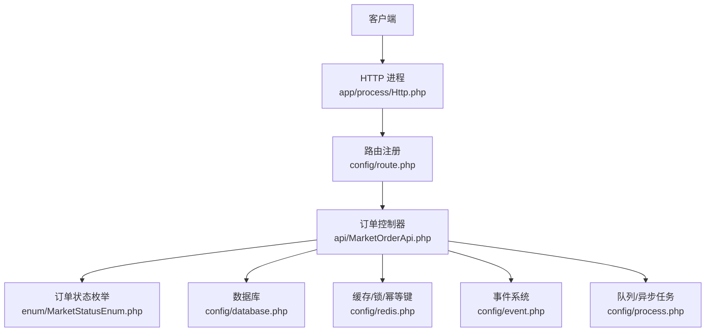
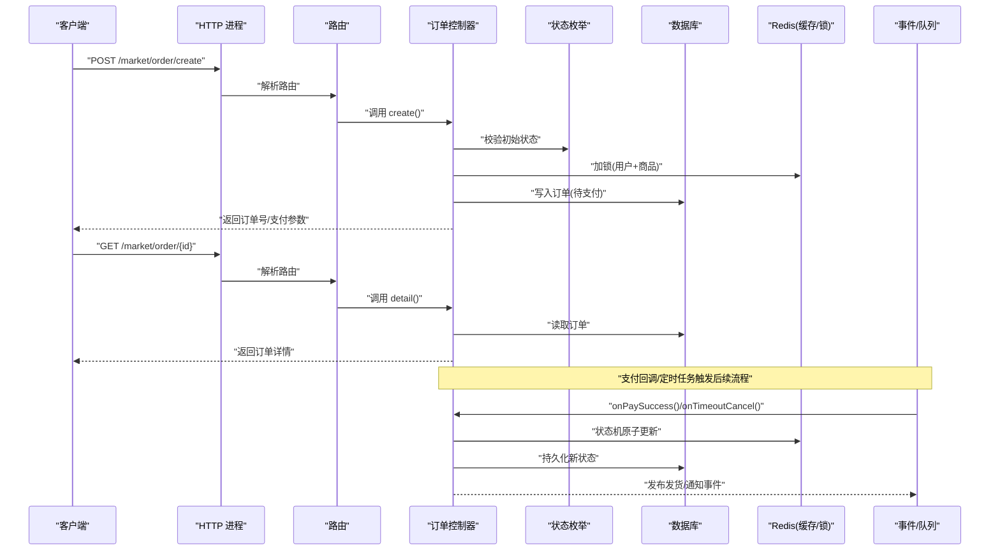
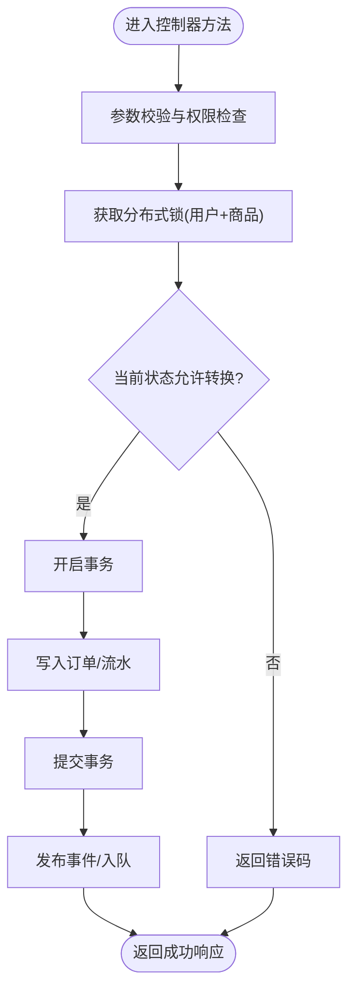
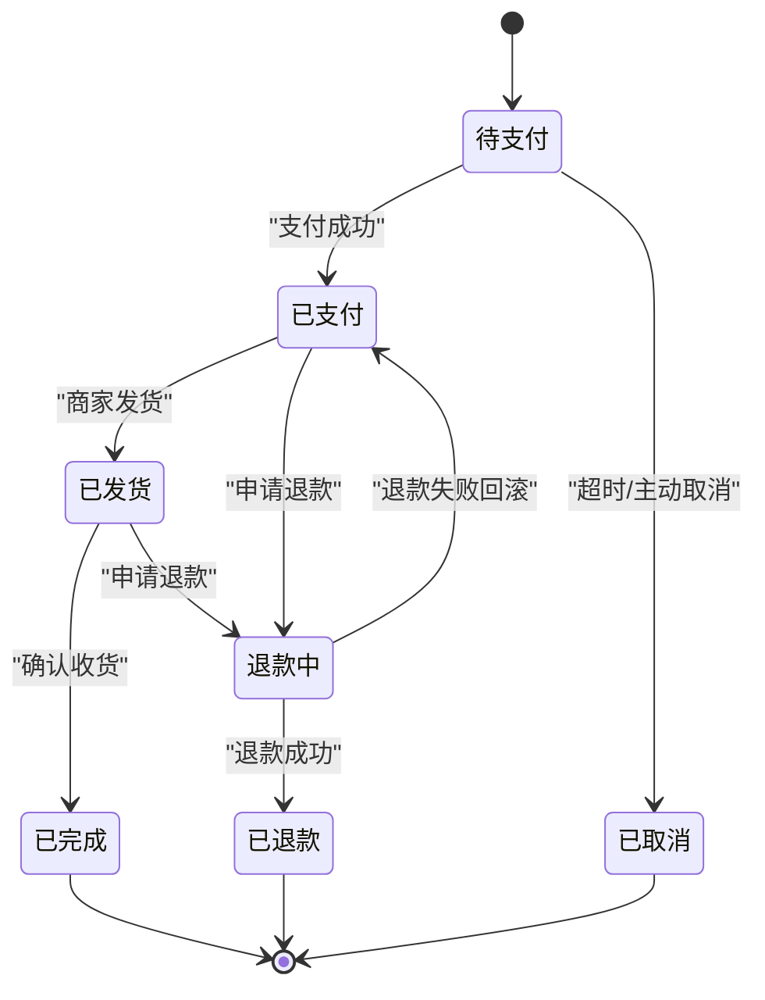
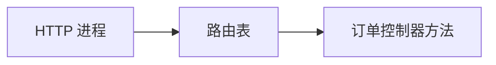
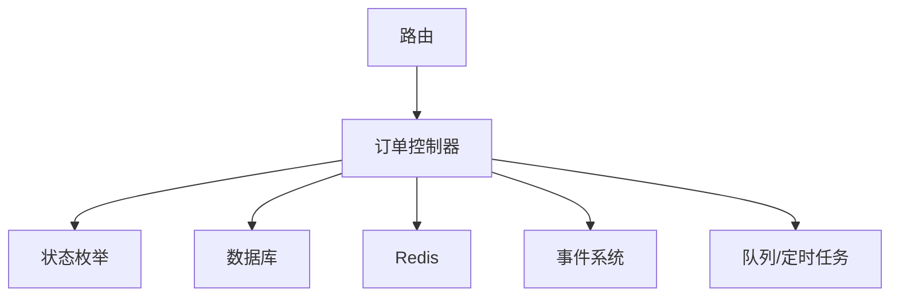

# 交易订单接口

<cite>
**本文引用的文件**   
- [MarketOrderApi.php](file://server/plugin/xbAiAsset/api/MarketOrderApi.php)
- [MarketStatusEnum.php](file://server/plugin/xbAiAsset/enum/MarketStatusEnum.php)
- [route.php](file://server/config/route.php)
- [database.php](file://server/config/database.php)
- [redis.php](file://server/config/redis.php)
- [event.php](file://server/config/event.php)
- [process.php](file://server/config/process.php)
- [Http.php](file://server/app/process/Http.php)
</cite>

## 目录
1. [简介](#简介)
2. [项目结构](#项目结构)
3. [核心组件](#核心组件)
4. [架构总览](#架构总览)
5. [详细组件分析](#详细组件分析)
6. [依赖分析](#依赖分析)
7. [性能考虑](#性能考虑)
8. [故障排查指南](#故障排查指南)
9. [结论](#结论)
10. [附录](#附录)

## 简介
本文件为资产市场交易订单系统的API接口文档，覆盖订单创建、支付处理、订单查询、退款处理等完整交易流程。文档同时说明订单状态流转、并发控制、事务处理与异常恢复机制，包含订单确认、发货处理、收货确认等业务环节，并提供支付回调处理、订单超时取消、重复支付防护等安全机制。最后给出订单数据模型与业务规则说明，帮助前后端开发者快速集成与排障。

## 项目结构
本项目采用插件化架构，订单相关能力位于 xbAiAsset 插件中，对外暴露的控制器 API 集中在 api 目录；路由在 server 层统一注册；数据库与缓存配置在 config 目录；HTTP 进程由 app/process 管理。

图表来源
- [Http.php](file://server/app/process/Http.php)
- [route.php](file://server/config/route.php)
- [MarketOrderApi.php](file://server/plugin/xbAiAsset/api/MarketOrderApi.php)
- [MarketStatusEnum.php](file://server/plugin/xbAiAsset/enum/MarketStatusEnum.php)
- [database.php](file://server/config/database.php)
- [redis.php](file://server/config/redis.php)
- [event.php](file://server/config/event.php)
- [process.php](file://server/config/process.php)

章节来源
- [Http.php](file://server/app/process/Http.php)
- [route.php](file://server/config/route.php)
- [MarketOrderApi.php](file://server/plugin/xbAiAsset/api/MarketOrderApi.php)
- [MarketStatusEnum.php](file://server/plugin/xbAiAsset/enum/MarketStatusEnum.php)
- [database.php](file://server/config/database.php)
- [redis.php](file://server/config/redis.php)
- [event.php](file://server/config/event.php)
- [process.php](file://server/config/process.php)

## 核心组件
- 订单控制器：提供订单创建、支付下单、支付回调、订单查询、退款申请、发货、收货确认等接口。
- 订单状态枚举：定义订单生命周期各状态及转换约束。
- 路由注册：将外部请求映射到控制器方法。
- 数据访问：通过 ORM 读写订单及相关表。
- 缓存与分布式锁：用于幂等、防重、库存扣减与状态机原子性。
- 事件与队列：用于异步通知、对账、发货、超时取消等。

章节来源
- [MarketOrderApi.php](file://server/plugin/xbAiAsset/api/MarketOrderApi.php)
- [MarketStatusEnum.php](file://server/plugin/xbAiAsset/enum/MarketStatusEnum.php)
- [route.php](file://server/config/route.php)
- [database.php](file://server/config/database.php)
- [redis.php](file://server/config/redis.php)
- [event.php](file://server/config/event.php)
- [process.php](file://server/config/process.php)

## 架构总览
下图展示从客户端发起订单到完成交付的全链路交互，包括同步与异步路径。

图表来源
- [route.php](file://server/config/route.php)
- [MarketOrderApi.php](file://server/plugin/xbAiAsset/api/MarketOrderApi.php)
- [MarketStatusEnum.php](file://server/plugin/xbAiAsset/enum/MarketStatusEnum.php)
- [database.php](file://server/config/database.php)
- [redis.php](file://server/config/redis.php)
- [event.php](file://server/config/event.php)
- [process.php](file://server/config/process.php)

## 详细组件分析

### 订单控制器（MarketOrderApi）
职责
- 接收并校验订单创建、支付、查询、退款、发货、收货等请求。
- 维护订单状态机，确保状态转换合法。
- 协调数据库、缓存、事件与队列，保证一致性与可恢复性。
- 实现幂等、防重、超时取消、重复支付防护等安全机制。

关键方法与流程
- 创建订单：生成唯一订单号，落库“待支付”，返回支付参数。
- 支付下单：根据支付方式生成支付单，记录支付流水。
- 支付回调：验签后更新订单状态，触发后续发货或通知。
- 订单查询：按ID或条件查询订单详情与明细。
- 退款处理：校验退款条件，提交退款申请，异步跟进结果。
- 发货处理：标记已发货，记录物流信息。
- 收货确认：买家确认收货，完成订单闭环。

并发与一致性
- 使用分布式锁保护“下单”和“状态变更”临界区。
- 使用幂等键（如 order_id + action）防止重复处理。
- 状态变更采用乐观锁或版本号字段，避免脏写。

事务与补偿
- 订单主表与支付流水在同一事务内写入。
- 回调失败进入重试队列，结合幂等键保证最终一致。
- 超时未支付订单由定时任务扫描并回滚库存。

图表来源
- [MarketOrderApi.php](file://server/plugin/xbAiAsset/api/MarketOrderApi.php)
- [MarketStatusEnum.php](file://server/plugin/xbAiAsset/enum/MarketStatusEnum.php)
- [database.php](file://server/config/database.php)
- [redis.php](file://server/config/redis.php)
- [event.php](file://server/config/event.php)
- [process.php](file://server/config/process.php)

章节来源
- [MarketOrderApi.php](file://server/plugin/xbAiAsset/api/MarketOrderApi.php)
- [MarketStatusEnum.php](file://server/plugin/xbAiAsset/enum/MarketStatusEnum.php)

### 订单状态机（MarketStatusEnum）
状态定义
- 待支付：订单创建成功，等待用户支付。
- 已支付：支付成功，准备发货。
- 已发货：商家已发货，等待收货。
- 已完成：买家确认收货或自动确认。
- 已取消：超时未支付或主动取消。
- 已退款：退款成功。
- 退款中：退款处理中。

状态转换约束
- 仅允许从“待支付”进入“已支付”或“已取消”。
- “已支付”可进入“已发货”或“退款中”。
- “已发货”可进入“已完成”或“退款中”。
- “退款中”可进入“已退款”或回退至原状态（视策略）。

图表来源
- [MarketStatusEnum.php](file://server/plugin/xbAiAsset/enum/MarketStatusEnum.php)

章节来源
- [MarketStatusEnum.php](file://server/plugin/xbAiAsset/enum/MarketStatusEnum.php)

### 路由与入口（route.php、Http.php）
- Http 进程负责监听端口、接收请求、分发到路由。
- route.php 集中声明 RESTful 路由，将 URL 映射到控制器方法。
- 建议遵循 REST 风格，统一前缀与版本控制。

图表来源
- [Http.php](file://server/app/process/Http.php)
- [route.php](file://server/config/route.php)
- [MarketOrderApi.php](file://server/plugin/xbAiAsset/api/MarketOrderApi.php)

章节来源
- [Http.php](file://server/app/process/Http.php)
- [route.php](file://server/config/route.php)

### 数据与配置（database.php、redis.php、event.php、process.php）
- database.php：连接池、读写分离、事务隔离级别等。
- redis.php：缓存、分布式锁、幂等键、限流与计数器。
- event.php：事件订阅与发布，解耦副作用逻辑。
- process.php：队列消费者、定时任务、后台作业。

章节来源
- [database.php](file://server/config/database.php)
- [redis.php](file://server/config/redis.php)
- [event.php](file://server/config/event.php)
- [process.php](file://server/config/process.php)

## 依赖分析
- 控制器依赖状态枚举进行合法性校验。
- 控制器通过 ORM 访问数据库，使用 Redis 做幂等与锁。
- 控制器通过事件系统与队列执行异步任务（发货、通知、对账）。
- 路由作为入口将外部请求绑定到控制器。

图表来源
- [MarketOrderApi.php](file://server/plugin/xbAiAsset/api/MarketOrderApi.php)
- [MarketStatusEnum.php](file://server/plugin/xbAiAsset/enum/MarketStatusEnum.php)
- [database.php](file://server/config/database.php)
- [redis.php](file://server/config/redis.php)
- [event.php](file://server/config/event.php)
- [process.php](file://server/config/process.php)
- [route.php](file://server/config/route.php)

章节来源
- [MarketOrderApi.php](file://server/plugin/xbAiAsset/api/MarketOrderApi.php)
- [MarketStatusEnum.php](file://server/plugin/xbAiAsset/enum/MarketStatusEnum.php)
- [database.php](file://server/config/database.php)
- [redis.php](file://server/config/redis.php)
- [event.php](file://server/config/event.php)
- [process.php](file://server/config/process.php)
- [route.php](file://server/config/route.php)

## 性能考虑
- 热点下单路径使用 Redis 预扣库存与分布式锁，降低数据库压力。
- 订单查询走读库或缓存镜像，减少主库负载。
- 支付回调与发货通知异步化，缩短同步响应时间。
- 批量操作与分页查询优化，避免大事务与大结果集。
- 合理设置索引与连接池大小，监控慢查询与锁等待。

[本节为通用指导，不直接分析具体文件]

## 故障排查指南
常见问题与定位要点
- 重复支付：检查幂等键是否命中，回调是否被多次处理。
- 状态不一致：核对分布式锁持有者与事务边界，查看状态机转换日志。
- 超时未取消：检查定时任务是否运行，队列消费是否正常。
- 回调失败重试：查看事件/队列重试次数与死信队列。
- 数据库锁冲突：关注长事务与热点行竞争，必要时拆分事务。

章节来源
- [MarketOrderApi.php](file://server/plugin/xbAiAsset/api/MarketOrderApi.php)
- [event.php](file://server/config/event.php)
- [process.php](file://server/config/process.php)

## 结论
本接口文档围绕订单全生命周期，明确了状态机、并发控制、事务与补偿、异步处理与安全机制的设计要点。通过控制器、枚举、路由、数据库、缓存、事件与队列的协同，实现了高可用、可扩展的交易订单系统。建议在生产环境完善监控告警与审计日志，持续优化性能与稳定性。

[本节为总结性内容，不直接分析具体文件]

## 附录

### 接口清单（示例）
- 创建订单：POST /market/order/create
- 支付下单：POST /market/order/pay
- 支付回调：POST /market/order/callback
- 订单查询：GET /market/order/{id}
- 退款申请：POST /market/order/refund
- 发货处理：POST /market/order/ship
- 收货确认：POST /market/order/confirm

章节来源
- [route.php](file://server/config/route.php)
- [MarketOrderApi.php](file://server/plugin/xbAiAsset/api/MarketOrderApi.php)

### 订单数据结构（字段建议）
- 订单主表：订单号、用户ID、商品ID、金额、币种、状态、支付渠道、支付流水号、创建时间、更新时间、备注。
- 订单明细：订单号、商品ID、数量、单价、小计。
- 支付流水：流水号、订单号、渠道、金额、状态、回调参数、时间戳。
- 物流信息：订单号、物流公司、运单号、发货时间、签收时间。

[本节为概念性说明，不直接分析具体文件]