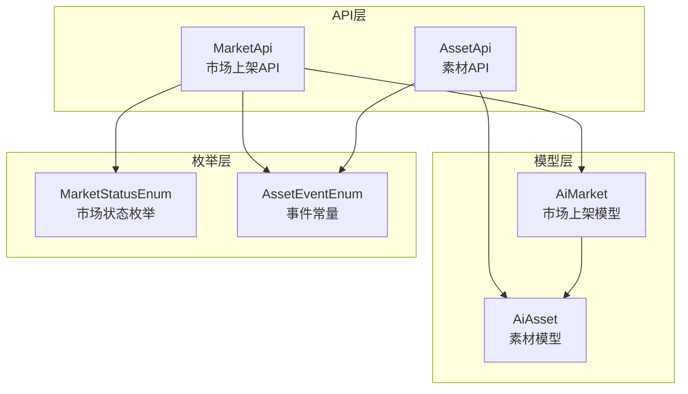
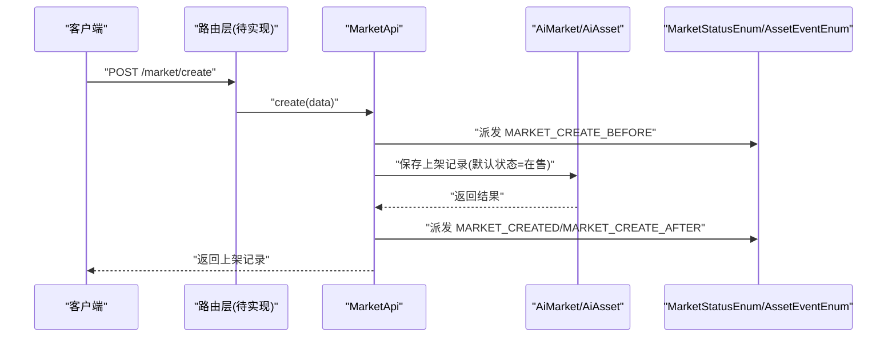
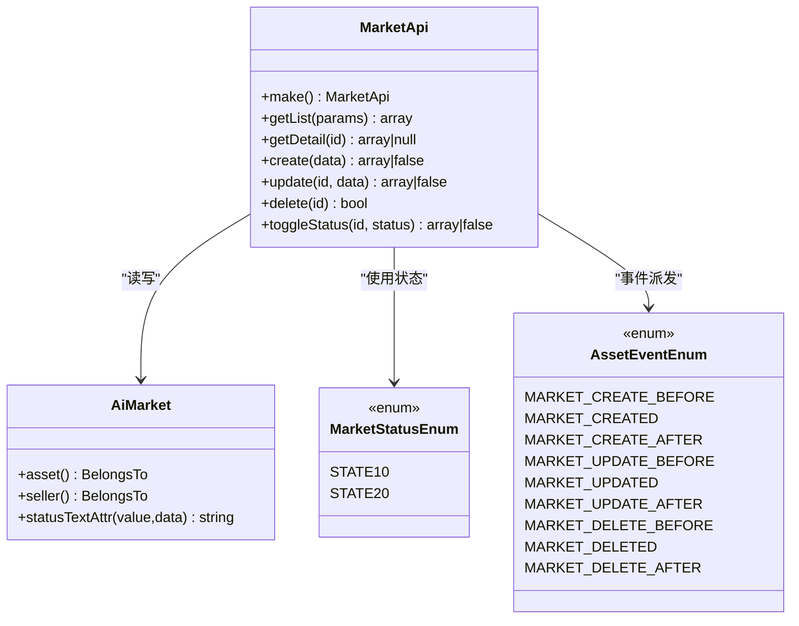
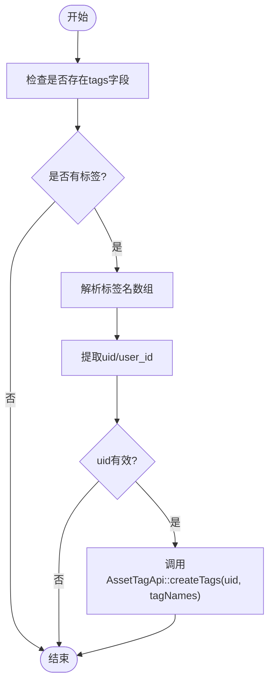
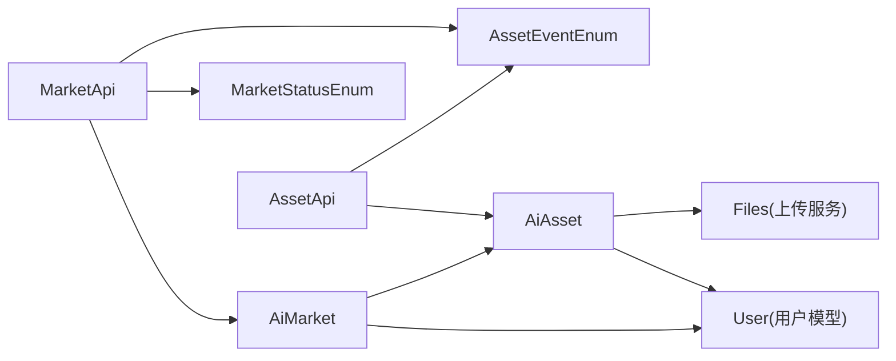
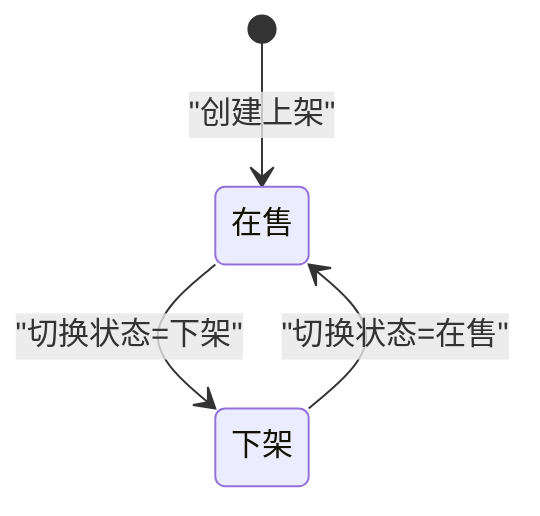

# 商品上架接口

<cite>
**本文引用的文件**
- [MarketApi.php](file://server/plugin/xbAiAsset/api/MarketApi.php)
- [AssetApi.php](file://server/plugin/xbAiAsset/api/AssetApi.php)
- [AiMarket.php](file://server/plugin/xbAiAsset/app/model/AiMarket.php)
- [AiAsset.php](file://server/plugin/xbAiAsset/app/model/AiAsset.php)
- [MarketStatusEnum.php](file://server/plugin/xbAiAsset/enum/MarketStatusEnum.php)
- [AssetEventEnum.php](file://server/plugin/xbAiAsset/enum/AssetEventEnum.php)
</cite>

## 目录
1. [简介](#简介)
2. [项目结构](#项目结构)
3. [核心组件](#核心组件)
4. [架构总览](#架构总览)
5. [详细组件分析](#详细组件分析)
6. [依赖关系分析](#依赖关系分析)
7. [性能考虑](#性能考虑)
8. [故障排查指南](#故障排查指南)
9. [结论](#结论)
10. [附录](#附录)

## 简介
本文件为资产市场中“商品上架”相关能力的API接口文档，覆盖商品的创建、查询、更新、删除、状态切换等核心操作，并说明上架流程中的参数校验、权限控制、数据校验与业务规则。同时提供分页列表、详情获取、批量操作建议、事件触发机制以及错误处理策略。

## 项目结构
围绕商品上架的核心代码位于插件 xbAiAsset 中：
- API层：MarketApi（市场上架）、AssetApi（素材）
- 模型层：AiMarket（市场上架记录）、AiAsset（素材）
- 枚举层：MarketStatusEnum（市场状态）、AssetEventEnum（事件常量）
- 路由配置：当前未定义具体路由映射，需结合框架路由注册方式完成

图表来源
- [MarketApi.php:1-191](file://server/plugin/xbAiAsset/api/MarketApi.php#L1-L191)
- [AssetApi.php:1-192](file://server/plugin/xbAiAsset/api/AssetApi.php#L1-L192)
- [AiMarket.php:1-51](file://server/plugin/xbAiAsset/app/model/AiMarket.php#L1-L51)
- [AiAsset.php:1-127](file://server/plugin/xbAiAsset/app/model/AiAsset.php#L1-L127)
- [MarketStatusEnum.php:1-33](file://server/plugin/xbAiAsset/enum/MarketStatusEnum.php#L1-L33)
- [AssetEventEnum.php:1-237](file://server/plugin/xbAiAsset/enum/AssetEventEnum.php#L1-L237)

章节来源
- [MarketApi.php:1-191](file://server/plugin/xbAiAsset/api/MarketApi.php#L1-L191)
- [AssetApi.php:1-192](file://server/plugin/xbAiAsset/api/AssetApi.php#L1-L192)
- [AiMarket.php:1-51](file://server/plugin/xbAiAsset/app/model/AiMarket.php#L1-L51)
- [AiAsset.php:1-127](file://server/plugin/xbAiAsset/app/model/AiAsset.php#L1-L127)
- [MarketStatusEnum.php:1-33](file://server/plugin/xbAiAsset/enum/MarketStatusEnum.php#L1-L33)
- [AssetEventEnum.php:1-237](file://server/plugin/xbAiAsset/enum/AssetEventEnum.php#L1-L237)

## 核心组件
- 市场上架API（MarketApi）
  - 提供市场上架的增删改查与状态切换能力，并在关键节点触发事件。
- 素材API（AssetApi）
  - 提供素材的增删改查能力，并在创建/更新时联动标签同步。
- 模型（AiMarket、AiAsset）
  - 定义关联关系与字段访问器，如状态文本、封面URL转换等。
- 枚举（MarketStatusEnum、AssetEventEnum）
  - 定义状态值与事件常量，统一业务语义。

章节来源
- [MarketApi.php:1-191](file://server/plugin/xbAiAsset/api/MarketApi.php#L1-L191)
- [AssetApi.php:1-192](file://server/plugin/xbAiAsset/api/AssetApi.php#L1-L192)
- [AiMarket.php:1-51](file://server/plugin/xbAiAsset/app/model/AiMarket.php#L1-L51)
- [AiAsset.php:1-127](file://server/plugin/xbAiAsset/app/model/AiAsset.php#L1-L127)
- [MarketStatusEnum.php:1-33](file://server/plugin/xbAiAsset/enum/MarketStatusEnum.php#L1-L33)
- [AssetEventEnum.php:1-237](file://server/plugin/xbAiAsset/enum/AssetEventEnum.php#L1-L237)

## 架构总览
商品上架的整体调用链包括：请求进入 -> 路由分发（待实现）-> 控制器/服务（MarketApi）-> 模型持久化（AiMarket/AiAsset）-> 事件发布（AssetEventEnum）。

图表来源
- [MarketApi.php:94-111](file://server/plugin/xbAiAsset/api/MarketApi.php#L94-L111)
- [MarketStatusEnum.php:21-31](file://server/plugin/xbAiAsset/enum/MarketStatusEnum.php#L21-L31)
- [AssetEventEnum.php:119-143](file://server/plugin/xbAiAsset/enum/AssetEventEnum.php#L119-L143)

## 详细组件分析

### 市场上架API（MarketApi）
- 功能概览
  - 获取上架列表：支持按状态、卖家、素材ID筛选，分页返回。
  - 获取上架详情：按ID获取，自动增加浏览次数。
  - 创建上架：设置初始状态为“在售”，在创建前后触发事件。
  - 更新上架：按ID更新，更新前后触发事件。
  - 删除上架：按ID删除，删除前后触发事件。
  - 切换状态：按ID切换上下架状态，更新前后触发事件。
- 关键行为
  - 默认状态：创建时设置为“在售”。
  - 事件驱动：所有CRUD均通过事件枚举进行前置/后置扩展点。
  - 计数统计：详情访问会自增浏览量。

图表来源
- [MarketApi.php:47-189](file://server/plugin/xbAiAsset/api/MarketApi.php#L47-L189)
- [AiMarket.php:20-50](file://server/plugin/xbAiAsset/app/model/AiMarket.php#L20-L50)
- [MarketStatusEnum.php:19-32](file://server/plugin/xbAiAsset/enum/MarketStatusEnum.php#L19-L32)
- [AssetEventEnum.php:119-203](file://server/plugin/xbAiAsset/enum/AssetEventEnum.php#L119-L203)

章节来源
- [MarketApi.php:47-189](file://server/plugin/xbAiAsset/api/MarketApi.php#L47-L189)
- [AiMarket.php:20-50](file://server/plugin/xbAiAsset/app/model/AiMarket.php#L20-L50)
- [MarketStatusEnum.php:19-32](file://server/plugin/xbAiAsset/enum/MarketStatusEnum.php#L19-L32)
- [AssetEventEnum.php:119-203](file://server/plugin/xbAiAsset/enum/AssetEventEnum.php#L119-L203)

#### 接口清单与示例
以下为面向外部调用的接口规范（基于现有API方法抽象）：

- 创建上架
  - 方法：POST
  - 路径：/api/market/create
  - 请求体字段
    - asset_id: 整数，必填，关联素材ID
    - seller_id: 整数，必填，卖家用户ID
    - price: 浮点数，可选，价格
    - 其他字段：根据AiMarket模型允许写入的字段
  - 响应体
    - 成功：返回上架记录对象（包含id、asset_id、seller_id、status、listed_at等）
    - 失败：返回false或错误信息
  - 事件
    - 前置：MARKET_CREATE_BEFORE
    - 成功后：MARKET_CREATED、MARKET_CREATE_AFTER

- 获取上架列表
  - 方法：GET
  - 路径：/api/market/list
  - 查询参数
    - status: 字符串，可选，状态过滤
    - seller_id: 整数，可选，卖家过滤
    - asset_id: 整数，可选，素材过滤
    - page: 整数，可选，页码
    - limit: 整数，可选，每页条数
  - 响应体
    - 分页对象（含数据列表与分页元信息）

- 获取上架详情
  - 方法：GET
  - 路径：/api/market/detail/{id}
  - 路径参数
    - id: 整数，必填
  - 响应体
    - 上架记录对象（包含关联的asset、seller信息）
  - 副作用
    - 自动增加view_count

- 更新上架信息
  - 方法：PUT
  - 路径：/api/market/update/{id}
  - 路径参数
    - id: 整数，必填
  - 请求体字段
    - 可更新字段集合（如price、status等）
  - 响应体
    - 更新后的上架记录对象
  - 事件
    - 前置：MARKET_UPDATE_BEFORE
    - 成功后：MARKET_UPDATED、MARKET_UPDATE_AFTER

- 删除上架记录
  - 方法：DELETE
  - 路径：/api/market/delete/{id}
  - 路径参数
    - id: 整数，必填
  - 响应体
    - true/false
  - 事件
    - 前置：MARKET_DELETE_BEFORE
    - 成功后：MARKET_DELETED、MARKET_DELETE_AFTER

- 切换上下架状态
  - 方法：PATCH
  - 路径：/api/market/toggle-status/{id}
  - 路径参数
    - id: 整数，必填
  - 请求体字段
    - status: 字符串，必填，目标状态（例如“10”下架、“20”在售）
  - 响应体
    - 更新后的上架记录对象
  - 事件
    - 前置：MARKET_UPDATE_BEFORE
    - 成功后：MARKET_UPDATED、MARKET_UPDATE_AFTER

- 批量操作建议
  - 批量创建：循环调用创建接口，或在服务端新增批量创建方法（参考现有create模式扩展）。
  - 批量更新：新增批量更新接口，内部遍历执行update逻辑并聚合结果。
  - 批量删除：新增批量删除接口，内部遍历执行delete逻辑并聚合结果。
  - 注意：批量操作应保证事务性与幂等性，避免部分成功导致的数据不一致。

章节来源
- [MarketApi.php:47-189](file://server/plugin/xbAiAsset/api/MarketApi.php#L47-L189)

### 素材API（AssetApi）
- 功能概览
  - 获取素材列表：支持类型、来源、名称模糊搜索、用户ID筛选，分页返回。
  - 获取素材详情：按ID获取，包含关联的市场上架信息。
  - 创建素材：创建后触发事件，并同步标签至用户标签库和热门标签库。
  - 更新素材：更新后触发事件，并同步标签。
  - 删除素材：软删除，删除前后触发事件。
- 关键行为
  - 标签同步：当存在tags字段时，解析逗号分隔的标签名，逐个创建到用户标签库与热门标签库。

图表来源
- [AssetApi.php:171-190](file://server/plugin/xbAiAsset/api/AssetApi.php#L171-L190)

章节来源
- [AssetApi.php:46-163](file://server/plugin/xbAiAsset/api/AssetApi.php#L46-L163)
- [AssetApi.php:171-190](file://server/plugin/xbAiAsset/api/AssetApi.php#L171-L190)

### 模型与枚举
- AiMarket
  - 关联素材与卖家用户；提供状态文本获取器，便于展示。
- AiAsset
  - 软删除时间字段；关联用户与市场上架；提供类型/来源文本获取器；封面与媒体URL自动转换。
- MarketStatusEnum
  - 定义“下架”与“在售”两种状态值及展示样式。
- AssetEventEnum
  - 统一定义素材与市场相关的事件常量，用于前后置钩子扩展。

章节来源
- [AiMarket.php:20-50](file://server/plugin/xbAiAsset/app/model/AiMarket.php#L20-L50)
- [AiAsset.php:22-127](file://server/plugin/xbAiAsset/app/model/AiAsset.php#L22-L127)
- [MarketStatusEnum.php:19-32](file://server/plugin/xbAiAsset/enum/MarketStatusEnum.php#L19-L32)
- [AssetEventEnum.php:19-237](file://server/plugin/xbAiAsset/enum/AssetEventEnum.php#L19-L237)

## 依赖关系分析
- 耦合与内聚
  - MarketApi对AiMarket强依赖，对MarketStatusEnum与AssetEventEnum弱依赖（仅读取常量）。
  - AssetApi对AiAsset强依赖，对AssetEventEnum弱依赖，并通过AssetTagApi间接依赖标签服务。
- 外部依赖
  - 上传服务Files：用于封面与媒体URL的路径/地址转换。
  - 用户模型User：通过关联获取卖家与作者信息。
- 潜在循环依赖
  - AiMarket与AiAsset互为关联（HasOne/BelongsTo），但属于双向引用，不构成循环导入。

图表来源
- [MarketApi.php:1-191](file://server/plugin/xbAiAsset/api/MarketApi.php#L1-L191)
- [AssetApi.php:1-192](file://server/plugin/xbAiAsset/api/AssetApi.php#L1-L192)
- [AiMarket.php:1-51](file://server/plugin/xbAiAsset/app/model/AiMarket.php#L1-L51)
- [AiAsset.php:1-127](file://server/plugin/xbAiAsset/app/model/AiAsset.php#L1-L127)

章节来源
- [MarketApi.php:1-191](file://server/plugin/xbAiAsset/api/MarketApi.php#L1-L191)
- [AssetApi.php:1-192](file://server/plugin/xbAiAsset/api/AssetApi.php#L1-L192)
- [AiMarket.php:1-51](file://server/plugin/xbAiAsset/app/model/AiMarket.php#L1-L51)
- [AiAsset.php:1-127](file://server/plugin/xbAiAsset/app/model/AiAsset.php#L1-L127)

## 性能考虑
- 列表查询
  - 使用分页查询，避免一次性加载大量数据。
  - 条件筛选尽量命中索引字段（如status、seller_id、asset_id）。
- 详情访问
  - 详情接口会增加浏览量，建议在高频场景下采用异步计数或缓存聚合。
- 标签同步
  - 标签创建可能涉及多次写操作，建议在高并发场景下引入队列异步处理。
- 资源URL转换
  - 封面与媒体URL转换通过Files服务，注意远程存储延迟，必要时启用本地缓存。

[本节为通用性能建议，不直接分析具体文件]

## 故障排查指南
- 常见问题
  - 上架创建失败：检查必填字段是否完整、状态值是否合法、数据库写入是否成功。
  - 详情为空：确认ID是否存在，关注软删除标记与关联加载。
  - 状态切换无效：确认传入的状态值是否在枚举范围内。
  - 标签不同步：检查tags格式是否为逗号分隔字符串，uid/user_id是否有效。
- 日志与事件
  - 利用事件常量定位问题阶段（前置/成功/后置），配合系统日志追踪。
- 错误处理
  - 接口返回false或null时应向上层抛出结构化错误，包含错误码与消息。
  - 建议在路由层或中间件统一捕获异常并转换为标准响应格式。

章节来源
- [MarketApi.php:94-189](file://server/plugin/xbAiAsset/api/MarketApi.php#L94-L189)
- [AssetApi.php:91-163](file://server/plugin/xbAiAsset/api/AssetApi.php#L91-L163)
- [AssetEventEnum.php:19-237](file://server/plugin/xbAiAsset/enum/AssetEventEnum.php#L19-L237)

## 结论
本接口文档基于现有代码抽象出商品上架的API规范，明确了各接口的职责、参数、响应与事件机制。通过事件驱动与枚举约束，系统具备良好的扩展性与一致性。后续可在路由层完善接口映射，并补充统一的鉴权与校验中间件，以提升安全性与健壮性。

[本节为总结性内容，不直接分析具体文件]

## 附录

### 商品状态机与事件触发机制
- 状态定义
  - 下架：值为“10”
  - 在售：值为“20”
- 状态转换规则
  - 创建上架：默认状态为“在售”
  - 切换状态：由调用方指定目标状态，服务端保存并触发更新事件
- 事件触发时机
  - 创建：MARKET_CREATE_BEFORE -> 保存 -> MARKET_CREATED -> MARKET_CREATE_AFTER
  - 更新：MARKET_UPDATE_BEFORE -> 保存 -> MARKET_UPDATED -> MARKET_UPDATE_AFTER
  - 删除：MARKET_DELETE_BEFORE -> 删除 -> MARKET_DELETED -> MARKET_DELETE_AFTER

图表来源
- [MarketStatusEnum.php:21-31](file://server/plugin/xbAiAsset/enum/MarketStatusEnum.php#L21-L31)
- [MarketApi.php:94-189](file://server/plugin/xbAiAsset/api/MarketApi.php#L94-L189)
- [AssetEventEnum.php:119-203](file://server/plugin/xbAiAsset/enum/AssetEventEnum.php#L119-L203)

章节来源
- [MarketStatusEnum.php:19-32](file://server/plugin/xbAiAsset/enum/MarketStatusEnum.php#L19-L32)
- [MarketApi.php:94-189](file://server/plugin/xbAiAsset/api/MarketApi.php#L94-L189)
- [AssetEventEnum.php:119-203](file://server/plugin/xbAiAsset/enum/AssetEventEnum.php#L119-L203)