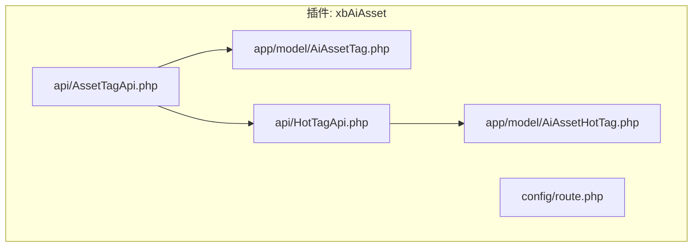
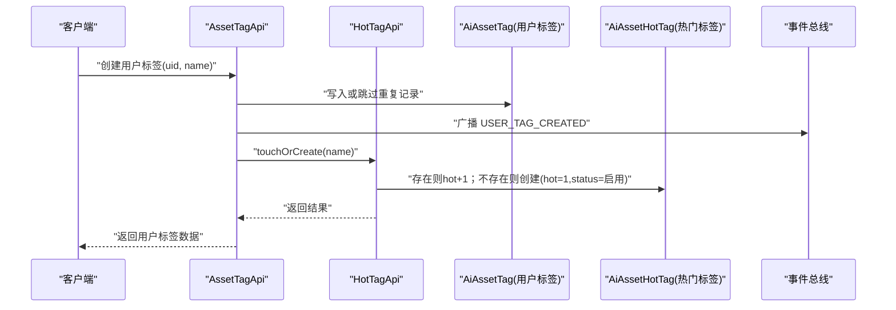
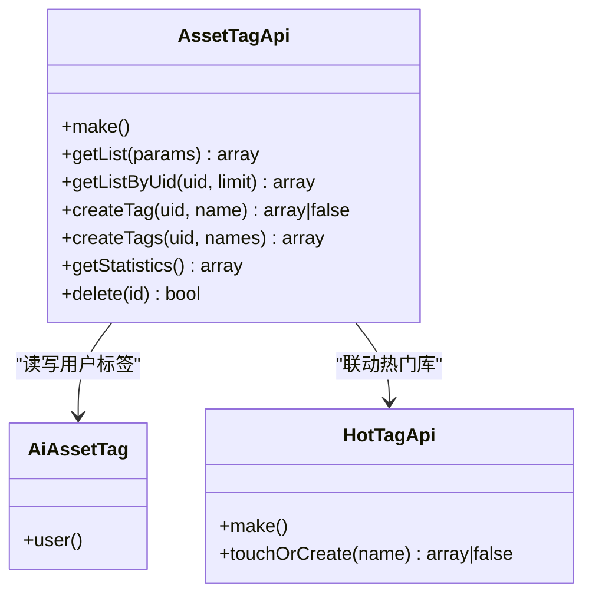
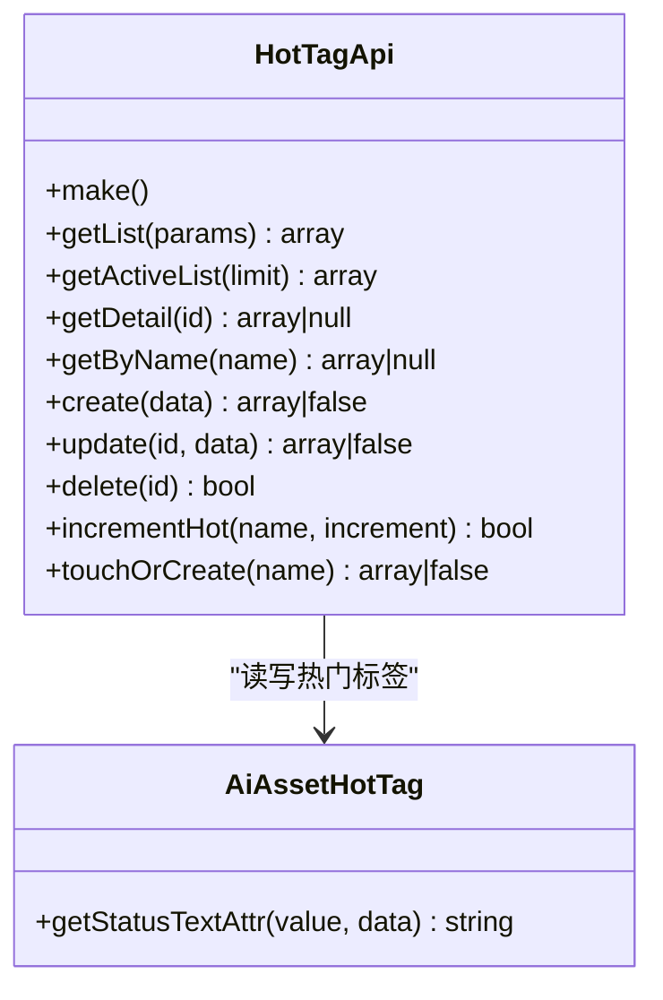
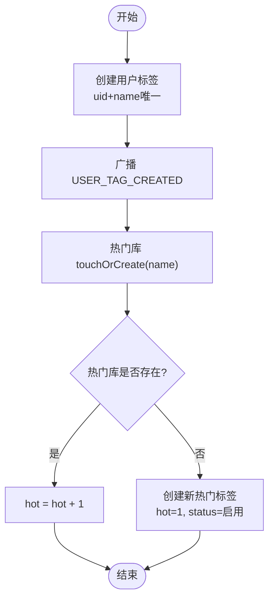
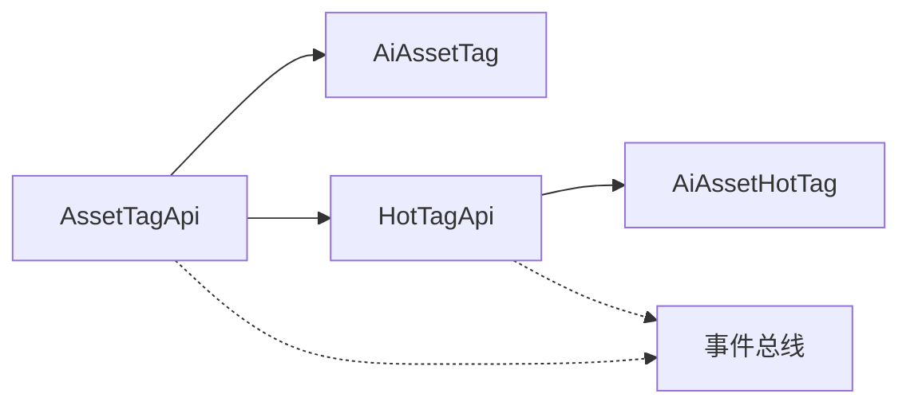

# 标签分类接口

<cite>
**本文引用的文件**
- [AssetTagApi.php](file://server/plugin/xbAiAsset/api/AssetTagApi.php)
- [HotTagApi.php](file://server/plugin/xbAiAsset/api/HotTagApi.php)
- [AiAssetTag.php](file://server/plugin/xbAiAsset/app/model/AiAssetTag.php)
- [AiAssetHotTag.php](file://server/plugin/xbAiAsset/app/model/AiAssetHotTag.php)
- [route.php](file://server/plugin/xbAiAsset/config/route.php)
</cite>

## 目录
1. [简介](#简介)
2. [项目结构](#项目结构)
3. [核心组件](#核心组件)
4. [架构总览](#架构总览)
5. [详细组件分析](#详细组件分析)
6. [依赖分析](#依赖分析)
7. [性能考虑](#性能考虑)
8. [故障排查指南](#故障排查指南)
9. [结论](#结论)
10. [附录](#附录)

## 简介
本文件为资产市场的“标签分类系统”API接口文档，覆盖以下能力：
- 标签的创建、管理（列表、详情、更新、删除）
- 标签与商品（资产）的关联（通过用户标签与热门标签联动）
- 热门标签、自动标签生成、标签搜索推荐等智能特性
- 标签权重算法、热度计算、标签云展示
- 数据同步、缓存策略与性能优化方案
- 扩展性与自定义能力说明

说明：
- 当前仓库中已实现“用户标签”和“热门标签”两套核心能力，并通过事件机制进行解耦。
- 路由注册文件存在但为空，实际路由需在平台路由配置中补充。

## 项目结构
围绕标签能力的后端代码位于插件 xbAiAsset 下，关键文件如下：
- API 层：AssetTagApi、HotTagApi
- 模型层：AiAssetTag、AiAssetHotTag
- 路由配置：config/route.php（待完善）

图示来源
- [AssetTagApi.php](file://server/plugin/xbAiAsset/api/AssetTagApi.php)
- [HotTagApi.php](file://server/plugin/xbAiAsset/api/HotTagApi.php)
- [AiAssetTag.php](file://server/plugin/xbAiAsset/app/model/AiAssetTag.php)
- [AiAssetHotTag.php](file://server/plugin/xbAiAsset/app/model/AiAssetHotTag.php)
- [route.php](file://server/plugin/xbAiAsset/config/route.php)

章节来源
- [AssetTagApi.php](file://server/plugin/xbAiAsset/api/AssetTagApi.php)
- [HotTagApi.php](file://server/plugin/xbAiAsset/api/HotTagApi.php)
- [AiAssetTag.php](file://server/plugin/xbAiAsset/app/model/AiAssetTag.php)
- [AiAssetHotTag.php](file://server/plugin/xbAiAsset/app/model/AiAssetHotTag.php)
- [route.php](file://server/plugin/xbAiAsset/config/route.php)

## 核心组件
- 用户标签 API（AssetTagApi）
  - 提供用户维度的标签查询、批量创建、统计信息、删除等能力
  - 在创建用户标签时，触发事件并联动“热门标签库”进行创建或热度+1
- 热门标签 API（HotTagApi）
  - 提供热门标签的增删改查、按名称查找、启用列表、热度累加、创建或增加热度等能力
  - 在创建、更新、删除前后均发布事件，便于外部监听与扩展

章节来源
- [AssetTagApi.php](file://server/plugin/xbAiAsset/api/AssetTagApi.php)
- [HotTagApi.php](file://server/plugin/xbAiAsset/api/HotTagApi.php)

## 架构总览
标签系统采用“用户标签 + 热门标签”的双表设计，通过事件驱动将两者解耦，形成“写路径短、读路径快”的架构。

图示来源
- [AssetTagApi.php](file://server/plugin/xbAiAsset/api/AssetTagApi.php)
- [HotTagApi.php](file://server/plugin/xbAiAsset/api/HotTagApi.php)
- [AiAssetTag.php](file://server/plugin/xbAiAsset/app/model/AiAssetTag.php)
- [AiAssetHotTag.php](file://server/plugin/xbAiAsset/app/model/AiAssetHotTag.php)

## 详细组件分析

### 用户标签 API（AssetTagApi）
- 主要方法
  - getList(params): 后台分页查询用户标签，支持按 uid、name 筛选
  - getListByUid(uid, limit): 按用户ID获取最近标签
  - createTag(uid, name): 创建用户标签（uid+name唯一），并发出事件，联动热门库 touchOrCreate
  - createTags(uid, names): 批量创建用户标签
  - getStatistics(): 统计用户数、标签总数、Top 标签
  - delete(id): 删除指定用户标签记录
- 业务要点
  - 去重策略：同一用户同名的标签只保留一条
  - 联动策略：每次创建用户标签都会确保热门库中存在该标签，且 hot 至少为 1
  - 事件：USER_TAG_CREATED 用于后续扩展（如异步刷新缓存、统计等）

章节来源
- [AssetTagApi.php](file://server/plugin/xbAiAsset/api/AssetTagApi.php)

#### 类关系图（用户标签）

图示来源
- [AssetTagApi.php](file://server/plugin/xbAiAsset/api/AssetTagApi.php)
- [AiAssetTag.php](file://server/plugin/xbAiAsset/app/model/AiAssetTag.php)
- [HotTagApi.php](file://server/plugin/xbAiAsset/api/HotTagApi.php)

### 热门标签 API（HotTagApi）
- 主要方法
  - getList(params): 分页查询，支持 name、status 筛选
  - getActiveList(limit): 获取启用的热门标签（前端展示用）
  - getDetail(id): 根据 ID 获取详情
  - getByName(name): 根据名称查找
  - create(data): 创建热门标签（含创建前/后事件）
  - update(id, data): 更新热门标签（含更新前/后事件）
  - delete(id): 删除热门标签（含删除前/后事件）
  - incrementHot(name, increment): 命中热门标签时增加热度
  - touchOrCreate(name): 存在则 hot+1，不存在则创建（hot=1, status=启用）
- 业务要点
  - 状态枚举：使用 HotTagStatusEnum 提供状态文本
  - 排序规则：默认按 hot 降序、sort 降序、id 降序
  - 事件：创建/更新/删除前后均有事件，便于缓存失效、统计、审计等

章节来源
- [HotTagApi.php](file://server/plugin/xbAiAsset/api/HotTagApi.php)
- [AiAssetHotTag.php](file://server/plugin/xbAiAsset/app/model/AiAssetHotTag.php)

#### 类关系图（热门标签）

图示来源
- [HotTagApi.php](file://server/plugin/xbAiAsset/api/HotTagApi.php)
- [AiAssetHotTag.php](file://server/plugin/xbAiAsset/app/model/AiAssetHotTag.php)

### 标签与商品（资产）关联流程
- 当资产被标记时，调用用户标签创建接口，内部会联动热门库，从而保证“热门库”与“用户标签”的一致性
- 若需要直接提升某标签的热度（例如点击、收藏、购买等行为），可调用热门库的 incrementHot

图示来源
- [AssetTagApi.php](file://server/plugin/xbAiAsset/api/AssetTagApi.php)
- [HotTagApi.php](file://server/plugin/xbAiAsset/api/HotTagApi.php)

### 标签层级结构与自动标签生成
- 层级结构
  - 当前模型未包含 parent_id 字段，不支持多级树形结构
  - 如需层级，可在模型层扩展 parent_id 并在 API 层提供树构建逻辑
- 自动标签生成
  - 可通过监听 USER_TAG_CREATED 事件，结合内容解析或 AI 服务自动生成候选标签，再经人工审核入库
  - 也可在热门库创建/更新事件中触发异步任务，维护“推荐标签池”

[本节为概念性说明，不直接分析具体文件]

### 标签搜索与推荐
- 搜索
  - 用户标签：支持按 uid、name 模糊匹配
  - 热门标签：支持按 name、status 筛选
- 推荐
  - 基于热门库的 hot 排序，结合 sort 与 id 作为次级排序
  - 可扩展：在事件监听器中维护 Redis 集合或倒排索引，加速推荐

章节来源
- [AssetTagApi.php](file://server/plugin/xbAiAsset/api/AssetTagApi.php)
- [HotTagApi.php](file://server/plugin/xbAiAsset/api/HotTagApi.php)

### 标签权重算法与热度计算
- 热度计算
  - 基础热度：每次用户标签创建或命中热门库时 hot+1
  - 可拓展：引入时间衰减、行为加权（点击、收藏、购买）、去重因子等
- 权重算法建议
  - 综合得分 = α·log(hot+1) + β·recent_count + γ·quality_score
  - 定期离线任务计算质量分（如转化率、复购率）并回写

[本节为通用算法建议，不直接分析具体文件]

### 标签云展示
- 数据来源：优先从热门库 getActiveList 获取
- 展示策略：按 hot 分桶映射字号，限制最大数量，避免渲染压力

[本节为通用展示建议，不直接分析具体文件]

## 依赖分析
- 模块内依赖
  - AssetTagApi 依赖 AiAssetTag 模型与 HotTagApi
  - HotTagApi 依赖 AiAssetHotTag 模型
- 事件依赖
  - 使用事件总线进行解耦，便于扩展（缓存失效、统计、审计、消息推送等）
- 路由依赖
  - 当前 route.php 为空，需由上层路由注册到 HTTP 控制器或直接暴露 API

图示来源
- [AssetTagApi.php](file://server/plugin/xbAiAsset/api/AssetTagApi.php)
- [HotTagApi.php](file://server/plugin/xbAiAsset/api/HotTagApi.php)
- [AiAssetTag.php](file://server/plugin/xbAiAsset/app/model/AiAssetTag.php)
- [AiAssetHotTag.php](file://server/plugin/xbAiAsset/app/model/AiAssetHotTag.php)

章节来源
- [AssetTagApi.php](file://server/plugin/xbAiAsset/api/AssetTagApi.php)
- [HotTagApi.php](file://server/plugin/xbAiAsset/api/HotTagApi.php)
- [AiAssetTag.php](file://server/plugin/xbAiAsset/app/model/AiAssetTag.php)
- [AiAssetHotTag.php](file://server/plugin/xbAiAsset/app/model/AiAssetHotTag.php)
- [route.php](file://server/plugin/xbAiAsset/config/route.php)

## 性能考虑
- 数据库层面
  - 对 uid+name 建立唯一索引，避免重复插入与全表扫描
  - 对热门库 name、status 建立索引，提升查询与增量更新效率
  - 分页查询使用 order('hot desc, sort desc, id desc')，注意大表排序成本
- 缓存策略
  - 热门列表：Redis 缓存 key="hot_tags:active:{limit}"，设置合理过期时间
  - 标签详情：key="hot_tag:detail:{id}"，短 TTL 配合事件失效
  - 统计信息：定时任务聚合，避免实时聚合造成抖动
- 事件与异步
  - 将非关键路径（如统计、日志、第三方同步）放入队列，降低主链路延迟
- 限流与幂等
  - 对创建接口做用户维度限流与幂等键（uid+name），防止刷量

[本节为通用性能建议，不直接分析具体文件]

## 故障排查指南
- 常见问题
  - 重复标签：检查是否命中 uid+name 唯一约束；确认 createTag 的去重逻辑
  - 热门库不同步：确认 USER_TAG_CREATED 事件是否被消费；检查 touchOrCreate 分支
  - 状态异常：确认 HotTagStatusEnum 值与业务状态一致
- 定位手段
  - 查看事件监听器日志，确认事件是否发出与处理成功
  - 核对数据库索引与慢查询日志
  - 校验缓存 key 与过期策略

章节来源
- [AssetTagApi.php](file://server/plugin/xbAiAsset/api/AssetTagApi.php)
- [HotTagApi.php](file://server/plugin/xbAiAsset/api/HotTagApi.php)

## 结论
- 当前实现以“用户标签 + 热门标签”双表为核心，通过事件驱动完成联动，具备较好的扩展性
- 建议在现有基础上补充：
  - 路由注册与统一响应格式
  - 索引与缓存策略落地
  - 标签层级与自动生成的扩展点
  - 更丰富的权重与推荐算法

[本节为总结性内容，不直接分析具体文件]

## 附录

### API 参考（基于现有实现）
- 用户标签
  - 列表（后台）：GET /api/tag/list?uid=&name=&page=&limit=
  - 按用户获取：GET /api/tag/by_uid?uid=&limit=
  - 创建：POST /api/tag/create {uid, name}
  - 批量创建：POST /api/tags/create {uid, names[]}
  - 统计：GET /api/tag/statistics
  - 删除：DELETE /api/tag/delete?id=
- 热门标签
  - 列表：GET /api/hot-tag/list?name=&status=&page=&limit=
  - 启用列表：GET /api/hot-tag/active?limit=
  - 详情：GET /api/hot-tag/detail?id=
  - 按名查找：GET /api/hot-tag/by_name?name=
  - 创建：POST /api/hot-tag/create {name, hot?, status?, sort?}
  - 更新：PUT /api/hot-tag/update {id, ...fields}
  - 删除：DELETE /api/hot-tag/delete?id=
  - 增加热度：POST /api/hot-tag/increment_hot {name, increment?}
  - 创建或增加热度：POST /api/hot-tag/touch_or_create {name}

说明：
- 上述路径为示例，需在路由配置中注册对应控制器或 API 入口
- 请求参数与返回结构以各 API 方法为准

章节来源
- [AssetTagApi.php](file://server/plugin/xbAiAsset/api/AssetTagApi.php)
- [HotTagApi.php](file://server/plugin/xbAiAsset/api/HotTagApi.php)
- [route.php](file://server/plugin/xbAiAsset/config/route.php)