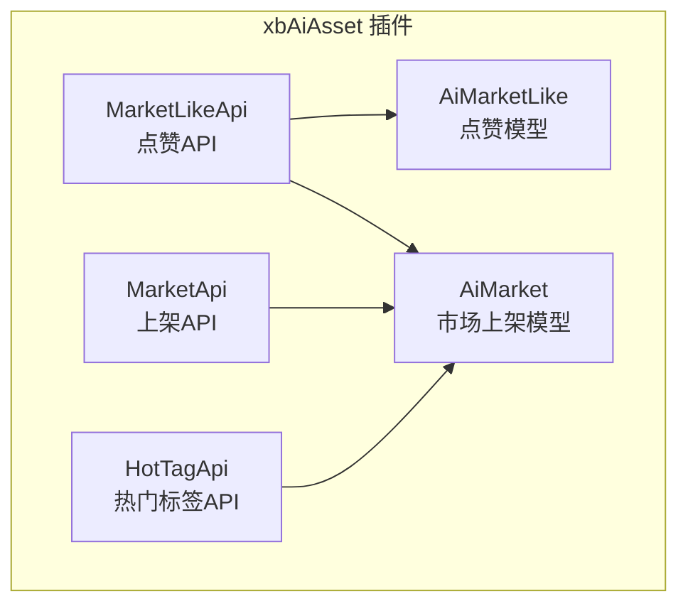
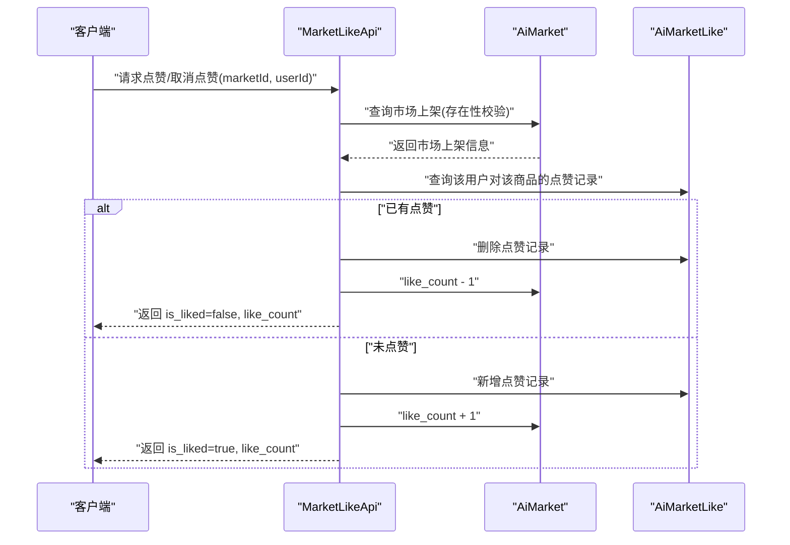
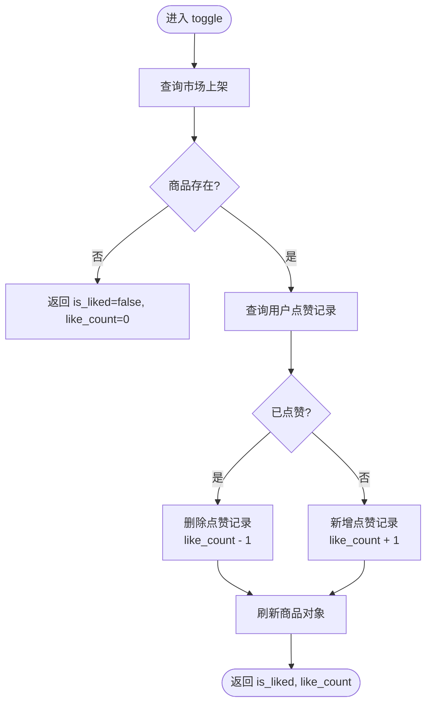
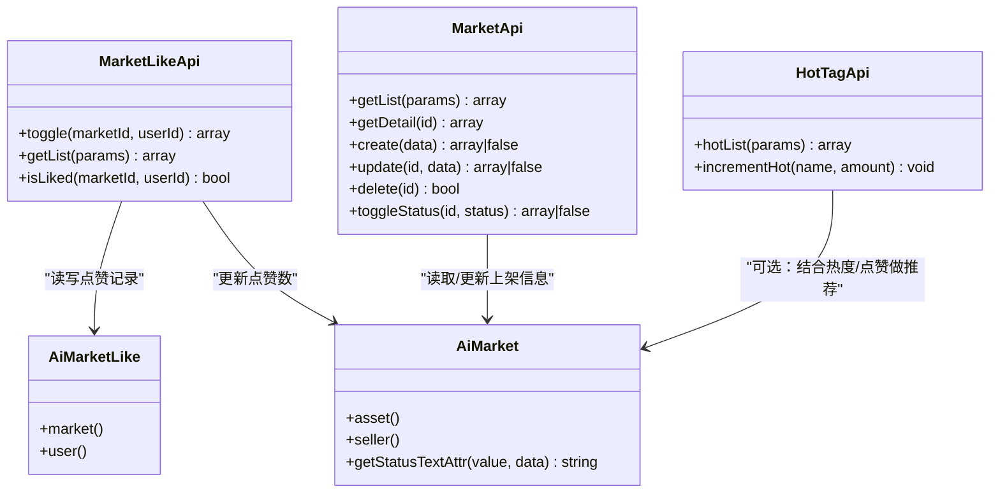

# 点赞收藏接口

<cite>
**本文引用的文件**   
- [MarketLikeApi.php](file://server/plugin\xbAiAsset\api\MarketLikeApi.php)
- [AiMarketLike.php](file://server/plugin\xbAiAsset\app\model\AiMarketLike.php)
- [AiMarket.php](file://server/plugin\xbAiAsset\app\model\AiMarket.php)
- [MarketApi.php](file://server/plugin\xbAiAsset\api\MarketApi.php)
- [HotTagApi.php](file://server/plugin\xbAiAsset\api\HotTagApi.php)
</cite>

## 目录
1. [简介](#简介)
2. [项目结构](#项目结构)
3. [核心组件](#核心组件)
4. [架构总览](#架构总览)
5. [详细组件分析](#详细组件分析)
6. [依赖关系分析](#依赖关系分析)
7. [性能与一致性](#性能与一致性)
8. [故障排查指南](#故障排查指南)
9. [结论](#结论)
10. [附录：API 定义](#附录api-定义)

## 简介
本文件面向资产市场的“点赞/收藏”能力，提供后端 API 文档与实现要点说明。当前仓库已实现“商品点赞”的切换、查询与状态判断；“收藏”功能在现有代码中未直接暴露对应 API，本文给出基于现有模型的扩展建议与接口规范。文档同时覆盖并发控制、数据一致性、缓存与统计（如热门商品）等工程化方案。

## 项目结构
与点赞收藏相关的核心代码位于 xbAiAsset 插件下：
- API 层：MarketLikeApi（点赞）、MarketApi（上架列表/详情，含浏览计数）
- 模型层：AiMarketLike（点赞记录）、AiMarket（市场上架，含点赞数字段）
- 统计相关：HotTagApi（热门标签，可作为热门商品推荐的参考）

图表来源
- [MarketLikeApi.php:1-118](file://server/plugin\xbAiAsset\api\MarketLikeApi.php#L1-L118)
- [AiMarketLike.php:1-45](file://server/plugin\xbAiAsset\app\model\AiMarketLike.php#L1-L45)
- [AiMarket.php:1-51](file://server/plugin\xbAiAsset\app\model\AiMarket.php#L1-L51)
- [MarketApi.php:1-191](file://server/plugin\xbAiAsset\api\MarketApi.php#L1-L191)
- [HotTagApi.php:1-220](file://server/plugin\xbAiAsset\api\HotTagApi.php#L1-L220)

章节来源
- [MarketLikeApi.php:1-118](file://server/plugin\xbAiAsset\api\MarketLikeApi.php#L1-L118)
- [AiMarketLike.php:1-45](file://server/plugin\xbAiAsset\app\model\AiMarketLike.php#L1-L45)
- [AiMarket.php:1-51](file://server/plugin\xbAiAsset\app\model\AiMarket.php#L1-L51)
- [MarketApi.php:1-191](file://server/plugin\xbAiAsset\api\MarketApi.php#L1-L191)
- [HotTagApi.php:1-220](file://server/plugin\xbAiAsset\api\HotTagApi.php#L1-L220)

## 核心组件
- MarketLikeApi：提供点赞切换、是否已点赞、点赞列表等能力
- AiMarketLike：点赞记录模型，关联市场上架与用户
- AiMarket：市场上架模型，包含点赞数 like_count 等统计字段
- MarketApi：市场上架基础 CRUD，提供浏览计数等
- HotTagApi：热门标签管理，可用于构建“热门商品推荐”的数据源

章节来源
- [MarketLikeApi.php:1-118](file://server/plugin\xbAiAsset\api\MarketLikeApi.php#L1-L118)
- [AiMarketLike.php:1-45](file://server/plugin\xbAiAsset\app\model\AiMarketLike.php#L1-L45)
- [AiMarket.php:1-51](file://server/plugin\xbAiAsset\app\model\AiMarket.php#L1-L51)
- [MarketApi.php:1-191](file://server/plugin\xbAiAsset\api\MarketApi.php#L1-L191)
- [HotTagApi.php:1-220](file://server/plugin\xbAiAsset\api\HotTagApi.php#L1-L220)

## 架构总览
点赞流程涉及 API 层与模型层的协作，通过数据库原子操作保证计数一致性与幂等性。

图表来源
- [MarketLikeApi.php:46-79](file://server/plugin\xbAiAsset\api\MarketLikeApi.php#L46-L79)
- [AiMarketLike.php:19-44](file://server/plugin\xbAiAsset\app\model\AiMarketLike.php#L19-L44)
- [AiMarket.php:20-51](file://server/plugin\xbAiAsset\app\model\AiMarket.php#L20-L51)

## 详细组件分析

### 点赞 API（MarketLikeApi）
- 功能
  - 点赞/取消点赞切换：根据是否存在该用户对商品的点赞记录进行增删，并同步更新商品点赞数
  - 是否已点赞：快速判断某用户是否已对某商品点赞
  - 点赞列表：支持按 market_id、user_id 筛选，分页返回
- 关键行为
  - 防重复点赞：通过唯一约束（market_id, user_id）或业务逻辑判重，避免重复插入
  - 计数实时更新：使用原子自增/自减操作，确保高并发下的计数准确
  - 权限验证：调用方应在网关/中间件层完成登录态校验与用户身份注入（userId）
- 典型错误处理
  - 商品不存在：返回默认状态（is_liked=false, like_count=0）
  - 并发冲突：由数据库唯一索引与原子操作保障最终一致性

图表来源
- [MarketLikeApi.php:46-79](file://server/plugin\xbAiAsset\api\MarketLikeApi.php#L46-L79)

章节来源
- [MarketLikeApi.php:46-116](file://server/plugin\xbAiAsset\api\MarketLikeApi.php#L46-L116)

### 点赞模型（AiMarketLike）
- 职责
  - 维护“用户-商品”点赞关系
  - 关联市场上架与用户，便于聚合查询
- 设计要点
  - 关闭自动更新时间以减少写入开销
  - 关联关系用于列表展示时加载市场与用户信息

章节来源
- [AiMarketLike.php:19-44](file://server/plugin\xbAiAsset\app\model\AiMarketLike.php#L19-L44)

### 市场上架模型（AiMarket）
- 职责
  - 承载商品基本信息与统计字段（如 like_count、view_count）
  - 提供状态文本获取器，统一状态展示
- 设计要点
  - 与素材、卖家用户建立关联，支撑详情与列表展示

章节来源
- [AiMarket.php:20-51](file://server/plugin\xbAiAsset\app\model\AiMarket.php#L20-L51)

### 收藏功能（扩展建议）
- 现状
  - 仓库未提供独立的“收藏”API；可复用点赞模型思路，新增收藏表或复用点赞表增加类型区分
- 建议设计
  - 新增收藏记录模型 AiMarketFavorite（字段：id, market_id, user_id, created_at）
  - 新增 API：toggleFavorite、isFavorited、getFavorites
  - 与点赞保持一致的幂等与并发策略（唯一索引、原子计数可选）

[本节为概念性扩展建议，不直接分析具体文件]

## 依赖关系分析
- 组件耦合
  - MarketLikeApi 强依赖 AiMarketLike 与 AiMarket
  - MarketApi 依赖 AiMarket（用于浏览计数等）
  - HotTagApi 可与 AiMarket 联动，作为热门商品推荐的数据源
- 外部依赖
  - 事件系统：MarketApi 使用事件钩子（创建/更新/删除前后），可扩展埋点与缓存失效
  - 用户服务：通过 User 模型关联，需确保用户服务可用

图表来源
- [MarketLikeApi.php:1-118](file://server/plugin\xbAiAsset\api\MarketLikeApi.php#L1-L118)
- [AiMarketLike.php:1-45](file://server/plugin\xbAiAsset\app\model\AiMarketLike.php#L1-L45)
- [AiMarket.php:1-51](file://server/plugin\xbAiAsset\app\model\AiMarket.php#L1-L51)
- [MarketApi.php:1-191](file://server/plugin\xbAiAsset\api\MarketApi.php#L1-L191)
- [HotTagApi.php:1-220](file://server/plugin\xbAiAsset\api\HotTagApi.php#L1-L220)

章节来源
- [MarketLikeApi.php:1-118](file://server/plugin\xbAiAsset\api\MarketLikeApi.php#L1-L118)
- [AiMarketLike.php:1-45](file://server/plugin\xbAiAsset\app\model\AiMarketLike.php#L1-L45)
- [AiMarket.php:1-51](file://server/plugin\xbAiAsset\app\model\AiMarket.php#L1-L51)
- [MarketApi.php:1-191](file://server/plugin\xbAiAsset\api\MarketApi.php#L1-L191)
- [HotTagApi.php:1-220](file://server/plugin\xbAiAsset\api\HotTagApi.php#L1-L220)

## 性能与一致性
- 并发访问控制
  - 唯一索引：在点赞表上建立 (market_id, user_id) 唯一索引，防止重复点赞
  - 原子操作：使用数据库自增/自减更新点赞数，避免竞态条件
  - 分布式锁（可选）：热点商品场景可加 Redis 锁保护写路径
- 数据一致性
  - 先查后改：检查是否存在点赞记录再决定增删
  - 事务边界：将“插入/删除点赞记录”和“更新点赞数”置于同一事务，保证原子性
  - 幂等设计：客户端重试不会导致重复计数
- 缓存与实时性
  - 读多写少：对 like_count 采用本地缓存+过期策略，写路径更新缓存
  - 延迟落库（可选）：高频点赞可先入队列异步合并，定时批量回写数据库
- 热门商品推荐
  - 指标融合：综合点赞数、浏览量、购买转化等计算热度
  - 增量更新：使用 Redis ZSET 维护实时排行，定时持久化到数据库
  - 预计算：离线任务生成 TopN 榜单，降低在线查询压力

[本节为通用性能建议，不直接分析具体文件]

## 故障排查指南
- 常见问题
  - 重复点赞：检查唯一索引是否生效，确认前端是否去抖/节流
  - 计数不一致：核对是否在同一事务内执行增删与计数更新
  - 权限问题：确认中间件是否正确注入 userId，未登录应拒绝请求
- 定位手段
  - 日志：在点赞切换的关键分支打点（开始、成功、失败）
  - 监控：关注点赞 QPS、错误率、慢查询
  - 压测：模拟热点商品并发点赞，验证锁与原子操作的稳定性

[本节为通用排障建议，不直接分析具体文件]

## 结论
当前仓库已具备完整的“点赞”能力，包括切换、状态判断与列表查询，并通过原子操作与唯一约束保障幂等与一致性。收藏功能可通过新增模型与 API 以相同模式扩展。配合缓存、队列与排行榜机制，可实现高性能的实时统计与热门推荐。

[本节为总结性内容，不直接分析具体文件]

## 附录：API 定义

### 点赞/取消点赞（切换）
- 方法：POST /api/market/like/toggle
- 鉴权：需要登录
- 请求体
  - market_id: integer, 必填
  - user_id: integer, 必填（可由服务端从会话解析）
- 响应体
  - is_liked: boolean
  - like_count: integer
- 行为
  - 若已点赞则取消，否则点赞
  - 返回最新点赞状态与计数

章节来源
- [MarketLikeApi.php:46-79](file://server/plugin\xbAiAsset\api\MarketLikeApi.php#L46-L79)

### 是否已点赞
- 方法：GET /api/market/like/is-liked
- 鉴权：需要登录
- 查询参数
  - market_id: integer
  - user_id: integer
- 响应体
  - is_liked: boolean

章节来源
- [MarketLikeApi.php:111-116](file://server/plugin\xbAiAsset\api\MarketLikeApi.php#L111-L116)

### 点赞列表
- 方法：GET /api/market/like/list
- 鉴权：按需（管理员或本人）
- 查询参数
  - market_id: integer（可选）
  - user_id: integer（可选）
  - page: integer（可选）
  - limit: integer（可选）
- 响应体
  - 分页数据结构（items, total, page, per_page）

章节来源
- [MarketLikeApi.php:86-103](file://server/plugin\xbAiAsset\api\MarketLikeApi.php#L86-L103)

### 收藏（扩展接口建议）
- 方法：POST /api/market/favorite/toggle
- 鉴权：需要登录
- 请求体
  - market_id: integer
  - user_id: integer
- 响应体
  - is_favorited: boolean
  - favorite_count: integer（可选）
- 说明
  - 新增收藏记录模型与唯一索引
  - 与点赞一致的幂等与并发策略

[本节为扩展建议，不直接分析具体文件]

### 热门商品推荐（基于点赞/浏览的统计）
- 方法：GET /api/market/hot
- 查询参数
  - type: string（可选，按类目筛选）
  - limit: integer（可选，默认 20）
- 排序规则
  - 综合热度：点赞数、浏览量、时间衰减等
- 响应体
  - items: 商品列表（含 id、标题、缩略图、like_count、view_count 等）

章节来源
- [MarketApi.php:76-87](file://server/plugin\xbAiAsset\api\MarketApi.php#L76-L87)
- [HotTagApi.php:59-72](file://server/plugin\xbAiAsset\api\HotTagApi.php#L59-L72)