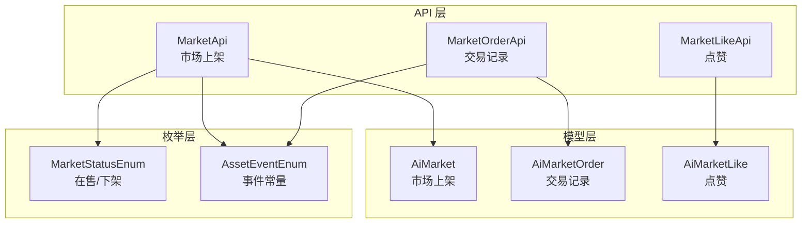
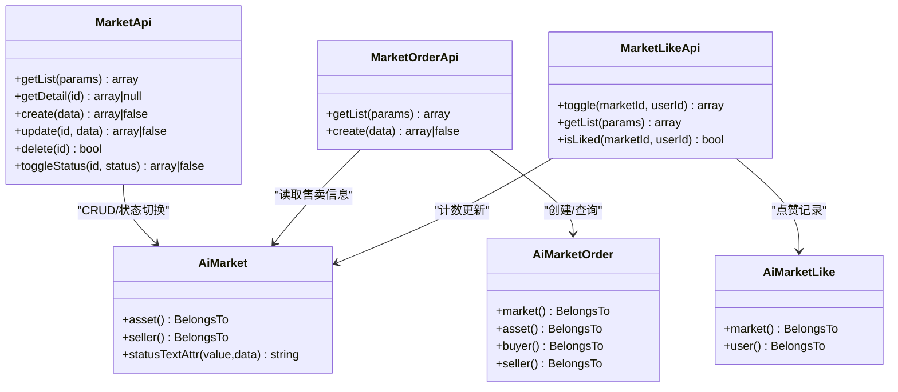
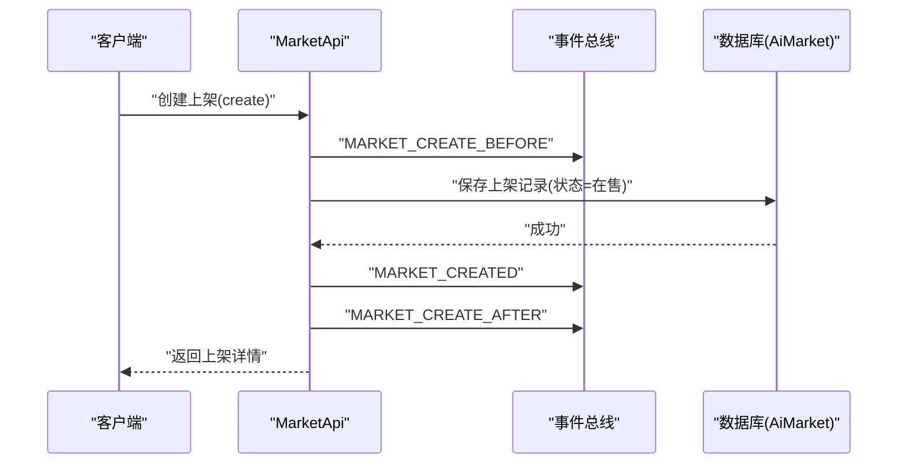
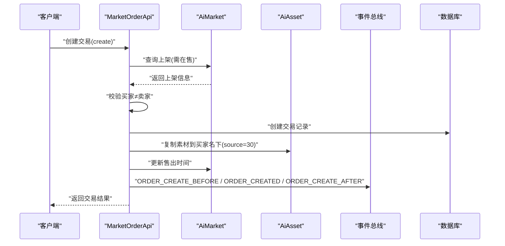
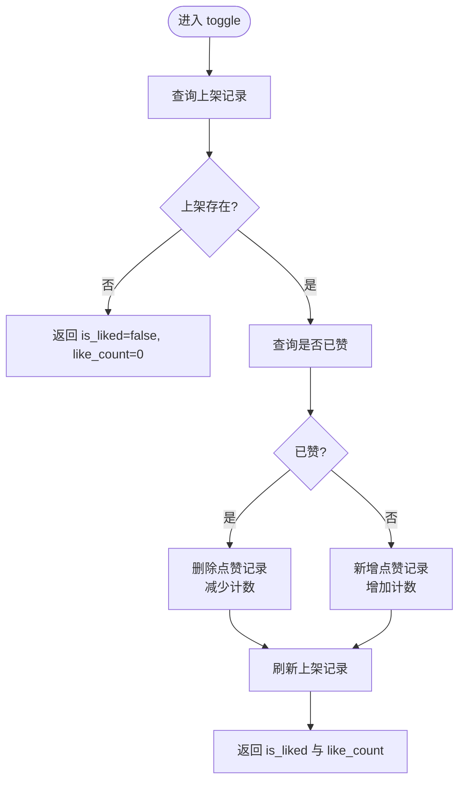
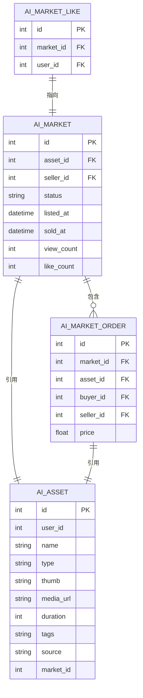
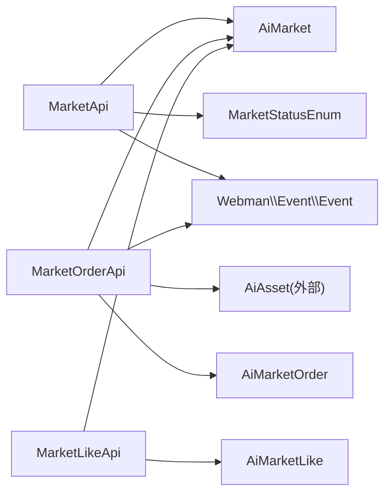
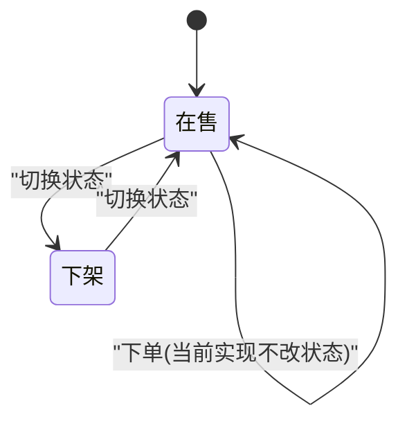

# 资产市场接口

<cite>
**本文引用的文件**   
- [MarketApi.php](file://server/plugin/xbAiAsset/api/MarketApi.php)
- [MarketOrderApi.php](file://server/plugin/xbAiAsset/api/MarketOrderApi.php)
- [MarketLikeApi.php](file://server/plugin/xbAiAsset/api/MarketLikeApi.php)
- [AiMarket.php](file://server/plugin/xbAiAsset/app/model/AiMarket.php)
- [AiMarketOrder.php](file://server/plugin/xbAiAsset/app/model/AiMarketOrder.php)
- [AiMarketLike.php](file://server/plugin/xbAiAsset/app/model/AiMarketLike.php)
- [MarketStatusEnum.php](file://server/plugin/xbAiAsset/enum/MarketStatusEnum.php)
- [AssetEventEnum.php](file://server/plugin/xbAiAsset/enum/AssetEventEnum.php)
</cite>

## 目录
1. [简介](#简介)
2. [项目结构](#项目结构)
3. [核心组件](#核心组件)
4. [架构总览](#架构总览)
5. [详细组件分析](#详细组件分析)
6. [依赖关系分析](#依赖关系分析)
7. [性能与并发](#性能与并发)
8. [事务与异常恢复](#事务与异常恢复)
9. [交易状态机](#交易状态机)
10. [API 规范](#api-规范)
11. [安全与合规](#安全与合规)
12. [故障排查指南](#故障排查指南)
13. [结论](#结论)

## 简介
本文件为“资产市场模块”的完整 API 接口文档，覆盖商品上架、购买交易、点赞反馈、订单管理、数据统计等核心能力。文档基于后端插件 xbAiAsset 的实际实现进行梳理，重点说明：
- 市场上架（创建、查询、更新、删除、切换上下架）
- 交易下单（校验、记录、素材复制、售出时间更新）
- 点赞系统（切换、列表、是否已赞）
- 事件扩展点（前置/后置钩子）
- 状态枚举与数据模型关联
- 并发控制、事务处理与异常恢复建议
- 支付流程、库存管理、佣金结算、评价系统的接入建议与最佳实践

## 项目结构
资产市场相关代码位于 server/plugin/xbAiAsset 下，采用“API + Model + Enum”的分层组织方式：
- api：对外暴露的业务接口方法（上架、订单、点赞）
- app/model：领域模型（市场上架、订单、点赞）
- enum：业务枚举（市场状态、事件常量）

图表来源
- [MarketApi.php:1-191](file://server/plugin/xbAiAsset/api/MarketApi.php#L1-L191)
- [MarketOrderApi.php:1-144](file://server/plugin/xbAiAsset/api/MarketOrderApi.php#L1-L144)
- [MarketLikeApi.php:1-118](file://server/plugin/xbAiAsset/api/MarketLikeApi.php#L1-L118)
- [AiMarket.php:1-51](file://server/plugin/xbAiAsset/app/model/AiMarket.php#L1-L51)
- [AiMarketOrder.php:1-63](file://server/plugin/xbAiAsset/app/model/AiMarketOrder.php#L1-L63)
- [AiMarketLike.php:1-45](file://server/plugin/xbAiAsset/app/model/AiMarketLike.php#L1-L45)
- [MarketStatusEnum.php:1-33](file://server/plugin/xbAiAsset/enum/MarketStatusEnum.php#L1-L33)
- [AssetEventEnum.php:1-237](file://server/plugin/xbAiAsset/enum/AssetEventEnum.php#L1-L237)

章节来源
- [MarketApi.php:1-191](file://server/plugin/xbAiAsset/api/MarketApi.php#L1-L191)
- [MarketOrderApi.php:1-144](file://server/plugin/xbAiAsset/api/MarketOrderApi.php#L1-L144)
- [MarketLikeApi.php:1-118](file://server/plugin/xbAiAsset/api/MarketLikeApi.php#L1-L118)
- [AiMarket.php:1-51](file://server/plugin/xbAiAsset/app/model/AiMarket.php#L1-L51)
- [AiMarketOrder.php:1-63](file://server/plugin/xbAiAsset/app/model/AiMarketOrder.php#L1-L63)
- [AiMarketLike.php:1-45](file://server/plugin/xbAiAsset/app/model/AiMarketLike.php#L1-L45)
- [MarketStatusEnum.php:1-33](file://server/plugin/xbAiAsset/enum/MarketStatusEnum.php#L1-L33)
- [AssetEventEnum.php:1-237](file://server/plugin/xbAiAsset/enum/AssetEventEnum.php#L1-L237)

## 核心组件
- 市场上架 API（MarketApi）
  - 提供市场上架的增删改查与状态切换，贯穿事件生命周期（前置/中置/后置）。
- 交易记录 API（MarketOrderApi）
  - 负责创建交易记录、校验售卖资格、复制素材到买家名下、更新售出时间。
- 点赞 API（MarketLikeApi）
  - 支持点赞/取消点赞切换、获取点赞列表、判断是否已赞。
- 数据模型
  - AiMarket：市场上架记录，关联素材与卖家用户，提供状态文本获取器。
  - AiMarketOrder：交易记录，关联市场上架、素材、买卖双方用户。
  - AiMarketLike：点赞记录，关联市场上架与用户。
- 枚举与事件
  - MarketStatusEnum：定义“在售/下架”等状态值。
  - AssetEventEnum：定义素材、市场上架、交易等事件常量，供前后置钩子使用。

章节来源
- [MarketApi.php:1-191](file://server/plugin/xbAiAsset/api/MarketApi.php#L1-L191)
- [MarketOrderApi.php:1-144](file://server/plugin/xbAiAsset/api/MarketOrderApi.php#L1-L144)
- [MarketLikeApi.php:1-118](file://server/plugin/xbAiAsset/api/MarketLikeApi.php#L1-L118)
- [AiMarket.php:1-51](file://server/plugin/xbAiAsset/app/model/AiMarket.php#L1-L51)
- [AiMarketOrder.php:1-63](file://server/plugin/xbAiAsset/app/model/AiMarketOrder.php#L1-L63)
- [AiMarketLike.php:1-45](file://server/plugin/xbAiAsset/app/model/AiMarketLike.php#L1-L45)
- [MarketStatusEnum.php:1-33](file://server/plugin/xbAiAsset/enum/MarketStatusEnum.php#L1-L33)
- [AssetEventEnum.php:1-237](file://server/plugin/xbAiAsset/enum/AssetEventEnum.php#L1-L237)

## 架构总览
下图展示了市场上架、交易、点赞三大能力的调用链路与数据模型关系。

图表来源
- [MarketApi.php:1-191](file://server/plugin/xbAiAsset/api/MarketApi.php#L1-L191)
- [MarketOrderApi.php:1-144](file://server/plugin/xbAiAsset/api/MarketOrderApi.php#L1-L144)
- [MarketLikeApi.php:1-118](file://server/plugin/xbAiAsset/api/MarketLikeApi.php#L1-L118)
- [AiMarket.php:1-51](file://server/plugin/xbAiAsset/app/model/AiMarket.php#L1-L51)
- [AiMarketOrder.php:1-63](file://server/plugin/xbAiAsset/app/model/AiMarketOrder.php#L1-L63)
- [AiMarketLike.php:1-45](file://server/plugin/xbAiAsset/app/model/AiMarketLike.php#L1-L45)

## 详细组件分析

### 市场上架 API（MarketApi）
- 功能要点
  - 列表查询：支持按状态、卖家、素材ID筛选，分页返回。
  - 详情查询：自动增加浏览次数，返回关联的素材与卖家信息。
  - 创建上架：设置初始状态为“在售”，触发创建前后事件。
  - 更新上架：支持任意字段更新，触发更新前后事件。
  - 删除上架：触发删除前后事件。
  - 切换状态：将上架状态在“在售/下架”间切换，触发更新前后事件。
- 关键约束
  - 状态值遵循 MarketStatusEnum 定义。
  - 所有写操作均通过事件机制暴露扩展点，便于审计、通知、风控等。

图表来源
- [MarketApi.php:94-111](file://server/plugin/xbAiAsset/api/MarketApi.php#L94-L111)
- [AssetEventEnum.php:119-143](file://server/plugin/xbAiAsset/enum/AssetEventEnum.php#L119-L143)
- [MarketStatusEnum.php:21-31](file://server/plugin/xbAiAsset/enum/MarketStatusEnum.php#L21-L31)

章节来源
- [MarketApi.php:47-191](file://server/plugin/xbAiAsset/api/MarketApi.php#L47-L191)
- [AssetEventEnum.php:119-203](file://server/plugin/xbAiAsset/enum/AssetEventEnum.php#L119-L203)
- [MarketStatusEnum.php:19-33](file://server/plugin/xbAiAsset/enum/MarketStatusEnum.php#L19-L33)

### 交易记录 API（MarketOrderApi）
- 功能要点
  - 列表查询：支持按买家、卖家、上架记录、素材ID筛选，分页返回。
  - 创建交易：
    - 校验上架存在且状态为“在售”。
    - 禁止自买（买家等于卖家）。
    - 写入交易记录，复制素材至买家账户，标记 source 为“市场购买”，并记录 market_id。
    - 更新售出时间。
    - 触发交易创建前后事件。
- 关键约束
  - 仅允许对“在售”的商品下单。
  - 素材复制后保留原始元数据（名称、类型、封面、媒体地址、时长、标签），并追加来源标识。

图表来源
- [MarketOrderApi.php:82-142](file://server/plugin/xbAiAsset/api/MarketOrderApi.php#L82-L142)
- [AssetEventEnum.php:211-235](file://server/plugin/xbAiAsset/enum/AssetEventEnum.php#L211-L235)

章节来源
- [MarketOrderApi.php:48-144](file://server/plugin/xbAiAsset/api/MarketOrderApi.php#L48-L144)
- [AssetEventEnum.php:205-237](file://server/plugin/xbAiAsset/enum/AssetEventEnum.php#L205-L237)

### 点赞 API（MarketLikeApi）
- 功能要点
  - 切换点赞：若已赞则取消并减少计数；未赞则新增记录并增加计数。
  - 列表查询：支持按上架记录或用户筛选，分页返回。
  - 是否已赞：快速判断当前用户对某商品的点赞状态。
- 关键约束
  - 点赞数通过原子增减操作维护，避免重复计数。

图表来源
- [MarketLikeApi.php:46-79](file://server/plugin/xbAiAsset/api/MarketLikeApi.php#L46-L79)

章节来源
- [MarketLikeApi.php:46-118](file://server/plugin/xbAiAsset/api/MarketLikeApi.php#L46-L118)

### 数据模型与关联
- AiMarket
  - 关联素材（asset）、卖家用户（seller），并提供状态文本获取器。
- AiMarketOrder
  - 关联市场上架（market）、素材（asset）、买家（buyer）、卖家（seller）。
- AiMarketLike
  - 关联市场上架（market）、用户（user）。

图表来源
- [AiMarket.php:20-51](file://server/plugin/xbAiAsset/app/model/AiMarket.php#L20-L51)
- [AiMarketOrder.php:19-63](file://server/plugin/xbAiAsset/app/model/AiMarketOrder.php#L19-L63)
- [AiMarketLike.php:19-45](file://server/plugin/xbAiAsset/app/model/AiMarketLike.php#L19-L45)

章节来源
- [AiMarket.php:1-51](file://server/plugin/xbAiAsset/app/model/AiMarket.php#L1-L51)
- [AiMarketOrder.php:1-63](file://server/plugin/xbAiAsset/app/model/AiMarketOrder.php#L1-L63)
- [AiMarketLike.php:1-45](file://server/plugin/xbAiAsset/app/model/AiMarketLike.php#L1-L45)

## 依赖关系分析
- 耦合关系
  - MarketApi 强依赖 AiMarket 模型与 MarketStatusEnum 枚举，并通过事件总线解耦外部逻辑。
  - MarketOrderApi 同时依赖 AiMarket、AiAsset、AiMarketOrder 与事件总线。
  - MarketLikeApi 依赖 AiMarketLike 与 AiMarket 计数字段。
- 外部依赖
  - 用户模型来自 xbUser 插件（User）。
  - 事件总线来自 Webman\Event\Event。

图表来源
- [MarketApi.php:1-191](file://server/plugin/xbAiAsset/api/MarketApi.php#L1-L191)
- [MarketOrderApi.php:1-144](file://server/plugin/xbAiAsset/api/MarketOrderApi.php#L1-L144)
- [MarketLikeApi.php:1-118](file://server/plugin/xbAiAsset/api/MarketLikeApi.php#L1-L118)
- [AiMarket.php:1-51](file://server/plugin/xbAiAsset/app/model/AiMarket.php#L1-L51)
- [AiMarketOrder.php:1-63](file://server/plugin/xbAiAsset/app/model/AiMarketOrder.php#L1-L63)
- [AiMarketLike.php:1-45](file://server/plugin/xbAiAsset/app/model/AiMarketLike.php#L1-L45)

章节来源
- [MarketApi.php:1-191](file://server/plugin/xbAiAsset/api/MarketApi.php#L1-L191)
- [MarketOrderApi.php:1-144](file://server/plugin/xbAiAsset/api/MarketOrderApi.php#L1-L144)
- [MarketLikeApi.php:1-118](file://server/plugin/xbAiAsset/api/MarketLikeApi.php#L1-L118)

## 性能与并发
- 计数更新
  - 点赞计数采用 inc/dec 原子操作，降低锁竞争与一致性风险。
- 查询优化
  - 列表接口普遍使用 with 预加载关联，减少 N+1 查询。
  - 分页查询默认按主键降序，利于索引利用。
- 并发建议
  - 下单前对“在售”状态的检查与后续写入之间应加行级锁或乐观锁，防止超卖。
  - 点赞切换在高并发场景建议使用 Redis 原子计数作为热点缓存，异步落库。

[本节为通用性能建议，不直接分析具体文件]

## 事务与异常恢复
- 事务边界
  - 创建交易涉及多表写入（订单、素材复制、上架售出时间），建议包裹在同一数据库事务中，确保一致性。
- 异常恢复
  - 建议在事件监听器中实现幂等与重试策略，避免重复消费导致的数据不一致。
  - 对于外部依赖（如支付、消息队列）失败，采用补偿事务或最终一致性方案。

[本节为通用事务与异常建议，不直接分析具体文件]

## 交易状态机
- 市场上架状态
  - 在售（20）：可被购买。
  - 下架（10）：不可被购买。
- 交易生命周期
  - 创建交易 -> 复制素材 -> 更新售出时间 -> 完成。
- 状态转换规则
  - 仅“在售”商品可下单。
  - 下单成功后，记录售出时间，但当前实现未修改上架状态字段（仍为“在售”），如需严格限制重复购买，应在下单后改为“已售”或引入独立“已售”状态。

图表来源
- [MarketStatusEnum.php:21-31](file://server/plugin/xbAiAsset/enum/MarketStatusEnum.php#L21-L31)
- [MarketOrderApi.php:82-142](file://server/plugin/xbAiAsset/api/MarketOrderApi.php#L82-L142)

章节来源
- [MarketStatusEnum.php:19-33](file://server/plugin/xbAiAsset/enum/MarketStatusEnum.php#L19-L33)
- [MarketOrderApi.php:82-142](file://server/plugin/xbAiAsset/api/MarketOrderApi.php#L82-L142)

## API 规范

### 市场上架接口（MarketApi）
- 获取上架列表
  - 方法：GET
  - 路径：/app/xbAiAsset/api/Market/list
  - 参数：status, seller_id, asset_id, page, limit
  - 返回：分页数据（含关联 asset、seller）
- 获取上架详情
  - 方法：GET
  - 路径：/app/xbAiAsset/api/Market/detail
  - 参数：id
  - 返回：上架详情（自动增加浏览计数）
- 创建上架
  - 方法：POST
  - 路径：/app/xbAiAsset/api/Market/create
  - 请求体：上架数据（包含 asset_id、seller_id、price 等）
  - 返回：上架详情
- 更新上架
  - 方法：PUT
  - 路径：/app/xbAiAsset/api/Market/update
  - 参数：id, data
  - 返回：上架详情
- 删除上架
  - 方法：DELETE
  - 路径：/app/xbAiAsset/api/Market/delete
  - 参数：id
  - 返回：布尔结果
- 切换上下架状态
  - 方法：PUT/POST（视路由配置）
  - 路径：/app/xbAiAsset/api/Market/toggle-status
  - 参数：id, status
  - 返回：上架详情

章节来源
- [MarketApi.php:47-191](file://server/plugin/xbAiAsset/api/MarketApi.php#L47-L191)

### 交易记录接口（MarketOrderApi）
- 获取交易列表
  - 方法：GET
  - 路径：/app/xbAiAsset/api/MarketOrder/list
  - 参数：buyer_id, seller_id, market_id, asset_id, page, limit
  - 返回：分页数据（含关联 asset、buyer、seller、market）
- 创建交易
  - 方法：POST
  - 路径：/app/xbAiAsset/api/MarketOrder/create
  - 请求体：market_id, buyer_id
  - 返回：交易详情

章节来源
- [MarketOrderApi.php:48-144](file://server/plugin/xbAiAsset/api/MarketOrderApi.php#L48-L144)

### 点赞接口（MarketLikeApi）
- 切换点赞
  - 方法：POST
  - 路径：/app/xbAiAsset/api/MarketLike/toggle
  - 参数：marketId, userId
  - 返回：{ is_liked: boolean, like_count: number }
- 获取点赞列表
  - 方法：GET
  - 路径：/app/xbAiAsset/api/MarketLike/list
  - 参数：market_id, user_id, page, limit
  - 返回：分页数据（含关联 market.asset、user）
- 是否已点赞
  - 方法：GET
  - 路径：/app/xbAiAsset/api/MarketLike/is-liked
  - 参数：marketId, userId
  - 返回：boolean

章节来源
- [MarketLikeApi.php:46-118](file://server/plugin/xbAiAsset/api/MarketLikeApi.php#L46-L118)

## 安全与合规
- 鉴权与授权
  - 所有写操作需校验登录态与权限，确保买家/卖家身份正确。
- 防重放与幂等
  - 下单接口需具备幂等键（如 order_no），避免重复提交。
- 输入校验
  - 对所有入参进行类型、范围、白名单校验，防止注入与越权访问。
- 敏感数据保护
  - 价格、余额等敏感字段传输需加密，日志脱敏。
- 审计与追踪
  - 借助事件总线记录关键操作轨迹，便于审计与问题定位。

[本节为通用安全建议，不直接分析具体文件]

## 故障排查指南
- 常见问题
  - 无法下单：检查上架状态是否为“在售”，以及买家是否等于卖家。
  - 点赞计数异常：确认是否存在重复点赞记录或并发写入冲突。
  - 素材未复制到买家：检查交易创建流程是否完整执行，关注事件监听器是否抛出异常。
- 定位步骤
  - 查看对应 API 的错误返回与日志。
  - 检查数据库中关联表（AiMarket、AiMarketOrder、AiMarketLike）的一致性。
  - 核对事件监听器的执行结果与重试策略。

[本节为通用排障建议，不直接分析具体文件]

## 结论
资产市场模块以清晰的 API 分层与模型关联实现了市场上架、交易、点赞的核心能力，并通过事件机制提供了良好的扩展性。为保障生产稳定性，建议完善事务边界、并发控制与异常恢复策略，并在需要时引入支付、库存、佣金与评价等子系统，形成完整的电商闭环。