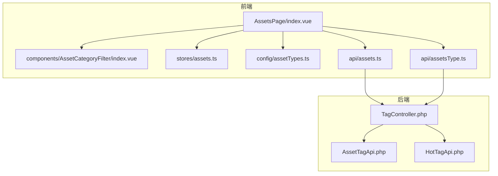
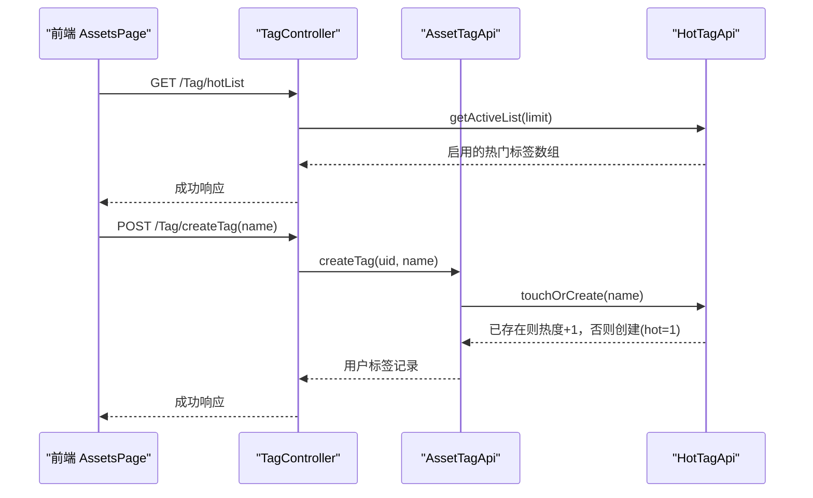
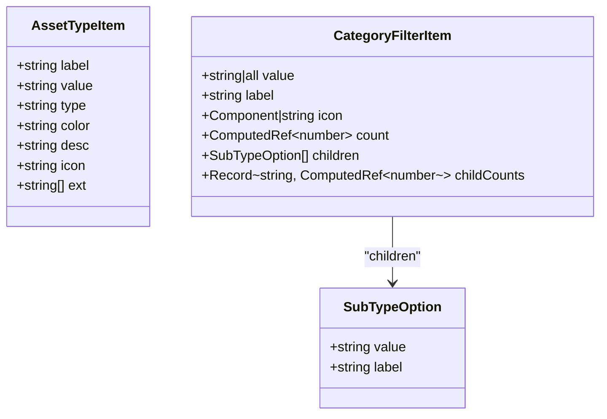
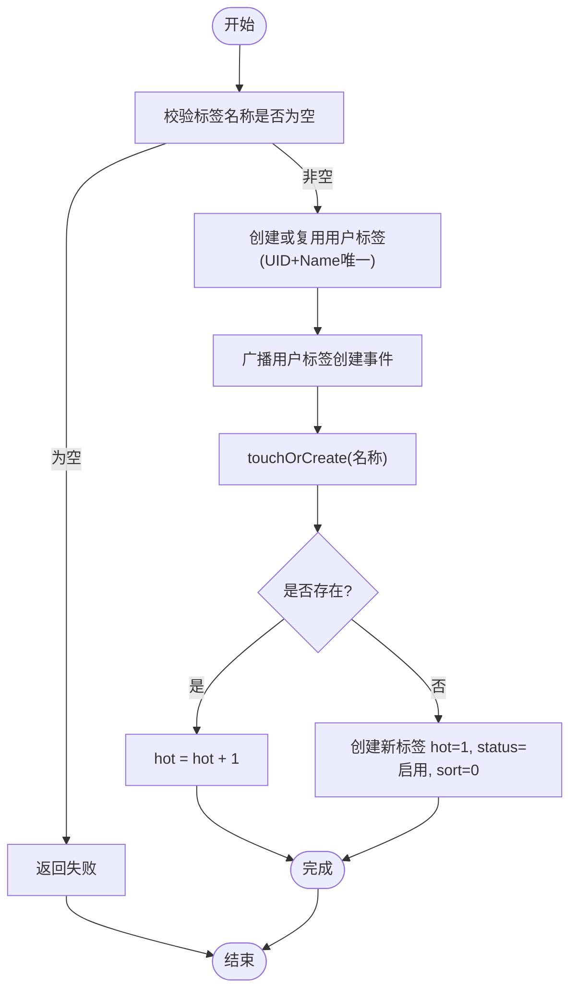
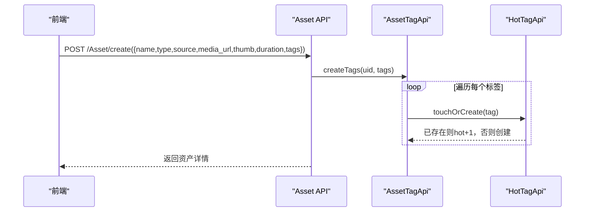
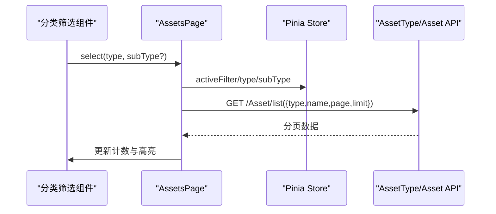
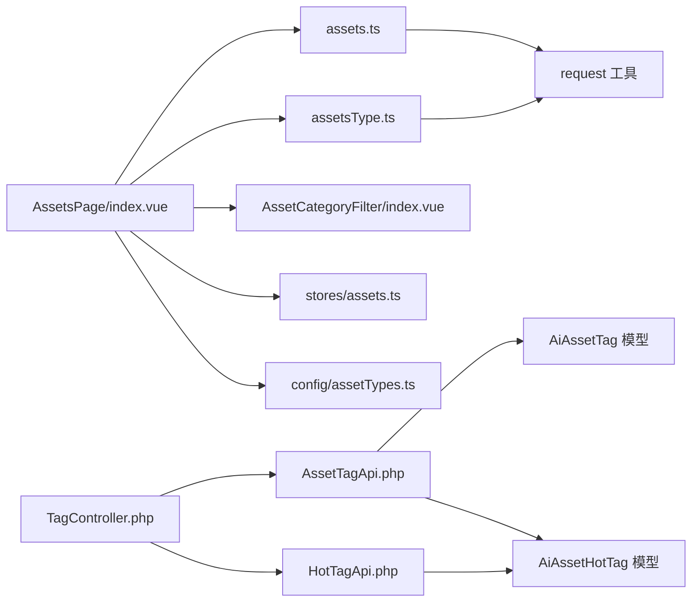

# 分类标签接口

<cite>
**本文引用的文件**
- [frontend/src/api/assets.ts](file://frontend/src/api/assets.ts)
- [frontend/src/api/assetsType.ts](file://frontend/src/api/assetsType.ts)
- [frontend/src/components/AssetCategoryFilter/index.vue](file://frontend/src/components/AssetCategoryFilter/index.vue)
- [frontend/src/config/assetTypes.ts](file://frontend/src/config/assetTypes.ts)
- [frontend/src/stores/assets.ts](file://frontend/src/stores/assets.ts)
- [frontend/src/views/AssetsPage/index.vue](file://frontend/src/views/AssetsPage/index.vue)
- [server/plugin/xbAiAsset/app/api/controller/TagController.php](file://server/plugin/xbAiAsset/app/api/controller/TagController.php)
- [server/plugin/xbAiAsset/api/AssetTagApi.php](file://server/plugin/xbAiAsset/api/AssetTagApi.php)
- [server/plugin/xbAiAsset/api/HotTagApi.php](file://server/plugin/xbAiAsset/api/HotTagApi.php)
</cite>

## 目录
1. [简介](#简介)
2. [项目结构](#项目结构)
3. [核心组件](#核心组件)
4. [架构总览](#架构总览)
5. [详细组件分析](#详细组件分析)
6. [依赖分析](#依赖分析)
7. [性能考虑](#性能考虑)
8. [故障排查指南](#故障排查指南)
9. [结论](#结论)
10. [附录：API 定义与示例](#附录api-定义与示例)

## 简介
本文件为“资产分类与标签管理系统”的 API 文档，覆盖以下能力：
- 资产类型管理（增删改查）
- 标签创建与管理（单条、批量）
- 标签关联（在资产创建时自动关联）
- 高级特性：分类层级结构、热门标签权重算法、自动标签生成
- 前端实现示例：分类筛选、标签云展示

后端基于 Webman + ThinkORM 插件化架构，前端采用 Vue3 + Pinia。

## 项目结构
- 前端
  - API 层：assets.ts、assetsType.ts
  - 视图与状态：AssetsPage/index.vue、stores/assets.ts
  - 通用组件：AssetCategoryFilter/index.vue
  - 配置：config/assetTypes.ts
- 后端
  - 控制器：app/api/controller/TagController.php
  - 业务 API：api/AssetTagApi.php、api/HotTagApi.php

图表来源
- [frontend/src/views/AssetsPage/index.vue:1-473](file://frontend/src/views/AssetsPage/index.vue#L1-L473)
- [frontend/src/components/AssetCategoryFilter/index.vue:1-112](file://frontend/src/components/AssetCategoryFilter/index.vue#L1-L112)
- [frontend/src/stores/assets.ts:1-161](file://frontend/src/stores/assets.ts#L1-L161)
- [frontend/src/config/assetTypes.ts:1-69](file://frontend/src/config/assetTypes.ts#L1-L69)
- [frontend/src/api/assets.ts:1-135](file://frontend/src/api/assets.ts#L1-L135)
- [frontend/src/api/assetsType.ts:1-27](file://frontend/src/api/assetsType.ts#L1-L27)
- [server/plugin/xbAiAsset/app/api/controller/TagController.php:1-81](file://server/plugin/xbAiAsset/app/api/controller/TagController.php#L1-L81)
- [server/plugin/xbAiAsset/api/AssetTagApi.php:1-172](file://server/plugin/xbAiAsset/api/AssetTagApi.php#L1-L172)
- [server/plugin/xbAiAsset/api/HotTagApi.php:1-216](file://server/plugin/xbAiAsset/api/HotTagApi.php#L1-L216)

章节来源
- [frontend/src/views/AssetsPage/index.vue:1-473](file://frontend/src/views/AssetsPage/index.vue#L1-L473)
- [frontend/src/api/assets.ts:1-135](file://frontend/src/api/assets.ts#L1-L135)
- [frontend/src/api/assetsType.ts:1-27](file://frontend/src/api/assetsType.ts#L1-L27)
- [server/plugin/xbAiAsset/app/api/controller/TagController.php:1-81](file://server/plugin/xbAiAsset/app/api/controller/TagController.php#L1-L81)
- [server/plugin/xbAiAsset/api/AssetTagApi.php:1-172](file://server/plugin/xbAiAsset/api/AssetTagApi.php#L1-L172)
- [server/plugin/xbAiAsset/api/HotTagApi.php:1-216](file://server/plugin/xbAiAsset/api/HotTagApi.php#L1-L216)

## 核心组件
- 资产类型列表接口
  - 获取资产类型列表：GET /app/xbAiAsset/api/AssetType/list
  - 返回字段包含显示名、值、媒体类型、颜色、描述、图标、允许扩展名等
- 资产 CRUD 接口
  - 列表：GET /app/xbAiAsset/api/Asset/list
  - 详情：GET /app/xbAiAsset/api/Asset/detail
  - 创建：POST /app/xbAiAsset/api/Asset/create
  - 更新：PUT /app/xbAiAsset/api/Asset/update
  - 删除：DELETE /app/xbAiAsset/api/Asset/delete
- 标签接口
  - 热门标签列表：GET /app/xbAiAsset/api/Tag/hotList
  - 用户创建标签：POST /app/xbAiAsset/api/Tag/createTag
  - 批量创建标签：POST /app/xbAiAsset/api/Tag/createTags
  - 用户标签列表：GET /app/xbAiAsset/api/Tag/userList

章节来源
- [frontend/src/api/assetsType.ts:1-27](file://frontend/src/api/assetsType.ts#L1-L27)
- [frontend/src/api/assets.ts:1-135](file://frontend/src/api/assets.ts#L1-L135)
- [server/plugin/xbAiAsset/app/api/controller/TagController.php:1-81](file://server/plugin/xbAiAsset/app/api/controller/TagController.php#L1-L81)

## 架构总览
前后端交互流程如下：
- 前端页面发起请求到后端控制器
- 控制器调用标签 API（用户标签、热门标签）
- 标签 API 负责数据持久化与事件广播
- 前端根据返回结果渲染分类筛选与标签云

图表来源
- [server/plugin/xbAiAsset/app/api/controller/TagController.php:1-81](file://server/plugin/xbAiAsset/app/api/controller/TagController.php#L1-L81)
- [server/plugin/xbAiAsset/api/AssetTagApi.php:1-172](file://server/plugin/xbAiAsset/api/AssetTagApi.php#L1-L172)
- [server/plugin/xbAiAsset/api/HotTagApi.php:1-216](file://server/plugin/xbAiAsset/api/HotTagApi.php#L1-L216)

## 详细组件分析

### 资产类型与分类层级
- 资产类型映射
  - 前端使用字符串枚举（如 character、background、voice 等），后端使用数字编码（10/20/30/40/50/60）
  - 页面通过映射表进行双向转换，确保前后端一致
- 子类型支持
  - voice/sound_effect/video 具备子类型，用于更细粒度筛选
  - 子类型由前端配置提供，便于扩展与维护
- 分类筛选组件
  - 支持主类型与子类型联动选择，展开/收起动画，计数显示

图表来源
- [frontend/src/api/assetsType.ts:1-27](file://frontend/src/api/assetsType.ts#L1-L27)
- [frontend/src/config/assetTypes.ts:1-69](file://frontend/src/config/assetTypes.ts#L1-L69)
- [frontend/src/components/AssetCategoryFilter/index.vue:1-112](file://frontend/src/components/AssetCategoryFilter/index.vue#L1-L112)

章节来源
- [frontend/src/views/AssetsPage/index.vue:30-50](file://frontend/src/views/AssetsPage/index.vue#L30-L50)
- [frontend/src/config/assetTypes.ts:1-69](file://frontend/src/config/assetTypes.ts#L1-L69)
- [frontend/src/components/AssetCategoryFilter/index.vue:1-112](file://frontend/src/components/AssetCategoryFilter/index.vue#L1-L112)

### 标签系统（创建、批量、关联、权重）
- 用户标签
  - 唯一性：同一用户的同名标签去重
  - 事件：创建后广播用户标签创建事件
- 热门标签
  - 自动创建或热度自增：首次出现 hot=1，再次出现 hot+1
  - 排序：按热度降序、排序字段、ID 降序
- 标签关联
  - 资产创建时，若携带 tags 字段，将触发批量创建用户标签并同步更新热门标签库

图表来源
- [server/plugin/xbAiAsset/api/AssetTagApi.php:88-134](file://server/plugin/xbAiAsset/api/AssetTagApi.php#L88-L134)
- [server/plugin/xbAiAsset/api/HotTagApi.php:197-214](file://server/plugin/xbAiAsset/api/HotTagApi.php#L197-L214)

章节来源
- [server/plugin/xbAiAsset/api/AssetTagApi.php:1-172](file://server/plugin/xbAiAsset/api/AssetTagApi.php#L1-L172)
- [server/plugin/xbAiAsset/api/HotTagApi.php:1-216](file://server/plugin/xbAiAsset/api/HotTagApi.php#L1-L216)
- [server/plugin/xbAiAsset/app/api/controller/TagController.php:1-81](file://server/plugin/xbAiAsset/app/api/controller/TagController.php#L1-L81)

### 资产 CRUD 与标签联动
- 资产创建
  - 参数包含名称、类型、来源、媒体地址、封面、时长、标签
  - 后端在创建资产时，会调用批量创建标签方法，从而触发用户标签与热门标签联动
- 资产列表
  - 支持分页、按类型过滤、按名称模糊搜索
- 资产更新/删除
  - 支持部分字段更新；删除操作需幂等处理

图表来源
- [frontend/src/api/assets.ts:118-120](file://frontend/src/api/assets.ts#L118-L120)
- [server/plugin/xbAiAsset/api/AssetTagApi.php:124-134](file://server/plugin/xbAiAsset/api/AssetTagApi.php#L124-L134)
- [server/plugin/xbAiAsset/api/HotTagApi.php:197-214](file://server/plugin/xbAiAsset/api/HotTagApi.php#L197-L214)

章节来源
- [frontend/src/api/assets.ts:1-135](file://frontend/src/api/assets.ts#L1-L135)
- [server/plugin/xbAiAsset/api/AssetTagApi.php:124-134](file://server/plugin/xbAiAsset/api/AssetTagApi.php#L124-L134)

### 前端分类筛选与标签云示例
- 分类筛选
  - 侧边栏组件接收类型列表与当前选中项，支持主类型与子类型切换
  - 页面监听选择事件，重置页码并拉取对应数据
- 标签云
  - 从热门标签接口获取启用状态的标签，点击标签触发搜索，刷新列表

图表来源
- [frontend/src/components/AssetCategoryFilter/index.vue:30-43](file://frontend/src/components/AssetCategoryFilter/index.vue#L30-L43)
- [frontend/src/views/AssetsPage/index.vue:147-153](file://frontend/src/views/AssetsPage/index.vue#L147-L153)
- [frontend/src/views/AssetsPage/index.vue:76-105](file://frontend/src/views/AssetsPage/index.vue#L76-L105)

章节来源
- [frontend/src/components/AssetCategoryFilter/index.vue:1-112](file://frontend/src/components/AssetCategoryFilter/index.vue#L1-L112)
- [frontend/src/views/AssetsPage/index.vue:122-170](file://frontend/src/views/AssetsPage/index.vue#L122-L170)

## 依赖分析
- 前端依赖
  - assets.ts 依赖 request 工具封装
  - assetsType.ts 仅依赖 request
  - AssetsPage 组合多个模块：store、组件、API、路由
- 后端依赖
  - TagController 依赖 AssetTagApi 与 HotTagApi
  - AssetTagApi 依赖 AiAssetTag/AiAssetHotTag 模型与事件总线
  - HotTagApi 依赖 AiAssetHotTag 模型与事件总线

图表来源
- [frontend/src/api/assets.ts:1-135](file://frontend/src/api/assets.ts#L1-L135)
- [frontend/src/api/assetsType.ts:1-27](file://frontend/src/api/assetsType.ts#L1-L27)
- [frontend/src/views/AssetsPage/index.vue:1-473](file://frontend/src/views/AssetsPage/index.vue#L1-L473)
- [server/plugin/xbAiAsset/app/api/controller/TagController.php:1-81](file://server/plugin/xbAiAsset/app/api/controller/TagController.php#L1-L81)
- [server/plugin/xbAiAsset/api/AssetTagApi.php:1-172](file://server/plugin/xbAiAsset/api/AssetTagApi.php#L1-L172)
- [server/plugin/xbAiAsset/api/HotTagApi.php:1-216](file://server/plugin/xbAiAsset/api/HotTagApi.php#L1-L216)

章节来源
- [frontend/src/views/AssetsPage/index.vue:1-473](file://frontend/src/views/AssetsPage/index.vue#L1-L473)
- [server/plugin/xbAiAsset/app/api/controller/TagController.php:1-81](file://server/plugin/xbAiAsset/app/api/controller/TagController.php#L1-L81)

## 性能考虑
- 分页与限流
  - 列表接口支持 page/limit，避免一次性加载过多数据
  - 热门标签接口支持 limit 控制返回数量
- 缓存建议
  - 热门标签可结合 Redis 缓存热点键，降低数据库压力
- 索引优化
  - 对标签名称、用户 ID、状态等高频查询字段建立索引
- 前端优化
  - 计算属性与浅引用减少重复渲染
  - 懒加载与虚拟滚动适用于大数据量场景

[本节为通用指导，不直接分析具体文件]

## 故障排查指南
- 常见问题
  - 标签名称为空：后端会拒绝创建并返回失败提示
  - 重复标签：用户标签按 UID+Name 去重，不会重复插入
  - 热门标签未生效：确认状态为启用且排序字段合理
- 定位步骤
  - 检查控制器入参与错误返回
  - 查看标签 API 是否触发了事件与热度更新
  - 核对前端类型映射是否正确，避免筛选失效

章节来源
- [server/plugin/xbAiAsset/app/api/controller/TagController.php:44-70](file://server/plugin/xbAiAsset/app/api/controller/TagController.php#L44-L70)
- [server/plugin/xbAiAsset/api/AssetTagApi.php:88-116](file://server/plugin/xbAiAsset/api/AssetTagApi.php#L88-L116)
- [server/plugin/xbAiAsset/api/HotTagApi.php:197-214](file://server/plugin/xbAiAsset/api/HotTagApi.php#L197-L214)

## 结论
本系统实现了资产分类与标签管理的完整闭环：
- 资产类型与子类型清晰分层，便于扩展
- 标签体系支持用户维度与全局维度，具备自动创建与热度增长机制
- 前端提供分类筛选与标签云展示，提升检索效率
- 通过事件与 API 解耦，具备良好的可维护性与可扩展性

[本节为总结，不直接分析具体文件]

## 附录：API 定义与示例

### 资产类型
- 接口
  - GET /app/xbAiAsset/api/AssetType/list
- 返回
  - 数组，每项包含 label、value、type、color、desc、icon、ext 等字段

章节来源
- [frontend/src/api/assetsType.ts:1-27](file://frontend/src/api/assetsType.ts#L1-L27)

### 资产 CRUD
- 列表
  - GET /app/xbAiAsset/api/Asset/list
  - 查询参数：type、source、name、page、limit
  - 返回：total、per_page、current_page、last_page、data[]
- 详情
  - GET /app/xbAiAsset/api/Asset/detail?id={id}
- 创建
  - POST /app/xbAiAsset/api/Asset/create
  - 表单字段：name、type、source、media_url、thumb、duration、tags
  - 说明：tags 将触发批量创建用户标签与热门标签联动
- 更新
  - PUT /app/xbAiAsset/api/Asset/update
  - 表单字段：id、可选的 name/type/source/thumb/media_url/duration/tags
- 删除
  - DELETE /app/xbAiAsset/api/Asset/delete?id={id}

章节来源
- [frontend/src/api/assets.ts:1-135](file://frontend/src/api/assets.ts#L1-L135)

### 标签接口
- 热门标签列表
  - GET /app/xbAiAsset/api/Tag/hotList?limit={int}
  - 返回：启用的热门标签数组（按热度排序）
- 用户创建标签
  - POST /app/xbAiAsset/api/Tag/createTag
  - 表单字段：name
  - 行为：创建用户标签，并在热门标签库中 touchOrCreate
- 批量创建标签
  - POST /app/xbAiAsset/api/Tag/createTags
  - 表单字段：names（逗号分隔）
  - 行为：逐个创建用户标签并更新热门标签库
- 用户标签列表
  - GET /app/xbAiAsset/api/Tag/userList?limit={int}
  - 返回：当前用户的标签列表

章节来源
- [server/plugin/xbAiAsset/app/api/controller/TagController.php:1-81](file://server/plugin/xbAiAsset/app/api/controller/TagController.php#L1-L81)
- [server/plugin/xbAiAsset/api/AssetTagApi.php:1-172](file://server/plugin/xbAiAsset/api/AssetTagApi.php#L1-L172)
- [server/plugin/xbAiAsset/api/HotTagApi.php:1-216](file://server/plugin/xbAiAsset/api/HotTagApi.php#L1-L216)