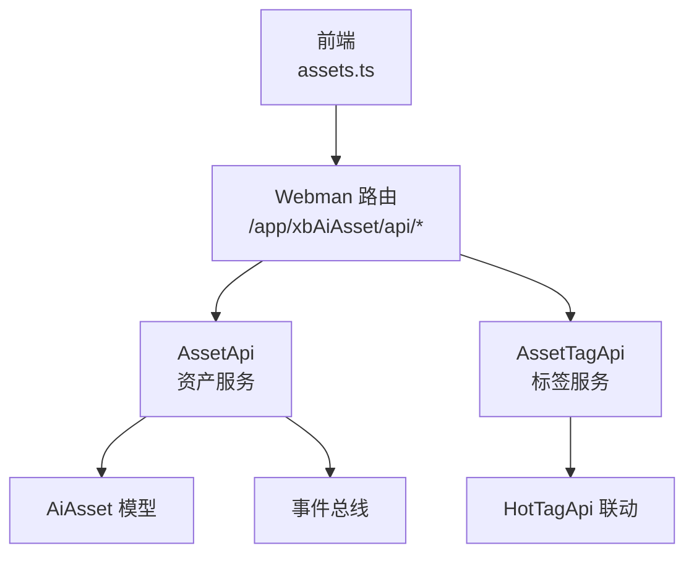
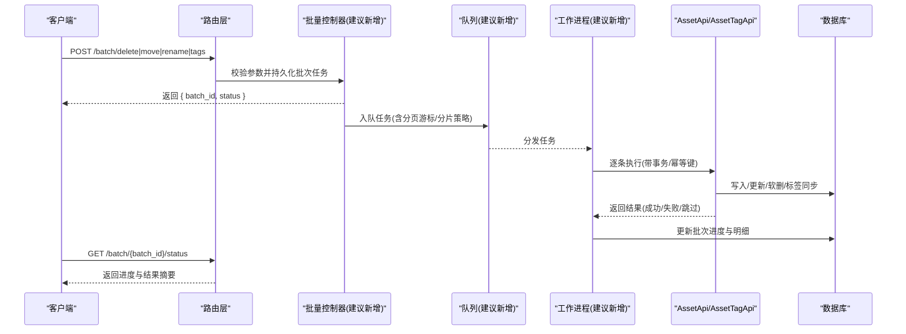
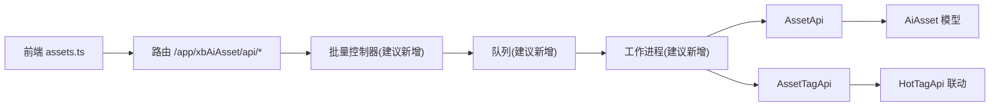

# 批量操作接口

<cite>
**本文引用的文件**   
- [frontend/src/api/assets.ts](file://frontend/src/api/assets.ts)
- [server/plugin/xbAiAsset/api/AssetApi.php](file://server/plugin/xbAiAsset/api/AssetApi.php)
- [server/plugin/xbAiAsset/api/AssetTagApi.php](file://server/plugin/xbAiAsset/api/AssetTagApi.php)
- [server/plugin/xbAiAsset/config/route.php](file://server/plugin/xbAiAsset/config/route.php)
</cite>

## 目录
1. [简介](#简介)
2. [项目结构](#项目结构)
3. [核心组件](#核心组件)
4. [架构总览](#架构总览)
5. [详细组件分析](#详细组件分析)
6. [依赖分析](#依赖分析)
7. [性能考虑](#性能考虑)
8. [故障排查指南](#故障排查指南)
9. [结论](#结论)
10. [附录](#附录)

## 简介
本文件为“资产批量操作”的API文档，聚焦以下高效能力：
- 批量删除、批量移动（重定向至目标目录/分类）、批量重命名、批量标签管理
- 事务处理、并发控制、错误回滚与进度跟踪机制
- 大数据量处理的优化方案与异步任务最佳实践

说明：当前仓库中已实现单条资产的创建、更新、删除与标签同步逻辑。批量接口尚未在代码中直接暴露，本文基于现有单条接口与事件/队列基础设施，给出可落地的批量接口设计与实现建议，确保与现有代码一致且可扩展。

## 项目结构
前端通过统一请求封装调用后端 /app/xbAiAsset/api/* 路由；后端以插件形式提供 AssetApi 与 AssetTagApi，负责资产CRUD与标签联动。

图示来源
- [frontend/src/api/assets.ts](file://frontend/src/api/assets.ts)
- [server/plugin/xbAiAsset/api/AssetApi.php](file://server/plugin/xbAiAsset/api/AssetApi.php)
- [server/plugin/xbAiAsset/api/AssetTagApi.php](file://server/plugin/xbAiAsset/api/AssetTagApi.php)
- [server/plugin/xbAiAsset/config/route.php](file://server/plugin/xbAiAsset/config/route.php)

章节来源
- [frontend/src/api/assets.ts](file://frontend/src/api/assets.ts)
- [server/plugin/xbAiAsset/api/AssetApi.php](file://server/plugin/xbAiAsset/api/AssetApi.php)
- [server/plugin/xbAiAsset/api/AssetTagApi.php](file://server/plugin/xbAiAsset/api/AssetTagApi.php)
- [server/plugin/xbAiAsset/config/route.php](file://server/plugin/xbAiAsset/config/route.php)

## 核心组件
- 资产服务（AssetApi）
  - 提供列表、详情、创建、更新、删除等能力，并在关键生命周期触发事件，同时支持将标签同步到用户标签库与热门标签库。
- 标签服务（AssetTagApi）
  - 提供用户标签查询、按用户ID获取、批量创建、统计与删除等能力；创建时联动热门标签库。

章节来源
- [server/plugin/xbAiAsset/api/AssetApi.php](file://server/plugin/xbAiAsset/api/AssetApi.php)
- [server/plugin/xbAiAsset/api/AssetTagApi.php](file://server/plugin/xbAiAsset/api/AssetTagApi.php)

## 架构总览
下图展示从前端发起批量操作到后端服务、事件与数据层的整体流程。批量接口建议采用“提交任务 + 轮询/回调”模式，结合数据库事务与队列消费，保证一致性、可恢复性与可观测性。

图示来源
- [server/plugin/xbAiAsset/api/AssetApi.php](file://server/plugin/xbAiAsset/api/AssetApi.php)
- [server/plugin/xbAiAsset/api/AssetTagApi.php](file://server/plugin/xbAiAsset/api/AssetTagApi.php)

## 详细组件分析

### 现有单条接口能力（参考基线）
- 资产列表/详情/创建/更新/删除
- 标签同步：创建或更新资产时，自动将 tags 同步到用户标签库与热门标签库

章节来源
- [server/plugin/xbAiAsset/api/AssetApi.php](file://server/plugin/xbAiAsset/api/AssetApi.php)
- [server/plugin/xbAiAsset/api/AssetTagApi.php](file://server/plugin/xbAiAsset/api/AssetTagApi.php)

### 批量删除接口设计
- 接口
  - POST /app/xbAiAsset/api/Batch/delete
  - 请求体
    - ids: number[] 待删除资产ID集合
    - force: boolean 是否强制删除（默认false）
  - 响应
    - batch_id: string 批次号
    - status: "pending" | "running" | "completed" | "failed"
- 处理流程
  - 校验ids非空与权限
  - 生成幂等键（如 md5(ids+user_id+timestamp)），避免重复提交
  - 写入批次表（状态=pending，总数=ids.length）
  - 入队任务，按固定分片大小（如每批100条）推进
  - 工作进程内开启事务，逐条软删除并记录明细（成功/失败/跳过）
  - 完成后更新批次状态与汇总信息
- 进度查询
  - GET /app/xbAiAsset/api/Batch/{batch_id}/status
  - 返回 total、processed、success、failed、skipped、detail[]
- 并发与回滚
  - 使用数据库事务包裹每条记录的删除与关联清理
  - 失败项不中断整批，记录失败原因，支持重试
  - 幂等键防止重复执行
- 前端集成
  - 提交后轮询状态，直至 completed/failed
  - 展示成功/失败数量与失败原因

章节来源
- [server/plugin/xbAiAsset/api/AssetApi.php](file://server/plugin/xbAiAsset/api/AssetApi.php)

### 批量移动接口设计
- 接口
  - POST /app/xbAiAsset/api/Batch/move
  - 请求体
    - ids: number[]
    - target_category_id: number 目标分类/目录ID
  - 响应
    - batch_id, status
- 处理流程
  - 校验目标分类存在且权限合法
  - 分批更新 assets.category_id 字段（或对应路径字段）
  - 若涉及存储路径变更，需先校验目标空间容量与配额
  - 记录明细与失败原因
- 并发与回滚
  - 单条更新使用事务
  - 对不可迁移的资源（如被强引用）标记为 skipped 并记录原因
- 进度查询
  - 同批量删除

章节来源
- [server/plugin/xbAiAsset/api/AssetApi.php](file://server/plugin/xbAiAsset/api/AssetApi.php)

### 批量重命名接口设计
- 接口
  - POST /app/xbAiAsset/api/Batch/rename
  - 请求体
    - items: [{ id: number, name: string }]
  - 响应
    - batch_id, status
- 处理流程
  - 校验名称合法性与唯一性（同用户/同目录下）
  - 分批更新 assets.name
  - 若名称影响媒体URL或索引，需触发重建或缓存失效
- 并发与回滚
  - 单条更新使用事务
  - 冲突项标记为 skipped 并记录原因
- 进度查询
  - 同批量删除

章节来源
- [server/plugin/xbAiAsset/api/AssetApi.php](file://server/plugin/xbAiAsset/api/AssetApi.php)

### 批量标签管理接口设计
- 接口
  - POST /app/xbAiAsset/api/Batch/tags
  - 请求体
    - ids: number[]
    - action: "add" | "remove" | "set"
    - tags: string[] 要操作的标签集合
  - 响应
    - batch_id, status
- 处理流程
  - add：为选中资产追加标签（去重）
  - remove：移除指定标签（去重）
  - set：覆盖为新的标签集合
  - 每次变更后，调用标签服务同步到用户标签库与热门标签库
- 并发与回滚
  - 单条标签变更使用事务
  - 失败项记录原因，支持重试
- 进度查询
  - 同批量删除

章节来源
- [server/plugin/xbAiAsset/api/AssetApi.php](file://server/plugin/xbAiAsset/api/AssetApi.php)
- [server/plugin/xbAiAsset/api/AssetTagApi.php](file://server/plugin/xbAiAsset/api/AssetTagApi.php)

### 标签联动与事件
- 资产创建/更新时，会将 tags 同步到用户标签库与热门标签库
- 标签服务提供批量创建标签的能力，便于批量操作时复用

章节来源
- [server/plugin/xbAiAsset/api/AssetApi.php](file://server/plugin/xbAiAsset/api/AssetApi.php)
- [server/plugin/xbAiAsset/api/AssetTagApi.php](file://server/plugin/xbAiAsset/api/AssetTagApi.php)

### 前端调用示例（参考现有风格）
- 现有单条接口调用方式见 assets.ts，批量接口可沿用相同请求封装与错误拦截策略。

章节来源
- [frontend/src/api/assets.ts](file://frontend/src/api/assets.ts)

## 依赖分析
- 前端依赖 Webman 路由与统一请求封装
- 后端依赖：
  - AssetApi：资产模型、事件总线、标签服务
  - AssetTagApi：用户标签模型、热门标签服务
- 建议新增依赖：
  - 批次任务表与状态机
  - 队列系统与消费者
  - 进度存储（数据库或缓存）

图示来源
- [frontend/src/api/assets.ts](file://frontend/src/api/assets.ts)
- [server/plugin/xbAiAsset/api/AssetApi.php](file://server/plugin/xbAiAsset/api/AssetApi.php)
- [server/plugin/xbAiAsset/api/AssetTagApi.php](file://server/plugin/xbAiAsset/api/AssetTagApi.php)
- [server/plugin/xbAiAsset/config/route.php](file://server/plugin/xbAiAsset/config/route.php)

章节来源
- [frontend/src/api/assets.ts](file://frontend/src/api/assets.ts)
- [server/plugin/xbAiAsset/api/AssetApi.php](file://server/plugin/xbAiAsset/api/AssetApi.php)
- [server/plugin/xbAiAsset/api/AssetTagApi.php](file://server/plugin/xbAiAsset/api/AssetTagApi.php)
- [server/plugin/xbAiAsset/config/route.php](file://server/plugin/xbAiAsset/config/route.php)

## 性能考虑
- 分片与游标
  - 将大批量拆分为固定大小的子任务（如每批100条），避免长事务与大锁
- 事务边界
  - 单条操作最小事务，减少锁持有时间
- 幂等与去重
  - 使用幂等键（如 md5(ids+user_id+ts)）避免重复提交
- 并发控制
  - 限制消费者并发度，结合数据库行级锁或乐观锁
- 索引与查询
  - 对常用筛选字段建立索引（如 user_id、category_id、type、source）
- 异步与退避
  - 失败重试采用指数退避，避免雪崩
- 资源校验
  - 移动前检查目标空间容量与配额，提前失败快速反馈

[本节为通用指导，无需源码引用]

## 故障排查指南
- 常见问题
  - 重复提交导致重复执行：检查幂等键与批次状态
  - 部分失败未重试：确认失败明细与重试策略
  - 进度不更新：检查批次表与消费者日志
  - 标签不同步：确认标签服务调用与事件链路
- 定位手段
  - 查看批次状态与明细
  - 检查消费者日志与数据库事务日志
  - 核对事件总线输出与热点标签库一致性

[本节为通用指导，无需源码引用]

## 结论
本文在现有单条资产与标签能力基础上，给出了完整的批量操作接口设计方案，涵盖事务、并发、回滚、进度与异步处理等关键点。建议优先落地“批量删除”和“批量标签管理”，再逐步扩展移动与重命名，确保系统稳定与可观测。

[本节为总结性内容，无需源码引用]

## 附录
- 接口清单（建议新增）
  - POST /app/xbAiAsset/api/Batch/delete
  - POST /app/xbAiAsset/api/Batch/move
  - POST /app/xbAiAsset/api/Batch/rename
  - POST /app/xbAiAsset/api/Batch/tags
  - GET /app/xbAiAsset/api/Batch/{batch_id}/status
- 数据结构（建议）
  - 批次任务：batch_id、user_id、action、total、processed、success、failed、skipped、status、created_at、updated_at
  - 批次明细：id、asset_id、status、reason、retry_count、updated_at

[本节为补充信息，无需源码引用]