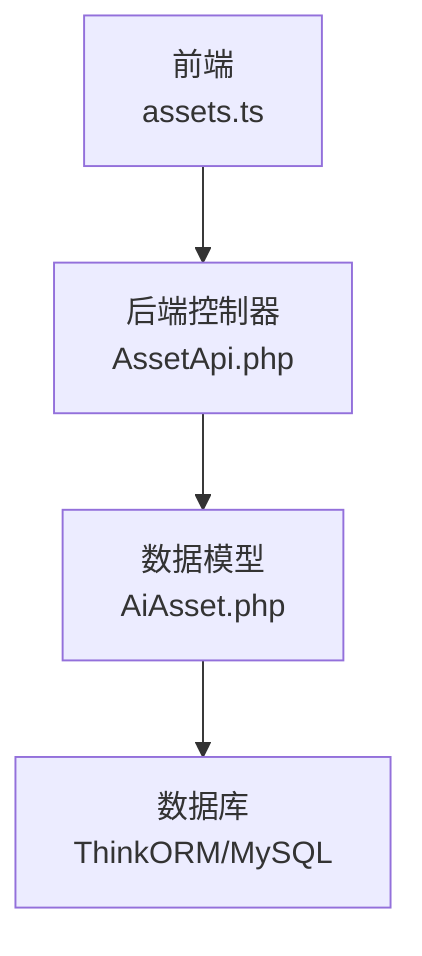
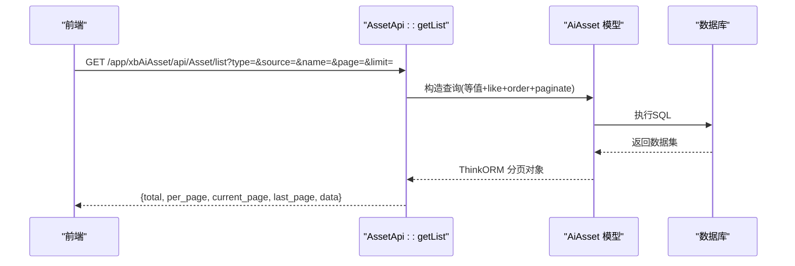
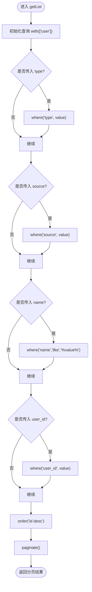
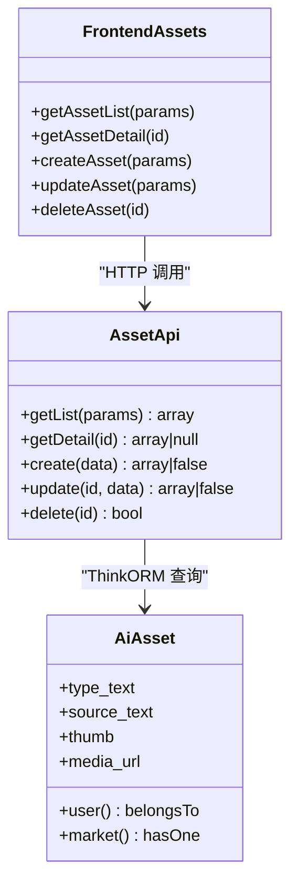

# 搜索过滤接口

<cite>
**本文引用的文件**
- [server/plugin/xbAiAsset/api/AssetApi.php](file://server/plugin/xbAiAsset/api/AssetApi.php)
- [server/plugin/xbAiAsset/app/model/AiAsset.php](file://server/plugin/xbAiAsset/app/model/AiAsset.php)
- [frontend/src/api/assets.ts](file://frontend/src/api/assets.ts)
</cite>

## 目录
1. [简介](#简介)
2. [项目结构](#项目结构)
3. [核心组件](#核心组件)
4. [架构总览](#架构总览)
5. [详细组件分析](#详细组件分析)
6. [依赖关系分析](#依赖关系分析)
7. [性能与优化](#性能与优化)
8. [故障排查指南](#故障排查指南)
9. [结论](#结论)
10. [附录：API 定义与示例](#附录api-定义与示例)

## 简介
本文件面向“资产搜索与过滤”能力，聚焦以下目标：
- 全文搜索：基于名称的模糊匹配（LIKE）
- 多条件组合查询：类型、来源、用户ID等筛选
- 智能推荐与相似度匹配：当前未实现，提供扩展建议
- 排序规则与分页：默认按主键降序，支持分页
- 缓存策略与高性能查询方案：给出可落地的优化路径
- 复杂场景示例与调优建议：覆盖常见业务用例

说明：
- 当前代码库中已实现的搜索能力为“名称模糊匹配 + 多字段等值筛选 + 默认排序 + 分页”。
- “智能推荐/相似度匹配”尚未在现有代码中落地，本节提供扩展设计与接入建议。

## 项目结构
围绕资产搜索的关键位置如下：
- 前端 API 客户端：封装请求路径与参数类型
- 后端控制器：接收参数、组装查询、返回分页结果
- 数据模型：定义关联、访问器/修改器、软删除等

图表来源
- [frontend/src/api/assets.ts](file://frontend/src/api/assets.ts)
- [server/plugin/xbAiAsset/api/AssetApi.php](file://server/plugin/xbAiAsset/api/AssetApi.php)
- [server/plugin/xbAiAsset/app/model/AiAsset.php](file://server/plugin/xbAiAsset/app/model/AiAsset.php)

章节来源
- [frontend/src/api/assets.ts](file://frontend/src/api/assets.ts)
- [server/plugin/xbAiAsset/api/AssetApi.php](file://server/plugin/xbAiAsset/api/AssetApi.php)
- [server/plugin/xbAiAsset/app/model/AiAsset.php](file://server/plugin/xbAiAsset/app/model/AiAsset.php)

## 核心组件
- 前端 API 客户端
  - 负责调用 /app/xbAiAsset/api/Asset/list 等接口，传递 type/source/name/page/limit 等参数
- 后端控制器 AssetApi
  - getList：构建查询条件（type/source/name/user_id），排序 id desc，分页返回
  - getDetail/create/update/delete：资源管理相关（非搜索重点）
- 数据模型 AiAsset
  - 定义 user/market 关联、软删除字段 delete_at、封面与媒体 URL 的存取器

章节来源
- [frontend/src/api/assets.ts](file://frontend/src/api/assets.ts)
- [server/plugin/xbAiAsset/api/AssetApi.php](file://server/plugin/xbAiAsset/api/AssetApi.php)
- [server/plugin/xbAiAsset/app/model/AiAsset.php](file://server/plugin/xbAiAsset/app/model/AiAsset.php)

## 架构总览
从前端到后端的搜索请求流程如下：

图表来源
- [frontend/src/api/assets.ts](file://frontend/src/api/assets.ts)
- [server/plugin/xbAiAsset/api/AssetApi.php](file://server/plugin/xbAiAsset/api/AssetApi.php)
- [server/plugin/xbAiAsset/app/model/AiAsset.php](file://server/plugin/xbAiAsset/app/model/AiAsset.php)

## 详细组件分析

### 列表搜索接口（GET /app/xbAiAsset/api/Asset/list）
- 功能
  - 支持按 type、source、user_id 进行等值筛选
  - 支持 name 模糊搜索（LIKE %keyword%）
  - 默认按 id 降序排列
  - 使用 ThinkORM 分页
- 请求参数
  - type: 资产类型（可选）
  - source: 资产来源（可选）
  - name: 名称关键词（可选）
  - user_id: 用户ID（可选）
  - page: 页码（可选）
  - limit: 每页数量（可选）
- 响应结构
  - total: 总数
  - per_page: 每页数量
  - current_page: 当前页码
  - last_page: 最后一页
  - data: 资产项数组
- 注意事项
  - 当前未对 name 做分词或权重排序，仅做 LIKE 模糊匹配
  - 未启用全文索引或向量检索，暂无“智能推荐/相似度匹配”

章节来源
- [server/plugin/xbAiAsset/api/AssetApi.php](file://server/plugin/xbAiAsset/api/AssetApi.php)
- [frontend/src/api/assets.ts](file://frontend/src/api/assets.ts)

### 详情接口（GET /app/xbAiAsset/api/Asset/detail）
- 功能：根据 id 获取资产详情，并预加载 user、market 关联
- 适用场景：点击某条搜索结果后展示完整信息

章节来源
- [server/plugin/xbAiAsset/api/AssetApi.php](file://server/plugin/xbAiAsset/api/AssetApi.php)
- [server/plugin/xbAiAsset/app/model/AiAsset.php](file://server/plugin/xbAiAsset/app/model/AiAsset.php)

### 创建/更新/删除接口（POST/PUT/DELETE）
- 功能：资产资源的增删改
- 与搜索的关系：写入时可能触发标签同步（影响后续标签类搜索）

章节来源
- [server/plugin/xbAiAsset/api/AssetApi.php](file://server/plugin/xbAiAsset/api/AssetApi.php)

### 数据模型 AiAsset
- 软删除：delete_at
- 关联：user、market
- 访问器/修改器：thumb、media_url 自动转换存储路径与URL
- 文本获取器：type_text、source_text 用于枚举映射

章节来源
- [server/plugin/xbAiAsset/app/model/AiAsset.php](file://server/plugin/xbAiAsset/app/model/AiAsset.php)

### 搜索流程图（名称模糊匹配 + 多条件组合）

图表来源
- [server/plugin/xbAiAsset/api/AssetApi.php](file://server/plugin/xbAiAsset/api/AssetApi.php)

## 依赖关系分析
- 前端 assets.ts 通过 request.get('/app/xbAiAsset/api/Asset/list', { params }) 发起请求
- 后端 AssetApi::getList 使用 AiAsset 模型进行查询与分页
- AiAsset 模型依赖 ThinkORM 与 Files 服务（用于封面/媒体地址转换）

图表来源
- [frontend/src/api/assets.ts](file://frontend/src/api/assets.ts)
- [server/plugin/xbAiAsset/api/AssetApi.php](file://server/plugin/xbAiAsset/api/AssetApi.php)
- [server/plugin/xbAiAsset/app/model/AiAsset.php](file://server/plugin/xbAiAsset/app/model/AiAsset.php)

章节来源
- [frontend/src/api/assets.ts](file://frontend/src/api/assets.ts)
- [server/plugin/xbAiAsset/api/AssetApi.php](file://server/plugin/xbAiAsset/api/AssetApi.php)
- [server/plugin/xbAiAsset/app/model/AiAsset.php](file://server/plugin/xbAiAsset/app/model/AiAsset.php)

## 性能与优化
当前实现要点
- 排序：默认按 id 降序，避免复杂排序带来的开销
- 分页：使用 ThinkORM 分页，减少单次返回数据量
- 查询条件：等值筛选 + 名称 LIKE 模糊匹配

潜在瓶颈
- name LIKE '%...%' 无法命中普通 B-Tree 索引，数据量大时全表扫描风险高
- 频繁 JOIN user 关联可能在大数据集下增加 IO 压力

优化建议（可按需实施）
- 索引优化
  - 为 type、source、user_id 建立复合索引，提升等值筛选效率
  - 针对高频 name 前缀搜索，考虑前缀索引或倒排索引方案
- 全文检索
  - 引入 MySQL 全文索引（FULLTEXT）或外部搜索引擎（如 Elasticsearch/OpenSearch），支持分词、相关性评分、短语匹配
- 向量检索与相似度
  - 将标题/描述向量化，结合 Milvus/FAISS/PGVector 等实现语义相似度检索
  - 适用于“智能推荐/相似素材”场景
- 缓存策略
  - 热点查询结果缓存（Redis），以“规范化后的查询签名”作为 key，设置合理 TTL
  - 对静态字典（类型、来源）做本地/Redis 缓存
- 分页优化
  - 游标分页（基于最大 id 或时间戳）替代 deep pagination
  - 限制最大 per_page 上限，防止大页导致内存/网络抖动
- 查询裁剪
  - 列表接口按需 select 必要字段，避免 SELECT *
  - 仅在详情页加载 user/market 关联，列表页不 eager load

[本节为通用性能建议，无需特定源码引用]

## 故障排查指南
常见问题与定位思路
- 搜索无结果
  - 检查 name 是否为空或包含特殊字符；确认 LIKE 行为是否符合预期
  - 校验 type/source/user_id 取值是否在枚举范围内
- 性能问题
  - 观察慢查询日志，确认是否存在全表扫描
  - 评估是否需要引入全文索引或搜索引擎
- 分页异常
  - 检查 page/limit 边界值，避免越界或过大
  - 若出现重复或缺失，考虑改用游标分页

[本节为通用排查建议，无需特定源码引用]

## 结论
- 当前资产搜索能力已满足基础的多条件筛选与名称模糊匹配，配合分页可满足大多数常规场景
- 如需更强大的“全文检索、智能推荐、相似度匹配”，建议引入全文索引/搜索引擎与向量检索方案，并结合缓存与索引优化提升整体性能

[本节为总结性内容，无需特定源码引用]

## 附录：API 定义与示例

### 接口清单
- 列表搜索
  - 方法：GET
  - 路径：/app/xbAiAsset/api/Asset/list
  - 参数：type、source、name、user_id、page、limit
  - 返回：{ total, per_page, current_page, last_page, data }
- 详情
  - 方法：GET
  - 路径：/app/xbAiAsset/api/Asset/detail
  - 参数：id
  - 返回：资产详情对象（含 user、market 关联）
- 创建/更新/删除
  - 方法：POST/PUT/DELETE
  - 路径：/app/xbAiAsset/api/Asset/{create|update|delete}
  - 用途：资源管理（非搜索重点）

章节来源
- [frontend/src/api/assets.ts](file://frontend/src/api/assets.ts)
- [server/plugin/xbAiAsset/api/AssetApi.php](file://server/plugin/xbAiAsset/api/AssetApi.php)

### 搜索语法与排序
- 语法
  - 等值筛选：type、source、user_id
  - 模糊匹配：name（LIKE %keyword%）
- 排序
  - 默认：id 降序
- 分页
  - 使用 ThinkORM 分页，返回 total/per_page/current_page/last_page/data

章节来源
- [server/plugin/xbAiAsset/api/AssetApi.php](file://server/plugin/xbAiAsset/api/AssetApi.php)

### 复杂搜索场景示例（概念性）
- 多条件组合：type=人物角色 AND source=AI生成 AND name 包含“风景”
- 热门排序：在现有基础上扩展为按热度/收藏数排序（需新增字段与索引）
- 语义相似：输入一段描述，返回语义相近的素材（需向量检索）

[本节为概念性示例，无需特定源码引用]

### 前端调用示例（路径参考）
- 列表：request.get('/app/xbAiAsset/api/Asset/list', { params })
- 详情：request.get('/app/xbAiAsset/api/Asset/detail', { params: { id } })

章节来源
- [frontend/src/api/assets.ts](file://frontend/src/api/assets.ts)