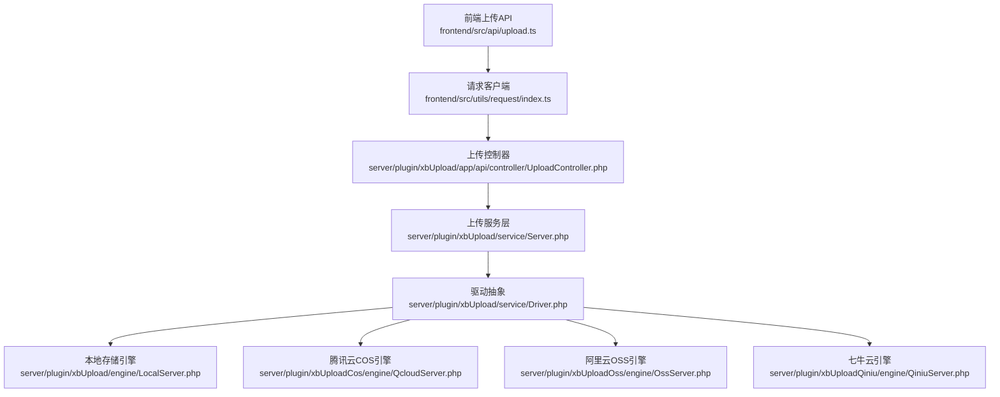
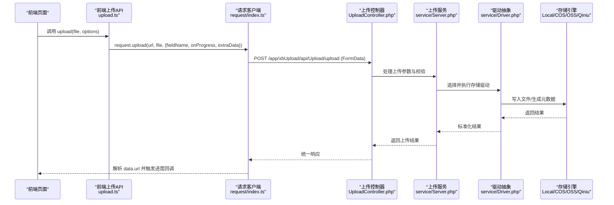
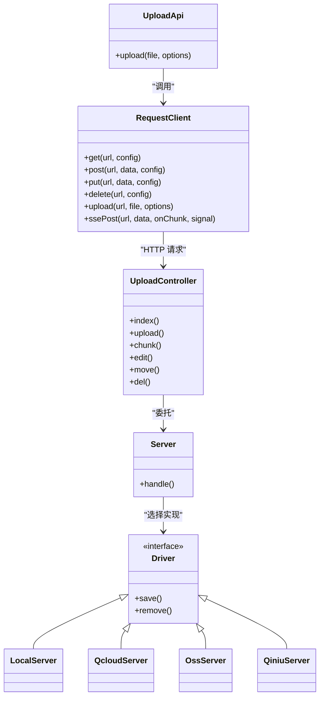

# 文件上传接口

<cite>
**本文引用的文件**   
- [frontend/src/api/upload.ts](file://frontend/src/api/upload.ts)
- [frontend/src/utils/request/index.ts](file://frontend/src/utils/request/index.ts)
- [server/plugin/xbCode/api/AppEntry.php](file://server/plugin/xbCode/api/AppEntry.php)
- [server/plugin/xbUpload/app/api/controller/UploadController.php](file://server/plugin/xbUpload/app/api/controller/UploadController.php)
- [server/plugin/xbUpload/engine/LocalServer.php](file://server/plugin/xbUpload/engine/LocalServer.php)
- [server/plugin/xbUpload/service/Driver.php](file://server/plugin/xbUpload/service/Driver.php)
- [server/plugin/xbUpload/service/Server.php](file://server/plugin/xbUpload/service/Server.php)
- [server/plugin/xbUpload/trait/UploadTrait.php](file://server/plugin/xbUpload/trait/UploadTrait.php)
- [server/plugin/xbUpload/enum/UploadExtEnum.php](file://server/plugin/xbUpload/enum/UploadExtEnum.php)
- [server/plugin/xbUploadCos/engine/QcloudServer.php](file://server/plugin/xbUploadCos/engine/QcloudServer.php)
- [server/plugin/xbUploadOss/engine/OssServer.php](file://server/plugin/xbUploadOss/engine/OssServer.php)
- [server/plugin/xbUploadQiniu/engine/QiniuServer.php](file://server/plugin/xbUploadQiniu/engine/QiniuServer.php)
</cite>

## 目录
1. [简介](#简介)
2. [项目结构](#项目结构)
3. [核心组件](#核心组件)
4. [架构总览](#架构总览)
5. [详细组件分析](#详细组件分析)
6. [依赖关系分析](#依赖关系分析)
7. [性能与容量规划](#性能与容量规划)
8. [故障排查指南](#故障排查指南)
9. [结论](#结论)
10. [附录：API 定义与示例](#附录api-定义与示例)

## 简介
本文件为资产文件上传功能的完整 API 文档，覆盖单文件上传、分片上传、断点续传、批量上传等能力；说明支持的文件类型、大小限制、存储策略、进度回调与错误处理；并给出安全校验、病毒扫描、格式转换等高级能力的集成建议与调用示例路径。

## 项目结构
前端通过统一的请求客户端发起上传请求，后端由插件化上传模块提供控制器与服务，底层对接本地或云存储引擎。

图表来源
- [frontend/src/api/upload.ts:1-24](file://frontend/src/api/upload.ts#L1-L24)
- [frontend/src/utils/request/index.ts:82-121](file://frontend/src/utils/request/index.ts#L82-L121)
- [server/plugin/xbUpload/app/api/controller/UploadController.php](file://server/plugin/xbUpload/app/api/controller/UploadController.php)
- [server/plugin/xbUpload/service/Server.php](file://server/plugin/xbUpload/service/Server.php)
- [server/plugin/xbUpload/service/Driver.php](file://server/plugin/xbUpload/service/Driver.php)
- [server/plugin/xbUpload/engine/LocalServer.php](file://server/plugin/xbUpload/engine/LocalServer.php)
- [server/plugin/xbUploadCos/engine/QcloudServer.php](file://server/plugin/xbUploadCos/engine/QcloudServer.php)
- [server/plugin/xbUploadOss/engine/OssServer.php](file://server/plugin/xbUploadOss/engine/OssServer.php)
- [server/plugin/xbUploadQiniu/engine/QiniuServer.php](file://server/plugin/xbUploadQiniu/engine/QiniuServer.php)

章节来源
- [frontend/src/api/upload.ts:1-24](file://frontend/src/api/upload.ts#L1-L24)
- [frontend/src/utils/request/index.ts:82-121](file://frontend/src/utils/request/index.ts#L82-L121)
- [server/plugin/xbCode/api/AppEntry.php:391-420](file://server/plugin/xbCode/api/AppEntry.php#L391-L420)

## 核心组件
- 前端上传封装：提供统一上传方法，支持字段名配置、额外表单字段、进度回调、取消控制。
- 请求客户端：封装 Axios，自动附加 Token、统一响应拦截、上传进度计算、超时与取消。
- 后端上传控制器：暴露上传相关路由（单文件、分片、编辑、移动、删除等）。
- 上传服务与驱动：抽象上传流程，按配置选择本地或云存储引擎。
- 扩展枚举：集中管理允许的后缀白名单。

章节来源
- [frontend/src/api/upload.ts:1-24](file://frontend/src/api/upload.ts#L1-L24)
- [frontend/src/utils/request/index.ts:10-22](file://frontend/src/utils/request/index.ts#L10-L22)
- [frontend/src/utils/request/index.ts:82-121](file://frontend/src/utils/request/index.ts#L82-L121)
- [server/plugin/xbCode/api/AppEntry.php:391-420](file://server/plugin/xbCode/api/AppEntry.php#L391-L420)
- [server/plugin/xbUpload/enum/UploadExtEnum.php](file://server/plugin/xbUpload/enum/UploadExtEnum.php)

## 架构总览
上传链路从前端到后端的调用序列如下：

图表来源
- [frontend/src/api/upload.ts:14-23](file://frontend/src/api/upload.ts#L14-L23)
- [frontend/src/utils/request/index.ts:82-121](file://frontend/src/utils/request/index.ts#L82-L121)
- [server/plugin/xbUpload/app/api/controller/UploadController.php](file://server/plugin/xbUpload/app/api/controller/UploadController.php)
- [server/plugin/xbUpload/service/Server.php](file://server/plugin/xbUpload/service/Server.php)
- [server/plugin/xbUpload/service/Driver.php](file://server/plugin/xbUpload/service/Driver.php)
- [server/plugin/xbUpload/engine/LocalServer.php](file://server/plugin/xbUpload/engine/LocalServer.php)
- [server/plugin/xbUploadCos/engine/QcloudServer.php](file://server/plugin/xbUploadCos/engine/QcloudServer.php)
- [server/plugin/xbUploadOss/engine/OssServer.php](file://server/plugin/xbUploadOss/engine/OssServer.php)
- [server/plugin/xbUploadQiniu/engine/QiniuServer.php](file://server/plugin/xbUploadQiniu/engine/QiniuServer.php)

## 详细组件分析

### 前端上传 API（单文件）
- 入口函数：upload(file, options)
- 关键选项
  - fieldName：表单字段名，默认 file
  - onProgress：进度回调，percent 范围 0~100
  - extraData：额外表单字段
  - headers：自定义请求头
  - abortController：用于中止上传
- 返回值：Promise<UploadResult>，包含 url 字段

章节来源
- [frontend/src/api/upload.ts:3-23](file://frontend/src/api/upload.ts#L3-L23)
- [frontend/src/utils/request/index.ts:10-22](file://frontend/src/utils/request/index.ts#L10-L22)
- [frontend/src/utils/request/index.ts:82-121](file://frontend/src/utils/request/index.ts#L82-L121)

### 请求客户端上传实现
- 使用 FormData 构造请求体，支持追加额外字段
- 自动附加 Token（通过全局拦截器），上传不设置超时
- 基于 Axios 的 onUploadProgress 计算百分比并回调
- 支持 AbortController 中断上传

章节来源
- [frontend/src/utils/request/index.ts:82-121](file://frontend/src/utils/request/index.ts#L82-L121)

### 后端路由与控制器
- 路由注册：系统通过应用入口聚合上传相关路由，包括 index、upload、chunk、edit、move、del 等
- 控制器：UploadController 负责接收上传请求、参数校验、调用服务层

章节来源
- [server/plugin/xbCode/api/AppEntry.php:391-420](file://server/plugin/xbCode/api/AppEntry.php#L391-L420)
- [server/plugin/xbUpload/app/api/controller/UploadController.php](file://server/plugin/xbUpload/app/api/controller/UploadController.php)

### 上传服务与驱动
- Server：编排上传流程，协调校验、转存、记录等步骤
- Driver：抽象不同存储后端（本地、COS、OSS、七牛）的统一接口
- 具体引擎：LocalServer、QcloudServer、OssServer、QiniuServer 分别实现对应存储协议

章节来源
- [server/plugin/xbUpload/service/Server.php](file://server/plugin/xbUpload/service/Server.php)
- [server/plugin/xbUpload/service/Driver.php](file://server/plugin/xbUpload/service/Driver.php)
- [server/plugin/xbUpload/engine/LocalServer.php](file://server/plugin/xbUpload/engine/LocalServer.php)
- [server/plugin/xbUploadCos/engine/QcloudServer.php](file://server/plugin/xbUploadCos/engine/QcloudServer.php)
- [server/plugin/xbUploadOss/engine/OssServer.php](file://server/plugin/xbUploadOss/engine/OssServer.php)
- [server/plugin/xbUploadQiniu/engine/QiniuServer.php](file://server/plugin/xbUploadQiniu/engine/QiniuServer.php)

### 上传通用特性与能力
- 字段名与额外字段：通过 fieldName 与 extraData 灵活传递业务上下文
- 进度回调：前端实时显示上传进度
- 取消上传：通过 AbortController 中断网络请求
- 统一响应：后端统一包装返回结构，前端提取 data 字段

章节来源
- [frontend/src/utils/request/index.ts:82-121](file://frontend/src/utils/request/index.ts#L82-L121)
- [server/plugin/xbUpload/trait/UploadTrait.php](file://server/plugin/xbUpload/trait/UploadTrait.php)

## 依赖关系分析
- 前端依赖 axios 与浏览器 FormData/Ajax 能力
- 后端依赖 Webman 框架与插件体系
- 存储引擎可插拔，通过驱动抽象解耦

图表来源
- [frontend/src/utils/request/index.ts:32-121](file://frontend/src/utils/request/index.ts#L32-L121)
- [frontend/src/api/upload.ts:14-23](file://frontend/src/api/upload.ts#L14-L23)
- [server/plugin/xbUpload/app/api/controller/UploadController.php](file://server/plugin/xbUpload/app/api/controller/UploadController.php)
- [server/plugin/xbUpload/service/Server.php](file://server/plugin/xbUpload/service/Server.php)
- [server/plugin/xbUpload/service/Driver.php](file://server/plugin/xbUpload/service/Driver.php)
- [server/plugin/xbUpload/engine/LocalServer.php](file://server/plugin/xbUpload/engine/LocalServer.php)
- [server/plugin/xbUploadCos/engine/QcloudServer.php](file://server/plugin/xbUploadCos/engine/QcloudServer.php)
- [server/plugin/xbUploadOss/engine/OssServer.php](file://server/plugin/xbUploadOss/engine/OssServer.php)
- [server/plugin/xbUploadQiniu/engine/QiniuServer.php](file://server/plugin/xbUploadQiniu/engine/QiniuServer.php)

## 性能与容量规划
- 大文件上传
  - 优先使用分片上传与断点续传，降低失败重试成本
  - 合理设置分片大小（如 5MB~20MB），平衡并发与内存占用
- 并发与限流
  - 对同一用户或 IP 进行并发上传数限制，避免资源耗尽
  - 结合队列异步处理转码、缩略图、病毒扫描等耗时任务
- 存储策略
  - 热数据就近访问（CDN/边缘节点）
  - 冷数据归档至低成本对象存储
- 监控与告警
  - 记录上传成功率、平均耗时、失败原因分布
  - 针对磁盘空间、对象存储配额设置阈值告警

[本节为通用指导，无需代码来源]

## 故障排查指南
- 常见错误
  - 未登录或 Token 过期：检查请求是否携带 Authorization 头
  - 文件大小超限：核对服务端与网关限制
  - 不支持的文件类型：参考白名单配置
  - 网络中断：启用分片与断点续传，配合重试机制
- 定位手段
  - 查看前端控制台与网络面板，确认请求体与响应体
  - 检查后端日志与存储引擎日志，定位写入失败原因
  - 复现最小用例，逐步缩小问题范围

章节来源
- [frontend/src/utils/request/index.ts:46-58](file://frontend/src/utils/request/index.ts#L46-L58)
- [server/plugin/xbUpload/enum/UploadExtEnum.php](file://server/plugin/xbUpload/enum/UploadExtEnum.php)

## 结论
本方案以“前端轻量封装 + 后端插件化控制器 + 可插拔存储驱动”的架构，实现了稳定可扩展的文件上传能力。通过分片与断点续传提升可靠性，通过驱动抽象兼容多种对象存储，便于后续接入安全扫描与格式转换等增值能力。

[本节为总结性内容，无需代码来源]

## 附录：API 定义与示例

### 单文件上传
- 接口地址：/app/xbUpload/api/Upload/upload
- 请求方式：POST
- Content-Type：multipart/form-data
- 请求体
  - file：必填，二进制文件
  - fieldName：可选，表单字段名，默认 file
  - extraData：可选，键值对，随表单提交
- 响应
  - data.url：文件访问 URL
- 前端调用示例路径
  - [frontend/src/api/upload.ts:14-23](file://frontend/src/api/upload.ts#L14-L23)
  - [frontend/src/utils/request/index.ts:82-121](file://frontend/src/utils/request/index.ts#L82-L121)

章节来源
- [frontend/src/api/upload.ts:14-23](file://frontend/src/api/upload.ts#L14-L23)
- [frontend/src/utils/request/index.ts:82-121](file://frontend/src/utils/request/index.ts#L82-L121)
- [server/plugin/xbCode/api/AppEntry.php:391-420](file://server/plugin/xbCode/api/AppEntry.php#L391-L420)

### 分片上传与断点续传
- 接口地址：/app/xbUpload/api/Upload/chunk
- 请求方式：POST
- 典型参数
  - chunkId：分片唯一标识
  - totalChunks：总分片数
  - chunkIndex：当前分片索引
  - fileHash：文件哈希（用于去重与校验）
  - fileName：原始文件名
  - fileSize：文件大小
  - chunkFile：分片二进制
- 行为
  - 首次上传时创建任务元信息
  - 逐个上传分片，服务端记录完成状态
  - 全部完成后合并分片并持久化
- 前端建议
  - 计算文件哈希（如 SHA-256）
  - 并发上传分片，失败重试
  - 断线后根据已完成分片列表继续上传
- 后端要点
  - 临时目录隔离与清理策略
  - 并发写入锁与原子合并
  - 完整性校验（分片校验+最终校验）

章节来源
- [server/plugin/xbCode/api/AppEntry.php:401-405](file://server/plugin/xbCode/api/AppEntry.php#L401-L405)
- [server/plugin/xbUpload/app/api/controller/UploadController.php](file://server/plugin/xbUpload/app/api/controller/UploadController.php)

### 批量上传
- 模式一：多次单文件上传（推荐）
  - 前端并行发起多个 /upload 请求，结合并发上限与重试
- 模式二：多文件一次上传（可选）
  - 在 formData 中追加多个同名字段或使用数组字段
  - 服务端循环处理每个文件，返回统一结果集
- 注意事项
  - 控制并发度，避免压垮服务器
  - 统一错误处理与部分成功策略

章节来源
- [frontend/src/utils/request/index.ts:82-121](file://frontend/src/utils/request/index.ts#L82-L121)
- [server/plugin/xbUpload/app/api/controller/UploadController.php](file://server/plugin/xbUpload/app/api/controller/UploadController.php)

### 文件类型与大小限制
- 支持类型
  - 通过后缀白名单控制，详见枚举文件
- 大小限制
  - 需同时考虑 PHP/Webman 上传限制与对象存储限制
  - 建议在大文件场景开启分片上传
- 配置位置
  - 白名单：UploadExtEnum
  - 其他限制：根据部署环境与服务端配置调整

章节来源
- [server/plugin/xbUpload/enum/UploadExtEnum.php](file://server/plugin/xbUpload/enum/UploadExtEnum.php)

### 存储策略
- 本地存储
  - 适用于开发或小规模部署
  - 注意磁盘空间与备份策略
- 对象存储
  - 腾讯云 COS、阿里云 OSS、七牛云等
  - 优势：高可用、弹性扩容、CDN 加速
- 切换方式
  - 通过驱动配置选择目标引擎

章节来源
- [server/plugin/xbUpload/engine/LocalServer.php](file://server/plugin/xbUpload/engine/LocalServer.php)
- [server/plugin/xbUploadCos/engine/QcloudServer.php](file://server/plugin/xbUploadCos/engine/QcloudServer.php)
- [server/plugin/xbUploadOss/engine/OssServer.php](file://server/plugin/xbUploadOss/engine/OssServer.php)
- [server/plugin/xbUploadQiniu/engine/QiniuServer.php](file://server/plugin/xbUploadQiniu/engine/QiniuServer.php)

### 进度回调与取消
- 进度回调
  - 前端基于 onUploadProgress 计算百分比并回调
- 取消上传
  - 通过 AbortController.signal 中断请求
- 适用场景
  - 长文件上传、弱网环境、用户主动取消

章节来源
- [frontend/src/utils/request/index.ts:82-121](file://frontend/src/utils/request/index.ts#L82-L121)

### 安全验证
- 鉴权
  - 请求自动附加 Token，未登录拒绝访问
- 白名单
  - 仅允许后缀在白名单内的文件
- 建议增强
  - 二次校验 MIME 与魔数
  - 限制最大尺寸与并发
  - 敏感词与恶意载荷检测

章节来源
- [frontend/src/utils/request/index.ts:46-58](file://frontend/src/utils/request/index.ts#L46-L58)
- [server/plugin/xbUpload/enum/UploadExtEnum.php](file://server/plugin/xbUpload/enum/UploadExtEnum.php)

### 病毒扫描与格式转换（高级功能）
- 病毒扫描
  - 建议在上传成功后异步触发扫描任务
  - 扫描失败或发现威胁则标记文件不可用并通知
- 格式转换
  - 图片压缩/裁剪、视频转码、音频转码等
  - 通过队列异步执行，避免阻塞上传主流程
- 集成方式
  - 在上传服务层增加事件钩子，发布转换/扫描任务
  - 消费者完成任务后更新文件元信息与状态

章节来源
- [server/plugin/xbUpload/service/Server.php](file://server/plugin/xbUpload/service/Server.php)
- [server/plugin/xbUpload/trait/UploadTrait.php](file://server/plugin/xbUpload/trait/UploadTrait.php)