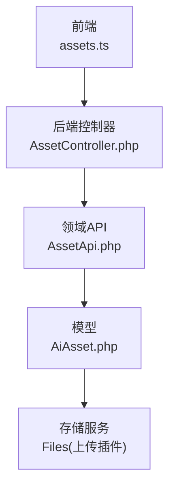
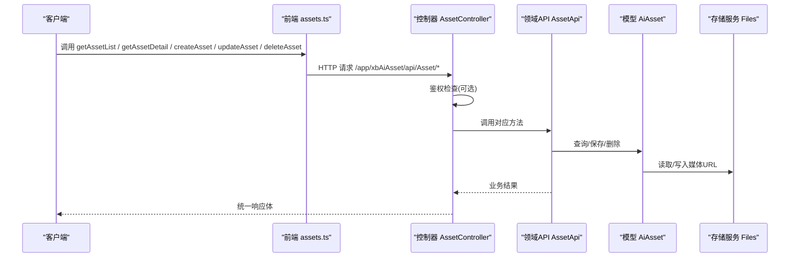
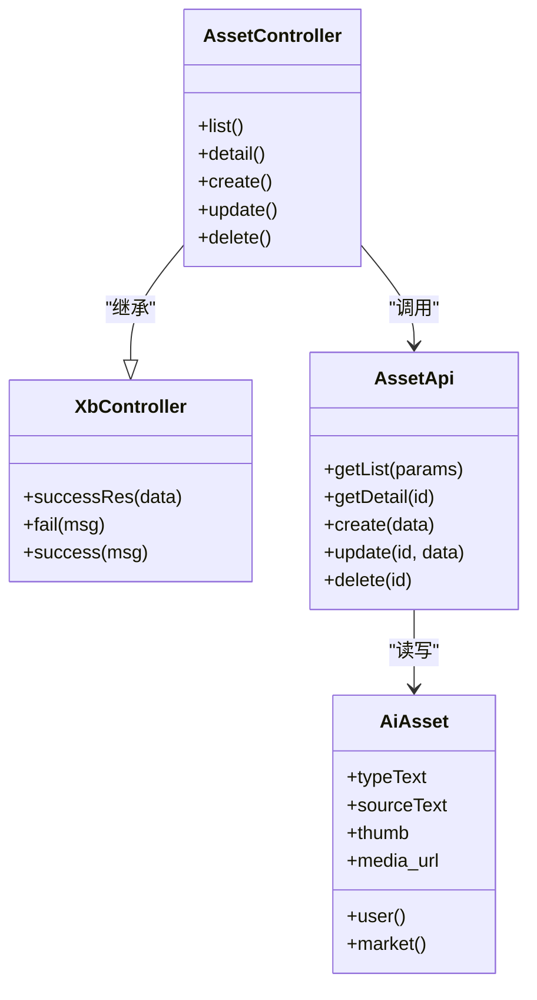

# 资产基础接口

<cite>
**本文引用的文件**   
- [frontend/src/api/assets.ts](file://frontend/src/api/assets.ts)
- [server/plugin/xbAiAsset/app/api/controller/AssetController.php](file://server/plugin/xbAiAsset/app/api/controller/AssetController.php)
- [server/plugin/xbAiAsset/api/AssetApi.php](file://server/plugin/xbAiAsset/api/AssetApi.php)
- [server/plugin/xbAiAsset/app/model/AiAsset.php](file://server/plugin/xbAiAsset/app/model/AiAsset.php)
- [server/plugin/xbCode/XbController.php](file://server/plugin/xbCode/XbController.php)
- [server/plugin/xbAiAsset/config/middleware.php](file://server/plugin/xbAiAsset/config/middleware.php)
</cite>

## 目录
1. [简介](#简介)
2. [项目结构](#项目结构)
3. [核心组件](#核心组件)
4. [架构总览](#架构总览)
5. [详细接口说明](#详细接口说明)
6. [依赖分析](#依赖分析)
7. [性能考虑](#性能考虑)
8. [故障排查指南](#故障排查指南)
9. [结论](#结论)
10. [附录](#附录)

## 简介
本文件面向资产管理的基础CRUD能力，提供前端调用与后端实现对照的完整API文档。覆盖以下方法：
- getAssetList：获取资产列表（支持分页、类型/来源/名称筛选）
- getAssetDetail：获取资产详情
- createAsset：创建资产
- updateAsset：更新资产
- deleteAsset：删除资产（软删除）

同时包含请求参数格式、响应数据结构、错误处理机制、权限验证要求、调用示例与最佳实践。

## 项目结构
资产模块采用前后端分离结构：
- 前端通过统一请求封装发起HTTP调用，定义类型与接口函数
- 后端控制器负责鉴权、入参校验、调用领域API
- 领域API负责业务编排、事件发布、标签同步等
- 模型层负责数据持久化、关联加载、字段转换与存储路径处理

图表来源
- [frontend/src/api/assets.ts:1-135](file://frontend/src/api/assets.ts#L1-L135)
- [server/plugin/xbAiAsset/app/api/controller/AssetController.php:1-131](file://server/plugin/xbAiAsset/app/api/controller/AssetController.php#L1-L131)
- [server/plugin/xbAiAsset/api/AssetApi.php:1-192](file://server/plugin/xbAiAsset/api/AssetApi.php#L1-L192)
- [server/plugin/xbAiAsset/app/model/AiAsset.php:1-127](file://server/plugin/xbAiAsset/app/model/AiAsset.php#L1-L127)

章节来源
- [frontend/src/api/assets.ts:1-135](file://frontend/src/api/assets.ts#L1-L135)
- [server/plugin/xbAiAsset/app/api/controller/AssetController.php:1-131](file://server/plugin/xbAiAsset/app/api/controller/AssetController.php#L1-L131)
- [server/plugin/xbAiAsset/api/AssetApi.php:1-192](file://server/plugin/xbAiAsset/api/AssetApi.php#L1-L192)
- [server/plugin/xbAiAsset/app/model/AiAsset.php:1-127](file://server/plugin/xbAiAsset/app/model/AiAsset.php#L1-L127)

## 核心组件
- 前端接口封装：集中定义类型、请求方法与URL，便于统一维护
- 控制器：声明无需登录的方法、接收参数、调用领域API并返回统一响应
- 领域API：实现查询、创建、更新、删除逻辑，触发事件与标签同步
- 模型：定义软删除、关联关系、字段访问器/修改器，统一媒体URL处理

章节来源
- [frontend/src/api/assets.ts:1-135](file://frontend/src/api/assets.ts#L1-L135)
- [server/plugin/xbAiAsset/app/api/controller/AssetController.php:1-131](file://server/plugin/xbAiAsset/app/api/controller/AssetController.php#L1-L131)
- [server/plugin/xbAiAsset/api/AssetApi.php:1-192](file://server/plugin/xbAiAsset/api/AssetApi.php#L1-L192)
- [server/plugin/xbAiAsset/app/model/AiAsset.php:1-127](file://server/plugin/xbAiAsset/app/model/AiAsset.php#L1-L127)

## 架构总览
从请求到响应的关键流程如下：

图表来源
- [frontend/src/api/assets.ts:98-135](file://frontend/src/api/assets.ts#L98-L135)
- [server/plugin/xbAiAsset/app/api/controller/AssetController.php:21-131](file://server/plugin/xbAiAsset/app/api/controller/AssetController.php#L21-L131)
- [server/plugin/xbAiAsset/api/AssetApi.php:46-192](file://server/plugin/xbAiAsset/api/AssetApi.php#L46-L192)
- [server/plugin/xbAiAsset/app/model/AiAsset.php:77-125](file://server/plugin/xbAiAsset/app/model/AiAsset.php#L77-L125)

## 详细接口说明

### 通用约定
- 基础路径：/app/xbAiAsset/api/Asset
- 请求方式：GET/POST/PUT/DELETE
- 认证：部分接口需登录态；未登录可访问的接口在控制器中显式声明
- 统一响应：由基类控制器提供的成功/失败包装方法返回标准JSON结构
- 媒体URL：模型层自动将本地路径转换为可访问URL，或将URL转换为本地路径存储

章节来源
- [server/plugin/xbAiAsset/app/api/controller/AssetController.php:21-31](file://server/plugin/xbAiAsset/app/api/controller/AssetController.php#L21-L31)
- [server/plugin/xbCode/XbController.php:1-110](file://server/plugin/xbCode/XbController.php#L1-L110)
- [server/plugin/xbAiAsset/app/model/AiAsset.php:77-125](file://server/plugin/xbAiAsset/app/model/AiAsset.php#L77-L125)

### 获取资产列表
- 接口地址：GET /app/xbAiAsset/api/Asset/list
- 鉴权：无需登录
- 请求参数（Query）
  - type: string，可选，资产类型枚举值
  - source: string，可选，资产来源枚举值
  - name: string，可选，模糊匹配资产名称
  - page: int，可选，页码
  - limit: int，可选，每页数量
- 响应体（分页对象）
  - total: number，总数
  - per_page: number，每页数量
  - current_page: number，当前页码
  - last_page: number，最后一页
  - data: AssetItem[]，资产项数组
- 资产项字段（AssetItem）
  - id: number，资产ID
  - name: string，资产名称
  - type: string，资产类型
  - source: string，资产来源
  - thumb?: string，封面URL
  - media_url: string，媒体文件URL
  - duration?: number，时长（秒）
  - tags?: string，标签（逗号分隔）
  - user_id?: number，用户ID
  - create_at?: string，创建时间
- 错误处理
  - 参数缺失或非法时，返回统一失败响应
- 调用示例（前端）
  - 使用 getAssetList(params) 发起请求，params 为上述查询参数对象

章节来源
- [frontend/src/api/assets.ts:32-58](file://frontend/src/api/assets.ts#L32-L58)
- [frontend/src/api/assets.ts:98-103](file://frontend/src/api/assets.ts#L98-L103)
- [server/plugin/xbAiAsset/app/api/controller/AssetController.php:32-55](file://server/plugin/xbAiAsset/app/api/controller/AssetController.php#L32-L55)
- [server/plugin/xbAiAsset/api/AssetApi.php:46-73](file://server/plugin/xbAiAsset/api/AssetApi.php#L46-L73)

### 获取资产详情
- 接口地址：GET /app/xbAiAsset/api/Asset/detail
- 鉴权：无需登录
- 请求参数（Query）
  - id: int，必填，资产ID
- 响应体：AssetItem
- 错误处理
  - 未传入id或资产不存在时，返回统一失败响应
- 调用示例（前端）
  - 使用 getAssetDetail(id) 发起请求

章节来源
- [frontend/src/api/assets.ts:105-110](file://frontend/src/api/assets.ts#L105-L110)
- [server/plugin/xbAiAsset/app/api/controller/AssetController.php:57-68](file://server/plugin/xbAiAsset/app/api/controller/AssetController.php#L57-L68)
- [server/plugin/xbAiAsset/api/AssetApi.php:80-84](file://server/plugin/xbAiAsset/api/AssetApi.php#L80-L84)

### 创建资产
- 接口地址：POST /app/xbAiAsset/api/Asset/create
- 鉴权：需要登录（未在无需登录列表中）
- 请求体（表单）
  - name: string，必填，资产名称
  - type: string，必填，资产类型
  - source: string，必填，资产来源
  - media_url: string，必填，资产文件URL
  - thumb?: string，可选，封面URL
  - duration?: number，可选，时长（秒）
  - tags?: string，可选，标签（逗号分隔）
- 响应体：成功返回统一成功响应；失败返回统一失败响应
- 错误处理
  - 必填字段为空时，返回统一失败响应
- 调用示例（前端）
  - 使用 createAsset(params) 发起请求，params 为上述字段对象

章节来源
- [frontend/src/api/assets.ts:60-76](file://frontend/src/api/assets.ts#L60-L76)
- [frontend/src/api/assets.ts:112-120](file://frontend/src/api/assets.ts#L112-L120)
- [server/plugin/xbAiAsset/app/api/controller/AssetController.php:70-93](file://server/plugin/xbAiAsset/app/api/controller/AssetController.php#L70-L93)
- [server/plugin/xbAiAsset/api/AssetApi.php:91-108](file://server/plugin/xbAiAsset/api/AssetApi.php#L91-L108)

### 更新资产
- 接口地址：PUT /app/xbAiAsset/api/Asset/update
- 鉴权：需要登录
- 请求体（表单）
  - id: int，必填，资产ID
  - name?: string，可选
  - type?: string，可选
  - thumb?: string，可选
  - media_url?: string，可选
  - duration?: number，可选
  - tags?: string，可选
- 响应体：成功返回统一成功响应；失败返回统一失败响应
- 错误处理
  - 未传入id时，返回统一失败响应
- 调用示例（前端）
  - 使用 updateAsset(params) 发起请求

章节来源
- [frontend/src/api/assets.ts:78-96](file://frontend/src/api/assets.ts#L78-L96)
- [frontend/src/api/assets.ts:122-127](file://frontend/src/api/assets.ts#L122-L127)
- [server/plugin/xbAiAsset/app/api/controller/AssetController.php:95-116](file://server/plugin/xbAiAsset/app/api/controller/AssetController.php#L95-L116)
- [server/plugin/xbAiAsset/api/AssetApi.php:116-137](file://server/plugin/xbAiAsset/api/AssetApi.php#L116-L137)

### 删除资产
- 接口地址：DELETE /app/xbAiAsset/api/Asset/delete
- 鉴权：需要登录
- 请求参数（Query）
  - id: int，必填，资产ID
- 响应体：成功返回统一成功响应；失败返回统一失败响应
- 错误处理
  - 未传入id或资产不存在时，返回统一失败响应
- 行为说明
  - 采用软删除，记录删除时间字段
- 调用示例（前端）
  - 使用 deleteAsset(id) 发起请求

章节来源
- [frontend/src/api/assets.ts:129-134](file://frontend/src/api/assets.ts#L129-L134)
- [server/plugin/xbAiAsset/app/api/controller/AssetController.php:118-129](file://server/plugin/xbAiAsset/app/api/controller/AssetController.php#L118-L129)
- [server/plugin/xbAiAsset/api/AssetApi.php:144-163](file://server/plugin/xbAiAsset/api/AssetApi.php#L144-L163)
- [server/plugin/xbAiAsset/app/model/AiAsset.php:24-28](file://server/plugin/xbAiAsset/app/model/AiAsset.php#L24-L28)

## 依赖分析
- 控制器继承自统一基类，复用统一响应与工具方法
- 中间件配置提供API鉴权能力，未登录不可访问需登录的接口
- 模型层通过访问器/修改器统一处理媒体URL与本地路径转换
- 领域API在创建/更新/删除时触发事件，并联动标签库同步

图表来源
- [server/plugin/xbCode/XbController.php:1-110](file://server/plugin/xbCode/XbController.php#L1-L110)
- [server/plugin/xbAiAsset/app/api/controller/AssetController.php:21-131](file://server/plugin/xbAiAsset/app/api/controller/AssetController.php#L21-L131)
- [server/plugin/xbAiAsset/api/AssetApi.php:21-192](file://server/plugin/xbAiAsset/api/AssetApi.php#L21-L192)
- [server/plugin/xbAiAsset/app/model/AiAsset.php:22-127](file://server/plugin/xbAiAsset/app/model/AiAsset.php#L22-L127)

章节来源
- [server/plugin/xbCode/XbController.php:1-110](file://server/plugin/xbCode/XbController.php#L1-L110)
- [server/plugin/xbAiAsset/config/middleware.php:1-16](file://server/plugin/xbAiAsset/config/middleware.php#L1-L16)
- [server/plugin/xbAiAsset/app/model/AiAsset.php:34-46](file://server/plugin/xbAiAsset/app/model/AiAsset.php#L34-L46)

## 性能考虑
- 列表查询使用分页，避免一次性返回大量数据
- 查询条件尽量精确，减少like模糊匹配范围
- 媒体URL通过模型访问器统一转换，避免重复计算
- 标签同步仅在存在tags且uid有效时执行，降低不必要开销

[本节为通用建议，不直接分析具体文件]

## 故障排查指南
- 常见错误
  - 参数缺失：如未传id、name、type、media_url等，会返回失败响应
  - 资源不存在：详情或删除时若找不到记录，返回失败响应
  - 鉴权失败：需要登录的接口未携带有效会话，将被拒绝
- 定位步骤
  - 确认请求路径与方法是否正确
  - 核对必填字段是否齐全
  - 查看统一响应体中的错误信息
  - 检查登录态是否有效
- 日志与事件
  - 创建/更新/删除操作会触发事件，可用于追踪问题链路

章节来源
- [server/plugin/xbAiAsset/app/api/controller/AssetController.php:61-68](file://server/plugin/xbAiAsset/app/api/controller/AssetController.php#L61-L68)
- [server/plugin/xbAiAsset/app/api/controller/AssetController.php:82-93](file://server/plugin/xbAiAsset/app/api/controller/AssetController.php#L82-L93)
- [server/plugin/xbAiAsset/app/api/controller/AssetController.php:107-116](file://server/plugin/xbAiAsset/app/api/controller/AssetController.php#L107-L116)
- [server/plugin/xbAiAsset/app/api/controller/AssetController.php:123-129](file://server/plugin/xbAiAsset/app/api/controller/AssetController.php#L123-L129)
- [server/plugin/xbAiAsset/api/AssetApi.php:91-108](file://server/plugin/xbAiAsset/api/AssetApi.php#L91-L108)
- [server/plugin/xbAiAsset/api/AssetApi.php:116-137](file://server/plugin/xbAiAsset/api/AssetApi.php#L116-L137)
- [server/plugin/xbAiAsset/api/AssetApi.php:144-163](file://server/plugin/xbAiAsset/api/AssetApi.php#L144-L163)

## 结论
资产基础CRUD接口已在前端与后端形成清晰契约：前端以类型安全的方式封装调用，后端通过控制器校验与领域API编排完成业务逻辑，模型层统一处理媒体URL与软删除。遵循本文档的参数规范与错误处理约定，可快速集成并稳定运行。

[本节为总结性内容，不直接分析具体文件]

## 附录

### 权限与鉴权
- 无需登录：list、detail
- 需要登录：create、update、delete
- 鉴权中间件由插件配置注入，确保受保护接口仅对已登录用户开放

章节来源
- [server/plugin/xbAiAsset/app/api/controller/AssetController.php:27-30](file://server/plugin/xbAiAsset/app/api/controller/AssetController.php#L27-L30)
- [server/plugin/xbAiAsset/config/middleware.php:10-14](file://server/plugin/xbAiAsset/config/middleware.php#L10-L14)

### 媒体URL处理
- 读取时：模型访问器将本地路径转换为可访问URL
- 写入时：模型修改器将URL转换为本地路径存储
- 该机制保证对外暴露的是可直接访问的URL，内部存储为相对路径

章节来源
- [server/plugin/xbAiAsset/app/model/AiAsset.php:77-97](file://server/plugin/xbAiAsset/app/model/AiAsset.php#L77-L97)
- [server/plugin/xbAiAsset/app/model/AiAsset.php:105-125](file://server/plugin/xbAiAsset/app/model/AiAsset.php#L105-L125)

### 事件与标签同步
- 创建/更新/删除均触发相应事件，便于扩展监听
- 当存在tags且uid有效时，自动同步至用户标签库与热门标签库

章节来源
- [server/plugin/xbAiAsset/api/AssetApi.php:91-108](file://server/plugin/xbAiAsset/api/AssetApi.php#L91-L108)
- [server/plugin/xbAiAsset/api/AssetApi.php:116-137](file://server/plugin/xbAiAsset/api/AssetApi.php#L116-L137)
- [server/plugin/xbAiAsset/api/AssetApi.php:144-163](file://server/plugin/xbAiAsset/api/AssetApi.php#L144-L163)
- [server/plugin/xbAiAsset/api/AssetApi.php:171-190](file://server/plugin/xbAiAsset/api/AssetApi.php#L171-L190)