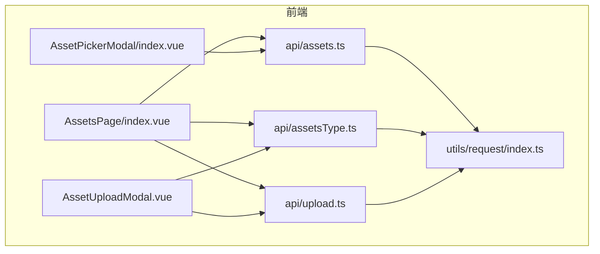
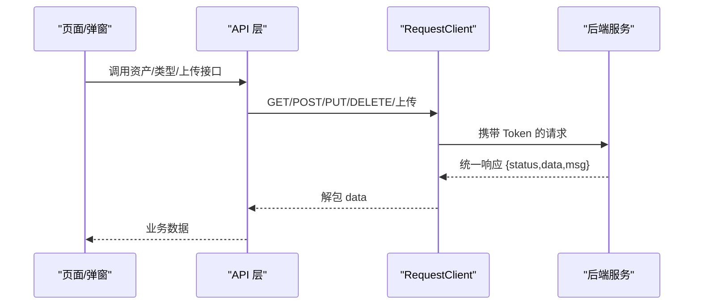
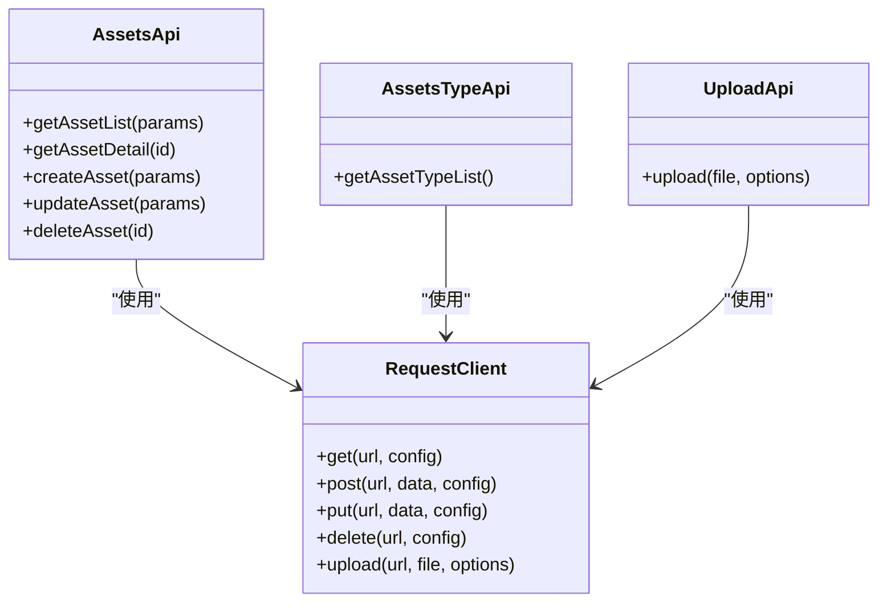
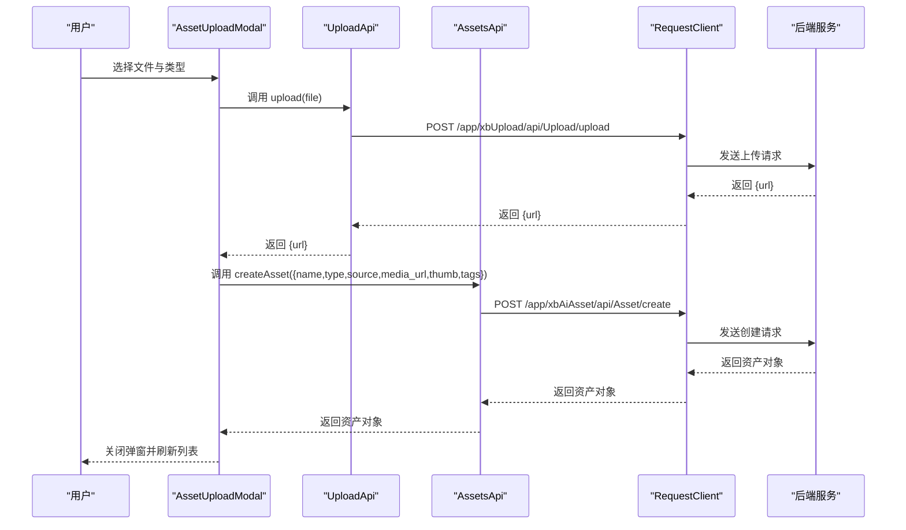

# 资产管理接口

<cite>
**本文引用的文件**
- [frontend/src/api/assets.ts](file://frontend/src/api/assets.ts)
- [frontend/src/api/assetsType.ts](file://frontend/src/api/assetsType.ts)
- [frontend/src/api/upload.ts](file://frontend/src/api/upload.ts)
- [frontend/src/utils/request/index.ts](file://frontend/src/utils/request/index.ts)
- [frontend/src/views/AssetsPage/index.vue](file://frontend/src/views/AssetsPage/index.vue)
- [frontend/src/components/AssetPickerModal/index.vue](file://frontend/src/components/AssetPickerModal/index.vue)
- [frontend/src/views/AssetsPage/components/AssetUploadModal.vue](file://frontend/src/views/AssetsPage/components/AssetUploadModal.vue)
</cite>

## 目录
1. [简介](#简介)
2. [项目结构](#项目结构)
3. [核心组件](#核心组件)
4. [架构总览](#架构总览)
5. [详细组件分析](#详细组件分析)
6. [依赖关系分析](#依赖关系分析)
7. [性能考虑](#性能考虑)
8. [故障排查指南](#故障排查指南)
9. [结论](#结论)
10. [附录](#附录)

## 简介
本文件为“资产管理模块”的完整 API 接口文档，覆盖素材上传、下载、删除、分类管理、标签系统、搜索过滤、版本控制（以更新字段体现）、批量操作、权限控制、元数据管理、预览生成等能力。文档基于前端调用侧实现进行梳理，明确各接口的请求路径、参数与返回结构，并给出典型调用流程与最佳实践建议。

## 项目结构
资产管理相关的前端代码主要分布在以下位置：
- API 定义层：assets.ts、assetsType.ts、upload.ts
- 网络请求封装：utils/request/index.ts
- 页面与交互：views/AssetsPage/index.vue、components/AssetPickerModal/index.vue、views/AssetsPage/components/AssetUploadModal.vue

图表来源
- [frontend/src/views/AssetsPage/index.vue:1-473](file://frontend/src/views/AssetsPage/index.vue#L1-L473)
- [frontend/src/components/AssetPickerModal/index.vue:1-227](file://frontend/src/components/AssetPickerModal/index.vue#L1-L227)
- [frontend/src/views/AssetsPage/components/AssetUploadModal.vue:1-273](file://frontend/src/views/AssetsPage/components/AssetUploadModal.vue#L1-L273)
- [frontend/src/api/assets.ts:1-135](file://frontend/src/api/assets.ts#L1-L135)
- [frontend/src/api/assetsType.ts:1-27](file://frontend/src/api/assetsType.ts#L1-L27)
- [frontend/src/api/upload.ts:1-24](file://frontend/src/api/upload.ts#L1-L24)
- [frontend/src/utils/request/index.ts:1-237](file://frontend/src/utils/request/index.ts#L1-L237)

章节来源
- [frontend/src/views/AssetsPage/index.vue:1-473](file://frontend/src/views/AssetsPage/index.vue#L1-L473)
- [frontend/src/components/AssetPickerModal/index.vue:1-227](file://frontend/src/components/AssetPickerModal/index.vue#L1-L227)
- [frontend/src/views/AssetsPage/components/AssetUploadModal.vue:1-273](file://frontend/src/views/AssetsPage/components/AssetUploadModal.vue#L1-L273)
- [frontend/src/api/assets.ts:1-135](file://frontend/src/api/assets.ts#L1-L135)
- [frontend/src/api/assetsType.ts:1-27](file://frontend/src/api/assetsType.ts#L1-L27)
- [frontend/src/api/upload.ts:1-24](file://frontend/src/api/upload.ts#L1-L24)
- [frontend/src/utils/request/index.ts:1-237](file://frontend/src/utils/request/index.ts#L1-L237)

## 核心组件
- 资产列表与详情
  - 获取资产列表：GET /app/xbAiAsset/api/Asset/list
  - 获取资产详情：GET /app/xbAiAsset/api/Asset/detail
- 资产创建与更新
  - 创建资产：POST /app/xbAiAsset/api/Asset/create
  - 更新资产：PUT /app/xbAiAsset/api/Asset/update
- 资产删除
  - 删除资产：DELETE /app/xbAiAsset/api/Asset/delete
- 资产类型管理
  - 获取资产类型列表：GET /app/xbAiAsset/api/AssetType/list
- 文件上传
  - 上传文件：POST /app/xbUpload/api/Upload/upload（表单字段名 file）
- 通用请求封装
  - 统一封装 GET/POST/PUT/DELETE/上传/SSE 流式请求，自动附加 Token、统一错误处理

章节来源
- [frontend/src/api/assets.ts:98-135](file://frontend/src/api/assets.ts#L98-L135)
- [frontend/src/api/assetsType.ts:21-27](file://frontend/src/api/assetsType.ts#L21-L27)
- [frontend/src/api/upload.ts:9-24](file://frontend/src/api/upload.ts#L9-L24)
- [frontend/src/utils/request/index.ts:32-121](file://frontend/src/utils/request/index.ts#L32-L121)

## 架构总览
资产管理模块采用“前端 API 层 + 通用请求封装 + 业务页面/弹窗”的分层结构。页面通过 API 层发起 HTTP 请求，由 RequestClient 统一处理鉴权、拦截器与错误；上传使用 FormData 并支持进度回调；类型配置通过独立接口动态加载。

图表来源
- [frontend/src/utils/request/index.ts:32-121](file://frontend/src/utils/request/index.ts#L32-L121)
- [frontend/src/api/assets.ts:98-135](file://frontend/src/api/assets.ts#L98-L135)
- [frontend/src/api/assetsType.ts:21-27](file://frontend/src/api/assetsType.ts#L21-L27)
- [frontend/src/api/upload.ts:9-24](file://frontend/src/api/upload.ts#L9-L24)

## 详细组件分析

### 资产列表与分页
- 接口
  - 获取资产列表：GET /app/xbAiAsset/api/Asset/list
  - 获取资产详情：GET /app/xbAiAsset/api/Asset/detail
- 查询参数
  - type：资产类型编码（如 10/20/30/40/50/60）
  - source：资产来源（如 10-AI生成，20-自主上传，30-市场购买）
  - name：名称模糊搜索
  - page：页码
  - limit：每页数量
- 返回结构
  - total：总数
  - per_page：每页数量
  - current_page：当前页码
  - last_page：最后一页
  - data：资产项数组
- 资产项字段
  - id、name、type、source、thumb、media_url、duration、tags、user_id、create_at
- 说明
  - 前端对 type 做了前后端映射（例如 10→background，20→character 等），在页面中用于筛选展示
  - tags 在前端以逗号分隔字符串存储，读取时按逗号拆分

章节来源
- [frontend/src/api/assets.ts:8-58](file://frontend/src/api/assets.ts#L8-L58)
- [frontend/src/api/assets.ts:98-110](file://frontend/src/api/assets.ts#L98-L110)
- [frontend/src/views/AssetsPage/index.vue:30-64](file://frontend/src/views/AssetsPage/index.vue#L30-L64)

### 资产创建与更新
- 创建资产
  - POST /app/xbAiAsset/api/Asset/create
  - 必填：name、type、source、media_url
  - 可选：thumb、duration、tags
- 更新资产
  - PUT /app/xbAiAsset/api/Asset/update
  - 必填：id
  - 可选：name、type、source、thumb、media_url、duration、tags
- 行为
  - 更新可用于重命名、修改封面、时长、标签等元数据
  - 通过 media_url 可替换媒体地址，实现“版本化”效果（保留历史 URL）

章节来源
- [frontend/src/api/assets.ts:60-96](file://frontend/src/api/assets.ts#L60-L96)
- [frontend/src/api/assets.ts:118-127](file://frontend/src/api/assets.ts#L118-L127)
- [frontend/src/views/AssetsPage/index.vue:300-315](file://frontend/src/views/AssetsPage/index.vue#L300-L315)

### 资产删除
- 接口
  - DELETE /app/xbAiAsset/api/Asset/delete
  - 参数：id
- 批量删除
  - 前端通过 Promise.allSettled 并发调用多次删除接口，避免单点失败阻塞整体流程

章节来源
- [frontend/src/api/assets.ts:132-134](file://frontend/src/api/assets.ts#L132-L134)
- [frontend/src/views/AssetsPage/index.vue:199-211](file://frontend/src/views/AssetsPage/index.vue#L199-L211)

### 资产类型管理
- 接口
  - GET /app/xbAiAsset/api/AssetType/list
- 返回
  - 类型项数组，包含 label、value、type、color、desc、icon、ext 等
- 用途
  - 动态渲染上传弹窗的类型选择、文件 accept 限制、提示文案
  - 构建左侧分类筛选菜单

章节来源
- [frontend/src/api/assetsType.ts:1-27](file://frontend/src/api/assetsType.ts#L1-L27)
- [frontend/src/views/AssetsPage/components/AssetUploadModal.vue:36-52](file://frontend/src/views/AssetsPage/components/AssetUploadModal.vue#L36-L52)
- [frontend/src/views/AssetsPage/index.vue:126-145](file://frontend/src/views/AssetsPage/index.vue#L126-L145)

### 文件上传
- 接口
  - POST /app/xbUpload/api/Upload/upload
  - 表单字段名：file
- 返回
  - url：文件访问地址
- 特性
  - 支持上传进度回调
  - 支持额外表单字段扩展（extraData）
  - 支持取消控制器（AbortController）
- 典型流程
  - 先调用上传接口获得 url
  - 再调用创建资产接口，将 media_url 与 thumb 指向该 url，完成资产入库

章节来源
- [frontend/src/api/upload.ts:9-24](file://frontend/src/api/upload.ts#L9-L24)
- [frontend/src/views/AssetsPage/components/AssetUploadModal.vue:122-162](file://frontend/src/views/AssetsPage/components/AssetUploadModal.vue#L122-L162)
- [frontend/src/utils/request/index.ts:82-121](file://frontend/src/utils/request/index.ts#L82-L121)

### 搜索与过滤
- 服务端过滤
  - 通过 list 接口的 name、type、source、page、limit 实现分页与基础过滤
- 客户端增强
  - 子类型过滤（voice/sound_effect/video 的子类）
  - 标签关键词匹配（名称或标签中包含关键词）
- 组合策略
  - 先服务端分页拉取，再客户端二次过滤，提升交互体验

章节来源
- [frontend/src/views/AssetsPage/index.vue:155-169](file://frontend/src/views/AssetsPage/index.vue#L155-L169)
- [frontend/src/components/AssetPickerModal/index.vue:65-87](file://frontend/src/components/AssetPickerModal/index.vue#L65-L87)

### 预览与播放
- 图片预览：打开预览弹窗，显示缩略图或原图
- 音频/视频播放：根据资产类型打开对应播放器弹窗
- 数据来源：asset.thumb 或 asset.media_url

章节来源
- [frontend/src/views/AssetsPage/index.vue:225-285](file://frontend/src/views/AssetsPage/index.vue#L225-L285)

### 版本控制与元数据管理
- 版本控制
  - 通过 update 接口更新 media_url 实现“新版本”覆盖，同时保留历史记录
- 元数据
  - 名称、类型、来源、封面、时长、标签、创建时间等均可维护
- 生命周期
  - 上传 → 创建资产 → 预览/播放 → 编辑元数据 → 更新版本 → 删除

章节来源
- [frontend/src/api/assets.ts:60-96](file://frontend/src/api/assets.ts#L60-L96)
- [frontend/src/views/AssetsPage/index.vue:300-315](file://frontend/src/views/AssetsPage/index.vue#L300-L315)

### 权限控制
- 鉴权机制
  - RequestClient 自动从本地存储读取 Token 并注入 Authorization 头
  - 非白名单接口若无 Token 则拒绝请求
- 白名单
  - 通过配置判断是否跳过鉴权

章节来源
- [frontend/src/utils/request/index.ts:46-58](file://frontend/src/utils/request/index.ts#L46-L58)
- [frontend/src/utils/request/index.ts:141-144](file://frontend/src/utils/request/index.ts#L141-L144)

### 批量操作
- 批量删除
  - 并发调用删除接口，任一失败不影响其他删除结果
- 批量选择
  - 资产选择弹窗支持多选与最大选择数限制，跨页保存选中状态

章节来源
- [frontend/src/views/AssetsPage/index.vue:199-211](file://frontend/src/views/AssetsPage/index.vue#L199-L211)
- [frontend/src/components/AssetPickerModal/index.vue:100-134](file://frontend/src/components/AssetPickerModal/index.vue#L100-L134)

### 标签系统
- 存储格式
  - 服务端以逗号分隔字符串存储
  - 前端读取时拆分为数组，便于展示与搜索
- 上传阶段
  - 用户可多选标签，提交时拼接为逗号分隔字符串

章节来源
- [frontend/src/api/assets.ts:24-26](file://frontend/src/api/assets.ts#L24-L26)
- [frontend/src/views/AssetsPage/components/AssetUploadModal.vue:142-150](file://frontend/src/views/AssetsPage/components/AssetUploadModal.vue#L142-L150)

### 文件类型支持与大小限制
- 类型支持
  - 通过 AssetTypeItem.ext 动态决定上传 accept 与提示文案
  - 若未提供 ext，则根据 type(image/audio/video) 推断
- 大小限制
  - 前端未显式校验大小，建议在服务端或网关层实施限制

章节来源
- [frontend/src/views/AssetsPage/components/AssetUploadModal.vue:59-85](file://frontend/src/views/AssetsPage/components/AssetUploadModal.vue#L59-L85)

### 数据同步机制
- 实时性
  - 上传完成后触发刷新列表，保证最新数据可见
- 一致性
  - 删除后刷新列表，确保前端状态与服务端一致

章节来源
- [frontend/src/views/AssetsPage/index.vue:243-247](file://frontend/src/views/AssetsPage/index.vue#L243-L247)
- [frontend/src/views/AssetsPage/index.vue:215-223](file://frontend/src/views/AssetsPage/index.vue#L215-L223)

## 依赖关系分析

图表来源
- [frontend/src/api/assets.ts:98-135](file://frontend/src/api/assets.ts#L98-L135)
- [frontend/src/api/assetsType.ts:21-27](file://frontend/src/api/assetsType.ts#L21-L27)
- [frontend/src/api/upload.ts:9-24](file://frontend/src/api/upload.ts#L9-L24)
- [frontend/src/utils/request/index.ts:32-121](file://frontend/src/utils/request/index.ts#L32-L121)

章节来源
- [frontend/src/api/assets.ts:98-135](file://frontend/src/api/assets.ts#L98-L135)
- [frontend/src/api/assetsType.ts:21-27](file://frontend/src/api/assetsType.ts#L21-L27)
- [frontend/src/api/upload.ts:9-24](file://frontend/src/api/upload.ts#L9-L24)
- [frontend/src/utils/request/index.ts:32-121](file://frontend/src/utils/request/index.ts#L32-L121)

## 性能考虑
- 分页加载：列表接口支持 page/limit，避免一次性加载大量数据
- 防抖搜索：选择器内对搜索输入做防抖，减少频繁请求
- 并发删除：批量删除使用 allSettled，提高整体吞吐
- 上传进度：上传过程提供进度回调，改善用户体验
- 懒加载与缓存：可在后续引入按需加载与缓存策略，进一步降低首屏压力

[本节为通用指导，不直接分析具体文件]

## 故障排查指南
- 无 Token 导致请求被拒
  - 检查本地 token 是否存在，确认登录态
- 上传失败
  - 检查文件类型是否符合 accept 与 ext 限制
  - 查看上传进度回调与错误信息
- 列表为空或异常
  - 检查分页参数是否正确
  - 检查服务端返回结构与前端解析逻辑
- 删除后未刷新
  - 确认删除成功后是否触发列表刷新

章节来源
- [frontend/src/utils/request/index.ts:141-144](file://frontend/src/utils/request/index.ts#L141-L144)
- [frontend/src/views/AssetsPage/components/AssetUploadModal.vue:156-161](file://frontend/src/views/AssetsPage/components/AssetUploadModal.vue#L156-L161)
- [frontend/src/views/AssetsPage/index.vue:97-104](file://frontend/src/views/AssetsPage/index.vue#L97-L104)

## 结论
资产管理模块通过清晰的 API 分层与统一的请求封装，实现了完整的素材上传、下载、删除、分类管理、标签系统、搜索过滤、版本控制与批量操作能力。结合动态类型配置与上传进度反馈，具备良好的可扩展性与用户体验。建议在生产环境完善文件大小限制、服务端校验与缓存策略，进一步提升稳定性与性能。

[本节为总结性内容，不直接分析具体文件]

## 附录

### 接口清单与调用示例

- 获取资产类型列表
  - 方法：GET
  - 路径：/app/xbAiAsset/api/AssetType/list
  - 返回：类型项数组（label/value/type/color/desc/icon/ext）
  - 示例：见 assetsType.ts 中的 getAssetTypeList 调用

章节来源
- [frontend/src/api/assetsType.ts:21-27](file://frontend/src/api/assetsType.ts#L21-L27)

- 获取资产列表
  - 方法：GET
  - 路径：/app/xbAiAsset/api/Asset/list
  - 参数：type/source/name/page/limit
  - 返回：total/per_page/current_page/last_page/data[]
  - 示例：见 assets.ts 中的 getAssetList 调用

章节来源
- [frontend/src/api/assets.ts:98-103](file://frontend/src/api/assets.ts#L98-L103)

- 获取资产详情
  - 方法：GET
  - 路径：/app/xbAiAsset/api/Asset/detail
  - 参数：id
  - 返回：资产对象
  - 示例：见 assets.ts 中的 getAssetDetail 调用

章节来源
- [frontend/src/api/assets.ts:108-110](file://frontend/src/api/assets.ts#L108-L110)

- 创建资产
  - 方法：POST
  - 路径：/app/xbAiAsset/api/Asset/create
  - 参数：name/type/source/media_url/thumb/duration/tags
  - 返回：资产对象
  - 示例：见 assets.ts 中的 createAsset 调用

章节来源
- [frontend/src/api/assets.ts:118-120](file://frontend/src/api/assets.ts#L118-L120)

- 更新资产
  - 方法：PUT
  - 路径：/app/xbAiAsset/api/Asset/update
  - 参数：id(必填)/name/type/source/thumb/media_url/duration/tags(可选)
  - 返回：资产对象
  - 示例：见 assets.ts 中的 updateAsset 调用

章节来源
- [frontend/src/api/assets.ts:125-127](file://frontend/src/api/assets.ts#L125-L127)

- 删除资产
  - 方法：DELETE
  - 路径：/app/xbAiAsset/api/Asset/delete
  - 参数：id
  - 返回：未知（由后端定义）
  - 示例：见 assets.ts 中的 deleteAsset 调用

章节来源
- [frontend/src/api/assets.ts:132-134](file://frontend/src/api/assets.ts#L132-L134)

- 上传文件
  - 方法：POST
  - 路径：/app/xbUpload/api/Upload/upload
  - 表单字段：file
  - 返回：{url}
  - 示例：见 upload.ts 中的 upload 调用

章节来源
- [frontend/src/api/upload.ts:15-23](file://frontend/src/api/upload.ts#L15-L23)

### 典型调用序列（上传并创建资产）

图表来源
- [frontend/src/views/AssetsPage/components/AssetUploadModal.vue:122-162](file://frontend/src/views/AssetsPage/components/AssetUploadModal.vue#L122-L162)
- [frontend/src/api/upload.ts:15-23](file://frontend/src/api/upload.ts#L15-L23)
- [frontend/src/api/assets.ts:118-120](file://frontend/src/api/assets.ts#L118-L120)
- [frontend/src/utils/request/index.ts:82-121](file://frontend/src/utils/request/index.ts#L82-L121)

### 最佳实践
- 上传前校验
  - 依据 AssetTypeItem.ext 与 type 设置 accept 与提示文案
  - 在服务端增加文件大小与类型强校验
- 版本管理
  - 通过 update 接口替换 media_url，保留历史版本
- 标签规范
  - 约定标签词表，避免同义重复
- 批量操作
  - 使用 allSettled 处理并发删除，避免单点失败影响整体
- 权限与安全
  - 确保 Token 有效，敏感接口加入白名单策略需谨慎
- 性能优化
  - 合理使用分页与防抖，必要时引入缓存与 CDN

[本节为通用指导，不直接分析具体文件]