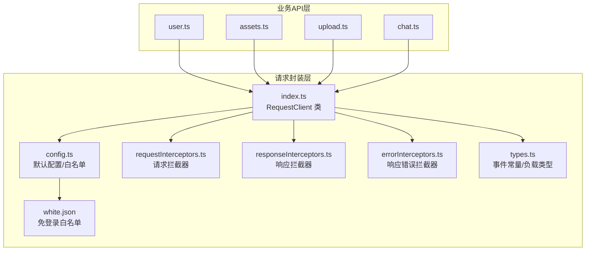
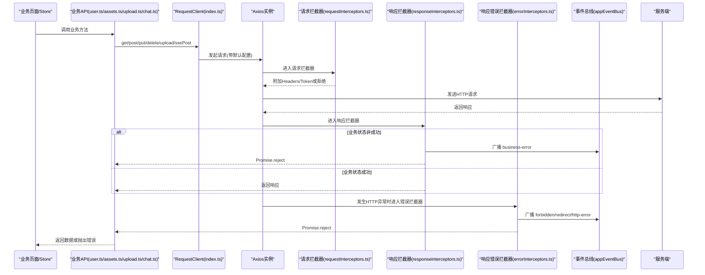
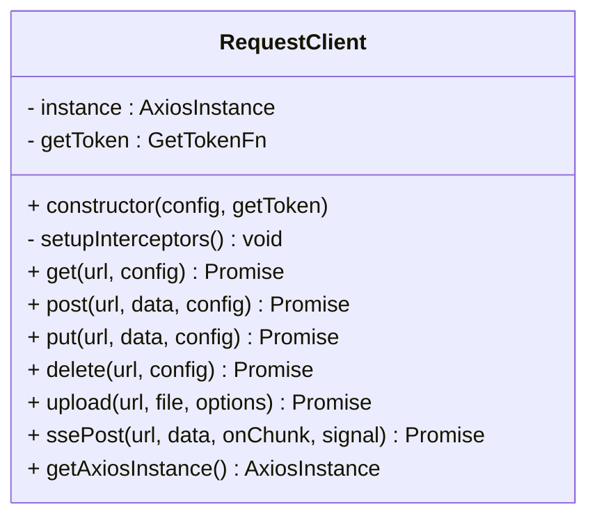
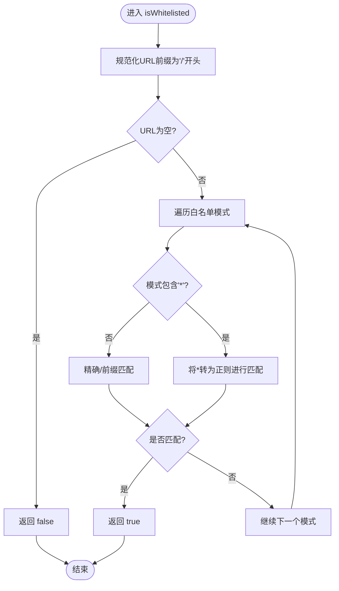
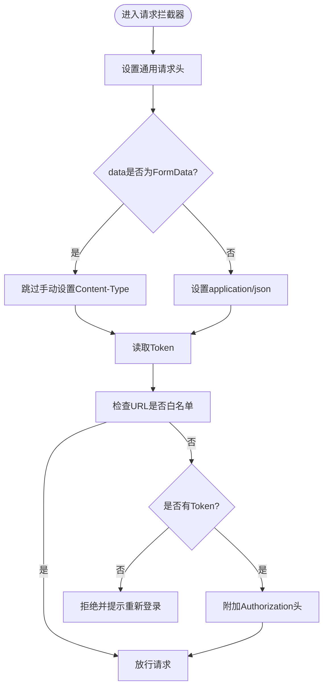
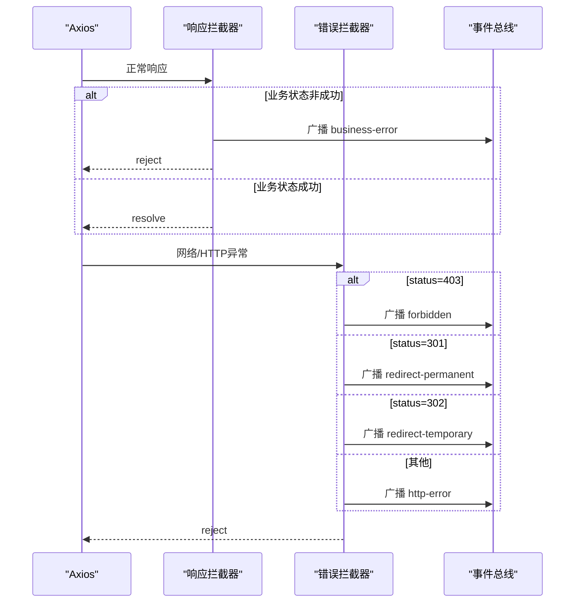
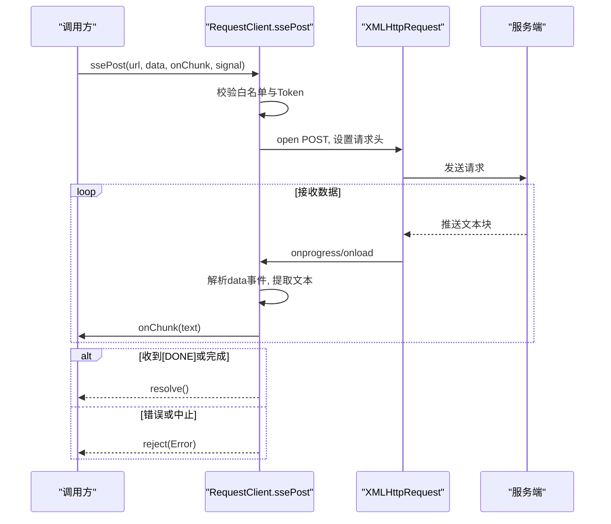
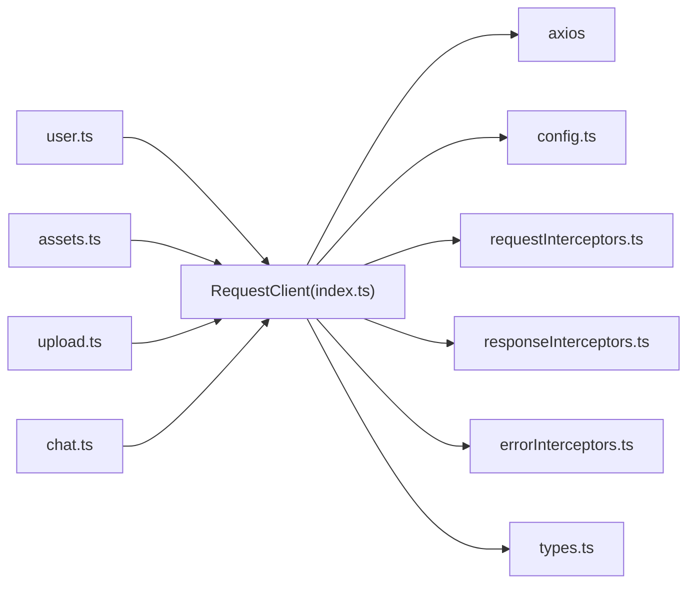

# API客户端封装

<cite>
**本文引用的文件**   
- [index.ts](file://frontend/src/utils/request/index.ts)
- [config.ts](file://frontend/src/utils/request/config.ts)
- [types.ts](file://frontend/src/utils/request/types.ts)
- [requestInterceptors.ts](file://frontend/src/utils/request/requestInterceptors.ts)
- [responseInterceptors.ts](file://frontend/src/utils/request/responseInterceptors.ts)
- [errorInterceptors.ts](file://frontend/src/utils/request/errorInterceptors.ts)
- [white.json](file://frontend/src/utils/request/white.json)
- [user.ts](file://frontend/src/api/user.ts)
- [assets.ts](file://frontend/src/api/assets.ts)
- [upload.ts](file://frontend/src/api/upload.ts)
- [chat.ts](file://frontend/src/api/chat.ts)
</cite>

## 目录
1. [简介](#简介)
2. [项目结构](#项目结构)
3. [核心组件](#核心组件)
4. [架构总览](#架构总览)
5. [详细组件分析](#详细组件分析)
6. [依赖关系分析](#依赖关系分析)
7. [性能与优化](#性能与优化)
8. [调试与排错指南](#调试与排错指南)
9. [结论](#结论)
10. [附录：业务API接口清单](#附录业务api接口清单)

## 简介
本文件面向前端工程中的HTTP请求封装层，系统性梳理并文档化以下能力：
- HTTP请求封装与统一配置
- 拦截器机制（请求头注入、Token管理、白名单校验）
- 错误处理与事件广播
- 上传与SSE流式请求
- Token管理与鉴权策略
- 各业务模块API定义与调用方式
- 最佳实践、性能优化与常见问题排查

该封装基于Axios构建，提供类型安全的通用方法、统一的响应解包、可插拔的拦截器以及跨模块的事件通知机制。

## 项目结构
请求封装位于 utils/request 目录，按职责拆分为配置、类型、拦截器与主客户端；业务API位于 api 目录，每个文件对应一个业务域。

图表来源
- [index.ts:32-233](file://frontend/src/utils/request/index.ts#L32-L233)
- [config.ts:1-39](file://frontend/src/utils/request/config.ts#L1-L39)
- [requestInterceptors.ts:1-47](file://frontend/src/utils/request/requestInterceptors.ts#L1-L47)
- [responseInterceptors.ts:1-24](file://frontend/src/utils/request/responseInterceptors.ts#L1-L24)
- [errorInterceptors.ts:1-57](file://frontend/src/utils/request/errorInterceptors.ts#L1-L57)
- [white.json:1-28](file://frontend/src/utils/request/white.json#L1-L28)
- [user.ts:1-226](file://frontend/src/api/user.ts#L1-L226)
- [assets.ts:1-135](file://frontend/src/api/assets.ts#L1-L135)
- [upload.ts:1-24](file://frontend/src/api/upload.ts#L1-L24)
- [chat.ts:1-60](file://frontend/src/api/chat.ts#L1-L60)

章节来源
- [index.ts:1-237](file://frontend/src/utils/request/index.ts#L1-L237)
- [config.ts:1-39](file://frontend/src/utils/request/config.ts#L1-L39)
- [types.ts:1-40](file://frontend/src/utils/request/types.ts#L1-L40)
- [requestInterceptors.ts:1-47](file://frontend/src/utils/request/requestInterceptors.ts#L1-L47)
- [responseInterceptors.ts:1-24](file://frontend/src/utils/request/responseInterceptors.ts#L1-L24)
- [errorInterceptors.ts:1-57](file://frontend/src/utils/request/errorInterceptors.ts#L1-L57)
- [white.json:1-28](file://frontend/src/utils/request/white.json#L1-L28)
- [user.ts:1-226](file://frontend/src/api/user.ts#L1-L226)
- [assets.ts:1-135](file://frontend/src/api/assets.ts#L1-L135)
- [upload.ts:1-24](file://frontend/src/api/upload.ts#L1-L24)
- [chat.ts:1-60](file://frontend/src/api/chat.ts#L1-L60)

## 核心组件
- RequestClient：封装Axios实例，提供get/post/put/delete、文件上传、SSE流式POST等能力，内置拦截器链。
- 默认配置：baseURL、超时时间、白名单加载与匹配。
- 拦截器：
  - 请求拦截器：设置通用请求头、根据白名单决定是否携带Token。
  - 响应拦截器：统一业务状态码判断，失败时广播事件并拒绝Promise。
  - 响应错误拦截器：按HTTP状态码分类广播事件（403/301/302/其他）。
- 事件系统：通过应用事件总线广播请求相关事件，供全局监听处理。
- 类型定义：统一的响应结构、上传选项、事件负载类型。

章节来源
- [index.ts:32-233](file://frontend/src/utils/request/index.ts#L32-L233)
- [config.ts:1-39](file://frontend/src/utils/request/config.ts#L1-L39)
- [types.ts:1-40](file://frontend/src/utils/request/types.ts#L1-L40)
- [requestInterceptors.ts:1-47](file://frontend/src/utils/request/requestInterceptors.ts#L1-L47)
- [responseInterceptors.ts:1-24](file://frontend/src/utils/request/responseInterceptors.ts#L1-L24)
- [errorInterceptors.ts:1-57](file://frontend/src/utils/request/errorInterceptors.ts#L1-L57)

## 架构总览
下图展示了从业务API到网络层的完整调用链路，包括拦截器链、事件广播与特殊能力（上传、SSE）。

图表来源
- [index.ts:32-233](file://frontend/src/utils/request/index.ts#L32-L233)
- [requestInterceptors.ts:1-47](file://frontend/src/utils/request/requestInterceptors.ts#L1-L47)
- [responseInterceptors.ts:1-24](file://frontend/src/utils/request/responseInterceptors.ts#L1-L24)
- [errorInterceptors.ts:1-57](file://frontend/src/utils/request/errorInterceptors.ts#L1-L57)
- [user.ts:1-226](file://frontend/src/api/user.ts#L1-L226)
- [assets.ts:1-135](file://frontend/src/api/assets.ts#L1-L135)
- [upload.ts:1-24](file://frontend/src/api/upload.ts#L1-L24)
- [chat.ts:1-60](file://frontend/src/api/chat.ts#L1-L60)

## 详细组件分析

### RequestClient 类
- 构造与初始化
  - 合并默认配置与传入配置创建Axios实例。
  - 注入获取Token函数，默认从本地存储读取。
  - 注册请求与响应拦截器。
- 基础方法
  - get/post/put/delete：统一解包后端响应体data.data后返回。
- 文件上传
  - 支持额外表单字段、自定义字段名、进度回调、取消控制、不设置超时。
- SSE流式POST
  - 使用XMLHttpRequest解析text/event-stream，逐块回调文本片段。
  - 自动附加Authorization头，非白名单无Token直接拒绝。
  - 支持AbortSignal中止。
- 高级能力
  - 暴露原始Axios实例以兼容高级场景。

图表来源
- [index.ts:32-233](file://frontend/src/utils/request/index.ts#L32-L233)

章节来源
- [index.ts:32-233](file://frontend/src/utils/request/index.ts#L32-L233)

### 默认配置与白名单
- baseURL：优先使用环境变量，否则回退至代理路径。
- timeout：默认30秒。
- 白名单：从white.json加载，isWhitelisted支持精确匹配与通配符匹配。

图表来源
- [config.ts:12-39](file://frontend/src/utils/request/config.ts#L12-L39)
- [white.json:1-28](file://frontend/src/utils/request/white.json#L1-L28)

章节来源
- [config.ts:1-39](file://frontend/src/utils/request/config.ts#L1-L39)
- [white.json:1-28](file://frontend/src/utils/request/white.json#L1-L28)

### 请求拦截器
- 通用请求头：accept、X-Requested-With、Content-Type（FormData除外）。
- 白名单判定：在白名单内的接口无需Token。
- 非白名单且无Token：直接拒绝请求并提示重新登录。
- 有Token：在Authorization头中附加Bearer令牌。

图表来源
- [requestInterceptors.ts:1-47](file://frontend/src/utils/request/requestInterceptors.ts#L1-L47)
- [config.ts:22-39](file://frontend/src/utils/request/config.ts#L22-L39)

章节来源
- [requestInterceptors.ts:1-47](file://frontend/src/utils/request/requestInterceptors.ts#L1-L47)
- [config.ts:12-39](file://frontend/src/utils/request/config.ts#L12-L39)

### 响应拦截器与错误拦截器
- 响应拦截器：当业务状态码非成功时，广播business-error事件并拒绝Promise。
- 响应错误拦截器：根据HTTP状态码分类广播事件：
  - 403：forbidden
  - 301：redirect-permanent
  - 302：redirect-temporary
  - 其他：http-error
- 所有事件均附带type、message、status、url、response等信息，便于上层统一处理。

图表来源
- [responseInterceptors.ts:1-24](file://frontend/src/utils/request/responseInterceptors.ts#L1-L24)
- [errorInterceptors.ts:1-57](file://frontend/src/utils/request/errorInterceptors.ts#L1-L57)
- [types.ts:1-40](file://frontend/src/utils/request/types.ts#L1-L40)

章节来源
- [responseInterceptors.ts:1-24](file://frontend/src/utils/request/responseInterceptors.ts#L1-L24)
- [errorInterceptors.ts:1-57](file://frontend/src/utils/request/errorInterceptors.ts#L1-L57)
- [types.ts:1-40](file://frontend/src/utils/request/types.ts#L1-L40)

### 上传与SSE流式请求
- 上传
  - 支持onProgress进度回调、extraData附加字段、fieldName自定义、headers覆盖、abortController中止。
  - 上传不设置超时，避免大文件被中断。
- SSE
  - 使用XMLHttpRequest建立长连接，逐行解析data事件，提取文本片段回调。
  - 非白名单接口需Token，否则直接拒绝。
  - 支持AbortSignal中止。

图表来源
- [index.ts:132-227](file://frontend/src/utils/request/index.ts#L132-L227)

章节来源
- [index.ts:82-121](file://frontend/src/utils/request/index.ts#L82-L121)
- [index.ts:132-227](file://frontend/src/utils/request/index.ts#L132-L227)

### Token管理与鉴权策略
- 获取Token
  - 构造函数允许注入getToken函数，默认从本地存储读取token键值。
- 鉴权规则
  - 白名单接口：无需Token。
  - 非白名单接口：必须携带有效Token，否则拒绝请求。
- 建议
  - 在登录成功后持久化Token，并在登出时清理。
  - 若后端提供刷新令牌机制，可在响应拦截器中实现自动刷新逻辑。

章节来源
- [index.ts:36-43](file://frontend/src/utils/request/index.ts#L36-L43)
- [requestInterceptors.ts:23-37](file://frontend/src/utils/request/requestInterceptors.ts#L23-L37)
- [config.ts:22-39](file://frontend/src/utils/request/config.ts#L22-L39)

### 业务API接口定义与调用示例
- 用户模块
  - 登录、注册、获取用户信息、修改资料、修改密码、重置密码、验证码、手机/邮箱登录、退出登录。
  - 参数与返回类型均已定义，可直接使用泛型约束返回值。
- 资产模块
  - 列表查询、详情、创建、更新、删除，分页参数与枚举类型清晰。
- 上传模块
  - 封装上传接口，支持进度回调与取消。
- 聊天模块
  - 提供SSE流式对话接口，支持温度、TopP、最大Token等生成参数。

章节来源
- [user.ts:1-226](file://frontend/src/api/user.ts#L1-L226)
- [assets.ts:1-135](file://frontend/src/api/assets.ts#L1-L135)
- [upload.ts:1-24](file://frontend/src/api/upload.ts#L1-L24)
- [chat.ts:1-60](file://frontend/src/api/chat.ts#L1-L60)

## 依赖关系分析
- RequestClient依赖：
  - Axios实例与默认配置
  - 白名单匹配工具
  - 三类拦截器
  - 事件总线用于广播
- 业务API依赖：
  - 仅依赖RequestClient导出的方法与类型，保持低耦合。

图表来源
- [index.ts:1-237](file://frontend/src/utils/request/index.ts#L1-L237)
- [config.ts:1-39](file://frontend/src/utils/request/config.ts#L1-L39)
- [requestInterceptors.ts:1-47](file://frontend/src/utils/request/requestInterceptors.ts#L1-L47)
- [responseInterceptors.ts:1-24](file://frontend/src/utils/request/responseInterceptors.ts#L1-L24)
- [errorInterceptors.ts:1-57](file://frontend/src/utils/request/errorInterceptors.ts#L1-L57)
- [types.ts:1-40](file://frontend/src/utils/request/types.ts#L1-L40)
- [user.ts:1-226](file://frontend/src/api/user.ts#L1-L226)
- [assets.ts:1-135](file://frontend/src/api/assets.ts#L1-L135)
- [upload.ts:1-24](file://frontend/src/api/upload.ts#L1-L24)
- [chat.ts:1-60](file://frontend/src/api/chat.ts#L1-L60)

章节来源
- [index.ts:1-237](file://frontend/src/utils/request/index.ts#L1-L237)
- [config.ts:1-39](file://frontend/src/utils/request/config.ts#L1-L39)
- [requestInterceptors.ts:1-47](file://frontend/src/utils/request/requestInterceptors.ts#L1-L47)
- [responseInterceptors.ts:1-24](file://frontend/src/utils/request/responseInterceptors.ts#L1-L24)
- [errorInterceptors.ts:1-57](file://frontend/src/utils/request/errorInterceptors.ts#L1-L57)
- [types.ts:1-40](file://frontend/src/utils/request/types.ts#L1-L40)
- [user.ts:1-226](file://frontend/src/api/user.ts#L1-L226)
- [assets.ts:1-135](file://frontend/src/api/assets.ts#L1-L135)
- [upload.ts:1-24](file://frontend/src/api/upload.ts#L1-L24)
- [chat.ts:1-60](file://frontend/src/api/chat.ts#L1-L60)

## 性能与优化
- 超时与重试
  - 当前默认超时为30秒，未实现自动重试。对于幂等GET请求，可在上层按需实现指数退避重试。
- 缓存策略
  - 当前未内置缓存。对高频只读接口（如配置、字典），可在上层引入内存缓存或浏览器缓存策略，结合ETag/Last-Modified提升性能。
- 并发控制
  - 大量并行请求可能触发限流，建议在关键路径增加并发限制队列。
- 资源传输
  - 上传已禁用超时，避免大文件中断；建议配合断点续传与分片上传以提升稳定性。
- 网络层复用
  - 单例Axios实例减少重复开销；SSE使用原生XHR以避免CORS问题。

[本节为通用指导，不涉及具体文件分析]

## 调试与排错指南
- 常见错误与定位
  - 401未登录：检查本地Token是否存在、是否过期；确认接口是否在白名单内。
  - 403权限不足：查看事件广播的forbidden事件，确认用户角色与权限。
  - 301/302重定向：关注location头与跳转目标，必要时在拦截器中处理重定向。
  - 网络异常/超时：检查baseURL、代理配置、跨域策略与服务端可用性。
- 事件监听
  - 订阅business-error、http-error、unauthorized、forbidden、redirect-permanent、redirect-temporary事件，集中展示错误信息与日志。
- 上传与SSE
  - 上传：检查formData字段名、额外字段是否正确；观察onProgress回调是否正常。
  - SSE：确认服务端返回格式为text/event-stream，data事件中包含期望字段；使用AbortSignal中止长时间任务。
- 调试技巧
  - 打印拦截器前后请求头与响应体，核对Content-Type与Authorization。
  - 使用浏览器开发者工具的Network面板查看请求/响应细节。
  - 在业务层捕获Promise.reject的错误消息，结合事件总线输出结构化日志。

章节来源
- [responseInterceptors.ts:1-24](file://frontend/src/utils/request/responseInterceptors.ts#L1-L24)
- [errorInterceptors.ts:1-57](file://frontend/src/utils/request/errorInterceptors.ts#L1-L57)
- [types.ts:1-40](file://frontend/src/utils/request/types.ts#L1-L40)
- [index.ts:82-121](file://frontend/src/utils/request/index.ts#L82-L121)
- [index.ts:132-227](file://frontend/src/utils/request/index.ts#L132-L227)

## 结论
该API客户端封装以RequestClient为核心，围绕拦截器链实现了统一的鉴权、错误处理与事件广播，并提供上传与SSE流式能力。业务API层通过简洁的方法暴露接口，类型安全、易于维护。后续可在上层按需扩展缓存、重试与并发控制，进一步提升用户体验与系统健壮性。

[本节为总结，不涉及具体文件分析]

## 附录：业务API接口清单
- 用户模块
  - 注册：POST /app/xbUser/api/Publics/register
  - 登录：POST /app/xbUser/api/Publics/login
  - 获取用户信息：GET /app/xbUser/api/User/info
  - 修改资料（单字段）：PUT /app/xbUser/api/User/profile
  - 修改资料（昵称/头像）：PUT /app/xbUser/api/User/editProfile
  - 修改密码：PUT /app/xbUser/api/User/password
  - 找回密码：PUT /app/xbUser/api/Publics/findPassword
  - 图像验证码：GET /app/xbUser/api/Publics/captcha
  - 手机验证码登录：POST /app/xbUser/api/Publics/mobileLogin
  - 邮箱验证码登录：POST /app/xbUser/api/Publics/emailLogin
  - 退出登录：DELETE /app/xbUser/api/Publics/logout
- 资产模块
  - 资产列表：GET /app/xbAiAsset/api/Asset/list
  - 资产详情：GET /app/xbAiAsset/api/Asset/detail
  - 创建资产：POST /app/xbAiAsset/api/Asset/create
  - 更新资产：PUT /app/xbAiAsset/api/Asset/update
  - 删除资产：DELETE /app/xbAiAsset/api/Asset/delete
- 上传模块
  - 文件上传：POST /app/xbUpload/api/Upload/upload
- 聊天模块
  - AI聊天（SSE）：POST /app/xbAiModelAgent/api/Chat/chat

章节来源
- [user.ts:153-225](file://frontend/src/api/user.ts#L153-L225)
- [assets.ts:101-134](file://frontend/src/api/assets.ts#L101-L134)
- [upload.ts:15-23](file://frontend/src/api/upload.ts#L15-L23)
- [chat.ts:53-59](file://frontend/src/api/chat.ts#L53-L59)